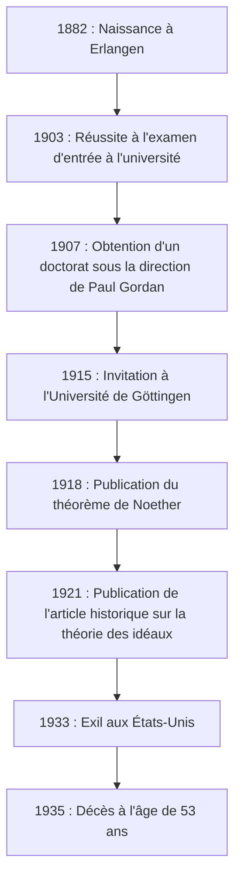
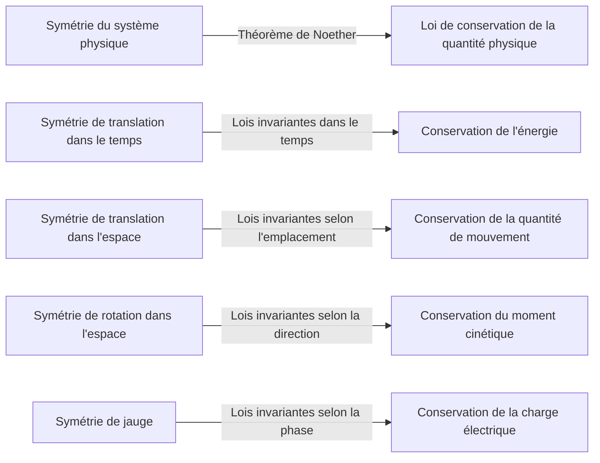
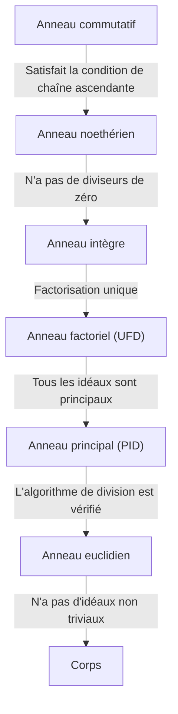

Dans l'histoire des mathématiques et de la physique, il existe un génie qui a apporté certaines des contributions les plus importantes, mais dont le nom n'est pas largement connu du grand public. Cette personne est la mathématicienne d'origine allemande **[Emmy Noether](https://kenji.blog/p/noether/)** (1882–1935). Souvent qualifiée de « Mère de l'algèbre moderne », elle a complètement transformé le domaine de l'algèbre abstraite. De plus, en physique, elle a prouvé le **théorème de Noether**, qui relie élégamment la symétrie aux lois de conservation, jetant ainsi les bases de la théorie de la relativité générale d'Einstein et de la physique des particules moderne.

À sa mort, Albert Einstein a écrit un hommage dans le New York Times : « Selon le jugement des mathématiciens vivants les plus compétents, Mademoiselle Noether était le génie mathématique créatif le plus important produit à ce jour depuis le début de l'enseignement supérieur pour les femmes. » Dans cet article, nous explorerons en détail la vie d'[Emmy Noether](https://kenji.blog/p/noether/), qui a surmonté de nombreuses difficultés et conservé une passion pure pour l'érudition, ainsi que l'immense héritage qu'elle a laissé derrière elle.

## 1. Jeunesse et premières difficultés

Amalie [Emmy Noether](https://kenji.blog/p/noether/) est née le 23 mars 1882 à Erlangen, en Bavière (Allemagne). Son père, Max Noether, était également un éminent mathématicien qui a apporté d'importantes contributions à la géométrie algébrique. La famille Noether était d'origine juive, et elle a grandi dans un environnement familial qui valorisait grandement la poursuite des études.

Cependant, dans la société allemande de l'époque, il était extrêmement difficile pour les femmes de poursuivre une carrière universitaire. Les femmes n'étaient pas autorisées à s'inscrire comme étudiantes régulières dans les universités, et même assister aux cours en tant qu'auditrice libre nécessitait une autorisation spéciale des professeurs. La jeune Emmy excellait en langues et obtint initialement des qualifications pour devenir professeure de français et d'anglais, mais son cœur fut progressivement captivé par les mathématiques.

En 1900, elle commença à suivre des cours de mathématiques à l'Université d'Erlangen en tant qu'auditrice. Parmi des centaines d'étudiants, il n'y avait que deux femmes, dont elle-même. Elle fit preuve d'un talent mathématique exceptionnel et réussit l'examen de qualification d'entrée à l'université (Abitur) à Nuremberg en 1903. Par la suite, elle étudia comme auditrice à l'Université de Göttingen, assistant aux cours de certains des plus grands mathématiciens et physiciens de l'époque, tels que Karl Schwarzschild, Hermann Minkowski, Felix Klein et [David Hilbert](https://kenji.blog/p/hilbert/).

## 2. L'obtention de son doctorat et les années sans récompense

En 1904, l'Université d'Erlangen autorisa enfin l'inscription régulière des femmes, et Noether s'inscrivit immédiatement au programme de diplôme en mathématiques. Elle fit progresser ses recherches sous la direction de Paul Gordan, une autorité en matière de théorie des invariants, et obtint en 1907 son doctorat avec les plus grands honneurs pour sa thèse intitulée « Sur les systèmes complets d'invariants pour les formes biquadratiques ternaires ». Dans cet article, elle démontra l'apogée de sa puissance de calcul et de sa patience en calculant de manière exhaustive 331 invariants spécifiques.

Malgré l'obtention de son doctorat, aucun poste universitaire ne lui était proposé, simplement parce qu'elle était une femme. Elle poursuivit ses recherches à l'Université d'Erlangen sans être payée, remplaçant parfois son père malade pour donner des cours. Au cours de cette période, son style de recherche passa de manière significative des méthodes constructives mettant l'accent sur les calculs concrets, comme celles de Gordan, aux méthodes plus abstraites et conceptuelles initiées par [David Hilbert](https://kenji.blog/p/hilbert/). Influencée également par Ernst Fischer, elle commença à ouvrir la porte de l'algèbre abstraite moderne.

## 3. Invitation à Göttingen et « Théorème de Noether »

En 1915, [David Hilbert](https://kenji.blog/p/hilbert/) et Felix Klein de l'Université de Göttingen invitèrent Noether à Göttingen pour aider à résoudre des problèmes mathématiques concernant la conservation de l'énergie dans la théorie de la relativité générale d'Albert Einstein. Sa profonde connaissance de la théorie des invariants était considérée comme indispensable.

Cependant, son éventuelle nomination en tant que membre régulier du corps professoral (Privatdozent) rencontra une opposition féroce de la part de professeurs d'autres disciplines de la Faculté de philosophie, là encore simplement parce qu'elle était une « femme ». Ils soutenaient : « Que penseront nos soldats lorsqu'ils retourneront à l'université et découvriront qu'ils sont tenus d'apprendre aux pieds d'une femme ? » À cela, Hilbert a répondu de manière célèbre :

> « Je ne vois pas en quoi le sexe de la candidate est un argument contre son admission en tant que Privatdozent. Après tout, nous sommes une université, pas un établissement de bains publics. »

En fin de compte, pendant ses premières années, elle fut contrainte de donner des cours sous le nom de Hilbert en tant qu'« assistante de Hilbert » sans rémunération. Pourtant, ses recherches ont produit une réalisation monumentale qui allait ébranler l'histoire de la physique. Il s'agit du **théorème de Noether**, publié en 1918.

### Expression mathématique du théorème de Noether

Le théorème de Noether a prouvé mathématiquement une vérité hautement universelle : « Si un système physique a une symétrie continue, il existe nécessairement une loi de conservation correspondante. » Considérons l'intégrale d'action $S$ basée sur le Lagrangien $L$.

$$
S = \int_{t_1}^{t_2} L(q_i, \dot{q}_i, t) dt
$$

Si le système est invariant (symétrique) sous une certaine transformation continue infinitésimale, la variation de l'intégrale d'action $\delta S$ est nulle.

$$
\delta S = 0 \quad \text{(Condition issue de la symétrie)}
$$

Selon le théorème de Noether, une quantité conservée $Q$ existe alors et reste invariante (conservée) au fil du temps.

$$
\frac{dQ}{dt} = 0
$$

Les applications spécifiques à la physique sont les suivantes :

Grâce à ce théorème, les physiciens pouvaient non seulement calculer des phénomènes individuels séparément, mais également déduire les lois de conservation sous-jacentes en trouvant « quelles symétries existent ». Le modèle standard de la physique des particules moderne et la théorie quantique des champs reposent essentiellement sur des extensions du théorème de Noether.

## 4. Établissement de l'algèbre abstraite et anneaux noethériens

Après avoir laissé sa marque révolutionnaire en physique, Noether s'est reconcentrée sur les mathématiques, plus précisément sur **l'algèbre abstraite**. Dans les années 1920, elle a jeté à elle seule les bases de la théorie des anneaux et de la théorie des idéaux étudiées par les mathématiciens modernes.

Son article de 1921 « Théorie des idéaux dans les domaines d'anneaux » (Idealtheorie in Ringbereichen) est considéré comme l'un des articles les plus importants de l'histoire des mathématiques. Elle y formule le concept de « Condition de chaîne ascendante » (ACC).

### Condition de chaîne ascendante et définition des anneaux noethériens

Supposons qu'une suite d'idéaux dans un anneau $R$ ait la relation d'inclusion suivante :

$$
I_1 \subseteq I_2 \subseteq I_3 \subseteq \cdots \subseteq I_n \subseteq \cdots
$$

S'il existe un entier positif $N$ tel que pour tout $n \ge N$,

$$
I_n = I_N \quad \text{(L'idéal ne grandit plus)}
$$

est vrai, alors cet anneau $R$ est appelé un **anneau noethérien**.

En utilisant uniquement cette condition remarquablement simple et abstraite, Noether a brillamment prouvé de nombreux théorèmes complexes en théorie des nombres et en géométrie algébrique (tels que la décomposition primaire des idéaux via le théorème de Lasker-Noether). Sa méthode consistant à extraire les propriétés inhérentes des structures pour les preuves, plutôt que de s'appuyer sur des calculs concrets, a déclenché un changement de paradigme en mathématiques.

Cette approche a ensuite été compilée dans le chef-d'œuvre « Algèbre moderne » (Moderne Algebra) par B.L. van der Waerden, qui a complètement transformé l'enseignement des mathématiques dans les universités du monde entier.

## 5. Les « garçons de Noether » et son vrai visage d'éducatrice

Noether n'était pas seulement une chercheuse exceptionnelle, mais aussi une éducatrice extraordinaire. Ses cours ne consistaient pas à copier des théories achevées sur un tableau noir, mais constituaient plutôt un processus très dynamique d'exploration de problèmes non résolus en discussion avec ses étudiants.

De brillants jeunes mathématiciens se rassemblaient constamment autour d'elle, et ils devinrent connus sous le nom de **« garçons de Noether »** (Noether-Knaben). De nombreux talents qui allaient plus tard diriger le monde mathématique, tels que Max Deuring, Jacob Levitzki et Emil Artin, ont appris sous sa direction.

Elle respectait les idées de ses étudiants, leur offrant parfois généreusement ses propres idées non publiées pour qu'ils les publient sous leur nom. Non liée par les formalités, elle adorait s'engager dans des discussions mathématiques passionnées tout en se promenant dans les rues de Göttingen ou en mangeant des gâteaux dans un café. Sa personnalité chaleureuse et généreuse était profondément aimée et respectée par nombre de ses étudiants.

## 6. La montée du nazisme et l'exil en Amérique

Au début des années 1930, les recherches de Noether progressèrent vers l'algèbre non commutative et la théorie des représentations, atteignant des sommets encore plus élevés. En 1932, elle prononça une allocution plénière au Congrès international des mathématiciens à Zurich, et sa renommée devint mondialement inébranlable.

Cependant, lorsque le parti nazi dirigé par Adolf Hitler prit le pouvoir en Allemagne en 1933, la situation changea radicalement. La « Loi pour la restauration de la fonction publique professionnelle » fut promulguée, entraînant le renvoi immédiat des fonctionnaires et des professeurs d'université d'origine juive. Noether fut expulsée de l'Université de Göttingen et privée de son lieu de recherche.

Des scientifiques du monde entier, dont Hermann Weyl et Albert Einstein, firent de grands efforts pour la sauver. En conséquence, elle obtint un poste de professeure invitée au Bryn Mawr College, un collège pour femmes de Pennsylvanie (États-Unis), et partit en exil. Elle a également donné des cours à l'Institute for Advanced Study de Princeton, inspirant énormément de jeunes mathématiciens dans sa nouvelle patrie, l'Amérique. Aux États-Unis, elle a enfin reçu la reconnaissance légitime et le respect qu'elle méritait en tant que chercheuse.

## 7. Tragédie soudaine et héritage éternel

En avril 1935, alors qu'elle commençait une vie de recherche épanouissante en Amérique, Noether subit une intervention chirurgicale pour enlever une tumeur pelvienne. L'opération semblait réussie, mais elle développa des complications quelques jours plus tard et décéda le 14 avril au jeune âge de 53 ans. Sa mort fut incroyablement soudaine et apporta une profonde tristesse à la communauté universitaire mondiale.

Ses restes sont enterrés sous l'allée de la bibliothèque du Bryn Mawr College.

Le mathématicien Norbert Wiener a fait cette remarque à son sujet : « Mademoiselle Noether est... la plus grande mathématicienne qui ait jamais vécu ; et la plus grande femme scientifique de toutes sortes vivant actuellement, et une érudite au moins sur le même plan que Madame Curie. »

Les concepts de l'algèbre abstraite initiés par [Emmy Noether](https://kenji.blog/p/noether/) continuent de s'écouler aux fondements de la cryptographie, de l'informatique et de la géométrie algébrique d'aujourd'hui. De plus, son théorème concernant la symétrie et les lois de conservation perpétue comme un langage indispensable à la physique de pointe, comme la découverte du boson de Higgs et l'étude des trous noirs.

Confrontée à la discrimination sexuelle, [Emmy Noether](https://kenji.blog/p/noether/) a simplement aimé les mathématiques purement et a continué à poursuivre la vérité. Son esprit indomptable et son intelligence écrasante continuent de nous donner une inspiration infinie à travers les âges.

---

*(Cet article a été rédigé pour honorer les réalisations d'[Emmy Noether](https://kenji.blog/p/noether/), et s'adresse à ceux qui s'intéressent à l'histoire des mathématiques et aux fondements de la physique.)*
