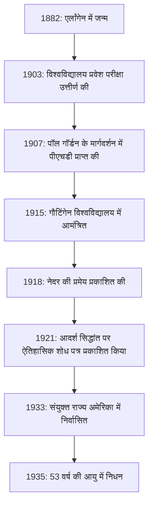
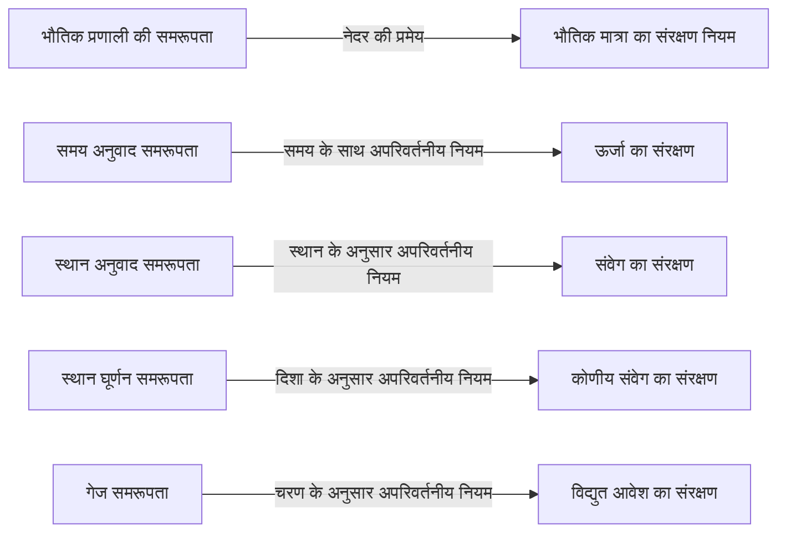
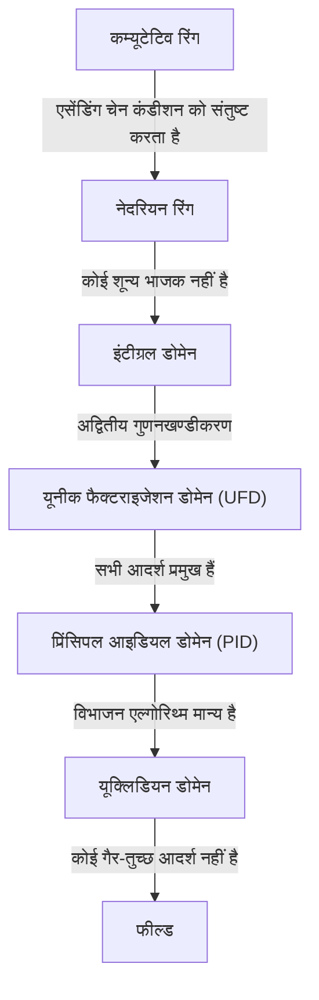

गणित और भौतिकी के इतिहास में, एक ऐसी प्रतिभा है जिसने कुछ सबसे महत्वपूर्ण योगदान दिए, फिर भी जिनका नाम आम जनता के बीच व्यापक रूप से ज्ञात नहीं है। वह व्यक्ति जर्मन में जन्मी गणितज्ञ **एमी नेदर** (1882-1935) हैं। अक्सर "आधुनिक बीजगणित की जननी" के रूप में प्रशंसित, उन्होंने अमूर्त बीजगणित के क्षेत्र को पूरी तरह से बदल दिया। इसके अलावा, भौतिकी में, उन्होंने **नेदर की प्रमेय** को सिद्ध किया, जो समरूपता को संरक्षण नियमों के साथ सुरुचिपूर्ण ढंग से जोड़ता है, जिसने आइंस्टीन के सामान्य सापेक्षता सिद्धांत और आधुनिक कण भौतिकी की नींव रखी।

उनके निधन पर, अल्बर्ट आइंस्टीन ने द न्यूयॉर्क टाइम्स में एक श्रद्धांजलि लिखी: "सबसे सक्षम जीवित गणितज्ञों के निर्णय में, फ्रौलीन नेदर महिलाओं की उच्च शिक्षा शुरू होने के बाद से अब तक पैदा हुई सबसे महत्वपूर्ण रचनात्मक गणितीय प्रतिभा थीं।" इस लेख में, हम एमी नेदर के जीवन का पूरी तरह से पता लगाएंगे, जिन्होंने कई कठिनाइयों को पार किया और छात्रवृत्ति के लिए एक शुद्ध जुनून बनाए रखा, और उनके द्वारा छोड़ी गई जबरदस्त विरासत।

## 1. प्रारंभिक जीवन और शुरुआती कठिनाइयाँ

अमाली एमी नेदर का जन्म 23 मार्च, 1882 को एर्लांगेन, बवेरिया, जर्मनी में हुआ था। उनके पिता, मैक्स नेदर, भी एक प्रमुख गणितज्ञ थे जिन्होंने बीजगणितीय ज्यामिति में महत्वपूर्ण योगदान दिया था। नेदर परिवार यहूदी वंश का था, और वह ऐसे घरेलू वातावरण में पली-बढ़ीं जहाँ अकादमिक खोज को अत्यधिक महत्व दिया जाता था।

हालाँकि, उस समय के जर्मन समाज में, महिलाओं के लिए शिक्षा के क्षेत्र में आगे बढ़ना बेहद मुश्किल था। महिलाओं को विश्वविद्यालयों में नियमित छात्रों के रूप में नामांकन करने की अनुमति नहीं थी, और यहाँ तक कि एक श्रोता के रूप में व्याख्यान में भाग लेने के लिए भी प्रोफेसरों से विशेष अनुमति की आवश्यकता होती थी। युवा एमी भाषाओं में उत्कृष्ट थीं और शुरू में फ्रांसीसी और अंग्रेजी शिक्षक बनने की योग्यता प्राप्त की, लेकिन उनका हृदय धीरे-धीरे गणित की ओर आकर्षित हो गया।

1900 में, उन्होंने एर्लांगेन विश्वविद्यालय में एक श्रोता के रूप में गणित के व्याख्यान लेना शुरू किया। सैकड़ों छात्रों के बीच, उनके सहित केवल दो महिलाएँ थीं। उन्होंने असाधारण गणितीय प्रतिभा का प्रदर्शन किया और 1903 में नूर्नबर्ग में विश्वविद्यालय प्रवेश योग्यता परीक्षा (अबितुर) उत्तीर्ण की। इसके बाद, उन्होंने गौटिंगेन विश्वविद्यालय में एक श्रोता के रूप में अध्ययन किया, जहाँ कार्ल श्वार्ज़चाइल्ड, हरमन मिन्कोव्स्की, फेलिक्स क्लेन और डेविड हिल्बर्ट जैसे युग के कुछ महानतम गणितज्ञों और भौतिक विज्ञानियों के व्याख्यान सुने।

## 2. पीएचडी अर्जित करना और बिना पुरस्कार के वर्ष

1904 में, एर्लांगेन विश्वविद्यालय ने अंततः महिलाओं के नियमित नामांकन की अनुमति दी, और नेदर ने तुरंत गणित डिग्री कार्यक्रम के लिए पंजीकरण किया। उन्होंने अपरिवर्तनीय सिद्धांत (Invariant theory) के अधिकार वाले पॉल गॉर्डन के मार्गदर्शन में अपने शोध को आगे बढ़ाया, और 1907 में "अपरिवर्तनीयों की पूर्ण प्रणालियों पर" अपने शोध प्रबंध के लिए सर्वोच्च सम्मान के साथ अपनी पीएचडी अर्जित की। इस शोध पत्र में, उन्होंने 331 विशिष्ट अपरिवर्तनीयों की विस्तृत गणना करके कम्प्यूटेशनल शक्ति और धैर्य के शिखर का प्रदर्शन किया।

अपनी डॉक्टरेट की उपाधि अर्जित करने के बावजूद, उनके लिए कोई भी विश्वविद्यालय पद उपलब्ध नहीं था क्योंकि वह एक महिला थीं। उन्होंने बिना वेतन के एर्लांगेन विश्वविद्यालय में अपना शोध जारी रखा, कभी-कभी व्याख्यान देने के लिए अपने बीमार पिता की जगह ली। इस अवधि के दौरान, उनकी शोध शैली गॉर्डन के ठोस गणनाओं पर जोर देने वाले रचनात्मक तरीकों से डेविड हिल्बर्ट द्वारा शुरू किए गए अधिक अमूर्त और वैचारिक तरीकों में काफी बदल गई। अर्न्स्ट फिशर से प्रभावित होकर, उन्होंने आधुनिक अमूर्त बीजगणित का दरवाजा खोलना शुरू किया।

## 3. गौटिंगेन का निमंत्रण और "नेदर की प्रमेय"

1915 में, गौटिंगेन विश्वविद्यालय के डेविड हिल्बर्ट और फेलिक्स क्लेन ने अल्बर्ट आइंस्टीन के सामान्य सापेक्षता सिद्धांत में ऊर्जा के संरक्षण से संबंधित गणितीय समस्याओं को हल करने में मदद के लिए नेदर को गौटिंगेन आमंत्रित किया। अपरिवर्तनीय सिद्धांत का उनका गहरा ज्ञान अपरिहार्य माना जाता था।

हालाँकि, एक नियमित संकाय सदस्य (Privatdozent) के रूप में उनकी संभावित नियुक्ति को दर्शनशास्त्र संकाय के भीतर अन्य विषयों के प्रोफेसरों के भयंकर विरोध का सामना करना पड़ा, फिर से सिर्फ इसलिए कि वह एक "महिला" थीं। उन्होंने तर्क दिया, "हमारे सैनिक क्या सोचेंगे जब वे विश्वविद्यालय लौटेंगे और पाएंगे कि उन्हें एक महिला के चरणों में सीखना होगा?" इस पर, हिल्बर्ट ने प्रसिद्ध रूप से जवाब दिया:

> "मुझे नहीं लगता कि उम्मीदवार का लिंग प्राइवडोज़ेंट के रूप में उसके प्रवेश के खिलाफ कोई तर्क है। आखिरकार, हम एक विश्वविद्यालय हैं, कोई स्नानघर नहीं।"

अंततः, अपने पहले कुछ वर्षों तक, उन्हें बिना वेतन के "हिल्बर्ट के सहायक" के रूप में हिल्बर्ट के नाम से व्याख्यान देने के लिए मजबूर होना पड़ा। फिर भी, उनके शोध ने एक स्मारकीय उपलब्धि हासिल की जो भौतिकी के इतिहास को हिला देगी। यह 1918 में प्रकाशित **नेदर की प्रमेय** थी।

### नेदर की प्रमेय की गणितीय अभिव्यक्ति

नेदर की प्रमेय ने गणितीय रूप से एक अत्यंत सार्वभौमिक सत्य को सिद्ध किया: "यदि किसी भौतिक प्रणाली में एक निरंतर समरूपता है, तो आवश्यक रूप से एक संबंधित संरक्षण नियम होता है।" लैग्रेंजियन $L$ के आधार पर क्रिया अभिन्न $S$ पर विचार करें।

$$
S = \int_{t_1}^{t_2} L(q_i, \dot{q}_i, t) dt
$$

यदि प्रणाली किसी निश्चित अतिसूक्ष्म निरंतर परिवर्तन के तहत अपरिवर्तनीय (सममित) है, तो क्रिया अभिन्न $\delta S$ की भिन्नता शून्य है।

$$
\delta S = 0 \quad \text{(समरूपता के कारण शर्त)}
$$

नेदर की प्रमेय के अनुसार, तब एक संरक्षित मात्रा $Q$ मौजूद होती है और समय के साथ अपरिवर्तनीय (संरक्षित) रहती है।

$$
\frac{dQ}{dt} = 0
$$

भौतिकी में विशिष्ट अनुप्रयोग इस प्रकार हैं:

इस प्रमेय के कारण, भौतिक विज्ञानी न केवल व्यक्तिगत घटनाओं की अलग-अलग गणना कर सकते थे, बल्कि "कौन सी समरूपता मौजूद है" यह जानकर अंतर्निहित संरक्षण नियमों का अनुमान भी लगा सकते थे। आधुनिक कण भौतिकी का मानक मॉडल और क्वांटम क्षेत्र सिद्धांत अनिवार्य रूप से नेदर की प्रमेय के विस्तार पर निर्मित हैं।

## 4. अमूर्त बीजगणित और नेदरियन रिंग्स की स्थापना

भौतिकी में अपनी अभूतपूर्व छाप छोड़ने के बाद, नेदर ने फिर से गणित, विशेष रूप से **अमूर्त बीजगणित** पर ध्यान केंद्रित किया। 1920 के दशक में, उन्होंने अकेले ही रिंग थ्योरी और आइडियल थ्योरी की नींव रखी जिसका अध्ययन आधुनिक गणितज्ञ करते हैं।

उनका 1921 का पेपर "रिंग डोमेन में आइडियल थ्योरी" (Idealtheorie in Ringbereichen) गणित के इतिहास में सबसे महत्वपूर्ण शोध पत्रों में से एक माना जाता है। इसमें, उन्होंने "एसेंडिंग चेन कंडीशन" (ACC) की अवधारणा तैयार की।

### एसेंडिंग चेन कंडीशन और नेदरियन रिंग्स की परिभाषा

मान लीजिए कि एक रिंग $R$ में आदर्शों (ideals) के अनुक्रम का निम्नलिखित समावेशन संबंध है:

$$
I_1 \subseteq I_2 \subseteq I_3 \subseteq \cdots \subseteq I_n \subseteq \cdots
$$

यदि कोई धनात्मक पूर्णांक $N$ मौजूद है, ताकि सभी $n \ge N$ के लिए,

$$
I_n = I_N \quad \text{(आदर्श अब और बड़ा नहीं होता है)}
$$

सत्य हो, तो इस रिंग $R$ को **नेदरियन रिंग** कहा जाता है।

केवल इस उल्लेखनीय सरल और अमूर्त स्थिति का उपयोग करते हुए, नेदर ने संख्या सिद्धांत और बीजगणितीय ज्यामिति (जैसे लास्कर-नेदर प्रमेय के माध्यम से आदर्शों के प्राथमिक अपघटन) में कई जटिल प्रमेयों को शानदार ढंग से सिद्ध किया। ठोस गणनाओं पर निर्भर रहने के बजाय प्रमाण के लिए संरचनाओं के अंतर्निहित गुणों को निकालने के उनके तरीके ने गणित में एक आदर्श बदलाव ला दिया।

इस दृष्टिकोण को बाद में बी.एल. वैन डेर वेर्डन द्वारा उत्कृष्ट कृति "मॉडर्न अलजेब्रा" (Moderne Algebra) में संकलित किया गया, जिसने दुनिया भर के विश्वविद्यालयों में गणित की शिक्षा को पूरी तरह से बदल दिया।

## 5. "नेदर के लड़के" और एक शिक्षक के रूप में उनका असली चेहरा

नेदर न केवल एक उत्कृष्ट शोधकर्ता थीं, बल्कि एक असाधारण शिक्षक भी थीं। उनके व्याख्यान एक ब्लैकबोर्ड पर पूर्ण सिद्धांतों की नकल करने के बारे में नहीं थे, बल्कि अपने छात्रों के साथ चर्चा में अनसुलझी समस्याओं की खोज करने की एक अत्यधिक गतिशील प्रक्रिया थी।

शानदार युवा गणितज्ञ लगातार उनके इर्द-गिर्द इकट्ठा होते थे, और वे **"नेदर के लड़के"** (Noether-Knaben) के रूप में जाने जाते थे। कई प्रतिभाएं जो बाद में गणितीय दुनिया का नेतृत्व करेंगी, जैसे कि मैक्स ड्योरिंग, जैकब लेविट्ज़की और एमिल आर्टिन, ने उनके मार्गदर्शन में सीखा।

उन्होंने अपने छात्रों के विचारों का सम्मान किया, कभी-कभी उन्हें अपने नाम से प्रकाशित करने के लिए उदारतापूर्वक अपने स्वयं के अप्रकाशित विचारों की पेशकश की। औपचारिकताओं से मुक्त होकर, उन्हें गौटिंगेन की सड़कों पर चलते हुए या कैफे में केक खाते हुए भावुक गणितीय चर्चाओं में शामिल होना पसंद था। उनके कई छात्रों द्वारा उनके गर्म और उदार व्यक्तित्व को गहरा प्यार और सम्मान दिया गया।

## 6. नाजियों का उदय और अमेरिका में निर्वासन

1930 के दशक में प्रवेश करते हुए, नेदर का शोध गैर-विनिमेय बीजगणित और प्रतिनिधित्व सिद्धांत में आगे बढ़ा, जो और भी अधिक ऊंचाइयों तक पहुंच गया। 1932 में, उन्होंने ज्यूरिख में गणितज्ञों की अंतर्राष्ट्रीय कांग्रेस में एक पूर्ण भाषण दिया, और उनकी प्रसिद्धि विश्व स्तर पर अडिग हो गई।

हालाँकि, जब एडॉल्फ हिटलर के नेतृत्व वाली नाजी पार्टी ने 1933 में जर्मनी में सत्ता पर कब्जा कर लिया, तो स्थिति काफी बदल गई। "पेशेवर सिविल सेवा की बहाली के लिए कानून" लागू किया गया, जिससे यहूदी मूल के सिविल सेवकों और विश्वविद्यालय के शिक्षकों को तत्काल बर्खास्त कर दिया गया। नेदर को गौटिंगेन विश्वविद्यालय से निष्कासित कर दिया गया और उनके शोध के स्थान से वंचित कर दिया गया।

हरमन वेइल और अल्बर्ट आइंस्टीन सहित दुनिया भर के वैज्ञानिकों ने उन्हें बचाने के लिए कड़े प्रयास किए। परिणामस्वरूप, उन्होंने अमेरिका के पेंसिल्वेनिया में एक महिला कॉलेज, ब्रिन मॉर कॉलेज में विजिटिंग प्रोफेसर के रूप में एक पद हासिल किया और निर्वासन में चली गईं। उन्होंने प्रिंसटन में इंस्टीट्यूट फॉर एडवांस्ड स्टडी में भी व्याख्यान दिया, जिससे उनके नए घर, अमेरिका में युवा गणितज्ञों को जबरदस्त प्रेरणा मिली। संयुक्त राज्य अमेरिका में, अंततः उन्हें एक शोधकर्ता के रूप में उचित मान्यता और सम्मान मिला जिसकी वह हकदार थीं।

## 7. अचानक त्रासदी और शाश्वत विरासत

अप्रैल 1935 में, जब वह अमेरिका में एक पूर्ण शोध जीवन शुरू कर रही थीं, नेदर ने श्रोणि ट्यूमर को हटाने के लिए सर्जरी करवाई। सर्जरी सफल प्रतीत हुई, लेकिन कुछ दिनों बाद उन्हें जटिलताएं विकसित हुईं और 14 अप्रैल को 53 वर्ष की कम उम्र में उनका निधन हो गया। उनकी मृत्यु अविश्वसनीय रूप से अचानक थी और वैश्विक शैक्षणिक समुदाय में गहरा दुख लेकर आई।

उनके अवशेष ब्रिन मॉर कॉलेज में पुस्तकालय के मार्ग के नीचे दबे हुए हैं।

गणितज्ञ नॉर्बर्ट वीनर ने उन पर टिप्पणी की: "मिस नेदर... अब तक की सबसे महान महिला गणितज्ञ हैं; और वर्तमान में जीवित किसी भी प्रकार की सबसे महान महिला वैज्ञानिक हैं, और कम से कम मैडम क्यूरी के स्तर की एक विद्वान हैं।"

एमी नेदर द्वारा शुरू किए गए अमूर्त बीजगणित के विचार आज के क्रिप्टोग्राफी, कंप्यूटर विज्ञान और बीजगणितीय ज्यामिति की नींव में प्रवाहित होते रहते हैं। इसके अलावा, समरूपता और संरक्षण नियमों के संबंध में उनका प्रमेय हिग्स बोसॉन की खोज और ब्लैक होल के अध्ययन जैसी अत्याधुनिक भौतिकी में एक अपरिहार्य भाषा के रूप में जीवित है।

लिंग भेदभाव का सामना करते हुए, एमी नेदर ने गणित से विशुद्ध रूप से प्यार किया और सच्चाई की खोज जारी रखी। उनकी अदम्य भावना और असीम बुद्धि युगों-युगों तक हमें अनंत प्रेरणा देती रहती है।

---

*(यह लेख एमी नेदर की उपलब्धियों का सम्मान करने के लिए लिखा गया था, जो गणित के इतिहास और भौतिकी की नींव में रुचि रखने वालों के लिए लक्षित है।)*
