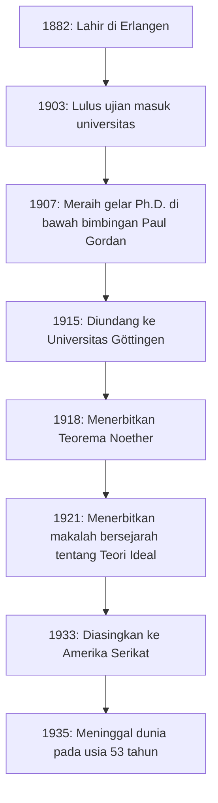
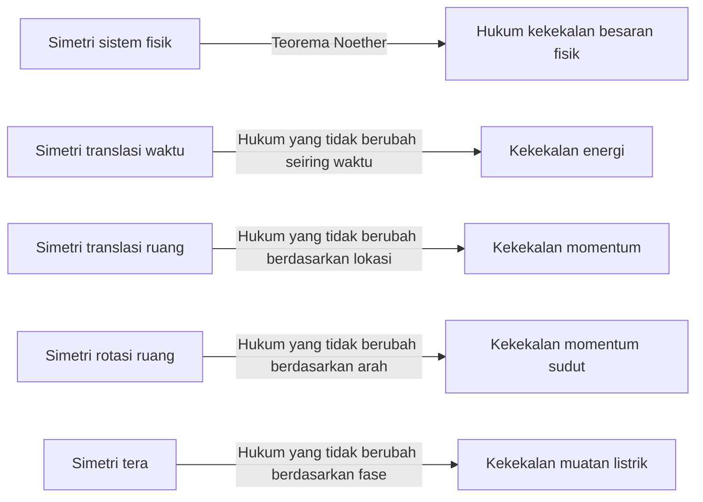
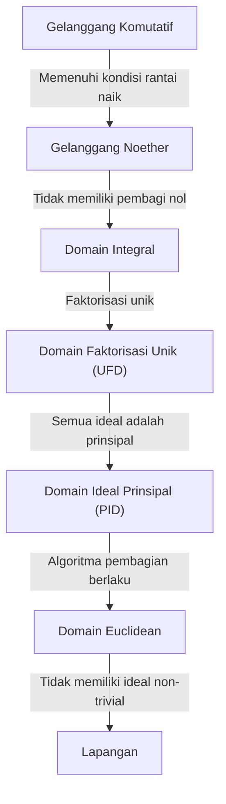

Dalam sejarah matematika dan fisika, terdapat seorang jenius yang memberikan beberapa kontribusi paling signifikan, namun namanya tidak banyak dikenal oleh masyarakat umum. Orang tersebut adalah matematikawan kelahiran Jerman, **[Emmy Noether](https://kenji.blog/id/p/noether/)** (1882–1935). Sering dijuluki sebagai "Ibu Aljabar Modern", dia benar-benar mengubah bidang aljabar abstrak. Selanjutnya, dalam bidang fisika, dia membuktikan **Teorema Noether**, yang dengan elegan menghubungkan simetri dengan hukum kekekalan, meletakkan dasar bagi teori relativitas umum Einstein dan fisika partikel modern.

Setelah kematiannya, Albert Einstein menulis penghormatan di The New York Times yang menyatakan: "Dalam penilaian para matematikawan hidup yang paling kompeten, Fräulein Noether adalah jenius matematika kreatif paling signifikan yang pernah dihasilkan sejak dimulainya pendidikan tinggi bagi perempuan." Dalam artikel ini, kita akan menjelajahi secara menyeluruh kehidupan [Emmy Noether](https://kenji.blog/id/p/noether/), yang mengatasi berbagai kesulitan dan mempertahankan hasrat murni terhadap ilmu pengetahuan, serta warisan luar biasa yang ditinggalkannya.

## 1. Kehidupan Awal dan Kesulitan Awal

Amalie [Emmy Noether](https://kenji.blog/id/p/noether/) lahir pada tanggal 23 Maret 1882, di Erlangen, Bavaria, Jerman. Ayahnya, Max Noether, juga seorang ahli matematika terkemuka yang memberikan kontribusi signifikan pada geometri aljabar. Keluarga Noether adalah keturunan Yahudi, dan ia tumbuh dalam lingkungan rumah yang sangat menghargai pengejaran akademis.

Namun, dalam masyarakat Jerman pada saat itu, sangat sulit bagi perempuan untuk mengejar karir akademis. Perempuan tidak diizinkan untuk mendaftar sebagai mahasiswa reguler di universitas, dan bahkan untuk menghadiri kuliah sebagai pendengar memerlukan izin khusus dari para profesor. Emmy muda unggul dalam bidang bahasa dan pada awalnya memperoleh kualifikasi untuk menjadi guru bahasa Prancis dan Inggris, tetapi hatinya perlahan-lapan terpikat oleh matematika.

Pada tahun 1900, ia mulai mengikuti kuliah matematika di Universitas Erlangen sebagai pendengar. Di antara ratusan mahasiswa, hanya ada dua perempuan, termasuk dirinya. Ia menunjukkan bakat matematika yang luar biasa dan lulus ujian kualifikasi masuk universitas (Abitur) di Nuremberg pada tahun 1903. Selanjutnya, ia belajar sebagai pendengar di Universitas Göttingen, menghadiri kuliah-kuliah dari beberapa matematikawan dan fisikawan terhebat pada masa itu, seperti Karl Schwarzschild, Hermann Minkowski, Felix Klein, dan [David Hilbert](https://kenji.blog/id/p/hilbert/).

## 2. Meraih Gelar Ph.D. dan Tahun-tahun Tanpa Penghargaan

Pada tahun 1904, Universitas Erlangen akhirnya mengizinkan pendaftaran reguler bagi perempuan, dan Noether segera mendaftar untuk program gelar matematika. Ia memajukan penelitiannya di bawah bimbingan Paul Gordan, seorang ahli dalam teori invarian, dan pada tahun 1907 ia meraih gelar Ph.D. dengan pujian tertinggi untuk disertasinya yang berjudul "Sistem Invarian Lengkap untuk Bentuk Bikuadratik Terner". Dalam makalah ini, ia menunjukkan puncak kekuatan komputasi dan kesabaran dengan menghitung secara mendalam 331 invarian spesifik.

Meskipun meraih gelar doktornya, tidak ada posisi universitas yang tersedia untuknya hanya karena ia seorang perempuan. Ia melanjutkan penelitiannya di Universitas Erlangen tanpa bayaran, terkadang menggantikan ayahnya yang sakit untuk memberikan kuliah. Selama periode ini, gaya penelitiannya bergeser secara signifikan dari metode konstruktif yang menekankan perhitungan konkret, seperti milik Gordan, ke metode yang lebih abstrak dan konseptual yang dipelopori oleh [David Hilbert](https://kenji.blog/id/p/hilbert/). Dipengaruhi juga oleh Ernst Fischer, ia mulai membuka pintu menuju aljabar abstrak modern.

## 3. Undangan ke Göttingen dan "Teorema Noether"

Pada tahun 1915, [David Hilbert](https://kenji.blog/id/p/hilbert/) dan Felix Klein dari Universitas Göttingen mengundang Noether ke Göttingen untuk membantu memecahkan masalah matematika terkait kekekalan energi dalam teori relativitas umum Albert Einstein. Pengetahuannya yang mendalam tentang teori invarian dianggap sangat diperlukan.

Namun, kemungkinan pengangkatannya sebagai anggota fakultas reguler (Privatdozent) mendapat tentangan sengit dari para profesor di disiplin ilmu lain di dalam Fakultas Filsafat, sekali lagi hanya karena ia adalah seorang "perempuan". Mereka berargumen, "Apa yang akan dipikirkan tentara kita ketika mereka kembali ke universitas dan menemukan bahwa mereka diharuskan belajar di bawah kaki seorang perempuan?" Menanggapi hal ini, Hilbert memberikan jawaban yang terkenal:

> "Saya tidak melihat bahwa jenis kelamin kandidat adalah argumen yang menentang penerimaannya sebagai Privatdozent. Bagaimanapun, kita adalah universitas, bukan pemandian umum."

Pada akhirnya, selama beberapa tahun pertamanya, ia terpaksa memberikan kuliah di bawah nama Hilbert sebagai "asisten Hilbert" tanpa bayaran. Namun, penelitiannya menghasilkan pencapaian monumental yang akan mengguncang sejarah fisika. Ini adalah **Teorema Noether**, yang diterbitkan pada tahun 1918.

### Ekspresi Matematis Teorema Noether

Teorema Noether secara matematis membuktikan kebenaran yang sangat universal: "Jika suatu sistem fisik memiliki simetri kontinu, maka sistem tersebut pasti memiliki hukum kekekalan yang sesuai." Pertimbangkan integral aksi $S$ berdasarkan Lagrangian $L$.

$$
S = \int_{t_1}^{t_2} L(q_i, \dot{q}_i, t) dt
$$

Jika sistem tidak berubah (simetris) di bawah transformasi kontinu yang sangat kecil tertentu, variasi dari integral aksi $\delta S$ adalah nol.

$$
\delta S = 0 \quad \text{(Kondisi akibat simetri)}
$$

Menurut Teorema Noether, maka terdapat suatu besaran kekal $Q$ dan tetap tidak berubah (kekal) seiring berjalannya waktu.

$$
\frac{dQ}{dt} = 0
$$

Aplikasi spesifik dalam fisika adalah sebagai berikut:

Berkat teorema ini, fisikawan tidak hanya dapat menghitung fenomena individu secara terpisah tetapi juga menyimpulkan hukum kekekalan yang mendasarinya dengan menemukan "simetri apa yang ada". Model Standar fisika partikel modern dan teori medan kuantum pada dasarnya dibangun di atas perluasan Teorema Noether.

## 4. Pembentukan Aljabar Abstrak dan Gelanggang Noether

Setelah meninggalkan jejak inovatifnya dalam fisika, Noether kembali fokus pada matematika, khususnya **aljabar abstrak**. Pada tahun 1920-an, ia seorang diri meletakkan dasar teori gelanggang dan teori ideal yang dipelajari oleh matematikawan modern.

Makalahnya pada tahun 1921 "Teori Ideal dalam Domain Gelanggang" (Idealtheorie in Ringbereichen) dianggap sebagai salah satu makalah paling penting dalam sejarah matematika. Di dalamnya, ia merumuskan konsep "Kondisi Rantai Naik" (ACC).

### Kondisi Rantai Naik dan Definisi Gelanggang Noether

Misalkan suatu barisan ideal dalam suatu gelanggang $R$ memiliki relasi inklusi berikut:

$$
I_1 \subseteq I_2 \subseteq I_3 \subseteq \cdots \subseteq I_n \subseteq \cdots
$$

Jika terdapat bilangan bulat positif $N$ sedemikian rupa sehingga untuk semua $n \ge N$,

$$
I_n = I_N \quad \text{(Ideal tersebut tidak membesar lagi)}
$$

berlaku benar, maka gelanggang $R$ ini disebut sebagai **gelanggang Noether**.

Dengan hanya menggunakan kondisi yang sangat sederhana dan abstrak ini, Noether dengan brilian membuktikan banyak teorema kompleks dalam teori bilangan dan geometri aljabar (seperti dekomposisi primer dari ideal melalui teorema Lasker-Noether). Metodenya dalam mengekstraksi sifat bawaan dari struktur untuk pembuktian, alih-alih mengandalkan perhitungan konkret, memicu pergeseran paradigma dalam matematika.

Pendekatan ini kemudian disusun menjadi mahakarya "Aljabar Modern" (Moderne Algebra) oleh B.L. van der Waerden, yang sepenuhnya mengubah pendidikan matematika di universitas-universitas di seluruh dunia.

## 5. "Anak-anak Laki-laki Noether" dan Wajah Aslinya sebagai Pendidik

Noether bukan hanya seorang peneliti yang luar biasa tetapi juga seorang pendidik yang luar biasa. Kuliah-kuliahnya bukan tentang menyalin teori-teori yang sudah jadi ke papan tulis, melainkan sebuah proses eksplorasi masalah-masalah yang belum terpecahkan yang sangat dinamis dalam diskusi dengan mahasiswanya.

Matematikawan muda yang brilian terus-menerus berkumpul di sekelilingnya, dan mereka dikenal sebagai **"Anak-anak Laki-laki Noether"** (Noether-Knaben). Banyak bakat yang kemudian akan memimpin dunia matematika, seperti Max Deuring, Jacob Levitzki, dan Emil Artin, belajar di bawah bimbingannya.

Ia menghormati ide-ide mahasiswanya, kadang-kadang dengan murah hati menawarkan ide-idenya sendiri yang belum dipublikasikan untuk diterbitkan di bawah nama mereka. Tidak terikat oleh formalitas, ia suka terlibat dalam diskusi matematika yang penuh semangat sambil berjalan-jalan di jalanan Göttingen atau makan kue di sebuah kafe. Kepribadiannya yang hangat dan murah hati sangat dicintai dan dihormati oleh banyak mahasiswanya.

## 6. Kebangkitan Nazi dan Pengasingan ke Amerika

Memasuki tahun 1930-an, penelitian Noether berkembang ke arah aljabar non-komutatif dan teori representasi, mencapai tingkat yang lebih tinggi lagi. Pada tahun 1932, ia memberikan pidato pleno pada Kongres Ahli Matematika Internasional di Zurich, dan ketenarannya menjadi tak tergoyahkan secara global.

Namun, ketika Partai Nazi yang dipimpin oleh Adolf Hitler merebut kekuasaan di Jerman pada tahun 1933, situasinya berubah drastis. "Undang-Undang Pemulihan Pegawai Negeri Sipil Profesional" diberlakukan, yang menyebabkan pemecatan segera bagi pegawai negeri dan fakultas universitas keturunan Yahudi. Noether diusir dari Universitas Göttingen dan kehilangan tempat penelitiannya.

Ilmuwan dari seluruh dunia, termasuk Hermann Weyl dan Albert Einstein, melakukan upaya keras untuk menyelamatkannya. Akibatnya, ia mendapatkan posisi sebagai profesor tamu di Bryn Mawr College, sebuah perguruan tinggi khusus perempuan di Pennsylvania, AS, dan pergi ke pengasingan. Ia juga memberikan kuliah di Institute for Advanced Study di Princeton, memberikan inspirasi yang luar biasa kepada para matematikawan muda di rumah barunya, Amerika. Di Amerika Serikat, ia akhirnya menerima pengakuan dan rasa hormat yang sah sebagai seorang peneliti.

## 7. Tragedi Mendadak dan Warisan Abadi

Pada bulan April 1935, tepat ketika ia memulai kehidupan penelitian yang memuaskan di Amerika, Noether menjalani operasi untuk mengangkat tumor panggul. Operasi itu tampaknya berhasil, tetapi ia mengalami komplikasi beberapa hari kemudian dan meninggal dunia pada tanggal 14 April di usia muda, 53 tahun. Kematiannya sangat mendadak dan membawa kesedihan yang mendalam bagi komunitas akademik global.

Jenazahnya dimakamkan di bawah jalan setapak perpustakaan di Bryn Mawr College.

Matematikawan Norbert Wiener berkomentar tentang dirinya: "Nona Noether adalah... matematikawan wanita terhebat yang pernah hidup; dan ilmuwan wanita terhebat dalam bentuk apa pun yang hidup sekarang, dan seorang sarjana setidaknya pada tingkat Madame Curie."

Konsep aljabar abstrak yang dipelopori oleh [Emmy Noether](https://kenji.blog/id/p/noether/) terus mengalir di dasar kriptografi, ilmu komputer, dan geometri aljabar saat ini. Selanjutnya, teoremanya mengenai simetri dan hukum kekekalan terus hidup sebagai bahasa yang sangat diperlukan dalam fisika mutakhir, seperti penemuan boson Higgs dan studi tentang lubang hitam.

Menghadapi diskriminasi gender, [Emmy Noether](https://kenji.blog/id/p/noether/) hanya mencintai matematika secara murni dan terus mengejar kebenaran. Semangat pantang menyerah dan kecerdasannya yang luar biasa terus memberi kita inspirasi tanpa batas melintasi zaman.

---

*(Artikel ini ditulis untuk menghormati pencapaian [Emmy Noether](https://kenji.blog/id/p/noether/), ditujukan bagi mereka yang tertarik dengan sejarah matematika dan dasar-dasar fisika.)*
