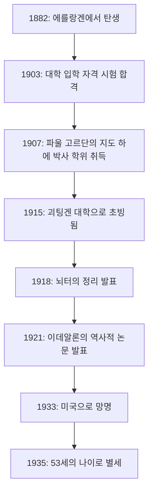
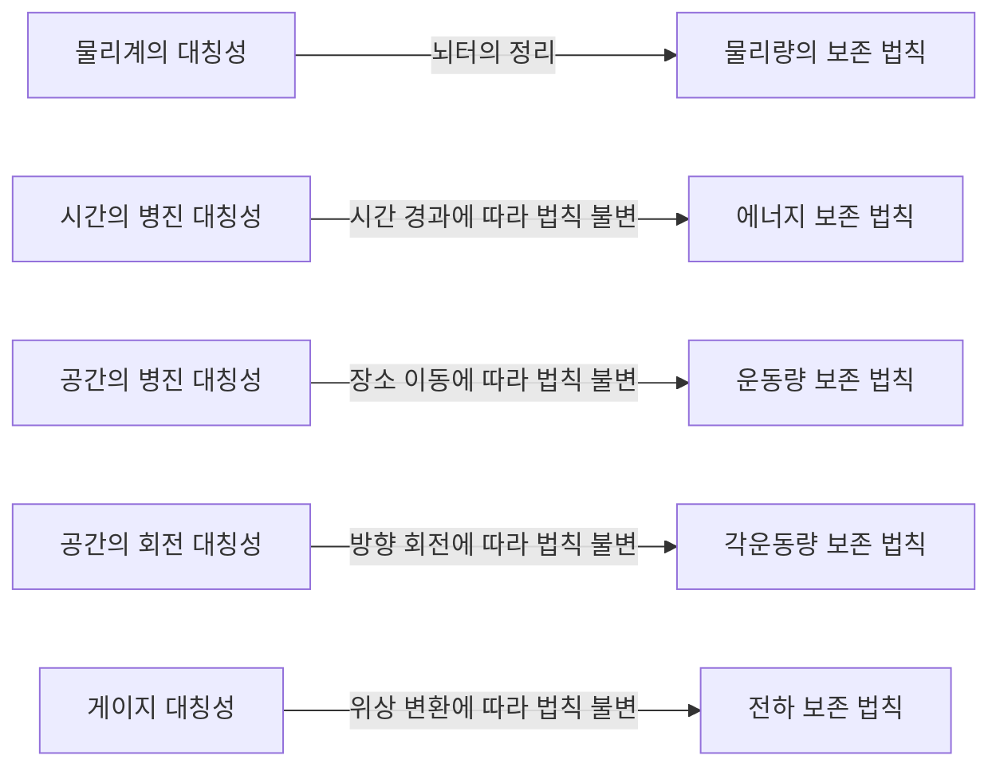
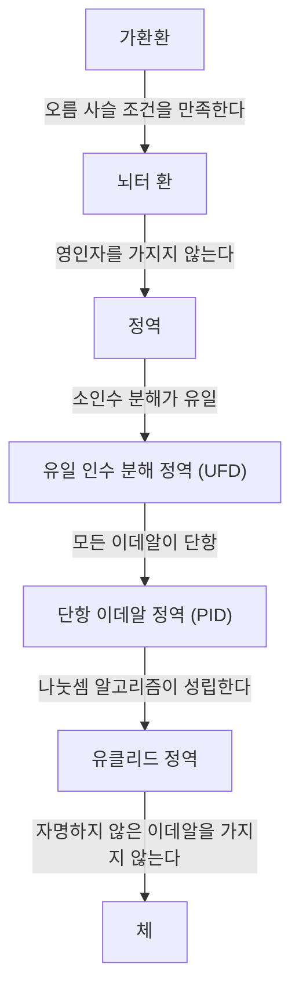

수학과 물리학의 역사에 있어서 가장 중요한 공헌을 한 인물 중 한 명임에도 불구하고, 대중에게 그 이름이 널리 알려지지 않은 천재가 존재합니다. 그 인물이 바로 독일 출신의 수학자 **[에미 뇌터](https://kenji.blog/ko/p/noether/)**([Emmy Noether](https://kenji.blog/ko/p/noether/), 1882–1935)입니다. 그녀는 '현대 대수학의 어머니'라고 불리며 추상 대수학이라는 분야를 근본적으로 바꿔 놓았습니다. 나아가 물리학 분야에서는 대칭성과 보존 법칙을 연결하는 **'뇌터의 정리'**를 증명하여, 아인슈타인의 일반 상대성 이론과 현대 입자 물리학의 기초를 다졌습니다.

알베르트 아인슈타인은 그녀의 죽음에 즈음하여 뉴욕 타임스에 다음과 같은 추도문을 기고했습니다. "가장 유능한 현존 수학자들의 판단에 따르면, 뇌터 양은 여성의 고등 교육이 시작된 이래 가장 위대한 창조적 수학 천재였습니다." 본 기사에서는 수많은 어려움을 극복하고 학문에 대한 순수한 열정을 불태웠던 [에미 뇌터](https://kenji.blog/ko/p/noether/)의 생애와 그녀가 남긴 위대한 업적에 대해 자세히 풀어보겠습니다.

## 1. 성장 배경과 초기의 어려움

아말리에 [에미 뇌터](https://kenji.blog/ko/p/noether/)는 1882년 3월 23일, 독일 바이에른주의 에를랑겐에서 태어났습니다. 그녀의 아버지인 막스 뇌터 또한 대수 기하학에 다대한 공헌을 한 저명한 수학자였습니다. 뇌터 가문은 유대계 집안이었으며, 학문을 중시하는 가정 환경 속에서 그녀는 자랐습니다.

하지만 당시 독일 사회에서 여성이 학문의 길을 걷는 것은 극히 어려웠습니다. 여성은 대학의 정규 학생으로 입학하는 것이 허락되지 않았고, 강의를 청강하는 것조차 교수진의 특별한 허가가 필요했습니다. 젊은 에미는 어학에 재능이 있어 처음에는 프랑스어와 영어 교사 자격을 취득했지만, 그녀의 마음은 점차 수학에 끌리게 되었습니다.

1900년, 그녀는 에를랑겐 대학에서 청강생으로서 수학 강의를 듣기 시작했습니다. 수백 명의 학생 중에서 여성은 그녀를 포함해 단 두 명뿐이었습니다. 그녀는 뛰어난 수학적 재능을 발휘하여 1903년 뉘른베르크에서 대학 입학 자격 시험(아비투어)에 합격합니다. 그 후 괴팅겐 대학에서도 청강생으로 공부하며 카를 슈바르츠실트, 헤르만 민코프스키, 펠릭스 클라인, [다비트 힐베르트](https://kenji.blog/ko/p/hilbert/) 등 당대 최고의 수학자 및 물리학자들의 강의에 참석했습니다.

## 2. 박사 학위 취득과 불우했던 시절

1904년, 마침내 에를랑겐 대학이 여성의 정규 입학을 허가하자 뇌터는 즉시 수학 학위 프로그램에 등록했습니다. 그녀는 불변식론의 권위자인 파울 고르단의 지도 하에 연구를 진행했고, 1907년 '3원 2차 형식의 완전계에 대하여'라는 논문으로 박사 학위(Ph.D.)를 최우수 성적으로 취득했습니다. 이 논문에서 그녀는 무려 331개의 불변식을 구체적으로 전부 계산해 내는, 계산력과 인내력의 극치를 보여주었습니다.

박사 학위를 취득했음에도 불구하고 여성이었던 그녀에게 대학의 자리는 마련되어 있지 않았습니다. 그녀는 에를랑겐 대학에서 무급으로, 때로는 병약한 아버지를 대신해 강의를 하며 자신의 연구를 계속했습니다. 이 시기 그녀의 연구 스타일은 고르단과 같은 구체적인 계산을 중시하는 구성적 수법에서 [다비트 힐베르트](https://kenji.blog/ko/p/hilbert/)와 같은 보다 추상적이고 개념적인 수법으로 크게 변화해 갔습니다. 에른스트 피셔의 영향도 받으며, 그녀는 현대적인 추상 대수학의 문을 열기 시작했던 것입니다.

## 3. 괴팅겐 대학 초빙과 '뇌터의 정리'

1915년, 괴팅겐 대학의 [다비트 힐베르트](https://kenji.blog/ko/p/hilbert/)와 펠릭스 클라인은 알베르트 아인슈타인의 일반 상대성 이론에서 에너지 보존 법칙에 관한 수학적인 문제를 해결하기 위해 뇌터를 괴팅겐으로 불렀습니다. 불변식론에 대한 그녀의 깊은 지식이 필수 불가결했기 때문입니다.

하지만 여기서도 '여성'이라는 이유로 그녀를 정규 교원(사강사, Privatdozent)으로 채용하는 것에 대해 철학부의 다른 분야 교수들로부터 맹렬한 반대가 일어났습니다. 그들은 "병사들이 전장에서 돌아왔을 때 여성 교원 밑에서 배워야 한다는 것을 알면 어떻게 생각하겠는가"라고 주장했습니다. 이에 대해 힐베르트는 다음과 같이 반박했다는 유명한 일화가 남아있습니다.

> "후보자의 성별이 사강사 채용의 장애가 된다고는 생각하지 않는다. 여기는 대학이지 공중목욕탕이 아니다."

결국 그녀는 처음 몇 년간 무급으로 '힐베르트의 조수'라는 명목 하에 힐베르트의 이름으로 강의를 해야만 했습니다. 하지만 그녀의 연구는 물리학의 역사를 뒤흔들 위대한 성과를 낳았습니다. 그것이 바로 1918년에 발표된 **'뇌터의 정리'**입니다.

### 뇌터의 정리의 수학적 표현

뇌터의 정리는 "물리계에 연속적인 대칭성이 존재하면 그에 수반하여 반드시 보존 법칙이 존재한다"는 지극히 보편적인 진리를 수학적으로 증명한 것입니다. 라그랑지안 $L$에 기반한 작용 적분 $S$를 생각합니다.

$$
S = \int_{t_1}^{t_2} L(q_i, \dot{q}_i, t) dt
$$

만약 계가 어떤 미소한 연속 변환에 대해 불변(대칭)이라면 작용 적분의 변분 $\delta S$는 0이 됩니다.

$$
\delta S = 0 \quad \text{(대칭성에 의한 조건)}
$$

이때 뇌터의 정리에 의하면, 보존량 $Q$가 존재하며 시간에 대해 불변(보존)이 됩니다.

$$
\frac{dQ}{dt} = 0
$$

물리학에 대한 구체적인 응용은 다음과 같습니다.

이 정리로 인해 물리학자들은 개별 현상을 따로 계산할 뿐만 아니라, "어떤 대칭성이 존재하는가"를 찾아냄으로써 그 이면에 있는 보존 법칙을 연역할 수 있게 되었습니다. 현대 소립자 물리학이나 양자장론의 표준 모형은 본질적으로 이 뇌터의 정리의 확장을 기반으로 구축되어 있습니다.

## 4. 추상 대수학의 확립과 뇌터 환

물리학에서 획기적인 업적을 남긴 후, 뇌터는 다시 수학, 특히 **추상 대수학** 분야에 주력했습니다. 1920년대에 그녀는 현대 수학자들이 배우는 환론과 이데알론의 기초를 단독으로 확립했습니다.

1921년에 발표된 논문 '환 영역에서의 이데알론'(Idealtheorie in Ringbereichen)은 수학의 역사에 있어서 가장 중요한 논문 중 하나로 여겨지고 있습니다. 이 논문에서 그녀는 '오름 사슬 조건'(Ascending Chain Condition, ACC)이라는 개념을 정식화했습니다.

### 오름 사슬 조건과 뇌터 환의 정의

환 $R$의 이데알의 열이 다음과 같이 포함 관계에 있다고 가정합니다.

$$
I_1 \subseteq I_2 \subseteq I_3 \subseteq \cdots \subseteq I_n \subseteq \cdots
$$

이때 어떤 양의 정수 $N$이 존재하여, 모든 $n \ge N$에 대해

$$
I_n = I_N \quad \text{(더 이상 이데알이 진정으로 커지지 않는다)}
$$

가 성립할 때, 이 환 $R$을 **'뇌터 환'**(Noetherian ring)이라고 부릅니다.

뇌터는 이 매우 단순하고 추상적인 조건만을 사용하여 정수론이나 대수 기하학의 수많은 복잡한 정리(예를 들어 라스커-뇌터 정리에 의한 이데알의 준소분해)를 훌륭하게 증명했습니다. 구체적인 계산에 의존하지 않고 구조 자체의 성질을 추출하여 증명을 수행하는 그녀의 수법은 수학의 패러다임 전환을 일으켰습니다.

이러한 접근법은 B.L. 판 데르 바르덴에 의해 명저 『현대 대수학』(Moderne Algebra)으로 정리되어 전 세계 대학의 수학 교육을 일변시키게 됩니다.

## 5. '뇌터의 소년들'과 교육자로서의 맨얼굴

뇌터는 뛰어난 연구자였을 뿐만 아니라 비범한 교육자이기도 했습니다. 그녀의 강의는 완성된 이론을 칠판에 베껴 쓰는 식의 수업이 아니라, 미해결 문제를 학생들과 함께 토론하며 탐구하는 매우 역동적인 것이었습니다.

그녀의 주변에는 항상 우수한 젊은 수학자들이 모여들었고, 이들은 **'뇌터의 소년들'**(Noether-Knaben)이라고 불렸습니다. 막스 도이링, 야코프 레비츠키, 에밀 아르틴 등 훗날 수학계를 이끌어갈 수많은 인재가 그녀의 가르침을 받았습니다.

그녀는 학생의 아이디어를 존중했으며, 때로는 자신의 미발표 아이디어를 아낌없이 학생에게 제공하여 그들의 이름으로 논문을 발표하게 하기도 했습니다. 형식에 얽매이지 않는 그녀는 괴팅겐 시내를 산책하거나 카페에서 케이크를 먹으면서 열정적으로 수학 토론을 나누는 것을 즐겼습니다. 그녀의 따뜻하고 관대한 인품은 많은 학생들로부터 깊은 존경을 받았습니다.

## 6. 나치의 대두와 미국으로의 망명

1930년대에 접어들면서 뇌터의 연구는 비가환 대수와 표현론으로 발전하며 한층 더 높은 경지에 이르렀습니다. 1932년에는 취리히에서 열린 세계 수학자 대회에서 기조 강연을 하는 등 그녀의 명성은 국제적으로 확고부동한 것이 되었습니다.

그러나 1933년 아돌프 히틀러가 이끄는 나치당이 독일의 정권을 장악하자 사태는 급변합니다. '직업 관리 재건법'이 제정되면서 유대계 공무원과 대학교수는 즉시 해고되었습니다. 뇌터 역시 괴팅겐 대학에서 쫓겨나 연구의 장을 빼앗기고 말았습니다.

헤르만 바일, 알베르트 아인슈타인 등 전 세계의 과학자들이 그녀를 구하기 위해 진력했습니다. 그 결과, 그녀는 미국 펜실베이니아주에 있는 여자 대학인 브린마 대학교의 객원 교수 직을 얻어 망명에 성공했습니다. 또한 프린스턴 고등연구소에서도 강의를 하며 새로운 터전인 미국에서도 젊은 수학자들에게 큰 영감을 주었습니다. 미국에서의 그녀는 마침내 여성 연구자로서 정당한 평가와 존경을 받을 수 있었습니다.

## 7. 갑작스러운 비극과 영원한 유산

미국에서 충실한 연구 생활을 시작한 직후인 1935년 4월, 뇌터는 골반의 종양을 적출하는 수술을 받았습니다. 수술 자체는 성공한 듯 보였지만 며칠 후 합병증을 일으켰고, 4월 14일에 53세라는 젊은 나이로 세상을 떠났습니다. 그 죽음은 너무나도 갑작스러웠으며 세계 학계에 깊은 슬픔을 안겨주었습니다.

그녀의 유해는 브린마 대학교 도서관의 회랑 아래에 안치되어 있습니다.

수학자 노버트 위너는 그녀를 다음과 같이 평했습니다. "뇌터 양은 역사상 가장 위대한 여성 수학자일 뿐만 아니라, 마리 퀴리와 동등하거나 그 이상으로 위대한 과학자이다."

[에미 뇌터](https://kenji.blog/ko/p/noether/)가 개척한 추상 대수학의 개념은 오늘날의 암호 이론, 컴퓨터 과학, 대수 기하학의 밑바탕에 흐르고 있습니다. 그리고 그녀의 대칭성과 보존 법칙에 관한 정리는 힉스 입자의 발견이나 블랙홀 연구 등 최첨단 물리학에서 불가결한 언어로서 계속 살아 숨 쉬고 있습니다.

여성 차별에 직면하면서도 그저 순수하게 수학을 사랑하고 진리를 탐구해 나갔던 [에미 뇌터](https://kenji.blog/ko/p/noether/). 그녀의 불굴의 정신과 압도적인 지성은 시대를 뛰어넘어 우리에게 무한한 영감을 계속해서 주고 있습니다.

---

*(본 기사는 수학의 역사와 물리학의 기초에 관심 있는 분들을 향해, [에미 뇌터](https://kenji.blog/ko/p/noether/)의 업적을 기리기 위해 집필되었습니다.)*
