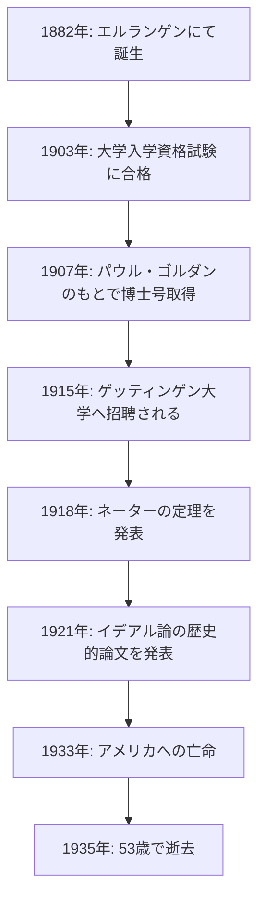
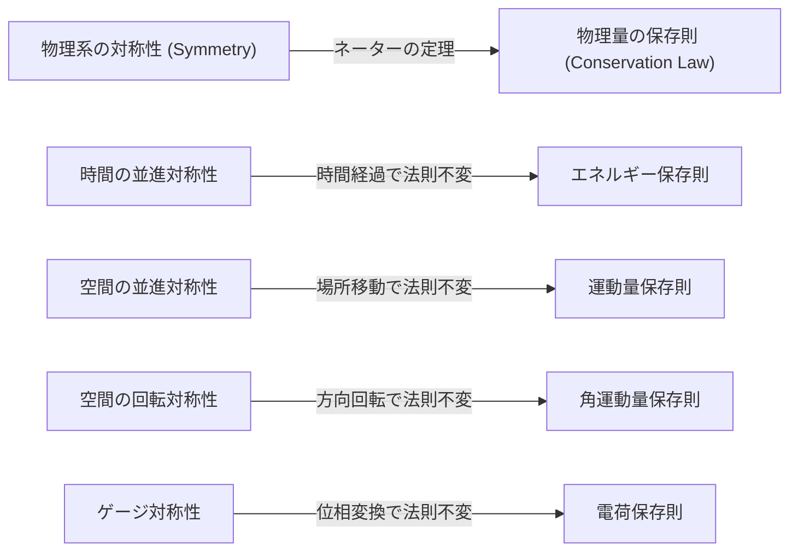
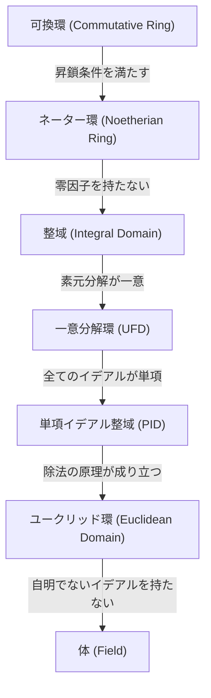

数学と物理学の歴史において、最も重要な貢献をした人物の一人でありながら、その名が一般に広く知られていない天才が存在します。その人物こそが、ドイツ出身の数学者 **[エミー・ネーター](https://kenji.blog/p/noether/)** （[Emmy Noether](https://kenji.blog/p/noether/), 1882–1935）です。彼女は「現代代数学の母」と称され、抽象代数学という分野を根本から作り変えました。さらに、物理学の分野においては、対称性と保存則を結びつける **「ネーターの定理」** を証明し、アインシュタインの一般相対性理論や現代の素粒子物理学の基礎を築きました。

アルベルト・アインシュタインは彼女の死に際し、ニューヨーク・タイムズ紙に次のような追悼文を寄せています。「女性の高等教育が始まって以来、最も偉大な創造的数学の天才である」。本記事では、数々の困難を乗り越え、学問への純粋な情熱を燃やし続けた[エミー・ネーター](https://kenji.blog/p/noether/)の生涯と、彼女が残した偉大な業績について詳しく紐解いていきます。

## 1. 生い立ちと初期の困難

アマーリエ・[エミー・ネーター](https://kenji.blog/p/noether/)は、1882年3月23日、ドイツのバイエルン州エルランゲンで生まれました。彼女の父親であるマックス・ネーターもまた、代数幾何学において多大な貢献をした著名な数学者でした。ネーター家はユダヤ系の家系であり、学問を重んじる家庭環境の中で彼女は育ちました。

しかし、当時のドイツ社会において、女性が学問の道を志すことは極めて困難でした。女性は大学の正規の学生として入学することが許可されておらず、講義を受けることさえも教授陣の特別な許可が必要でした。若きエミーは語学に秀でており、当初はフランス語と英語の教師になるための資格を取得しましたが、彼女の心は次第に数学へと惹かれていきました。

1900年、彼女はエルランゲン大学で聴講生として数学の講義を受け始めました。数百人の学生の中で、女性は彼女を含めてわずか2人だけでした。彼女は優れた数学的才能を発揮し、1903年にはニュルンベルクで大学入学資格試験（アビトゥーア）に合格します。その後、ゲッティンゲン大学でも聴講生として学び、カール・シュヴァルツシルトやヘルマン・ミンコフスキー、フェリックス・クライン、[ダフィット・ヒルベルト](https://kenji.blog/p/hilbert/)といった当時の最高峰の数学者・物理学者たちの講義に出席しました。

## 2. 博士号の取得と不遇の時代

1904年、ついにエルランゲン大学が女性の正規入学を許可し、ネーターは直ちに数学の学位プログラムに登録しました。彼女は不変式論の権威であるパウル・ゴルダンの指導のもとで研究を進め、1907年に『3元2次形式の完全系について』という論文で博士号（Ph.D.）を最優秀の成績で取得しました。この論文において、彼女はなんと331個もの不変式を具体的に計算し尽くすという、計算力と忍耐力の極みを示しました。

博士号を取得したものの、女性である彼女には大学でのポストは用意されていませんでした。彼女はエルランゲン大学で無給のまま、時には病弱な父親の代行として講義を行いながら、自身の研究を続けました。この時期、彼女の研究スタイルは、ゴルダンのような具体的な計算を重んじる構成的な手法から、[ダフィット・ヒルベルト](https://kenji.blog/p/hilbert/)のようなより抽象的で概念的な手法へと大きく変化していきました。エルンスト・フィッシャーの影響も受け、彼女は現代的な抽象代数学への扉を開き始めたのです。

## 3. ゲッティンゲン大学への招待と「ネーターの定理」

1915年、ゲッティンゲン大学の[ダフィット・ヒルベルト](https://kenji.blog/p/hilbert/)とフェリックス・クラインは、アルベルト・アインシュタインの一般相対性理論におけるエネルギー保存の法則に関する数学的な問題を解決するため、ネーターをゲッティンゲンに招きました。不変式論における彼女の深い知識が必要不可欠だったからです。

しかし、ここでも「女性である」という理由で、彼女を正規の教員（私講師）として採用することに対し、哲学部の他の分野の教授たちから猛烈な反対が起きました。彼らは「兵士たちが戦場から帰還したとき、女性の教員の下で学ばなければならないと知ったらどう思うか」と主張しました。これに対し、[ヒルベルト](https://kenji.blog/p/hilbert/)は次のように反論したという有名なエピソードが残されています。

> 「候補者の性別が私講師への採用の障害になるとは思えない。ここは大学であって、公衆浴場ではないのだ。」

結局、彼女は最初の数年間、無給のまま「[ヒルベルト](https://kenji.blog/p/hilbert/)の助手」という名目で、[ヒルベルト](https://kenji.blog/p/hilbert/)の名前で講義を行うことを余儀なくされました。しかし、彼女の研究は物理学の歴史を揺るがす偉大な成果を生み出しました。それが1918年に発表された **「ネーターの定理」** です。

### ネーターの定理の数学的表現

ネーターの定理は、「物理系において連続的な対称性が存在すれば、それに付随して必ず保存則が存在する」という極めて普遍的な真理を数学的に証明したものです。ラグランジアン $L$ に基づく作用積分 $S$ を考えます。

$$
S = \int_{t_1}^{t_2} L(q_i, \dot{q}_i, t) dt
$$

もし系が、ある微小な連続変換に対して不変（対称）であるならば、作用積分の変分 $\delta S$ はゼロになります。

$$
\delta S = 0 \quad \text{(対称性による条件)}
$$

このとき、ネーターの定理によれば、保存量 $Q$ が存在し、時間に対して不変（保存）となります。

$$
\frac{dQ}{dt} = 0
$$

具体的な物理学への応用は以下のようになります。

この定理により、物理学者は個々の現象を個別に計算するだけでなく、「どのような対称性があるか」を見つけることで、背後にある保存則を演繹できるようになりました。現代の素粒子物理学や量子場理論の標準模型は、本質的にこのネーターの定理の拡張の上に構築されています。

## 4. 抽象代数学の確立とネーター環

物理学での画期的な業績を残した後、ネーターは再び数学、特に **抽象代数学** の分野に注力しました。1920年代、彼女は現代の数学者が学ぶ環論やイデアル論の基礎を独力で築き上げました。

1921年に発表された論文『環領域におけるイデアル論』（Idealtheorie in Ringbereichen）は、数学の歴史において最も重要な論文の一つとされています。この中で彼女は、「昇鎖条件」（Ascending Chain Condition, ACC）という概念を定式化しました。

### 昇鎖条件とネーター環の定義

環 $R$ のイデアルの列が次のように包含関係にあるとします。

$$
I_1 \subseteq I_2 \subseteq I_3 \subseteq \cdots \subseteq I_n \subseteq \cdots
$$

このとき、ある正の整数 $N$ が存在して、すべての $n \ge N$ に対して

$$
I_n = I_N \quad \text{(これ以上イデアルが真に大きくならない)}
$$

が成り立つとき、この環 $R$ を **「ネーター環」** (Noetherian ring) と呼びます。

ネーターは、この非常にシンプルで抽象的な条件だけを用いて、整数論や代数幾何学における数々の複雑な定理（例えば、ラスカー・ネーターの定理によるイデアルの準素分解）を見事に証明しました。具体的な計算に頼るのではなく、構造そのものの性質を抽出して証明を行う彼女の手法は、数学のパラダイムシフトを引き起こしました。

このアプローチは、B.L.ファン・デル・ヴェルデンによって名著『現代代数学』（Moderne Algebra）としてまとめられ、世界中の大学の数学教育を一変させることになります。

## 5. 「ネーターの少年たち」と教育者としての素顔

ネーターは、優れた研究者であっただけでなく、並外れた教育者でもありました。彼女の講義は、完成された理論を黒板に書き写すようなものではなく、未解決の問題を学生たちと共に議論しながら探求する、非常にダイナミックなものでした。

彼女の周りには常に優秀な若い数学者たちが集まり、彼らは **「ネーターの少年たち」** (Noether-Knaben) と呼ばれていました。マックス・ドイリング、ヤコブ・レヴィツキ、エミール・アルティンなど、後に数学界を牽引する多くの才能が彼女の教えを受けました。

彼女は学生のアイデアを尊重し、時には自分の未発表のアイデアを惜しげもなく学生に提供して、彼らの名前で論文を発表させることもありました。形式にとらわれない彼女は、ゲッティンゲンの街を散歩しながら、あるいはカフェでケーキを食べながら、熱心に数学の議論を交わすのを好みました。彼女の温かく寛大な人柄は、多くの学生から深く敬愛されていました。

## 6. ナチスの台頭とアメリカへの亡命

1930年代に入ると、ネーターの研究は非可換代数や表現論へと進展し、さらなる高みへと達していました。1932年にはチューリッヒで開催された国際数学者会議で全体講演を行うなど、彼女の名声は国際的に不動のものとなっていました。

しかし、1933年にアドルフ・ヒトラー率いるナチス党がドイツの政権を掌握すると、事態は急変します。「職業官吏再建法」が制定され、ユダヤ系の公務員や大学教員は即座に解雇されることになりました。ネーターもゲッティンゲン大学から追放され、研究の場を奪われてしまいました。

ヘルマン・ワイルやアルベルト・アインシュタインら、世界中の科学者たちが彼女を救うために尽力しました。その結果、彼女はアメリカ合衆国ペンシルベニア州にある女子大学、ブリンマー大学の客員教授としての職を得て、亡命を果たしました。また、プリンストン高等研究所でも講義を行い、新天地のアメリカでも若き数学者たちに大きなインスピレーションを与えました。アメリカでの彼女は、ついに女性研究者として正当な評価と敬意を受けることができたのです。

## 7. 突然の悲劇と永遠の遺産

アメリカで充実した研究生活をスタートさせた矢先の1935年4月、ネーターは骨盤の腫瘍を摘出する手術を受けました。手術自体は成功したかのように見えましたが、数日後に合併症を引き起こし、4月14日に53歳という若さでこの世を去りました。その死はあまりにも突然であり、世界の学術界に深い悲しみをもたらしました。

彼女の遺体は、ブリンマー大学の図書館の回廊の下に葬られています。

数学者ノーバート・ウィーナーは彼女を次のように評しました。「ネーター嬢は、史上最も偉大な女性数学者であるばかりでなく、マリー・キュリーと同等か、それ以上に偉大な科学者である」。

[エミー・ネーター](https://kenji.blog/p/noether/)が切り拓いた抽象代数学の概念は、今日の暗号理論やコンピューターサイエンス、代数幾何学の根底に流れています。そして、彼女の対称性と保存則に関する定理は、ヒッグス粒子の発見やブラックホールの研究など、最先端の物理学において不可欠な言語として生き続けています。

女性差別に直面しながらも、ただ純粋に数学を愛し、真理を追求し続けた[エミー・ネーター](https://kenji.blog/p/noether/)。彼女の不屈の精神と圧倒的な知性は、時代を超えて、私たちに無限のインスピレーションを与え続けています。

---

*（本記事は、数学史と物理学の基礎に関心のある方々に向けて、[エミー・ネーター](https://kenji.blog/p/noether/)の業績を称えるために執筆されました。）*
