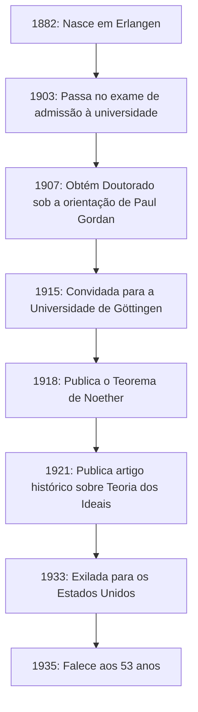
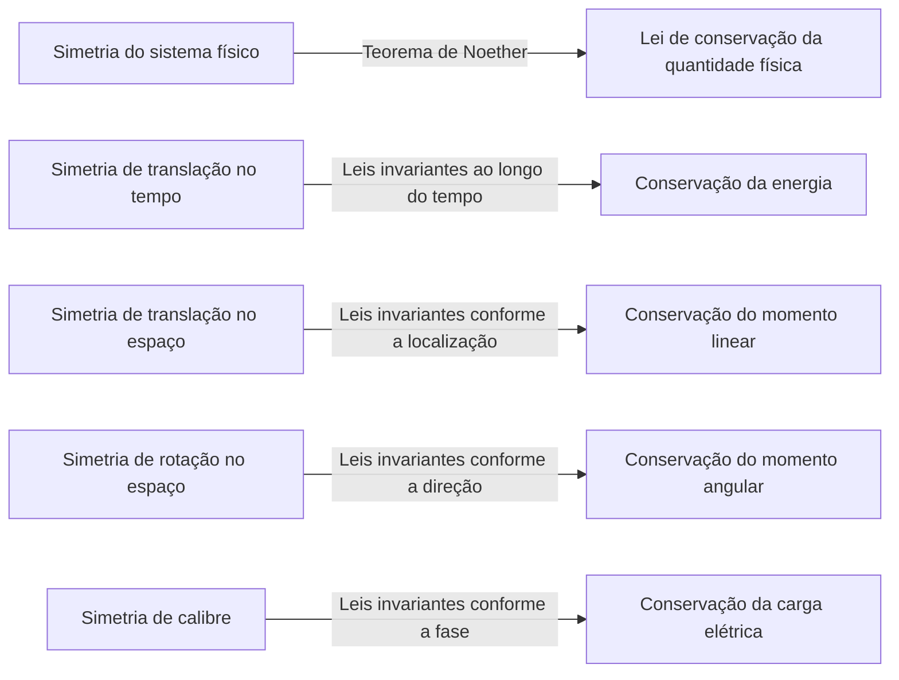
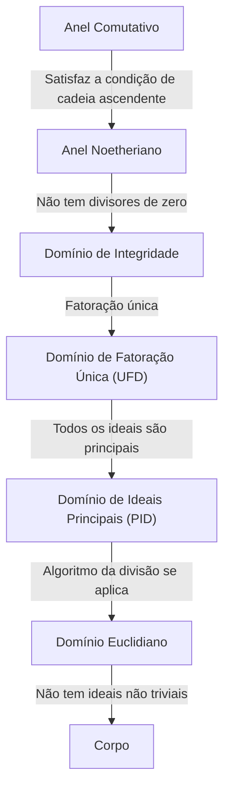

Na história da matemática e da física, existe uma genialidade que fez algumas das contribuições mais significativas, mas cujo nome não é amplamente conhecido pelo público em geral. Essa pessoa é a matemática nascida na Alemanha **Emmy Noether** (1882–1935). Muitas vezes aclamada como a "Mãe da Álgebra Moderna", ela transformou completamente o campo da álgebra abstrata. Além disso, na física, ela provou o **Teorema de Noether**, que conecta elegantemente a simetria com as leis de conservação, lançando as bases para a teoria da relatividade geral de Einstein e a física moderna de partículas.

Após sua morte, Albert Einstein escreveu uma homenagem no The New York Times afirmando: "No julgamento dos matemáticos vivos mais competentes, a senhorita Noether foi o gênio matemático criativo mais significativo assim produzido desde o início do ensino superior para as mulheres." Neste artigo, exploraremos detalhadamente a vida de Emmy Noether, que superou inúmeras dificuldades e manteve uma paixão pura pela erudição, e o tremendo legado que ela deixou para trás.

## 1. Início de Vida e Dificuldades Iniciais

Amalie Emmy Noether nasceu em 23 de março de 1882, em Erlangen, Baviera, Alemanha. Seu pai, Max Noether, também era um matemático proeminente que fez contribuições significativas para a geometria algébrica. A família Noether era de ascendência judaica, e ela cresceu em um ambiente familiar que valorizava muito a busca acadêmica.

No entanto, na sociedade alemã da época, era extremamente difícil para as mulheres seguirem a academia. As mulheres não tinham permissão para se matricular como estudantes regulares nas universidades, e mesmo frequentar palestras como ouvinte exigia permissão especial dos professores. A jovem Emmy se destacava em idiomas e inicialmente obteve qualificações para se tornar professora de francês e inglês, mas seu coração foi gradualmente cativado pela matemática.

Em 1900, ela começou a frequentar palestras de matemática na Universidade de Erlangen como ouvinte. Entre centenas de alunos, havia apenas duas mulheres, incluindo ela. Ela demonstrou um talento matemático excepcional e foi aprovada no exame de qualificação para ingresso na universidade (Abitur) em Nuremberg em 1903. Posteriormente, ela estudou como ouvinte na Universidade de Göttingen, participando de palestras de alguns dos maiores matemáticos e físicos da época, como Karl Schwarzschild, Hermann Minkowski, Felix Klein e David Hilbert.

## 2. A Obtenção do Doutorado e os Anos Sem Recompensa

Em 1904, a Universidade de Erlangen finalmente permitiu a matrícula regular de mulheres, e Noether registrou-se imediatamente para o programa de graduação em matemática. Ela avançou em suas pesquisas sob a orientação de Paul Gordan, uma autoridade em teoria dos invariantes, e em 1907 obteve seu doutorado com as mais altas honras por sua dissertação intitulada "Sobre Sistemas Completos de Invariantes para Formas Biquadráticas Ternárias". Neste artigo, ela demonstrou o auge do poder computacional e da paciência ao calcular exaustivamente 331 invariantes específicos.

Apesar de obter seu doutorado, não havia nenhum cargo universitário disponível para ela simplesmente por ser mulher. Ela continuou sua pesquisa na Universidade de Erlangen sem remuneração, às vezes substituindo seu pai doente para dar palestras. Durante este período, seu estilo de pesquisa mudou significativamente dos métodos construtivos que enfatizavam cálculos concretos, como os de Gordan, para os métodos mais abstratos e conceituais pioneiros de David Hilbert. Influenciada também por Ernst Fischer, ela começou a abrir a porta para a moderna álgebra abstrata.

## 3. Convite para Göttingen e o "Teorema de Noether"

Em 1915, David Hilbert e Felix Klein da Universidade de Göttingen convidaram Noether a Göttingen para ajudar a resolver problemas matemáticos relativos à conservação de energia na teoria da relatividade geral de Albert Einstein. Seu profundo conhecimento da teoria dos invariantes era considerado indispensável.

No entanto, sua possível nomeação como membro regular do corpo docente (Privatdozent) encontrou forte oposição de professores de outras disciplinas da Faculdade de Filosofia, mais uma vez simplesmente porque ela era uma "mulher". Eles argumentavam: "O que pensarão nossos soldados quando voltarem para a universidade e descobrirem que são obrigados a aprender aos pés de uma mulher?" A isso, Hilbert respondeu de forma famosa:

> "Não vejo que o sexo da candidata seja um argumento contra sua admissão como Privatdozent. Afinal, somos uma universidade, não uma casa de banho."

Em última análise, nos seus primeiros anos, ela foi forçada a dar aulas sob o nome de Hilbert como "assistente de Hilbert" sem remuneração. No entanto, sua pesquisa produziu uma conquista monumental que abalaria a história da física. Este foi o **Teorema de Noether**, publicado em 1918.

### Expressão Matemática do Teorema de Noether

O Teorema de Noether provou matematicamente uma verdade altamente universal: "Se um sistema físico possui uma simetria contínua, há necessariamente uma lei de conservação correspondente." Considere a integral de ação $S$ baseada na Lagrangiana $L$.

$$
S = \int_{t_1}^{t_2} L(q_i, \dot{q}_i, t) dt
$$

Se o sistema é invariante (simétrico) sob uma certa transformação contínua infinitesimal, a variação da integral de ação $\delta S$ é zero.

$$
\delta S = 0 \quad \text{(Condição devido à simetria)}
$$

De acordo com o Teorema de Noether, então, existe uma quantidade conservada $Q$ que permanece invariante (conservada) ao longo do tempo.

$$
\frac{dQ}{dt} = 0
$$

As aplicações específicas na física são as seguintes:

Graças a este teorema, os físicos não só puderam calcular fenômenos individuais separadamente, mas também deduzir as leis de conservação subjacentes, descobrindo "quais simetrias existem". O Modelo Padrão da física moderna de partículas e a teoria quântica de campos baseiam-se essencialmente nas extensões do Teorema de Noether.

## 4. Estabelecimento da Álgebra Abstrata e Anéis Noetherianos

Depois de deixar sua marca pioneira na física, Noether voltou a focar na matemática, especificamente na **álgebra abstrata**. Na década de 1920, ela, sozinha, estabeleceu as bases da teoria dos anéis e da teoria dos ideais estudadas pelos matemáticos modernos.

Seu artigo de 1921 "Teoria dos Ideais em Domínios de Anéis" (Idealtheorie in Ringbereichen) é considerado um dos artigos mais importantes na história da matemática. Nele, ela formulou o conceito de "Condição de Cadeia Ascendente" (ACC).

### Condição de Cadeia Ascendente e a Definição de Anéis Noetherianos

Suponha que uma sequência de ideais em um anel $R$ tenha a seguinte relação de inclusão:

$$
I_1 \subseteq I_2 \subseteq I_3 \subseteq \cdots \subseteq I_n \subseteq \cdots
$$

Se existir um número inteiro positivo $N$ tal que para todo $n \ge N$,

$$
I_n = I_N \quad \text{(O ideal não cresce mais)}
$$

for verdadeiro, então este anel $R$ é chamado de **anel Noetheriano**.

Usando apenas essa condição incrivelmente simples e abstrata, Noether provou brilhantemente numerosos teoremas complexos na teoria dos números e geometria algébrica (como a decomposição primária de ideais através do teorema de Lasker-Noether). Seu método de extrair as propriedades inerentes das estruturas para provas, em vez de depender de cálculos concretos, desencadeou uma mudança de paradigma na matemática.

Essa abordagem foi posteriormente compilada na obra-prima "Álgebra Moderna" (Moderne Algebra) por B.L. van der Waerden, que transformou completamente o ensino da matemática nas universidades em todo o mundo.

## 5. "Os Meninos de Noether" e Sua Verdadeira Face como Educadora

Noether não foi apenas uma pesquisadora notável, mas também uma educadora extraordinária. Suas aulas não consistiam em copiar teorias acabadas num quadro-negro, mas sim num processo altamente dinâmico de exploração de problemas não resolvidos em discussão com seus alunos.

Jovens matemáticos brilhantes reuniam-se constantemente à sua volta e ficaram conhecidos como **"os meninos de Noether"** (Noether-Knaben). Muitos talentos que mais tarde liderariam o mundo matemático, como Max Deuring, Jacob Levitzki e Emil Artin, aprenderam sob sua orientação.

Ela respeitava as ideias de seus alunos, às vezes generosamente oferecendo-lhes suas próprias ideias não publicadas para publicarem sob seus nomes. Desvinculada de formalidades, adorava envolver-se em discussões matemáticas apaixonadas enquanto caminhava pelas ruas de Göttingen ou comia bolo num café. Sua personalidade calorosa e generosa era profundamente amada e respeitada por muitos de seus alunos.

## 6. A Ascensão dos Nazistas e Exílio para a América

Entrando na década de 1930, a pesquisa de Noether progrediu para a álgebra não comutativa e a teoria da representação, alcançando níveis ainda mais altos. Em 1932, ela fez um discurso plenário no Congresso Internacional de Matemáticos em Zurique, e a sua fama tornou-se globalmente inabalável.

No entanto, quando o Partido Nazista liderado por Adolf Hitler assumiu o poder na Alemanha em 1933, a situação mudou drasticamente. A "Lei para a Restauração da Função Pública Profissional" foi promulgada, levando à demissão imediata de funcionários públicos e professores universitários de ascendência judaica. Noether foi expulsa da Universidade de Göttingen e privada do seu local de investigação.

Cientistas de todo o mundo, incluindo Hermann Weyl e Albert Einstein, fizeram esforços extenuantes para salvá-la. Como resultado, ela garantiu uma posição como professora visitante no Bryn Mawr College, uma faculdade para mulheres na Pensilvânia, EUA, e exilou-se. Ela também deu aulas no Instituto de Estudos Avançados de Princeton, proporcionando imensa inspiração aos jovens matemáticos no seu novo lar, a América. Nos Estados Unidos, ela finalmente recebeu o devido reconhecimento e o respeito que merecia como investigadora.

## 7. Tragédia Súbita e Legado Eterno

Em abril de 1935, no momento em que iniciava uma vida gratificante de pesquisa na América, Noether passou por uma cirurgia para remover um tumor pélvico. A cirurgia pareceu bem-sucedida, mas ela desenvolveu complicações alguns dias depois e faleceu em 14 de abril, na jovem idade de 53 anos. A sua morte foi incrivelmente repentina e trouxe profunda tristeza à comunidade acadêmica mundial.

Os seus restos mortais estão enterrados sob a passagem da biblioteca do Bryn Mawr College.

O matemático Norbert Wiener comentou sobre ela: "A Srta. Noether é... a maior mulher matemática que já existiu; e a maior mulher cientista de qualquer tipo que vive atualmente, e uma estudiosa pelo menos no nível de Madame Curie."

Os conceitos da álgebra abstrata pioneiros por Emmy Noether continuam a fluir nas bases da criptografia de hoje, da ciência da computação e da geometria algébrica. Além disso, o seu teorema sobre simetria e as leis de conservação perduram como uma linguagem indispensável na física de ponta, como a descoberta do bóson de Higgs e o estudo dos buracos negros.

Enfrentando a discriminação de gênero, Emmy Noether simplesmente amou a matemática de forma pura e continuou a buscar a verdade. O seu espírito indomável e intelecto avassalador continuam a dar-nos infinita inspiração através das eras.

---

*(Este artigo foi escrito para honrar as conquistas de Emmy Noether, direcionado àqueles interessados na história da matemática e nos fundamentos da física.)*
