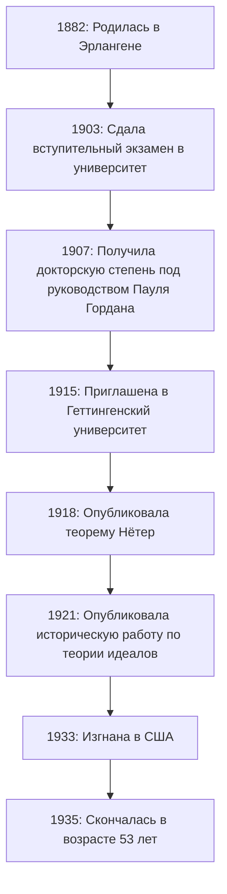
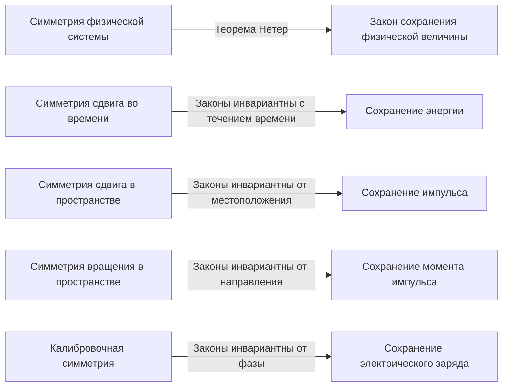
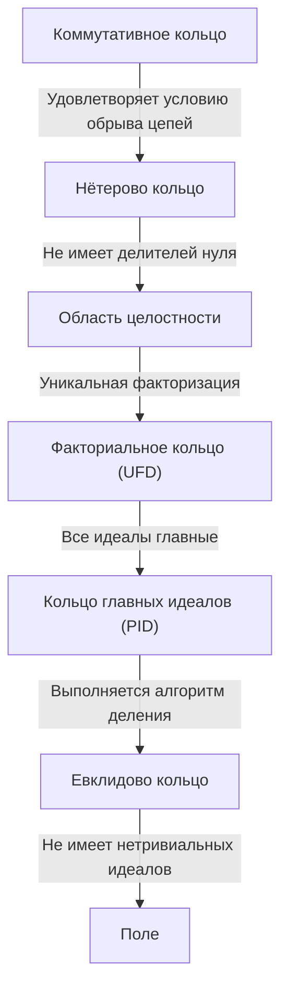

В истории математики и физики есть гений, внесший одни из самых значительных вкладов, чьё имя, тем не менее, не так широко известно широкой публике. Этот человек — немецкий математик **Эмми Нётер** (1882–1935). Часто называемая «Матерью современной алгебры», она полностью преобразовала область абстрактной алгебры. Кроме того, в физике она доказала **Теорему Нётер**, которая элегантно связывает симметрию с законами сохранения, заложив основу для общей теории относительности Эйнштейна и современной физики элементарных частиц.

После её смерти Альберт Эйнштейн написал дань уважения в The New York Times: «По суждению наиболее компетентных ныне живущих математиков, фройляйн Нётер была самым значительным творческим математическим гением, появившимся с момента начала высшего образования для женщин». В этой статье мы подробно рассмотрим жизнь Эмми Нётер, преодолевшей многочисленные трудности и сохранившей чистую страсть к науке, а также то огромное наследие, которое она оставила после себя.

## 1. Ранние годы и первоначальные трудности

Амалия Эмми Нётер родилась 23 марта 1882 года в Эрлангене, Бавария, Германия. Её отец, Макс Нётер, также был выдающимся математиком, внесшим значительный вклад в алгебраическую геометрию. Семья Нётер была еврейского происхождения, и Эмми выросла в домашней атмосфере, где высоко ценились академические стремления.

Однако в немецком обществе того времени женщинам было крайне сложно заниматься наукой. Женщинам не разрешалось поступать в университеты в качестве обычных студентов, и даже для посещения лекций в качестве вольнослушателя требовалось специальное разрешение профессоров. Юная Эмми преуспела в языках и сначала получила квалификацию преподавателя французского и английского языков, но её сердце постепенно пленила математика.

В 1900 году она начала посещать лекции по математике в Университете Эрлангена в качестве вольнослушателя. Среди сотен студентов было всего две женщины, включая её. Она продемонстрировала выдающийся математический талант и в 1903 году сдала экзамен, дающий право на поступление в университет (Abitur), в Нюрнберге. Впоследствии она училась в качестве вольнослушателя в Геттингенском университете, посещая лекции величайших математиков и физиков той эпохи, таких как Карл Шварцшильд, Герман Минковский, Феликс Клейн и Давид Гильберт.

## 2. Получение докторской степени и годы без признания

В 1904 году Университет Эрлангена, наконец, разрешил официальное зачисление женщин, и Нётер немедленно зарегистрировалась на математическую программу. Она продвигала свои исследования под руководством Пауля Гордана, авторитета в теории инвариантов, и в 1907 году с отличием получила докторскую степень (Ph.D.) за диссертацию на тему «О полных системах инвариантов для тернарных биквадратичных форм». В этой работе она продемонстрировала вершину вычислительной мощи и терпения, исчерпывающе вычислив 331 конкретный инвариант.

Несмотря на получение докторской степени, для неё не нашлось должности в университете просто потому, что она была женщиной. Она продолжила свои исследования в Эрлангенском университете без оплаты, иногда заменяя своего больного отца на лекциях. В этот период её стиль исследований значительно сместился от конструктивных методов, акцентирующих внимание на конкретных вычислениях (как у Гордана), к более абстрактным и концептуальным методам, предложенным Давидом Гильбертом. Также под влиянием Эрнста Фишера она начала открывать дверь в современную абстрактную алгебру.

## 3. Приглашение в Геттинген и «Теорема Нётер»

В 1915 году Давид Гильберт и Феликс Клейн пригласили Нётер в Геттингенский университет для помощи в решении математических проблем, касающихся сохранения энергии в общей теории относительности Альберта Эйнштейна. Её глубокие знания теории инвариантов считались незаменимыми.

Однако её возможное назначение на должность штатного преподавателя (Privatdozent) встретило яростное сопротивление профессоров других дисциплин философского факультета, опять же просто потому, что она была «женщиной». Они возмущались: «Что подумают наши солдаты, когда вернутся в университет и обнаружат, что им предстоит учиться у ног женщины?» На это Гильберт ответил своей знаменитой фразой:

> «Я не вижу, чтобы пол кандидата был аргументом против её допуска в качестве приват-доцента. В конце концов, мы университет, а не баня».

В конечном итоге, в течение первых нескольких лет она была вынуждена читать лекции под именем Гильберта как «ассистент Гильберта» без оплаты. Тем не менее, её исследования привели к монументальному достижению, которое потрясло историю физики. Это была **Теорема Нётер**, опубликованная в 1918 году.

### Математическое выражение теоремы Нётер

Теорема Нётер математически доказала в высшей степени универсальную истину: «Если физическая система обладает непрерывной симметрией, то ей обязательно соответствует закон сохранения». Рассмотрим интеграл действия $S$, основанный на лагранжиане $L$.

$$
S = \int_{t_1}^{t_2} L(q_i, \dot{q}_i, t) dt
$$

Если система инвариантна (симметрична) относительно определенного инфинитезимального непрерывного преобразования, то вариация интеграла действия $\delta S$ равна нулю.

$$
\delta S = 0 \quad \text{(Условие из-за симметрии)}
$$

Согласно теореме Нётер, тогда существует сохраняющаяся величина $Q$, которая остается инвариантной (сохраняется) с течением времени.

$$
\frac{dQ}{dt} = 0
$$

Конкретные применения в физике таковы:

Благодаря этой теореме физики смогли не только отдельно рассчитывать индивидуальные явления, но и выводить основополагающие законы сохранения, находя, «какие существуют симметрии». Стандартная модель современной физики элементарных частиц и квантовая теория поля по сути строятся на расширениях теоремы Нётер.

## 4. Создание абстрактной алгебры и нётеровы кольца

Оставив свой новаторский след в физике, Нётер вновь сосредоточилась на математике, а именно на **абстрактной алгебре**. В 1920-х годах она в одиночку заложила основы теории колец и теории идеалов, которые изучают современные математики.

Её статья 1921 года «Теория идеалов в кольцах» (Idealtheorie in Ringbereichen) считается одной из самых важных работ в истории математики. В ней она сформулировала концепцию «Условия обрыва возрастающих цепей» (ACC).

### Условие обрыва возрастающих цепей и определение нётеровых колец

Предположим, что последовательность идеалов в кольце $R$ имеет следующее отношение включения:

$$
I_1 \subseteq I_2 \subseteq I_3 \subseteq \cdots \subseteq I_n \subseteq \cdots
$$

Если существует положительное целое число $N$ такое, что для всех $n \ge N$,

$$
I_n = I_N \quad \text{(Идеал больше не увеличивается)}
$$

справедливо, то это кольцо $R$ называется **нётеровым кольцом**.

Используя только это удивительно простое и абстрактное условие, Нётер блестяще доказала многочисленные сложные теоремы в теории чисел и алгебраической геометрии (такие как примарное разложение идеалов с помощью теоремы Ласкера-Нётер). Её метод извлечения внутренних свойств структур для доказательств, а не опора на конкретные вычисления, вызвал сдвиг парадигмы в математике.

Этот подход был позже собран в шедевре «Современная алгебра» (Moderne Algebra) Б.Л. ван дер Варденом, который полностью трансформировал математическое образование в университетах по всему миру.

## 5. «Мальчики Нётер» и её истинное лицо как педагога

Нётер была не только выдающимся исследователем, но и необыкновенным педагогом. Её лекции не сводились к переписыванию готовых теорий на доску, а представляли собой весьма динамичный процесс исследования нерешенных проблем в дискуссии со студентами.

Вокруг неё постоянно собирались блестящие молодые математики, которые стали известны как **«мальчики Нётер»** (Noether-Knaben). Многие таланты, которые позже возглавят математический мир, такие как Макс Дойринг, Якоб Левицкий и Эмиль Артин, учились под её руководством.

Она уважала идеи своих учеников, иногда щедро предлагая им свои собственные неопубликованные идеи для публикации под их именами. Не скованная формальностями, она любила вступать в страстные математические дискуссии, прогуливаясь по улицам Геттингена или поедая пирожные в кафе. Её теплая и щедрая личность была глубоко любима и уважаема многими из её учеников.

## 6. Приход к власти нацистов и изгнание в Америку

К началу 1930-х годов исследования Нётер продвинулись в некоммутативную алгебру и теорию представлений, достигнув еще больших высот. В 1932 году она выступила с пленарным докладом на Международном конгрессе математиков в Цюрихе, и её слава стала непоколебимой во всем мире.

Однако, когда в 1933 году к власти в Германии пришла нацистская партия во главе с Адольфом Гитлером, ситуация кардинально изменилась. Был принят «Закон о восстановлении профессионального чиновничества», который привел к немедленному увольнению государственных служащих и преподавателей университетов еврейского происхождения. Нётер была изгнана из Геттингенского университета и лишена места для проведения исследований.

Ученые со всего мира, включая Германа Вейля и Альберта Эйнштейна, приложили огромные усилия, чтобы спасти её. В результате она получила должность приглашенного профессора в колледже Брин-Мар, женском колледже в Пенсильвании, США, и отправилась в изгнание. Она также читала лекции в Институте перспективных исследований в Принстоне, даря огромное вдохновение молодым математикам в своем новом доме, в Америке. В Соединенных Штатах она наконец получила заслуженное признание и уважение как исследователь.

## 7. Внезапная трагедия и вечное наследие

В апреле 1935 года, как только она начала полноценную исследовательскую жизнь в Америке, Нётер перенесла операцию по удалению опухоли таза. Операция казалась успешной, но через несколько дней у неё развились осложнения, и она скончалась 14 апреля в молодом возрасте 53 лет. Её смерть была невероятно внезапной и принесла глубокую скорбь мировому академическому сообществу.

Её прах захоронен под галереей библиотеки колледжа Брин-Мар.

Математик Норберт Винер сказал о ней: «Фройляйн Нётер... величайшая женщина-математик, когда-либо жившая; и величайшая женщина-ученый из ныне живущих, и ученый, по крайней мере, на том же уровне, что и мадам Кюри».

Концепции абстрактной алгебры, впервые предложенные Эмми Нётер, продолжают лежать в основе современной криптографии, информатики и алгебраической геометрии. Кроме того, её теорема о симметрии и законах сохранения живет как незаменимый язык в передовой физике, такой как открытие бозона Хиггса и изучение черных дыр.

Столкнувшись с гендерной дискриминацией, Эмми Нётер просто чисто любила математику и продолжала искать истину. Её неукротимый дух и ошеломляющий интеллект продолжают давать нам бесконечное вдохновение сквозь века.

---

*(Эта статья была написана, чтобы почтить достижения Эмми Нётер, и адресована тем, кто интересуется историей математики и основами физики).*
