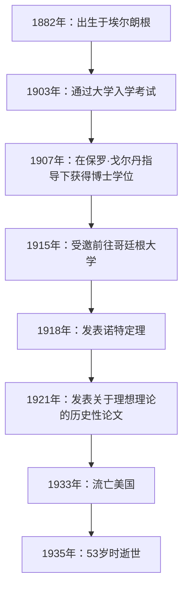
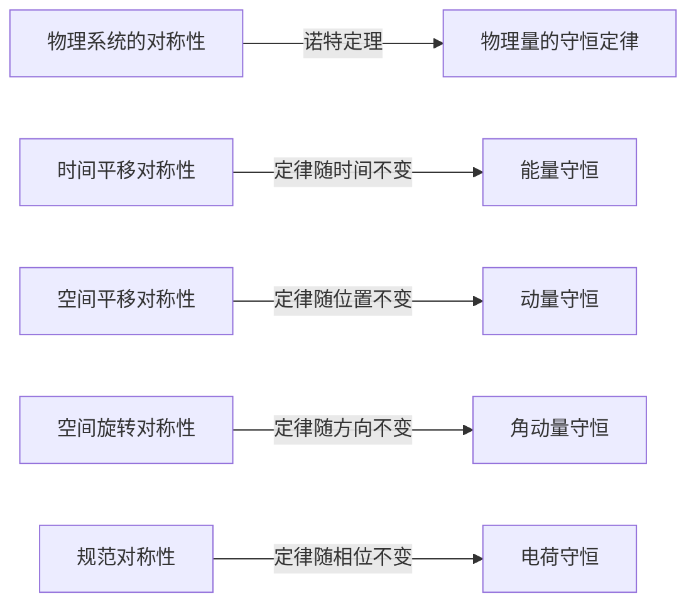
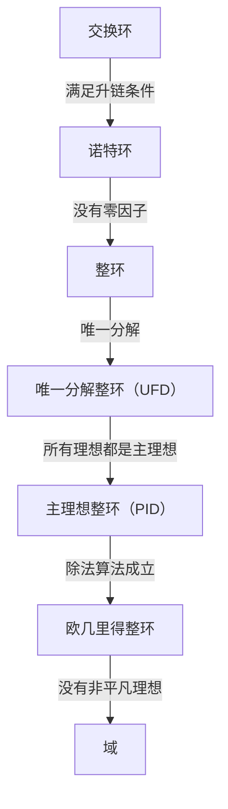

在数学和物理学的历史中，有一位做出了最重要贡献的天才，然而她的名字却没有被大众广泛熟知。这个人就是出生于德国的数学家 **埃米·诺特**（Emmy Noether, 1882–1935）。她常被称为“现代代数之母”，从根本上重塑了抽象代数领域。此外，在物理学方面，她证明了 **“诺特定理”**，巧妙地将对称性与守恒定律联系起来，为爱因斯坦的广义相对论和现代粒子物理学奠定了基础。

阿尔伯特·爱因斯坦在她去世时在《纽约时报》上撰写了一篇悼词：“在当今最胜任的数学家的评判中，诺特小姐是自女性高等教育开始以来所产生的最具有创造性的数学天才。”在本文中，我们将详细探索埃米·诺特的一生，她克服了重重困难并保持了对学术的纯粹热情，以及她留下的巨大遗产。

## 1. 早年生活与最初的困境

阿玛莉·埃米·诺特于1882年3月23日出生在德国巴伐利亚州的埃尔朗根。她的父亲马克斯·诺特也是一位在代数几何领域做出重大贡献的著名数学家。诺特家族具有犹太血统，她在极度重视学术追求的家庭环境中长大。

然而，在当时的德国社会，女性追求学术生涯是极其困难的。女性不被允许作为正式学生在大学注册，甚至作为旁听生听课也需要得到教授的特别许可。年轻的埃米在语言方面表现优异，最初获得了成为法语和英语教师的资格，但她的心逐渐被数学所吸引。

1900年，她开始在埃尔朗根大学作为旁听生听数学课。在数百名学生中，只有两名女性，包括她自己。她展现出了非凡的数学天赋，并于1903年在纽伦堡通过了大学入学资格考试（Abitur）。随后，她在哥廷根大学作为旁听生学习，聆听了那个时代一些最伟大的数学家和物理学家的课程，如卡尔·史瓦西、赫尔曼·闵可夫斯基、费利克斯·克莱因和大卫·希尔伯特。

## 2. 获得博士学位与没有回报的岁月

1904年，埃尔朗根大学终于允许女性正式注册，诺特立即注册了数学学位课程。她在不变量理论权威保罗·戈尔丹的指导下推进了她的研究，并于1907年以优异成绩获得了博士学位（Ph.D.），其论文题目为《关于三元双二次型的完整系统》。在这篇论文中，她详尽地计算了331个特定的不变量，展示了计算能力和耐力的巅峰。

尽管获得了博士学位，但仅仅因为她是一名女性，大学里就没有适合她的职位。她在埃尔朗根大学继续无薪进行研究，有时甚至代替生病的父亲讲课。在此期间，她的研究风格发生了显著变化，从强调具体计算的构造性方法（如戈尔丹的方法）转向由大卫·希尔伯特开创的更抽象、概念性的方法。在恩斯特·菲舍尔的影响下，她也开始推开现代抽象代数的大门。

## 3. 受邀前往哥廷根与“诺特定理”

1915年，哥廷根大学的大卫·希尔伯特和费利克斯·克莱因邀请诺特前往哥廷根，以帮助解决阿尔伯特·爱因斯坦广义相对论中有关能量守恒的数学问题。她在不变量理论方面的渊博知识被认为是不可或缺的。

然而，她作为正式教员（编外讲师，Privatdozent）的可能任命遭到了哲学院内其他学科教授的强烈反对，原因同样仅仅因为她是“女性”。他们争辩说：“当我们的士兵回到大学，发现他们必须在女人的脚下学习时，他们会怎么想？”对此，希尔伯特发表了著名的反驳：

> “我看不出候选人的性别会成为反对她成为编外讲师的理由。毕竟，我们是大学，不是公共澡堂。”

最终，在她的最初几年里，她被迫以希尔伯特的名字作为“希尔伯特的助手”进行无薪讲课。然而，她的研究产生了一项震撼物理学历史的纪念碑式成就。这就是1918年发表的 **“诺特定理”**。

### 诺特定理的数学表达

诺特定理在数学上证明了一个高度普遍的真理：“如果一个物理系统具有连续对称性，则必然存在相应的守恒定律。”考虑基于拉格朗日量 $L$ 的作用量积分 $S$。

$$
S = \int_{t_1}^{t_2} L(q_i, \dot{q}_i, t) dt
$$

如果系统在某个无限小连续变换下是不变的（对称的），则作用量积分的变分 $\delta S$ 为零。

$$
\delta S = 0 \quad \text{（由于对称性的条件）}
$$

根据诺特定理，那么存在一个守恒量 $Q$ 并且随时间保持不变（守恒）。

$$
\frac{dQ}{dt} = 0
$$

在物理学中的具体应用如下：

由于这个定理，物理学家不仅可以单独计算个别现象，还可以通过寻找“存在什么对称性”来推导潜在的守恒定律。现代粒子物理学的标准模型和量子场论本质上建立在诺特定理的扩展之上。

## 4. 抽象代数的建立与诺特环

在物理学留下了开创性的印记后，诺特将重点重新转回数学，特别是 **抽象代数**。在1920年代，她单枪匹马地奠定了现代数学家所学习的环论和理想理论的基础。

她1921年的论文《环域中的理想理论》（Idealtheorie in Ringbereichen）被认为是数学史上最重要的论文之一。在其中，她提出了“升链条件”（ACC）的概念。

### 升链条件与诺特环的定义

假设环 $R$ 中的一个理想序列具有以下包含关系：

$$
I_1 \subseteq I_2 \subseteq I_3 \subseteq \cdots \subseteq I_n \subseteq \cdots
$$

如果存在一个正整数 $N$，使得对于所有 $n \ge N$，

$$
I_n = I_N \quad \text{（理想不再变得更大）}
$$

成立，那么这个环 $R$ 就被称为 **诺特环**。

仅仅利用这个极其简单而抽象的条件，诺特就巧妙地证明了数论和代数几何中的许多复杂定理（例如通过拉斯克-诺特定理进行的理想的准素分解）。她提取结构的固有性质进行证明，而不是依赖具体计算的方法，引发了数学的范式转变。

这种方法后来被B.L. 范德瓦尔登汇编成杰作《现代代数学》（Moderne Algebra），这彻底改变了世界各地大学的数学教育。

## 5. “诺特男孩”与她作为教育家的真面目

诺特不仅是一位杰出的研究员，也是一位非凡的教育家。她的讲课不是在黑板上抄写完成的理论，而是一个在与学生的讨论中探索未解决问题的极具动态的过程。

才华横溢的年轻数学家不断聚集在她周围，他们被称为 **“诺特男孩”**（Noether-Knaben）。许多后来领导数学界的人才，如马克斯·丢林、雅各布·莱维茨基和埃米尔·阿廷，都在她的指导下学习。

她尊重学生的想法，有时甚至慷慨地将自己未发表的想法提供给他们，让他们以自己的名字发表。不受形式束缚，她喜欢在漫步哥廷根街头或在咖啡馆吃蛋糕时进行充满激情的数学讨论。她温暖宽宏的性格深受许多学生的爱戴和尊敬。

## 6. 纳粹的崛起与流亡美国

进入1930年代，诺特的研究进展到非交换代数和表示论，达到了更高的高度。1932年，她在苏黎世国际数学家大会上作了全体会议演讲，她的名声在全球变得不可动摇。

然而，当阿道夫·希特勒领导的纳粹党在1933年夺取德国政权时，情况急剧恶化。颁布了《重设职业公务员法》，导致具有犹太血统的公务员和大学教员被立即解雇。诺特被驱逐出哥廷根大学，失去了她的研究场所。

包括赫尔曼·外尔和阿尔伯特·爱因斯坦在内的世界各地的科学家都在为拯救她而努力。结果，她在美国宾夕法尼亚州的一所女子大学布林茅尔学院获得了一个客座教授的职位，并流亡海外。她还在普林斯顿高等研究院讲学，为她新家美国的年轻数学家提供了巨大的启迪。在美国，她终于作为一名研究员获得了应有的认可和尊重。

## 7. 突如其来的悲剧与永恒的遗产

在1935年4月，就在她在美国开始充实的研究生活时，诺特接受了切除骨盆肿瘤的手术。手术似乎很成功，但几天后她出现了并发症，并于4月14日逝世，享年53岁。她的死极其突然，给全球学术界带来了深深的悲痛。

她的遗体安葬在布林茅尔学院图书馆的回廊下。

数学家诺伯特·维纳这样评价她：“诺特小姐是……有史以来最伟大的女性数学家；也是当今健在的任何领域最伟大的女性科学家，并且是一位至少与居里夫人处于同一水平的学者。”

埃米·诺特开创的抽象代数概念今天继续流淌在密码学、计算机科学和代数几何的基础中。此外，她关于对称性和守恒定律的定理作为尖端物理学（如发现希格斯玻色子和黑洞研究）中不可或缺的语言继续存在。

面对性别歧视，埃米·诺特只是纯粹地热爱数学并继续追求真理。她不屈不挠的精神和压倒性的智慧在各个时代继续给我们带来无限的启发。

---

*（本文旨在纪念埃米·诺特的成就，面向对数学历史和物理学基础感兴趣的读者。）*
