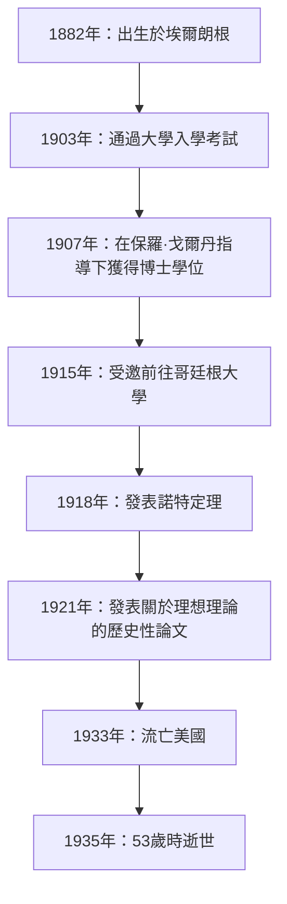
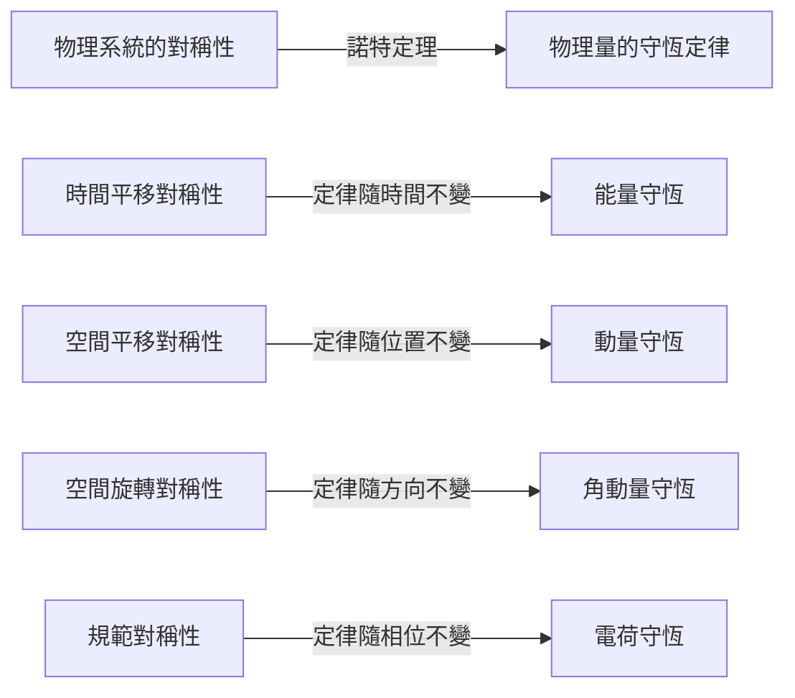
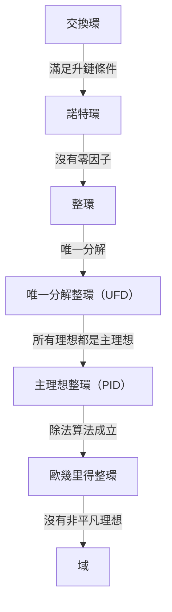

在數學和物理學的歷史中，有一位做出了最重要貢獻的天才，然而她的名字卻沒有被大眾廣泛熟知。這個人就是出生於德國的數學家 **[埃米·諾特](https://kenji.blog/p/noether/)**（[Emmy Noether](https://kenji.blog/p/noether/), 1882–1935）。她常被稱為「現代代數之母」，從根本上重塑了抽象代數領域。此外，在物理學方面，她證明了 **「諾特定理」**，巧妙地將對稱性與守恆定律聯繫起來，為愛因斯坦的廣義相對論和現代粒子物理學奠定了基礎。

阿爾伯特·愛因斯坦在她去世時在《紐約時報》上撰寫了一篇悼詞：「在當今最勝任的數學家的評判中，諾特小姐是自女性高等教育開始以來所產生的最具有創造性的數學天才。」在本文中，我們將詳細探索[埃米·諾特](https://kenji.blog/p/noether/)的一生，她克服了重重困難並保持了對學術的純粹熱情，以及她留下的巨大遺產。

## 1. 早年生活與最初的困境

阿瑪莉·[埃米·諾特](https://kenji.blog/p/noether/)於1882年3月23日出生在德國巴伐利亞州的埃爾朗根。她的父親馬克斯·諾特也是一位在代數幾何領域做出重大貢獻的著名數學家。諾特家族具有猶太血統，她在極度重視學術追求的家庭環境中長大。

然而，在當時的德國社會，女性追求學術生涯是極其困難的。女性不被允許作為正式學生在大學註冊，甚至作為旁聽生聽課也需要得到教授的特別許可。年輕的埃米在語言方面表現優異，最初獲得了成為法語和英語教師的資格，但她的心逐漸被數學所吸引。

1900年，她開始在埃爾朗根大學作為旁聽生聽數學課。在數百名學生中，只有兩名女性，包括她自己。她展現出了非凡的數學天賦，並於1903年在紐倫堡通過了大學入學資格考試（Abitur）。隨後，她在哥廷根大學作為旁聽生學習，聆聽了那個時代一些最偉大的數學家和物理學家的課程，如卡爾·史瓦西、赫爾曼·閔可夫斯基、費利克斯·克萊因和[大衛·希爾伯特](https://kenji.blog/p/hilbert/)。

## 2. 獲得博士學位與沒有回報的歲月

1904年，埃爾朗根大學終於允許女性正式註冊，諾特立即註冊了數學學位課程。她在不變量理論權威保羅·戈爾丹的指導下推進了她的研究，並於1907年以優異成績獲得了博士學位（Ph.D.），其論文題目為《關於三元雙二次型的完整系統》。在這篇論文中，她詳盡地計算了331個特定的不變量，展示了計算能力和耐力的巔峰。

儘管獲得了博士學位，但僅僅因為她是一名女性，大學裡就沒有適合她的職位。她在埃爾朗根大學繼續無薪進行研究，有時甚至代替生病的父親講課。在此期間，她的研究風格發生了顯著變化，從強調具體計算的構造性方法（如戈爾丹的方法）轉向由[大衛·希爾伯特](https://kenji.blog/p/hilbert/)開創的更抽象、概念性的方法。在恩斯特·菲舍爾的影響下，她也開始推開現代抽象代數的大門。

## 3. 受邀前往哥廷根與「諾特定理」

1915年，哥廷根大學的[大衛·希爾伯特](https://kenji.blog/p/hilbert/)和費利克斯·克萊因邀請諾特前往哥廷根，以幫助解決阿爾伯特·愛因斯坦廣義相對論中有關能量守恆的數學問題。她在不變量理論方面的淵博知識被認為是不可或缺的。

然而，她作為正式教員（編外講師，Privatdozent）的可能任命遭到了哲學院內其他學科教授的強烈反對，原因同樣僅僅因為她是「女性」。他們爭辯說：「當我們的士兵回到大學，發現他們必須在女人的腳下學習時，他們會怎麼想？」對此，希爾伯特發表了著名的反駁：

> 「我看不出候選人的性別會成為反對她成為編外講師的理由。畢竟，我們是大學，不是公共澡堂。」

最終，在她的最初幾年裡，她被迫以希爾伯特的名字作為「希爾伯特的助手」進行無薪講課。然而，她的研究產生了一項震撼物理學歷史的紀念碑式成就。這就是1918年發表的 **「諾特定理」**。

### 諾特定理的數學表達

諾特定理在數學上證明了一個高度普遍的真理：「如果一個物理系統具有連續對稱性，則必然存在相應的守恆定律。」考慮基於拉格朗日量 $L$ 的作用量積分 $S$。

$$
S = \int_{t_1}^{t_2} L(q_i, \dot{q}_i, t) dt
$$

如果系統在某個無限小連續變換下是不變的（對稱的），則作用量積分的變分 $\delta S$ 為零。

$$
\delta S = 0 \quad \text{（由於對稱性的條件）}
$$

根據諾特定理，那麼存在一個守恆量 $Q$ 並且隨時間保持不變（守恆）。

$$
\frac{dQ}{dt} = 0
$$

在物理學中的具體應用如下：

由於這個定理，物理學家不僅可以單獨計算個別現象，還可以通過尋找「存在什麼對稱性」來推導潛在的守恆定律。現代粒子物理學的標準模型和量子場論本質上建立在諾特定理的擴展之上。

## 4. 抽象代數的建立與諾特環

在物理學留下了開創性的印記後，諾特將重點重新轉回數學，特別是 **抽象代數**。在1920年代，她單槍匹馬地奠定了現代數學家所學習的環論和理想理論的基礎。

她1921年的論文《環域中的理想理論》（Idealtheorie in Ringbereichen）被認為是數學史上最重要的論文之一。在其中，她提出了「升鏈條件」（ACC）的概念。

### 升鏈條件與諾特環的定義

假設環 $R$ 中的一個理想序列具有以下包含關係：

$$
I_1 \subseteq I_2 \subseteq I_3 \subseteq \cdots \subseteq I_n \subseteq \cdots
$$

如果存在一個正整數 $N$，使得對於所有 $n \ge N$，

$$
I_n = I_N \quad \text{（理想不再變得更大）}
$$

成立，那麼這個環 $R$ 就被稱為 **諾特環**。

僅僅利用這個極其簡單而抽象的條件，諾特就巧妙地證明了數論和代數幾何中的許多複雜定理（例如通過拉斯克-諾特定理進行的理想的準素分解）。她提取結構的固有性質進行證明，而不是依賴具體計算的方法，引發了數學的範式轉變。

這種方法後來被B.L. 範德瓦爾登彙編成傑作《現代代數學》（Moderne Algebra），這徹底改變了世界各地大學的數學教育。

## 5. 「諾特男孩」與她作為教育家的真面目

諾特不僅是一位傑出的研究員，也是一位非凡的教育家。她的講課不是在黑板上抄寫完成的理論，而是一個在與學生的討論中探索未解決問題的極具動態的過程。

才華橫溢的年輕數學家不斷聚集在她周圍，他們被稱為 **「諾特男孩」**（Noether-Knaben）。許多後來領導數學界的人才，如馬克斯·丟林、雅各布·萊維茨基和埃米爾·阿廷，都在她的指導下學習。

她尊重學生的想法，有時甚至慷慨地將自己未發表的想法提供給他們，讓他們以自己的名字發表。不受形式束縛，她喜歡在漫步哥廷根街頭或在咖啡館吃蛋糕時進行充滿激情的數學討論。她溫暖寬宏的性格深受許多學生的愛戴和尊敬。

## 6. 納粹的崛起與流亡美國

進入1930年代，諾特的研究進展到非交換代數和表示論，達到了更高的高度。1932年，她在蘇黎世國際數學家大會上作了全體會議演講，她的名聲在全球變得不可動搖。

然而，當阿道夫·希特勒領導的納粹黨在1933年奪取德國政權時，情況急劇惡化。頒布了《重設職業公務員法》，導致具有猶太血統的公務員和大學教員被立即解僱。諾特被驅逐出哥廷根大學，失去了她的研究場所。

包括赫爾曼·外爾和阿爾伯特·愛因斯坦在內的世界各地的科學家都在為拯救她而努力。結果，她在美國賓夕法尼亞州的一所女子大學布林茅爾學院獲得了一個客座教授的職位，並流亡海外。她還在普林斯頓高等研究院講學，為她新家美國的年輕數學家提供了巨大的啟迪。在美國，她終於作為一名研究員獲得了應有的認可和尊重。

## 7. 突如其來的悲劇與永遠的遺產

在1935年4月，就在她在美國開始充實的研究生活時，諾特接受了切除骨盆腫瘤的手術。手術似乎很成功，但幾天後她出現了併發症，並於4月14日逝世，享年53歲。她的死極其突然，給全球學術界帶來了深深的悲痛。

她的遺體安葬在布林茅爾學院圖書館的迴廊下。

數學家諾伯特·維納這樣評價她：「諾特小姐是……有史以來最偉大的女性數學家；也是當今健在的任何領域最偉大的女性科學家，並且是一位至少與居里夫人處於同一水平的學者。」

[埃米·諾特](https://kenji.blog/p/noether/)開創的抽象代數概念今天繼續流淌在密碼學、計算機科學和代數幾何的基礎中。此外，她關於對稱性和守恆定律的定理作為尖端物理學（如發現希格斯玻色子和黑洞研究）中不可或缺的語言繼續存在。

面對性別歧視，[埃米·諾特](https://kenji.blog/p/noether/)只是純粹地熱愛數學並繼續追求真理。她不屈不撓的精神和壓倒性的智慧在各個時代繼續給我們帶來無限的啟發。

---

*（本文旨在紀念[埃米·諾特](https://kenji.blog/p/noether/)的成就，面向對數學歷史和物理學基礎感興趣的讀者。）*
