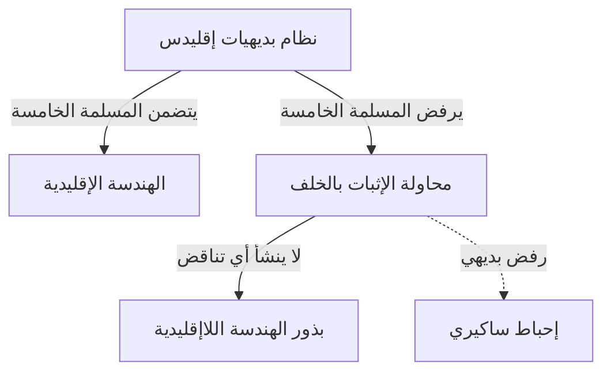
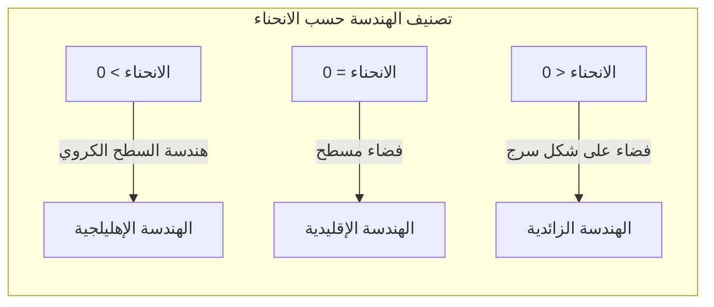

## 1. مقدمة: لعنة [إقليدس](https://kenji.blog/ar/p/euclid/)

في القرن الثالث قبل الميلاد، قام عالم الرياضيات اليوناني القديم [إقليدس](https://kenji.blog/ar/p/euclid/) بتنظيم المعرفة الهندسية في عصره بشكل بديهي في كتابه "العناصر". قدم خمس مسلمات (افتراضات)، ولكن المسلمة الخامسة، ما يسمى ** مسلمة التوازي ** ، كانت معقدة مقارنة بالمسلمات الأربع الأخرى، وأزعجت الكثير من علماء الرياضيات.

$$
\text{المسلمة الخامسة: إذا قطع خط مستقيم خطين مستقيمين، وكان مجموع الزاويتين الداخليتين في نفس الجانب أقل من زاويتين قائمتين، فإن الخطين المستقيمين، إذا امتدا إلى ما لا نهاية، سيلتقيان في الجانب الذي يكون فيه مجموع الزاويتين الداخليتين أقل من زاويتين قائمتين.}
$$

تبدو هذه المسلمة واضحة بديهيا، لكن علماء الرياضيات شككوا فيها قائلين: "أليست هذه مسلمة، بل نظرية يمكن إثباتها من المسلمات الأربع الأخرى؟". ولحوالي 2000 عام، حاول عدد لا يحصى من العباقرة إثبات ذلك، لكنهم فشلوا.

## 2. تحدي مسلمة التوازي والإحباط

منذ عصر النهضة فصاعدًا، حاول علماء رياضيات مثل ساكيري ولامبرت إثبات المسلمة الخامسة باستخدام "البرهان بالخلف". أي أنهم افترضوا أن "المسلمة الخامسة لا تنطبق" وحاولوا استخلاص تناقض من ذلك. ومع ذلك، ما استنتجوه لم يكن تناقضًا، بل العديد من "نظريات الهندسة الجديدة" الغريبة تمامًا ولكنها لا تشوبها شائبة منطقيًا.

درس ساكيري "فرضية الزاوية الحادة" و"فرضية الزاوية المنفرجة"، وعلى الرغم من إدراكه أنه لا يمكن استخلاص أي تناقض من فرضية الزاوية الحادة، إلا أنه رفضها في النهاية بسبب معتقداته الخاصة.

## 3. اكتشاف "الفضاء المنحني": نشأة الهندسة الزائدية

في القرن التاسع عشر، حدثت ثورة أخيرًا. توصل ثلاثة أشخاص بشكل مستقل، وهم كارل فريدريش غاوس من ألمانيا، ويانوش بولياي من المجر، ونيكولاي لوباتشيفسكي من روسيا، إلى استنتاج مفاده أن "المسلمة الخامسة مستقلة عن المسلمات الأخرى، وهناك هندسة جديدة تمامًا حيث لا تنطبق هذه المسلمة".

الهندسة التي اكتشفوها تسمى الآن ** الهندسة الزائدية ** . في هذا الفضاء، يوجد "عدد لا حصر له" من الخطوط الموازية التي تمر بنقطة واحدة خارج خط مستقيم. كما أن مجموع الزوايا الداخلية للمثلث يكون دائمًا أقل من 180 درجة.

$$
\text{مجموع الزوايا الداخلية لمثلث في الهندسة الزائدية} < 180^\circ
$$

بسبب الطبيعة المبتكرة للغاية لهذا الاكتشاف، امتنع غاوس عن نشره خلال حياته خوفًا من عدم فهم الجمهور له. عندما نشر بولياي ولوباتشيفسكي أوراقه، واجه عالم الرياضيات تحولا جذريا في النموذج الفكري.

## 4. هندسة ريمان: تعميم مفهوم الفضاء

جاءت القفزة التالية في الهندسة اللاإقليدية على يد برنهارد ريمان، تلميذ غاوس. في محاضرته الافتتاحية عام 1854، قدم ريمان فكرة رائدة حول أسس الهندسة.

قدم ** الموتر المتري ** ، الذي يحدد محليًا درجة انحناء الفضاء (التقوس)، وبنى هندسة أكثر عمومية ( ** هندسة ريمان ** ) حيث تتغير أبعاد وانحناء الفضاء اعتمادًا على الموقع.

في إطار عمل ريمان، بالإضافة إلى الهندسة الإقليدية (انحناء 0) والهندسة الزائدية (انحناء ثابت سلبي)، يمكن أيضًا التعامل مع هندسة السطح الكروي (انحناء ثابت إيجابي، ** الهندسة الإهليلجية ** ) بطريقة موحدة. في الهندسة الإهليلجية، "لا توجد" خطوط متوازية، ومجموع الزوايا الداخلية للمثلث أكبر من 180 درجة.

$$
\text{مجموع الزوايا الداخلية لمثلث في الهندسة الإهليلجية} > 180^\circ
$$

## 5. الطريق إلى النظرية النسبية: دمج الرياضيات والفيزياء

بقي الإطار الرياضي العظيم الذي بناه ريمان في عالم الرياضيات البحتة لبعض الوقت. ومع ذلك، في أوائل القرن العشرين، عندما حاول ألبرت أينشتاين بناء نظرية جديدة للجاذبية، لعبت هندسة ريمان دورًا حاسمًا.

في النظرية النسبية الخاصة، اقترح أينشتاين مفهوم "الزمكان"، والذي يدمج الزمان والمكان. وفي ** النظرية النسبية العامة ** ، توصل إلى الفكرة الثورية القائلة بأن "الجاذبية هي انحناء (تقوس) الزمكان بسبب الأجسام ذات الكتلة".

$$
R_{\mu\nu} - \frac{1}{2}Rg_{\mu\nu} + \[Lambda](https://kenji.blog/ar/p/serverless-architecture-aws-lambda-cold-start/) g_{\mu\nu} = \frac{8\pi G}{c^4}T_{\mu\nu}
$$

في معادلة أينشتاين أعلاه، يمثل الجانب الأيسر البنية الهندسية (الانحناء) للزمكان، ويمثل الجانب الأيمن توزيع المادة والطاقة. وبعبارة أخرى، ** تحدد المادة كيفية انحناء الزمكان، ويحدد الزمكان المنحني حركة المادة ** .

## 6. خاتمة

بدأ استكشاف الهندسة اللاإقليدية بسؤال بسيط حول مسلمة [إقليدس](https://kenji.blog/ar/p/euclid/) الخامسة، وكسر الافتراضات البديهية البشرية حول الفضاء، وأثبت حرية الرياضيات. وفي النهاية، أثمرت عن النظرية النسبية العامة، التي تكشف البنية الأساسية للكون.

أصبح استكشاف المنطق البحت في الرياضيات لاحقًا لغة لا غنى عنها لوصف أعمق الحقائق في العالم المادي. يعلمنا تاريخ الهندسة اللاإقليدية عن عظمة الفكر البشري والألغاز المدهشة للعالم الطبيعي.
