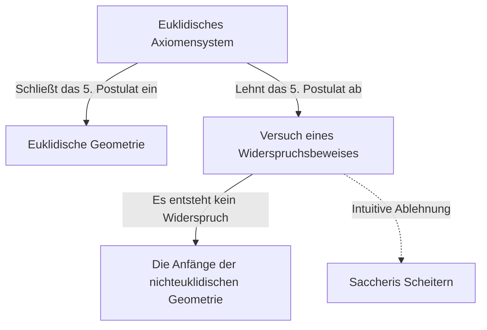
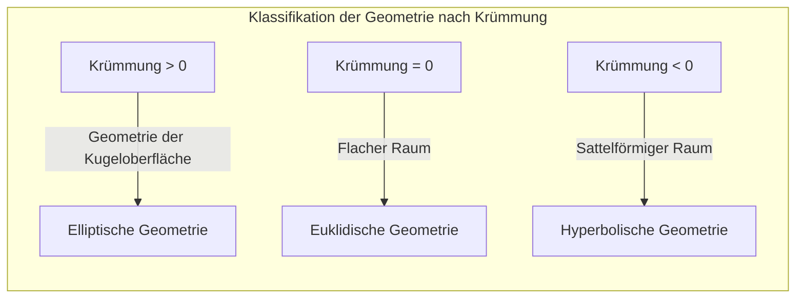

## 1. Einleitung: Der Fluch des Euklid

Im 3. Jahrhundert v. Chr. systematisierte der antike griechische Mathematiker Euklid in seinem Werk „Die Elemente“ das geometrische Wissen seiner Zeit auf axiomatische Weise. Er stellte 5 Postulate (Forderungen) auf, aber sein 5. Postulat, das sogenannte **Parallelenpostulat**, war im Vergleich zu den anderen vier komplexer und sollte viele Mathematiker plagen.

$$
\text{5. Postulat: Wenn eine gerade Linie zwei gerade Linien schneidet und die Summe der inneren Winkel auf derselben Seite kleiner als zwei rechte Winkel ist, dann schneiden sich die beiden geraden Linien, wenn sie unendlich verlängert werden, auf der Seite, auf der die Summe der inneren Winkel kleiner als zwei rechte Winkel ist.}
$$

Dieses Postulat erscheint intuitiv offensichtlich, aber Mathematiker zweifelten daran: „Ist dies vielleicht kein Postulat, sondern ein Theorem, das aus den anderen vier Postulaten bewiesen werden kann?“ Und für etwa 2000 Jahre versuchten unzählige Genies, diesen Beweis zu erbringen, und scheiterten.

## 2. Die Herausforderung und das Scheitern am Parallelenpostulat

Ab der Renaissance versuchten Mathematiker wie Saccheri und Lambert, das 5. Postulat durch einen „Widerspruchsbeweis“ zu beweisen. Das heißt, sie nahmen an, dass „das 5. Postulat nicht gilt“, und versuchten, daraus einen Widerspruch abzuleiten. Was sie jedoch ableiteten, war kein Widerspruch, sondern eine Reihe von völlig bizarren, aber logisch fehlerfreien „neuen geometrischen Theoremen“.

Saccheri untersuchte die „Hypothese des spitzen Winkels“ und die „Hypothese des stumpfen Winkels“. Obwohl er erkannte, dass aus der Hypothese des spitzen Winkels kein Widerspruch abgeleitet werden konnte, verwarf er sie letztendlich aufgrund seiner eigenen Überzeugungen.

## 3. Die Entdeckung des „gekrümmten Raums“: Die Geburt der hyperbolischen Geometrie

Zu Beginn des 19. Jahrhunderts kam es schließlich zu einer Revolution. Drei Männer – der Deutsche Carl Friedrich Gauss, der Ungar János Bolyai und der Russe Nikolai Lobatschewski – kamen unabhängig voneinander zu dem Schluss: „Das 5. Postulat ist unabhängig von den anderen Postulaten, und es gibt eine völlig neue Geometrie, in der dieses nicht gilt.“

Die Geometrie, die sie entdeckten, wird heute als **hyperbolische Geometrie** bezeichnet. In diesem Raum gibt es „unendlich viele“ parallele Linien, die durch einen einzelnen Punkt außerhalb einer geraden Linie verlaufen. Außerdem ist die Summe der Innenwinkel eines Dreiecks immer kleiner als 180 Grad.

$$
\text{Summe der Innenwinkel eines Dreiecks in der hyperbolischen Geometrie} < 180^\circ
$$

Aufgrund der außergewöhnlichen Innovationskraft dieser Entdeckung fürchtete Gauss das Unverständnis der Öffentlichkeit so sehr, dass er von einer Veröffentlichung zu Lebzeiten absah. Durch die Veröffentlichung der Arbeiten von Bolyai und Lobatschewski erlebte die Welt der Mathematik einen grundlegenden Paradigmenwechsel.

## 4. Riemannsche Geometrie: Die Verallgemeinerung des Raumkonzepts

Der nächste große Sprung in der nichteuklidischen Geometrie wurde durch Bernhard Riemann, einen Schüler von Gauss, eingeleitet. In seiner Antrittsvorlesung im Jahr 1854 präsentierte Riemann eine bahnbrechende Idee über die Grundlagen der Geometrie.

Er führte den **metrischen Tensor** ein, der lokal die Krümmung des Raumes definiert, und konstruierte eine allgemeinere Geometrie (**Riemannsche Geometrie**), in der sich Dimension und Krümmung des Raumes je nach Ort ändern.

Innerhalb von Riemanns Rahmenwerk konnten euklidische Geometrie (Krümmung 0) und hyperbolische Geometrie (negative konstante Krümmung) zusammen mit der Geometrie der Kugeloberfläche (positive konstante Krümmung, **elliptische Geometrie**) einheitlich behandelt werden. In der elliptischen Geometrie „existieren keine“ parallelen Linien, und die Summe der Innenwinkel eines Dreiecks ist größer als 180 Grad.

$$
\text{Summe der Innenwinkel eines Dreiecks in der elliptischen Geometrie} > 180^\circ
$$

## 5. Der Weg zur Relativitätstheorie: Die Verschmelzung von Mathematik und Physik

Der großartige mathematische Rahmen, den Riemann aufgebaut hatte, blieb eine Zeit lang auf den Bereich der reinen Mathematik beschränkt. Im frühen 20. Jahrhundert, als Albert Einstein versuchte, eine neue Gravitationstheorie aufzubauen, sollte diese Riemannsche Geometrie jedoch eine entscheidende Rolle spielen.

Einstein schlug in der speziellen Relativitätstheorie das Konzept der „Raumzeit“ vor, in dem Zeit und Raum integriert wurden. Und in der **allgemeinen Relativitätstheorie** gelangte er zu der bahnbrechenden Idee: „Gravitation ist die Krümmung (Verzerrung) der Raumzeit durch massereiche Objekte.“

$$
R_{\mu\nu} - \frac{1}{2}Rg_{\mu\nu} + \Lambda g_{\mu\nu} = \frac{8\pi G}{c^4}T_{\mu\nu}
$$

In der obigen Einstein-Gleichung repräsentiert die linke Seite die geometrische Struktur (Krümmung) der Raumzeit und die rechte Seite die Verteilung von Materie und Energie. Mit anderen Worten: **Materie bestimmt, wie sich die Raumzeit krümmt, und die gekrümmte Raumzeit bestimmt die Bewegung der Materie**.

## 6. Fazit

Die Erforschung der nichteuklidischen Geometrie, die mit einem kleinen Zweifel an Euklids 5. Postulat begann, durchbrach die intuitiven Annahmen der Menschheit über den Raum und bewies die Freiheit der Mathematik. Und dies gipfelte schließlich in der allgemeinen Relativitätstheorie, die die fundamentale Struktur des Universums erklärt.

Die Suche nach reiner Logik in der Mathematik wird später zu einer unverzichtbaren Sprache, um die tiefsten Wahrheiten der physischen Welt zu beschreiben. Die Geschichte der nichteuklidischen Geometrie lehrt uns die Größe des menschlichen Intellekts und die erstaunlichen Geheimnisse der Natur.
