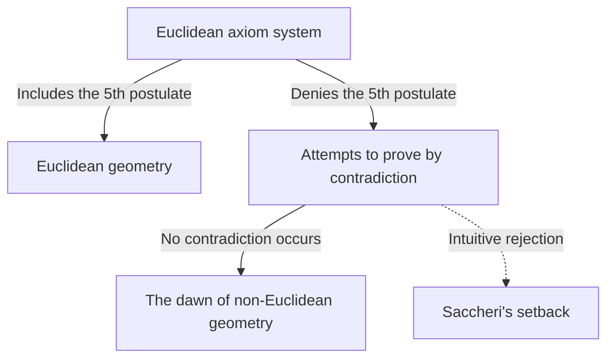
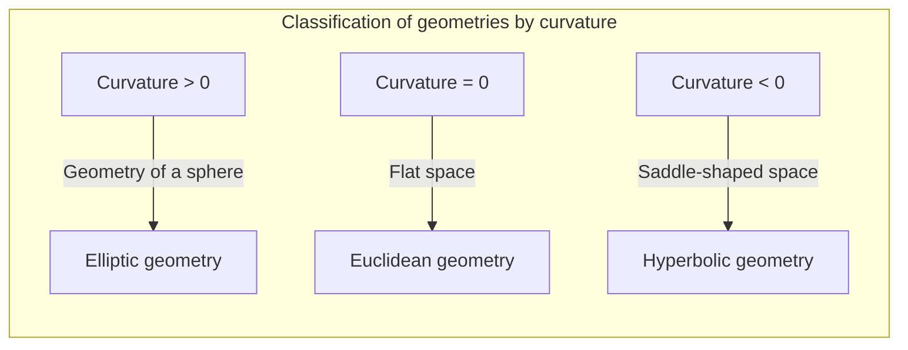

## 1. Introduction: The Curse of [Euclid](https://kenji.blog/en/p/euclid/)

In the 3rd century BC, the ancient Greek mathematician [Euclid](https://kenji.blog/en/p/euclid/) axiomatically systematized the geometrical knowledge of the time in his book "Elements". He proposed 5 postulates (demands), but the 5th postulate, the so-called **parallel postulate**, was more complex than the other four and would plague many mathematicians.

$$
\text{5th Postulate: If a straight line intersects two straight lines and makes the interior angles on the same side less than two right angles, the two straight lines, if extended indefinitely, intersect on that side on which are the angles less than two right angles.}
$$

This postulate seems intuitively obvious, but mathematicians suspected, "Isn't this a theorem that can be proven from the other four postulates, rather than a postulate?" And for about 2000 years, countless geniuses attempted this proof, and failed.

## 2. Challenges and Setbacks to the Parallel Postulate

Since the Renaissance, mathematicians such as Saccheri and Lambert attempted to prove the 5th postulate using "proof by contradiction". That is, they assumed "the 5th postulate does not hold" and tried to derive a contradiction from it. However, what they derived was not a contradiction, but a number of "new geometrical theorems" that were utterly bizarre but logically sound.

Saccheri examined the "hypothesis of the acute angle" and the "hypothesis of the obtuse angle", and although he realized that no contradiction could be derived from the acute angle hypothesis, he ultimately rejected it due to his own beliefs.

## 3. The Discovery of "Curved Space": The Birth of Hyperbolic Geometry

Entering the 19th century, a revolution finally occurred. Three men, the German [Carl Friedrich Gauss](https://kenji.blog/en/p/gauss/), the Hungarian János Bolyai, and the Russian Nikolai Lobachevsky, independently reached the conclusion that "the 5th postulate is independent of the other postulates, and there exists a completely new geometry where it does not hold."

The geometry they discovered is now called **hyperbolic geometry**. In this space, there exist "infinitely many" parallel lines passing through a single point outside a straight line. Also, the sum of the interior angles of a triangle is always less than 180 degrees.

$$
\text{The sum of the interior angles of a triangle in hyperbolic geometry} < 180^\circ
$$

Because of the overwhelming innovation of this discovery, Gauss refrained from publishing it during his lifetime, fearing the public's lack of understanding. When Bolyai and Lobachevsky published their papers, the world of mathematics welcomed a fundamental paradigm shift.

## 4. [Riemann](https://kenji.blog/en/p/riemann/)ian Geometry: The Generalization of the Concept of Space

The next leap in non-[Euclide](https://kenji.blog/p/euclid/)an geometry was brought about by Bernhard Riemann, a student of Gauss. In his 1854 inaugural lecture, [Riemann](https://kenji.blog/en/p/riemann/) presented groundbreaking ideas about the foundations of geometry.

He introduced the **metric tensor**, which locally defines the bending (curvature) of space, and constructed a more general geometry (**[Riemann](https://kenji.blog/en/p/riemann/)ian geometry**) where the dimension and curvature of space can vary from place to place.

Within [Riemann](https://kenji.blog/en/p/riemann/)'s framework, in addition to [Euclide](https://kenji.blog/p/euclid/)an geometry (zero curvature) and hyperbolic geometry (negative constant curvature), the geometry of a sphere (positive constant curvature, **elliptic geometry**) could also be treated uniformly. In elliptic geometry, parallel lines "do not exist", and the sum of the interior angles of a triangle is greater than 180 degrees.

$$
\text{The sum of the interior angles of a triangle in elliptic geometry} > 180^\circ
$$

## 5. The Path to the Theory of Relativity: The Fusion of Mathematics and Physics

The magnificent mathematical framework constructed by [Riemann](https://kenji.blog/en/p/riemann/) remained in the realm of pure mathematics for a while. However, in the early 20th century, when Albert Einstein attempted to construct a new theory of gravity, this [Riemann](https://kenji.blog/en/p/riemann/)ian geometry would play a decisive role.

Einstein proposed the concept of "spacetime", which integrated time and space in the special theory of relativity. And in the **general theory of relativity**, he reached the groundbreaking idea that "gravity is the distortion (curve) of spacetime by objects with mass."

$$
R_{\mu\nu} - \frac{1}{2}Rg_{\mu\nu} + \[Lambda](https://kenji.blog/en/p/serverless-architecture-aws-lambda-cold-start/) g_{\mu\nu} = \frac{8\pi G}{c^4}T_{\mu\nu}
$$

In the above Einstein equation, the left side represents the geometric structure (curvature) of spacetime, and the right side represents the distribution of matter and energy. In other words, **matter determines how spacetime curves, and curved spacetime determines the motion of matter**.

## 6. Conclusion

The exploration of non-[Euclide](https://kenji.blog/p/euclid/)an geometry, which began with a modest doubt about [Euclid](https://kenji.blog/en/p/euclid/)'s 5th postulate, shattered human's intuitive preconceptions about space and proved the freedom of mathematics. And it ultimately bore fruit as the general theory of relativity, which unravels the fundamental structure of the universe.

The pursuit of pure logic in mathematics would later become the indispensable language for describing the deepest truths of the physical world. The history of non-[Euclide](https://kenji.blog/p/euclid/)an geometry teaches us the greatness of human intellect and the astonishing mysteries of the natural world.
