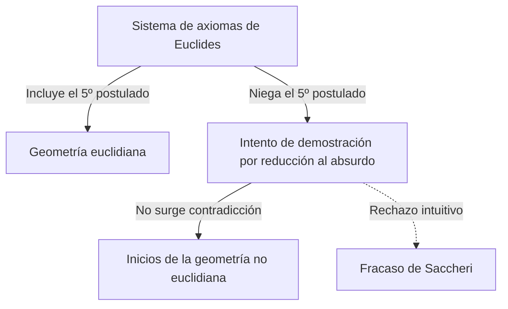
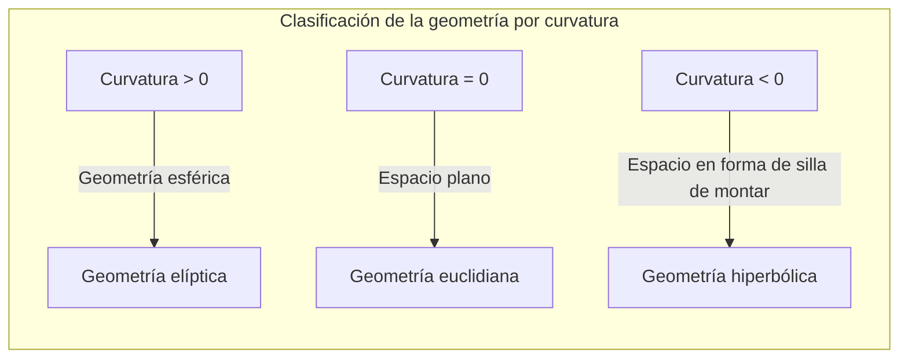

## 1. Introducción: La atadura de [Euclides](https://kenji.blog/p/euclid/)

En el siglo III a.C., el matemático griego antiguo [Euclides](https://kenji.blog/p/euclid/) sistematizó axiomáticamente los conocimientos geométricos de su tiempo en su libro *Los Elementos*. Presentó 5 postulados (demandas), pero el quinto postulado, el llamado **postulado de las paralelas**, era más complejo que los otros cuatro y terminaría atormentando a muchos matemáticos.

$$
\text{Quinto postulado: Si una línea recta corta a otras dos rectas y forma de un mismo lado ángulos interiores cuya suma es menor que dos ángulos rectos, las dos rectas, prolongadas indefinidamente, se cortarán del lado en el que están los ángulos menores que dos rectos.}
$$

Aunque este postulado parece intuitivamente obvio, los matemáticos dudaron: "¿No es esto un teorema que se puede demostrar a partir de los otros cuatro postulados, en lugar de ser un postulado?". Y durante unos 2000 años, innumerables genios intentaron demostrarlo y fracasaron.

## 2. El desafío al postulado de las paralelas y el fracaso

Desde el Renacimiento, matemáticos como Saccheri y Lambert intentaron demostrar el quinto postulado utilizando la "reducción al absurdo". Es decir, asumieron que "el quinto postulado no se cumple" e intentaron derivar una contradicción a partir de ahí. Sin embargo, lo que derivaron no fue una contradicción, sino una serie de "nuevos teoremas geométricos" completamente extraños pero lógicamente coherentes.

Saccheri examinó la "hipótesis del ángulo agudo" y la "hipótesis del ángulo obtuso", y aunque se dio cuenta de que de la hipótesis del ángulo agudo no se podía derivar ninguna contradicción, finalmente la rechazó debido a sus propias creencias.

## 3. El descubrimiento del "espacio curvo": El nacimiento de la geometría hiperbólica

En el siglo XIX, finalmente ocurrió una revolución. El alemán [Carl Friedrich Gauss](https://kenji.blog/es/p/gauss/), el húngaro János Bolyai y el ruso Nikolai Lobachevsky llegaron de forma independiente a la conclusión de que "el quinto postulado es independiente de los demás postulados, y existe una geometría completamente nueva en la que este no se cumple".

La geometría que descubrieron se llama actualmente **geometría hiperbólica**. En este espacio, existen "infinitas" líneas paralelas que pasan por un punto exterior a una recta. Además, la suma de los ángulos interiores de un triángulo es siempre menor a 180 grados.

$$
\text{Suma de los ángulos interiores de un triángulo en la geometría hiperbólica} < 180^\circ
$$

Debido a la naturaleza tan innovadora de este descubrimiento, Gauss temió la incomprensión del público y se abstuvo de publicarlo en vida. Con la publicación de los artículos de Bolyai y Lobachevsky, el mundo de las matemáticas experimentó un cambio de paradigma fundamental.

## 4. Geometría de [Riemann](https://kenji.blog/es/p/riemann/): Generalización del concepto de espacio

El siguiente gran salto en la geometría no euclidiana fue dado por [Bernhard Riemann](https://kenji.blog/es/p/riemann/), estudiante de Gauss. En su conferencia de habilitación de 1854, [Riemann](https://kenji.blog/es/p/riemann/) presentó ideas revolucionarias sobre los fundamentos de la geometría.

Introdujo el **tensor métrico**, que define localmente la curvatura del espacio, y construyó una geometría más general (**geometría de [Riemann](https://kenji.blog/es/p/riemann/)**) en la que la dimensión y la curvatura del espacio pueden variar según la ubicación.

Dentro del marco de [Riemann](https://kenji.blog/es/p/riemann/), además de la geometría euclidiana (curvatura 0) y la geometría hiperbólica (curvatura constante negativa), también se puede tratar de manera unificada la geometría esférica (curvatura constante positiva, **geometría elíptica**). En la geometría elíptica, las líneas paralelas "no existen", y la suma de los ángulos interiores de un triángulo es mayor a 180 grados.

$$
\text{Suma de los ángulos interiores de un triángulo en la geometría elíptica} > 180^\circ
$$

## 5. El camino hacia la teoría de la relatividad: Fusión de matemáticas y física

El magnífico marco matemático construido por [Riemann](https://kenji.blog/es/p/riemann/) permaneció en el ámbito de las matemáticas puras durante algún tiempo. Sin embargo, a principios del siglo XX, cuando Albert Einstein intentó construir una nueva teoría de la gravedad, esta geometría de [Riemann](https://kenji.blog/es/p/riemann/) jugó un papel decisivo.

En su teoría de la relatividad especial, Einstein propuso el concepto de "espacio-tiempo", que integra el tiempo y el espacio. Y en la **teoría de la relatividad general**, llegó a la idea revolucionaria de que "la gravedad es la curvatura (deformación) del espacio-tiempo causada por objetos con masa".

$$
R_{\mu\nu} - \frac{1}{2}Rg_{\mu\nu} + \[Lambda](https://kenji.blog/es/p/serverless-architecture-aws-lambda-cold-start/) g_{\mu\nu} = \frac{8\pi G}{c^4}T_{\mu\nu}
$$

En la ecuación de Einstein anterior, el lado izquierdo representa la estructura geométrica (curvatura) del espacio-tiempo, y el lado derecho representa la distribución de la materia y la energía. En otras palabras, **la materia determina cómo se curva el espacio-tiempo, y el espacio-tiempo curvo determina el movimiento de la materia**.

## 6. Conclusión

La exploración de la geometría no euclidiana, que comenzó como una pequeña duda sobre el quinto postulado de [Euclides](https://kenji.blog/p/euclid/), rompió las suposiciones intuitivas humanas sobre el espacio y demostró la libertad de las matemáticas. Y finalmente culminó en la teoría de la relatividad general, que desentraña la estructura fundamental del universo.

La búsqueda de la lógica pura en las matemáticas se convirtió más tarde en un lenguaje indispensable para describir las verdades más profundas del mundo físico. La historia de la geometría no euclidiana nos enseña la grandeza del intelecto humano y los sorprendentes misterios del mundo natural.
