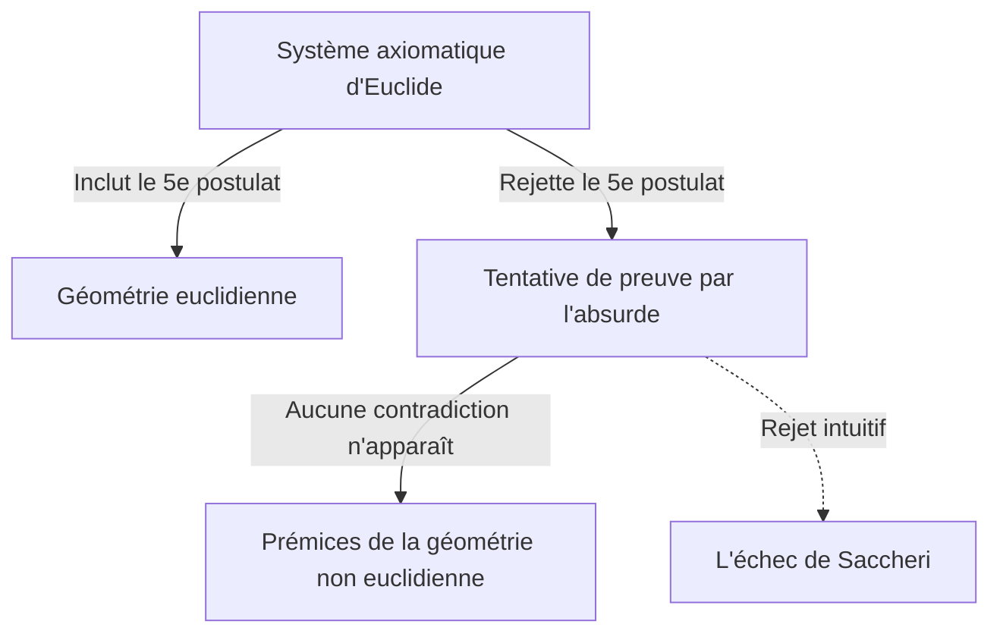
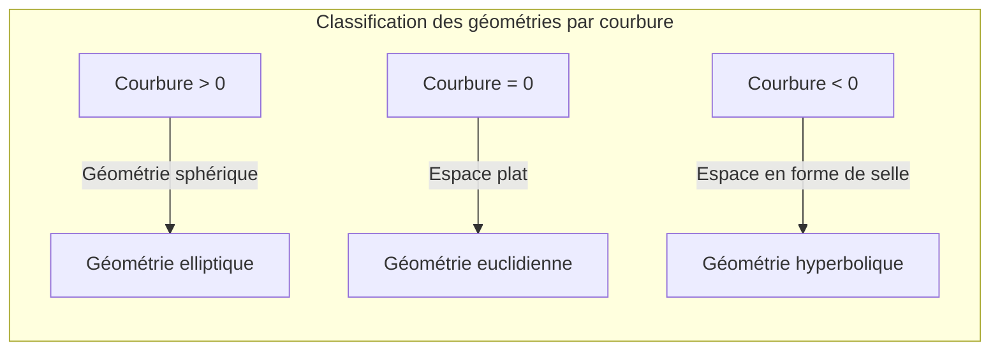

## 1. Introduction : L'Emprise d'[[Euclid](https://kenji.blog/fr/p/euclid/)e](https://kenji.blog/p/euclid/)

Au IIIe siècle av. J.-C., le mathématicien grec antique [[Euclid](https://kenji.blog/fr/p/euclid/)e](https://kenji.blog/p/euclid/) a systématisé axiomatiquement les connaissances géométriques de son époque dans son ouvrage *Éléments*. Il a présenté cinq postulats, mais le cinquième, appelé le **postulat des parallèles**, était plus complexe que les quatre autres et a causé bien des tourments aux mathématiciens par la suite.

$$
\text{5e postulat : Si une ligne droite tombant sur deux lignes droites fait les angles intérieurs du même côté plus petits que deux angles droits, les deux lignes droites, si elles sont prolongées indéfiniment, se rencontrent du côté où les angles sont plus petits que deux angles droits.}
$$

Ce postulat semble intuitivement évident, mais les mathématiciens ont douté : « N'est-ce pas plutôt un théorème qui peut être prouvé à partir des quatre autres postulats, plutôt qu'un postulat ? » Pendant près de 2000 ans, d'innombrables génies ont tenté de le prouver et ont échoué.

## 2. Le Défi et l'Échec face au Postulat des Parallèles

Depuis la Renaissance, des mathématiciens tels que Saccheri et Lambert ont tenté de prouver le 5e postulat en utilisant une « preuve par l'absurde ». C'est-à-dire qu'ils ont supposé que « le 5e postulat n'est pas vérifié » et ont tenté d'en déduire une contradiction. Cependant, ce qu'ils ont obtenu n'était pas une contradiction, mais plutôt une série de « nouveaux théorèmes géométriques » tout à fait étranges mais logiquement cohérents.

Saccheri a examiné « l'hypothèse de l'angle aigu » et « l'hypothèse de l'angle obtus », et bien qu'il ait réalisé qu'aucune contradiction ne pouvait être déduite de l'hypothèse de l'angle aigu, il a fini par la rejeter en raison de ses propres convictions.

## 3. La Découverte de l'« Espace Courbe » : Naissance de la Géométrie Hyperbolique

Au XIXe siècle, une révolution éclate enfin. L'Allemand [Carl Friedrich Gauss](https://kenji.blog/fr/p/gauss/), le Hongrois János Bolyai et le Russe Nikolaï Lobatchevski parviennent indépendamment à la conclusion que « le 5e postulat est indépendant des autres postulats, et il existe une géométrie entièrement nouvelle où il n'est pas vérifié ».

La géométrie qu'ils ont découverte est aujourd'hui appelée **géométrie hyperbolique**. Dans cet espace, il existe une « infinité » de droites parallèles passant par un point extérieur à une droite. De plus, la somme des angles intérieurs d'un triangle est toujours inférieure à 180 degrés.

$$
\text{Somme des angles intérieurs d'un triangle en géométrie hyperbolique} < 180^\circ
$$

Gauss, craignant l'incompréhension du public face à l'innovation radicale de cette découverte, s'est abstenu de la publier de son vivant. C'est la publication des travaux par Bolyai et Lobatchevski qui a entraîné un changement de paradigme fondamental dans le monde des mathématiques.

## 4. La Géométrie [Riemann](https://kenji.blog/fr/p/riemann/)ienne : Généralisation du Concept d'Espace

Le prochain bond en avant de la géométrie non euclidienne a été réalisé par [Bernhard Riemann](https://kenji.blog/fr/p/riemann/), un élève de Gauss. Lors de sa leçon d'habilitation en 1854, [Riemann](https://kenji.blog/fr/p/riemann/) a présenté des idées révolutionnaires sur les fondements de la géométrie.

Il a introduit le **tenseur métrique** pour définir localement la courbure de l'espace, et a construit une géométrie plus générale (**la géométrie riemannienne**) où la dimension et la courbure de l'espace peuvent varier selon le lieu.

Dans le cadre de [Riemann](https://kenji.blog/fr/p/riemann/), il est devenu possible de traiter de manière unifiée la géométrie euclidienne (courbure nulle), la géométrie hyperbolique (courbure constante négative) et la géométrie sphérique (courbure constante positive, **géométrie elliptique**). En géométrie elliptique, les droites parallèles « n'existent pas », et la somme des angles intérieurs d'un triangle est supérieure à 180 degrés.

$$
\text{Somme des angles intérieurs d'un triangle en géométrie elliptique} > 180^\circ
$$

## 5. Vers la Théorie de la Relativité : Fusion des Mathématiques et de la Physique

Le grand cadre mathématique construit par [Riemann](https://kenji.blog/fr/p/riemann/) est resté quelque temps confiné au domaine des mathématiques pures. Cependant, au début du XXe siècle, lorsque Albert Einstein a cherché à construire une nouvelle théorie de la gravité, cette géométrie riemannienne a joué un rôle décisif.

Einstein a proposé le concept d'« espace-temps » unifiant l'espace et le temps dans sa théorie de la relativité restreinte. Puis, dans sa **théorie de la relativité générale**, il a abouti à l'idée révolutionnaire que « la gravité est la distorsion (courbure) de l'espace-temps par des objets massifs ».

$$
R_{\mu\nu} - \frac{1}{2}Rg_{\mu\nu} + \Lambda g_{\mu\nu} = \frac{8\pi G}{c^4}T_{\mu\nu}
$$

Dans l'équation d'Einstein ci-dessus, le côté gauche représente la structure géométrique (courbure) de l'espace-temps, et le côté droit représente la distribution de la matière et de l'énergie. En d'autres termes, **la matière dicte à l'espace-temps comment se courber, et l'espace-temps courbé dicte à la matière comment se déplacer**.

## 6. Conclusion

L'exploration de la géométrie non euclidienne, qui a commencé par un simple doute sur le 5e postulat d'[[Euclid](https://kenji.blog/fr/p/euclid/)e](https://kenji.blog/p/euclid/), a brisé les idées reçues intuitives de l'humanité sur l'espace et a prouvé la liberté des mathématiques. Et cela a finalement abouti à la théorie de la relativité générale, qui élucide la structure fondamentale de l'univers.

La poursuite de la logique pure en mathématiques deviendra plus tard le langage indispensable pour décrire les vérités les plus profondes du monde physique. L'histoire de la géométrie non euclidienne nous enseigne la grandeur de l'intellect humain et le mystère étonnant du monde naturel.
