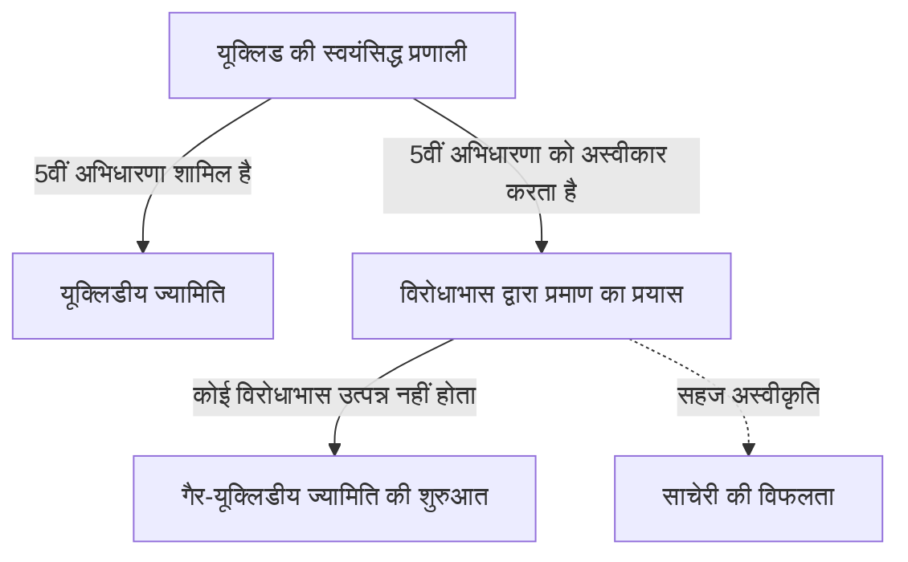
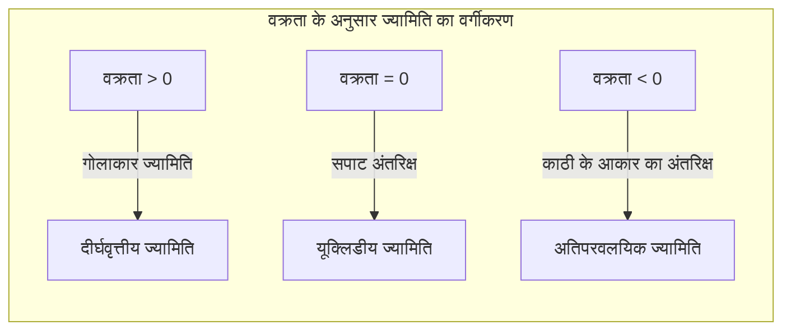

## 1. प्रस्तावना: [यूक्लिड](https://kenji.blog/hi/p/euclid/) का अभिशाप

तीसरी शताब्दी ईसा पूर्व में, प्राचीन ग्रीक गणितज्ञ [यूक्लिड](https://kenji.blog/hi/p/euclid/) ने अपनी पुस्तक "एलिमेंट्स" में उस समय के ज्यामितीय ज्ञान को एक स्वयंसिद्ध प्रणाली के रूप में व्यवस्थित किया। उन्होंने 5 अभिधारणाएं (postulates) प्रस्तुत कीं, लेकिन उनकी 5वीं अभिधारणा, जिसे आमतौर पर **समानांतर अभिधारणा** कहा जाता है, अन्य 4 की तुलना में अधिक जटिल थी, और इसने कई गणितज्ञों को परेशान किया।

$$
\text{5वीं अभिधारणा: यदि एक सीधी रेखा दो सीधी रेखाओं को काटती है, और एक ही तरफ के आंतरिक कोणों का योग दो समकोणों से कम है, तो उन दो रेखाओं को अनिश्चित काल तक बढ़ाने पर वे उसी तरफ मिलेंगी जहाँ कोणों का योग दो समकोणों से कम है।}
$$

यह अभिधारणा सहज रूप से स्पष्ट लगती है, लेकिन गणितज्ञों को संदेह था कि "क्या यह कोई अभिधारणा नहीं है, बल्कि एक प्रमेय है जिसे अन्य 4 अभिधारणाओं से सिद्ध किया जा सकता है?" और लगभग 2000 वर्षों तक, अनगिनत प्रतिभाओं ने इस प्रमाण को खोजने का प्रयास किया, लेकिन विफल रहे।

## 2. समानांतर अभिधारणा को चुनौती और विफलता

पुनर्जागरण काल के बाद, साचेरी (Saccheri) और लैम्बर्ट (Lambert) जैसे गणितज्ञों ने "विरोधाभास द्वारा प्रमाण" (proof by contradiction) का उपयोग करके 5वीं अभिधारणा को सिद्ध करने का प्रयास किया। यानी, उन्होंने यह मान लिया कि "5वीं अभिधारणा सत्य नहीं है", और इससे एक विरोधाभास निकालने की कोशिश की। हालाँकि, जो उन्होंने निकाला वह कोई विरोधाभास नहीं था, बल्कि "नए ज्यामिति के प्रमेय" थे, जो पूरी तरह से अजीब होने के बावजूद तार्किक रूप से सुसंगत थे।

साचेरी ने "न्यूनकोण परिकल्पना" (acute angle hypothesis) और "अधिककोण परिकल्पना" (obtuse angle hypothesis) की जांच की, और हालांकि उन्होंने महसूस किया कि न्यूनकोण परिकल्पना से कोई विरोधाभास नहीं निकाला जा सकता है, अंततः उन्होंने अपने व्यक्तिगत विश्वास के कारण इसे खारिज कर दिया।

## 3. "घुमावदार अंतरिक्ष" की खोज: अतिपरवलयिक (Hyperbolic) ज्यामिति का जन्म

19वीं सदी में अंततः एक क्रांति हुई। जर्मनी के [कार्ल फ्रेडरिक गॉस](https://kenji.blog/hi/p/gauss/) ([Carl Friedrich Gauss](https://kenji.blog/hi/p/gauss/)), हंगरी के जानोस बोल्याई (János Bolyai), और रूस के निकोलाई लोबाचेव्स्की (Nikolai Lobachevsky) - इन तीनों ने स्वतंत्र रूप से यह निष्कर्ष निकाला कि "5वीं अभिधारणा अन्य अभिधारणाओं से स्वतंत्र है, और एक पूरी तरह से नई ज्यामिति मौजूद है जहाँ यह लागू नहीं होती।"

उन्होंने जिस ज्यामिति की खोज की, उसे अब **अतिपरवलयिक ज्यामिति** कहा जाता है। इस स्थान में, एक बिंदु से होकर जाने वाली और एक दी गई रेखा के समानांतर "अनंत" रेखाएं होती हैं। साथ ही, एक त्रिभुज के आंतरिक कोणों का योग हमेशा 180 डिग्री से कम होता है।

$$
\text{अतिपरवलयिक ज्यामिति में त्रिभुज के आंतरिक कोणों का योग} < 180^\circ
$$

इस खोज की अत्यधिक नवोन्मेषी प्रकृति और समाज द्वारा इसके न समझे जाने के डर के कारण, गॉस ने अपने जीवनकाल में इसे प्रकाशित करने से परहेज किया। बोल्याई और लोबाचेव्स्की द्वारा अपने शोध पत्र प्रकाशित करने के साथ, गणित की दुनिया में एक मौलिक प्रतिमान बदलाव (paradigm shift) आया।

## 4. रीमैनीयन ([Riemann](https://kenji.blog/hi/p/riemann/)ian) ज्यामिति: अंतरिक्ष की अवधारणा का सामान्यीकरण

गैर-[यूक्लिड](https://kenji.blog/hi/p/euclid/)ीय ज्यामिति में अगली बड़ी छलांग गॉस के छात्र बर्नहार्ड रीमैन ([Bernhard Riemann](https://kenji.blog/hi/p/riemann/)) द्वारा लाई गई। 1854 में अपने उद्घाटन व्याख्यान में, रीमैन ने ज्यामिति की नींव के बारे में क्रांतिकारी विचार प्रस्तुत किए।

उन्होंने एक **मीट्रिक टेंसर** (metric tensor) पेश किया, जो अंतरिक्ष की वक्रता (curvature) को स्थानीय रूप से परिभाषित करता है, और अधिक सामान्य ज्यामिति ( **रीमैनीयन ज्यामिति** ) का निर्माण किया, जिसमें अंतरिक्ष के आयाम और वक्रता स्थान के अनुसार बदलते हैं।

रीमैन के ढांचे के भीतर, [यूक्लिड](https://kenji.blog/hi/p/euclid/)ीय ज्यामिति (शून्य वक्रता) और अतिपरवलयिक ज्यामिति (नकारात्मक निरंतर वक्रता) के अलावा, गोलाकार ज्यामिति (सकारात्मक निरंतर वक्रता, **दीर्घवृत्तीय ज्यामिति** ) को भी एकीकृत रूप से संभाला जा सकता था। दीर्घवृत्तीय ज्यामिति में समानांतर रेखाएं "अस्तित्व में नहीं हैं", और त्रिभुज के आंतरिक कोणों का योग 180 डिग्री से अधिक होता है।

$$
\text{दीर्घवृत्तीय ज्यामिति में त्रिभुज के आंतरिक कोणों का योग} > 180^\circ
$$

## 5. सापेक्षता के सिद्धांत का मार्ग: गणित और भौतिकी का विलय

रीमैन द्वारा निर्मित भव्य गणितीय ढांचा कुछ समय तक शुद्ध गणित के क्षेत्र तक ही सीमित रहा। हालाँकि, 20वीं सदी की शुरुआत में, जब अल्बर्ट आइंस्टीन (Albert Einstein) ने गुरुत्वाकर्षण का एक नया सिद्धांत बनाने की कोशिश की, तो इस रीमैनीयन ज्यामिति ने एक निर्णायक भूमिका निभाई।

आइंस्टीन ने विशेष सापेक्षता के सिद्धांत में "दिक्-काल" (spacetime) की अवधारणा का प्रस्ताव रखा, जिसने समय और स्थान को एकीकृत किया। और **सामान्य सापेक्षता के सिद्धांत** में, वे इस क्रांतिकारी विचार पर पहुँचे कि "गुरुत्वाकर्षण द्रव्यमान (mass) वाले पिंडों के कारण दिक्-काल का विरूपण (curvature) है।"

$$
R_{\mu\nu} - \frac{1}{2}Rg_{\mu\nu} + \[Lambda](https://kenji.blog/hi/p/serverless-architecture-aws-lambda-cold-start/) g_{\mu\nu} = \frac{8\pi G}{c^4}T_{\mu\nu}
$$

उपरोक्त आइंस्टीन समीकरण में, बायाँ पक्ष दिक्-काल की ज्यामितीय संरचना (वक्रता) का प्रतिनिधित्व करता है, और दायाँ पक्ष पदार्थ और ऊर्जा के वितरण का प्रतिनिधित्व करता है। दूसरे शब्दों में, **पदार्थ दिक्-काल के झुकने का निर्धारण करता है, और घुमावदार दिक्-काल पदार्थ की गति का निर्धारण करता है**।

## 6. निष्कर्ष

[यूक्लिड](https://kenji.blog/hi/p/euclid/) की 5वीं अभिधारणा के बारे में एक साधारण संदेह से शुरू हुई गैर-[यूक्लिड](https://kenji.blog/hi/p/euclid/)ीय ज्यामिति की खोज ने अंतरिक्ष के बारे में मनुष्य की सहज धारणाओं को तोड़ दिया और गणित की स्वतंत्रता को साबित किया। और अंततः, इसका परिणाम सामान्य सापेक्षता के सिद्धांत में हुआ, जिसने ब्रह्मांड की मौलिक संरचना के रहस्यों को उजागर किया।

गणित में शुद्ध तर्क की खोज बाद में भौतिक दुनिया के सबसे गहरे सत्य का वर्णन करने के लिए एक अनिवार्य भाषा बन गई। गैर-[यूक्लिड](https://kenji.blog/hi/p/euclid/)ीय ज्यामिति का इतिहास हमें मानव बुद्धि की महानता और प्राकृतिक दुनिया के आश्चर्यजनक रहस्यों को सिखाता है।
