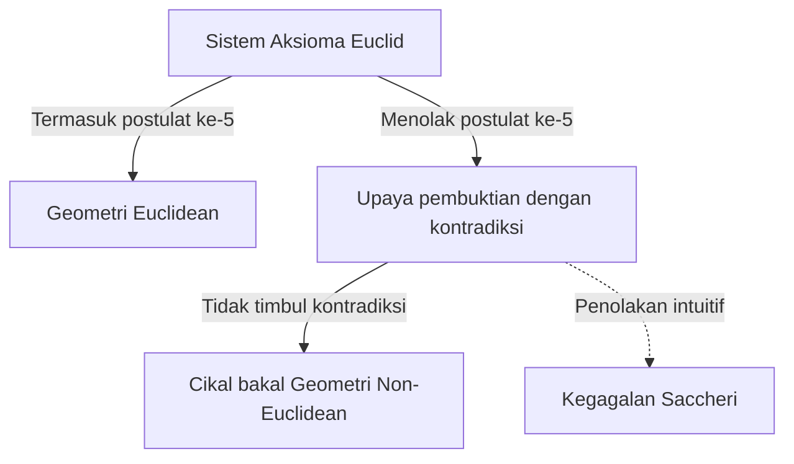
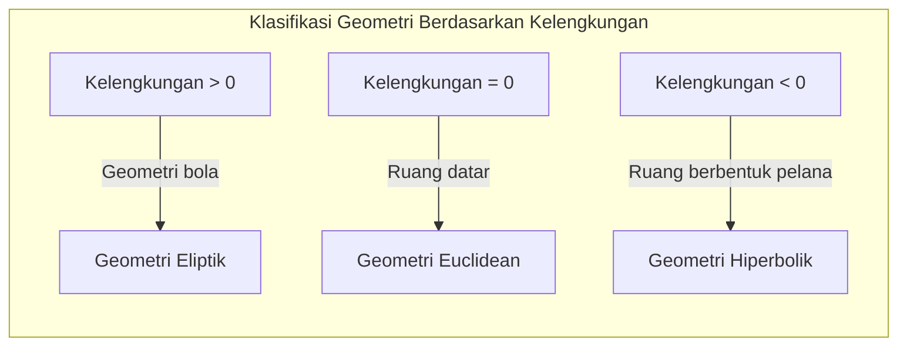

## 1. Pendahuluan: Kutukan [Euclid](https://kenji.blog/id/p/euclid/)

Pada abad ke-3 SM, matematikawan Yunani kuno [Euclid](https://kenji.blog/id/p/euclid/) menyusun pengetahuan geometri pada masanya secara aksiomatik dalam bukunya yang berjudul "Elements". Ia mengajukan 5 postulat (permintaan), tetapi postulat ke-5, yang disebut sebagai **Postulat Sejajar**, lebih kompleks daripada 4 postulat lainnya dan membingungkan banyak matematikawan.

$$
\text{Postulat ke-5: Jika sebuah garis lurus memotong dua garis lurus dan membentuk sudut-sudut dalam sepihak yang jumlahnya kurang dari dua sudut siku-siku, maka kedua garis lurus tersebut jika diperpanjang tanpa batas, akan bertemu di pihak yang jumlah sudutnya kurang dari dua sudut siku-siku.}
$$

Postulat ini tampak jelas secara intuitif, tetapi para matematikawan meragukannya dengan mengatakan, "Mungkinkah ini bukan postulat, melainkan sebuah teorema yang bisa dibuktikan dari 4 postulat lainnya?" Dan selama sekitar 2000 tahun, banyak jenius yang tak terhitung jumlahnya mencoba membuktikan hal ini, dan akhirnya gagal.

## 2. Tantangan dan Kegagalan terhadap Postulat Sejajar

Sejak masa Renaisans, para matematikawan seperti Saccheri dan Lambert mencoba membuktikan postulat ke-5 menggunakan "pembuktian melalui kontradiksi" (reductio ad absurdum). Yaitu, mereka mengasumsikan "postulat ke-5 tidak berlaku", dan dari sana mencoba menarik sebuah kontradiksi. Namun, yang mereka temukan bukanlah kontradiksi, melainkan serangkaian "teorema geometri baru" yang sangat aneh tetapi tidak memiliki kecacatan logis.

Saccheri memeriksa "hipotesis sudut lancip" dan "hipotesis sudut tumpul", dan meskipun ia menyadari bahwa hipotesis sudut lancip tidak menghasilkan kontradiksi, pada akhirnya ia menolaknya karena keyakinan pribadinya.

## 3. Penemuan "Ruang Melengkung": Lahirnya Geometri Hiperbolik

Memasuki abad ke-19, akhirnya terjadi sebuah revolusi. Tiga orang yaitu [Carl Friedrich Gauss](https://kenji.blog/id/p/gauss/) dari Jerman, János Bolyai dari Hungaria, dan Nikolai Lobachevsky dari Rusia, secara independen mencapai kesimpulan bahwa "postulat ke-5 terbebas dari postulat lainnya, dan ada geometri yang sama sekali baru di mana postulat ini tidak berlaku."

Geometri yang mereka temukan sekarang disebut sebagai **Geometri Hiperbolik**. Dalam ruang ini, garis sejajar yang melewati 1 titik di luar suatu garis lurus ada "tak terhingga" jumlahnya. Selain itu, jumlah sudut dalam sebuah segitiga selalu kurang dari 180 derajat.

$$
\text{Jumlah sudut dalam sebuah segitiga pada Geometri Hiperbolik} < 180^\circ
$$

Karena penemuan ini terlalu revolusioner, Gauss menahan diri untuk tidak mempublikasikannya semasa hidupnya karena takut akan ketidakpahaman publik. Publikasi makalah oleh Bolyai dan Lobachevsky membawa pergeseran paradigma fundamental dalam dunia matematika.

## 4. Geometri [Riemann](https://kenji.blog/id/p/riemann/): Generalisasi Konsep Ruang

Lompatan selanjutnya dalam geometri non-[[Euclid](https://kenji.blog/id/p/euclid/)e](https://kenji.blog/p/euclid/)an dibawa oleh murid Gauss, yaitu [Bernhard Riemann](https://kenji.blog/id/p/riemann/). Dalam kuliah pelantikannya pada tahun 1854, [Riemann](https://kenji.blog/id/p/riemann/) mempresentasikan gagasan terobosan tentang dasar-dasar geometri.

Ia memperkenalkan **Tensor Metrik** yang mendefinisikan kelengkungan ruang secara lokal, dan membangun sebuah geometri yang lebih umum (**Geometri [Riemann](https://kenji.blog/id/p/riemann/)ian**), di mana dimensi dan kelengkungan ruang dapat berubah-ubah bergantung pada lokasinya.

Dalam kerangka [Riemann](https://kenji.blog/id/p/riemann/), selain geometri [[Euclid](https://kenji.blog/id/p/euclid/)e](https://kenji.blog/p/euclid/)an (kelengkungan 0) dan geometri hiperbolik (kelengkungan konstan negatif), geometri bola (kelengkungan konstan positif, **Geometri Eliptik**) juga dapat ditangani secara seragam. Dalam geometri eliptik, garis sejajar "tidak ada", dan jumlah sudut dalam sebuah segitiga lebih besar dari 180 derajat.

$$
\text{Jumlah sudut dalam sebuah segitiga pada Geometri Eliptik} > 180^\circ
$$

## 5. Jalan Menuju Teori Relativitas: Perpaduan Matematika dan Fisika

Kerangka matematis agung yang dibangun oleh [Riemann](https://kenji.blog/id/p/riemann/) tetap berada di ranah matematika murni untuk beberapa waktu. Namun pada awal abad ke-20, ketika Albert Einstein mencoba membangun teori gravitasi yang baru, geometri [Riemann](https://kenji.blog/id/p/riemann/)ian ini memainkan peran yang menentukan.

Einstein mengusulkan konsep "ruang-waktu" yang menyatukan ruang dan waktu dalam Teori Relativitas Khusus. Kemudian, dalam **Teori Relativitas Umum**, ia mencapai sebuah gagasan terobosan: "Gravitasi adalah distorsi (kelengkungan) ruang-waktu yang disebabkan oleh benda bermassa."

$$
R_{\mu\nu} - \frac{1}{2}Rg_{\mu\nu} + \Lambda g_{\mu\nu} = \frac{8\pi G}{c^4}T_{\mu\nu}
$$

Dalam Persamaan Einstein di atas, sisi kiri mewakili struktur geometris (kelengkungan) ruang-waktu, dan sisi kanan mewakili distribusi materi dan energi. Dengan kata lain, **materi menentukan bagaimana ruang-waktu melengkung, dan ruang-waktu yang melengkung menentukan pergerakan materi**.

## 6. Penutup

Pencarian geometri non-[[Euclid](https://kenji.blog/id/p/euclid/)e](https://kenji.blog/p/euclid/)an, yang dimulai dari keraguan kecil terhadap postulat ke-5 [Euclid](https://kenji.blog/id/p/euclid/), telah menghancurkan asumsi intuitif manusia tentang ruang dan membuktikan kebebasan matematika. Dan pada akhirnya, hal ini berbuah menjadi Teori Relativitas Umum yang mengungkap struktur fundamental alam semesta.

Eksplorasi logika murni dalam matematika kelak menjadi bahasa yang tak terpisahkan untuk mendeskripsikan kebenaran terdalam dari dunia fisik. Sejarah geometri non-[[Euclid](https://kenji.blog/id/p/euclid/)e](https://kenji.blog/p/euclid/)an mengajarkan kita tentang kehebatan kecerdasan manusia dan misteri alam yang menakjubkan.
