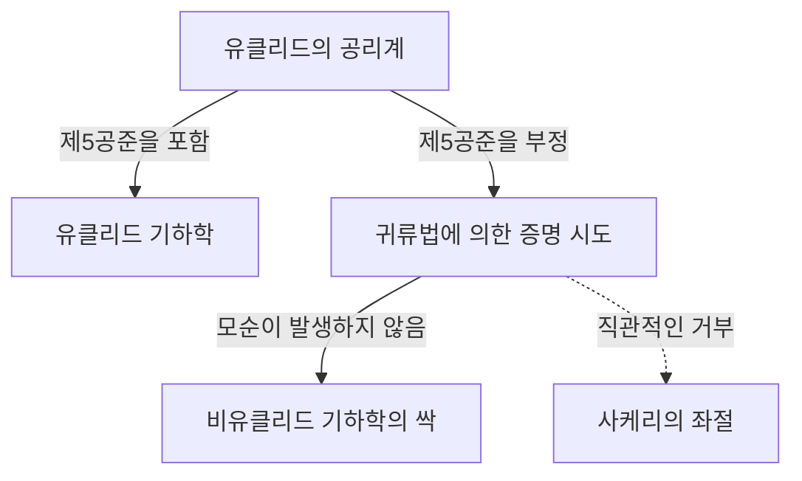
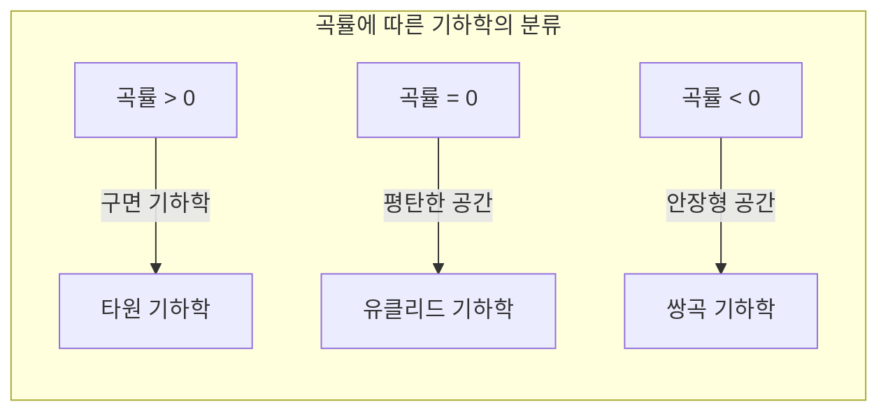

## 1. 서론: 유클리드의 주술

기원전 3세기, 고대 그리스의 수학자 유클리드는 자신의 저서 『원론』에서 당시의 기하학 지식을 공리적으로 체계화했습니다. 그는 5개의 공준(요청)을 제시했는데, 그 5번째 공준, 이른바 **평행선 공준** 은 다른 4개에 비해 복잡하여 많은 수학자들을 괴롭히게 됩니다.

$$
\text{제5공준: 1개의 직선이 2개의 직선과 만나고, 같은 쪽 내각의 합이 2직각보다 작을 경우, 그 2개의 직선을 무한히 연장하면, 내각의 합이 2직각보다 작은 쪽에서 만난다.}
$$

이 공준은 직관적으로는 명백해 보이지만, 수학자들은 "이것은 공준이 아니라, 다른 4개의 공준으로부터 증명할 수 있는 정리가 아닐까?" 하고 의심했습니다. 그리고 약 2000년 동안 수많은 천재들이 이 증명에 도전했고, 그리고 패배해 갔던 것입니다.

## 2. 평행선 공준에 대한 도전과 좌절

르네상스기 이후, 사케리나 람베르트와 같은 수학자들은 "귀류법"을 이용하여 제5공준을 증명하려고 시도했습니다. 즉, "제5공준이 성립하지 않는다"고 가정하고, 거기에서 모순을 이끌어내려고 한 것입니다. 하지만 그들이 이끌어낸 것은 모순이 아니라, 전혀 기묘하기는 하지만 논리적으로 파탄이 없는 "새로운 기하학의 정리"들이었습니다.

사케리는 "예각 가정"과 "둔각 가정"을 검토하고, 예각 가정에서는 모순을 이끌어낼 수 없다는 것을 깨달았으면서도, 최종적으로는 자신의 신념에 의해 그것을 부정하고 말았습니다.

## 3. "휘어진 공간"의 발견: 쌍곡 기하학의 탄생

19세기에 접어들어 마침내 혁명이 일어납니다. 독일의 카를 프리드리히 가우스, 헝가리의 야노시 볼리아이, 러시아의 니콜라이 로바쳅스키 3명이 독립적으로 "제5공준은 다른 공준들로부터 독립적이며, 이것이 성립하지 않는 전혀 새로운 기하학이 존재한다"는 결론에 도달한 것입니다.

그들이 발견한 기하학은 현재 **쌍곡 기하학** 이라고 불립니다. 이 공간에서는 직선 밖의 한 점을 지나는 평행선이 "무수히" 존재합니다. 또한 삼각형 내각의 합은 항상 180도보다 작아집니다.

$$
\text{쌍곡 기하학에서 삼각형 내각의 합} < 180^\circ
$$

가우스는 이 발견의 너무나도 혁신적인 점 때문에 세상의 몰이해를 두려워하여 생전에는 발표를 삼갔습니다. 볼리아이와 로바쳅스키가 논문을 발표함으로써 수학계는 근본적인 패러다임 전환을 맞이하게 됩니다.

## 4. 리만 기하학: 공간 개념의 일반화

비유클리드 기하학의 다음 도약은 가우스의 제자인 베른하르트 리만에 의해 이루어졌습니다. 리만은 1854년 취임 강연에서 기하학의 기초에 대한 획기적인 아이디어를 제시했습니다.

그는 공간의 휘어짐(곡률)을 국소적으로 정의하는 **계량 텐서** 를 도입하여, 공간의 차원이나 곡률이 장소에 따라 변화하는, 보다 일반적인 기하학( **리만 기하학** )을 구축한 것입니다.

리만의 틀 안에서는 유클리드 기하학(곡률 0), 쌍곡 기하학(음의 정곡률)에 더해, 구면 기하학(양의 정곡률, **타원 기하학** )도 통일적으로 다룰 수 있게 되었습니다. 타원 기하학에서는 평행선이 "존재하지 않으며", 삼각형 내각의 합은 180도보다 커집니다.

$$
\text{타원 기하학에서 삼각형 내각의 합} > 180^\circ
$$

## 5. 상대성이론으로의 길: 수학과 물리학의 융합

리만이 구축한 장대한 수학적 틀은 한동안 순수 수학의 영역에 머물러 있었습니다. 하지만 20세기 초, 알베르트 아인슈타인이 중력의 새로운 이론을 구축하려 할 때, 이 리만 기하학이 결정적인 역할을 하게 됩니다.

아인슈타인은 특수 상대성이론에서 시간과 공간을 통합한 "시공간" 개념을 제창했습니다. 그리고 **일반 상대성이론** 에서 그는 "중력이란 질량을 가진 물체에 의해 시공간이 왜곡(커브)되는 것이다"라는 획기적인 아이디어에 도달했습니다.

$$
R_{\mu\nu} - \frac{1}{2}Rg_{\mu\nu} + \Lambda g_{\mu\nu} = \frac{8\pi G}{c^4}T_{\mu\nu}
$$

위의 아인슈타인 방정식에서 좌변은 시공간의 기하학적 구조(곡률)를 나타내고, 우변은 물질·에너지의 분포를 나타냅니다. 즉, **물질이 시공간의 휘어지는 방식을 결정하고, 휘어진 시공간이 물질의 운동을 결정하는** 것입니다.

## 6. 결론

유클리드의 제5공준에 대한 작은 의문에서 시작된 비유클리드 기하학의 탐구는, 인간의 공간에 대한 직관적인 고정관념을 깨뜨리고 수학의 자유로움을 증명했습니다. 그리고 그것은 최종적으로 우주의 근원적인 구조를 해명하는 일반 상대성이론으로 결실을 맺은 것입니다.

수학에서의 순수한 논리 탐구가 훗날 물리 세계의 가장 깊은 진리를 기술하기 위한 필수불가결한 언어가 된다. 비유클리드 기하학의 역사는 인간 지성의 위대함과 자연계의 놀라운 신비를 우리에게 가르쳐 줍니다.
