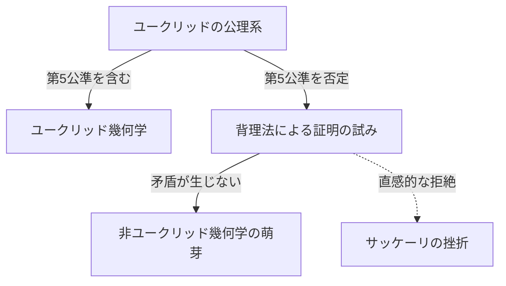
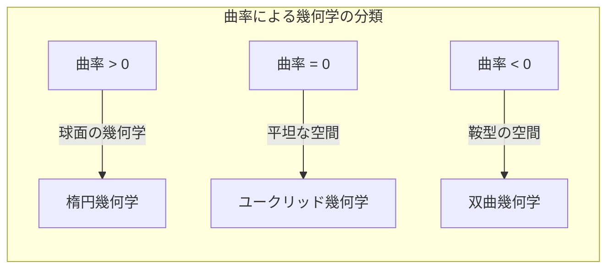

## 1. はじめに：[ユークリッド](https://kenji.blog/p/euclid/)の呪縛

紀元前3世紀、古代ギリシャの数学者[ユークリッド](https://kenji.blog/p/euclid/)は、その著書『原論』において、当時の幾何学の知識を公理的に体系化しました。彼は5つの公準（要請）を提示しましたが、その5番目の公準、いわゆる **平行線公準** は、他の4つに比べて複雑であり、多くの数学者たちを悩ませることになります。

$$
\text{第5公準：1本の直線が2本の直線に交わり、同じ側の内角の和が2直角より小さい場合、その2本の直線を限りなく延長すると、内角の和が2直角より小さい側で交わる。}
$$

この公準は直感的には明らかに見えますが、数学者たちは「これは公準ではなく、他の4つの公準から証明できる定理なのではないか？」と疑いました。そして約2000年もの間、無数の天才たちがこの証明に挑み、そして敗れ去っていったのです。

## 2. 平行線公準への挑戦と挫折

ルネサンス期以降、サッケーリやランベルトといった数学者たちは「背理法」を用いて第5公準を証明しようと試みました。すなわち、「第5公準が成り立たない」と仮定し、そこから矛盾を導き出そうとしたのです。しかし、彼らが導き出したのは矛盾ではなく、全く奇妙ではあるものの論理的に破綻のない「新しい幾何学の定理」の数々でした。

サッケーリは「鋭角仮定」と「鈍角仮定」を検討し、鋭角仮定からは矛盾が導き出せないことに気付きながらも、最終的には自らの信念によりそれを否定してしまいました。

## 3. 「曲がった空間」の発見：双曲幾何学の誕生

19世紀に入り、ついに革命が起きます。ドイツのカール・フリードリヒ・[ガウス](https://kenji.blog/p/gauss/)、ハンガリーのボヤイ・ヤーノシュ、ロシアのニコライ・ロバチェフスキーの3人が、独立して「第5公準は他の公準から独立しており、これが成り立たない全く新しい幾何学が存在する」という結論に達したのです。

彼らが発見した幾何学は、現在 **双曲幾何学** と呼ばれています。この空間では、直線の外にある1点を通る平行線は「無数に」存在します。また、三角形の内角の和は常に180度より小さくなります。

$$
\text{双曲幾何学における三角形の内角の和} < 180^\circ
$$

[ガウス](https://kenji.blog/p/gauss/)はこの発見のあまりの革新性に、世間の無理解を恐れて生前は発表を控えていました。ボヤイとロバチェフスキーが論文を発表したことで、数学の世界は根本的なパラダイムシフトを迎えることになります。

## 4. [リーマン](https://kenji.blog/p/riemann/)幾何学：空間の概念の一般化

非[ユークリッド](https://kenji.blog/p/euclid/)幾何学の次なる飛躍は、[ガウス](https://kenji.blog/p/gauss/)の弟子である[ベルンハルト・リーマン](https://kenji.blog/p/riemann/)によってもたらされました。[リーマン](https://kenji.blog/p/riemann/)は1854年の就任講演において、幾何学の基礎についての画期的なアイデアを提示しました。

彼は、空間の曲がり具合（曲率）を局所的に定義する **計量テンソル** を導入し、空間の次元や曲率が場所によって変化するような、より一般的な幾何学（**[リーマン](https://kenji.blog/p/riemann/)幾何学**）を構築したのです。

[リーマン](https://kenji.blog/p/riemann/)の枠組みの中では、[ユークリッド](https://kenji.blog/p/euclid/)幾何学（曲率0）、双曲幾何学（負の定曲率）に加えて、球面の幾何学（正の定曲率、**楕円幾何学**）も統一的に扱えるようになりました。楕円幾何学では、平行線は「存在せず」、三角形の内角の和は180度よりも大きくなります。

$$
\text{楕円幾何学における三角形の内角の和} > 180^\circ
$$

## 5. 相対性理論への道：数学と物理学の融合

[リーマン](https://kenji.blog/p/riemann/)が構築した壮大な数学的枠組みは、しばらくの間は純粋数学の領域にとどまっていました。しかし20世紀初頭、アルベルト・アインシュタインが重力の新しい理論を構築しようとしたとき、この[リーマン](https://kenji.blog/p/riemann/)幾何学が決定的な役割を果たすことになります。

アインシュタインは、特殊相対性理論において時間と空間を統合した「時空」の概念を提唱しました。そして **一般相対性理論** において、彼は「重力とは、質量を持つ物体によって時空が歪曲（カーブ）することである」という画期的なアイデアに到達しました。

$$
R_{\mu\nu} - \frac{1}{2}Rg_{\mu\nu} + \Lambda g_{\mu\nu} = \frac{8\pi G}{c^4}T_{\mu\nu}
$$

上記のアインシュタイン方程式において、左辺は時空の幾何学的構造（曲率）を表し、右辺は物質・エネルギーの分布を表しています。つまり、**物質が時空の曲がり方を決定し、曲がった時空が物質の運動を決定する** のです。

## 6. おわりに

[ユークリッド](https://kenji.blog/p/euclid/)の第5公準へのささやかな疑問から始まった非[ユークリッド](https://kenji.blog/p/euclid/)幾何学の探求は、人間の空間に対する直感的な思い込みを打ち破り、数学の自由さを証明しました。そしてそれは最終的に、宇宙の根源的な構造を解き明かす一般相対性理論へと結実したのです。

数学における純粋な論理の探求が、後に物理世界の最も深い真理を記述するための不可欠な言語となる。非[ユークリッド](https://kenji.blog/p/euclid/)幾何学の歴史は、人間の知性の偉大さと、自然界の驚くべき神秘を私たちに教えてくれます。
