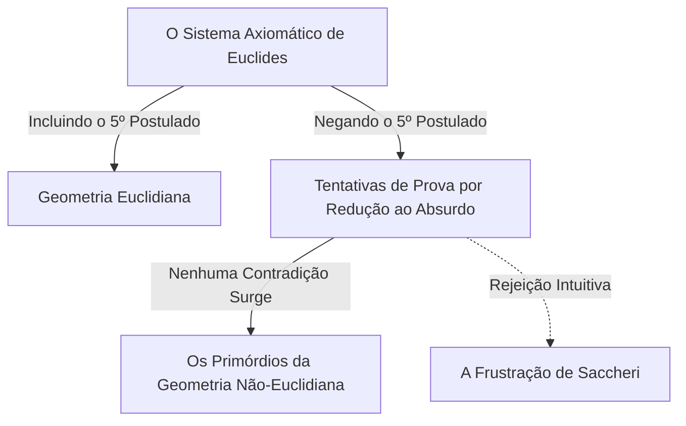
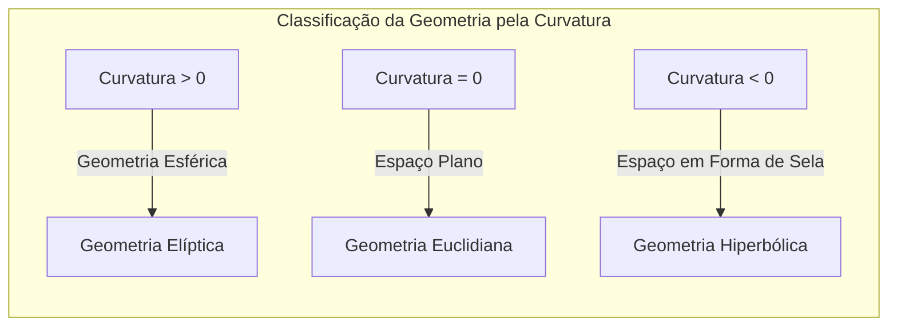

## 1. Introdução: O Feitiço de [[[Euclid](https://kenji.blog/p/euclid/)e](https://kenji.blog/p/euclid/)s](https://kenji.blog/p/euclid/)

No século III a.C., o matemático grego antigo [[[Euclid](https://kenji.blog/p/euclid/)e](https://kenji.blog/p/euclid/)s](https://kenji.blog/p/euclid/) sistematizou axiomaticamente o conhecimento da geometria de seu tempo em seu livro "Os Elementos". Ele apresentou 5 postulados (demandas), mas o 5º postulado, o chamado **postulado das paralelas**, era mais complexo em comparação com os outros 4 e incomodaria muitos matemáticos.

$$
\text{5º Postulado: Se uma linha reta intersecta duas linhas retas e a soma dos ângulos internos do mesmo lado for menor que dois ângulos retos, as duas linhas retas, se estendidas indefinidamente, se encontrarão no lado onde a soma dos ângulos é menor que dois ângulos retos.}
$$

Embora esse postulado pareça intuitivamente óbvio, os matemáticos duvidavam: "Isso não é um postulado, mas talvez um teorema que possa ser provado a partir dos outros 4 postulados?" Por quase 2000 anos, inúmeros gênios tentaram provar isso e falharam.

## 2. O Desafio do Postulado das Paralelas e a Frustração

Desde o período do Renascimento, matemáticos como Saccheri e Lambert tentaram provar o 5º postulado usando a "prova por contradição" (redução ao absurdo). Em outras palavras, eles assumiram que "o 5º postulado não se sustenta" e tentaram derivar uma contradição a partir disso. No entanto, o que eles derivaram não foi uma contradição, mas uma série de "novos teoremas geométricos" que, embora completamente estranhos, eram logicamente impecáveis.

Saccheri considerou a "hipótese do ângulo agudo" e a "hipótese do ângulo obtuso". Apesar de perceber que nenhuma contradição poderia ser derivada da hipótese do ângulo agudo, ele a negou no final com base em suas próprias crenças.

## 3. A Descoberta do "Espaço Curvo": O Nascimento da Geometria Hiperbólica

No século XIX, finalmente ocorreu uma revolução. Três homens, o alemão [Carl Friedrich Gauss](https://kenji.blog/p/gauss/), o húngaro János Bolyai e o russo Nikolai Lobachevsky, chegaram independentemente à conclusão de que "o 5º postulado é independente dos outros postulados, e existe uma geometria completamente nova em que ele não se sustenta".

A geometria que eles descobriram é agora chamada de **geometria hiperbólica**. Neste espaço, existem "infinitas" linhas paralelas que passam por um ponto fora de uma reta. Além disso, a soma dos ângulos internos de um triângulo é sempre menor que 180 graus.

$$
\text{Soma dos ângulos internos de um triângulo na geometria hiperbólica} < 180^\circ
$$

Devido à incrível inovação dessa descoberta e temendo a falta de compreensão do público, Gauss absteve-se de publicá-la em vida. Com a publicação dos trabalhos de Bolyai e Lobachevsky, o mundo da matemática experimentou uma mudança de paradigma fundamental.

## 4. Geometria Riemanniana: A Generalização do Conceito de Espaço

O próximo salto na geometria não-euclidiana foi dado pelo aluno de Gauss, [Bernhard Riemann](https://kenji.blog/p/riemann/). Em sua palestra inaugural de 1854, Riemann apresentou uma ideia inovadora sobre os fundamentos da geometria.

Ele introduziu o **tensor métrico** para definir localmente a curvatura do espaço e construiu uma geometria mais geral (**geometria riemanniana**) onde as dimensões e a curvatura do espaço podem variar de um lugar para outro.

Dentro da estrutura de Riemann, além da geometria euclidiana (curvatura 0) e da geometria hiperbólica (curvatura constante negativa), a geometria de uma esfera (curvatura constante positiva, **geometria elíptica**) poderia ser tratada de forma unificada. Na geometria elíptica, as linhas paralelas "não existem" e a soma dos ângulos internos de um triângulo é maior que 180 graus.

$$
\text{Soma dos ângulos internos de um triângulo na geometria elíptica} > 180^\circ
$$

## 5. O Caminho para a Teoria da Relatividade: A Fusão da Matemática e da Física

A grandiosa estrutura matemática construída por Riemann permaneceu puramente no domínio da matemática por algum tempo. No entanto, no início do século XX, quando Albert Einstein tentou construir uma nova teoria da gravidade, essa geometria riemanniana desempenharia um papel decisivo.

Einstein propôs o conceito de "espaço-tempo", que integra tempo e espaço em sua teoria da relatividade especial. E na **teoria da relatividade geral**, ele chegou à ideia revolucionária de que "a gravidade é a distorção (curvatura) do espaço-tempo por objetos massivos".

$$
R_{\mu\nu} - \frac{1}{2}Rg_{\mu\nu} + \Lambda g_{\mu\nu} = \frac{8\pi G}{c^4}T_{\mu\nu}
$$

Na equação de Einstein acima, o lado esquerdo representa a estrutura geométrica (curvatura) do espaço-tempo e o lado direito representa a distribuição de matéria e energia. Em outras palavras, **a matéria determina como o espaço-tempo se curva, e o espaço-tempo curvo determina como a matéria se move**.

## 6. Conclusão

A busca da geometria não-euclidiana, que começou com uma modesta dúvida sobre o 5º postulado de [[[Euclid](https://kenji.blog/p/euclid/)e](https://kenji.blog/p/euclid/)s](https://kenji.blog/p/euclid/), quebrou a crença intuitiva humana sobre o espaço e provou a liberdade da matemática. E, por fim, culminou na teoria da relatividade geral, que revela a estrutura fundamental do universo.

A busca da lógica pura na matemática tornou-se mais tarde a linguagem indispensável para descrever a verdade mais profunda do mundo físico. A história da geometria não-euclidiana nos ensina a grandeza do intelecto humano e o incrível mistério do mundo natural.
