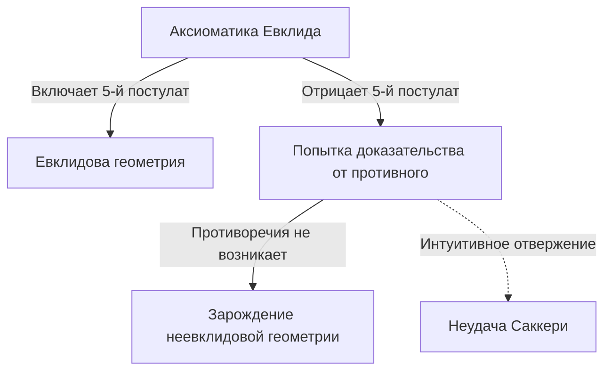
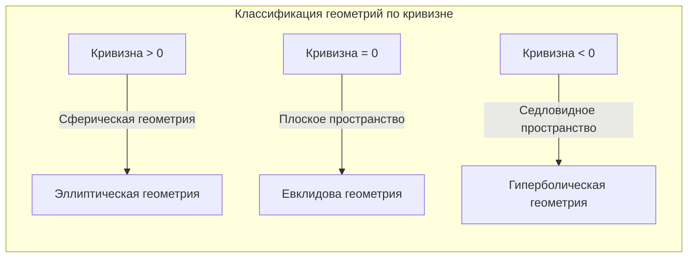

## 1. Введение: проклятие Евклида

В 3 веке до нашей эры древнегреческий математик Евклид в своей книге «Начала» аксиоматически систематизировал знания о геометрии того времени. Он предложил пять постулатов (требований), но пятый из них, так называемый **постулат о параллельных прямых**, был сложнее остальных четырех и стал причиной головной боли для многих математиков.

$$
\text{5-й постулат: если прямая, падающая на две прямые, образует внутренние и по одну сторону углы, меньшие двух прямых, то эти две прямые, продолженные неограниченно, встретятся с той стороны, где углы меньше двух прямых.}
$$

Хотя этот постулат кажется интуитивно очевидным, математики задались вопросом: «А не является ли это теоремой, которую можно доказать из остальных четырех постулатов, а не постулатом?». Около 2000 лет бесчисленные гении пытались это доказать, но терпели неудачу.

## 2. Вызов постулату о параллельных прямых и неудачи

Начиная с эпохи Возрождения, такие математики, как Саккери и Ламберт, пытались доказать 5-й постулат методом «от противного». То есть они предполагали, что «5-й постулат не выполняется», и пытались вывести из этого противоречие. Однако они вывели не противоречия, а множество совершенно странных, но логически безупречных «новых геометрических теорем».

Саккери рассмотрел «гипотезу острого угла» и «гипотезу тупого угла» и, хотя он понял, что из гипотезы острого угла нельзя вывести противоречие, в конечном итоге он отверг ее из-за собственных убеждений.

## 3. Открытие «искривленного пространства»: рождение гиперболической геометрии

В 19 веке наконец произошла революция. Немец Карл Фридрих Гаусс, венгр Янош Бойяи и русский Николай Лобачевский, трое ученых, независимо друг от друга пришли к выводу, что «5-й постулат не зависит от других постулатов, и существует совершенно новая геометрия, в которой он не выполняется».

Открытая ими геометрия сегодня называется **гиперболическая геометрия**. В этом пространстве существует «бесконечное множество» параллельных прямых, проходящих через одну точку вне прямой. Кроме того, сумма внутренних углов треугольника всегда меньше 180 градусов.

$$
\text{Сумма внутренних углов треугольника в гиперболической геометрии} < 180^\circ
$$

Из-за слишком новаторского характера этого открытия Гаусс воздерживался от его публикации при жизни, опасаясь непонимания со стороны общественности. Публикация работ Бойяи и Лобачевского привела к фундаментальной смене парадигмы в математическом мире.

## 4. Риманова геометрия: обобщение концепции пространства

Следующий скачок в неевклидовой геометрии совершил ученик Гаусса Бернхард Риман. В своей инаугурационной лекции 1854 года Риман представил революционную идею об основаниях геометрии.

Он ввел **метрический тензор**, который локально определяет искривленность (кривизну) пространства, и построил более общую геометрию (**риманова геометрия**), в которой размерность и кривизна пространства могут меняться в зависимости от местоположения.

В рамках Римана наряду с евклидовой геометрией (кривизна 0) и гиперболической геометрией (отрицательная постоянная кривизна) стало возможным единым образом рассматривать геометрию сферы (положительная постоянная кривизна, **эллиптическая геометрия**). В эллиптической геометрии параллельные прямые «не существуют», а сумма внутренних углов треугольника больше 180 градусов.

$$
\text{Сумма внутренних углов треугольника в эллиптической геометрии} > 180^\circ
$$

## 5. Путь к теории относительности: слияние математики и физики

Грандиозная математическая структура, созданная Риманом, некоторое время оставалась в сфере чистой математики. Однако в начале 20 века, когда Альберт Эйнштейн попытался создать новую теорию гравитации, эта риманова геометрия сыграла решающую роль.

В своей специальной теории относительности Эйнштейн предложил концепцию «пространства-времени», объединяющую пространство и время. Затем, в **общей теории относительности**, он пришел к революционной идее о том, что «гравитация — это искривление пространства-времени массами объектов».

$$
R_{\mu\nu} - \frac{1}{2}Rg_{\mu\nu} + \Lambda g_{\mu\nu} = \frac{8\pi G}{c^4}T_{\mu\nu}
$$

В вышеприведенном уравнении Эйнштейна левая часть представляет геометрическую структуру (кривизну) пространства-времени, а правая часть — распределение материи и энергии. Иными словами, **материя определяет, как искривляется пространство-время, а искривленное пространство-время определяет, как движется материя**.

## 6. Заключение

Исследование неевклидовой геометрии, начавшееся со скромного сомнения в 5-м постулате Евклида, разрушило интуитивные предубеждения человека о пространстве и доказало свободу математики. И, в конечном итоге, оно вылилось в общую теорию относительности, раскрывающую фундаментальную структуру Вселенной.

Поиск чистой логики в математике позже стал незаменимым языком для описания самых глубоких истин физического мира. История неевклидовой геометрии учит нас величию человеческого интеллекта и удивительным тайнам мира природы.
