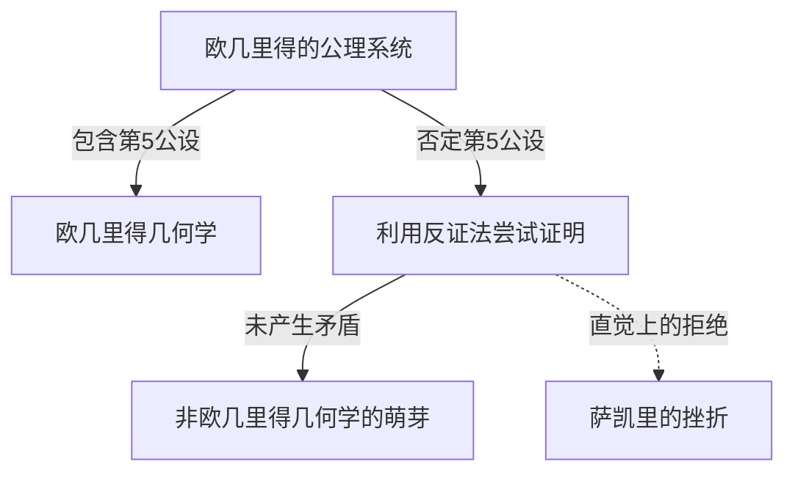
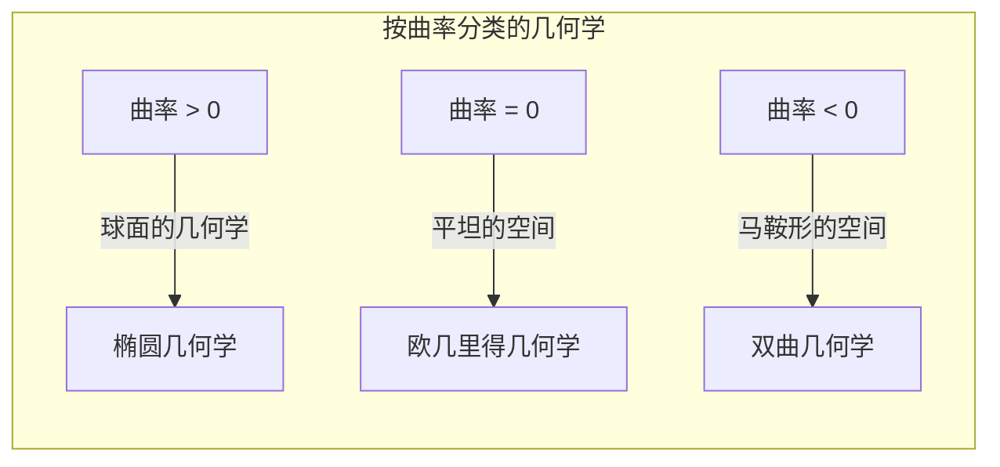

## 1. 引言：[欧几里得](https://kenji.blog/zh-cn/p/euclid/)的束缚

公元前3世纪，古希腊数学家[欧几里得](https://kenji.blog/zh-cn/p/euclid/)在其著作《几何原本》中，将当时的几何学知识公理化地系统化了。他提出了5条公设（要求），但其中的第5条公设，即所谓的 **平行公设** ，相比其他4条更为复杂，让许多数学家感到困扰。

$$
\text{第5公设：若一条直线与两条直线相交，且在同一侧的内角和小于两个直角，则这两条直线无限延长后，必在内角和小于两直角的一侧相交。}
$$

这条公设在直觉上看起来是显然的，但数学家们怀疑：“这也许不是公设，而是可以从其他4条公设推导出来的定理？” 在大约2000年的时间里，无数天才挑战了这个证明，却都以失败告终。

## 2. 对平行公设的挑战与挫折

文艺复兴时期之后，萨凯里和兰伯特等数学家试图利用“反证法”来证明第5公设。也就是说，他们假设“第5公设不成立”，并试图由此推导出矛盾。然而，他们导出的不是矛盾，而是一系列极其奇妙但在逻辑上毫无破绽的“新几何学定理”。

萨凯里探讨了“锐角假设”和“钝角假设”，尽管他意识到从锐角假设无法推导出矛盾，但最终还是凭借自己的信念将其否定了。

## 3. “弯曲空间”的发现：双曲几何学的诞生

进入19世纪，革命终于发生了。德国的[卡尔·弗里德里希·高斯](https://kenji.blog/zh-cn/p/gauss/)、匈牙利的鲍耶·亚诺什、俄罗斯的[尼古拉·罗巴切夫斯基](/zh-cn/p/biography-nikolai-lobachevsky/)三人独立得出了结论：“第5公设与其他公设是独立的，存在一种它不成立的全新几何学”。

他们发现的几何学现在被称为 **双曲几何学** 。在这个空间中，通过直线外一点的平行线有“无数条”。此外，三角形的内角和总是小于180度。

$$
\text{双曲几何学中三角形的内角和} < 180^\circ
$$

高斯由于这一发现太过具有革命性，担心世人不理解，生前并未发表。随着鲍耶和罗巴切夫斯基发表论文，数学世界迎来了根本性的范式转变。

## 4. 黎曼几何学：空间概念的泛化

非[欧几里得](https://kenji.blog/zh-cn/p/euclid/)几何学的下一次飞跃是由高斯的学生[波恩哈德·黎曼](https://kenji.blog/zh-cn/p/riemann/)带来的。黎曼在1854年的就职演讲中，提出了关于几何学基础的划时代思想。

他引入了局部定义空间弯曲程度（曲率）的 **度量张量** ，构建了一种空间的维度和曲率会随位置变化的、更为一般的几何学（ **黎曼几何学** ）。

在黎曼的框架中，除了[欧几里得](https://kenji.blog/zh-cn/p/euclid/)几何学（曲率为0）、双曲几何学（负常曲率）之外，球面的几何学（正常曲率、 **椭圆几何学** ）也得到了统一处理。在椭圆几何学中，平行线“不存在”，三角形的内角和大于180度。

$$
\text{椭圆几何学中三角形的内角和} > 180^\circ
$$

## 5. 通往相对论之路：数学与物理学的融合

黎曼构建的宏大数学框架，在一段时间内仅停留在纯数学领域。然而在20世纪初，当阿尔伯特·爱因斯坦试图构建新的引力理论时，这种黎曼几何学发挥了决定性的作用。

爱因斯坦在狭义相对论中提出了将时间与空间统一的“时空”概念。随后在 **广义相对论** 中，他得出了“引力是由于具有质量的物体导致时空发生扭曲（弯曲）”的划时代思想。

$$
R_{\mu\nu} - \frac{1}{2}Rg_{\mu\nu} + \[Lambda](https://kenji.blog/zh-cn/p/serverless-architecture-aws-lambda-cold-start/) g_{\mu\nu} = \frac{8\pi G}{c^4}T_{\mu\nu}
$$

在上述爱因斯坦场方程中，左边表示时空的几何结构（曲率），右边表示物质与能量的分布。也就是说， **物质决定了时空的弯曲方式，而弯曲的时空决定了物质的运动** 。

## 6. 结语

从对[欧几里得](https://kenji.blog/zh-cn/p/euclid/)第5公设的微小疑问开始，对非[欧几里得](https://kenji.blog/zh-cn/p/euclid/)几何学的探索打破了人类对空间的直觉偏见，证明了数学的自由性。而这最终结出了揭示宇宙根本结构的广义相对论的硕果。

在数学中对纯粹逻辑的探索，日后成为了描述物理世界最深层真理不可或缺的语言。非[欧几里得](https://kenji.blog/zh-cn/p/euclid/)几何学的历史向我们展示了人类智慧的伟大与自然界令人惊叹的奥秘。
