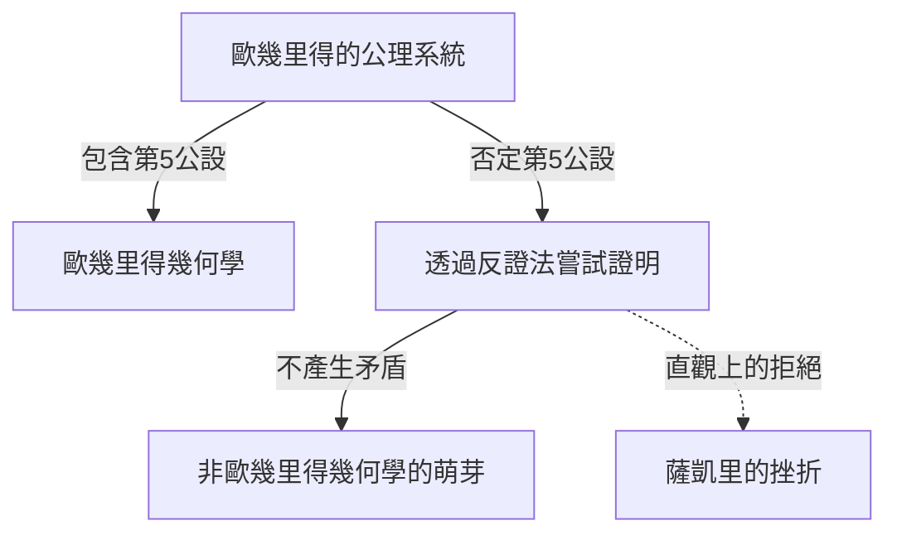
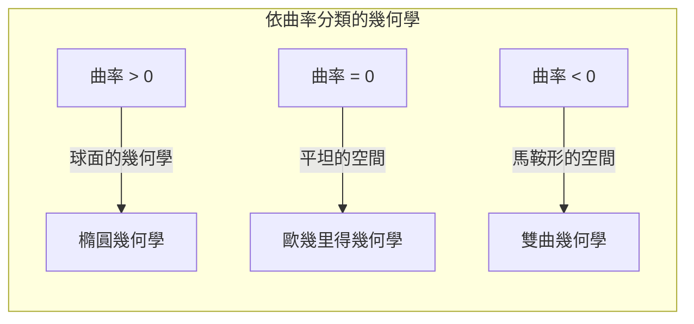

## 1. 前言：[歐幾里得](https://kenji.blog/zh-tw/p/euclid/)的束縛

西元前3世紀，古希臘數學家[歐幾里得](https://kenji.blog/zh-tw/p/euclid/)在其著作《幾何原本》中，將當時的幾何學知識進行了公理化系統的整理。他提出了5個公設（要求），但其中的第5個公設，也就是所謂的 **平行公設** ，相較於其他4個更為複雜，從而困擾了許多數學家。

$$
\text{第5公設：一條直線與兩條直線相交，若同側內角和皆小於兩直角，則將這兩條直線無限延長後，必會於內角和小於兩直角的一側相交。}
$$

這個公設在直觀上看似顯而易見，但數學家們卻懷疑：「這該不會不是公設，而是能由其他4個公設證明出的定理吧？」。在將近2000年的時間裡，無數的天才們挑戰了這個證明，卻都以失敗告終。

## 2. 對平行公設的挑戰與挫折

文藝復興時期之後，薩凱里（Saccheri）和蘭伯特（Lambert）等數學家試圖使用「反證法」來證明第5公設。也就是說，他們假設「第5公設不成立」，並試圖從中推導出矛盾。然而，他們所推導出的並不是矛盾，而是一系列極其奇妙但邏輯上無懈可擊的「新幾何學定理」。

薩凱里探討了「銳角假設」與「鈍角假設」，雖然他察覺到無法從銳角假設中推導出矛盾，但最終卻因自身的信念而將其否定了。

## 3. 「彎曲空間」的發現：雙曲幾何學的誕生

進入19世紀後，革命終於發生了。德國的[卡爾·弗里德里希·高斯](https://kenji.blog/zh-tw/p/gauss/)、匈牙利的鮑耶·亞諾什、俄羅斯的尼古拉·羅巴切夫斯基三人，各自獨立地得出了「第5公設與其他公設相互獨立，且存在一種完全不成立此公設的全新幾何學」這個結論。

他們所發現的幾何學，現在被稱為 **雙曲幾何學** 。在這個空間中，通過直線外一點的平行線有「無數條」。此外，三角形的內角和永遠小於180度。

$$
\text{雙曲幾何學中三角形的內角和} < 180^\circ
$$

由於這項發現過於創新，高斯害怕世人無法理解，因此在生前並未發表。隨著鮑耶和羅巴切夫斯基發表了論文，數學界迎來了根本性的典範轉移。

## 4. 黎曼幾何學：空間概念的一般化

非[歐幾里得](https://kenji.blog/zh-tw/p/euclid/)幾何學的下一次飛躍，是由高斯的學生伯恩哈德·黎曼帶來的。黎曼在1854年的就職演說中，提出了關於幾何學基礎的劃時代想法。

他引入了能局部定義空間彎曲程度（曲率）的 **度規張量** ，建構出了空間維度與曲率會隨位置而改變的更一般的幾何學（ **黎曼幾何學** ）。

在黎曼的框架中，除了[歐幾里得](https://kenji.blog/zh-tw/p/euclid/)幾何學（曲率為0）、雙曲幾何學（負常數曲率）之外，連球面幾何學（正常數曲率，即 **橢圓幾何學** ）也能夠被統一處理。在橢圓幾何學中，平行線「不存在」，且三角形的內角和大於180度。

$$
\text{橢圓幾何學中三角形的內角和} > 180^\circ
$$

## 5. 邁向相對論之路：數學與物理學的融合

黎曼建構出的壯麗數學框架，在一段時間內僅停留在純數學領域。然而到了20世紀初，當阿爾伯特·愛因斯坦試圖建立新的重力理論時，這門黎曼幾何學發揮了決定性的作用。

愛因斯坦在狹義相對論中，提出了統合時間與空間的「時空」概念。接著在 **廣義相對論** 中，他得出了一個劃時代的想法：「重力，就是由具有質量的物體所造成的時空扭曲（彎曲）」。

$$
R_{\mu\nu} - \frac{1}{2}Rg_{\mu\nu} + \Lambda g_{\mu\nu} = \frac{8\pi G}{c^4}T_{\mu\nu}
$$

在上述的愛因斯坦方程式中，左邊代表時空的幾何結構（曲率），右邊代表物質與能量的分布。也就是說， **物質決定了時空如何彎曲，而彎曲的時空決定了物質如何運動** 。

## 6. 結語

從對[歐幾里得](https://kenji.blog/zh-tw/p/euclid/)第5公設的一絲疑問開始的非[歐幾里得](https://kenji.blog/zh-tw/p/euclid/)幾何學探索，打破了人類對空間直觀的成見，證明了數學的自由性。而這最終也結出了能夠解開宇宙根本結構的廣義相對論之果。

數學中對純粹邏輯的探索，後來成為了描述物理世界最深層真理不可或缺的語言。非[歐幾里得](https://kenji.blog/zh-tw/p/euclid/)幾何學的歷史，向我們展現了人類智慧的偉大，以及自然界令人驚嘆的奧秘。
