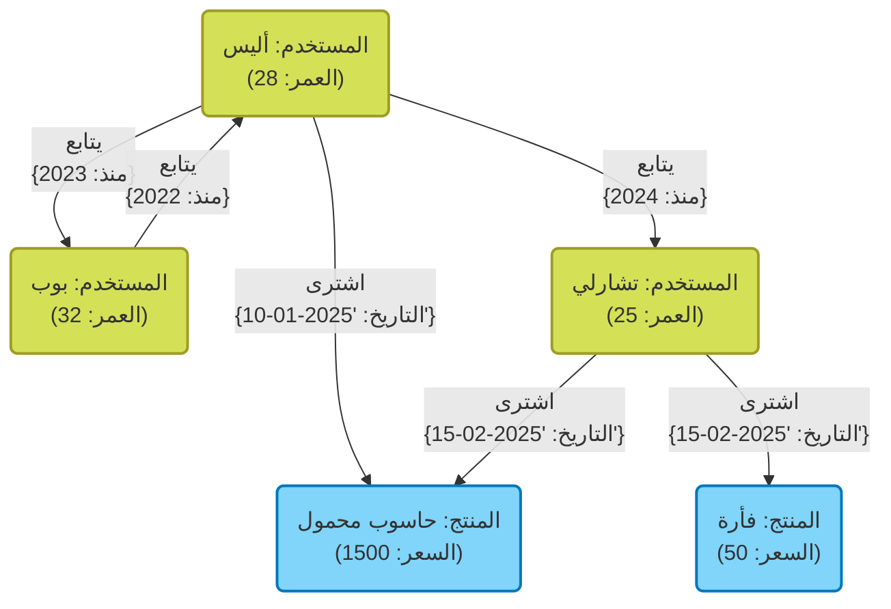

في تطوير الأنظمة الحديثة، يحمل اختيار قاعدة البيانات كوسيلة لتخزين البيانات وإدارتها أهمية بالغة. في الماضي، كانت قواعد البيانات العلائقية ([RDBMS](https://kenji.blog/ar/p/rdbms-transaction-acid-isolation-level-lock/)) هي المهيمنة، ولكن اليوم، مع تنوع البيانات والزيادة الهائلة في حجمها، أصبحت قواعد بيانات **NoSQL** (Not Only SQL) تلعب دوراً مهماً.

قواعد بيانات NoSQL ليست تقنية واحدة، بل هي مصطلح عام يطلق على نماذج بيانات متنوعة تم تحسينها لحالات استخدام محددة. في هذه المقالة، بعد توضيح الاختلافات الحاسمة بين RDBMS وNoSQL، سنقوم بشرح مفصل وشامل لخصائص ومزايا وعيوب وحالات الاستخدام المناسبة لأربعة نماذج رئيسية من NoSQL: **مخزن القيمة والمفتاح (KVS)** ، و **الموجهة للمستندات** ، و **الرسم البياني** ، و **الأعمدة العريضة**.

---

## 1. ما هي NoSQL؟ فهم الاختلافات مع RDBMS بعمق

لاختيار NoSQL بشكل مناسب، يجب أولاً فهم الاختلافات الواضحة بينها وبين قواعد البيانات العلائقية (RDBMS) التقليدية. لسنوات عديدة، شكلت قواعد البيانات العلائقية (مثل MySQL و PostgreSQL و Oracle) جوهر أنظمة الشركات. فهي تتفوق في ضمان اتساق البيانات بدقة (خصائص [ACID](https://kenji.blog/ar/p/rdbms-transaction-acid-isolation-level-lock/)) وتدعم عمليات الربط المعقدة (JOIN) والاستعلامات المرنة عبر SQL.

ومع ذلك، مع التوسع الهائل في خدمات الويب والزيادة السريعة في البيانات غير المهيكلة، ظهرت تحديات يصعب على بنية RDBMS التعامل معها. وهنا جاء دور NoSQL. الاختلافات الرئيسية بين NoSQL و RDBMS هي كما يلي:

### بدون مخطط (Schemaless) ومرونة هيكل البيانات

تتطلب RDBMS تعريف مخطط صارم مسبقاً (أسماء الأعمدة وأنواع البيانات في الجداول). يعد تعديل المخطط بعد تعريفه مكلفاً وقد يضعف مرونة التطوير.
في المقابل، تتبنى العديد من قواعد بيانات NoSQL نهجاً **بدون مخطط** أو بمخطط مرن. لا يلزم التحديد المسبق والكامل لهيكل البيانات، مما يتيح تغيير شكل البيانات ديناميكياً لتلائم التغييرات في متطلبات التطبيق. تتوافق هذه الخاصية بشكل جيد جداً مع التطوير الرشيق (Agile) وبنية الخدمات المصغرة ([[Microservice](https://kenji.blog/ar/p/microservices-architecture-bff-api-gateway/)s](https://kenji.blog/ar/p/microservices-architecture-bff-api-gateway/)).

### قابلية التوسع الأفقي (Scale-out)

النهج الأساسي لتحسين أداء RDBMS هو **التوسع الرأسي (Scale-up)** من خلال تعزيز وحدة المعالجة المركزية أو الذاكرة في الخادم. ومع ذلك، هناك حدود مادية لأداء الخادم الواحد، ويصبح مكلفاً للغاية. على الرغم من توفر ميزات التجميع (Clustering) في بعض RDBMS، إلا أن هناك عقبات تقنية أمام الحفاظ على اتساق البيانات عبر العقد (Nodes) والمعالجة الموزعة.

تم تصميم NoSQL من البداية على افتراض **التوسع الأفقي (Scale-out)** ، والذي يعمل على تحسين قدرة المعالجة وسعة التخزين من خلال وضع خوادم (عقد) متعددة ومنخفضة التكلفة جنباً إلى جنب. يتم توزيع البيانات تلقائياً عبر عقد متعددة (Sharding)، وعندما يزداد حجم البيانات أو حركة المرور، يمكنك ببساطة إضافة المزيد من العقد لتحسين الإنتاجية الإجمالية للنظام.

### نظرية CAP ونموذج الاتساق

في الأنظمة الموزعة، تعد **نظرية CAP** ، التي تنص على أنه من المستحيل تلبية الاتساق ( **C**onsistency ) والتوافر ( **A**vailability ) وتحمل التقسيم ( **P**artition Tolerance ) بشكل كامل في وقت واحد، مفهوماً مهماً في تصميم NoSQL.

تُعطي RDBMS الأولوية عادةً لـ " **CA** (الاتساق والتوافر)" (على افتراض عدم وجود تقسيم للشبكة)، بينما تختار العديد من قواعد بيانات NoSQL المقايضة إما بـ " **CP** (الاتساق وتحمل التقسيم)" أو " **AP** (التوافر وتحمل التقسيم)". خاصة في البيئات الموزعة الكبيرة، لا يندر أن يتم التضحية بالقليل من الاتساق الصارم لصالح بقاء النظام مستجيباً (التوافر)، مع تبني نهج **الاتساق النهائي (Eventual [Consistency](https://kenji.blog/ar/p/cap-theorem-distributed-systems-tradeoff/))** ، والذي يعني أن البيانات ستتطابق في النهاية.

---

## 2. مخزن القيمة والمفتاح (Key-Value Store: KVS)

يعد مخزن القيمة والمفتاح (KVS) نموذج البيانات الأبسط والأسرع بين قواعد بيانات NoSQL. وكما يوحي الاسم، فإنه يدير البيانات فقط كأزواج من "مفتاح (Key)" فريد و"قيمة (Value)" مقابلة له.

### نموذج البيانات والميزات

يمتلك KVS هيكلاً مشابهاً للمصفوفات المترابطة أو القواميس (Dictionaries). غالباً ما يتم التعامل مع محتوى القيمة من جانب قاعدة البيانات كمجرد سلسلة بايتات أو سلسلة نصية (مع بعض الاستثناءات)، ولا يمكن بشكل أساسي تحليل الهيكل الداخلي لإرسال استعلامات. يقتصر الوصول إلى البيانات على عمليات بسيطة تتمثل في "الحصول على القيمة، أو تحديثها، أو حذفها بتحديد المفتاح".

تولد هذه البساطة المفرطة **الأداء الساحق** الذي يعد أقوى سلاح في KVS. نظراً لعدم الحاجة إلى تحليل الاستعلامات المعقدة أو عمليات JOIN، يمكن قراءة البيانات وكتابتها بوقت انتقال منخفض جداً يقاس بالميلي ثانية إلى الميكرو ثانية. بالإضافة إلى ذلك، نظراً لأن البيانات مستقلة، فإن توزيعها عبر عقد متعددة (Sharding) سهل للغاية.

### قواعد بيانات KVS التمثيلية

- **Redis** : الممثل الرئيسي لـ KVS داخل الذاكرة (In-memory). KVS عالي الأداء يدعم ليس فقط السلاسل النصية البسيطة ولكن أيضاً هياكل البيانات المتنوعة مثل القوائم، والمجموعات، والتجزئات، كما يوفر ميزات النشر والاشتراك ([Pub/Sub](https://kenji.blog/ar/p/event-driven-architecture-message-queue-kafka-rabbitmq/)).
- **Memcached** : نظام تخزين مؤقت موزع للذاكرة، بسيط للغاية وسريع.
- **Amazon DynamoDB** : خدمة مدارة بالكامل من KVS تتميز بقابلية توسع عالية (لها أيضاً جوانب من الأعمدة العريضة والمستندات).

### المزايا والعيوب

**المزايا:**
- **سرعة معالجة فائقة** : نظراً لبساطة الهيكل، يكون العبء الزائد لعمليات الإدخال والإخراج للقرص وعمليات الذاكرة في حده الأدنى.
- **قابلية توسع عالية** : من السهل توزيع البيانات بناءً على المفاتيح، مما يتيح توسعاً أفقياً غير محدود تقريباً.

**العيوب:**
- **عدم القدرة على إجراء استعلامات معقدة** : غير مناسب للبحث بناءً على محتوى القيمة (مثل: "البحث عن مستخدمين أعمارهم 20 عاماً أو أكثر") أو تجميع البيانات.
- **صعوبة تمثيل العلاقات بين البيانات** : نظراً لعدم وجود ميزة لدعم العلاقات، يجب إدارة الارتباطات على مستوى التطبيق.

### حالات الاستخدام

تعد KVS مثالية للسيناريوهات التي يمكن فيها استرداد القيمة بشكل فريد من خلال مفتاح، وتتطلب سرعة عالية.

- **إدارة الجلسات** : حفظ معلومات جلسة المستخدم لتطبيقات الويب. يكون المفتاح هو معرف الجلسة، والقيمة هي بيانات الجلسة.
- **طبقة التخزين المؤقت (Cache)** : حفظ نتائج الاستعلامات من RDBMS أو نتائج الحسابات المكلفة مؤقتاً لتحسين سرعة الاستجابة.
- **لوحات الصدارة (Leaderboards) في الوقت الفعلي** : تجميع وعرض ترتيب الألعاب في الوقت الفعلي (خاصة باستخدام ميزة المجموعات المرتبة في Redis).
- **إعدادات المستخدم وملفات التعريف** : استخدام معرف المستخدم كمفتاح، وحفظ عناصر الإعداد الفردية (مثل JSON) كقيمة.

### مثال كود Redis

يُظهر المثال التالي عمليات مفتاح وقيمة أساسية باستخدام Redis (أوامر CLI).

```text
# تعيين (Set) واسترداد (Get) لسلسلة نصية بسيطة
> SET user:1001:name "Taro Yamada"
OK
> GET user:1001:name
"Taro Yamada"

# تعيين مع وقت انتهاء الصلاحية (TTL) يمكن استخدامه للجلسات (3600 ثانية = 1 ساعة)
> SETEX session:abcdef123456 3600 "session_data_json_here"
OK

# إدارة معلومات المستخدم باستخدام نوع التجزئة (Hash)
> HSET user:1002 name "Hanako" age 28 city "Tokyo"
(integer) 3
> HGET user:1002 age
"28"
> HGETALL user:1002
1) "name"
2) "Hanako"
3) "age"
4) "28"
5) "city"
6) "Tokyo"
```

---

## 3. قواعد البيانات الموجهة للمستندات

قواعد البيانات الموجهة للمستندات هي نموذج بيانات يوفر هياكل بيانات أكثر تعقيداً وقدرات استعلام متقدمة، مع الحفاظ على مرونة KVS.

### نموذج البيانات والميزات

يتم تخزين البيانات في وحدات تسمى "المستندات". وتتكون المستندات في الغالب من هياكل بيانات هرمية ممثلة بتنسيق **JSON (JavaScript Object Notation)** ، أو BSON (Binary JSON)، أو XML.

على عكس KVS، تفهم قاعدة بيانات المستندات الهيكل الداخلي للقيمة (المستند). لذلك، من الممكن إنشاء فهارس (Indexes) للحقول المتداخلة داخل المستند، وإجراء عمليات بحث وتجميع بتحديد شروط معينة.
وعلى عكس [RDBMS](https://kenji.blog/ar/p/rdbms-transaction-acid-isolation-level-lock/) التي تفصل البيانات ذات الصلة إلى جداول مختلفة (التسوية - Normalization)، تُفضل قواعد بيانات المستندات تصميم دمج البيانات ذات الصلة في مستند واحد (عدم التسوية / التضمين - Denormalization / Embedding). يتيح ذلك استرداد جميع البيانات المطلوبة باستعلام واحد.

### قواعد بيانات المستندات التمثيلية

- **MongoDB** : المعيار الفعلي (De facto standard) لقواعد البيانات الموجهة للمستندات. تتميز بلغة استعلام قوية وفهارس مرنة وقابلية توسع عالية.
- **Firestore / Firebase Realtime Database** : قاعدة بيانات موجهة للمستندات مقدمة من Google Cloud، قوية في المزامنة في الوقت الفعلي.
- **Couchbase** : قاعدة بيانات موزعة تجمع بين سرعة KVS وقدرات الاستعلام في قواعد بيانات المستندات.
- **Amazon DocumentDB** : خدمة مدارة بالكامل متوافقة مع MongoDB.

### المزايا والعيوب

**المزايا:**
- **مرونة بدون مخطط (Schemaless)** : يمكن أن يكون لكل مستند هيكل مختلف، مما يسهل حفظ كائنات التطبيق كما هي.
- **ميزات استعلام قوية** : إمكانية البحث والتجميع والفرز على الحقول الداخلية.
- **كفاءة تطوير عالية** : لا توجد حاجة إلى تعيينات (Mappings) ORM معقدة، وتتوافق بشكل كبير جداً مع واجهات برمجة التطبيقات (APIs) المستندة إلى JSON.

**العيوب:**
- **قيود المعاملات المعقدة ([Transaction](https://kenji.blog/ar/p/rdbms-transaction-acid-isolation-level-lock/)s)** : التحديثات التي تشمل مستندات متعددة تتطلب أعباء زائدة أعلى مقارنة بـ RDBMS (تدعم MongoDB وغيرها مؤخراً معاملات متعددة المستندات، ولكن لا يُنصح باستخدامها بكثرة).
- **تضخم حجم البيانات** : يميل حجم البيانات إلى الكبر بسبب تخزين أسماء الحقول المكررة (نظراً لعدم وجود مخطط) وتكرار البيانات بسبب عدم التسوية.

### حالات الاستخدام

تعد قواعد البيانات الموجهة للمستندات مناسبة للحالات التي تتغير فيها هياكل البيانات بشكل متكرر، أو عندما ترغب في حفظ الهياكل المعقدة كما هي.

- **أنظمة إدارة المحتوى (CMS)** : إدارة محتويات بهياكل مختلفة بمرونة، مثل المقالات، والمؤلفين، والعلامات، والتعليقات.
- **كتالوجات المنتجات وإدارة المخزون** : مثالية لنماذج البيانات حيث تختلف السمات (معلومات المواصفات) المطلوبة بشكل كبير حسب فئة المنتج (أجهزة منزلية، ملابس، مواد غذائية، إلخ).
- **ملفات تعريف المستخدمين والإعدادات** : إدارة عناصر الإعداد ومعلومات السمات التعسفية المختلفة لكل مستند كمستند واحد.
- **تخزين السجلات وبيانات الأحداث** : تخزين بيانات السجلات بأشكالها المتنوعة الناتجة عن التطبيقات كـ JSON، والبحث فيها وتحليلها لاحقاً.

### مثال كود MongoDB

يُظهر المثال التالي إدراج المستندات والاستعلام في MongoDB (باستخدام mongosh أو واجهة مشغل Node.js).

```javascript
// إدراج مستند (تضمين البيانات ذات الصلة مثل جهات الاتصال والهوايات كمصفوفة أو كائن متداخل)
db.users.insertOne({
  user_id: "u123",
  name: "Kenji",
  age: 30,
  contact: {
    email: "kenji@example.com",
    phone: "090-1234-5678"
  },
  interests: ["NoSQL", "Cloud", "Photography"],
  status: "active"
});

// مثال الاستعلام 1: البحث عن المستخدمين الذين حالة الـ status لهم هي "active" وعمرهم 25 أو أكبر
db.users.find({
  status: "active",
  age: { $gte: 25 }
});

// مثال الاستعلام 2: البحث عن المستخدمين الذين تحتوي مصفوفة الـ interests الخاصة بهم على "NoSQL"
db.users.find({
  interests: "NoSQL"
});

// البحث في الحقول المتداخلة (باستخدام التدوين النقطي)
db.users.find({
  "contact.email": "kenji@example.com"
});
```

---

## 4. قواعد بيانات الرسم البياني

قواعد بيانات الرسم البياني هي قواعد بيانات متخصصة صُممت للتركيز على " **العلاقات (الروابط) بين البيانات** " أكثر من البيانات نفسها. في حين أن "العلائقية" في [RDBMS](https://kenji.blog/ar/p/rdbms-transaction-acid-isolation-level-lock/) تتطلب تكلفة للتعامل مع العلاقات بين الجداول، فإن قواعد بيانات الرسم البياني تتعامل حرفياً مع العلاقات ككائنات من الدرجة الأولى.

### نموذج البيانات والميزات

تعتمد قواعد بيانات الرسم البياني على نموذج بيانات مستمد من "نظرية الرسم البياني" الرياضية. العناصر الرئيسية الثلاثة التي تتكون منها البيانات هي:

1. **العقدة (Node / Vertex)** : كيان البيانات (مثل: شخص، شركة، منتج، إلخ). تعادل الصف في RDBMS.
2. **الحافة (Edge / Relationship)** : العلاقة بين العقد (مثل: صديق لـ، اشترى، ينتمي إلى، إلخ). يمكن أن يكون للحافة اتجاه.
3. **الخصائص (Property)** : معلومات السمات بتنسيق المفتاح والقيمة المرفقة بالعقد أو الحواف (مثل: "اسم" الشخص، "تاريخ بدء" العلاقة، إلخ).

في RDBMS، يتطلب تتبع العلاقات المعقدة العديد من عمليات JOIN، ويتدهور الأداء بشكل حاد كلما أصبح التسلسل الهرمي أعمق. ومع ذلك، في قواعد بيانات الرسم البياني، تتم عملية التتبع (Traversal) من عقدة إلى أخرى عبر الحواف بسرعة فائقة على مستوى حركة المؤشر، مما يسمح باستكشاف عشرات الآلاف إلى الملايين من العلاقات في لحظة.

### رسم توضيحي لنموذج الرسم البياني باستخدام Mermaid

فيما يلي رسم مفاهيمي لقاعدة بيانات رسم بياني تصمم العلاقات بين المستخدمين في شبكة اجتماعية وتاريخ شراء المنتجات.



### قواعد بيانات الرسم البياني التمثيلية

- **Neo4j** : قاعدة بيانات الرسم البياني الأكثر استخداماً في العالم. تستخدم لغة استعلام قوية وخاصة بها تُعرف باسم Cypher.
- **Amazon Neptune** : قاعدة بيانات رسم بياني مدارة بالكامل من AWS. تدعم Property Graph (Gremlin) و RDF (SPARQL).
- **ArangoDB** : قاعدة بيانات متعددة النماذج تدعم الرسوم البيانية والمستندات و KVS.

### المزايا والعيوب

**المزايا:**
- **استكشاف العلاقات العميقة بسرعة فائقة** : يمكن معالجة الاستعلامات المتعلقة بالعلاقات المعقدة مثل "المنتجات التي اشتراها أصدقاء أصدقاء الأصدقاء" في غضون أجزاء من الألف من الثانية.
- **نمذجة البيانات البديهية** : يمكن تنفيذ الرسوم المفاهيمية المرسومة على السبورة كمخطط لقاعدة البيانات كما هي.

**العيوب:**
- **غير مناسبة للمسح الشامل لكيان واحد** : غالباً ما تكون عمليات التجميع البسيطة (مثل: "حساب متوسط العمر لجميع المستخدمين") أسرع في [RDBMS](https://kenji.blog/ar/p/rdbms-transaction-acid-isolation-level-lock/) أو قواعد البيانات الموجهة للمستندات.
- **صعوبة المعالجة الموزعة** : نظراً لأن الرسوم البيانية عبارة عن بيانات مترابطة بإحكام، فإن تقسيمها عبر عقد متعددة (Sharding) يولد عمليات تتبع عبر العقد مما يؤدي إلى انخفاض الأداء.

### حالات الاستخدام

ضرورية للأنظمة حيث تكون الروابط بين البيانات ذات قيمة في حد ذاتها، وتتطلب استكشافاً وتحليلاً عميقاً لتلك العلاقات.

- **الشبكات الاجتماعية (SNS)** : إدارة علاقات الصداقة، علاقات المتابعة/المتابعين.
- **محركات التوصية** : اقتراح "المنتجات التي اشتراها مستخدمون يمتلكون ميول شراء مشابهة لك" في الوقت الفعلي.
- **اكتشاف الاحتيال (Fraud Detection)** : تمثيل العلاقات المتبادلة بين عناوين IP المشبوهة، والبطاقات الائتمانية، والحسابات بيانياً لتحديد عصابات الاحتيال.
- **إدارة الشبكات والبنية التحتية لتكنولوجيا المعلومات** : إدارة تبعيات الخوادم وأجهزة التوجيه، وتحديد نطاق التأثير على الفور أثناء الأعطال.

### مثال كود Neo4j (استعلام Cypher)

فيما يلي مثال على لغة استعلام Cypher لإدراج البيانات والبحث عن العلاقات في Neo4j. تتميز لغة Cypher بقدرتها على التعبير عن العلاقات بشكل يشبه فن ASCII.

```cypher
// إنشاء العقد والعلاقات
CREATE (alice:User {name: 'Alice', age: 28})
CREATE (bob:User {name: 'Bob', age: 32})
CREATE (laptop:Product {name: 'Laptop', price: 1500})
// إنشاء الحواف
CREATE (alice)-[:FOLLOWS {since: 2023}]->(bob)
CREATE (alice)-[:PURCHASED {date: '2025-01-10'}]->(laptop);

// مثال الاستعلام 1: البحث عن المستخدمين الذين تتابعهم Alice
MATCH (u:User {name: 'Alice'})-[:FOLLOWS]->(follower)
RETURN follower.name;

// مثال الاستعلام 2: التوصية (البحث عن المنتجات التي اشتراها الأشخاص الذين تتابعهم Alice)
MATCH (alice:User {name: 'Alice'})-[:FOLLOWS]->(friend)-[:PURCHASED]->(product)
// يمكن أيضاً إضافة شروط مثل استبعاد المنتجات التي قمت بشرائها بالفعل
RETURN product.name, count(product) AS purchaseCount
ORDER BY purchaseCount DESC;
```

---

## 5. نموذج الأعمدة العريضة (Column-Family Store)

قاعدة بيانات الأعمدة العريضة (أو متجر عائلة الأعمدة) هي نموذج بيانات مخصص لكتابة وقراءة كميات هائلة من البيانات بسرعات عالية من خلال توزيعها عبر عقد متعددة. وقد استوحي تصميمها من ورقة Bigtable التي نشرتها Google.

### نموذج البيانات والميزات

يشبه الهيكل المكون من صفوف وأعمدة الموجود في [RDBMS](https://kenji.blog/ar/p/rdbms-transaction-acid-isolation-level-lock/)، لكن طريقة الاحتفاظ بالبيانات داخلياً مختلفة تماماً. يتكون هيكل بيانات مخزن الأعمدة العريضة بشكل أساسي من العناصر التالية:

1. **مفتاح الصف (Row Key)** : مفتاح لتحديد الصف بشكل فريد. يتم توزيع البيانات عبر العقد بناءً على هذا المفتاح.
2. **عائلة الأعمدة (Column Family)** : مجموعة من الأعمدة ذات الصلة. تشبه الجداول في RDBMS، ولكن يمكن أن يكون لكل صف أعمدة مختلفة.
3. **العمود (Column)** : مجموعة تتكون من "اسم العمود (Key)" و"القيمة (Value)" و"الطابع الزمني".

تتمثل الميزة الأبرز في أنه **يمكن أن يختلف عدد الأعمدة وأنواعها من صف لآخر (بدون مخطط - Schemaless)** ، وأنه **يمكن أن يحتوي على صفوف ضخمة (عريضة) تضم ملايين الأعمدة**.
علاوة على ذلك، فهي تعتمد بنى مثل LSM-tree (Log-Structured Merge-tree)، مما يجعل عمليات الكتابة على القرص سريعة جداً ومتسلسلة، مما يمنحها قوة هائلة في التطبيقات التي تتطلب تسجيل كميات هائلة من البيانات بشكل مستمر.

### رسم توضيحي لنموذج الأعمدة العريضة باستخدام Mermaid

فيما يلي صورة لهيكل البيانات المنطقي لمخزن أعمدة عريضة يسجل بيانات المستشعرات (IoT). يمكن تخزين أي عدد من الأعمدة في كل صف.

```mermaid
erDiagram
    %% هيكل بيانات مخزن الأعمدة العريضة
    ROW_KEY {
        string "مفتاح الصف (مفتاح التقسيم)"
    }
    
    COLUMN_FAMILY_1 {
        string "العمود 1 (الاسم:القيمة:الطابع_الزمني)"
        string "العمود 2 (الاسم:القيمة:الطابع_الزمني)"
        string "العمود n..."
    }
    
    COLUMN_FAMILY_2 {
        string "العمود أ (الاسم:القيمة:الطابع_الزمني)"
        string "العمود ب (الاسم:القيمة:الطابع_الزمني)"
    }
    
    ROW_KEY ||--o{ COLUMN_FAMILY_1 : "يحتوي"
    ROW_KEY ||--o{ COLUMN_FAMILY_2 : "يحتوي"

    %% ملاحظة: يمكن لكل صف فعلي تخزين عدد هائل وديناميكي من الأعمدة داخل عائلة الأعمدة (على سبيل المثال، جعل الطابع الزمني للمستشعر اسماً للعمود).
```

### قواعد بيانات الأعمدة العريضة التمثيلية

- **Apache Cassandra** : طورتها Facebook، وتتميز بتوافر عالي وقابلية توسع وبنية موزعة بدون عقدة رئيسية (Masterless).
- **Apache HBase** : تعمل كجزء من منظومة Hadoop، وهي مخزن ضخم للأعمدة العريضة مبني فوق HDFS.
- **ScyllaDB** : متوافقة مع Cassandra، لكنها أُعيدت كتابتها بلغة C++، مما يوفر إنتاجية فائقة.
- **Google Cloud Bigtable** : الخدمة المدارة بالكامل والتي تعد الجد الأول لمتاجر الأعمدة العريضة.

### المزايا والعيوب

**المزايا:**
- **إنتاجية كتابة هائلة** : يمكنها تنفيذ ملايين عمليات الكتابة في الثانية لمجموعة تتكون من آلاف إلى عشرات الآلاف من الخوادم.
- **لا توجد نقطة فشل مفردة (SPOF)** : في بنى مثل Cassandra بدون عقدة رئيسية، يمكن للنظام بأكمله الاستمرار في العمل حتى لو تعطلت إحدى العقد.
- **التوزيع الجغرافي (مراكز بيانات متعددة)** : تتفوق في النسخ المتماثل للبيانات في الوقت الفعلي عبر مراكز بيانات متعددة.

**العيوب:**
- **عدم القدرة على إجراء استعلامات مرنة** : يتم وضع البيانات مادياً بناءً على مفتاح الصف (ومفتاح التجميع)، لذا فإن البحث أو إجراء عمليات JOIN باستخدام أعمدة غير المفتاح أمر غير ممكن أساساً (أو بطيء جداً). تعتبر "النمذجة المدفوعة بالاستعلام"، وهي تصميم الجداول وفقاً لأنماط الوصول، ضرورية.
- **تكلفة التعلم** : يتطلب الأمر التحول من التفكير في النمذجة المسواة في [RDBMS](https://kenji.blog/ar/p/rdbms-transaction-acid-isolation-level-lock/)، وتكون صعوبة نمذجة البيانات عالية.

### حالات الاستخدام

مثالية للأنظمة واسعة النطاق حيث يكون التركيز على كتابة كميات هائلة من البيانات بناءً على مفاتيح معينة واسترجاعها بدقة عالية.

- **بيانات مستشعرات IoT / بيانات السلاسل الزمنية** : التسجيل المستمر لبيانات القياس المرسلة من ملايين الأجهزة كل ثانية، باستخدام معرف الجهاز (مفتاح الصف) والوقت (اسم العمود).
- **جمع السجلات وتحليلها على نطاق واسع** : تخزين بيانات من نوع الإلحاق فقط (Append-Only)، مثل مسارات النقر في المواقع الإلكترونية أو سجلات الوصول للأنظمة.
- **إدارة سجل المراسلات** : تخزين سجل رسائل ضخم لتطبيقات الدردشة (مثل Discord).
- **مخزن الميزات (Feature Store) للتخصيص/التوصية** : قراءة أنشطة المستخدم السابقة بسرعة وتمريرها إلى نماذج التعلم الآلي.

---

## 6. خيار قواعد البيانات متعددة النماذج (Multi-model Database)

في السنوات الأخيرة، جذبت **قواعد البيانات متعددة النماذج** الانتباه، وهي التي توفر نماذج NoSQL المتعددة بالإضافة إلى ميزات RDBMS مدمجة في محرك قاعدة بيانات واحد.

على سبيل المثال، يمتلك PostgreSQL وظائف نموذج المستندات من خلال دعمه القوي لنوع JSONB. بالإضافة إلى ذلك، توجد منتجات مثل Azure Cosmos DB و ArangoDB يمكنها التعامل بشفافية مع KVS، والمستندات، والرسوم البيانية ضمن خلفية (Backend) واحدة. هذا يسمح بتقليل تكاليف التشغيل التي تنشأ من إدارة أنظمة قواعد بيانات متعددة ضمن مشروع واحد (تعقيد الاستمرارية متعددة اللغات - Polyglot Persistence)، مع تمكين الوصول المرن إلى البيانات وفقاً للمتطلبات.

---

## 7. الخلاصة: الاختيار الأمثل بناءً على حالة الاستخدام

كما رأينا حتى الآن، لا توجد "رصاصة سحرية" في NoSQL. يعد اختيار نموذج البيانات المناسب لتلبية متطلبات المشروع هو المفتاح للنجاح. وأخيراً، سنلخص بعض الإرشادات البسيطة للاختيار:

1. **هل تحتاج إلى قراءة وكتابة بسيطة وفائقة السرعة لإدارة الجلسات أو التخزين المؤقت؟**
   👉 اختر **مخزن القيمة والمفتاح (Redis، Memcached)** .
2. **هل تتغير هياكل البيانات بشكل متكرر وترغب في حفظ والبحث عن بيانات JSON المعقدة كما هي؟**
   👉 اختر **الموجهة للمستندات (MongoDB، Firestore)** .
3. **هل ترغب في استكشاف وتحليل العلاقات المعقدة بين البيانات فوراً، مثل "أصدقاء الأصدقاء" أو "مسارات التوصية"؟**
   👉 اختر **الرسم البياني (Neo4j)** .
4. **هل ترغب في كتابة كميات هائلة من السجلات أو بيانات IoT بمعدل عشرات الآلاف في الثانية والتوسع بشكل لانهائي؟**
   👉 اختر **الأعمدة العريضة (Cassandra، Bigtable)** .
5. **هل الاتساق الصارم للبيانات، والمعاملات المعقدة، والتجميع المتنوع (JOIN) ضرورية؟**
   👉 لا تجبر نفسك على استخدام NoSQL، واختر ببساطة **RDBMS (PostgreSQL، MySQL)** .

في البنى الحديثة واسعة النطاق، بدلاً من حفظ جميع البيانات في قاعدة بيانات واحدة، أصبح من الشائع استخدام **الاستمرارية متعددة اللغات (Polyglot Persistence)** ، والتي تتبنى قاعدة البيانات الأنسب لكل خدمة مصغرة.
إن الفهم العميق لنقاط القوة والضعف لكل نموذج بيانات، والاختلافات الجوهرية مع RDBMS، سيمكنك من تصميم قاعدة البيانات المثلى التي تعظم من أداء نظامك، وقابليته للتوسع، وتوافره.
