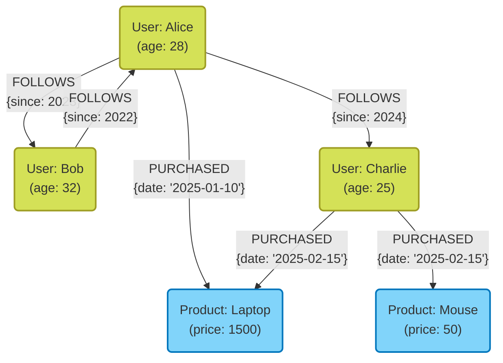
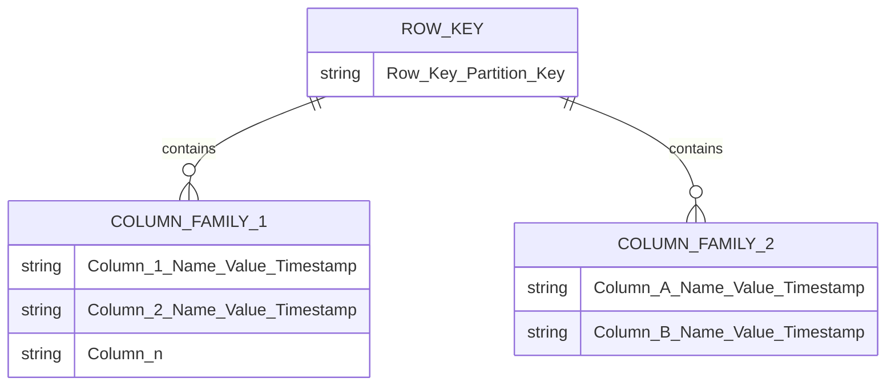

In der modernen Systementwicklung ist die Auswahl einer Datenbank als Mittel zur Speicherung und Verwaltung von Daten von entscheidender Bedeutung. Es gab eine Zeit, in der relationale Datenbanken ([RDBMS](https://kenji.blog/de/p/rdbms-transaction-acid-isolation-level-lock/)) dominierten, aber heute spielen **NoSQL** (Not Only SQL) Datenbanken aufgrund der Diversifizierung und des enormen Wachstums der Datenmengen eine wichtige Rolle.

NoSQL-Datenbanken sind nicht eine einzelne Technologie, sondern ein Sammelbegriff für verschiedene Datenmodelle, die für spezifische Anwendungsfälle optimiert sind. In diesem Artikel werden wir die entscheidenden Unterschiede zwischen RDBMS und NoSQL aufklären und die Eigenschaften, Vor- und Nachteile sowie geeigneten Anwendungsfälle der vier wichtigsten NoSQL-Datenmodelle detailliert und umfassend erläutern: **Key-Value Store (KVS)** , **Dokumentenorientiert** , **[Graph](https://kenji.blog/de/p/tree-graph-data-structures-search-dfs-bfs-dijkstra/)** und **Wide-Column** .

---

## 1. Was ist NoSQL? Ein tiefes Verständnis der Unterschiede zu RDBMS

Um NoSQL richtig auswählen zu können, müssen Sie zunächst die Unterschiede zu herkömmlichen relationalen Datenbanken (RDBMS) klar verstehen. RDBMS (MySQL, PostgreSQL, Oracle usw.) sind seit vielen Jahren das Herzstück von Unternehmenssystemen. Sie zeichnen sich dadurch aus, dass sie die Datenkonsistenz ([ACID](https://kenji.blog/de/p/rdbms-transaction-acid-isolation-level-lock/)-Eigenschaften) strikt garantieren und komplexe Tabellenverknüpfungen (JOIN) sowie flexible Abfragen mittels SQL unterstützen.

Mit dem Wachstum von Webdiensten und der rasanten Zunahme unstrukturierter Daten sind jedoch Probleme aufgetreten, die mit der RDBMS-Architektur nur schwer zu lösen sind. Hier kommt NoSQL ins Spiel. Die Hauptunterschiede zwischen NoSQL und RDBMS sind wie folgt:

### Schemalosigkeit und Flexibilität der Datenstruktur

Bei RDBMS muss im Voraus ein striktes Schema (Spaltennamen und Datentypen von Tabellen) definiert werden. Die Änderung eines einmal definierten Schemas kann kostspielig sein und die Agilität der Entwicklung beeinträchtigen.
Im Gegensatz dazu verwenden viele NoSQL-Datenbanken einen **schemalosen** oder schemaflexiblen Ansatz. Die Datenstruktur muss nicht im Voraus vollständig definiert werden, und die Form der Daten kann dynamisch an sich ändernde Anwendungsanforderungen angepasst werden. Diese Eigenschaft passt sehr gut zu agiler Entwicklung und [[Microservice](https://kenji.blog/de/p/microservices-architecture-bff-api-gateway/)s](https://kenji.blog/de/p/microservices-architecture-bff-api-gateway/)-Architekturen.

### Horizontale Skalierbarkeit (Scale-out)

Der grundlegende Ansatz zur Verbesserung der RDBMS-Leistung ist **Scale-up (vertikale Skalierung)** , bei der CPU und Speicher eines Servers aufgerüstet werden. Es gibt jedoch physische Grenzen für die Leistung eines einzelnen Servers, und dies wird sehr teuer. Einige RDBMS bieten Clustering-Funktionen, aber es gibt technische Hürden bei der Aufrechterhaltung der Datenkonsistenz und der verteilten Verarbeitung über Knoten hinweg.

NoSQL ist von Anfang an auf **Scale-out (horizontale Skalierung)** ausgelegt, was eine Steigerung der Verarbeitungskapazität und der Speicherkapazität durch die Aneinanderreihung mehrerer kostengünstiger Server (Knoten) voraussetzt. Daten werden automatisch über mehrere Knoten verteilt (Sharding), und wenn das Datenvolumen oder der Datenverkehr zunimmt, kann der Durchsatz des gesamten Systems durch einfaches Hinzufügen weiterer Knoten verbessert werden.

### CAP-Theorem und Konsistenzmodelle

In verteilten Systemen ist das **CAP-Theorem** – das besagt, dass Datenkonsistenz ( **C**onsistency ), Verfügbarkeit ( **A**vailability ) und Ausfalltoleranz ( **P**artition Tolerance ) nicht alle drei gleichzeitig vollständig erfüllt werden können – ein wichtiges Konzept beim Design von NoSQL.

RDBMS priorisieren im Allgemeinen " **CA** (Konsistenz und Verfügbarkeit)" (unter der Annahme, dass es keine Netzwerkpartitionen gibt), aber viele NoSQL-Datenbanken wählen den Kompromiss zwischen " **CP** (Konsistenz und Partitionstoleranz)" oder " **AP** (Verfügbarkeit und Partitionstoleranz)". Besonders in großflächigen verteilten Umgebungen opfern viele eine strenge Konsistenz leicht, um die ständige Reaktionsfähigkeit des Systems (Verfügbarkeit) zu priorisieren, und wählen den Ansatz der **letztendlichen Konsistenz (Eventual [Consistency](https://kenji.blog/de/p/cap-theorem-distributed-systems-tradeoff/))** , bei dem die Daten irgendwann übereinstimmen werden.

---

## 2. Key-Value Store (KVS)

Der Key-Value Store (KVS) ist das einfachste und schnellste Datenmodell unter den NoSQL-Datenbanken. Wie der Name schon sagt, verwaltet es Daten nur als Paare eines eindeutigen "Schlüssels (Key)" und seines entsprechenden "Wertes (Value)".

### Datenmodell und Eigenschaften

KVS hat die gleiche Struktur wie ein assoziatives Array oder ein Dictionary. Der Inhalt des Wertes wird von der Datenbank oft nur als Byte-Array oder String behandelt (mit einigen Ausnahmen), und es ist grundsätzlich nicht möglich, die interne Struktur zu interpretieren und abzufragen. Der Zugriff auf Daten beschränkt sich auf die einfache Operation "Erhalten, Aktualisieren oder Löschen des Wertes durch Angabe des Schlüssels".

Diese extreme Einfachheit erzeugt den größten Vorteil von KVS: **überwältigende Leistung** . Da keine komplexe Abfrageanalyse oder JOIN-Verarbeitung erforderlich ist, können Daten mit extrem geringer Latenzzeit in der Größenordnung von Millisekunden bis Mikrosekunden gelesen und geschrieben werden. Da die Daten außerdem unabhängig sind, ist die Verteilung (Sharding) auf mehrere Knoten extrem einfach.

### Typische KVS-Datenbanken

- **Redis** : Der typische In-Memory-KVS, der im Speicher läuft. Ein hochfunktionaler KVS, der nicht nur einfache Zeichenketten, sondern auch eine Vielzahl von Datenstrukturen wie Listen, Sets und Hashes unterstützt und über [Pub/Sub](https://kenji.blog/de/p/event-driven-architecture-message-queue-kafka-rabbitmq/)-Funktionen verfügt.
- **Memcached** : Ein extrem einfaches und schnelles verteiltes Speicher-Caching-System.
- **Amazon DynamoDB** : Ein vollständig verwaltetes KVS mit hoher Skalierbarkeit (hat auch Aspekte von Wide-Column und Dokument).

### Vor- und Nachteile

**Vorteile:**
- **Ultraschnelle Verarbeitungsgeschwindigkeit** : Aufgrund der einfachen Struktur wird der Overhead für Festplatten-I/O- und Speicheroperationen minimiert.
- **Hohe Skalierbarkeit** : Da Daten leicht basierend auf Schlüsseln verteilt werden können, ist eine nahezu unbegrenzte Skalierung möglich.

**Nachteile:**
- **Keine komplexen Abfragen** : Nicht geeignet für die Suche nach Inhalten des Wertes (z. B. "Suche nach Benutzern, deren Alter 20 Jahre oder älter ist") oder die Aggregation von Daten.
- **Schwierigkeit bei der Darstellung von Beziehungen zwischen Daten** : Da es keine Funktion gibt, um Beziehungen herzustellen, muss die Anwendung die Assoziationen selbst verwalten.

### Anwendungsfälle

KVS ist ideal für Szenarien, in denen Werte eindeutig durch Schlüssel abgerufen werden können und eine hohe Geschwindigkeit erforderlich ist.

- **Sitzungsverwaltung** : Speichern von Benutzersitzungsinformationen für Webanwendungen. Der Schlüssel ist die Sitzungs-ID und der Wert sind die Sitzungsdaten.
- **Caching-Schicht** : Vorübergehende Speicherung von Abfrageergebnissen an ein RDBMS oder Berechnungsergebnissen mit hohen Kosten zur Verbesserung der Antwortgeschwindigkeit.
- **Echtzeit-Bestenlisten** : Aggregation und Anzeige von Spiel-Rankings in Echtzeit (insbesondere mithilfe der sortierten Set-Funktion von Redis).
- **Benutzereinstellungen und Profile** : Speichern einzelner Einstellungselemente (z. B. JSON) als Wert unter Verwendung der Benutzer-ID als Schlüssel.

### Redis Codebeispiel

Hier sind Beispiele (CLI-Befehle) für grundlegende Key-Value-Operationen mit Redis.

```text
# Setzen und Abrufen eines einfachen Strings
> SET user:1001:name "Taro Yamada"
OK
> GET user:1001:name
"Taro Yamada"

# Setzen mit Gültigkeitsdauer (TTL), nützlich für Sitzungen (3600 Sekunden = 1 Stunde)
> SETEX session:abcdef123456 3600 "session_data_json_here"
OK

# Verwalten von Benutzerinformationen mithilfe des Hash-Typs
> HSET user:1002 name "Hanako" age 28 city "Tokyo"
(integer) 3
> HGET user:1002 age
"28"
> HGETALL user:1002
1) "name"
2) "Hanako"
3) "age"
4) "28"
5) "city"
6) "Tokyo"
```

---

## 3. Dokumentenorientierte Datenbanken

Dokumentenorientierte Datenbanken sind Datenmodelle, die komplexere Datenstrukturen und erweiterte Abfragefunktionen bieten und gleichzeitig die Flexibilität von KVS erhalten.

### Datenmodell und Eigenschaften

Daten werden in Einheiten gespeichert, die "Dokumente" genannt werden. Die Realität eines Dokuments ist eine hierarchische Datenstruktur, die hauptsächlich in **JSON (JavaScript Object Notation)** , BSON (Binary JSON) oder XML-Formaten ausgedrückt wird.

Im Gegensatz zu KVS verstehen Dokumentendatenbanken die interne Struktur der Werte (Dokumente). Daher ist es möglich, Indizes für verschachtelte Felder in einem Dokument zu erstellen und Suchen sowie Aggregationen unter Angabe von Bedingungen durchzuführen.
Zudem bevorzugen Dokumentendatenbanken im Gegensatz zu [RDBMS](https://kenji.blog/de/p/rdbms-transaction-acid-isolation-level-lock/), die verwandte Daten in separate Tabellen aufteilen (normalisieren), ein Design, das verwandte Daten in einem einzigen Dokument gruppiert (Denormalisierung/Einbettung). Dies ermöglicht es, alle notwendigen Daten mit einer einzigen Abfrage abzurufen.

### Typische dokumentenorientierte Datenbanken

- **MongoDB** : Der De-facto-Standard für dokumentenorientierte Datenbanken. Es verfügt über eine leistungsstarke Abfragesprache, flexible Indizes und hohe Skalierbarkeit.
- **Firestore / Firebase Realtime Database** : Eine von Google Cloud bereitgestellte dokumentenorientierte Datenbank, die sich durch Echtzeitsynchronisation auszeichnet.
- **Couchbase** : Eine verteilte Datenbank, die die Geschwindigkeit von KVS mit den Abfragefunktionen von Dokumentendatenbanken kombiniert.
- **Amazon DocumentDB** : Ein MongoDB-kompatibler, vollständig verwalteter Service.

### Vor- und Nachteile

**Vorteile:**
- **Schemalose Flexibilität** : Jedes Dokument kann eine andere Struktur haben, was es einfach macht, Anwendungsobjekte so zu speichern, wie sie sind.
- **Leistungsstarke Abfragefunktionen** : Suche, Aggregation und Sortierung innerhalb interner Felder sind möglich.
- **Hohe Entwicklungseffizienz** : Komplexes ORM-Mapping ist unnötig und es besteht eine sehr hohe Affinität zu JSON-basierten APIs.

**Nachteile:**
- **Einschränkungen bei komplexen Transaktionen** : Aktualisierungen, die sich über mehrere Dokumente erstrecken, haben einen größeren Overhead als bei RDBMS (obwohl MongoDB und andere in den letzten Jahren Multi-Dokument-Transaktionen unterstützen, wird die häufige Verwendung nicht empfohlen).
- **Zunahme der Datengröße** : Aufgrund der Duplizierung von Feldnamen durch Schemalosigkeit und der Datenredundanz durch Denormalisierung neigt die Datengröße dazu, groß zu werden.

### Anwendungsfälle

Der dokumentenorientierte Typ eignet sich, wenn sich Datenstrukturen häufig ändern oder wenn Sie komplexe Datenstrukturen so speichern möchten, wie sie sind.

- **Content Management Systeme (CMS)** : Flexible Verwaltung von Inhalten mit unterschiedlichen Strukturen wie Artikeln, Autoren, Tags und Kommentaren.
- **Produktkataloge / Bestandsverwaltung** : Ideal für Datenmodelle, bei denen die erforderlichen Attribute (Spezifikationsinformationen) je nach Produktkategorie, z. B. Haushaltsgeräte, Kleidung oder Lebensmittel, stark variieren.
- **Benutzerprofile und Einstellungen** : Verwaltung von beliebigen Konfigurationselementen und Attributinformationen, die sich von Benutzer zu Benutzer unterscheiden, als einzelnes Dokument.
- **Speicherung von Protokollen und Ereignisdaten** : Speichern von Protokolldaten in verschiedenen Formaten, die von Anwendungen generiert werden, als JSON und späteres Durchsuchen und Analysieren.

### MongoDB Codebeispiel

Hier sind Beispiele für das Einfügen von Dokumenten und Abfragen in MongoDB (ähnlich dem mongosh- oder Node.js-Treiber).

```javascript
// Einfügen eines Dokuments (Einbetten von zugehörigen Daten wie Kontakten und Hobbys als Arrays oder verschachtelte Objekte)
db.users.insertOne({
  user_id: "u123",
  name: "Kenji",
  age: 30,
  contact: {
    email: "kenji@example.com",
    phone: "090-1234-5678"
  },
  interests: ["NoSQL", "Cloud", "Photography"],
  status: "active"
});

// Abfragebeispiel 1: Suche nach Benutzern, deren Status "active" ist und deren Alter 25 oder höher ist
db.users.find({
  status: "active",
  age: { $gte: 25 }
});

// Abfragebeispiel 2: Suche nach Benutzern, deren Array 'interests' "NoSQL" enthält
db.users.find({
  interests: "NoSQL"
});

// Suche in verschachtelten Feldern (Verwendung der Punktnotation)
db.users.find({
  "contact.email": "kenji@example.com"
});
```

---

## 4. [Graph](https://kenji.blog/de/p/tree-graph-data-structures-search-dfs-bfs-dijkstra/)-Datenbanken

Graph-Datenbanken sind spezialisierte Datenbanken, die entwickelt wurden, um sich mehr auf " **die Beziehungen (Verbindungen) zwischen Daten** " als auf die Daten selbst zu konzentrieren. Obwohl das "relational" in [RDBMS](https://kenji.blog/de/p/rdbms-transaction-acid-isolation-level-lock/) eigentlich teuer in der Handhabung von Beziehungen zwischen Tabellen ist, behandeln [Graph](https://kenji.blog/de/p/tree-graph-data-structures-search-dfs-bfs-dijkstra/)-Datenbanken Beziehungen buchstäblich als erstklassige Objekte.

### Datenmodell und Eigenschaften

Graph-Datenbanken verwenden ein Datenmodell, das auf der mathematischen "Graphentheorie" basiert. Die Hauptelemente, aus denen die Daten bestehen, sind die folgenden drei:

1. **Knoten (Node / Vertex)** : Die Entität der Daten (z. B. eine Person, ein Unternehmen, ein Produkt usw.). Entspricht einer Zeile in einem RDBMS.
2. **Kanten (Edge / Relationship)** : Die Beziehung zwischen Knoten (z. B. sind Freunde, gekauft, gehört zu usw.). Kanten können eine Richtung haben.
3. **Eigenschaften (Property)** : Attributinformationen im Key-Value-Format, die Knoten oder Kanten zugeordnet sind (z. B. "Name" einer Person, "Startdatum" einer Beziehung usw.).

In einem RDBMS erfordert das Verfolgen komplexer Beziehungen viele JOINs, und die Leistung verschlechtert sich rapide, wenn die Hierarchie tiefer wird. In einer Graph-Datenbank ist das Traversieren von Kanten ausgehend von einem Knoten (Traversal) jedoch extrem schnell, auf dem Niveau von Zeigerbewegungen, so dass Zehntausende oder Millionen von Beziehungen sofort durchsucht werden können.

### Diagramm des Graphmodells mit Mermaid

Das Folgende ist ein konzeptionelles Diagramm einer Graph-Datenbank, die Beziehungen zwischen Benutzern in einem SNS und der Kaufhistorie von Produkten modelliert.



### Typische [Graph](https://kenji.blog/de/p/tree-graph-data-structures-search-dfs-bfs-dijkstra/)-Datenbanken

- **Neo4j** : Die am weitesten verbreitete Graph-Datenbank der Welt. Verwendet Cypher, eine eigene leistungsstarke Abfragesprache.
- **Amazon Neptune** : Eine vollständig verwaltete Graph-Datenbank von AWS. Unterstützt Property Graph (Gremlin) und RDF (SPARQL).
- **ArangoDB** : Eine Multi-Modell-Datenbank, die Graphen, Dokumente und KVS unterstützt.

### Vor- und Nachteile

**Vorteile:**
- **Ultraschnelle Erkundung tiefer hierarchischer Beziehungen** : Komplexe Beziehungsabfragen wie "Das Produkt, das der Freund eines Freundes eines Freundes gekauft hat" können in Millisekunden verarbeitet werden.
- **Intuitive Datenmodellierung** : Ein auf einem Whiteboard gezeichnetes Konzeptdiagramm kann direkt als Datenbankschema implementiert werden.

**Nachteile:**
- **Nicht geeignet für vollständige Scans einzelner Entitäten** : Für einfache Aggregationen (z. B. "Berechnung des Durchschnittsalters aller Benutzer") sind [RDBMS](https://kenji.blog/de/p/rdbms-transaction-acid-isolation-level-lock/) oder Dokumentendatenbanken oft schneller.
- **Schwierigkeit der verteilten Verarbeitung** : Da Graphen eng gekoppelte Daten sind, führt das Sharding der Daten über mehrere Knoten tendenziell zu knotenübergreifenden Traversierungen, wodurch die Leistung leicht abfällt.

### Anwendungsfälle

Unerlässlich für Systeme, in denen die Verbindungen zwischen Daten selbst wertvoll sind und die Beziehungen tiefgehend erforscht und analysiert werden müssen.

- **SNS (Soziale Netzwerke)** : Verwaltung von Freundschaften und Follower-/Following-Beziehungen.
- **Empfehlungs-Engines** : Echtzeit-Vorschläge für "Produkte, die von Benutzern mit ähnlichen Kaufgewohnheiten wie Sie gekauft wurden".
- **Betrugserkennung (Fraud Detection)** : Visualisierung von Korrelationen zwischen verdächtigen IP-Adressen, Kreditkarten und Konten als [Graph](https://kenji.blog/de/p/tree-graph-data-structures-search-dfs-bfs-dijkstra/) zur Identifizierung von Betrugsringen.
- **Netzwerk- und IT-Infrastrukturmanagement** : Verwaltung von Abhängigkeiten zwischen Servern und Routern zur sofortigen Identifizierung der Auswirkungen bei Ausfällen.

### Neo4j Codebeispiel (Cypher-Abfrage)

Dies ist ein Beispiel für die Abfragesprache Cypher zum Einfügen von Daten und Suchen von Beziehungen in Neo4j. Cypher zeichnet sich dadurch aus, dass es Beziehungen wie ASCII-Art ausdrücken kann.

```cypher
// Erstellen von Knoten und Beziehungen
CREATE (alice:User {name: 'Alice', age: 28})
CREATE (bob:User {name: 'Bob', age: 32})
CREATE (laptop:Product {name: 'Laptop', price: 1500})
// Erstellen von Kanten
CREATE (alice)-[:FOLLOWS {since: 2023}]->(bob)
CREATE (alice)-[:PURCHASED {date: '2025-01-10'}]->(laptop);

// Abfragebeispiel 1: Suche nach Benutzern, denen Alice folgt
MATCH (u:User {name: 'Alice'})-[:FOLLOWS]->(follower)
RETURN follower.name;

// Abfragebeispiel 2: Empfehlung (Finde Produkte, die von Leuten gekauft wurden, denen Alice folgt)
MATCH (alice:User {name: 'Alice'})-[:FOLLOWS]->(friend)-[:PURCHASED]->(product)
// Bedingungen, wie das Ausschließen von Produkten, die man bereits selbst gekauft hat, können ebenfalls hinzugefügt werden
RETURN product.name, count(product) AS purchaseCount
ORDER BY purchaseCount DESC;
```

---

## 5. Wide-Column-Datenbanken (Spaltenorientierter Speicher)

Eine Wide-Column-Datenbank (oder Column-Family-Store) ist ein Datenmodell, das darauf spezialisiert ist, große Datenmengen über mehrere Knoten zu verteilen und Lese-/Schreibvorgänge mit hoher Geschwindigkeit durchzuführen. Es wurde von Googles Bigtable-Paper inspiriert.

### Datenmodell und Eigenschaften

Obwohl es der Tabellenstruktur aus Zeilen und Spalten wie bei [RDBMS](https://kenji.blog/de/p/rdbms-transaction-acid-isolation-level-lock/) ähnelt, unterscheidet sich die interne Art und Weise, wie Daten gespeichert werden, erheblich. Die Datenstruktur eines Wide-Column-Stores besteht hauptsächlich aus den folgenden Elementen:

1. **Zeilenschlüssel (Row Key)** : Ein Schlüssel, der eine Zeile eindeutig identifiziert. Daten werden basierend auf diesem Schlüssel auf verschiedene Knoten verteilt.
2. **Spaltenfamilie (Column Family)** : Eine Gruppe verwandter Spalten. Ähnlich einer Tabelle in einem RDBMS, kann jedoch von Zeile zu Zeile unterschiedliche Spalten haben.
3. **Spalte (Column)** : Ein Satz aus "Spaltenname (Key)", "Wert (Value)" und "Zeitstempel (Timestamp)".

Das größte Merkmal ist, **dass jede Zeile eine unterschiedliche Anzahl und Art von Spalten haben kann (schemalos)** und **dass eine extrem große (breite) Zeile mit Millionen von Spalten existieren kann** .
Darüber hinaus verwendet es Architekturen wie den LSM-[Tree](https://kenji.blog/de/p/tree-graph-data-structures-search-dfs-bfs-dijkstra/) (Log-Structured Merge-tree), sodass Schreiboperationen (Write) auf die Festplatte extrem schnell und sequentiell ausgeführt werden, was es bei der kontinuierlichen Aufzeichnung riesiger Datenmengen überwältigend stark macht.

### Diagramm des Wide-Column-Modells mit Mermaid

Das Folgende ist ein Bild der logischen Datenstruktur eines Wide-Column-Stores, der Sensordaten (IoT) aufzeichnet. Es kann eine beliebige Anzahl von Spalten pro Zeile speichern.



### Typische Wide-Column-Datenbanken

- **Apache Cassandra** : Von Facebook entwickelt, verfügt es über eine hohe Verfügbarkeit, Skalierbarkeit und eine Masterless-verteilte Architektur.
- **Apache HBase** : Ein riesiger Wide-Column-Store, der als Teil des Hadoop-Ökosystems fungiert und auf HDFS aufbaut.
- **ScyllaDB** : Cassandra-kompatibel, aber in C++ neu geschrieben, um einen um Größenordnungen höheren Durchsatz zu erzielen.
- **Google Cloud Bigtable** : Ein vollständig verwalteter Service, der der Ursprung der Wide-Column-Stores ist.

### Vor- und Nachteile

**Vorteile:**
- **Erstaunlich hoher Schreibdurchsatz** : Es ist möglich, Millionen von Schreibvorgängen pro Sekunde an einen Cluster aus Tausenden bis Zehntausenden von Servern durchzuführen.
- **Kein Single Point of Failure (SPOF)** : In einer Masterless-Architektur wie Cassandra kann das System als Ganzes weiterlaufen, selbst wenn ein beliebiger Knoten ausfällt.
- **Geografische Verteilung (Multi-Data-Center)** : Ideal für die Echtzeit-Datenreplikation über mehrere Rechenzentren hinweg.

**Nachteile:**
- **Keine flexiblen Abfragen** : Da Daten basierend auf dem Zeilenschlüssel (Row Key) (und dem Clustering-Key) physisch platziert werden, sind Suchen oder JOINs mit anderen Spalten als dem Schlüssel im Grunde unmöglich (oder deutlich langsamer). "Abfragegesteuerte Modellierung" (Query-driven Modeling), bei der Tabellen entsprechend dem Zugriffsmuster entworfen werden, ist unerlässlich.
- **Lernaufwand** : Es erfordert einen Wechsel vom normalisierten Modellierungsdenken eines [RDBMS](https://kenji.blog/de/p/rdbms-transaction-acid-isolation-level-lock/), was die Datenmodellierung schwierig macht.

### Anwendungsfälle

Es ist am besten für extrem große Systeme geeignet, bei denen das Schreiben großer Datenmengen basierend auf bestimmten Schlüsseln und das gezielte Lesen im Mittelpunkt stehen.

- **IoT-Sensordaten / Zeitreihendaten** : Kontinuierliche Aufzeichnung von Messdaten, die jede Sekunde von Millionen von Geräten gesendet werden, unter Verwendung der Geräte-ID (Row Key) und der Zeit (Spaltenname).
- **Großflächige Protokollerfassung und -analyse** : Anhängen (Append-Only) von Datenspeicherung, wie Website-Clickstreams oder Systemzugriffsprotokolle.
- **Verwaltung des Nachrichtenverlaufs** : Speicherung von riesigen Nachrichtenverläufen für Chat-Apps (wie Discord).
- **Feature-Store für Personalisierung/Empfehlungen** : Schnelles Auslesen vergangener Benutzeraktivitäten zur Übergabe an Modelle des maschinellen Lernens.

---

## 6. Die Option einer Multi-Modell-Datenbank

In den letzten Jahren haben auch **Multi-Modell-Datenbanken** Aufmerksamkeit erregt, die die Funktionalität mehrerer NoSQL-Modelle und RDBMS innerhalb einer einzigen Datenbank-Engine integriert bereitstellen.

PostgreSQL verfügt beispielsweise durch seine leistungsstarke Unterstützung für den Typ JSONB über Funktionen als Dokumentendatenbank. Es gibt auch Produkte wie Azure Cosmos DB oder ArangoDB, die KVS, Dokumente und Graphen transparent mit einem Backend behandeln können. Dies ermöglicht einen flexiblen Datenzugriff entsprechend den Anforderungen und reduziert gleichzeitig die Betriebskosten für den Betrieb mehrerer Datenbanksysteme innerhalb eines Projekts (die Komplexität von polyglotter Persistenz).

---

## 7. Fazit: Die optimale Wahl basierend auf dem Anwendungsfall

Wie wir bisher gesehen haben, gibt es bei NoSQL keine "Silberkugel". Der Schlüssel zum Erfolg liegt in der Auswahl des richtigen Datenmodells für die Anforderungen Ihres Projekts. Abschließend fassen wir einige kurze Richtlinien für die Auswahl zusammen.

1. **Benötigen Sie extrem schnelles, einfaches Lesen und Schreiben, wie z. B. Sitzungsverwaltung oder Caching?**
   👉 Wählen Sie **Key-Value Store (Redis, Memcached)** .
2. **Ändert sich Ihre Datenstruktur häufig und möchten Sie komplexe JSON-Daten so wie sie sind speichern und durchsuchen?**
   👉 Wählen Sie **Dokumentenorientiert (MongoDB, Firestore)** .
3. **Möchten Sie komplexe Beziehungen zwischen Daten, wie z. B. "Freunde von Freunden" oder "Empfehlungspfade", sofort durchsuchen und analysieren?**
   👉 Wählen Sie **[Graph](https://kenji.blog/de/p/tree-graph-data-structures-search-dfs-bfs-dijkstra/) (Neo4j)** .
4. **Möchten Sie Zehntausende von Protokollen oder IoT-Daten pro Sekunde schreiben und unendlich skalieren?**
   👉 Wählen Sie **Wide-Column (Cassandra, Bigtable)** .
5. **Sind strenge Datenkonsistenz, komplexe Transaktionen und vielfältige Aggregationen (JOIN) unerlässlich?**
   👉 Erzwingen Sie die Verwendung von NoSQL nicht und wählen Sie einfach ein **RDBMS (PostgreSQL, MySQL)** .

In modernen Großarchitekturen ist die **polyglotte Persistenz** (Polyglot Persistence) üblich, bei der für jeden [Microservice](https://kenji.blog/de/p/microservices-architecture-bff-api-gateway/) die am besten geeignete Datenbank eingesetzt wird, anstatt alle Daten in einer einzigen Datenbank zu speichern.
Durch ein tiefes Verständnis der Stärken und Schwächen jedes Datenmodells und der grundlegenden Unterschiede zu RDBMS wird es möglich, ein optimales Datenbankdesign zu erstellen, das Leistung, Skalierbarkeit und Verfügbarkeit des Systems maximiert.
