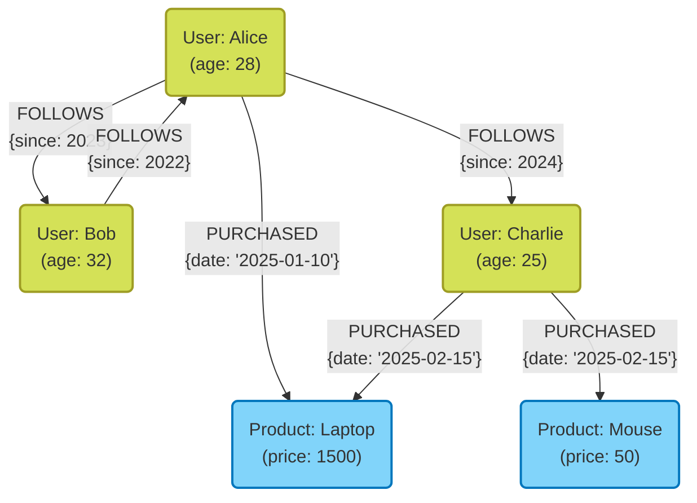

In modern system development, selecting a database as a means of data storage and management holds extremely important meaning. While relational databases ([RDBMS](https://kenji.blog/en/p/rdbms-transaction-acid-isolation-level-lock/)) once dominated, **NoSQL** (Not Only SQL) databases now play a crucial role as data diversifies and scales up.

NoSQL databases are not a single technology, but a collective term for various data models optimized for specific use cases. In this article, we will clarify the decisive differences between RDBMS and NoSQL, and comprehensively explain the characteristics, pros and cons, and appropriate use cases of four typical NoSQL data models: **Key-Value Store (KVS)**, **Document-Oriented**, **[Graph](https://kenji.blog/en/p/tree-graph-data-structures-search-dfs-bfs-dijkstra/)**, and **Wide-Column**.

---

## 1. What is NoSQL? Deeply Understanding the Differences from RDBMS

To properly select a NoSQL database, you must first clearly understand its differences from traditional relational databases (RDBMS). RDBMS (such as MySQL, PostgreSQL, Oracle) have long been at the center of enterprise systems. They excel in strictly guaranteeing data consistency ([ACID](https://kenji.blog/en/p/rdbms-transaction-acid-isolation-level-lock/) properties) and supporting complex table joins (JOINs) and flexible queries using SQL.

However, as web services have scaled up and unstructured data has rapidly increased, challenges that are difficult to address with RDBMS architecture have come to light. This is where NoSQL comes in. The main differences between NoSQL and RDBMS are as follows.

### Schemaless and Flexibility of Data Structure

RDBMS require a strict schema (table column names and data types) to be defined in advance. Modifying a once-defined schema can be costly and may compromise development agility.
On the other hand, many NoSQL databases adopt a **schemaless** or schema-flexible approach. There is no need to completely define the data structure beforehand, and the shape of the data can be dynamically changed according to changes in application requirements. This characteristic is highly compatible with agile development and microservices architectures.

### Horizontal Scalability (Scale-Out)

The fundamental approach to improving RDBMS performance is **scale-up (vertical scaling)**, which enhances the CPU and memory of a single server. However, there are physical limits to the performance of a single server, and it becomes extremely expensive. While some RDBMS offer clustering features, maintaining data consistency across nodes and distributed processing present technical hurdles.

NoSQL is designed from the initial stages with the premise of **scale-out (horizontal scaling)**, which improves processing power and storage capacity by arranging multiple inexpensive servers (nodes). Data is automatically distributed (sharded) across multiple nodes, and when data volume or traffic increases, overall system throughput can be improved simply by adding nodes.

### [CAP Theorem](https://kenji.blog/en/p/cap-theorem-distributed-systems-tradeoff/) and [Consistency](https://kenji.blog/en/p/cap-theorem-distributed-systems-tradeoff/) Models

The **CAP Theorem**, which states that it is impossible for a distributed system to simultaneously and completely satisfy all three guarantees of data Consistency ( **C** ), [Availability](https://kenji.blog/en/p/cap-theorem-distributed-systems-tradeoff/) ( **A** ), and [Partition Tolerance](https://kenji.blog/en/p/cap-theorem-distributed-systems-tradeoff/) ( **P** ), is a key concept in NoSQL design.

RDBMS generally prioritize " **CA** (Consistency and Availability)" (assuming no network partitions), while many NoSQL databases choose a tradeoff between either " **CP** (Consistency and Partition Tolerance)" or " **AP** (Availability and Partition Tolerance)". Particularly in large-scale distributed environments, many adopt an approach called **[Eventual Consistency](https://kenji.blog/en/p/cap-theorem-distributed-systems-tradeoff/)**, which slightly sacrifices strict consistency to prioritize continuous system response (availability), as long as the data eventually matches.

---

## 2. Key-Value Store (KVS)

Key-Value Store (KVS) is the simplest and fastest data model among NoSQL databases. As the name suggests, it manages data solely through pairs of a unique "Key" and its corresponding "Value".

### Data Model and Characteristics

KVS has the same structure as an associative array or dictionary. The contents of the value are often treated as mere byte arrays or strings by the database side (with some exceptions), and basically, it is impossible to interpret the internal structure and send queries. Accessing data is limited to simple operations of "getting, setting, or deleting a value by specifying a key."

This extreme simplicity produces **overwhelming performance**, which is the greatest weapon of KVS. Because complex query parsing and JOIN processing are unnecessary, data reading and writing are possible with ultra-low latency on the order of milliseconds to microseconds. Also, because data is independent, distribution (sharding) across multiple nodes is extremely easy.

### Representative KVS Databases

- **Redis** : A representative in-memory KVS that operates on memory. A highly functional KVS that supports a variety of data structures like lists, sets, and hashes, not just simple strings, and also features pub/sub capabilities.
- **Memcached** : An extremely simple and fast distributed memory caching system.
- **Amazon DynamoDB** : A fully managed KVS boasting high scalability (also has wide-column and document aspects).

### Pros and Cons

**Pros:**
- **Ultra-fast processing speed** : Because the structure is simple, disk I/O and memory manipulation overhead is minimal.
- **High scalability** : Because data can be easily distributed based on keys, near-infinite scale-out is possible.

**Cons:**
- **Complex queries are impossible** : Not suitable for searching by value contents (e.g., "Find users aged 20 or older") or aggregating data.
- **Difficult to express relationships between data** : Because there is no feature to maintain relationships, the application side must manage associations.

### Use Cases

KVS is optimal for scenarios where values can be uniquely retrieved from keys and high speed is required.

- **Session Management** : Storing user session information for web applications. The key is the session ID, and the value is the session data.
- **Cache Layer** : Temporarily storing query results to RDBMS or computationally expensive processing results to improve response speed.
- **Real-time Leaderboards** : Aggregating and displaying game rankings in real-time (especially using Redis's sorted set feature).
- **User Settings and Profiles** : Storing individual setting items (like JSON) as values using the user ID as a key.

### Redis Code Example

Here is an example of basic key-value operations using Redis (CLI commands).

```text
# Simple string set and get
> SET user:1001:name "Taro Yamada"
OK
> GET user:1001:name
"Taro Yamada"

# Set with an expiration time (TTL) useful for sessions, etc. (3600 seconds = 1 hour)
> SETEX session:abcdef123456 3600 "session_data_json_here"
OK

# Managing user information using the Hash type
> HSET user:1002 name "Hanako" age 28 city "Tokyo"
(integer) 3
> HGET user:1002 age
"28"
> HGETALL user:1002
1) "name"
2) "Hanako"
3) "age"
4) "28"
5) "city"
6) "Tokyo"
```

---

## 3. Document-Oriented Database

Document-oriented databases are data models that provide more complex data structures and advanced querying capabilities while maintaining the flexibility of a KVS.

### Data Model and Characteristics

Data is stored in units called "documents". The substance of a document is a hierarchical data structure expressed mainly in **JSON (JavaScript Object Notation)**, BSON (Binary JSON), or XML format.

Unlike KVS, document databases understand the internal structure of the values (documents). Therefore, it is possible to create indexes on nested fields within a document, or search and aggregate by specifying conditions.
Also, in contrast to [RDBMS](https://kenji.blog/en/p/rdbms-transaction-acid-isolation-level-lock/) which separate (normalize) related data into different tables, document databases prefer designs that consolidate (denormalize/embed) related data into a single document. This makes it possible to retrieve all necessary data with a single query.

### Representative Document-Oriented Databases

- **MongoDB** : The de facto standard for document-oriented databases. Equipped with a powerful query language and flexible indexes, and features high scalability.
- **Firestore / Firebase Realtime Database** : Document-type databases provided by Google Cloud that excel in real-time synchronization.
- **Couchbase** : A distributed database combining the high speed of KVS with the query capabilities of a document database.
- **Amazon DocumentDB** : A fully managed service compatible with MongoDB.

### Pros and Cons

**Pros:**
- **Schemaless flexibility** : Each document can have a different structure, making it easy to save application objects as they are.
- **Powerful querying capabilities** : Searching, aggregating, and sorting by internal fields are possible.
- **High development efficiency** : Complex ORM mapping is unnecessary, and it has a very high affinity with JSON-based APIs.

**Cons:**
- **Complex transaction limitations** : Updating across multiple documents has a higher overhead compared to RDBMS (while multi-document transactions are supported in recent years by MongoDB, etc., heavy usage is not recommended).
- **Data size bloat** : Data size tends to increase due to the repeated storage of field names caused by the schemaless nature, and data duplication caused by denormalization.

### Use Cases

Document-oriented is suitable when data structures change frequently or when you want to save complex data structures as they are.

- **Content Management Systems (CMS)** : Flexibly managing content with different structures, such as articles, authors, tags, and comments.
- **Product Catalogs / Inventory Management** : Optimal for data models where the required attributes (spec information) differ greatly depending on product categories like home appliances, clothing, or food.
- **User Profiles and Settings** : Managing arbitrary setting items or attribute information that differs per user as a single document.
- **Log and Event Data Storage** : Saving various formats of log data output by applications directly as JSON for later search and analysis.

### MongoDB Code Example

Here is an example of document insertion and querying in MongoDB (mongosh or Node.js driver style).

```javascript
// Inserting a document (embedding related data like contact info and hobbies as arrays or nested objects)
db.users.insertOne({
  user_id: "u123",
  name: "Kenji",
  age: 30,
  contact: {
    email: "kenji@example.com",
    phone: "090-1234-5678"
  },
  interests: ["NoSQL", "Cloud", "Photography"],
  status: "active"
});

// Query example 1: Find users whose status is "active" and age is 25 or older
db.users.find({
  status: "active",
  age: { $gte: 25 }
});

// Query example 2: Find users whose interests array includes "NoSQL"
db.users.find({
  interests: "NoSQL"
});

// Searching by nested fields (using dot notation)
db.users.find({
  "contact.email": "kenji@example.com"
});
```

---

## 4. [Graph](https://kenji.blog/en/p/tree-graph-data-structures-search-dfs-bfs-dijkstra/) Database

A graph database is a specialized database designed with an emphasis on " **relationships (connections) between data** " rather than the data itself. While the "relational" in [RDBMS](https://kenji.blog/en/p/rdbms-transaction-acid-isolation-level-lock/) actually incurs a cost to handle relationships between tables, graph databases literally treat relationships as first-class objects.

### Data Model and Characteristics

[Graph](https://kenji.blog/en/p/tree-graph-data-structures-search-dfs-bfs-dijkstra/) databases adopt a data model based on mathematical "graph theory". The main components that make up the data are the following three:

1. **Node (Vertex)** : Data entities (e.g., person, company, product). Equivalent to a row in an RDBMS.
2. **Edge (Relationship)** : Relationships between nodes (e.g., is a friend of, purchased, belongs to). Edges can have a direction.
3. **Property** : Key-value format attribute information attached to nodes and edges (e.g., a person's "name", a relationship's "start date").

In an RDBMS, tracing complex relationships requires many JOINs, and performance degrades rapidly as the hierarchy deepens. However, in a graph database, the operation of traversing from a node through edges (traversal) is performed extremely fast at the level of pointer movement, allowing tens of thousands to millions of relationships to be explored instantly.

### Diagramming Graph Models with Mermaid

Below is a conceptual diagram of a graph database modeling the relationships between users on an SNS and the purchase history of products.



### Representative [Graph](https://kenji.blog/en/p/tree-graph-data-structures-search-dfs-bfs-dijkstra/) Databases

- **Neo4j** : The world's most widely used graph database. Adopts its own powerful query language, Cypher.
- **Amazon Neptune** : A fully managed graph database provided by AWS. Supports Property Graph (Gremlin) and RDF (SPARQL).
- **ArangoDB** : A multi-model database supporting graph, document, and KVS.

### Pros and Cons

**Pros:**
- **Ultra-fast exploration of deep hierarchical relationships** : Complex relationship queries like "products bought by a friend of a friend of a friend" can be processed in milliseconds.
- **Intuitive data modeling** : Conceptual diagrams drawn on a whiteboard can be implemented directly as the database schema.

**Cons:**
- **Unsuited for full table scans of a single entity** : Simple aggregation processes (e.g., "Calculate the average age of all users") are often faster in [RDBMS](https://kenji.blog/en/p/rdbms-transaction-acid-isolation-level-lock/) or document-oriented databases.
- **Difficulty of distributed processing** : Because graphs are tightly coupled data, splitting data across multiple nodes (sharding) tends to cause traversals across nodes, which easily degrades performance.

### Use Cases

Indispensable for systems where the connections between data themselves hold value, and where there is a need to deeply explore and analyze those relationships.

- **SNS (Social Networks)** : Managing friend relationships and follower/following relationships.
- **Recommendation Engines** : Proposing "products bought by users with similar purchasing tendencies to you" in real-time.
- **Fraud Detection** : Visualizing the correlations between suspicious IP addresses, credit cards, and accounts as a graph to identify fraud rings.
- **Network and IT Infrastructure Management** : Managing the dependencies of servers and routers to instantly identify the impact scope during failures.

### Neo4j Code Example (Cypher Query)

Here is an example of the Cypher query language used to insert data and search relationships in Neo4j. Cypher is characterized by its ability to express relationships like ASCII art.

```cypher
// Creating nodes and relationships
CREATE (alice:User {name: 'Alice', age: 28})
CREATE (bob:User {name: 'Bob', age: 32})
CREATE (laptop:Product {name: 'Laptop', price: 1500})
// Creating edges
CREATE (alice)-[:FOLLOWS {since: 2023}]->(bob)
CREATE (alice)-[:PURCHASED {date: '2025-01-10'}]->(laptop);

// Query example 1: Find users that Alice follows
MATCH (u:User {name: 'Alice'})-[:FOLLOWS]->(follower)
RETURN follower.name;

// Query example 2: Recommendation (Find products bought by people Alice follows)
MATCH (alice:User {name: 'Alice'})-[:FOLLOWS]->(friend)-[:PURCHASED]->(product)
// Conditions like excluding what oneself has already bought can also be added
RETURN product.name, count(product) AS purchaseCount
ORDER BY purchaseCount DESC;
```

---

## 5. Wide-Column Store (Column-Oriented Store)

Wide-column databases (or column family stores) are data models specialized in distributing massive amounts of data across multiple nodes for high-speed writing and reading. They emerged inspired by Google's Bigtable paper.

### Data Model and Characteristics

While resembling the row-and-column table structure of an [RDBMS](https://kenji.blog/en/p/rdbms-transaction-acid-isolation-level-lock/), the internal data retention method is significantly different. The data structure of a wide-column store consists mainly of the following elements:

1. **Row Key** : A key that uniquely identifies a row. Data is distributed and placed on each node based on this key.
2. **Column Family** : A group of related columns. Similar to an RDBMS table, but can have different columns per row.
3. **Column** : A set of "Column Name (Key)", "Value", and "Timestamp".

Its greatest feature is that **the number and types of columns can differ per row (schemaless)**, and it can have **gigantic (wide) rows with millions of columns**.
Additionally, adopting architectures like the LSM tree (Log-Structured Merge-tree) allows write processing to disks to be extremely fast and sequential, demonstrating overwhelming strength in applications that continuously record massive amounts of data.

### Diagramming the Wide-Column Model with Mermaid

Below is an image of the logical data structure of a wide-column store for recording sensor data (IoT). Any number of columns can be stored per row.

```mermaid
erDiagram
    %% Wide Column Store Data Structure
    ROW_KEY {
        string "Row Key (Partition Key)"
    }
    
    COLUMN_FAMILY_1 {
        string "Column 1 (Name:Value:Timestamp)"
        string "Column 2 (Name:Value:Timestamp)"
        string "Column n..."
    }
    
    COLUMN_FAMILY_2 {
        string "Column A (Name:Value:Timestamp)"
        string "Column B (Name:Value:Timestamp)"
    }
    
    ROW_KEY ||--o{ COLUMN_FAMILY_1 : "contains"
    ROW_KEY ||--o{ COLUMN_FAMILY_2 : "contains"

    %% Note: Each actual row can store a massive and dynamic number of columns within a column family (e.g., using sensor timestamps as column names).
```

### Representative Wide-Column Databases

- **Apache Cassandra** : Developed by Facebook, it possesses high availability, scalability, and a masterless distributed architecture.
- **Apache HBase** : Functions as part of the Hadoop ecosystem, a massive wide-column store built on HDFS.
- **ScyllaDB** : Cassandra-compatible, but rewritten in C++ to achieve orders of magnitude higher throughput.
- **Google Cloud Bigtable** : A fully managed service that is the progenitor of wide-column stores.

### Pros and Cons

**Pros:**
- **Astonishingly high write throughput** : Capable of writing millions of records per second to a cluster of thousands to tens of thousands of servers.
- **No Single Point of Failure (SPOF)** : In masterless architectures like Cassandra, system operation can continue even if any node goes down.
- **Geographic distribution (Multi-Data Center)** : Excels at real-time data replication across multiple data centers.

**Cons:**
- **Flexible queries are impossible** : Because data is physically arranged based on the Row Key (and clustering keys), searching or JOINing using columns other than the key is basically impossible (or significantly slow). "Query-driven modeling," which designs tables according to access patterns, is essential.
- **Learning cost** : High difficulty in data modeling, as it requires switching from the normalized modeling mindset of [RDBMS](https://kenji.blog/en/p/rdbms-transaction-acid-isolation-level-lock/).

### Use Cases

Optimal for ultra-large-scale systems where writing massive amounts of data based on specific keys and pinpoint readouts are central.

- **IoT Sensor Data / Time-Series Data** : Continuously recording measurement data sent every second from millions of devices, using the device ID (Row Key) and time (column name).
- **Large-Scale Log Collection and Analysis** : Append-only data storage for website clickstreams and system access logs.
- **Messaging History Management** : Storing large-scale message histories for chat apps (like Discord).
- **Feature Stores for Personalization/Recommendations** : Quickly reading a user's past activity and passing it to machine learning models.

---

## 6. The Multi-Model Database Option

In recent years, **multi-model databases**, which integrate and provide the functionalities of multiple NoSQL models or RDBMS on a single database engine, have also been gaining attention.

For example, PostgreSQL has document-type functionality through its powerful support for the JSONB type. Also, products like Azure Cosmos DB or ArangoDB can transparently handle KVS, Document, and [Graph](https://kenji.blog/en/p/tree-graph-data-structures-search-dfs-bfs-dijkstra/) with a single backend. This allows for flexible data access corresponding to requirements while keeping the operational cost of managing multiple database systems within a project (the complexity of polyglot persistence) low.

---

## 7. Conclusion: The Optimal Choice Based on Use Cases

As we have seen, there is no "silver bullet" in NoSQL. Selecting the appropriate data model tailored to your project requirements is the key to success. Finally, here is a concise guideline for selection.

1. **Do you need ultra-fast simple reads and writes, like for session management or caching?**
   👉 Choose a **Key-Value Store (Redis, Memcached)**.
2. **Do data structures change frequently, and do you want to store and search complex JSON data as is?**
   👉 Choose a **Document-Oriented Database (MongoDB, Firestore)**.
3. **Do you want to instantly explore and analyze complex relationships between data, like "friends of friends" or "recommendation paths"?**
   👉 Choose a **Graph Database (Neo4j)**.
4. **Do you want to write tens of thousands of logs or IoT data per second and scale infinitely?**
   👉 Choose a **Wide-Column Store (Cassandra, Bigtable)**.
5. **Are strict data consistency, complex transactions, and diverse aggregations (JOINs) essential?**
   👉 Don't force NoSQL; simply choose an **RDBMS (PostgreSQL, MySQL)**.

In modern large-scale architectures, **polyglot persistence**, which adopts the most suitable database for each microservice instead of storing all data in a single database, is common.
By deeply understanding the strengths and weaknesses of each data model, and their fundamental differences from RDBMS, you will be able to design optimal databases that maximize your system's performance, scalability, and availability.
