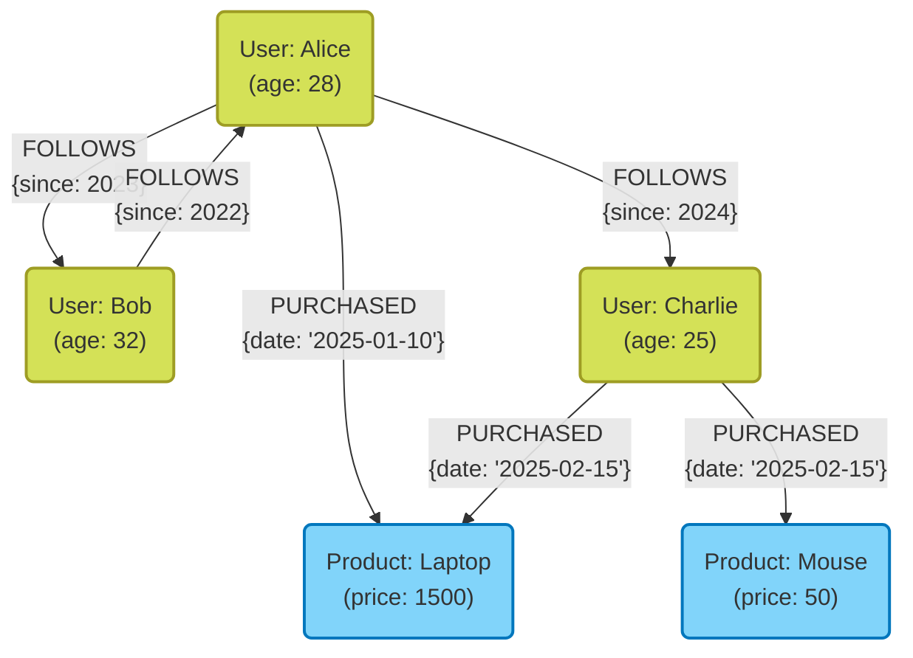
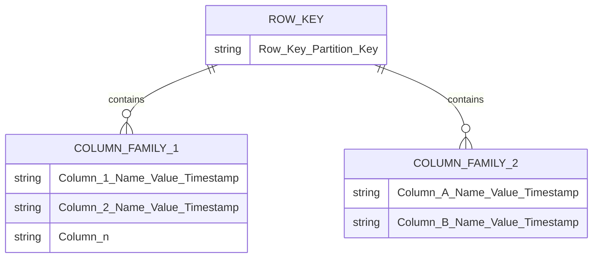

En el desarrollo de sistemas modernos, la selección de la base de datos como medio para almacenar y gestionar datos tiene un significado sumamente importante. Hubo un tiempo en el que las bases de datos relacionales ([RDBMS](https://kenji.blog/es/p/rdbms-transaction-acid-isolation-level-lock/)) dominaban de manera absoluta, pero hoy en día, con la diversificación de los datos y el aumento de su escala, las bases de datos **NoSQL** (Not Only SQL) han pasado a desempeñar un papel fundamental.

Las bases de datos NoSQL no son una única tecnología, sino un término genérico para varios modelos de datos optimizados para casos de uso específicos. En este artículo, después de aclarar las diferencias cruciales entre RDBMS y NoSQL, explicaremos de manera detallada y exhaustiva las características, ventajas, desventajas y casos de uso adecuados para los cuatro modelos de datos NoSQL representativos: **tipo clave-valor (KVS)**, **orientado a documentos**, **tipo grafo** y **tipo columnas anchas**.

---

## 1. ¿Qué es NoSQL? Comprendiendo profundamente la diferencia con RDBMS

Para elegir NoSQL adecuadamente, primero debe comprender claramente sus diferencias con las bases de datos relacionales (RDBMS) tradicionales. Las RDBMS (MySQL, PostgreSQL, Oracle, etc.) han sido el núcleo de los sistemas empresariales durante muchos años. Sobresalen en garantizar estrictamente la integridad de los datos (propiedades [ACID](https://kenji.blog/es/p/rdbms-transaction-acid-isolation-level-lock/)) y en admitir uniones de tablas (JOIN) complejas, así como consultas flexibles mediante SQL.

Sin embargo, a medida que los servicios web han crecido en escala y los datos no estructurados han aumentado rápidamente, han surgido desafíos que son difíciles de manejar con la arquitectura de RDBMS. Es aquí donde entró en juego NoSQL. Las principales diferencias entre NoSQL y RDBMS son las siguientes:

### Sin esquema y flexibilidad en la estructura de datos

RDBMS requiere que se defina de antemano un esquema estricto (nombres de columnas y tipos de datos de las tablas). Cambiar un esquema una vez definido es costoso y, a veces, compromete la agilidad del desarrollo.
Por otro lado, muchas bases de datos NoSQL adoptan un enfoque **sin esquema (schemaless)** o de esquema flexible. No es necesario definir completamente la estructura de los datos por adelantado, lo que permite cambiar dinámicamente la forma de los datos para adaptarse a los cambios en los requisitos de la aplicación. Esta característica tiene mucha afinidad con el desarrollo ágil y la arquitectura de microservicios.

### Escalabilidad horizontal (Scale-out)

El enfoque básico para mejorar el rendimiento en RDBMS es aumentar la CPU o la memoria del servidor, lo que se conoce como **escalabilidad vertical (scale-up)**. Sin embargo, el rendimiento de un único servidor tiene límites físicos y se vuelve muy costoso. Aunque algunos RDBMS ofrecen capacidades de agrupación en clústeres (clustering), existen obstáculos técnicos en el procesamiento distribuido y el mantenimiento de la consistencia de los datos en varios nodos.

NoSQL, desde las primeras etapas de diseño, asume el **escalamiento horizontal (scale-out)**, donde se colocan varios servidores económicos (nodos) en paralelo para mejorar la capacidad de procesamiento y almacenamiento. Al distribuir (sharding) los datos automáticamente en varios nodos, si aumenta la cantidad de datos o el tráfico, se puede mejorar el rendimiento general del sistema simplemente agregando nodos.

### Teorema CAP y modelos de consistencia

En un sistema distribuido, no es posible satisfacer completamente la consistencia de los datos (**C**onsistency), la disponibilidad (**A**vailability) y la tolerancia a particiones (**P**artition Tolerance) al mismo tiempo. Este es el **Teorema CAP**, un concepto importante en el diseño de NoSQL.

Las RDBMS generalmente dan prioridad a " **CA** (Consistencia y Disponibilidad)" (asumiendo que no hay divisiones de red), pero muchas bases de datos NoSQL optan por el compromiso entre " **CP** (Consistencia y Tolerancia a particiones)" o " **AP** (Disponibilidad y Tolerancia a particiones)". Especialmente en entornos distribuidos a gran escala, muchas de ellas sacrifican ligeramente la consistencia estricta para garantizar que el sistema siempre continúe respondiendo (disponibilidad), asumiendo un enfoque de **consistencia eventual (Eventual [Consistency](https://kenji.blog/es/p/cap-theorem-distributed-systems-tradeoff/))**, en el que los datos finalmente coincidirán.

---

## 2. Tipo Clave-Valor (Key-Value Store: KVS)

El tipo clave-valor (KVS) es el modelo de datos más simple y rápido entre las bases de datos NoSQL. Como su nombre indica, gestiona los datos utilizando únicamente pares de una "clave (Key)" única y su correspondiente "valor (Value)".

### Modelo de datos y características

KVS tiene la misma estructura que una matriz asociativa o un diccionario (dictionary). El contenido del valor a menudo se trata como una simple secuencia de bytes o una cadena de texto desde la perspectiva de la base de datos (con algunas excepciones), y básicamente no es posible interpretar su estructura interna para realizar consultas. El acceso a los datos se limita a la sencilla operación de "obtener, actualizar o eliminar un valor especificando su clave".

Esta simplicidad extrema es lo que produce la **abrumadora velocidad de procesamiento** que es la mayor fortaleza de KVS. Dado que no se necesitan análisis de consultas complejos ni procesamiento JOIN, es posible leer y escribir datos con latencias ultrabajas en el rango de milisegundos a microsegundos. Además, dado que los datos son independientes, la distribución a través de múltiples nodos (sharding) es extremadamente fácil.

### Bases de datos KVS representativas

- **Redis**: El representante típico del KVS en memoria (in-memory) que se ejecuta en la RAM. Es un KVS altamente funcional que admite una amplia gama de estructuras de datos, como listas, conjuntos y hashes, no solo cadenas de texto simples, y también cuenta con capacidades [Pub/Sub](https://kenji.blog/es/p/event-driven-architecture-message-queue-kafka-rabbitmq/).
- **Memcached**: Un sistema de caché en memoria distribuido extremadamente simple y rápido.
- **Amazon DynamoDB**: Un KVS totalmente administrado con alta escalabilidad (también tiene características de columnas anchas y documentos).

### Ventajas y desventajas

**Ventajas:**
- **Velocidad de procesamiento ultrarrápida**: Debido a su estructura simple, la sobrecarga de E/S de disco y operaciones de memoria es mínima.
- **Alta escalabilidad**: Dado que los datos son fáciles de distribuir según la clave, es posible un escalado horizontal casi infinito.

**Desventajas:**
- **Imposibilidad de consultas complejas**: No es adecuado para realizar búsquedas basadas en el contenido del valor (ej: "buscar usuarios que tengan 20 años o más") o agregar datos.
- **Dificultad para expresar relaciones entre datos**: Dado que no existe una función para establecer relaciones, es necesario gestionarlas desde el lado de la aplicación.

### Casos de uso

KVS es óptimo para escenarios donde se pueda extraer un valor de manera única a partir de su clave y se requiera una gran velocidad.

- **Gestión de sesiones**: Almacenar información de sesiones de usuarios en aplicaciones web. La clave es el ID de sesión y el valor es el dato de la sesión.
- **Capa de caché**: Almacenar temporalmente resultados de consultas a RDBMS u operaciones de alto costo computacional para mejorar la velocidad de respuesta.
- **Tablas de clasificación en tiempo real**: Agregar y mostrar clasificaciones de juegos en tiempo real (especialmente utilizando la función de conjuntos ordenados de Redis, etc.).
- **Configuraciones y perfiles de usuario**: Usar el ID de usuario como clave y almacenar elementos de configuración individuales (como JSON) como valores.

### Ejemplo de código de Redis

Se muestra un ejemplo de operaciones básicas de clave-valor usando Redis (comandos CLI).

```text
# Establecer y obtener una cadena simple
> SET user:1001:name "Taro Yamada"
OK
> GET user:1001:name
"Taro Yamada"

# Establecer con un tiempo de vida (TTL) utilizable en sesiones (3600 segundos = 1 hora)
> SETEX session:abcdef123456 3600 "session_data_json_here"
OK

# Gestión de información de usuarios utilizando el tipo hash
> HSET user:1002 name "Hanako" age 28 city "Tokyo"
(integer) 3
> HGET user:1002 age
"28"
> HGETALL user:1002
1) "name"
2) "Hanako"
3) "age"
4) "28"
5) "city"
6) "Tokyo"
```

---

## 3. Base de datos orientada a documentos

Las bases de datos orientadas a documentos son modelos de datos que proporcionan una estructura de datos más compleja y capacidades de consulta avanzadas al tiempo que mantienen la flexibilidad de un KVS.

### Modelo de datos y características

Los datos se guardan en unidades denominadas "documentos". En la práctica, un documento es una estructura jerárquica de datos representada principalmente en formatos como **JSON (JavaScript Object Notation)**, BSON (Binary JSON) o XML.

A diferencia del KVS, una base de datos de documentos entiende la estructura interna de sus valores (documentos). Por ello, es posible crear índices sobre los campos anidados dentro del documento, o realizar búsquedas y agregaciones especificando condiciones.
Además, en contraste con las [RDBMS](https://kenji.blog/es/p/rdbms-transaction-acid-isolation-level-lock/), donde los datos relacionados se separan en tablas diferentes (normalización), en las bases de datos de documentos se prefiere agrupar los datos relacionados en un solo documento (desnormalización o anidación). Esto permite recuperar todos los datos necesarios en una única consulta.

### Bases de datos de documentos representativas

- **MongoDB**: El estándar de facto entre las bases de datos orientadas a documentos. Cuenta con un lenguaje de consultas potente, índices flexibles y una alta escalabilidad.
- **Firestore / Firebase Realtime Database**: Base de datos orientada a documentos proporcionada por Google Cloud que sobresale en la sincronización en tiempo real.
- **Couchbase**: Una base de datos distribuida que combina la velocidad de KVS y la capacidad de consultas de las bases de datos de documentos.
- **Amazon DocumentDB**: Un servicio totalmente administrado compatible con MongoDB.

### Ventajas y desventajas

**Ventajas:**
- **Flexibilidad sin esquema**: Permite tener estructuras distintas para cada documento, lo que facilita guardar objetos de la aplicación tal como son.
- **Potente capacidad de consulta**: Es posible buscar, agregar y ordenar por campos internos.
- **Alta eficiencia de desarrollo**: No es necesario el complejo mapeo de los ORM y su afinidad con las API basadas en JSON es muy alta.

**Desventajas:**
- **Limitación en transacciones complejas**: Las actualizaciones que abarcan varios documentos generan más sobrecarga en comparación con RDBMS (aunque recientemente, como MongoDB, han agregado soporte para transacciones multidocumento, su uso excesivo no es recomendado).
- **Aumento del tamaño de los datos**: Debido a que la falta de esquema causa la duplicación de los nombres de campo guardados, y la desnormalización duplica los datos, el tamaño de los datos tiende a agrandarse.

### Casos de uso

El tipo orientado a documentos es adecuado cuando la estructura de los datos cambia frecuentemente o si se desean almacenar estructuras de datos complejas tal y como están.

- **Sistemas de gestión de contenidos (CMS)**: Administrar de manera flexible contenidos con estructuras diferentes como artículos, autores, etiquetas o comentarios.
- **Catálogos de productos y gestión de inventario**: Óptimo para modelos de datos donde los atributos requeridos (especificaciones técnicas) difieren enormemente dependiendo de la categoría (electrodomésticos, ropa, alimentos, etc.).
- **Perfiles y configuraciones de usuario**: Administrar configuraciones arbitrarias y atributos que varían por usuario dentro de un solo documento.
- **Almacenamiento de registros (logs) y datos de eventos**: Guardar datos de registros en diversos formatos generados por la aplicación como JSON, para buscarlos y analizarlos posteriormente.

### Ejemplo de código de MongoDB

A continuación, se muestra un ejemplo de inserción de documentos y consultas en MongoDB (al estilo mongosh o un driver Node.js).

```javascript
// Inserción de un documento (incorporando datos relacionados como contacto o intereses como arrays u objetos anidados)
db.users.insertOne({
  user_id: "u123",
  name: "Kenji",
  age: 30,
  contact: {
    email: "kenji@example.com",
    phone: "090-1234-5678"
  },
  interests: ["NoSQL", "Cloud", "Photography"],
  status: "active"
});

// Ejemplo de consulta 1: Buscar usuarios con status "active" y age de 25 en adelante
db.users.find({
  status: "active",
  age: { $gte: 25 }
});

// Ejemplo de consulta 2: Buscar usuarios cuyo array de interests contenga "NoSQL"
db.users.find({
  interests: "NoSQL"
});

// Búsqueda en campos anidados (utilizando la notación de punto)
db.users.find({
  "contact.email": "kenji@example.com"
});
```

---

## 4. Bases de datos orientadas a grafos

Las bases de datos orientadas a grafos son bases de datos especializadas diseñadas centrándose en " **las relaciones (conexiones) entre datos** " más que en los datos en sí. Aunque las [RDBMS](https://kenji.blog/es/p/rdbms-transaction-acid-isolation-level-lock/) se llaman "relacionales", en realidad tiene un costo manejar las relaciones entre tablas; las bases de datos orientadas a grafos, en cambio, tratan las relaciones literalmente como objetos de primera clase.

### Modelo de datos y características

Las bases de datos de grafos adoptan un modelo de datos basado en la "teoría de grafos" matemática. Los tres elementos principales que componen los datos son los siguientes:

1. **Nodos (Node / Vertex)**: Las entidades de los datos (ej: personas, empresas, productos, etc.). Equivale a una fila en RDBMS.
2. **Aristas (Edge / Relationship)**: La relación entre nodos (ej: ser amigo, haber comprado, pertenecer a, etc.). Las aristas pueden tener una dirección (sentido).
3. **Propiedades (Property)**: Información de atributos en formato clave-valor que se asigna a los nodos o aristas (ej: el "nombre" de una persona, la "fecha de inicio" de una relación, etc.).

Seguir relaciones complejas en RDBMS requiere de muchos JOINs, y cuando la jerarquía se vuelve profunda, el rendimiento empeora drásticamente. Sin embargo, en una base de datos de grafos, las operaciones para recorrer (traversal) desde los nodos hasta las aristas ocurren extremadamente rápido, al nivel de movimientos de punteros, permitiendo explorar decenas de miles o millones de relaciones de manera instantánea.

### Diagrama del modelo de grafos con Mermaid

A continuación se muestra un diagrama conceptual de una base de datos de grafos que modela las relaciones entre usuarios en un SNS y su historial de compra de productos.



### Bases de datos de grafos representativas

- **Neo4j**: La base de datos de grafos más utilizada en el mundo. Emplea un lenguaje de consultas propio y potente llamado Cypher.
- **Amazon Neptune**: Base de datos de grafos totalmente administrada que ofrece AWS. Admite Property [Graph](https://kenji.blog/es/p/tree-graph-data-structures-search-dfs-bfs-dijkstra/) (Gremlin) y RDF (SPARQL).
- **ArangoDB**: Base de datos multimodelo que admite grafos, documentos y KVS.

### Ventajas y desventajas

**Ventajas:**
- **Exploración superrápida de relaciones en jerarquías profundas**: Capaz de procesar consultas de relaciones complejas como "el producto que compró el amigo del amigo de mi amigo" en milisegundos.
- **Modelado de datos intuitivo**: Un esquema conceptual dibujado en una pizarra blanca se puede implementar tal cual como el esquema de la base de datos.

**Desventajas:**
- **No es adecuada para escaneos completos de una sola entidad**: Los procesos de agregación simples (ej: "obtener la edad promedio de todos los usuarios") suelen ser más rápidos en [RDBMS](https://kenji.blog/es/p/rdbms-transaction-acid-isolation-level-lock/) o bases de datos de documentos.
- **Dificultad de procesamiento distribuido**: Debido a que los grafos son datos fuertemente acoplados, dividir (sharding) los datos a través de múltiples nodos suele generar recorridos entre nodos y causar una degradación del rendimiento.

### Casos de uso

Indispensable para sistemas donde las conexiones entre los datos en sí mismas tienen valor y es necesario explorar y analizar estas relaciones en profundidad.

- **SNS (Redes sociales)**: Gestión de relaciones de amistad, y relaciones seguidor/seguido.
- **Motores de recomendación**: Proponer en tiempo real "productos que compran los usuarios con tendencias de compra similares a las tuyas".
- **Detección de fraudes (Fraud Detection)**: Visualizar la correlación entre direcciones IP, tarjetas de crédito y cuentas sospechosas mediante grafos para identificar anillos de fraude.
- **Gestión de infraestructuras TI y redes**: Administrar las dependencias entre servidores y routers, y localizar instantáneamente el alcance del impacto en caso de fallas.

### Ejemplo de código de Neo4j (Consultas Cypher)

A continuación se muestra un ejemplo del lenguaje de consultas Cypher para insertar datos y buscar relaciones en Neo4j. Cypher se caracteriza por ser capaz de expresar las relaciones casi como si fuera arte ASCII.

```cypher
// Creación de nodos y relaciones
CREATE (alice:User {name: 'Alice', age: 28})
CREATE (bob:User {name: 'Bob', age: 32})
CREATE (laptop:Product {name: 'Laptop', price: 1500})
// Creación de aristas
CREATE (alice)-[:FOLLOWS {since: 2023}]->(bob)
CREATE (alice)-[:PURCHASED {date: '2025-01-10'}]->(laptop);

// Ejemplo de consulta 1: Buscar usuarios que sigue Alice
MATCH (u:User {name: 'Alice'})-[:FOLLOWS]->(follower)
RETURN follower.name;

// Ejemplo de consulta 2: Recomendación (Buscar productos comprados por personas a las que sigue Alice)
MATCH (alice:User {name: 'Alice'})-[:FOLLOWS]->(friend)-[:PURCHASED]->(product)
// Se pueden agregar más condiciones, como excluir aquellos productos que uno ya haya comprado
RETURN product.name, count(product) AS purchaseCount
ORDER BY purchaseCount DESC;
```

---

## 5. Tipo Columnas Anchas (Wide-Column Store)

Las bases de datos de tipo columnas anchas (o tiendas de familias de columnas) son modelos de datos especializados en escribir y leer a altas velocidades mediante la distribución de cantidades masivas de datos en varios nodos. Nacieron bajo la influencia del artículo (paper) sobre Bigtable de Google.

### Modelo de datos y características

Su estructura se asemeja a una tabla compuesta por filas y columnas como una [RDBMS](https://kenji.blog/es/p/rdbms-transaction-acid-isolation-level-lock/), pero la forma en que los datos se mantienen internamente es muy diferente. La estructura de datos de un almacenamiento de columnas anchas se compone principalmente de los siguientes elementos:

1. **Clave de fila (Row Key)**: La clave que identifica de manera única a la fila. Los datos se distribuyen y ubican en cada nodo con base en esta clave.
2. **Familia de columnas (Column Family)**: Un grupo de columnas relacionadas. Similar a una tabla RDBMS, pero permite que cada fila posea diferentes columnas.
3. **Columna (Column)**: Un conjunto compuesto por el "Nombre de columna (Key)", "Valor (Value)" y un "Sello de tiempo (Timestamp)".

Su principal característica es que **la cantidad o los tipos de columnas pueden ser diferentes para cada fila (es sin esquema)**, y que **pueden tener una fila gigantesca (ancha) con millones de columnas**.
Además, adoptan arquitecturas como los árboles LSM (Log-Structured Merge-tree), que permiten que las escrituras (Write) al disco se realicen de forma secuencial y sean extremadamente rápidas, lo que las hace inigualables para casos de uso que implican un registro constante de enormes volúmenes de datos.

### Diagrama del modelo de columnas anchas con Mermaid

A continuación se presenta una imagen de la estructura de datos lógica de un almacenamiento de columnas anchas utilizado para registrar datos de sensores (IoT). Se pueden almacenar un número arbitrario de columnas por cada fila.



### Bases de datos de columnas anchas representativas

- **Apache Cassandra**: Desarrollada por Facebook, presenta una gran disponibilidad, alta escalabilidad y una arquitectura distribuida sin maestro.
- **Apache HBase**: Un inmenso almacén de columnas anchas construido sobre HDFS que funciona como parte del ecosistema Hadoop.
- **ScyllaDB**: Compatible con Cassandra, pero reescrita en C++, logrando un rendimiento de varios órdenes de magnitud superior.
- **Google Cloud Bigtable**: El servicio completamente administrado y predecesor original de los almacenes de columnas anchas.

### Ventajas y desventajas

**Ventajas:**
- **El rendimiento de escritura es asombrosamente alto**: Capaz de realizar millones de escrituras por segundo en un clúster que consiste en miles a decenas de miles de servidores.
- **Carecen de un punto único de falla (SPOF)**: En arquitecturas sin maestro como las de Cassandra, el sistema puede seguir funcionando en su totalidad incluso si un nodo se cae.
- **Distribución geográfica (Múltiples centros de datos)**: Destacan en la replicación de datos en tiempo real entre múltiples centros de datos.

**Desventajas:**
- **No es posible realizar consultas flexibles**: Debido a que los datos se ubican físicamente con base en el Row Key (y la clave de agrupamiento o clustering key), realizar búsquedas o JOIN usando otras columnas que no sean la clave principal es básicamente imposible (o increíblemente lento). Es indispensable el "modelado impulsado por consultas", en el que se diseñan las tablas ajustándose a los patrones de acceso.
- **Coste de aprendizaje**: Requiere cambiar de un pensamiento de modelado normalizado propio de las [RDBMS](https://kenji.blog/es/p/rdbms-transaction-acid-isolation-level-lock/), por lo que el modelado de datos tiene un alto grado de dificultad.

### Casos de uso

Son óptimas para sistemas de muy a gran escala donde la escritura de enormes cantidades de datos basados en una clave específica y la lectura de datos puntuales son las acciones principales.

- **Datos de sensores IoT / Series de tiempo**: Registrar de forma ininterrumpida los datos de medición que se envían por segundo desde millones de dispositivos mediante su ID (Row Key) y la hora (nombre de la columna).
- **Recolección y análisis de logs a gran escala**: Guardado de datos de tipo solo adición (Append-Only) como registros de acceso a sistemas (access logs) y flujos de clics (clickstreams) en sitios web.
- **Gestión del historial de mensajería**: Almacenamiento a gran escala de historiales de mensajes para aplicaciones de chat (como Discord).
- **Almacén de características para personalización/recomendaciones**: Leer de forma muy rápida las actividades previas del usuario y pasarlas a modelos de aprendizaje automático (Machine Learning).

---

## 6. La alternativa de las bases de datos multimodelo

En los últimos años, han llamado la atención las **bases de datos multimodelo** que integran en un solo motor de base de datos capacidades propias de diversos modelos NoSQL y funciones de RDBMS.

Por ejemplo, PostgreSQL tiene las funcionalidades de una base de datos de documentos mediante un potente soporte del tipo JSONB. También, productos como Azure Cosmos DB y ArangoDB permiten gestionar KVS, documentos y grafos de forma transparente dentro de un solo backend. Esto permite acceder a los datos de manera flexible según los requisitos, al mismo tiempo que se minimizan los costos operativos de tener múltiples sistemas de bases de datos dentro de un proyecto (la complejidad de la persistencia políglota).

---

## 7. Conclusión: La elección óptima basada en los casos de uso

Como hemos visto hasta ahora, no existe una "bala de plata" en lo que concierne a NoSQL. Elegir el modelo de datos adecuado en consonancia con los requisitos del proyecto es la clave del éxito. Para concluir, resumimos una breve guía para realizar la selección:

1. **¿Necesita leer/escribir de manera ultrarrápida algo sencillo, como la gestión de sesiones o una caché?**
   👉 Elija **Tipo Clave-Valor (Redis, Memcached)**.
2. **¿La estructura de datos cambia con frecuencia y desea guardar y buscar datos JSON complejos tal cual?**
   👉 Elija **Orientada a Documentos (MongoDB, Firestore)**.
3. **¿Quiere explorar y analizar instantáneamente relaciones de datos complejas como "amigos de amigos" o "rutas de recomendación"?**
   👉 Elija **Tipo Grafo (Neo4j)**.
4. **¿Desea escribir cantidades masivas de datos de IoT o logs a un ritmo de decenas de miles por segundo y escalar indefinidamente?**
   👉 Elija **Tipo Columnas Anchas (Cassandra, Bigtable)**.
5. **¿Es imperativa una estricta consistencia en los datos, transacciones complejas o agregaciones (JOIN) variadas?**
   👉 No fuerce el uso de NoSQL; elija directamente una **RDBMS (PostgreSQL, MySQL)**.

En las modernas arquitecturas a gran escala, no es habitual guardar todos los datos en una sola base de datos; la práctica general es la **persistencia políglota (polyglot persistence)**, donde se adopta la base de datos más idónea para cada microservicio.
Al entender profundamente las fortalezas y debilidades de cada modelo de datos y sus diferencias fundamentales frente a las RDBMS, podrá llevar a cabo un diseño de base de datos óptimo que maximice el rendimiento, la escalabilidad y la disponibilidad de su sistema.
