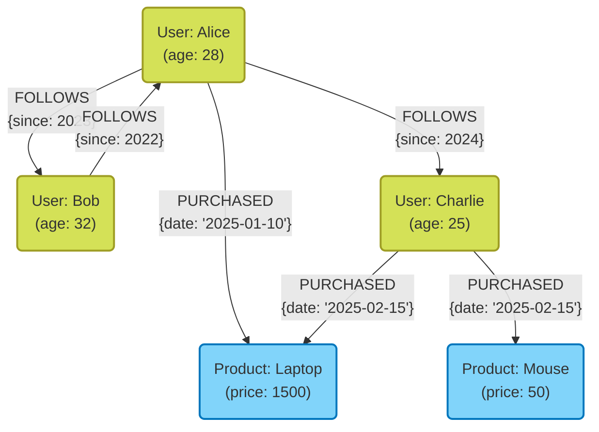

Dans le développement de systèmes modernes, le choix d'une base de données comme moyen de stockage et de gestion des données revêt une importance capitale. Autrefois, l'ère était dominée par les bases de données relationnelles (SGBDR), mais aujourd'hui, avec la diversification et l'augmentation massive du volume des données, les bases de données **NoSQL** (Not Only SQL) ont pris un rôle majeur.

Les bases de données NoSQL ne sont pas une technologie unique, mais un terme générique pour divers modèles de données optimisés pour des cas d'usage spécifiques. Dans cet article, après avoir clarifié les différences fondamentales entre les SGBDR et le NoSQL, nous expliquerons de manière détaillée et exhaustive les caractéristiques, les avantages, les inconvénients et les cas d'usage appropriés pour les quatre modèles de données NoSQL représentatifs : **Type Clé-Valeur (KVS)**, **Orienté Document**, **Graphe**, et **Colonnes larges (Wide-column)**.

---

## 1. Qu'est-ce que le NoSQL ? Comprendre en profondeur les différences avec les SGBDR

Pour choisir correctement une base de données NoSQL, il faut d'abord comprendre clairement les différences avec les bases de données relationnelles (SGBDR) traditionnelles. Les SGBDR (MySQL, PostgreSQL, Oracle, etc.) sont au cœur des systèmes d'entreprise depuis de nombreuses années. Elles excellent dans la garantie stricte de la cohérence des données (propriétés [ACID](https://kenji.blog/fr/p/rdbms-transaction-acid-isolation-level-lock/)) et dans le support de requêtes flexibles via SQL, y compris les jointures de tables complexes (JOIN).

Cependant, avec le développement à grande échelle des services web et l'augmentation rapide des données non structurées, les défis difficiles à relever avec l'architecture SGBDR ont été mis en évidence. C'est là qu'intervient le NoSQL. Les principales différences entre NoSQL et SGBDR sont les suivantes.

### Sans schéma et flexibilité de la structure des données

Les SGBDR nécessitent la définition préalable d'un schéma strict (noms de colonnes de table et types de données). Modifier un schéma une fois défini a un coût et peut compromettre l'agilité du développement.
En revanche, de nombreuses bases de données NoSQL adoptent une approche **sans schéma (schemaless)** ou avec un schéma flexible. Il n'est pas nécessaire de définir complètement la structure des données à l'avance, ce qui permet de modifier dynamiquement la forme des données pour s'adapter aux changements des exigences de l'application. Cette caractéristique se marie très bien avec le développement agile et l'architecture en microservices.

### Scalabilité horizontale (Scale-out)

L'approche fondamentale pour améliorer les performances d'un SGBDR est le **scale-up (scalabilité verticale)**, qui consiste à augmenter le CPU et la mémoire du serveur. Cependant, les performances d'un seul serveur ont des limites physiques et cela devient très coûteux. Bien que certains SGBDR offrent des fonctionnalités de clustering, le maintien de la cohérence des données entre les nœuds et le traitement distribué présentent des obstacles techniques.

Le NoSQL, dès les premières phases de conception, part du principe du **scale-out (scalabilité horizontale)**, qui consiste à aligner plusieurs serveurs (nœuds) peu coûteux pour améliorer la capacité de traitement et la capacité de stockage. Les données sont automatiquement distribuées (sharding) sur plusieurs nœuds, et en cas d'augmentation du volume de données ou du trafic, l'ajout de nœuds suffit pour améliorer le débit global du système.

### Le théorème CAP et les modèles de cohérence

Dans les systèmes distribués, le **théorème CAP** stipule qu'il est impossible de satisfaire simultanément et pleinement les trois propriétés suivantes : Cohérence des données (**C**onsistency), Disponibilité (**A**vailability) et Tolérance au partitionnement (**P**artition Tolerance). Ce théorème est un concept clé dans la conception NoSQL.

Les SGBDR privilégient généralement le « **CA** (Cohérence et Disponibilité) » (en supposant qu'il n'y ait pas de partitionnement du réseau), tandis que la plupart des bases de données NoSQL choisissent un compromis entre « **CP** (Cohérence et Tolérance au partitionnement) » et « **AP** (Disponibilité et Tolérance au partitionnement) ». En particulier dans les environnements distribués à grande échelle, de nombreux systèmes choisissent de sacrifier un peu la cohérence stricte pour prioriser le fait que le système continue toujours à répondre (disponibilité), adoptant ainsi l'approche de la **cohérence à terme (Eventual [Consistency](https://kenji.blog/fr/p/cap-theorem-distributed-systems-tradeoff/))**, qui signifie que les données finiront par concorder.

---

## 2. Type Clé-Valeur (Key-Value Store : KVS)

Le modèle de type Clé-Valeur (KVS) est le modèle de données le plus simple et le plus rapide parmi les bases de données NoSQL. Comme son nom l'indique, il gère les données uniquement avec des paires d'une « Clé (Key) » unique et de la « Valeur (Value) » correspondante.

### Modèle de données et caractéristiques

Le KVS a la même structure qu'un tableau associatif ou un dictionnaire. Le contenu de la valeur est souvent traité par la base de données comme une simple chaîne d'octets ou de caractères (avec quelques exceptions), et il est fondamentalement impossible de lancer des requêtes en interprétant sa structure interne. L'accès aux données se limite à la simple opération d'« obtenir, mettre à jour ou supprimer une valeur en spécifiant une clé ».

Cette extrême simplicité est ce qui crée **les performances impressionnantes** qui sont la plus grande arme des KVS. Étant donné que l'analyse de requêtes complexes et les opérations JOIN ne sont pas nécessaires, la lecture et l'écriture des données peuvent s'effectuer avec une latence ultra-faible de l'ordre de la milliseconde à la microseconde. De plus, les données étant indépendantes, leur distribution sur plusieurs nœuds (sharding) est extrêmement facile.

### Bases de données KVS représentatives

- **Redis** : Le KVS en mémoire (in-memory) le plus célèbre. C'est un KVS avancé qui prend en charge non seulement de simples chaînes, mais aussi diverses structures de données telles que des listes, des ensembles et des hachages, ainsi qu'une fonction pub/sub.
- **Memcached** : Un système de cache en mémoire distribué, extrêmement simple et rapide.
- **Amazon DynamoDB** : Un KVS entièrement géré (entièrement managé) offrant une scalabilité élevée (il possède également des aspects de colonnes larges et de documents).

### Avantages et Inconvénients

**Avantages :**
- **Vitesse de traitement ultra-rapide** : Grâce à sa structure simple, les surcoûts d'E/S disque et de manipulation de la mémoire sont minimisés.
- **Scalabilité élevée** : Étant donné qu'il est facile de répartir les données en fonction de la clé, un scale-out presque infini est possible.

**Inconvénients :**
- **Requêtes complexes impossibles** : Il n'est pas adapté aux recherches basées sur le contenu de la valeur (par exemple : « Trouver les utilisateurs âgés de 20 ans et plus ») ni à l'agrégation de données.
- **Difficulté à exprimer les relations entre les données** : N'ayant pas de fonction pour créer des relations, l'application doit gérer elle-même ces relations.

### Cas d'usage

Le KVS est idéal pour les scénarios où l'on peut extraire une valeur de manière unique à partir d'une clé et où une grande vitesse est requise.

- **Gestion de sessions** : Stocker les informations de session utilisateur des applications Web. La clé est l'ID de session et la valeur représente les données de session.
- **Couche de cache** : Sauvegarder temporairement les résultats de requêtes vers des SGBDR ou les résultats de traitements coûteux en calcul, afin d'améliorer la vitesse de réponse.
- **Tableau de classement en temps réel** : (Particulièrement en utilisant la fonction d'ensembles triés de Redis) Agréger et afficher des classements de jeux en temps réel.
- **Paramètres et profils utilisateurs** : Utiliser l'ID utilisateur comme clé pour stocker des paramètres individuels (comme du JSON) en tant que valeur.

### Exemple de code Redis

Voici un exemple d'opérations de base de type clé-valeur avec Redis (commandes CLI).

```text
# Définir et obtenir une simple chaîne de caractères
> SET user:1001:name "Taro Yamada"
OK
> GET user:1001:name
"Taro Yamada"

# Définir avec une durée de vie (TTL) utilisable pour les sessions (3600 secondes = 1 heure)
> SETEX session:abcdef123456 3600 "session_data_json_here"
OK

# Gestion des informations utilisateur à l'aide du type hachage
> HSET user:1002 name "Hanako" age 28 city "Tokyo"
(integer) 3
> HGET user:1002 age
"28"
> HGETALL user:1002
1) "name"
2) "Hanako"
3) "age"
4) "28"
5) "city"
6) "Tokyo"
```

---

## 3. Base de données orientée document

Les bases de données orientées document sont un modèle de données qui conserve la flexibilité des KVS tout en offrant des structures de données plus complexes et des capacités de requête avancées.

### Modèle de données et caractéristiques

Elles stockent les données sous forme d'unités appelées « documents ». Les documents sont principalement des structures de données hiérarchiques exprimées au format **JSON (JavaScript Object Notation)**, BSON (Binary JSON) ou XML.

Contrairement aux KVS, les bases de données de documents comprennent la structure interne de la valeur (le document). Par conséquent, il est possible de créer des index sur des champs imbriqués dans les documents et d'effectuer des recherches et des agrégations en spécifiant des conditions.
De plus, contrairement aux SGBDR qui séparent (normalisent) les données liées dans différentes tables, les bases de données de documents favorisent la conception consistant à rassembler (dénormaliser / imbriquer) les données liées dans un seul document. Cela permet de récupérer toutes les données nécessaires en une seule requête.

### Bases de données de documents représentatives

- **MongoDB** : Le standard de fait des bases de données orientées document. Dispose d'un langage de requête puissant, d'index flexibles et d'une grande scalabilité.
- **Firestore / Firebase Realtime Database** : Une base de données orientée document fournie par Google Cloud, robuste en matière de synchronisation en temps réel.
- **Couchbase** : Une base de données distribuée combinant la rapidité du KVS et les capacités de requête d'une base de données orientée document.
- **Amazon DocumentDB** : Un service entièrement géré (entièrement managé) compatible avec MongoDB.

### Avantages et Inconvénients

**Avantages :**
- **Flexibilité sans schéma** : Chaque document peut avoir une structure différente, facilitant l'enregistrement des objets de l'application tels quels.
- **Fonctionnalités de requêtes puissantes** : Permet la recherche, l'agrégation et le tri sur les champs internes.
- **Grande efficacité de développement** : Ne nécessite pas de mapping ORM complexe, avec une très grande affinité pour les API basées sur JSON.

**Inconvénients :**
- **Limites pour les transactions complexes** : Les mises à jour couvrant plusieurs documents impliquent un surcoût (overhead) plus important que dans les SGBDR (bien que MongoDB, par exemple, supporte les transactions multi-documents ces dernières années, leur usage intensif n'est pas recommandé).
- **Gonflement de la taille des données** : Le modèle sans schéma entraîne l'enregistrement répété des noms de champs, et la dénormalisation entraîne une duplication des données, ce qui a tendance à augmenter la taille des données.

### Cas d'usage

Le modèle orienté document est adapté lorsque la structure des données change fréquemment ou lorsque vous souhaitez enregistrer des structures de données complexes telles quelles.

- **Systèmes de gestion de contenu (CMS)** : Gérer de manière flexible des contenus de structures différentes tels que des articles, des auteurs, des balises, des commentaires, etc.
- **Catalogues de produits et gestion des stocks** : Idéal pour les modèles de données où les attributs nécessaires (spécifications) varient considérablement selon la catégorie de produit (électroménager, vêtements, alimentation, etc.).
- **Profils utilisateurs et paramètres** : Gérer les éléments de configuration ou les attributs spécifiques à chaque utilisateur dans un seul document.
- **Stockage de journaux et de données d'événements** : Stocker sous forme de JSON les données de logs aux formats divers générées par l'application, pour les rechercher et les analyser ultérieurement.

### Exemple de code MongoDB

Voici un exemple d'insertion de documents et de requêtes dans MongoDB (style mongosh ou pilote Node.js).

```javascript
// Insertion de document (imbrication de données liées comme les contacts ou les loisirs sous forme de tableaux ou d'objets)
db.users.insertOne({
  user_id: "u123",
  name: "Kenji",
  age: 30,
  contact: {
    email: "kenji@example.com",
    phone: "090-1234-5678"
  },
  interests: ["NoSQL", "Cloud", "Photography"],
  status: "active"
});

// Exemple de requête 1 : Rechercher les utilisateurs dont le status est "active" et l'âge est de 25 ans ou plus
db.users.find({
  status: "active",
  age: { $gte: 25 }
});

// Exemple de requête 2 : Rechercher les utilisateurs dont le tableau interests contient "NoSQL"
db.users.find({
  interests: "NoSQL"
});

// Recherche sur des champs imbriqués (en utilisant la notation par points)
db.users.find({
  "contact.email": "kenji@example.com"
});
```

---

## 4. Base de données orientée graphe

Les bases de données orientées graphe sont des bases de données spécialisées conçues pour donner plus d'importance aux « **relations (connexions) entre les données** » qu'aux données elles-mêmes. Bien que le terme « relationnel » dans SGBDR soit supposé traiter les relations entre les tables, cela a un coût, tandis que les bases de données orientées graphe traitent littéralement les relations comme des objets de première classe.

### Modèle de données et caractéristiques

Les bases de données orientées graphe adoptent un modèle de données basé sur la « théorie des graphes » mathématique. Les trois principaux éléments composant les données sont :

1. **Nœud (Node / Vertex)** : Les entités de données (ex : personne, entreprise, produit). Équivalent à une ligne dans un SGBDR.
2. **Arête (Edge / Relationship)** : Les relations entre les nœuds (ex : est ami avec, a acheté, appartient à). Les arêtes peuvent avoir une direction.
3. **Propriété (Property)** : Les informations d'attribut sous forme de clé-valeur attachées aux nœuds ou aux arêtes (ex : le « nom » d'une personne, la « date de début » d'une relation).

Dans un SGBDR, parcourir des relations complexes nécessite de multiples JOIN, et les performances se dégradent rapidement avec la profondeur de la hiérarchie. Cependant, dans une base de données de graphes, l'opération de parcours des nœuds via les arêtes (traversal) s'effectue extrêmement rapidement au niveau des déplacements de pointeurs, permettant d'explorer instantanément des dizaines de milliers, voire des millions de relations.

### Illustration du modèle de graphe avec Mermaid

Voici un diagramme conceptuel d'une base de données de graphes modélisant les relations entre utilisateurs sur un réseau social et leur historique d'achats.



### Bases de données de graphes représentatives

- **Neo4j** : La base de données de graphes la plus utilisée au monde. Elle adopte Cypher, son propre langage de requête puissant.
- **Amazon Neptune** : Une base de données de graphes entièrement gérée par AWS. Supporte Property Graph (Gremlin) et RDF (SPARQL).
- **ArangoDB** : Une base de données multi-modèles supportant les graphes, les documents et KVS.

### Avantages et Inconvénients

**Avantages :**
- **Exploration ultra-rapide des relations profondément hiérarchisées** : Capable de traiter des requêtes relationnelles complexes comme « Les produits achetés par les amis des amis de mes amis » en quelques millisecondes.
- **Modélisation intuitive des données** : Les diagrammes conceptuels dessinés sur un tableau blanc peuvent être implémentés tels quels comme schéma de la base de données.

**Inconvénients :**
- **Inadapté au balayage complet (full scan) d'une seule entité** : Les traitements d'agrégation simples (par exemple, « calculer l'âge moyen de tous les utilisateurs ») sont souvent plus rapides dans un SGBDR ou un modèle orienté document.
- **Difficulté du traitement distribué** : Les graphes étant des données étroitement couplées, la division (sharding) des données sur plusieurs nœuds entraîne des parcours inter-nœuds, ce qui a tendance à dégrader les performances.

### Cas d'usage

Indispensable pour les systèmes où les connexions entre les données ont de la valeur en elles-mêmes et où il est nécessaire d'explorer et d'analyser ces relations en profondeur.

- **SNS (Réseaux sociaux)** : Gestion des relations d'amitié et des relations abonné/abonnement (followers/following).
- **Moteur de recommandation** : Proposer en temps réel des produits tels que « Les produits achetés par des utilisateurs ayant les mêmes tendances d'achat que vous ».
- **Détection de fraude (Fraud Detection)** : Visualiser les corrélations entre des adresses IP suspectes, des cartes de crédit et des comptes sous forme de graphe pour identifier les réseaux de fraudeurs.
- **Gestion de réseau et d'infrastructure informatique** : Gérer les dépendances entre les serveurs et les routeurs pour identifier instantanément la portée de l'impact en cas de panne.

### Exemple de code Neo4j (Requête Cypher)

Voici un exemple du langage de requête Cypher pour insérer des données et rechercher des relations dans Neo4j. La particularité de Cypher est qu'il permet d'exprimer les relations à la manière de l'art ASCII.

```cypher
// Création de nœuds et de relations
CREATE (alice:User {name: 'Alice', age: 28})
CREATE (bob:User {name: 'Bob', age: 32})
CREATE (laptop:Product {name: 'Laptop', price: 1500})
// Création d'arêtes
CREATE (alice)-[:FOLLOWS {since: 2023}]->(bob)
CREATE (alice)-[:PURCHASED {date: '2025-01-10'}]->(laptop);

// Exemple de requête 1 : Rechercher les utilisateurs suivis par Alice
MATCH (u:User {name: 'Alice'})-[:FOLLOWS]->(follower)
RETURN follower.name;

// Exemple de requête 2 : Recommandation (Rechercher les produits achetés par les personnes qu'Alice suit)
MATCH (alice:User {name: 'Alice'})-[:FOLLOWS]->(friend)-[:PURCHASED]->(product)
// Des conditions peuvent être ajoutées, par exemple pour exclure ce que l'on a déjà acheté
RETURN product.name, count(product) AS purchaseCount
ORDER BY purchaseCount DESC;
```

---

## 5. Modèle à colonnes larges (Wide-column Store)

Les bases de données à colonnes larges (ou magasins de familles de colonnes) sont un modèle de données spécialisé pour la lecture et l'écriture à grande vitesse en distribuant des quantités massives de données sur plusieurs nœuds. Elles sont nées sous l'influence du document de recherche sur Bigtable de Google.

### Modèle de données et caractéristiques

Elles ressemblent à la structure de tableau composée de lignes et de colonnes des SGBDR, mais leur façon interne de conserver les données est très différente. La structure des données d'un Wide-column store se compose principalement des éléments suivants :

1. **Row Key (Clé de ligne)** : Clé identifiant une ligne de manière unique. Les données sont distribuées sur les nœuds en fonction de cette clé.
2. **Column Family (Famille de colonnes)** : Groupe de colonnes liées. Similaire à une table dans un SGBDR, mais les colonnes peuvent différer pour chaque ligne.
3. **Column (Colonne)** : Ensemble comprenant « Nom de colonne (Key) », « Valeur (Value) » et « Horodatage (Timestamp) ».

La plus grande caractéristique est que **le nombre et le type de colonnes peuvent différer d'une ligne à l'autre (sans schéma)** et qu'**il est possible d'avoir des lignes géantes (larges) contenant des millions de colonnes**.
De plus, en adoptant des architectures telles que les arbres LSM (Log-Structured Merge-tree), les opérations d'écriture sur le disque (Write) s'effectuent de manière extrêmement rapide et séquentielle, ce qui leur confère un avantage écrasant pour l'enregistrement continu de données massives.

### Illustration du modèle à colonnes larges avec Mermaid

Voici une représentation de la structure logique des données d'un Wide-column store enregistrant des données de capteurs (IoT). Chaque ligne peut stocker un nombre arbitraire de colonnes.

```mermaid
erDiagram
    %% Structure des données du Wide Column Store
    ROW_KEY {
        string "Row Key (Partition Key)"
    }
    
    COLUMN_FAMILY_1 {
        string "Column 1 (Name:Value:Timestamp)"
        string "Column 2 (Name:Value:Timestamp)"
        string "Column n..."
    }
    
    COLUMN_FAMILY_2 {
        string "Column A (Name:Value:Timestamp)"
        string "Column B (Name:Value:Timestamp)"
    }
    
    ROW_KEY ||--o{ COLUMN_FAMILY_1 : "contains"
    ROW_KEY ||--o{ COLUMN_FAMILY_2 : "contains"

    %% Remarque : Chaque ligne réelle peut stocker un nombre dynamique et énorme de colonnes dans une famille de colonnes (par exemple, en utilisant l'horodatage du capteur comme nom de colonne).
```

### Bases de données à colonnes larges représentatives

- **Apache Cassandra** : Développée par Facebook, elle possède une haute disponibilité et scalabilité, avec une architecture distribuée sans maître (masterless).
- **Apache HBase** : Fonctionne comme une partie de l'écosystème Hadoop et constitue un immense Wide-column store construit sur HDFS.
- **ScyllaDB** : Compatible avec Cassandra, mais réécrite en C++, elle offre un débit exceptionnellement élevé.
- **Google Cloud Bigtable** : Le service entièrement géré qui est à l'origine du Wide-column store.

### Avantages et Inconvénients

**Avantages :**
- **Débit d'écriture incroyablement élevé** : Permet d'effectuer des millions d'écritures par seconde sur un cluster composé de milliers, voire de dizaines de milliers de serveurs.
- **Aucun point de défaillance unique (SPOF)** : Dans les architectures sans maître comme Cassandra, le fonctionnement de l'ensemble du système continue même si un nœud tombe en panne.
- **Distribution géographique (multi-datacenter)** : Excellente pour la réplication de données en temps réel sur plusieurs centres de données.

**Inconvénients :**
- **Impossibilité de requêtes flexibles** : Étant donné que les données sont physiquement placées selon la Row Key (et la clé de clustering), les recherches ou JOIN utilisant des colonnes autres que la clé sont fondamentalement impossibles (ou excessivement lents). Une « modélisation pilotée par les requêtes », concevant les tables selon les modèles d'accès, est essentielle.
- **Courbe d'apprentissage** : Nécessite de changer de mode de pensée par rapport à la modélisation normalisée des SGBDR, rendant la modélisation des données difficile.

### Cas d'usage

Idéal pour les systèmes à très grande échelle centrés sur l'écriture massive de données basées sur des clés spécifiques et la lecture ciblée.

- **Données de capteurs IoT / Données de séries chronologiques** : Enregistrer en continu les données de mesure envoyées chaque seconde par des millions d'appareils, à l'aide de l'ID de l'appareil (Row Key) et de l'heure (nom de colonne).
- **Collecte et analyse de journaux à grande échelle** : Stockage de données de type ajout seul (Append-Only), telles que le clickstream des sites web et les logs d'accès aux systèmes.
- **Gestion de l'historique de messagerie** : Sauvegarde des historiques de messages massifs pour les applications de chat (comme Discord).
- **Magasin de caractéristiques (Feature store) pour la personnalisation/recommandation** : Lire rapidement l'activité passée d'un utilisateur et la transmettre aux modèles de machine learning.

---

## 6. L'option des bases de données multi-modèles

Récemment, les **bases de données multi-modèles**, qui intègrent et fournissent plusieurs modèles NoSQL et fonctionnalités SGBDR au sein d'un seul moteur de base de données, attirent également l'attention.

Par exemple, PostgreSQL possède des fonctionnalités en tant que type orienté document grâce à son puissant support du type JSONB. Il existe également des produits comme Azure Cosmos DB ou ArangoDB, capables de gérer de manière transparente les KVS, les documents et les graphes avec un seul backend. Cela permet de réduire les coûts d'exploitation (et la complexité de la persistance polyglotte) liés à la gestion de multiples systèmes de bases de données dans un projet, tout en permettant un accès flexible aux données adapté aux besoins.

---

## 7. Conclusion : Le meilleur choix selon le cas d'usage

Comme nous l'avons vu, il n'y a pas de « solution miracle » en NoSQL. Le choix du bon modèle de données selon les exigences de votre projet est la clé du succès. Enfin, voici un bref résumé des lignes directrices pour faire le bon choix.

1. **Avez-vous besoin de lectures/écritures simples et ultra-rapides, comme pour la gestion de sessions ou le cache ?**
   👉 Choisissez le **Type Clé-Valeur (Redis, Memcached)**.
2. **La structure de vos données change-t-elle fréquemment, et souhaitez-vous stocker/rechercher des données JSON complexes telles quelles ?**
   👉 Choisissez le **Type orienté document (MongoDB, Firestore)**.
3. **Souhaitez-vous explorer et analyser instantanément des relations complexes entre vos données (ex. "les amis des amis" ou "itinéraires recommandés") ?**
   👉 Choisissez le **Type orienté graphe (Neo4j)**.
4. **Voulez-vous écrire des dizaines de milliers de logs ou de données IoT par seconde et scaler à l'infini ?**
   👉 Choisissez le **Type à colonnes larges (Cassandra, Bigtable)**.
5. **Avez-vous impérativement besoin d'une cohérence stricte des données, de transactions complexes et d'agrégations diverses (JOIN) ?**
   👉 Ne forcez pas l'utilisation du NoSQL, choisissez simplement un **SGBDR (PostgreSQL, MySQL)**.

Dans les architectures modernes à grande échelle, la **persistance polyglotte** est courante : on ne stocke pas toutes les données dans une seule base de données, on adopte la base de données la plus adaptée pour chaque microservice.
En comprenant profondément les forces et les faiblesses de chaque modèle de données, ainsi que leurs différences fondamentales avec les SGBDR, vous serez en mesure de concevoir la base de données optimale, maximisant les performances, la scalabilité et la disponibilité de votre système.
