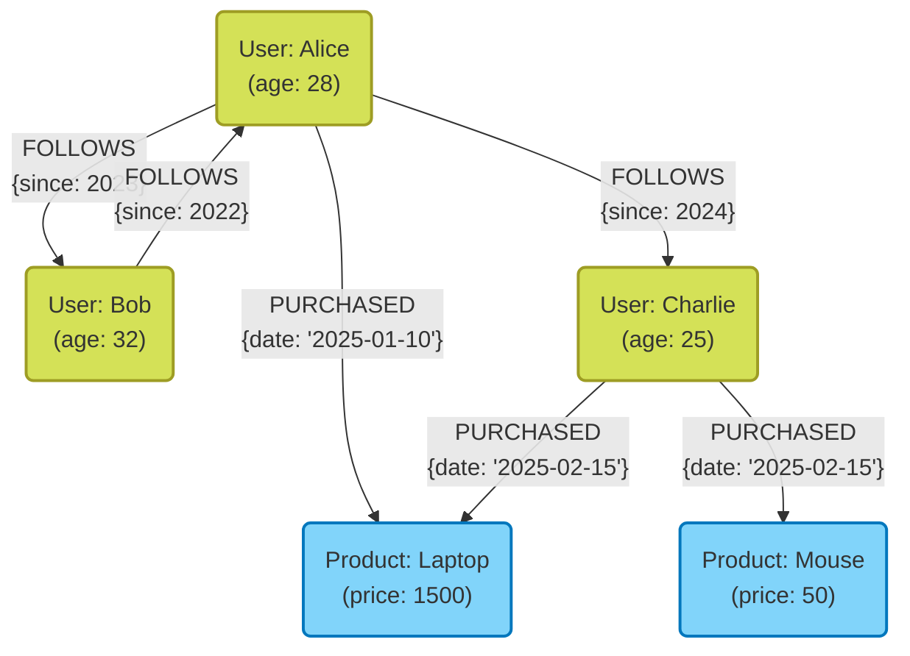

आधुनिक सिस्टम विकास में, डेटा के भंडारण और प्रबंधन के साधन के रूप में डेटाबेस का चयन अत्यंत महत्वपूर्ण है। एक समय था जब रिलेशनल डेटाबेस ([RDBMS](https://kenji.blog/hi/p/rdbms-transaction-acid-isolation-level-lock/)) का दबदबा था, लेकिन आज डेटा के विविधीकरण और डेटा की मात्रा में वृद्धि के साथ, **NoSQL** (Not Only SQL) डेटाबेस महत्वपूर्ण भूमिका निभा रहे हैं।

NoSQL डेटाबेस कोई एक तकनीक नहीं है, बल्कि यह विशिष्ट उपयोग के मामलों (use cases) के लिए अनुकूलित विभिन्न डेटा मॉडलों के लिए एक सामान्य शब्द है। इस लेख में, हम RDBMS और NoSQL के बीच के महत्वपूर्ण अंतरों को स्पष्ट करने के बाद, चार प्रमुख NoSQL डेटा मॉडलों: **की-वैल्यू (KVS)** , **दस्तावेज़-उन्मुख (Document)** , **ग्राफ़ ([Graph](https://kenji.blog/hi/p/tree-graph-data-structures-search-dfs-bfs-dijkstra/))** , और **वाइड-कॉलम (Wide-column)** की विशेषताओं, फायदे और नुकसान, और उपयुक्त उपयोग के मामलों पर विस्तार से और व्यापक रूप से चर्चा करेंगे।

---

## 1. NoSQL क्या है? RDBMS के साथ अंतर को गहराई से समझें

NoSQL को ठीक से चुनने के लिए, सबसे पहले पारंपरिक रिलेशनल डेटाबेस (RDBMS) के साथ इसके अंतर को स्पष्ट रूप से समझना आवश्यक है। RDBMS (जैसे MySQL, PostgreSQL, Oracle, आदि) ने लंबे समय से एंटरप्राइज़ सिस्टम में केंद्रीय भूमिका निभाई है। ये डेटा की स्थिरता ([ACID](https://kenji.blog/hi/p/rdbms-transaction-acid-isolation-level-lock/) गुण) की सख्ती से गारंटी देने और जटिल टेबल जॉइन (JOIN) या SQL के माध्यम से लचीली क्वेरी का समर्थन करने में उत्कृष्ट हैं।

हालाँकि, वेब सेवाओं के बड़े पैमाने पर बढ़ने और असंरचित डेटा में तेजी से वृद्धि के साथ, ऐसी चुनौतियाँ सामने आई हैं जिन्हें RDBMS आर्किटेक्चर के साथ संभालना मुश्किल है। यहीं पर NoSQL दृश्य में आता है। NoSQL और RDBMS के बीच मुख्य अंतर निम्नलिखित हैं:

### स्कीमालेस और डेटा संरचना का लचीलापन

RDBMS में, एक सख्त स्कीमा (टेबल कॉलम नाम और डेटा प्रकार) को पहले से परिभाषित करना आवश्यक है। एक बार परिभाषित स्कीमा को बदलने में लागत लग सकती है, और विकास की गति (agility) कम हो सकती है।
दूसरी ओर, कई NoSQL डेटाबेस **स्कीमालेस** या लचीले स्कीमा दृष्टिकोण को अपनाते हैं। डेटा संरचना को पहले से पूरी तरह से परिभाषित करने की आवश्यकता नहीं होती है, और आप एप्लिकेशन की आवश्यकताओं में बदलाव के अनुसार गतिशील रूप से डेटा का आकार बदल सकते हैं। यह विशेषता एजाइल विकास और माइक्रोसर्विसेज आर्किटेक्चर के लिए बहुत अनुकूल है।

### क्षैतिज स्केलेबिलिटी (स्केल-आउट)

RDBMS के प्रदर्शन को बेहतर बनाने के लिए बुनियादी दृष्टिकोण सर्वर के CPU या मेमोरी को बढ़ाना है, जिसे **स्केल-अप (लंबवत स्केल)** कहा जाता है। हालाँकि, एकल सर्वर के प्रदर्शन की एक भौतिक सीमा होती है, और यह बहुत महंगा हो जाता है। हालाँकि कुछ RDBMS क्लस्टरिंग सुविधाएँ प्रदान करते हैं, लेकिन नोड्स के पार डेटा स्थिरता बनाए रखने और वितरित प्रसंस्करण (distributed processing) में तकनीकी बाधाएँ हैं।

NoSQL को डिज़ाइन के प्रारंभिक चरण से ही कई सस्ते सर्वरों (नोड्स) को लाइन में लगाकर प्रसंस्करण क्षमता और भंडारण क्षमता को बढ़ाने के लिए **स्केल-आउट (क्षैतिज स्केल)** के आधार पर बनाया गया है। डेटा स्वचालित रूप से कई नोड्स (शार्डिंग) में वितरित किया जाता है, और यदि डेटा की मात्रा या ट्रैफ़िक बढ़ता है, तो आप बस नोड्स जोड़कर पूरे सिस्टम के थ्रूपुट में सुधार कर सकते हैं।

### CAP प्रमेय और स्थिरता मॉडल

वितरित प्रणालियों (distributed systems) में, डेटा की स्थिरता ( **C**onsistency ), उपलब्धता ( **A**vailability ), और विभाजन सहनशीलता ( **P**artition Tolerance ) तीनों को एक ही समय में पूरी तरह से संतुष्ट नहीं किया जा सकता है। यह **CAP प्रमेय** NoSQL डिज़ाइन में एक महत्वपूर्ण अवधारणा है।

RDBMS आमतौर पर " **CA** (स्थिरता और उपलब्धता)" को प्राथमिकता देता है (यह मानते हुए कि कोई नेटवर्क विभाजन नहीं है), लेकिन कई NoSQL डेटाबेस " **CP** (स्थिरता और विभाजन सहनशीलता)" या " **AP** (उपलब्धता और विभाजन सहनशीलता)" के बीच ट्रेड-ऑफ़ चुनते हैं। विशेष रूप से बड़े पैमाने पर वितरित वातावरण में, कई डेटाबेस सख्त स्थिरता का थोड़ा बलिदान देते हैं और सिस्टम के हमेशा प्रतिक्रिया देने (उपलब्धता) को प्राथमिकता देते हैं, यह दृष्टिकोण अपनाते हुए कि अंततः डेटा मेल खाना चाहिए, जिसे **अंतिम स्थिरता (Eventual [Consistency](https://kenji.blog/hi/p/cap-theorem-distributed-systems-tradeoff/))** कहा जाता है।

---

## 2. की-वैल्यू प्रकार (Key-Value Store: KVS)

की-वैल्यू प्रकार (KVS) NoSQL डेटाबेस में सबसे सरल और सबसे तेज़ डेटा मॉडल है। जैसा कि नाम से पता चलता है, यह डेटा को केवल एक अद्वितीय "की (Key)" और उसके संगत "वैल्यू (Value)" की जोड़ी के साथ प्रबंधित करता है।

### डेटा मॉडल और विशेषताएं

KVS की संरचना एसोसिएटिव ऐरे (associative arrays) या डिक्शनरी (dictionaries) के समान है। डेटाबेस की ओर से, वैल्यू की सामग्री को अक्सर केवल बाइट्स या स्ट्रिंग्स के अनुक्रम के रूप में माना जाता है (कुछ अपवादों के साथ), और मूल रूप से आंतरिक संरचना की व्याख्या करके क्वेरी करना संभव नहीं है। डेटा तक पहुंच केवल "की निर्दिष्ट करके वैल्यू प्राप्त करना, अपडेट करना या हटाना" जैसे सरल संचालन तक सीमित है।

यह चरम सादगी KVS का सबसे बड़ा हथियार, **अत्यधिक प्रदर्शन** उत्पन्न करती है। चूँकि किसी जटिल क्वेरी विश्लेषण या JOIN प्रसंस्करण की आवश्यकता नहीं है, इसलिए डेटा को मिलीसेकंड या माइक्रोसेकंड की अल्ट्रा-लो लेटेंसी के साथ पढ़ा और लिखा जा सकता है। इसके अलावा, क्योंकि डेटा स्वतंत्र है, कई नोड्स (शार्डिंग) में वितरण अत्यंत आसान है।

### प्रतिनिधि KVS डेटाबेस

- **Redis** : इन-मेमोरी KVS का एक प्रतिनिधि जो मेमोरी में काम करता है। यह एक उच्च-कार्यक्षमता वाला KVS है जो न केवल सरल स्ट्रिंग्स बल्कि सूचियों (lists), सेट (sets), और हैश (hashes) जैसी विभिन्न डेटा संरचनाओं का समर्थन करता है, और इसमें पब/सब (pub/sub) कार्यक्षमता भी है।
- **Memcached** : एक अत्यंत सरल और तेज़ वितरित मेमोरी कैश सिस्टम।
- **Amazon DynamoDB** : उच्च स्केलेबिलिटी के साथ एक पूरी तरह से प्रबंधित KVS (जिसमें वाइड-कॉलम और दस्तावेज़ के पहलू भी हैं)।

### फायदे और नुकसान

**फायदे:**
- **अति-तेज़ प्रसंस्करण गति** : सरल संरचना के कारण, डिस्क I/O और मेमोरी संचालन का ओवरहेड न्यूनतम है।
- **उच्च स्केलेबिलिटी** : क्योंकि डेटा को कीज़ के आधार पर वितरित करना आसान है, इसलिए लगभग अनंत स्केल-आउट संभव है।

**नुकसान:**
- **जटिल क्वेरी संभव नहीं** : वैल्यू की सामग्री द्वारा खोजना (उदाहरण: "20 वर्ष या उससे अधिक आयु के उपयोगकर्ताओं को खोजना") या डेटा एकत्रीकरण के लिए अनुपयुक्त।
- **डेटा के बीच संबंधों को व्यक्त करने में कठिनाई** : क्योंकि संबंध रखने के लिए कोई कार्यक्षमता नहीं है, एप्लिकेशन पक्ष को संबंधों का प्रबंधन करना चाहिए।

### उपयोग के मामले (Use Cases)

KVS उन परिदृश्यों के लिए आदर्श है जहाँ आप विशिष्ट रूप से किसी की (key) से मूल्य प्राप्त कर सकते हैं और उच्च गति की आवश्यकता होती है।

- **सत्र प्रबंधन (Session Management)** : वेब एप्लिकेशन की उपयोगकर्ता सत्र जानकारी सहेजना। की (key) सत्र आईडी है, और वैल्यू (value) सत्र डेटा है।
- **कैश परत (Cache Layer)** : RDBMS के क्वेरी परिणाम या उच्च कम्प्यूटेशनल लागत वाले प्रसंस्करण परिणामों को अस्थायी रूप से सहेजना और प्रतिक्रिया गति में सुधार करना।
- **रीयल-टाइम लीडरबोर्ड** : (विशेष रूप से Redis के सॉर्ट किए गए सेट फ़ंक्शन का उपयोग करके) वास्तविक समय में गेम रैंकिंग आदि को एकत्र करना और प्रदर्शित करना।
- **उपयोगकर्ता सेटिंग्स और प्रोफ़ाइल** : उपयोगकर्ता आईडी को की (key) के रूप में उपयोग करना और व्यक्तिगत सेटिंग आइटम (जैसे JSON) को वैल्यू (value) के रूप में सहेजना।

### Redis कोड का उदाहरण

Redis का उपयोग करके बुनियादी की-वैल्यू संचालन का एक उदाहरण (CLI कमांड) नीचे दिखाया गया है।

```text
# एक साधारण स्ट्रिंग सेट और गेट करना
> SET user:1001:name "Taro Yamada"
OK
> GET user:1001:name
"Taro Yamada"

# सत्र (session) आदि के लिए समाप्ति समय (TTL) के साथ सेट करना (3600 सेकंड = 1 घंटा)
> SETEX session:abcdef123456 3600 "session_data_json_here"
OK

# हैश प्रकार का उपयोग करके उपयोगकर्ता जानकारी का प्रबंधन
> HSET user:1002 name "Hanako" age 28 city "Tokyo"
(integer) 3
> HGET user:1002 age
"28"
> HGETALL user:1002
1) "name"
2) "Hanako"
3) "age"
4) "28"
5) "city"
6) "Tokyo"
```

---

## 3. दस्तावेज़-उन्मुख प्रकार (Document-Oriented Database)

दस्तावेज़-उन्मुख डेटाबेस एक ऐसा डेटा मॉडल है जो KVS का लचीलापन बनाए रखते हुए अधिक जटिल डेटा संरचनाओं और उन्नत क्वेरी क्षमताओं को प्रदान करता है।

### डेटा मॉडल और विशेषताएं

डेटा को "दस्तावेज़ (documents)" नामक इकाइयों में संग्रहीत किया जाता है। दस्तावेज़ वास्तव में पदानुक्रमित डेटा संरचनाएं हैं जो मुख्य रूप से **JSON (JavaScript Object Notation)** , BSON (Binary JSON), या XML प्रारूपों में व्यक्त की जाती हैं।

KVS के विपरीत, दस्तावेज़ डेटाबेस वैल्यू (दस्तावेज़) की आंतरिक संरचना को समझते हैं। इसलिए, दस्तावेज़ के भीतर नेस्टेड फ़ील्ड पर अनुक्रमणिका (index) बनाना, या शर्तें निर्दिष्ट करके खोजना और एकत्र करना संभव है।
इसके अलावा, [RDBMS](https://kenji.blog/hi/p/rdbms-transaction-acid-isolation-level-lock/) के विपरीत जो संबंधित डेटा को अलग-अलग टेबलों (सामान्यीकरण/normalization) में विभाजित करता है, दस्तावेज़ डेटाबेस एक ही दस्तावेज़ (गैर-सामान्यीकरण/एम्बेडिंग) में संबंधित डेटा को संयोजित करने वाले डिज़ाइन को प्राथमिकता देते हैं। यह आपको एक ही क्वेरी में सभी आवश्यक डेटा प्राप्त करने की अनुमति देता है।

### प्रतिनिधि दस्तावेज़ प्रकार डेटाबेस

- **MongoDB** : दस्तावेज़-उन्मुख डेटाबेस का डी फैक्टो मानक (de facto standard)। इसमें एक शक्तिशाली क्वेरी भाषा, लचीले इंडेक्स और उच्च स्केलेबिलिटी है।
- **Firestore / Firebase Realtime Database** : Google Cloud द्वारा प्रदान किया गया एक दस्तावेज़-प्रकार का डेटाबेस जो रीयल-टाइम सिंक्रोनाइज़ेशन में मजबूत है।
- **Couchbase** : एक वितरित डेटाबेस जो KVS की उच्च गति और दस्तावेज़ डेटाबेस की क्वेरी क्षमता को जोड़ता है।
- **Amazon DocumentDB** : एक पूरी तरह से प्रबंधित सेवा जो MongoDB के अनुकूल है।

### फायदे और नुकसान

**फायदे:**
- **स्कीमालेस लचीलापन** : प्रत्येक दस्तावेज़ की एक अलग संरचना हो सकती है, जिससे एप्लिकेशन ऑब्जेक्ट्स को वैसे ही सहेजना आसान हो जाता है।
- **शक्तिशाली क्वेरी क्षमताएं** : आंतरिक फ़ील्ड द्वारा खोजना, एकत्र करना (aggregation) और सॉर्ट करना संभव है।
- **उच्च विकास दक्षता** : ORM की जटिल मैपिंग की आवश्यकता नहीं है, और JSON-आधारित API के साथ इसकी आत्मीयता बहुत अधिक है।

**नुकसान:**
- **जटिल लेन-देन ([Transaction](https://kenji.blog/hi/p/rdbms-transaction-acid-isolation-level-lock/)s) की सीमाएं** : कई दस्तावेज़ों में अपडेट करने में RDBMS की तुलना में अधिक ओवरहेड होता है (यद्यपि MongoDB जैसे डेटाबेस ने हाल ही में मल्टी-डॉक्यूमेंट ट्रांजेक्शन का समर्थन करना शुरू कर दिया है, फिर भी इसके अत्यधिक उपयोग की अनुशंसा नहीं की जाती है)।
- **डेटा आकार में वृद्धि** : स्कीमालेस प्रकृति के कारण फ़ील्ड नामों का दोहराव भंडारण, और गैर-सामान्यीकरण के कारण डेटा के दोहराव से डेटा का आकार बड़ा हो सकता है।

### उपयोग के मामले (Use Cases)

दस्तावेज़-उन्मुख प्रकार उन मामलों के लिए उपयुक्त है जहाँ डेटा संरचना अक्सर बदलती है, या जब आप जटिल डेटा संरचनाओं को वैसे ही सहेजना चाहते हैं।

- **सामग्री प्रबंधन प्रणाली (CMS)** : लेख, लेखक, टैग, टिप्पणियाँ आदि जैसी विभिन्न संरचनाओं वाली सामग्री का लचीला प्रबंधन।
- **उत्पाद कैटलॉग और इन्वेंटरी प्रबंधन** : ऐसे डेटा मॉडल के लिए आदर्श जहाँ आवश्यक विशेषताएँ (विशिष्ट जानकारी) उत्पाद श्रेणी जैसे घरेलू उपकरण, कपड़े, भोजन आदि के आधार पर बहुत भिन्न होती हैं।
- **उपयोगकर्ता प्रोफ़ाइल और सेटिंग्स** : प्रत्येक उपयोगकर्ता के लिए अलग-अलग कस्टम सेटिंग आइटम या विशेषता जानकारी को एकल दस्तावेज़ के रूप में प्रबंधित करना।
- **लॉग और इवेंट डेटा का भंडारण** : एप्लिकेशन द्वारा उत्पन्न विभिन्न प्रारूपों में लॉग डेटा को वैसे ही JSON के रूप में सहेजना और बाद में खोजना/विश्लेषण करना।

### MongoDB कोड का उदाहरण

MongoDB में दस्तावेज़ डालने और क्वेरी करने का एक उदाहरण (mongosh या Node.js ड्राइवर शैली) नीचे दिखाया गया है।

```javascript
// दस्तावेज़ सम्मिलित करना (संबंधित डेटा जैसे संपर्क और रुचियों को सरणी या नेस्टेड ऑब्जेक्ट के रूप में एम्बेड करना)
db.users.insertOne({
  user_id: "u123",
  name: "Kenji",
  age: 30,
  contact: {
    email: "kenji@example.com",
    phone: "090-1234-5678"
  },
  interests: ["NoSQL", "Cloud", "Photography"],
  status: "active"
});

// क्वेरी उदाहरण 1: उन उपयोगकर्ताओं को खोजें जिनका status "active" है और age 25 या अधिक है
db.users.find({
  status: "active",
  age: { $gte: 25 }
});

// क्वेरी उदाहरण 2: उन उपयोगकर्ताओं को खोजें जिनकी interests सरणी में "NoSQL" शामिल है
db.users.find({
  interests: "NoSQL"
});

// नेस्टेड फ़ील्ड में खोजना (डॉट नोटेशन का उपयोग करके)
db.users.find({
  "contact.email": "kenji@example.com"
});
```

---

## 4. ग्राफ़ डेटाबेस

ग्राफ़ डेटाबेस विशेष डेटाबेस हैं जिन्हें डेटा की तुलना में " **डेटा के बीच संबंधों (कड़ी)** " पर अधिक जोर देने के लिए डिज़ाइन किया गया है। [RDBMS](https://kenji.blog/hi/p/rdbms-transaction-acid-isolation-level-lock/) में "रिलेशनल" का वास्तव में टेबलों के बीच संबंधों को संभालने में उच्च लागत होती है, लेकिन ग्राफ़ डेटाबेस सचमुच संबंधों को प्रथम श्रेणी के ऑब्जेक्ट के रूप में मानते हैं।

### डेटा मॉडल और विशेषताएं

ग्राफ़ डेटाबेस गणित में "ग्राफ़ सिद्धांत ([Graph](https://kenji.blog/hi/p/tree-graph-data-structures-search-dfs-bfs-dijkstra/) Theory)" के आधार पर एक डेटा मॉडल अपनाते हैं। डेटा बनाने वाले मुख्य तत्व निम्नलिखित तीन हैं:

1. **नोड (Node / Vertex)** : डेटा संस्थाएं (उदाहरण: लोग, कंपनियां, उत्पाद आदि)। यह RDBMS में एक पंक्ति (row) के बराबर है।
2. **किनारे (Edge / Relationship)** : नोड्स के बीच संबंध (उदाहरण: दोस्त हैं, खरीदा, के अंतर्गत आता है आदि)। किनारों की एक दिशा हो सकती है।
3. **गुण (Property)** : नोड्स या किनारों से जुड़ी की-वैल्यू प्रारूप विशेषता जानकारी (उदाहरण: किसी व्यक्ति का "नाम", संबंध की "आरंभ तिथि" आदि)।

RDBMS में जटिल संबंधों का पता लगाने के लिए कई JOINs की आवश्यकता होती है, और जैसे-जैसे पदानुक्रम गहरा होता है, प्रदर्शन तेजी से गिरता है। हालाँकि, ग्राफ़ डेटाबेस में, नोड से किनारे तक जाने का कार्य (traversal) पॉइंटर मूवमेंट के स्तर पर अत्यंत उच्च गति से किया जाता है, जिससे हजारों या लाखों संबंधों को तुरंत खोजना संभव हो जाता है।

### Mermaid के माध्यम से ग्राफ़ मॉडल का आरेख

नीचे एक ग्राफ़ डेटाबेस का वैचारिक आरेख (conceptual diagram) है जो SNS पर उपयोगकर्ताओं के बीच संबंधों और उत्पादों के खरीद इतिहास को मॉडल करता है।



### प्रतिनिधि ग्राफ़ डेटाबेस

- **Neo4j** : दुनिया में सबसे व्यापक रूप से इस्तेमाल किया जाने वाला ग्राफ़ डेटाबेस। यह अपनी स्वयं की शक्तिशाली क्वेरी भाषा Cypher का उपयोग करता है।
- **Amazon Neptune** : AWS द्वारा प्रदान किया गया एक पूरी तरह से प्रबंधित ग्राफ़ डेटाबेस। प्रॉपर्टी ग्राफ़ (Gremlin) और RDF (SPARQL) का समर्थन करता है।
- **ArangoDB** : ग्राफ़, दस्तावेज़ और KVS का समर्थन करने वाला एक मल्टी-मॉडल डेटाबेस।

### फायदे और नुकसान

**फायदे:**
- **गहरे पदानुक्रमित संबंधों की अल्ट्रा-फास्ट खोज** : "मेरे दोस्त के दोस्त के दोस्त द्वारा खरीदा गया उत्पाद" जैसे जटिल संबंध क्वेरी को मिलीसेकंड में संसाधित कर सकता है।
- **सहज डेटा मॉडलिंग** : आप व्हाइटबोर्ड पर खींचे गए वैचारिक आरेख को सीधे डेटाबेस स्कीमा के रूप में लागू कर सकते हैं।

**नुकसान:**
- **एकल इकाई (entity) के पूर्ण स्कैन के लिए अनुपयुक्त** : साधारण एकत्रीकरण प्रसंस्करण (उदाहरण: "सभी उपयोगकर्ताओं की औसत आयु की गणना करें") अक्सर [RDBMS](https://kenji.blog/hi/p/rdbms-transaction-acid-isolation-level-lock/) या दस्तावेज़ प्रकारों में तेज़ होता है।
- **वितरित प्रसंस्करण की कठिनाई** : चूँकि ग्राफ़ कसकर युग्मित (tightly coupled) डेटा होते हैं, डेटा को कई नोड्स (शार्डिंग) में विभाजित करने से नोड्स में ट्रैवर्सल होता है, जिससे प्रदर्शन में आसानी से गिरावट आ सकती है।

### उपयोग के मामले (Use Cases)

सिस्टम के लिए आवश्यक जहाँ डेटा के बीच कनेक्शन का ही मूल्य है, और उन संबंधों को गहराई से खोजने और विश्लेषण करने की आवश्यकता है।

- **SNS (सोशल नेटवर्क)** : दोस्तों, फॉलो/फॉलोअर संबंधों का प्रबंधन।
- **सिफारिश इंजन (Recommendation Engine)** : वास्तविक समय में "आपके समान क्रय प्रवृत्तियों वाले उपयोगकर्ताओं द्वारा खरीदे गए उत्पाद" का सुझाव देना।
- **धोखाधड़ी का पता लगाना (Fraud Detection)** : संदिग्ध आईपी पते, क्रेडिट कार्ड और खातों के बीच सहसंबंध की ग्राफ़ के रूप में कल्पना करना और धोखाधड़ी के नेटवर्क की पहचान करना।
- **नेटवर्क और आईटी इन्फ्रास्ट्रक्चर प्रबंधन** : सर्वर और राउटर की निर्भरता का प्रबंधन करना, और विफलता की स्थिति में तुरंत प्रभाव के दायरे की पहचान करना।

### Neo4j कोड का उदाहरण (Cypher क्वेरी)

डेटा सम्मिलित करने और Neo4j में संबंधों की खोज करने के लिए Cypher क्वेरी भाषा का एक उदाहरण। Cypher की विशेषता यह है कि यह ASCII आर्ट की तरह संबंधों को व्यक्त कर सकता है।

```cypher
// नोड और संबंध बनाना
CREATE (alice:User {name: 'Alice', age: 28})
CREATE (bob:User {name: 'Bob', age: 32})
CREATE (laptop:Product {name: 'Laptop', price: 1500})
// किनारे (Edge) बनाना
CREATE (alice)-[:FOLLOWS {since: 2023}]->(bob)
CREATE (alice)-[:PURCHASED {date: '2025-01-10'}]->(laptop);

// क्वेरी उदाहरण 1: उन उपयोगकर्ताओं को खोजें जिन्हें Alice फॉलो कर रही है
MATCH (u:User {name: 'Alice'})-[:FOLLOWS]->(follower)
RETURN follower.name;

// क्वेरी उदाहरण 2: सिफ़ारिश (उन उत्पादों को खोजना जो उन लोगों ने खरीदे हैं जिन्हें Alice फॉलो करती है)
MATCH (alice:User {name: 'Alice'})-[:FOLLOWS]->(friend)-[:PURCHASED]->(product)
// उन चीज़ों को छोड़कर जो आपने पहले ही खरीद ली हैं, जैसी शर्तें भी जोड़ी जा सकती हैं
RETURN product.name, count(product) AS purchaseCount
ORDER BY purchaseCount DESC;
```

---

## 5. वाइड-कॉलम प्रकार (Column-Oriented Store)

वाइड-कॉलम प्रकार का डेटाबेस (या कॉलम-फ़ैमिली स्टोर) एक डेटा मॉडल है जिसे उच्च गति पर पढ़ने और लिखने के लिए कई नोड्स में बड़ी मात्रा में डेटा वितरित करने के लिए डिज़ाइन किया गया है। यह Google के Bigtable पेपर से प्रभावित होकर बनाया गया था।

### डेटा मॉडल और विशेषताएं

हालाँकि यह पंक्तियों (rows) और स्तंभों (columns) वाले [RDBMS](https://kenji.blog/hi/p/rdbms-transaction-acid-isolation-level-lock/) जैसी टेबल संरचना के समान है, डेटा रखने का आंतरिक तरीका काफी अलग है। वाइड-कॉलम स्टोर की डेटा संरचना में मुख्य रूप से निम्नलिखित तत्व शामिल होते हैं:

1. **Row Key (पंक्ति कुंजी)** : एक कुंजी जो विशिष्ट रूप से एक पंक्ति की पहचान करती है। डेटा इस कुंजी के आधार पर प्रत्येक नोड में वितरित किया जाता है।
2. **Column Family (कॉलम परिवार)** : संबंधित कॉलम का एक समूह। यह RDBMS टेबल के समान है, लेकिन प्रत्येक पंक्ति में अलग-अलग कॉलम हो सकते हैं।
3. **Column (कॉलम)** : "कॉलम नाम (Key)", "मूल्य (Value)", और "टाइमस्टैम्प (Timestamp)" का एक सेट।

सबसे बड़ी विशेषता यह है कि **प्रत्येक पंक्ति में अलग-अलग संख्या और प्रकार के कॉलम हो सकते हैं (स्कीमालेस)** , और **यह लाखों कॉलम वाली विशाल (व्यापक) पंक्तियाँ रख सकता है**।
इसके अलावा, यह LSM-ट्री (Log-Structured Merge-tree) जैसे आर्किटेक्चर को अपनाता है, जो डिस्क पर लिखने (Write) की प्रक्रिया को बहुत तेज और क्रमिक बनाता है, जिससे यह लगातार बड़ी मात्रा में डेटा रिकॉर्ड करने के लिए उत्कृष्ट लाभ प्रदान करता है।

### Mermaid के माध्यम से वाइड-कॉलम मॉडल का आरेख

नीचे सेंसर डेटा (IoT) को रिकॉर्ड करने वाले वाइड-कॉलम स्टोर की तार्किक डेटा संरचना का चित्र है। प्रत्येक पंक्ति में किसी भी संख्या में कॉलम संग्रहीत किए जा सकते हैं।

```mermaid
erDiagram
    %% वाइड कॉलम स्टोर डेटा संरचना
    ROW_KEY {
        string "Row Key (Partition Key)"
    }
    
    COLUMN_FAMILY_1 {
        string "Column 1 (Name:Value:Timestamp)"
        string "Column 2 (Name:Value:Timestamp)"
        string "Column n..."
    }
    
    COLUMN_FAMILY_2 {
        string "Column A (Name:Value:Timestamp)"
        string "Column B (Name:Value:Timestamp)"
    }
    
    ROW_KEY ||--o{ COLUMN_FAMILY_1 : "contains"
    ROW_KEY ||--o{ COLUMN_FAMILY_2 : "contains"

    %% Note: वास्तविक प्रत्येक पंक्ति में, कॉलम परिवार के भीतर गतिशील और बड़ी संख्या में कॉलम (उदाहरण के लिए सेंसर का टाइमस्टैम्प को कॉलम नाम के रूप में) संग्रहीत किए जा सकते हैं।
```

### प्रतिनिधि वाइड-कॉलम प्रकार डेटाबेस

- **Apache Cassandra** : Facebook द्वारा विकसित, इसमें उच्च उपलब्धता, स्केलेबिलिटी और मास्टरलेस वितरित आर्किटेक्चर है।
- **Apache HBase** : Hadoop इकोसिस्टम के हिस्से के रूप में कार्य करता है, HDFS पर बनाया गया एक विशाल वाइड-कॉलम स्टोर है।
- **ScyllaDB** : Cassandra के अनुकूल होने के साथ-साथ, इसे C++ में फिर से लिखा गया है और यह अभूतपूर्व थ्रूपुट प्राप्त करता है।
- **Google Cloud Bigtable** : पूरी तरह से प्रबंधित सेवा जो वाइड-कॉलम स्टोर्स की शुरुआत है।

### फायदे और नुकसान

**फायदे:**
- **अविश्वसनीय रूप से उच्च लेखन थ्रूपुट** : हजारों से लेकर दसियों हज़ार सर्वरों के क्लस्टर में प्रति सेकंड लाखों लेखन करना संभव है।
- **विफलता का कोई एकल बिंदु (SPOF) नहीं** : Cassandra जैसे मास्टरलेस आर्किटेक्चर में, भले ही कोई भी नोड डाउन हो जाए, पूरे सिस्टम का संचालन जारी रहता है।
- **भौगोलिक वितरण (मल्टी-डेटा सेंटर)** : रीयल-टाइम डेटा रेप्लिकेशन में उत्कृष्ट है जो कई डेटा केंद्रों तक फैला हुआ है।

**नुकसान:**
- **लचीली क्वेरी संभव नहीं है** : चूँकि डेटा भौतिक रूप से Row Key (और क्लस्टरिंग की) के आधार पर रखा गया है, की के अलावा अन्य कॉलम का उपयोग करके खोजना या JOIN करना मूल रूप से असंभव है (या बहुत धीमा है)। एक्सेस पैटर्न के अनुसार टेबल डिज़ाइन करने के लिए "क्वेरी-संचालित मॉडलिंग" आवश्यक है।
- **सीखने की लागत** : [RDBMS](https://kenji.blog/hi/p/rdbms-transaction-acid-isolation-level-lock/) की सामान्यीकृत (normalized) मॉडलिंग सोच से स्विच करना आवश्यक है, जो डेटा मॉडलिंग को कठिन बनाता है।

### उपयोग के मामले (Use Cases)

अल्ट्रा-लार्ज-स्केल सिस्टम के लिए आदर्श जहाँ मुख्य रूप से एक विशिष्ट कुंजी के आधार पर बड़ी मात्रा में डेटा लिखना और सटीक बिंदु पर पढ़ना शामिल है।

- **IoT सेंसर डेटा / समय-श्रृंखला डेटा** : लाखों उपकरणों से प्रति सेकंड भेजे गए माप डेटा को डिवाइस आईडी (Row Key) और समय (कॉलम नाम) द्वारा लगातार रिकॉर्ड करना।
- **बड़े पैमाने पर लॉग संग्रह और विश्लेषण** : वेबसाइट के क्लिकस्ट्रीम या सिस्टम एक्सेस लॉग जैसे केवल-संलग्न (Append-Only) प्रकार का डेटा संग्रहण।
- **संदेश इतिहास प्रबंधन** : चैट ऐप्स (जैसे Discord) का बड़े पैमाने पर संदेश इतिहास संग्रहीत करना।
- **वैयक्तिकरण/सिफारिश के लिए फ़ीचर स्टोर** : उपयोगकर्ता की पिछली गतिविधियों को तेज़ गति से पढ़ना और उन्हें मशीन लर्निंग मॉडल में पास करना।

---

## 6. मल्टी-मॉडल डेटाबेस का विकल्प

हाल के वर्षों में, **मल्टी-मॉडल डेटाबेस** जो एकल डेटाबेस इंजन के साथ कई NoSQL मॉडल और RDBMS सुविधाएँ एकीकृत करते हैं, भी ध्यान आकर्षित कर रहे हैं।

उदाहरण के लिए, PostgreSQL अपने शक्तिशाली JSONB प्रकार समर्थन के साथ दस्तावेज़ प्रकार के रूप में कार्य कर सकता है। इसके अलावा, Azure Cosmos DB और ArangoDB जैसे उत्पाद भी हैं जो एकल बैकएंड में पारदर्शी रूप से KVS, दस्तावेज़ों और ग्राफ़ को संभाल सकते हैं। यह आपको परियोजना के भीतर कई डेटाबेस सिस्टम के संचालन की लागत (पॉलीग्लॉट परसिस्टेंस की जटिलता) को कम करते हुए, आवश्यकताओं के अनुसार लचीली डेटा एक्सेस प्राप्त करने की अनुमति देता है।

---

## 7. निष्कर्ष: उपयोग के मामलों के आधार पर सबसे अच्छा विकल्प

जैसा कि हमने देखा है, NoSQL के लिए कोई "जादुई समाधान (silver bullet)" नहीं है। अपनी परियोजना की आवश्यकताओं के अनुरूप सही डेटा मॉडल का चयन करना ही सफलता की कुंजी है। अंत में, चयन के लिए एक संक्षिप्त दिशानिर्देश नीचे दिया गया है:

1. **क्या सत्र प्रबंधन या कैशिंग जैसी अत्यधिक तेज़, सरल पढ़ने/लिखने की आवश्यकता है?**
   👉 **की-वैल्यू प्रकार (Redis, Memcached)** चुनें।
2. **क्या डेटा संरचना बार-बार बदलती है, और क्या आप जटिल JSON डेटा को वैसे ही सहेजना और खोजना चाहते हैं?**
   👉 **दस्तावेज़-उन्मुख प्रकार (MongoDB, Firestore)** चुनें।
3. **क्या आप "दोस्तों के दोस्तों" या "सिफारिश मार्गों" जैसे डेटा के बीच जटिल संबंधों को तुरंत खोजना और विश्लेषण करना चाहते हैं?**
   👉 **ग्राफ़ प्रकार (Neo4j)** चुनें।
4. **क्या आप प्रति सेकंड हजारों के स्तर पर बड़ी मात्रा में लॉग या IoT डेटा लिखना चाहते हैं और असीमित रूप से स्केल करना चाहते हैं?**
   👉 **वाइड-कॉलम प्रकार (Cassandra, Bigtable)** चुनें।
5. **क्या सख्त डेटा स्थिरता, जटिल लेनदेन और विभिन्न एकत्रीकरण (JOIN) आवश्यक हैं?**
   👉 बिना किसी दबाव के NoSQL का उपयोग करने के बजाय, बस **RDBMS (PostgreSQL, MySQL)** चुनें।

आधुनिक बड़े पैमाने के आर्किटेक्चर में, सभी डेटा को एक ही डेटाबेस में संग्रहीत करने के बजाय, **पॉलीग्लॉट परसिस्टेंस (Polyglot Persistence)** आम है, जो प्रत्येक माइक्रोसर्विस के लिए सबसे उपयुक्त डेटाबेस को अपनाता है।
प्रत्येक डेटा मॉडल की ताकत और कमजोरियों, और RDBMS के साथ बुनियादी अंतरों को गहराई से समझने से, आप इष्टतम डेटाबेस डिज़ाइन प्राप्त कर सकते हैं जो सिस्टम के प्रदर्शन, स्केलेबिलिटी और उपलब्धता को अधिकतम करता है।
