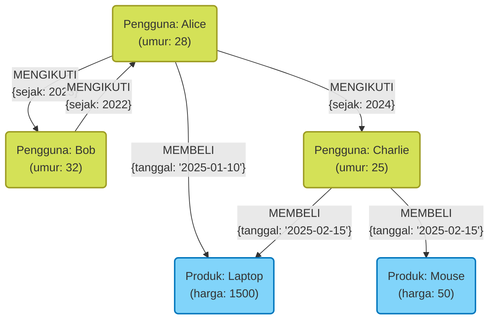
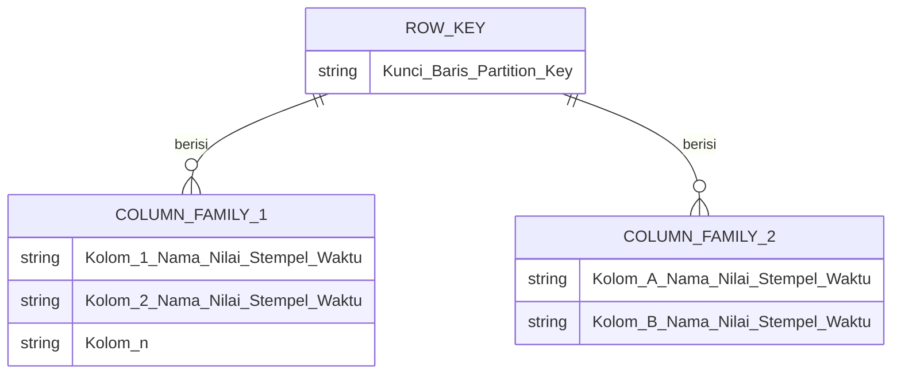

Dalam pengembangan sistem modern, pemilihan database sebagai sarana penyimpanan dan pengelolaan data memiliki arti yang sangat penting. Dulu adalah era dominasi database relasional ([RDBMS](https://kenji.blog/id/p/rdbms-transaction-acid-isolation-level-lock/)), tetapi saat ini, seiring dengan diversifikasi data dan peningkatan volume data secara masif, database **NoSQL** (Not Only SQL) mengambil peran penting.

Database NoSQL bukanlah teknologi tunggal, melainkan istilah umum untuk berbagai model data yang dioptimalkan untuk kasus penggunaan tertentu. Dalam artikel ini, setelah memperjelas perbedaan krusial antara RDBMS dan NoSQL, kami akan menjelaskan secara rinci dan komprehensif tentang empat model data NoSQL yang representatif: **Tipe Key-Value (KVS)** , **Tipe Berorientasi Dokumen** , **Tipe Graf** , dan **Tipe Kolom Lebar** , beserta karakteristik, kelebihan, kekurangan, dan kasus penggunaannya masing-masing.

---

## 1. Apa itu NoSQL? Memahami Secara Mendalam Perbedaannya dengan RDBMS

Untuk memilih NoSQL secara tepat, pertama-tama perlu memahami dengan jelas perbedaannya dari database relasional (RDBMS) tradisional. RDBMS (seperti MySQL, PostgreSQL, Oracle) telah lama menjadi inti dari sistem perusahaan. Database ini unggul dalam menjamin konsistensi data (sifat [ACID](https://kenji.blog/id/p/rdbms-transaction-acid-isolation-level-lock/)) secara ketat, serta mendukung penggabungan tabel yang kompleks (JOIN) dan kueri fleksibel menggunakan SQL.

Namun, seiring dengan membesarnya layanan web dan lonjakan data tidak terstruktur, masalah yang sulit ditangani oleh arsitektur RDBMS mulai terlihat jelas. Di sinilah NoSQL muncul. Perbedaan utama antara NoSQL dan RDBMS adalah sebagai berikut:

### Schemaless dan Fleksibilitas Struktur Data

RDBMS memerlukan definisi skema yang ketat (nama kolom dan tipe data pada tabel) terlebih dahulu. Mengubah skema yang sudah didefinisikan membutuhkan biaya besar dan terkadang dapat mengurangi kelincahan (agility) pengembangan.
Di sisi lain, banyak database NoSQL mengadopsi pendekatan **schemaless** atau skema fleksibel. Tidak perlu mendefinisikan struktur data secara utuh sejak awal, dan bentuk data dapat diubah secara dinamis sesuai dengan perubahan kebutuhan aplikasi. Karakteristik ini sangat cocok dengan pengembangan Agile dan arsitektur microservices.

### Skalabilitas Horizontal (Scale-Out)

Pendekatan dasar untuk meningkatkan performa RDBMS adalah **scale-up (skala vertikal)** , yaitu dengan meningkatkan CPU dan memori server. Namun, performa server tunggal memiliki batas fisik dan akan menjadi sangat mahal. Walaupun beberapa RDBMS menyediakan fitur clustering, terdapat rintangan teknis dalam menjaga konsistensi data antar node maupun dalam pemrosesan terdistribusi.

NoSQL sejak tahap perancangan awal didasarkan pada **scale-out (skala horizontal)** , yaitu meningkatkan kapasitas pemrosesan dan penyimpanan dengan menjajarkan sejumlah server murah (node) secara paralel. Data didistribusikan secara otomatis ke beberapa node (sharding), dan jika volume data atau lalu lintas meningkat, throughput keseluruhan sistem dapat ditingkatkan hanya dengan menambahkan node.

### Teorema CAP dan Model Konsistensi

Dalam sistem terdistribusi, **Teorema CAP** —yang menyatakan bahwa tiga hal yaitu Konsistensi ( **C**onsistency ), Ketersediaan ( **A**vailability ), dan Toleransi Partisi ( **P**artition Tolerance ) tidak dapat dipenuhi semuanya secara bersamaan dengan sempurna—merupakan konsep penting dalam desain NoSQL.

RDBMS pada umumnya mengutamakan " **CA** (Konsistensi dan Ketersediaan)" (dengan asumsi tidak ada pemisahan jaringan), sedangkan sebagian besar database NoSQL memilih salah satu kompromi antara " **CP** (Konsistensi dan Toleransi Partisi)" atau " **AP** (Ketersediaan dan Toleransi Partisi)". Khususnya pada lingkungan terdistribusi skala besar, banyak yang mengorbankan sedikit konsistensi ketat dan mengutamakan sistem untuk terus merespons (ketersediaan), lalu menggunakan pendekatan **Konsistensi Akhir (Eventual [Consistency](https://kenji.blog/id/p/cap-theorem-distributed-systems-tradeoff/))** di mana data pada akhirnya akan konsisten.

---

## 2. Tipe Key-Value (Key-Value Store: KVS)

Tipe Key-Value (KVS) adalah model data yang paling sederhana dan tercepat di antara database NoSQL. Sesuai dengan namanya, model ini mengelola data hanya menggunakan pasangan dari "Kunci (Key)" unik dan "Nilai (Value)" yang terkait dengannya.

### Model Data dan Karakteristik

KVS memiliki struktur yang sama dengan array asosiatif atau kamus (dictionary). Isi dari nilai (value) sebagian besar diperlakukan oleh pihak database sebagai sekadar untaian byte atau string (walaupun ada beberapa pengecualian), sehingga secara fundamental tidak memungkinkan untuk memahami struktur internal lalu mengirimkan kueri. Akses ke data terbatas pada operasi sederhana yaitu "mendapatkan, memperbarui, atau menghapus nilai dengan menentukan kuncinya".

Kesederhanaan yang ekstrem ini menciptakan senjata terbesar KVS, yaitu **performa yang luar biasa** . Karena tidak memerlukan analisis kueri yang kompleks atau pemrosesan JOIN, proses baca dan tulis data dapat dilakukan dengan latensi sangat rendah (milidetik hingga mikrodetik). Selain itu, karena data bersifat independen, mendistribusikannya ke beberapa node (sharding) juga sangat mudah.

### Database KVS Representatif

- **Redis** : KVS in-memory representatif yang beroperasi di atas memori. Tidak sekadar string, tetapi juga mendukung berbagai struktur data seperti list, set, dan hash, serta memiliki fungsi pub/sub, menjadikannya KVS yang kaya fitur.
- **Memcached** : Sistem cache memori terdistribusi yang sangat sederhana dan cepat.
- **Amazon DynamoDB** : KVS fully-managed dengan skalabilitas tinggi (juga memiliki aspek tipe kolom lebar dan dokumen).

### Kelebihan dan Kekurangan

**Kelebihan:**
- **Kecepatan pemrosesan yang sangat cepat** : Karena strukturnya yang sederhana, overhead untuk I/O disk dan operasi memori sangat minimal.
- **Skalabilitas tinggi** : Mudah untuk mendistribusikan data berdasarkan kunci, sehingga memungkinkan scale-out yang hampir tanpa batas.

**Kekurangan:**
- **Kueri yang kompleks tidak memungkinkan** : Tidak cocok untuk pencarian berdasarkan isi nilai (misalnya: "mencari pengguna dengan usia 20 tahun ke atas") atau untuk agregasi data.
- **Sulit mengekspresikan hubungan antar data** : Karena tidak memiliki fitur untuk menjaga relasi, pihak aplikasi-lah yang harus mengelola keterkaitan tersebut.

### Kasus Penggunaan

KVS paling ideal untuk skenario di mana nilai dapat ditarik secara unik dari kuncinya, dan memerlukan kecepatan tinggi.

- **Manajemen Sesi** : Menyimpan informasi sesi pengguna aplikasi web. Menggunakan ID sesi sebagai kunci, dan data sesi sebagai nilai.
- **Lapisan Cache** : Menyimpan sementara hasil kueri ke RDBMS atau hasil pemrosesan dengan komputasi berat, untuk meningkatkan kecepatan respons.
- **Leaderboard Real-time** : Melakukan agregasi dan menampilkan peringkat dalam game secara real-time (khususnya menggunakan fitur sorted set pada Redis).
- **Pengaturan dan Profil Pengguna** : Menggunakan ID pengguna sebagai kunci untuk menyimpan pengaturan individual (seperti JSON) sebagai nilai.

### Contoh Kode Redis

Berikut adalah contoh operasi Key-Value dasar menggunakan Redis (perintah CLI).

```text
# Set dan get string sederhana
> SET user:1001:name "Taro Yamada"
OK
> GET user:1001:name
"Taro Yamada"

# Set dengan masa berlaku (TTL) yang dapat digunakan untuk sesi (3600 detik = 1 jam)
> SETEX session:abcdef123456 3600 "session_data_json_here"
OK

# Manajemen informasi pengguna menggunakan tipe hash
> HSET user:1002 name "Hanako" age 28 city "Tokyo"
(integer) 3
> HGET user:1002 age
"28"
> HGETALL user:1002
1) "name"
2) "Hanako"
3) "age"
4) "28"
5) "city"
6) "Tokyo"
```

---

## 3. Database Berorientasi Dokumen

Database berorientasi dokumen adalah model data yang tetap mempertahankan fleksibilitas KVS, namun menyediakan struktur data yang lebih kompleks serta kemampuan kueri tingkat lanjut.

### Model Data dan Karakteristik

Menyimpan data dalam unit yang disebut "dokumen". Wujud asli dari dokumen umumnya adalah struktur data hierarkis yang direpresentasikan dalam format **JSON (JavaScript Object Notation)** , BSON (Binary JSON), atau XML.

Berbeda dengan KVS, database dokumen memahami struktur internal dari nilainya (dokumen). Oleh karena itu, memungkinkan untuk membuat indeks untuk field bersarang (nested) di dalam dokumen, dan melakukan pencarian serta agregasi dengan menentukan kondisi.
Berbeda juga dengan [RDBMS](https://kenji.blog/id/p/rdbms-transaction-acid-isolation-level-lock/) yang membagi (menormalisasi) data yang saling berkaitan ke dalam tabel-tabel terpisah, pada database dokumen, desain yang lebih disukai adalah menyatukan (denormalisasi/penanaman) data yang terkait ke dalam satu dokumen. Dengan ini, semua data yang diperlukan bisa didapatkan hanya melalui satu kueri.

### Database Tipe Dokumen Representatif

- **MongoDB** : Standar de facto untuk database berorientasi dokumen. Memiliki bahasa kueri yang kuat dan indeks yang fleksibel, serta skalabilitas tinggi.
- **Firestore / Firebase Realtime Database** : Database tipe dokumen yang disediakan oleh Google Cloud, unggul dalam sinkronisasi real-time.
- **Couchbase** : Database terdistribusi yang menggabungkan kecepatan KVS dengan kemampuan kueri dari database dokumen.
- **Amazon DocumentDB** : Layanan fully-managed yang kompatibel dengan MongoDB.

### Kelebihan dan Kekurangan

**Kelebihan:**
- **Fleksibilitas Schemaless** : Masing-masing dokumen dapat memiliki struktur yang berbeda, memudahkan untuk menyimpan objek dari aplikasi secara langsung.
- **Fungsi Kueri Kuat** : Pencarian, agregasi, dan pengurutan di field internal sangat dimungkinkan.
- **Efisiensi Pengembangan Tinggi** : Tidak memerlukan pemetaan ORM yang rumit, dan sangat kompatibel dengan API berbasis JSON.

**Kekurangan:**
- **Batasan pada Transaksi Kompleks** : Pembaruan yang melintasi banyak dokumen memiliki overhead yang lebih besar dibanding RDBMS (Meskipun MongoDB dan lainnya saat ini mendukung transaksi multi-dokumen, penggunaannya secara intensif tidak dianjurkan).
- **Pembengkakan Ukuran Data** : Penyimpanan nama field secara berulang akibat schemaless dan duplikasi data akibat denormalisasi sering menyebabkan ukuran data menjadi besar.

### Kasus Penggunaan

Tipe berorientasi dokumen cocok jika struktur data sering berubah atau jika Anda ingin menyimpan struktur data yang kompleks seperti aslinya.

- **Sistem Manajemen Konten (CMS)** : Secara fleksibel mengelola konten yang memiliki struktur berbeda seperti artikel, penulis, tag, komentar, dsb.
- **Katalog Produk dan Manajemen Stok** : Sangat ideal untuk model data di mana atribut (informasi spesifikasi) yang dibutuhkan jauh berbeda bergantung pada kategori produk, seperti elektronik rumah tangga, pakaian, makanan.
- **Profil dan Pengaturan Pengguna** : Mengelola pengaturan spesifik tiap pengguna atau informasi atribut tambahan sebagai sebuah dokumen tunggal.
- **Penyimpanan Log dan Data Event** : Menyimpan berbagai format data log yang dihasilkan aplikasi langsung sebagai JSON dan mencarinya atau menganalisisnya nanti.

### Contoh Kode MongoDB

Berikut adalah contoh insert dokumen dan kueri di MongoDB (gaya mongosh atau Node.js driver).

```javascript
// Menyisipkan dokumen (menyematkan data terkait seperti kontak atau hobi ke dalam array atau objek bersarang)
db.users.insertOne({
  user_id: "u123",
  name: "Kenji",
  age: 30,
  contact: {
    email: "kenji@example.com",
    phone: "090-1234-5678"
  },
  interests: ["NoSQL", "Cloud", "Photography"],
  status: "active"
});

// Contoh Kueri 1: Mencari pengguna dengan status "active" dan umur 25 tahun ke atas
db.users.find({
  status: "active",
  age: { $gte: 25 }
});

// Contoh Kueri 2: Mencari pengguna yang memiliki "NoSQL" di dalam array interests
db.users.find({
  interests: "NoSQL"
});

// Pencarian pada field bersarang (menggunakan notasi titik)
db.users.find({
  "contact.email": "kenji@example.com"
});
```

---

## 4. Database Graf

Database graf adalah database terkhusus yang didesain lebih menitikberatkan pada " **hubungan antar data (keterkaitan)** " dibandingkan data itu sendiri. Sebenarnya pada [RDBMS](https://kenji.blog/id/p/rdbms-transaction-acid-isolation-level-lock/), kata "relasional" berarti dibutuhkan biaya besar untuk mengolah hubungan antar tabel, namun database graf secara harfiah memperlakukan relasi sebagai objek kelas pertama.

### Model Data dan Karakteristik

Database graf mengadopsi model data berdasarkan "Teori Graf" dalam matematika. Tiga komponen utama yang membentuk data ini adalah sebagai berikut:

1. **Simpul (Node / Vertex)** : Entitas data (Contoh: orang, perusahaan, produk, dsb.). Ini ekuivalen dengan baris di RDBMS.
2. **Sisi (Edge / Relationship)** : Hubungan antara simpul (Contoh: teman dari, membeli, bagian dari, dsb.). Sisi dapat memiliki arah (direction).
3. **Properti (Property)** : Atribut dalam format Key-Value yang melekat pada node maupun edge (Contoh: "nama" seseorang, "tanggal mulai" sebuah hubungan, dsb.).

Dalam RDBMS, menelusuri hubungan yang kompleks membutuhkan banyak JOIN, dan ketika hierarkinya mendalam, performa akan turun drastis. Namun di database graf, operasi traversal (menelusuri edge dari sebuah node) dieksekusi dengan sangat cepat pada level pointer, sehingga memungkinkan eksplorasi puluhan hingga jutaan relasi dalam sekejap.

### Diagram Model Graf dengan Mermaid

Berikut adalah diagram konseptual database graf yang memodelkan hubungan antar pengguna di dalam SNS maupun riwayat pembelian produk.



### Database Graf Representatif

- **Neo4j** : Database graf yang paling banyak digunakan di dunia. Mengadopsi bahasa kuerinya sendiri yang kuat bernama Cypher.
- **Amazon Neptune** : Database graf fully-managed dari AWS. Mendukung Property [Graph](https://kenji.blog/id/p/tree-graph-data-structures-search-dfs-bfs-dijkstra/) (Gremlin) dan RDF (SPARQL).
- **ArangoDB** : Database multi-model yang mendukung graf, dokumen, dan KVS.

### Kelebihan dan Kekurangan

**Kelebihan:**
- **Penelusuran relasi hierarki dalam yang super cepat** : Mampu memroses kueri kompleks seperti "produk yang dibeli oleh teman dari teman dari teman saya" dalam satuan milidetik.
- **Pemodelan data intuitif** : Anda dapat mengimplementasikan secara langsung diagram konseptual yang digambar di papan tulis sebagai skema database.

**Kekurangan:**
- **Tidak cocok untuk pemindaian (scan) penuh seluruh entitas tunggal** : Untuk pemrosesan agregasi yang sederhana (Contoh: "menghitung usia rata-rata dari seluruh pengguna"), [RDBMS](https://kenji.blog/id/p/rdbms-transaction-acid-isolation-level-lock/) atau database tipe dokumen seringkali lebih cepat.
- **Tingkat kesulitan pemrosesan terdistribusi** : Karena graf merupakan data dengan keterkaitan yang kuat, jika data didistribusikan (di-shard) ke banyak node, traversal yang melintasi antar-node akan sering terjadi dan menurunkan performa.

### Kasus Penggunaan

Sangat penting untuk sistem di mana koneksi data itu sendiri bernilai tinggi dan hubungan tersebut perlu ditelusuri atau dianalisis secara mendalam.

- **SNS (Jejaring Sosial)** : Manajemen pertemanan, maupun hubungan follow/follower.
- **Mesin Rekomendasi (Recommendation Engine)** : Menyarankan "produk yang sering dibeli oleh pengguna lain dengan preferensi serupa dengan Anda" secara real-time.
- **Deteksi Penipuan (Fraud Detection)** : Memvisualisasikan korelasi antara alamat IP yang dicurigai, kartu kredit, dan akun menggunakan graf, lalu mengidentifikasi kelompok penipu.
- **Manajemen Jaringan dan Infrastruktur IT** : Mengelola dependensi antara server dan router, serta secepat kilat mendeteksi ruang lingkup dampak saat kegagalan.

### Contoh Kode Neo4j (Kueri Cypher)

Berikut merupakan contoh kueri Cypher untuk memasukkan data dan mencari hubungan di Neo4j. Cypher memiliki karakteristik unik di mana Anda dapat mengekspresikan relasi seperti layaknya ASCII art.

```cypher
// Pembuatan Node dan Relasi
CREATE (alice:User {name: 'Alice', age: 28})
CREATE (bob:User {name: 'Bob', age: 32})
CREATE (laptop:Product {name: 'Laptop', price: 1500})
// Pembuatan Sisi (Edge)
CREATE (alice)-[:FOLLOWS {since: 2023}]->(bob)
CREATE (alice)-[:PURCHASED {date: '2025-01-10'}]->(laptop);

// Contoh Kueri 1: Mencari pengguna yang diikuti (di-follow) oleh Alice
MATCH (u:User {name: 'Alice'})-[:FOLLOWS]->(follower)
RETURN follower.name;

// Contoh Kueri 2: Rekomendasi (Mencari produk yang dibeli oleh teman-teman yang di-follow Alice)
MATCH (alice:User {name: 'Alice'})-[:FOLLOWS]->(friend)-[:PURCHASED]->(product)
// Bisa juga ditambahkan kondisi lain, semisal mengecualikan produk yang sudah dimiliki
RETURN product.name, count(product) AS purchaseCount
ORDER BY purchaseCount DESC;
```

---

## 5. Tipe Kolom Lebar (Wide-Column Store)

Database tipe kolom lebar (atau dikenal dengan Column-Family Store) merupakan model data yang didesain khusus agar dapat menulis dan membaca data berjumlah besar yang didistribusikan ke banyak node dengan sangat cepat. Ia lahir karena dipengaruhi oleh paper Bigtable dari Google.

### Model Data dan Karakteristik

Strukturnya menyerupai tabel dalam [RDBMS](https://kenji.blog/id/p/rdbms-transaction-acid-isolation-level-lock/) yang terdiri dari baris (row) dan kolom (column), tetapi penyimpanan internal datanya sangat berbeda. Struktur data pada Wide-Column Store biasanya terdiri dari:

1. **Kunci Baris (Row Key)** : Kunci unik pengidentifikasi baris. Data kemudian didistribusikan ke setiap node berdasarkan kunci ini.
2. **Keluarga Kolom (Column Family)** : Grup berisi kolom-kolom yang terkait. Ini menyerupai sebuah tabel pada RDBMS, namun tiap baris dapat mempunyai kolom yang berbeda-beda.
3. **Kolom (Column)** : Set dari "Nama Kolom (Key)", "Nilai (Value)", dan "Stempel Waktu (Timestamp)".

Karakteristik paling utamanya adalah **jumlah maupun tipe kolom dapat berbeda pada setiap barisnya (schemaless)** dan **sebuah baris dapat memiliki jutaan kolom (sangat lebar)** .
Ia juga mengadopsi arsitektur seperti LSM [Tree](https://kenji.blog/id/p/tree-graph-data-structures-search-dfs-bfs-dijkstra/) (Log-Structured Merge-tree) untuk membuat operasi penulisan (Write) ke disk sangat cepat secara sekuensial. Sehingga model ini unggul jauh untuk pemakaian pencatatan data massif secara terus-menerus.

### Diagram Model Kolom Lebar dengan Mermaid

Berikut adalah gambaran struktur data logis dari Wide-Column Store untuk mencatat data sensor (IoT). Setiap baris bebas memiliki jumlah kolom berapa pun.



### Database Tipe Kolom Lebar Representatif

- **Apache Cassandra** : Dikembangkan oleh Facebook, memiliki ketersediaan yang tinggi, skalabilitas, serta arsitektur terdistribusi tanpa node master (masterless).
- **Apache HBase** : Berfungsi sebagai bagian dari ekosistem Hadoop, Wide-Column Store raksasa yang dibangun di atas HDFS.
- **ScyllaDB** : Kompatibel dengan Cassandra, tetapi ditulis ulang menggunakan C++ dengan hasil throughput ekstrem.
- **Google Cloud Bigtable** : Layanan fully-managed, sang pionir konsep Wide-Column Store.

### Kelebihan dan Kekurangan

**Kelebihan:**
- **Throughput penulisan yang sangat menakjubkan** : Mampu menulis jutaan baris data per detik pada kluster yang terdiri dari ribuan server.
- **Tidak ada Titik Kegagalan Tunggal (SPOF)** : Pada arsitektur masterless seperti Cassandra, walau ada node yang down, operasional keseluruhan sistem tetap berlanjut normal.
- **Terdistribusi secara geografis (Multi-Data Center)** : Hebat dalam replikasi data real-time di seluruh dunia yang tersebar melintasi berbagai pusat data.

**Kekurangan:**
- **Tidak dapat melakukan kueri yang fleksibel** : Karena data ditempatkan secara fisik berdasarkan Kunci Baris (dan Clustering Key), pencarian atau JOIN menggunakan kolom selain kunci dasarnya tidak dimungkinkan (atau amat lambat). Pemodelan tabel yang berdasarkan pada pola kueri (Query-driven Modeling) merupakan suatu keharusan.
- **Biaya pembelajaran** : Perlu beralih dari pemikiran pemodelan dinormalisasi ala [RDBMS](https://kenji.blog/id/p/rdbms-transaction-acid-isolation-level-lock/), sehingga tingkat kesulitan pemodelan datanya tergolong tinggi.

### Kasus Penggunaan

Sangat ideal digunakan pada sistem berskala super besar yang menitikberatkan pada penulisan jumlah data yang banyak berdasarkan pada kunci spesifik dan pembacaan langsung di satu titik (pin-point).

- **Data Sensor IoT / Data Deret Waktu** : Mencatat secara terus-menerus data pengukuran yang dikirimkan setiap detik dari jutaan perangkat dengan menggunakan ID Perangkat sebagai Kunci Baris dan waktu sebagai nama kolom.
- **Pengumpulan dan Analisis Log Skala Besar** : Menyimpan data-data bersifat append-only, seperti click-stream di situs web dan riwayat akses sistem.
- **Manajemen Riwayat Pesan** : Menyimpan riwayat obrolan pesan berskala masif, seperti pada aplikasi Discord.
- **Feature Store untuk Personalisasi / Rekomendasi** : Membaca kembali dengan kecepatan kilat riwayat aktivitas masa lalu dari pengguna untuk diteruskan ke model Machine Learning.

---

## 6. Opsi Database Multi-Model

Baru-baru ini, **Database Multi-Model** , yaitu database tunggal yang menyediakan fungsi dari berbagai model NoSQL dan RDBMS secara terintegrasi, juga semakin menarik perhatian.

Sebagai contoh, melalui dukungan kuat untuk tipe data JSONB, PostgreSQL mampu bertindak sebagai database tipe dokumen. Selain itu, layaknya Azure Cosmos DB ataupun ArangoDB, ada juga produk yang dapat menangani KVS, dokumen, dan graf secara transparan di dalam satu backend. Dengan ini, biaya operasional untuk memelihara beberapa sistem database dalam proyek (kompleksitas Polyglot Persistence) bisa ditekan, sambil tetap memungkinkan akses data yang fleksibel sesuai kebutuhan.

---

## 7. Kesimpulan: Memilih yang Paling Optimal Berdasarkan Kasus Penggunaan

Sebagaimana sudah kita lihat, dalam "NoSQL" tidak ada yang namanya "peluru perak (Silver Bullet)". Memilih model data yang tepat berdasarkan kebutuhan proyek adalah kunci keberhasilan. Terakhir, mari kita rangkum panduan ringkas untuk proses seleksi.

1. **Apakah butuh proses baca/tulis simpel dengan kecepatan super tinggi, seperti untuk manajemen sesi atau cache?**
   👉 Pilihlah **Tipe Key-Value (Redis, Memcached)** .
2. **Apakah struktur datanya sering berubah, dan Anda ingin menyimpan lalu mencari data JSON kompleks seperti aslinya?**
   👉 Pilihlah **Tipe Berorientasi Dokumen (MongoDB, Firestore)** .
3. **Apakah butuh mengeksplorasi secara instan hubungan kompleks antar data, seperti "Teman dari Teman" atau "Jalur Rekomendasi"?**
   👉 Pilihlah **Tipe Graf (Neo4j)** .
4. **Apakah Anda butuh menulis data IoT atau log hingga jutaan per detik dan mendambakan kebebasan skalabilitas tak terhingga?**
   👉 Pilihlah **Tipe Kolom Lebar (Cassandra, Bigtable)** .
5. **Apakah integritas ketat, transaksi rumit, dan agregasi beragam (JOIN) bersifat krusial/wajib?**
   👉 Jangan memaksakan diri menggunakan NoSQL, gunakan saja **RDBMS (PostgreSQL, MySQL)** .

Pada arsitektur skala besar modern, ketimbang menyimpan seluruh data ke dalam satu database, **Polyglot Persistence (ketahanan multilabel)** yang menerapkan database yang paling cocok pada setiap layanan mikro (microservices) telah menjadi standar umum.
Hanya dengan memahami secara mendalam kelemahan maupun kelebihan dari masing-masing model data dan juga perbedaan mendasar dari RDBMS konvensional, maka desain arsitektur database Anda dijamin sanggup memaksimalkan ketersediaan, skalabilitas, dan performa yang optimal.
