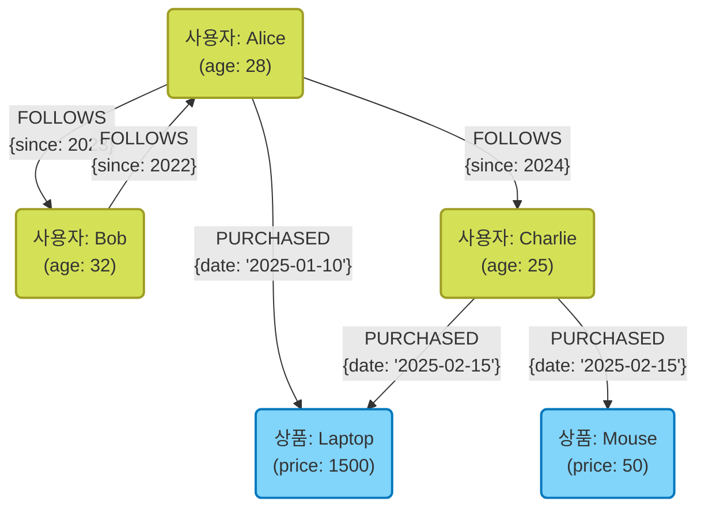

현대 시스템 개발에 있어, 데이터 저장 및 관리 수단으로서 데이터베이스의 선정은 매우 중요한 의미를 지닙니다. 과거에는 관계형 데이터베이스([RDBMS](https://kenji.blog/ko/p/rdbms-transaction-acid-isolation-level-lock/))가 독주하던 시대였지만, 현재는 데이터의 다양화, 데이터 양의 대규모화에 따라 **NoSQL** (Not Only SQL) 데이터베이스가 중요한 역할을 담당하게 되었습니다.

NoSQL 데이터베이스는 단일 기술이 아니라, 특정 사용 사례에 최적화된 다양한 데이터 모델의 총칭입니다. 본 기사에서는 RDBMS와 NoSQL의 결정적인 차이를 명확히 한 후, 대표적인 NoSQL의 4가지 데이터 모델인 **키-값형(KVS)** , **문서 지향형** , **그래프형** , **와이드 컬럼형** 각각의 특성, 장단점 및 적절한 사용 사례에 대해 상세하고 망라적으로 해설합니다.

---

## 1. NoSQL이란? RDBMS와의 차이 깊이 이해하기

NoSQL을 적절히 선정하기 위해서는 먼저 기존의 관계형 데이터베이스(RDBMS)와의 차이를 명확히 이해해야 합니다. RDBMS(MySQL, PostgreSQL, Oracle 등)는 오랫동안 엔터프라이즈 시스템의 중심을 담당해 왔습니다. 데이터 무결성([ACID](https://kenji.blog/ko/p/rdbms-transaction-acid-isolation-level-lock/) 특성)을 엄밀히 보장하고, 복잡한 테이블 조인(JOIN)이나 SQL을 통한 유연한 쿼리를 지원한다는 점에서 뛰어납니다.

그러나 웹 서비스의 대규모화 및 비정형 데이터의 급증에 따라, RDBMS의 아키텍처로는 대응하기 어려운 과제가 드러나기 시작했습니다. 그래서 등장한 것이 NoSQL입니다. NoSQL과 RDBMS의 주요 차이는 다음과 같습니다.

### 스키마리스와 데이터 구조의 유연성

RDBMS는 사전에 엄격한 스키마(테이블의 열 이름이나 데이터 타입)를 정의해야 합니다. 한 번 정의한 스키마를 변경하려면 비용이 발생하며, 개발의 민첩성이 손상될 수 있습니다.
반면, 많은 NoSQL 데이터베이스는 **스키마리스** 또는 스키마가 유연한 접근 방식을 채택하고 있습니다. 데이터 구조를 사전에 완전히 정의할 필요가 없으며, 애플리케이션의 요구 사항 변경에 맞춰 동적으로 데이터 형태를 변경할 수 있습니다. 이러한 특성은 애자일 개발이나 마이크로서비스 아키텍처와 매우 궁합이 잘 맞는다고 할 수 있습니다.

### 수평적 확장성 (스케일 아웃)

RDBMS의 성능을 향상시키기 위한 기본적인 접근 방식은 서버의 CPU나 메모리를 증설하는 **스케일 업(수직 스케일)** 입니다. 그러나 단일 서버의 성능에는 물리적인 한계가 있으며, 매우 비쌉니다. 일부 RDBMS에서는 클러스터링 기능을 제공하지만, 노드 간 데이터 일관성 유지나 분산 처리에는 기술적인 장벽이 있습니다.

NoSQL은 설계 초기 단계부터 저렴한 여러 서버(노드)를 배치하여 처리 능력과 저장 용량을 향상시키는 **스케일 아웃(수평 스케일)** 을 전제로 하고 있습니다. 데이터를 자동으로 여러 노드에 분산(샤딩)하며, 데이터 양이나 트래픽이 증가할 경우 단순히 노드를 추가하는 것만으로 시스템 전체의 처리량을 향상시킬 수 있습니다.

### CAP 정리와 일관성 모델

분산 시스템에서 데이터의 일관성( **C**onsistency ), 가용성( **A**vailability ), 분할 내성( **P**artition Tolerance ) 세 가지를 동시에 완전히 충족할 수는 없다는 **CAP 정리** 는 NoSQL 설계에 있어 중요한 개념입니다.

RDBMS는 일반적으로 " **CA** (일관성과 가용성)"를 중시(네트워크 분할이 없다는 전제하에)하지만, NoSQL 데이터베이스의 대부분은 " **CP** (일관성과 분할 내성)" 또는 " **AP** (가용성과 분할 내성)" 중 하나의 트레이드오프를 선택합니다. 특히 대규모 분산 환경에서는 엄격한 일관성을 조금 희생하더라도 항상 시스템이 응답을 계속하는 것(가용성)을 우선시하여, 최종적으로 데이터가 일치하면 된다고 보는 **최종 일관성(Eventual [Consistency](https://kenji.blog/ko/p/cap-theorem-distributed-systems-tradeoff/))** 접근 방식을 취하는 경우가 많습니다.

---

## 2. 키-값형 (Key-Value Store: KVS)

키-값형(KVS)은 NoSQL 데이터베이스 중에서 가장 단순하고 빠른 데이터 모델입니다. 이름 그대로 고유한 "키(Key)"와 그에 대응하는 "값(Value)"의 쌍만으로 데이터를 관리합니다.

### 데이터 모델과 특징

KVS는 연관 배열이나 사전(딕셔너리)과 같은 구조를 가집니다. 값의 내용은 데이터베이스 측에서는 단순한 바이트 열이나 문자열로 취급되는 경우가 많으며(일부 예외 있음), 내부 구조를 해석하여 쿼리를 던지는 것은 기본적으로 불가능합니다. 데이터 접근은 "키를 지정하여 값을 조회·갱신·삭제한다"는 단순한 조작만 이루어집니다.

이 극단적인 단순함이 KVS의 최대 무기인 **압도적인 성능** 을 만들어냅니다. 복잡한 쿼리 해석이나 JOIN 처리가 불필요하기 때문에, 밀리초에서 마이크로초 단위의 초저지연으로 데이터 읽기 및 쓰기가 가능합니다. 또한 데이터가 독립적이기 때문에 여러 노드로 분산(샤딩)하는 것도 매우 쉽습니다.

### 대표적인 KVS 데이터베이스

- **Redis** : 메모리 상에서 동작하는 인메모리 KVS의 대표 주자. 단순한 문자열뿐만 아니라 리스트, 세트, 해시 등 다양한 데이터 구조를 지원하며 펍섭([Pub/Sub](https://kenji.blog/ko/p/event-driven-architecture-message-queue-kafka-rabbitmq/)) 기능도 갖춘 고기능 KVS.
- **Memcached** : 매우 단순하고 빠른 분산 메모리 캐시 시스템.
- **Amazon DynamoDB** : 완전 관리형으로 높은 확장성을 자랑하는 KVS(와이드 컬럼이나 문서의 측면도 가짐).

### 장점과 단점

**장점:**
- **초고속 처리 속도** : 구조가 단순하여 디스크 I/O나 메모리 조작의 오버헤드가 최소화됨.
- **높은 확장성** : 키를 기반으로 데이터를 분산하기 쉬워, 무한에 가까운 스케일 아웃이 가능.

**단점:**
- **복잡한 쿼리 불가** : 값의 내용에 따른 검색(예: "나이가 20세 이상인 사용자 찾기")이나 데이터 집계에는 부적합.
- **데이터 간 관계성 표현 곤란** : 관계를 맺어주는 기능이 없기 때문에 애플리케이션 측에서 관련성을 관리해야 함.

### 사용 사례

KVS는 키를 통해 값을 고유하게 찾을 수 있고, 빠른 속도가 요구되는 시나리오에 최적입니다.

- **세션 관리** : 웹 애플리케이션의 사용자 세션 정보를 저장. 키를 세션 ID, 값을 세션 데이터로 함.
- **캐시 계층** : RDBMS 등에 대한 쿼리 결과나 계산 비용이 높은 처리 결과를 임시로 저장하여 응답 속도를 향상.
- **실시간 리더보드** : (특히 Redis 등의 정렬된 세트 기능을 사용하여) 게임 랭킹 등을 실시간으로 집계하고 표시.
- **사용자 설정 및 프로필** : 사용자 ID를 키로 하여 개별 설정 항목(JSON 등)을 값으로 저장.

### Redis 코드 예시

Redis를 이용한 기본적인 키-값 조작의 예시(CLI 명령어)를 보여줍니다.

```text
# 단순한 문자열의 세트 및 겟
> SET user:1001:name "Taro Yamada"
OK
> GET user:1001:name
"Taro Yamada"

# 세션 등에서 사용할 수 있는 만료 시간(TTL)이 있는 세트 (3600초 = 1시간)
> SETEX session:abcdef123456 3600 "session_data_json_here"
OK

# 해시형을 사용한 사용자 정보 관리
> HSET user:1002 name "Hanako" age 28 city "Tokyo"
(integer) 3
> HGET user:1002 age
"28"
> HGETALL user:1002
1) "name"
2) "Hanako"
3) "age"
4) "28"
5) "city"
6) "Tokyo"
```

---

## 3. 문서 지향형 데이터베이스

문서 지향형 데이터베이스는 KVS의 유연성을 유지하면서, 보다 복잡한 데이터 구조와 고급 쿼리 기능을 제공하는 데이터 모델입니다.

### 데이터 모델과 특징

데이터를 "문서"라고 불리는 단위로 저장합니다. 문서의 실체는 주로 **JSON(JavaScript Object Notation)** 이나 BSON(Binary JSON), XML 형식으로 표현되는 계층적인 데이터 구조입니다.

KVS와 달리, 문서 데이터베이스는 값(문서)의 내부 구조를 이해하고 있습니다. 따라서 문서 내 중첩된 필드에 대해 인덱스를 생성하거나, 조건을 지정하여 검색 및 집계하는 것이 가능합니다.
또한 관련된 데이터를 별도의 테이블로 나누는(정규화하는) [RDBMS](https://kenji.blog/ko/p/rdbms-transaction-acid-isolation-level-lock/)와 대조적으로, 문서 데이터베이스에서는 관련 데이터를 하나의 문서에 통합하는(비정규화·내장) 설계가 선호됩니다. 이를 통해 한 번의 쿼리로 필요한 데이터를 모두 가져올 수 있게 됩니다.

### 대표적인 문서형 데이터베이스

- **MongoDB** : 문서 지향 데이터베이스의 사실상 표준. 강력한 쿼리 언어와 유연한 인덱스를 갖추고 있으며 확장성도 높음.
- **Firestore / Firebase Realtime Database** : Google Cloud에서 제공하는 실시간 동기화에 강한 문서형 데이터베이스.
- **Couchbase** : KVS의 빠른 속도와 문서 데이터베이스의 쿼리 기능을 겸비한 분산형 데이터베이스.
- **Amazon DocumentDB** : MongoDB 호환 완전 관리형 서비스.

### 장점과 단점

**장점:**
- **스키마리스 유연성** : 문서마다 다른 구조를 가질 수 있으며, 애플리케이션의 객체를 그대로 저장하기 쉬움.
- **강력한 쿼리 기능** : 내부 필드에서의 검색, 집계, 정렬이 가능.
- **개발 효율성 향상** : ORM의 복잡한 매핑이 필요 없고, JSON 기반 API와 친화성이 매우 높음.

**단점:**
- **복잡한 트랜잭션의 제한** : 여러 문서를 넘나드는 갱신은 RDBMS에 비해 오버헤드가 큼 (최근 MongoDB 등은 다중 문서 트랜잭션을 지원하지만 다용하는 것은 권장되지 않음).
- **데이터 크기 비대화** : 스키마리스로 인한 필드 이름 중복 저장이나 비정규화로 인한 데이터 중복으로 인해 데이터 크기가 커지기 쉬움.

### 사용 사례

문서 지향형은 데이터 구조가 자주 변경되거나, 복잡한 데이터 구조를 그대로 저장하고 싶은 경우에 적합합니다.

- **콘텐츠 관리 시스템 (CMS)** : 기사, 저자, 태그, 댓글 등 구조가 다른 콘텐츠를 유연하게 관리.
- **상품 카탈로그 및 재고 관리** : 가전, 의류, 식품 등 상품 카테고리에 따라 필요한 속성(스펙 정보)이 크게 다른 데이터 모델에 최적.
- **사용자 프로필 및 설정** : 사용자마다 다른 임의의 설정 항목이나 속성 정보를 하나의 문서로 관리.
- **로그 및 이벤트 데이터 저장** : 애플리케이션이 생성하는 다양한 형식의 로그 데이터를 그대로 JSON으로 저장하여 나중에 검색·분석.

### MongoDB 코드 예시

MongoDB에서의 문서 삽입 및 쿼리의 예시(mongosh 또는 Node.js 드라이버 스타일)를 보여줍니다.

```javascript
// 문서 삽입 (관련 데이터인 연락처나 취미를 배열이나 중첩된 객체로 내장)
db.users.insertOne({
  user_id: "u123",
  name: "Kenji",
  age: 30,
  contact: {
    email: "kenji@example.com",
    phone: "090-1234-5678"
  },
  interests: ["NoSQL", "Cloud", "Photography"],
  status: "active"
});

// 쿼리 예시 1: status가 "active"이고 age가 25 이상인 사용자 검색
db.users.find({
  status: "active",
  age: { $gte: 25 }
});

// 쿼리 예시 2: interests 배열에 "NoSQL"이 포함된 사용자 검색
db.users.find({
  interests: "NoSQL"
});

// 중첩된 필드에서 검색 (점 표기법 사용)
db.users.find({
  "contact.email": "kenji@example.com"
});
```

---

## 4. 그래프 데이터베이스

그래프 데이터베이스는 데이터 자체보다 " **데이터와 데이터 간의 관계성(연결)** "을 중시하여 설계된 특화형 데이터베이스입니다. [RDBMS](https://kenji.blog/ko/p/rdbms-transaction-acid-isolation-level-lock/)의 "릴레이셔널(관계형)"은 사실 테이블 간의 관계성을 다루는 데 비용이 많이 들지만, 그래프 데이터베이스는 말 그대로 관계성을 일급 객체로 다룹니다.

### 데이터 모델과 특징

그래프 데이터베이스는 수학의 "그래프 이론"에 기반한 데이터 모델을 채택하고 있습니다. 데이터를 구성하는 주요 요소는 다음 3가지입니다.

1. **노드 (Node / Vertex)** : 데이터 엔티티 (예: 사람, 회사, 상품 등). RDBMS의 행에 해당.
2. **에지 (Edge / Relationship)** : 노드 간의 관계성 (예: 친구이다, 구매했다, 소속되어 있다 등). 에지에는 방향성을 가질 수 있습니다.
3. **속성 (Property)** : 노드나 에지에 부여되는 키-값 형식의 속성 정보 (예: 사람의 "이름", 관계성의 "시작일" 등).

RDBMS에서 복잡한 관계성을 따라가려면 다수의 JOIN이 필요하며, 계층이 깊어지면 성능이 급격히 저하됩니다. 그러나 그래프 데이터베이스에서는 노드에서 에지를 따라가는 작업(순회)이 포인터 이동 수준으로 매우 빠르게 이루어지기 때문에, 수만, 수백만 개의 관계성을 순식간에 탐색할 수 있습니다.

### Mermaid를 이용한 그래프 모델 도해

다음은 SNS에서 사용자 간의 관계성이나 상품의 구매 이력을 모델링한 그래프 데이터베이스의 개념도입니다.



### 대표적인 그래프 데이터베이스

- **Neo4j** : 전 세계에서 가장 많이 사용되는 그래프 데이터베이스. 독자적이고 강력한 쿼리 언어인 Cypher를 채택.
- **Amazon Neptune** : AWS가 제공하는 완전 관리형 그래프 데이터베이스. Property [Graph](https://kenji.blog/ko/p/tree-graph-data-structures-search-dfs-bfs-dijkstra/)(Gremlin) 및 RDF(SPARQL) 지원.
- **ArangoDB** : 그래프, 문서, KVS를 지원하는 다중 모델 데이터베이스.

### 장점과 단점

**장점:**
- **깊은 계층의 관계성 탐색이 초고속** : "친구의 친구의 친구가 산 상품"과 같은 복잡한 관계의 쿼리를 밀리초 단위로 처리 가능.
- **직관적인 데이터 모델링** : 화이트보드에 그린 개념도를 그대로 데이터베이스의 스키마로 구현할 수 있음.

**단점:**
- **단일 엔티티의 전체 검색에 부적합** : 단순한 집계 처리(예: "전체 사용자의 평균 연령 계산")는 [RDBMS](https://kenji.blog/ko/p/rdbms-transaction-acid-isolation-level-lock/)나 문서형이 더 빠른 경우가 많음.
- **분산 처리의 난이도** : 그래프는 밀결합된 데이터이므로, 여러 노드로 데이터를 분할(샤딩)하면 노드 간을 넘나드는 순회가 발생하여 성능이 저하되기 쉬움.

### 사용 사례

데이터 간의 연결 자체에 가치가 있으며, 그 관계성을 깊이 탐색하고 분석해야 하는 시스템에 필수적입니다.

- **SNS (소셜 네트워크)** : 친구 관계, 팔로우/팔로워 관계 관리.
- **추천 엔진** : "당신과 비슷한 구매 성향의 사용자가 구매한 상품"을 실시간으로 제안.
- **부정 탐지 (Fraud Detection)** : 의심스러운 IP 주소, 신용 카드, 계정의 상관관계를 그래프로 시각화하여 사기 집단을 식별.
- **네트워크 및 IT 인프라 관리** : 서버나 라우터의 의존 관계를 관리하여 장애 발생 시 영향 범위를 즉시 파악.

### Neo4j 코드 예시 (Cypher 쿼리)

Neo4j에서 데이터를 삽입하고 관계성을 검색하는 Cypher 쿼리 언어의 예시입니다. Cypher는 아스키 아트처럼 관계성을 표현할 수 있는 것이 특징입니다.

```cypher
// 노드 및 관계성 생성
CREATE (alice:User {name: 'Alice', age: 28})
CREATE (bob:User {name: 'Bob', age: 32})
CREATE (laptop:Product {name: 'Laptop', price: 1500})
// 에지 생성
CREATE (alice)-[:FOLLOWS {since: 2023}]->(bob)
CREATE (alice)-[:PURCHASED {date: '2025-01-10'}]->(laptop);

// 쿼리 예시 1: Alice가 팔로우하는 사용자 검색
MATCH (u:User {name: 'Alice'})-[:FOLLOWS]->(follower)
RETURN follower.name;

// 쿼리 예시 2: 추천 (Alice가 팔로우하는 사람이 산 상품 찾기)
MATCH (alice:User {name: 'Alice'})-[:FOLLOWS]->(friend)-[:PURCHASED]->(product)
// 자신이 이미 산 것을 제외하는 등의 조건도 추가 가능
RETURN product.name, count(product) AS purchaseCount
ORDER BY purchaseCount DESC;
```

---

## 5. 와이드 컬럼형 (컬럼 지향 스토어)

와이드 컬럼형 데이터베이스(또는 컬럼 패밀리 스토어)는 대량의 데이터를 여러 노드에 분산하여 고속으로 쓰기 및 읽기를 수행하는 데 특화된 데이터 모델입니다. Google의 Bigtable 논문에 영향을 받아 탄생했습니다.

### 데이터 모델과 특징

[RDBMS](https://kenji.blog/ko/p/rdbms-transaction-acid-isolation-level-lock/)와 같은 행과 열로 이루어진 테이블 구조와 비슷하지만, 내부적인 데이터 보관 방식이 크게 다릅니다. 와이드 컬럼 스토어의 데이터 구조는 주로 다음 요소로 구성됩니다.

1. **Row Key (행 키)** : 행을 고유하게 식별하는 키. 데이터는 이 키를 기반으로 각 노드에 분산 배치됩니다.
2. **Column Family (컬럼 패밀리)** : 관련된 컬럼(열)의 그룹. RDBMS의 테이블과 비슷하지만, 행마다 다른 컬럼을 가질 수 있습니다.
3. **Column (컬럼)** : "컬럼 이름(Key)", "값(Value)", "타임스탬프"의 세트.

가장 큰 특징은 **행마다 컬럼 수나 종류가 달라도 무방하다(스키마리스)** 는 점과, **수백만 개의 컬럼이라는 거대한(와이드한) 행을 가질 수 있다** 는 점입니다.
또한 LSM 트리(Log-Structured Merge-tree) 등의 아키텍처를 채택하고 있어 디스크 쓰기(Write) 처리가 매우 빠르고 순차적으로 이루어지기 때문에 대량의 데이터를 끊임없이 계속 기록하는 용도에 압도적인 강점을 발휘합니다.

### Mermaid를 이용한 와이드 컬럼 모델 도해

다음은 센서 데이터(IoT)를 기록하는 와이드 컬럼 스토어의 논리적인 데이터 구조의 이미지입니다. 행마다 임의의 수의 컬럼을 저장할 수 있습니다.

```mermaid
erDiagram
    %% 와이드 컬럼 스토어 데이터 구조
    ROW_KEY {
        string "Row Key (Partition Key)"
    }
    
    COLUMN_FAMILY_1 {
        string "Column 1 (Name:Value:Timestamp)"
        string "Column 2 (Name:Value:Timestamp)"
        string "Column n..."
    }
    
    COLUMN_FAMILY_2 {
        string "Column A (Name:Value:Timestamp)"
        string "Column B (Name:Value:Timestamp)"
    }
    
    ROW_KEY ||--o{ COLUMN_FAMILY_1 : "포함"
    ROW_KEY ||--o{ COLUMN_FAMILY_2 : "포함"

    %% 참고: 실제 각 행은 컬럼 패밀리 내에 동적이고 방대한 수의 컬럼(예를 들어 센서의 타임스탬프를 컬럼 이름으로 하는 등)을 저장할 수 있습니다.
```

### 대표적인 와이드 컬럼형 데이터베이스

- **Apache Cassandra** : Facebook에서 개발했으며, 높은 가용성과 확장성, 마스터리스 분산 아키텍처를 가짐.
- **Apache HBase** : Hadoop 에코시스템의 일부로 기능하며, HDFS 위에 구축되는 거대한 와이드 컬럼 스토어.
- **ScyllaDB** : Cassandra와 호환되면서도 C++로 재작성되어, 차원이 다른 처리량을 실현.
- **Google Cloud Bigtable** : 와이드 컬럼 스토어의 원조가 되는 완전 관리형 서비스.

### 장점과 단점

**장점:**
- **쓰기 처리량이 경이롭게 높음** : 수천~수만 대의 서버로 구성된 클러스터에 초당 수백만 건의 쓰기를 수행 가능.
- **단일 장애점 (SPOF)이 없음** : Cassandra 등의 마스터리스 아키텍처에서는 어느 노드가 다운되더라도 시스템 전체의 가동을 지속할 수 있음.
- **지리적인 분산 (다중 데이터 센터)** : 여러 데이터 센터를 넘나드는 실시간 데이터 복제에 능함.

**단점:**
- **유연한 쿼리 불가** : 데이터는 Row Key(및 클러스터링 키)를 기반으로 물리적으로 배치되기 때문에, 키 이외의 컬럼을 사용한 검색이나 JOIN은 기본적으로 불가능(또는 현저히 느림). 접근 패턴에 맞춰 테이블을 설계하는 "쿼리 주도 모델링"이 필수적.
- **학습 비용** : [RDBMS](https://kenji.blog/ko/p/rdbms-transaction-acid-isolation-level-lock/)의 정규화된 모델링 사고에서 벗어나야 하며, 데이터 모델링의 난이도가 높음.

### 사용 사례

특정 키에 기반한 대량 데이터의 쓰기와 핀포인트 읽기가 중심이 되는 초대규모 시스템에 최적입니다.

- **IoT 센서 데이터 / 시계열 데이터** : 수백만 대의 디바이스에서 초당 전송되는 측정 데이터를 디바이스 ID(Row Key)와 시간(컬럼 이름)으로 계속 기록.
- **대규모 로그 수집 및 분석** : 웹사이트의 클릭 스트림이나 시스템 접근 로그 등 추가(Append-Only)형 데이터 저장.
- **메시징 이력 관리** : 채팅 앱(Discord 등)의 대규모 메시지 이력 저장.
- **개인화/추천용 특성 스토어** : 사용자의 과거 활동을 고속으로 읽어들여 머신러닝 모델에 전달.

---

## 6. 멀티 모델 데이터베이스라는 선택지

최근에는 단일 데이터베이스 엔진으로 여러 NoSQL 모델이나 RDBMS의 기능을 통합하여 제공하는 **멀티 모델 데이터베이스** 도 주목받고 있습니다.

예를 들어, PostgreSQL은 강력한 JSONB 타입 지원으로 문서형으로서의 기능을 갖추고 있습니다. 또한 Azure Cosmos DB나 ArangoDB처럼 하나의 백엔드에서 KVS, 문서, 그래프를 투명하게 다룰 수 있는 제품도 존재합니다. 이를 통해 프로젝트 내에서 여러 데이터베이스 시스템을 운영하는 운영 비용(폴리글랏 퍼시스턴스의 복잡성)을 억제하면서 요구 사항에 맞는 유연한 데이터 접근이 가능해집니다.

---

## 7. 결론: 사용 사례에 기반한 최적의 선택

지금까지 살펴본 바와 같이 NoSQL에 "은탄환"은 존재하지 않습니다. 프로젝트 요구 사항에 맞춰 적절한 데이터 모델을 선택하는 것이 성공의 열쇠가 됩니다. 마지막으로, 선정을 위한 간결한 가이드라인을 정리합니다.

1. **세션 관리나 캐시 등 초고속 단순 읽기/쓰기가 필요한가?**
   👉 **키-값형 (Redis, Memcached)** 을 선택.
2. **데이터 구조가 자주 변하며, 복잡한 JSON 데이터를 그대로 저장·검색하고 싶은가?**
   👉 **문서 지향형 (MongoDB, Firestore)** 을 선택.
3. **"친구의 친구"나 "추천 경로" 등 데이터 간의 복잡한 관계성을 순식간에 탐색·분석하고 싶은가?**
   👉 **그래프형 (Neo4j)** 을 선택.
4. **초당 수만 건 수준의 대량 로그나 IoT 데이터를 기록하고 무한히 확장시키고 싶은가?**
   👉 **와이드 컬럼형 (Cassandra, Bigtable)** 을 선택.
5. **데이터의 엄격한 일관성, 복잡한 트랜잭션, 다양한 집계(JOIN)가 필수적인가?**
   👉 무리하게 NoSQL을 사용하지 않고, 솔직하게 **RDBMS (PostgreSQL, MySQL)** 를 선택.

현대적인 대규모 아키텍처에서는 모든 데이터를 하나의 데이터베이스에 저장하는 것이 아니라, 마이크로서비스마다 가장 적합한 데이터베이스를 채택하는 **폴리글랏 퍼시스턴스(다국어 영속화)** 가 일반적입니다.
각 데이터 모델의 강점과 약점, 그리고 RDBMS와의 근본적인 차이를 깊이 이해함으로써 시스템의 성능, 확장성, 그리고 가용성을 최대한 끌어내는 최적의 데이터베이스 설계가 가능해질 것입니다.
