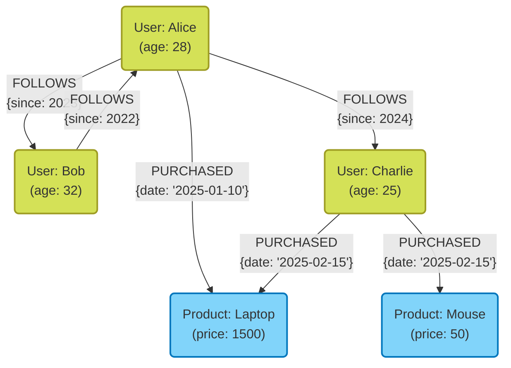

現代のシステム開発において、データの保存・管理手段としてデータベースの選定は極めて重要な意味を持ちます。かつてはリレーショナルデータベース（[RDBMS](https://kenji.blog/p/rdbms-transaction-acid-isolation-level-lock/)）が一強の時代でしたが、現在ではデータの多様化、データ量の大規模化に伴い、 **NoSQL** （Not Only SQL）データベースが重要な役割を担うようになりました。

NoSQLデータベースは単一の技術ではなく、特定のユースケースに最適化された様々なデータモデルの総称です。本記事では、RDBMSとNoSQLの決定的な違いを明らかにした上で、代表的なNoSQLの4つのデータモデルである **キー・バリュー型（KVS）** 、 **ドキュメント指向型** 、 **[グラフ](https://kenji.blog/p/tree-graph-data-structures-search-dfs-bfs-dijkstra/)型** 、 **ワイドカラム型** それぞれの特性、長所短所、および適切なユースケースについて、詳細かつ網羅的に解説します。

---

## 1. NoSQLとは？RDBMSとの違いを深く理解する

NoSQLを適切に選定するためには、まず従来のリレーショナルデータベース（RDBMS）との違いを明確に理解する必要があります。RDBMS（MySQL、PostgreSQL、Oracleなど）は、長年にわたりエンタープライズシステムの中心を担ってきました。データの整合性（[ACID](https://kenji.blog/p/rdbms-transaction-acid-isolation-level-lock/)特性）を厳密に保証し、複雑なテーブル結合（JOIN）やSQLによる柔軟なクエリをサポートする点で優れています。

しかし、ウェブサービスの大規模化や、非構造化データの急増に伴い、RDBMSのアーキテクチャでは対応が難しい課題が浮き彫りになってきました。そこで登場したのがNoSQLです。NoSQLとRDBMSの主な違いは以下の通りです。

### スキーマレスとデータ構造の柔軟性

RDBMSは、あらかじめ厳格なスキーマ（テーブルの列名やデータ型）を定義する必要があります。一度定義したスキーマを変更するにはコストがかかり、開発の俊敏性が損なわれる場合があります。
一方、多くのNoSQLデータベースは **スキーマレス** またはスキーマ柔軟なアプローチを採用しています。データの構造を事前に完全に定義する必要がなく、アプリケーションの要件変更に合わせて動的にデータの形を変えることができます。この特性は、アジャイル開発や[マイクロサービス](https://kenji.blog/p/microservices-architecture-bff-api-gateway/)アーキテクチャと非常に相性が良いと言えます。

### 水平スケーラビリティ（スケールアウト）

RDBMSのパフォーマンスを向上させるための基本的なアプローチは、サーバーのCPUやメモリを増強する **スケールアップ（垂直スケール）** です。しかし、単一サーバーの性能には物理的な限界があり、非常に高価になります。一部のRDBMSではクラスタリング機能が提供されていますが、ノードをまたぐデータの一貫性維持や分散処理には技術的なハードルがあります。

NoSQLは設計の初期段階から、複数の安価なサーバー（ノード）を並べて処理能力と記憶容量を向上させる **スケールアウト（水平スケール）** を前提としています。データを自動的に複数のノードに分散（シャーディング）し、データ量やトラフィックが増加した場合は、単にノードを追加するだけでシステム全体のスループットを向上させることができます。

### [CAP定理](https://kenji.blog/p/cap-theorem-distributed-systems-tradeoff/)と一貫性モデル

[分散システム](https://kenji.blog/p/cap-theorem-distributed-systems-tradeoff/)において、データの一貫性（ **C**onsistency ）、可用性（ **A**vailability ）、分断耐性（ **P**artition Tolerance ）の3つを同時に完全に満たすことはできないという **CAP定理** は、NoSQLの設計における重要な概念です。

RDBMSは一般的に「 **CA** （一貫性と可用性）」を重視（ネットワーク分断がない前提で）しますが、NoSQLデータベースの多くは「 **CP** （一貫性と分断耐性）」または「 **AP** （可用性と分断耐性）」のいずれかのトレードオフを選択します。特に大規模な分散環境では、厳密な一貫性を少し犠牲にして、常にシステムが応答し続ける（可用性）ことを優先し、最終的にデータが一致すればよいとする **結果整合性（Eventual [Consistency](https://kenji.blog/p/cap-theorem-distributed-systems-tradeoff/)）** というアプローチを取るものが少なくありません。

---

## 2. キー・バリュー型（Key-Value Store: KVS）

キー・バリュー型（KVS）は、NoSQLデータベースの中で最もシンプルかつ高速なデータモデルです。名前の通り、一意の「キー（Key）」とそれに対応する「バリュー（Value）」のペアだけでデータを管理します。

### データモデルと特徴

KVSは連想配列や辞書（ディクショナリ）と同じ構造を持ちます。バリューの中身はデータベース側からは単なるバイト列や文字列として扱われることが多く（一部例外あり）、内部構造を解釈してクエリを投げることは基本的にできません。データへのアクセスは「キーを指定してバリューを取得・更新・削除する」という単純な操作のみになります。

この極端なシンプルさが、KVSの最大の武器である **圧倒的なパフォーマンス** を生み出します。複雑なクエリの解析やJOIN処理が不要なため、ミリ秒からマイクロ秒単位の超低遅延でデータの読み書きが可能です。また、データが独立しているため、複数ノードへの分散（シャーディング）も極めて容易です。

### 代表的なKVSデータベース

- **Redis** : メモリ上で動作するインメモリKVSの代表格。単なる文字列だけでなく、リスト、セット、ハッシュなど多彩なデータ構造をサポートし、パブサブ機能も備える高機能KVS。
- **Memcached** : 極めてシンプルで高速な分散メモリキャッシュシステム。
- **Amazon DynamoDB** : フルマネージドで高いスケーラビリティを誇るKVS（ワイドカラムやドキュメントの側面も持つ）。

### メリットとデメリット

**メリット:**
- **超高速な処理速度** : 構造が単純なため、ディスクI/Oやメモリ操作のオーバーヘッドが最小限。
- **高いスケーラビリティ** : キーに基づいてデータを分散しやすいため、無限に近いスケールアウトが可能。

**デメリット:**
- **複雑なクエリが不可** : バリューの内容による検索（例：「年齢が20歳以上のユーザーを探す」）やデータの集計には不向き。
- **データ間の関係性の表現が困難** : リレーションシップを持たせる機能がないため、アプリケーション側で関連性を管理する必要がある。

### ユースケース

KVSは、キーから値を一意に引くことができ、かつ高速性が求められるシナリオに最適です。

- **セッション管理** : Webアプリケーションのユーザーセッション情報を保存する。キーをセッションID、バリューをセッションデータとする。
- **キャッシュ層** : RDBMSなどへのクエリ結果や、計算コストの高い処理結果を一時的に保存し、レスポンス速度を向上させる。
- **リアルタイムリーダーボード** : （特にRedisなどのソート済みセット機能を用いて）ゲームのランキングなどをリアルタイムに集計・表示する。
- **ユーザー設定やプロファイル** : ユーザーIDをキーにして、個別の設定項目（JSONなど）をバリューとして保存する。

### Redisのコード例

Redisを用いた基本的なキー・バリュー操作の例（CLIコマンド）を示します。

```text
# 単純な文字列のセットとゲット
> SET user:1001:name "Taro Yamada"
OK
> GET user:1001:name
"Taro Yamada"

# セッションなどで使える有効期限（TTL）付きのセット (3600秒 = 1時間)
> SETEX session:abcdef123456 3600 "session_data_json_here"
OK

# ハッシュ型を使ったユーザー情報の管理
> HSET user:1002 name "Hanako" age 28 city "Tokyo"
(integer) 3
> HGET user:1002 age
"28"
> HGETALL user:1002
1) "name"
2) "Hanako"
3) "age"
4) "28"
5) "city"
6) "Tokyo"
```

---

## 3. ドキュメント指向型データベース

ドキュメント指向型データベースは、KVSの柔軟性を保ちながら、より複雑なデータ構造と高度なクエリ能力を提供するデータモデルです。

### データモデルと特徴

データを「ドキュメント」と呼ばれる単位で保存します。ドキュメントの実態は、主に **JSON（JavaScript Object Notation）** やBSON（Binary JSON）、XML形式で表現される階層的なデータ構造です。

KVSと異なり、ドキュメントデータベースはバリュー（ドキュメント）の内部構造を理解しています。そのため、ドキュメント内のネストされたフィールドに対してインデックスを作成したり、条件を指定して検索、集計することが可能です。
また、関連するデータを別々のテーブルに分ける（正規化する）[RDBMS](https://kenji.blog/p/rdbms-transaction-acid-isolation-level-lock/)とは対照的に、ドキュメントデータベースでは関連データを一つのドキュメントにまとめる（非正規化・埋め込み）設計が好まれます。これにより、一度のクエリで必要なデータをすべて取得できるようになります。

### 代表的なドキュメント型データベース

- **MongoDB** : ドキュメント指向データベースのデファクトスタンダード。強力なクエリ言語と柔軟なインデックスを備え、スケーラビリティも高い。
- **Firestore / Firebase Realtime Database** : Google Cloudが提供するリアルタイム同期に強いドキュメント型データベース。
- **Couchbase** : KVSの高速性とドキュメントデータベースのクエリ能力を兼ね備えた分散型データベース。
- **Amazon DocumentDB** : MongoDB互換のフルマネージドサービス。

### メリットとデメリット

**メリット:**
- **スキーマレスな柔軟性** : ドキュメントごとに異なる構造を持たせることができ、アプリケーションのオブジェクトをそのまま保存しやすい。
- **強力なクエリ機能** : 内部フィールドでの検索、集計、ソートが可能。
- **開発効率の高さ** : ORMの複雑なマッピングが不要で、JSONベースのAPIと親和性が非常に高い。

**デメリット:**
- **複雑な[トランザクション](https://kenji.blog/p/rdbms-transaction-acid-isolation-level-lock/)の制限** : 複数ドキュメントをまたぐ更新は、RDBMSに比べてオーバーヘッドが大きい（MongoDBなど近年はマルチドキュメントトランザクションをサポートしていますが、多用は推奨されません）。
- **データサイズの肥大化** : スキーマレスによるフィールド名の重複保存や、非正規化によるデータの重複により、データサイズが大きくなりがち。

### ユースケース

ドキュメント指向型は、データ構造が頻繁に変わる場合や、複雑なデータ構造をそのまま保存したい場合に適しています。

- **コンテンツ管理システム（CMS）** : 記事、著者、タグ、コメントなど、構造が異なるコンテンツを柔軟に管理。
- **商品カタログ・在庫管理** : 家電、衣類、食品など、商品カテゴリによって必要な属性（スペック情報）が大きく異なるデータモデルに最適。
- **ユーザープロファイルと設定** : ユーザーごとに異なる任意の設定項目や属性情報を一つのドキュメントとして管理。
- **ログやイベントデータの保存** : アプリケーションが吐き出す多様な形式のログデータを、そのままJSONとして保存し後から検索・分析する。

### MongoDBのコード例

MongoDBでのドキュメントのインサートとクエリの例（mongosh または Node.jsドライバ風）を示します。

```javascript
// ドキュメントのインサート（関連データである連絡先や趣味を配列やネストしたオブジェクトとして埋め込む）
db.users.insertOne({
  user_id: "u123",
  name: "Kenji",
  age: 30,
  contact: {
    email: "kenji@example.com",
    phone: "090-1234-5678"
  },
  interests: ["NoSQL", "Cloud", "Photography"],
  status: "active"
});

// クエリ例1: statusが"active"で、ageが25以上のユーザーを検索
db.users.find({
  status: "active",
  age: { $gte: 25 }
});

// クエリ例2: interestsの配列に"NoSQL"が含まれるユーザーを検索
db.users.find({
  interests: "NoSQL"
});

// ネストされたフィールドでの検索（ドット記法を使用）
db.users.find({
  "contact.email": "kenji@example.com"
});
```

---

## 4. [グラフ](https://kenji.blog/p/tree-graph-data-structures-search-dfs-bfs-dijkstra/)データベース

グラフデータベースは、データそのものよりも「 **データとデータの間の関係性（つながり）** 」を重視して設計された特化型のデータベースです。[RDBMS](https://kenji.blog/p/rdbms-transaction-acid-isolation-level-lock/)の「リレーショナル」は実はテーブル間の関係性を扱うのにはコストがかかりますが、[グラフ](https://kenji.blog/p/tree-graph-data-structures-search-dfs-bfs-dijkstra/)データベースは文字通り関係性を第一級のオブジェクトとして扱います。

### データモデルと特徴

グラフデータベースは、数学の「グラフ理論」に基づいたデータモデルを採用しています。データを構成する主要な要素は以下の3つです。

1. **ノード（Node / Vertex）** : データのエンティティ（例：人、会社、商品など）。RDBMSの行に相当。
2. **エッジ（Edge / Relationship）** : ノード間の関係性（例：友達である、購入した、所属しているなど）。エッジには方向（向き）を持たせることができます。
3. **プロパティ（Property）** : ノードやエッジに付与されるキー・バリュー形式の属性情報（例：人の「名前」、関係性の「開始日」など）。

RDBMSで複雑な関係性をたどるには多数のJOINが必要となり、階層が深くなると急激にパフォーマンスが悪化します。しかし、グラフデータベースではノードからエッジを辿る操作（トラバーサル）が[ポインタ](https://kenji.blog/p/c-language-pointers-memory-management-stack-heap/)の移動レベルで極めて高速に行われるため、数万、数百万の関係性を瞬時に探索することができます。

### Mermaidによるグラフモデルの図解

以下は、SNSにおけるユーザー間の関係性や、商品の購入履歴をモデル化したグラフデータベースの概念図です。



### 代表的な[グラフ](https://kenji.blog/p/tree-graph-data-structures-search-dfs-bfs-dijkstra/)データベース

- **Neo4j** : 世界で最も利用されているグラフデータベース。独自の強力なクエリ言語であるCypherを採用。
- **Amazon Neptune** : AWSが提供するフルマネージドのグラフデータベース。Property [Graph](https://kenji.blog/p/tree-graph-data-structures-search-dfs-bfs-dijkstra/)（Gremlin）やRDF（SPARQL）をサポート。
- **ArangoDB** : グラフ、ドキュメント、KVSをサポートするマルチモデルデータベース。

### メリットとデメリット

**メリット:**
- **深い階層の関係性探索が超高速** : 「友達の友達の友達が買った商品」のような複雑な関係のクエリをミリ秒単位で処理可能。
- **直感的なデータモデリング** : ホワイトボードに描いた概念図をそのままデータベースのスキーマとして実装できる。

**デメリット:**
- **単一エンティティの全件スキャンに不向き** : 単純な集計処理（例：「全ユーザーの平均年齢を出す」）は、[RDBMS](https://kenji.blog/p/rdbms-transaction-acid-isolation-level-lock/)やドキュメント型の方が高速な場合が多い。
- **分散処理の難易度** : [グラフ](https://kenji.blog/p/tree-graph-data-structures-search-dfs-bfs-dijkstra/)は密結合なデータであるため、複数ノードにデータを分割（シャーディング）すると、ノード間をまたぐトラバーサルが発生しパフォーマンスが低下しやすい。

### ユースケース

データ間のつながり自体に価値があり、その関係性を深く探索・分析する必要があるシステムに不可欠です。

- **SNS（ソーシャルネットワーク）** : 友達関係、フォロー/フォロワー関係の管理。
- **レコメンデーションエンジン** : 「あなたと似た購買傾向のユーザーが買っている商品」をリアルタイムで提案する。
- **不正検知（Fraud Detection）** : 疑わしいIPアドレス、クレジットカード、アカウントの相関関係をグラフで可視化し、詐欺リングを特定する。
- **ネットワーク・ITインフラ管理** : サーバーやルーターの依存関係を管理し、障害時の影響範囲を瞬時に特定する。

### Neo4jのコード例（Cypherクエリ）

Neo4jでデータを挿入し、関係性を検索するCypherクエリ言語の例です。Cypherはアスキーアートのように関係性を表現できるのが特徴です。

```cypher
// ノードと関係性の作成
CREATE (alice:User {name: 'Alice', age: 28})
CREATE (bob:User {name: 'Bob', age: 32})
CREATE (laptop:Product {name: 'Laptop', price: 1500})
// エッジの作成
CREATE (alice)-[:FOLLOWS {since: 2023}]->(bob)
CREATE (alice)-[:PURCHASED {date: '2025-01-10'}]->(laptop);

// クエリ例1: Aliceがフォローしているユーザーを検索
MATCH (u:User {name: 'Alice'})-[:FOLLOWS]->(follower)
RETURN follower.name;

// クエリ例2: レコメンデーション（Aliceがフォローしている人が買った商品を探す）
MATCH (alice:User {name: 'Alice'})-[:FOLLOWS]->(friend)-[:PURCHASED]->(product)
// 自分が既に買っているものを除外する場合などの条件も追加可能
RETURN product.name, count(product) AS purchaseCount
ORDER BY purchaseCount DESC;
```

---

## 5. ワイドカラム型（カラム指向ストア）

ワイドカラム型データベース（またはカラムファミリーストア）は、大量のデータを複数のノードに分散して高速に書き込み・読み込みを行うことに特化したデータモデルです。GoogleのBigtable論文に影響を受けて誕生しました。

### データモデルと特徴

[RDBMS](https://kenji.blog/p/rdbms-transaction-acid-isolation-level-lock/)のような行と列からなるテーブル構造に似ていますが、内部的なデータの持ち方が大きく異なります。ワイドカラムストアのデータ構造は、主に以下の要素で構成されます。

1. **Row Key（行キー）** : 行を一意に特定するキー。データはこのキーに基づいて各ノードに分散配置されます。
2. **Column Family（カラムファミリー）** : 関連するカラム（列）のグループ。RDBMSのテーブルに似ていますが、行ごとに異なるカラムを持つことができます。
3. **Column（カラム）** : 「カラム名（Key）」「値（Value）」「タイムスタンプ」のセット。

最大の特徴は、 **行ごとにカラムの数や種類が異なっても構わない（スキーマレス）** 点と、 **数百万カラムという巨大な（ワイドな）行を持てる** 点です。
また、LSMツリー（Log-Structured Merge-tree）などのアーキテクチャを採用しており、ディスクへの書き込み（Write）処理が極めて高速かつシーケンシャルに行われるため、大量のデータを絶え間なく記録し続ける用途に圧倒的な強みを発揮します。

### Mermaidによるワイドカラムモデルの図解

以下は、センサーデータ（IoT）を記録するワイドカラムストアの論理的なデータ構造のイメージです。行ごとに任意の数のカラムを格納できます。

```mermaid
erDiagram
    %% Wide Column Store Data Structure
    ROW_KEY {
        string "Row Key (Partition Key)"
    }
    
    COLUMN_FAMILY_1 {
        string "Column 1 (Name:Value:Timestamp)"
        string "Column 2 (Name:Value:Timestamp)"
        string "Column n..."
    }
    
    COLUMN_FAMILY_2 {
        string "Column A (Name:Value:Timestamp)"
        string "Column B (Name:Value:Timestamp)"
    }
    
    ROW_KEY ||--o{ COLUMN_FAMILY_1 : contains
    ROW_KEY ||--o{ COLUMN_FAMILY_2 : contains

    %% Note: 実際の各行は、カラムファミリー内に動的で膨大な数のカラム（例えばセンサーのタイムスタンプをカラム名にするなど）を格納できます。
```

### 代表的なワイドカラム型データベース

- **Apache Cassandra** : Facebookが開発し、高い可用性とスケーラビリティ、マスターレスの分散アーキテクチャを持つ。
- **Apache HBase** : Hadoopエコシステムの一部として機能し、HDFS上に構築される巨大なワイドカラムストア。
- **ScyllaDB** : Cassandra互換でありながら、C++で書き直され、桁違いのスループットを実現。
- **Google Cloud Bigtable** : ワイドカラムストアの元祖となるフルマネージドサービス。

### メリットとデメリット

**メリット:**
- **書き込みスループットが驚異的に高い** : 数千〜数万台のサーバーからなるクラスタに毎秒数百万件の書き込みを行うことが可能。
- **単一障害点（SPOF）がない** : Cassandraなどのマスターレスアーキテクチャでは、どのノードがダウンしてもシステム全体の稼働を継続可能。
- **地理的な分散（マルチデータセンター）** : 複数のデータセンターをまたいだリアルタイムなデータレプリケーションが得意。

**デメリット:**
- **柔軟なクエリができない** : データはRow Key（およびクラスタリングキー）に基づいて物理的に配置されるため、キー以外のカラムを使った検索やJOINは基本的に不可能（あるいは著しく遅い）。アクセスパターンに合わせてテーブルを設計する「クエリ駆動モデリング」が必須。
- **学習コスト** : [RDBMS](https://kenji.blog/p/rdbms-transaction-acid-isolation-level-lock/)の正規化されたモデリング思考から切り替える必要があり、データモデリングの難易度が高い。

### ユースケース

特定のキーに基づいた大量データの書き込みと、ピンポイントでの読み出しが中心となる超大規模システムに最適です。

- **IoTのセンサーデータ / 時系列データ** : 数百万台のデバイスから毎秒送られてくる測定データを、デバイスID（Row Key）と時刻（カラム名）で記録し続ける。
- **大規模なログ収集と分析** : ウェブサイトのクリックストリームやシステムのアクセスログなど、追記（Append-Only）型のデータ保存。
- **メッセージングの履歴管理** : チャットアプリ（Discordなど）の大規模なメッセージ履歴の保存。
- **パーソナライズ/レコメンド用の特徴量ストア** : ユーザーの過去のアクティビティを高速に読み出し、機械学習モデルに渡す。

---

## 6. マルチモデルデータベースという選択肢

近年では、単一のデータベースエンジンで複数のNoSQLモデルやRDBMSの機能を統合して提供する **マルチモデルデータベース** も注目されています。

例えば、PostgreSQLは強力なJSONB型のサポートによりドキュメント型としての機能を持ち合わせています。また、Azure Cosmos DBやArangoDBのように、一つのバックエンドでKVS、ドキュメント、[グラフ](https://kenji.blog/p/tree-graph-data-structures-search-dfs-bfs-dijkstra/)を透過的に扱える製品も存在します。これにより、プロジェクト内で複数のデータベースシステムを運用する運用コスト（ポリグロット・パーシステンスの複雑さ）を抑えつつ、要件に応じた柔軟なデータアクセスが可能になります。

---

## 7. 結論：ユースケースに基づく最適な選択

これまでに見てきたように、NoSQLには「銀の弾丸」は存在しません。プロジェクトの要件に合わせて、適切なデータモデルを選択することが成功への鍵となります。最後に、選定のための簡潔なガイドラインをまとめます。

1. **セッション管理やキャッシュなど、超高速な単純な読み書きが必要か？**
   👉 **キー・バリュー型（Redis, Memcached）** を選択。
2. **データ構造が頻繁に変わり、複雑なJSONデータをそのまま保存・検索したいか？**
   👉 **ドキュメント指向型（MongoDB, Firestore）** を選択。
3. **「友達の友達」や「推薦経路」など、データ間の複雑な関係性を瞬時に探索・分析したいか？**
   👉 **グラフ型（Neo4j）** を選択。
4. **毎秒数万件レベルの大量のログやIoTデータを書き込み、無限にスケールさせたいか？**
   👉 **ワイドカラム型（Cassandra, Bigtable）** を選択。
5. **データの厳密な整合性、複雑な[トランザクション](https://kenji.blog/p/rdbms-transaction-acid-isolation-level-lock/)、多様な集計（JOIN）が必須か？**
   👉 無理にNoSQLを使わず、素直に **RDBMS（PostgreSQL, MySQL）** を選択。

近代的な大規模アーキテクチャでは、すべてのデータを一つのデータベースに保存するのではなく、[マイクロサービス](https://kenji.blog/p/microservices-architecture-bff-api-gateway/)ごとに最も適したデータベースを採用する **ポリグロット・パーシステンス（多言語永続化）** が一般的です。
各データモデルの強みと弱み、そしてRDBMSとの根本的な違いを深く理解することで、システムのパフォーマンス、スケーラビリティ、そして可用性を最大限に引き出す最適なデータベース設計が可能になるでしょう。
