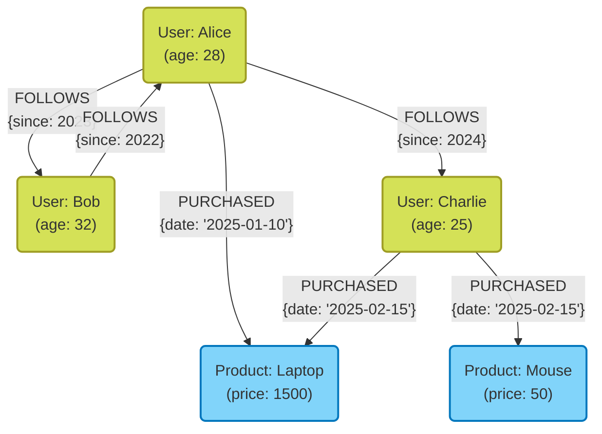
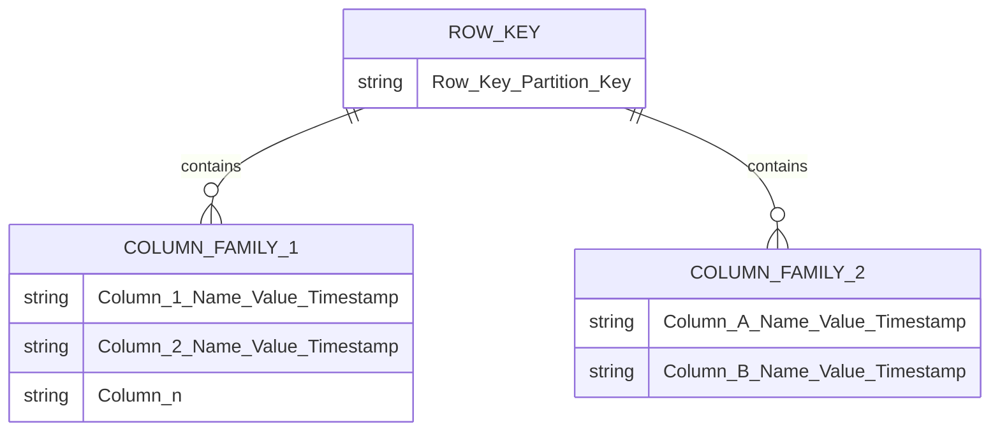

No desenvolvimento de sistemas modernos, a escolha do banco de dados como meio de armazenamento e gerenciamento de dados tem um significado extremamente importante. Houve um tempo em que os bancos de dados relacionais ([RDBMS](https://kenji.blog/pt/p/rdbms-transaction-acid-isolation-level-lock/)) dominavam, mas agora, com a diversificação e o aumento da escala dos dados, os bancos de dados **NoSQL** (Not Only SQL) passaram a desempenhar um papel fundamental.

Bancos de dados NoSQL não são uma tecnologia única, mas sim um termo geral para vários modelos de dados otimizados para casos de uso específicos. Neste artigo, após esclarecer a diferença crucial entre RDBMS e NoSQL, explicaremos detalhadamente e de forma abrangente as características, vantagens, desvantagens e casos de uso adequados de cada um dos quatro modelos de dados NoSQL representativos: **Chave-Valor (KVS)**, **Orientado a Documentos**, **Orientado a Grafos** e **Orientado a Colunas Largas**.

---

## 1. O que é NoSQL? Entendendo profundamente a diferença em relação ao RDBMS

Para escolher um NoSQL adequadamente, primeiro é necessário entender claramente a diferença em relação aos bancos de dados relacionais tradicionais (RDBMS). Os RDBMS (MySQL, PostgreSQL, Oracle, etc.) têm sido o núcleo dos sistemas corporativos por muitos anos. Eles são excelentes em garantir estritamente a consistência dos dados (propriedades [ACID](https://kenji.blog/pt/p/rdbms-transaction-acid-isolation-level-lock/)) e suportar junções complexas de tabelas (JOIN) e consultas flexíveis usando SQL.

No entanto, com o aumento da escala dos serviços da web e o rápido aumento de dados não estruturados, surgiram desafios difíceis de serem resolvidos pela arquitetura do RDBMS. É aí que entra o NoSQL. As principais diferenças entre NoSQL e RDBMS são as seguintes:

### Schemaless e flexibilidade da estrutura de dados

Os RDBMS exigem a definição de um esquema rigoroso (nomes de colunas da tabela e tipos de dados) antecipadamente. Alterar um esquema depois de definido tem um custo e pode prejudicar a agilidade do desenvolvimento.
Por outro lado, muitos bancos de dados NoSQL adotam uma abordagem **schemaless** (sem esquema) ou de esquema flexível. Não é necessário definir completamente a estrutura dos dados com antecedência, e a forma dos dados pode ser alterada dinamicamente de acordo com as mudanças nos requisitos da aplicação. Essa característica é muito compatível com desenvolvimento ágil e arquitetura de microsserviços.

### Escalabilidade horizontal (Scale-out)

A abordagem básica para melhorar o desempenho de um RDBMS é o **scale-up (escalabilidade vertical)**, que consiste em aumentar a CPU ou a memória do servidor. No entanto, o desempenho de um único servidor tem limites físicos e se torna muito caro. Embora alguns RDBMS ofereçam recursos de clusterização, manter a consistência dos dados em vários nós e o processamento distribuído apresenta obstáculos técnicos.

Desde a fase inicial de projeto, o NoSQL pressupõe o **scale-out (escalabilidade horizontal)**, onde múltiplos servidores (nós) baratos são alinhados para melhorar a capacidade de processamento e a capacidade de armazenamento. Os dados são distribuídos automaticamente por vários nós (sharding), e se o volume de dados ou o tráfego aumentar, o throughput geral do sistema pode ser melhorado simplesmente adicionando mais nós.

### Teorema CAP e modelo de consistência

Em sistemas distribuídos, o **teorema CAP** afirma que é impossível satisfazer simultaneamente a consistência dos dados (**C**onsistency), a disponibilidade (**A**vailability) e a tolerância a partições (**P**artition Tolerance). Este é um conceito importante no projeto de NoSQL.

Os RDBMS geralmente enfatizam " **CA** (Consistência e Disponibilidade)" (assumindo que não há partições de rede), mas muitos bancos de dados NoSQL escolhem a compensação de " **CP** (Consistência e Tolerância a Partições)" ou " **AP** (Disponibilidade e Tolerância a Partições)". Especialmente em ambientes distribuídos de grande escala, muitos adotam a abordagem de **consistência eventual (Eventual [Consistency](https://kenji.blog/pt/p/cap-theorem-distributed-systems-tradeoff/))**, sacrificando ligeiramente a consistência rigorosa para priorizar que o sistema continue sempre a responder (disponibilidade), contanto que os dados se tornem consistentes no final.

---

## 2. Modelo Chave-Valor (Key-Value Store: KVS)

O modelo Chave-Valor (KVS) é o modelo de dados mais simples e rápido entre os bancos de dados NoSQL. Como o nome sugere, ele gerencia os dados usando apenas um par de uma "Chave (Key)" exclusiva e seu "Valor (Value)" correspondente.

### Modelo de dados e características

O KVS possui a mesma estrutura que arrays associativos ou dicionários. O conteúdo do valor geralmente é tratado pelo lado do banco de dados como uma simples sequência de bytes ou string (com algumas exceções), e basicamente não é possível interpretar a estrutura interna para realizar consultas. O acesso aos dados é feito através de operações simples de "obter, atualizar ou excluir o valor especificando a chave".

Essa extrema simplicidade gera a maior arma do KVS: **desempenho avassalador**. Como a análise de consultas complexas e o processamento de JOIN não são necessários, a leitura e gravação de dados são possíveis com latência ultrabaixa em milissegundos ou microssegundos. Além disso, como os dados são independentes, a distribuição para vários nós (sharding) é extremamente fácil.

### Bancos de dados KVS representativos

- **Redis**: O KVS em memória mais representativo. É um KVS de alto desempenho que suporta várias estruturas de dados além de strings simples, como listas, conjuntos e hashes, e também possui recursos de pub/sub.
- **Memcached**: Sistema de cache de memória distribuído extremamente simples e rápido.
- **Amazon DynamoDB**: Um KVS totalmente gerenciado com alta escalabilidade (também possui aspectos de coluna larga e documento).

### Vantagens e desvantagens

**Vantagens:**
- **Velocidade de processamento ultrarrápida**: Como a estrutura é simples, a sobrecarga de I/O de disco e manipulação de memória é mínima.
- **Alta escalabilidade**: Como é fácil distribuir os dados com base nas chaves, a escalabilidade horizontal quase infinita é possível.

**Desvantagens:**
- **Consultas complexas não são possíveis**: Não é adequado para pesquisa baseada no conteúdo do valor (ex: "Encontrar usuários com 20 anos ou mais") ou para agregação de dados.
- **Difícil expressar relações entre os dados**: Como não há função de relacionamento, é necessário gerenciar os relacionamentos do lado da aplicação.

### Casos de uso

O KVS é ideal para cenários onde você pode recuperar um valor exclusivamente por meio de uma chave e precisa de alta velocidade.

- **Gerenciamento de sessão**: Armazenar informações da sessão do usuário de uma aplicação web. A chave é o ID da sessão e o valor são os dados da sessão.
- **Camada de cache**: Armazenar temporariamente resultados de consultas a RDBMS, etc., e resultados de processamento com alto custo computacional, melhorando a velocidade de resposta.
- **Placar de líderes em tempo real**: (Especialmente usando recursos como conjuntos ordenados no Redis) para agregar e exibir classificações de jogos em tempo real.
- **Configurações e perfis de usuário**: Usar o ID do usuário como chave e itens de configuração individuais (como JSON) como valor.

### Exemplo de código do Redis

Abaixo está um exemplo (comandos CLI) de operações básicas de chave-valor usando o Redis.

```text
# Definir e obter uma string simples
> SET user:1001:name "Taro Yamada"
OK
> GET user:1001:name
"Taro Yamada"

# Definir com tempo de expiração (TTL) que pode ser usado em sessões, etc. (3600 segundos = 1 hora)
> SETEX session:abcdef123456 3600 "session_data_json_here"
OK

# Gerenciamento de informações do usuário usando o tipo hash
> HSET user:1002 name "Hanako" age 28 city "Tokyo"
(integer) 3
> HGET user:1002 age
"28"
> HGETALL user:1002
1) "name"
2) "Hanako"
3) "age"
4) "28"
5) "city"
6) "Tokyo"
```

---

## 3. Banco de dados Orientado a Documentos

O banco de dados orientado a documentos é um modelo de dados que oferece estruturas de dados mais complexas e recursos avançados de consulta, mantendo a flexibilidade do KVS.

### Modelo de dados e características

Os dados são armazenados em unidades chamadas "documentos". A realidade de um documento é uma estrutura de dados hierárquica representada principalmente em **JSON (JavaScript Object Notation)**, BSON (Binary JSON) ou formato XML.

Ao contrário do KVS, o banco de dados de documentos entende a estrutura interna do valor (documento). Portanto, é possível criar índices para campos aninhados dentro de um documento e pesquisar ou agregar especificando condições.
Além disso, em contraste com os [RDBMS](https://kenji.blog/pt/p/rdbms-transaction-acid-isolation-level-lock/), onde os dados relacionados são divididos em tabelas separadas (normalizados), os bancos de dados de documentos preferem um design onde os dados relacionados são agrupados em um único documento (desnormalização / incorporação). Isso permite recuperar todos os dados necessários com uma única consulta.

### Bancos de dados de documentos representativos

- **MongoDB**: O padrão de fato dos bancos de dados orientados a documentos. Possui uma linguagem de consulta poderosa e índices flexíveis, com alta escalabilidade.
- **Firestore / Firebase Realtime Database**: Bancos de dados de documentos focados em sincronização em tempo real fornecidos pelo Google Cloud.
- **Couchbase**: Um banco de dados distribuído que combina a velocidade do KVS com a capacidade de consulta do banco de dados de documentos.
- **Amazon DocumentDB**: Um serviço totalmente gerenciado compatível com o MongoDB.

### Vantagens e desvantagens

**Vantagens:**
- **Flexibilidade Schemaless**: É possível ter estruturas diferentes para cada documento, facilitando o armazenamento de objetos da aplicação como eles são.
- **Poderosos recursos de consulta**: Pesquisa, agregação e classificação em campos internos são possíveis.
- **Alta eficiência de desenvolvimento**: Mapeamentos complexos de ORM não são necessários e há uma afinidade muito alta com APIs baseadas em JSON.

**Desvantagens:**
- **Limitações de transações complexas**: As atualizações envolvendo múltiplos documentos têm uma sobrecarga maior em comparação aos RDBMS (embora, recentemente, o MongoDB e outros suportem transações de múltiplos documentos, seu uso excessivo não é recomendado).
- **Inchaço no tamanho dos dados**: O tamanho dos dados tende a se tornar grande devido à repetição de nomes de campos na abordagem schemaless e dados duplicados devido à desnormalização.

### Casos de uso

O modelo orientado a documentos é adequado para os casos em que a estrutura dos dados muda com frequência ou quando você deseja armazenar estruturas de dados complexas como elas são.

- **Sistemas de gerenciamento de conteúdo (CMS)**: Gerenciamento flexível de conteúdo com estruturas diferentes, como artigos, autores, tags, comentários, etc.
- **Catálogo de produtos / Gerenciamento de inventário**: Ideal para modelos de dados onde os atributos necessários (informações de especificações) variam muito dependendo da categoria do produto, como eletrodomésticos, roupas, alimentos.
- **Perfis e configurações de usuário**: Gerenciar itens de configuração arbitrários ou atributos que diferem por usuário como um único documento.
- **Armazenamento de logs e dados de eventos**: Armazenar os vários formatos de dados de log gerados pela aplicação como JSON e pesquisá-los/analisá-los posteriormente.

### Exemplo de código do MongoDB

Abaixo está um exemplo de inserção e consulta de documentos no MongoDB (estilo driver mongosh ou Node.js).

```javascript
// Inserção de documento (dados relacionados, como contato e interesses, são incorporados como arrays ou objetos aninhados)
db.users.insertOne({
  user_id: "u123",
  name: "Kenji",
  age: 30,
  contact: {
    email: "kenji@example.com",
    phone: "090-1234-5678"
  },
  interests: ["NoSQL", "Cloud", "Photography"],
  status: "active"
});

// Exemplo de consulta 1: Encontrar usuários cujo status é "active" e a idade é de 25 anos ou mais
db.users.find({
  status: "active",
  age: { $gte: 25 }
});

// Exemplo de consulta 2: Encontrar usuários cuja matriz de interesses inclua "NoSQL"
db.users.find({
  interests: "NoSQL"
});

// Pesquisa em campos aninhados (usando notação de ponto)
db.users.find({
  "contact.email": "kenji@example.com"
});
```

---

## 4. Banco de Dados Orientado a Grafos

O banco de dados orientado a grafos é um banco de dados especializado projetado com ênfase nas " **relações (conexões) entre os dados** " em vez de nos próprios dados. Embora o termo "relacional" no [RDBMS](https://kenji.blog/pt/p/rdbms-transaction-acid-isolation-level-lock/) na verdade acarrete um custo para lidar com relacionamentos entre tabelas, o banco de dados orientado a grafos trata literalmente os relacionamentos como objetos de primeira classe.

### Modelo de dados e características

Os bancos de dados orientados a grafos adotam um modelo de dados baseado na "Teoria dos Grafos" da matemática. Os três principais elementos que compõem os dados são:

1. **Nós (Node / Vertex)**: As entidades dos dados (ex: pessoa, empresa, produto, etc.). Equivale a uma linha no RDBMS.
2. **Arestas (Edge / Relationship)**: A relação entre os nós (ex: ser amigo de, comprou, pertence a, etc.). As arestas podem ter direção.
3. **Propriedades (Property)**: Informações de atributos no formato de chave-valor associadas a nós e arestas (ex: "nome" de uma pessoa, "data de início" de um relacionamento, etc.).

No RDBMS, rastrear relacionamentos complexos requer muitos JOINs e, à medida que a hierarquia se torna mais profunda, o desempenho cai drasticamente. No entanto, em um banco de dados orientado a grafos, a operação de travessia (traversal) de um nó para uma aresta ocorre em alta velocidade ao nível de um movimento de ponteiro, permitindo explorar dezenas de milhares a milhões de relações instantaneamente.

### Diagrama do modelo de grafo usando Mermaid

Abaixo está um diagrama conceitual de um banco de dados de grafos que modela relacionamentos entre usuários em um SNS e o histórico de compras de produtos.



### Bancos de dados de grafos representativos

- **Neo4j**: O banco de dados de grafos mais utilizado no mundo. Adota Cypher, sua própria poderosa linguagem de consulta.
- **Amazon Neptune**: Um banco de dados de grafos totalmente gerenciado fornecido pela AWS. Suporta Property [Graph](https://kenji.blog/pt/p/tree-graph-data-structures-search-dfs-bfs-dijkstra/) (Gremlin) e RDF (SPARQL).
- **ArangoDB**: Um banco de dados multimodelo que suporta grafos, documentos e KVS.

### Vantagens e desvantagens

**Vantagens:**
- **Exploração ultrarrápida de relacionamentos em hierarquias profundas**: Pode processar consultas de relacionamento complexas como "O produto comprado pelo amigo do amigo do meu amigo" em milissegundos.
- **Modelagem intuitiva de dados**: O diagrama conceitual desenhado em um quadro branco pode ser implementado como o esquema do banco de dados exatamente daquela forma.

**Desvantagens:**
- **Inadequado para pesquisa completa de entidades únicas**: O processamento simples de agregação (ex: "Calcular a idade média de todos os usuários") é frequentemente mais rápido em [RDBMS](https://kenji.blog/pt/p/rdbms-transaction-acid-isolation-level-lock/) ou bancos de dados orientados a documentos.
- **Dificuldade de processamento distribuído**: Como os grafos são dados fortemente acoplados, dividir (fazer sharding) os dados entre vários nós faz com que as travessias se espalhem pelos nós, o que pode degradar facilmente o desempenho.

### Casos de uso

É essencial para sistemas onde as próprias conexões entre os dados têm valor e esses relacionamentos precisam ser profundamente explorados e analisados.

- **Redes Sociais (SNS)**: Gerenciamento de relacionamentos de amigos e seguidores.
- **Motores de recomendação**: Sugerir produtos em tempo real que "foram comprados por usuários com tendências de compra semelhantes às suas".
- **Detecção de fraudes (Fraud Detection)**: Visualizar correlações de endereços IP suspeitos, cartões de crédito e contas como um grafo para identificar círculos de fraude.
- **Gerenciamento de rede / infraestrutura de TI**: Gerenciar as dependências de servidores e roteadores para identificar instantaneamente o escopo do impacto durante uma falha.

### Exemplo de código do Neo4j (Consulta Cypher)

Exemplo da linguagem de consulta Cypher para inserir dados e pesquisar relacionamentos no Neo4j. Cypher possui a característica de poder expressar relacionamentos como arte ASCII.

```cypher
// Criação de nós e relacionamentos
CREATE (alice:User {name: 'Alice', age: 28})
CREATE (bob:User {name: 'Bob', age: 32})
CREATE (laptop:Product {name: 'Laptop', price: 1500})
// Criação de arestas
CREATE (alice)-[:FOLLOWS {since: 2023}]->(bob)
CREATE (alice)-[:PURCHASED {date: '2025-01-10'}]->(laptop);

// Exemplo de consulta 1: Encontrar os usuários que Alice segue
MATCH (u:User {name: 'Alice'})-[:FOLLOWS]->(follower)
RETURN follower.name;

// Exemplo de consulta 2: Recomendação (Encontrar os produtos comprados pelas pessoas que Alice segue)
MATCH (alice:User {name: 'Alice'})-[:FOLLOWS]->(friend)-[:PURCHASED]->(product)
// Também é possível adicionar condições, como excluir produtos que você já comprou
RETURN product.name, count(product) AS purchaseCount
ORDER BY purchaseCount DESC;
```

---

## 5. Modelo de Colunas Largas (Orientado a Colunas)

Os bancos de dados do tipo colunas largas (ou column-family stores) são modelos de dados especializados em escrever e ler grandes quantidades de dados em alta velocidade através da distribuição por múltiplos nós. Surgiu influenciado pelo paper Bigtable do Google.

### Modelo de dados e características

Embora seja semelhante à estrutura de tabelas consistindo de linhas e colunas em um [RDBMS](https://kenji.blog/pt/p/rdbms-transaction-acid-isolation-level-lock/), a maneira interna de manter os dados é muito diferente. A estrutura de dados do wide-column store é composta principalmente pelos seguintes elementos:

1. **Row Key (Chave da linha)**: A chave que identifica unicamente a linha. Os dados são distribuídos para cada nó com base nessa chave.
2. **Column Family (Família de colunas)**: Um grupo de colunas relacionadas. Semelhante a tabelas em RDBMS, mas cada linha pode ter diferentes colunas.
3. **Column (Coluna)**: Um conjunto contendo "Nome da Coluna (Chave)", "Valor" e "Carimbo de data/hora".

A maior característica é que **o número e o tipo de colunas podem variar de linha para linha (schemaless)**, e que **uma linha pode ter uma quantidade colossal (larga) de colunas (na ordem de milhões)**.
Além disso, adotando arquiteturas como a árvore LSM (Log-Structured Merge-tree), o processamento de gravação no disco é executado sequencialmente em velocidade altíssima, o que mostra uma vantagem esmagadora no uso de gravação contínua de grandes volumes de dados.

### Diagrama do modelo de colunas largas usando Mermaid

Abaixo está uma imagem da estrutura lógica de dados de um armazenamento de colunas largas gravando dados de sensores (IoT). Pode armazenar um número arbitrário de colunas por linha.



### Bancos de dados de colunas largas representativos

- **Apache Cassandra**: Desenvolvido pelo Facebook, possui alta disponibilidade, escalabilidade e uma arquitetura distribuída sem mestre (masterless).
- **Apache HBase**: Funciona como parte do ecossistema Hadoop, sendo um imenso armazenamento de colunas largas construído sobre o HDFS.
- **ScyllaDB**: Embora compatível com Cassandra, foi reescrito em C++ para fornecer rendimento formidável.
- **Google Cloud Bigtable**: O serviço totalmente gerenciado e ancestral do wide-column store.

### Vantagens e desvantagens

**Vantagens:**
- **Taxa de transferência de gravação incrivelmente alta**: Pode gravar milhões de registros por segundo em um cluster contendo milhares a dezenas de milhares de servidores.
- **Sem Ponto Único de Falha (SPOF)**: Em uma arquitetura sem mestre, como a do Cassandra, o sistema como um todo pode continuar operando mesmo se qualquer nó falhar.
- **Distribuição geográfica (Multi-Data Center)**: É bom em replicação de dados em tempo real através de múltiplos data centers.

**Desvantagens:**
- **Consultas flexíveis não são possíveis**: Como os dados são alocados fisicamente com base na Row Key (e chave de clusterização), pesquisas ou JOIN usando colunas que não sejam essas chaves são essencialmente impossíveis (ou extremamente lentas). A "Modelagem Dirigida por Consulta", projetando a tabela de acordo com o padrão de acesso, é fundamental.
- **Custo de aprendizado**: É necessário se afastar do pensamento de modelagem normalizado do [RDBMS](https://kenji.blog/pt/p/rdbms-transaction-acid-isolation-level-lock/), tornando a dificuldade da modelagem de dados alta.

### Casos de uso

Ideal para sistemas de grandíssima escala focados na gravação de enormes volumes de dados baseados em uma chave específica e na sua leitura direcionada.

- **Dados de sensores de IoT / Dados de séries temporais**: Registrar continuamente dados de medição enviados a cada segundo de milhões de dispositivos, com base no ID do dispositivo (Row Key) e horário (nome da coluna).
- **Coleta e análise de logs em larga escala**: Salvar dados do tipo Append-Only, como o fluxo de cliques em um site e logs de acesso de sistemas.
- **Gerenciamento de histórico de mensagens**: Salvar grande histórico de mensagens para aplicativos de bate-papo (como o Discord).
- **Loja de recursos (Feature Store) para personalização/recomendação**: Ler a atividade passada dos usuários rapidamente e passá-la a um modelo de aprendizado de máquina.

---

## 6. A Opção dos Bancos de Dados Multimodelo

Recentemente, tem havido muita atenção nos **bancos de dados multimodelo**, que integram vários modelos NoSQL e recursos RDBMS sob um único mecanismo de banco de dados.

Por exemplo, o PostgreSQL, graças ao seu forte suporte ao tipo JSONB, também possui capacidades de banco de dados orientado a documentos. Também há produtos como o Azure Cosmos DB e ArangoDB, que podem gerenciar de forma transparente KVS, Documentos e Grafos com o mesmo back-end. Isso permite um acesso a dados flexível de acordo com os requisitos, mitigando o custo operacional de gerenciar vários sistemas de banco de dados dentro de um projeto (a complexidade da persistência poliglota).

---

## 7. Conclusão: A Melhor Escolha com Base no Caso de Uso

Como vimos, não existe uma "bala de prata" quando se trata de NoSQL. A chave para o sucesso é escolher o modelo de dados adequado de acordo com os requisitos do projeto. Por fim, aqui estão algumas diretrizes resumidas para seleção:

1. **Você precisa de uma operação de leitura/gravação simples e super rápida, como gerenciamento de sessão ou cache?**
   👉 Escolha **Chave-Valor (Redis, Memcached)**.
2. **A estrutura dos dados muda com frequência e você deseja armazenar/pesquisar dados JSON complexos como eles são?**
   👉 Escolha **Orientado a Documentos (MongoDB, Firestore)**.
3. **Você deseja explorar/analisar instantaneamente relações complexas de dados como os "amigos de amigos" e "rotas de recomendação"?**
   👉 Escolha **Orientado a Grafos (Neo4j)**.
4. **Você deseja gravar grandes quantidades de logs ou dados de IoT ao nível de dezenas de milhares por segundo e escalar infinitamente?**
   👉 Escolha **Colunas Largas (Cassandra, Bigtable)**.
5. **Consistência estrita de dados, transações complexas ou agregações diversas (JOIN) são absolutamente necessários?**
   👉 Não force o uso de NoSQL; simplesmente escolha um **RDBMS (PostgreSQL, MySQL)**.

Nas arquiteturas modernas em larga escala, em vez de armazenar todos os dados em um único banco de dados, é comum usar a **Persistência Poliglota** (polyglot persistence), onde o banco de dados mais adequado é adotado para cada microsserviço.
Entender profundamente as vantagens e desvantagens de cada modelo de dados e a diferença fundamental em relação aos RDBMS, permitirá a elaboração do design do banco de dados mais ideal que maximiza o desempenho, a escalabilidade e a disponibilidade do seu sistema.
