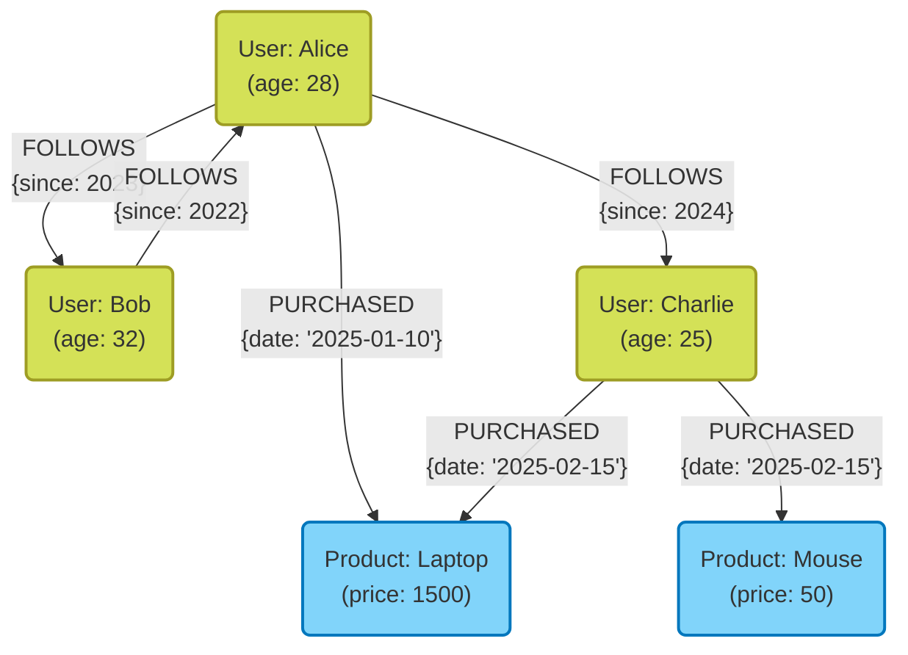

В современной разработке систем выбор базы данных как средства хранения и управления данными имеет крайне важное значение. В прошлом безраздельно правили реляционные базы данных ([RDBMS](https://kenji.blog/ru/p/rdbms-transaction-acid-isolation-level-lock/)), но сегодня, в связи с диверсификацией и масштабным ростом объемов данных, базы данных **NoSQL** (Not Only SQL) стали играть важнейшую роль.

Базы данных NoSQL — это не одна конкретная технология, а собирательное название различных моделей данных, оптимизированных для специфических вариантов использования. В этой статье мы сначала проясним принципиальные различия между RDBMS и NoSQL, а затем подробно и всесторонне рассмотрим характеристики, плюсы, минусы и подходящие сценарии использования четырех основных моделей данных NoSQL: **Ключ-Значение (KVS)**, **Документо-ориентированных**, **Графовых** и **Ширококолоночных**.

---

## 1. Что такое NoSQL? Глубокое понимание отличий от RDBMS

Чтобы правильно выбрать NoSQL, необходимо четко понимать отличия от традиционных реляционных баз данных (RDBMS). RDBMS (такие как MySQL, PostgreSQL, Oracle) на протяжении многих лет являются основой корпоративных систем. Их преимущество заключается в строгом обеспечении согласованности данных (свойства [ACID](https://kenji.blog/ru/p/rdbms-transaction-acid-isolation-level-lock/)), поддержке сложных объединений таблиц (JOIN) и гибких запросов с использованием SQL.

Однако с ростом масштабов веб-сервисов и стремительным увеличением объемов неструктурированных данных архитектура RDBMS стала сталкиваться с проблемами, которые трудно решить. Именно тогда и появились NoSQL. Основные отличия между NoSQL и RDBMS заключаются в следующем:

### Отсутствие схемы и гибкость структуры данных

В RDBMS необходимо заранее определять строгую схему (названия столбцов и типы данных таблиц). Изменение однажды определенной схемы обходится дорого и может снизить скорость разработки.
С другой стороны, многие базы данных NoSQL используют подход **без схемы (schemaless)** или с гибкой схемой. Нет необходимости заранее полностью определять структуру данных, что позволяет динамически изменять форму данных в соответствии с меняющимися требованиями приложения. Можно сказать, что эта особенность очень хорошо сочетается с agile-разработкой и микросервисной архитектурой.

### Горизонтальная масштабируемость (Scale-out)

Основной подход к повышению производительности RDBMS — это **вертикальное масштабирование (Scale-up)**, то есть увеличение мощности процессора и памяти сервера. Однако у производительности одного сервера есть физический предел, и это обходится очень дорого. Некоторые RDBMS предлагают функции кластеризации, но поддержание согласованности данных между узлами и распределенная обработка представляют собой технические барьеры.

NoSQL с самого начала проектируются с расчетом на **горизонтальное масштабирование (Scale-out)**, что предполагает параллельную работу множества недорогих серверов (узлов) для повышения вычислительной мощности и емкости хранения. Данные автоматически распределяются по множеству узлов (шардинг), и при увеличении объема данных или трафика можно повысить общую пропускную способность системы, просто добавив новые узлы.

### Теорема CAP и модели согласованности

В распределенных системах невозможно одновременно обеспечить согласованность данных (**C**onsistency), доступность (**A**vailability) и устойчивость к разделению (**P**artition Tolerance). **Теорема CAP**, утверждающая это, является важной концепцией при проектировании NoSQL.

RDBMS обычно отдают приоритет **CA** (согласованность и доступность) (при условии отсутствия разделения сети), в то время как многие базы данных NoSQL выбирают компромисс: либо **CP** (согласованность и устойчивость к разделению), либо **AP** (доступность и устойчивость к разделению). Особенно в крупномасштабных распределенных средах многие применяют подход **согласованности в конечном счете (Eventual [Consistency](https://kenji.blog/ru/p/cap-theorem-distributed-systems-tradeoff/))**, немного жертвуя строгой согласованностью ради того, чтобы система всегда продолжала отвечать (доступность), с расчетом на то, что в конечном итоге данные придут в согласованное состояние.

---

## 2. Ключ-Значение (Key-Value Store: KVS)

Модель ключ-значение (KVS) — самая простая и быстрая модель данных среди баз данных NoSQL. Как следует из названия, она управляет данными только с помощью пар уникальных «Ключей (Key)» и соответствующих им «Значений (Value)».

### Модель данных и особенности

KVS имеет структуру, аналогичную ассоциативному массиву или словарю. Содержимое значения со стороны базы данных чаще всего рассматривается просто как массив байтов или строка (с некоторыми исключениями), и, как правило, невозможно интерпретировать внутреннюю структуру для выполнения запросов. Доступ к данным сводится только к простым операциям: «получить, обновить или удалить значение по заданному ключу».

Эта предельная простота порождает **ошеломляющую производительность**, которая является главным оружием KVS. Поскольку нет необходимости анализировать сложные запросы или выполнять JOIN-операции, чтение и запись данных могут выполняться с ультранизкой задержкой в миллисекундах или микросекундах. Кроме того, поскольку данные независимы, их распределение по множеству узлов (шардинг) происходит чрезвычайно легко.

### Представители баз данных KVS

- **Redis**: Главный представитель In-Memory KVS. Поддерживает не только простые строки, но и разнообразные структуры данных (списки, множества, хэши), а также обладает функциями [Pub/Sub](https://kenji.blog/ru/p/event-driven-architecture-message-queue-kafka-rabbitmq/).
- **Memcached**: Предельно простая и быстрая распределенная система кэширования в памяти.
- **Amazon DynamoDB**: Полностью управляемая KVS с высокой масштабируемостью (также имеет черты ширококолоночных и документных БД).

### Преимущества и недостатки

**Преимущества:**
- **Сверхвысокая скорость обработки**: Благодаря простой структуре накладные расходы на дисковый ввод-вывод и операции с памятью минимальны.
- **Высокая масштабируемость**: Данные легко распределять на основе ключей, что позволяет практически безгранично масштабироваться горизонтально.

**Недостатки:**
- **Невозможность сложных запросов**: Не подходит для поиска по содержимому значений (например, «найти пользователей старше 20 лет») или агрегации данных.
- **Сложность выражения связей между данными**: Поскольку отсутствуют функции для установления связей, приложению приходится самому управлять ими.

### Сценарии использования

KVS идеально подходит для сценариев, где необходимо уникально получать значение по ключу и требуется высокая скорость.

- **Управление сессиями**: Хранение информации о сессиях пользователей веб-приложений. Ключом является идентификатор сессии, а значением — данные сессии.
- **Уровень кэширования**: Временное хранение результатов запросов к RDBMS или результатов ресурсоемких вычислений для повышения скорости отклика.
- **Таблицы лидеров в реальном времени**: (Особенно с использованием функции отсортированных множеств Redis) подсчет и отображение игровых рейтингов в реальном времени.
- **Пользовательские настройки и профили**: Использование идентификатора пользователя в качестве ключа и хранение индивидуальных настроек (например, в формате JSON) в качестве значения.

### Пример кода для Redis

Пример базовых операций ключ-значение с использованием Redis (команды CLI).

```text
# Простая установка и получение строки
> SET user:1001:name "Taro Yamada"
OK
> GET user:1001:name
"Taro Yamada"

# Установка с временем жизни (TTL) для использования в сессиях и т.п. (3600 секунд = 1 час)
> SETEX session:abcdef123456 3600 "session_data_json_here"
OK

# Управление информацией о пользователе с использованием типа хэш
> HSET user:1002 name "Hanako" age 28 city "Tokyo"
(integer) 3
> HGET user:1002 age
"28"
> HGETALL user:1002
1) "name"
2) "Hanako"
3) "age"
4) "28"
5) "city"
6) "Tokyo"
```

---

## 3. Документо-ориентированные базы данных

Документо-ориентированные базы данных — это модель данных, которая сохраняет гибкость KVS, но предоставляет более сложные структуры данных и расширенные возможности запросов.

### Модель данных и особенности

Данные сохраняются в виде единиц, называемых «документами». Документы в основном представляют собой иерархические структуры данных, выраженные в форматах **JSON (JavaScript Object Notation)**, BSON (Binary JSON) или XML.

В отличие от KVS, документо-ориентированная база данных «понимает» внутреннюю структуру значения (документа). Это позволяет создавать индексы для вложенных полей внутри документа, а также осуществлять поиск и агрегацию по заданным условиям.
Кроме того, в отличие от [RDBMS](https://kenji.blog/ru/p/rdbms-transaction-acid-isolation-level-lock/), где связанные данные разделяются по разным таблицам (нормализация), в документо-ориентированных базах данных предпочтителен дизайн, при котором связанные данные объединяются в один документ (денормализация, встраивание). Это позволяет получить все необходимые данные за один запрос.

### Представители документо-ориентированных баз данных

- **MongoDB**: Фактический стандарт среди документо-ориентированных баз данных. Обладает мощным языком запросов, гибкими индексами и высокой масштабируемостью.
- **Firestore / Firebase Realtime Database**: Документная база данных от Google Cloud, сильная в синхронизации в реальном времени.
- **Couchbase**: Распределенная база данных, сочетающая высокую скорость KVS с возможностями запросов документных баз данных.
- **Amazon DocumentDB**: Полностью управляемый сервис, совместимый с MongoDB.

### Преимущества и недостатки

**Преимущества:**
- **Гибкость без жесткой схемы**: Каждый документ может иметь свою собственную структуру, что облегчает сохранение объектов приложения «как есть».
- **Мощные функции запросов**: Возможен поиск, агрегация и сортировка по внутренним полям.
- **Высокая эффективность разработки**: Нет необходимости в сложных ORM-отображениях, отличная совместимость с JSON-базированными API.

**Недостатки:**
- **Ограничения для сложных транзакций**: Обновление данных, затрагивающее несколько документов, имеет бóльшие накладные расходы по сравнению с RDBMS (хотя в последнее время, например в MongoDB, поддерживаются транзакции для нескольких документов, их частое использование не рекомендуется).
- **Разрастание размера данных**: Из-за отсутствия схемы имена полей сохраняются многократно, а денормализация приводит к дублированию данных, что увеличивает их объем.

### Сценарии использования

Документо-ориентированные базы данных подходят в тех случаях, когда структура данных часто меняется или требуется сохранять сложные структуры данных в первозданном виде.

- **Системы управления контентом (CMS)**: Гибкое управление контентом с разной структурой, таким как статьи, авторы, теги, комментарии.
- **Каталоги товаров и управление запасами**: Идеально подходит для моделей данных, где необходимые атрибуты (спецификации) сильно различаются в зависимости от категории товара (бытовая техника, одежда, продукты питания и т.д.).
- **Профили пользователей и настройки**: Управление произвольными настройками и атрибутами, которые различаются для каждого пользователя, в виде единого документа.
- **Сохранение логов и данных о событиях**: Сохранение разнообразных форматов логов, генерируемых приложениями, в виде JSON для последующего поиска и анализа.

### Пример кода для MongoDB

Пример вставки документа и запроса в MongoDB (в стиле mongosh или драйвера Node.js).

```javascript
// Вставка документа (связанные данные, такие как контакты и интересы, встраиваются в виде массива или вложенного объекта)
db.users.insertOne({
  user_id: "u123",
  name: "Kenji",
  age: 30,
  contact: {
    email: "kenji@example.com",
    phone: "090-1234-5678"
  },
  interests: ["NoSQL", "Cloud", "Photography"],
  status: "active"
});

// Пример запроса 1: Поиск пользователей со статусом "active" и возрастом 25 лет и старше
db.users.find({
  status: "active",
  age: { $gte: 25 }
});

// Пример запроса 2: Поиск пользователей, у которых массив interests содержит "NoSQL"
db.users.find({
  interests: "NoSQL"
});

// Поиск по вложенному полю (с использованием точечной нотации)
db.users.find({
  "contact.email": "kenji@example.com"
});
```

---

## 4. Графовые базы данных

Графовые базы данных — это специализированные базы данных, разработанные с акцентом не столько на сами данные, сколько на «**отношения (связи) между данными**». В [RDBMS](https://kenji.blog/ru/p/rdbms-transaction-acid-isolation-level-lock/) термин «реляционный» на самом деле означает, что работа со связями между таблицами обходится дорого, в то время как графовые базы данных в буквальном смысле рассматривают связи как объекты первого класса.

### Модель данных и особенности

Графовые базы данных используют модель данных, основанную на математической «теории графов». Основные элементы, составляющие данные, следующие:

1. **Узел (Node / Vertex)**: Сущность данных (например, человек, компания, продукт и т.д.). Эквивалент строки в RDBMS.
2. **Ребро (Edge / Relationship)**: Связь между узлами (например, «является другом», «купил», «состоит в» и т.д.). Ребра могут иметь направление.
3. **Свойство (Property)**: Атрибутивная информация в формате ключ-значение, прикрепленная к узлам или ребрам (например, «имя» человека, «дата начала» отношений и т.д.).

Отслеживание сложных связей в RDBMS требует множества JOIN, и по мере увеличения глубины иерархии производительность резко падает. Однако в графовых базах данных операция перехода от узла к ребру (обход графа) выполняется на уровне перемещения указателей с чрезвычайно высокой скоростью, что позволяет мгновенно исследовать десятки и сотни тысяч связей.

### Иллюстрация графовой модели с помощью Mermaid

Ниже приведена концептуальная схема графовой базы данных, моделирующая отношения между пользователями в социальных сетях и историю покупок продуктов.



### Представители графовых баз данных

- **Neo4j**: Самая используемая графовая база данных в мире. Использует собственный мощный язык запросов Cypher.
- **Amazon Neptune**: Полностью управляемая графовая база данных от AWS. Поддерживает Property [Graph](https://kenji.blog/ru/p/tree-graph-data-structures-search-dfs-bfs-dijkstra/) (Gremlin) и RDF (SPARQL).
- **ArangoDB**: Мультимодельная база данных, поддерживающая графы, документы и KVS.

### Преимущества и недостатки

**Преимущества:**
- **Сверхбыстрый поиск глубоких иерархических связей**: Способна обрабатывать сложные реляционные запросы, такие как «продукты, купленные друзьями друзей моих друзей», за миллисекунды.
- **Интуитивно понятное моделирование данных**: Концептуальную схему, нарисованную на доске, можно напрямую реализовать как схему базы данных.

**Недостатки:**
- **Не подходит для полного сканирования отдельных сущностей**: Простые агрегации (например, «найти средний возраст всех пользователей») часто выполняются быстрее в [RDBMS](https://kenji.blog/ru/p/rdbms-transaction-acid-isolation-level-lock/) или документных БД.
- **Сложность распределенной обработки**: Поскольку графы представляют собой тесно связанные данные, их разделение (шардинг) на несколько узлов приводит к обходам между узлами, что легко снижает производительность.

### Сценарии использования

Графовые БД незаменимы в системах, где ценность представляют сами связи между данными, и где необходимо глубоко исследовать и анализировать эти отношения.

- **SNS (Социальные сети)**: Управление связями друзей, подписками/подписчиками.
- **Рекомендательные системы**: Предложение в реальном времени «товаров, которые покупают пользователи с похожими тенденциями покупок».
- **Обнаружение мошенничества (Fraud Detection)**: Визуализация корреляций подозрительных IP-адресов, кредитных карт и учетных записей в виде графа для выявления мошеннических схем.
- **Управление сетями и ИТ-инфраструктурой**: Управление зависимостями между серверами и маршрутизаторами для мгновенного определения зоны влияния в случае сбоев.

### Пример кода для Neo4j (Запросы Cypher)

Пример языка запросов Cypher для вставки данных и поиска связей в Neo4j. Cypher отличается тем, что позволяет выражать отношения в виде ASCII-арта.

```cypher
// Создание узлов и связей
CREATE (alice:User {name: 'Alice', age: 28})
CREATE (bob:User {name: 'Bob', age: 32})
CREATE (laptop:Product {name: 'Laptop', price: 1500})
// Создание ребер
CREATE (alice)-[:FOLLOWS {since: 2023}]->(bob)
CREATE (alice)-[:PURCHASED {date: '2025-01-10'}]->(laptop);

// Пример запроса 1: Найти пользователей, на которых подписана Alice
MATCH (u:User {name: 'Alice'})-[:FOLLOWS]->(follower)
RETURN follower.name;

// Пример запроса 2: Рекомендация (Найти продукты, купленные людьми, на которых подписана Alice)
MATCH (alice:User {name: 'Alice'})-[:FOLLOWS]->(friend)-[:PURCHASED]->(product)
// Можно добавить условия, например, чтобы исключить товары, которые вы уже купили
RETURN product.name, count(product) AS purchaseCount
ORDER BY purchaseCount DESC;
```

---

## 5. Ширококолоночные базы данных (Колоночные хранилища)

Ширококолоночная база данных (или семейство столбцов) — это модель данных, специализирующаяся на сверхбыстрой записи и чтении путем распределения огромных объемов данных по множеству узлов. Она возникла под влиянием статьи о Google Bigtable.

### Модель данных и особенности

Структура напоминает таблицы со строками и столбцами, как в [RDBMS](https://kenji.blog/ru/p/rdbms-transaction-acid-isolation-level-lock/), но внутренний способ хранения данных существенно отличается. Структура данных ширококолоночного хранилища состоит в основном из следующих элементов:

1. **Row Key (Ключ строки)**: Ключ, однозначно идентифицирующий строку. Данные распределяются по узлам на основе этого ключа.
2. **Column Family (Семейство столбцов)**: Группа связанных столбцов. Похоже на таблицу в RDBMS, но каждая строка может иметь разные столбцы.
3. **Column (Столбец)**: Набор из «имени столбца (Key)», «значения (Value)» и «временной метки».

Самая главная особенность — это то, что **количество и тип столбцов могут различаться для каждой строки (schemaless)**, и **строка может иметь огромное («широкое») количество столбцов — до миллионов**.
Кроме того, используется архитектура, такая как LSM-деревья (Log-Structured Merge-tree), при которой операции записи (Write) на диск выполняются чрезвычайно быстро и последовательно, что дает неоспоримое преимущество при непрерывной записи больших объемов данных.

### Иллюстрация ширококолоночной модели с помощью Mermaid

Ниже представлен образ логической структуры данных ширококолоночного хранилища, записывающего данные датчиков (IoT). В каждой строке можно сохранить произвольное количество столбцов.

```mermaid
erDiagram
    %% Структура данных Wide Column Store
    ROW_KEY {
        string "Row Key (Partition Key)"
    }
    
    COLUMN_FAMILY_1 {
        string "Column 1 (Name:Value:Timestamp)"
        string "Column 2 (Name:Value:Timestamp)"
        string "Column n..."
    }
    
    COLUMN_FAMILY_2 {
        string "Column A (Name:Value:Timestamp)"
        string "Column B (Name:Value:Timestamp)"
    }
    
    ROW_KEY ||--o{ COLUMN_FAMILY_1 : "contains"
    ROW_KEY ||--o{ COLUMN_FAMILY_2 : "contains"

    %% Примечание: Каждая фактическая строка может хранить огромное, динамическое количество столбцов в семействе столбцов (например, используя метку времени датчика в качестве имени столбца).
```

### Представители ширококолоночных баз данных

- **Apache Cassandra**: Разработана Facebook, обладает высокой доступностью и масштабируемостью, имеет распределенную архитектуру без главного узла (masterless).
- **Apache HBase**: Функционирует как часть экосистемы Hadoop, огромное ширококолоночное хранилище, построенное поверх HDFS.
- **ScyllaDB**: Совместима с Cassandra, но переписана на C++, что обеспечивает на порядок более высокую пропускную способность.
- **Google Cloud Bigtable**: Полностью управляемый сервис, являющийся прародителем ширококолоночных хранилищ.

### Преимущества и недостатки

**Преимущества:**
- **Потрясающе высокая пропускная способность записи**: Позволяет выполнять миллионы записей в секунду в кластерах из тысяч или десятков тысяч серверов.
- **Отсутствие единой точки отказа (SPOF)**: В бескластерных архитектурах, таких как Cassandra, выход из строя любого узла не останавливает работу всей системы.
- **Географическое распределение (мульти-датацентры)**: Отлично справляется с репликацией данных в реальном времени между несколькими центрами обработки данных.

**Недостатки:**
- **Невозможность гибких запросов**: Данные физически размещаются на основе Row Key (и ключа кластеризации), поэтому поиск или JOIN по другим столбцам в основном невозможен (или работает крайне медленно). Обязательно использование «моделирования на основе запросов» (query-driven modeling), при котором таблицы проектируются под конкретные шаблоны доступа.
- **Кривая обучения**: Требует перехода от нормализованного мышления [RDBMS](https://kenji.blog/ru/p/rdbms-transaction-acid-isolation-level-lock/), что делает моделирование данных достаточно сложным.

### Сценарии использования

Идеально подходит для сверхкрупномасштабных систем, в которых основное внимание уделяется записи больших объемов данных на основе определенных ключей и точечному их чтению.

- **Данные датчиков IoT / Временные ряды**: Непрерывная запись измерений, поступающих от миллионов устройств каждую секунду, с идентификатором устройства (Row Key) и временем (имя столбца).
- **Сбор и анализ масштабных логов**: Сохранение данных в режиме «только добавление» (Append-Only), таких как потоки кликов на веб-сайтах и логи доступа систем.
- **Управление истории сообщений**: Хранение массивной истории сообщений в приложениях для чатов (например, Discord).
- **Хранилище признаков для персонализации / рекомендаций**: Высокоскоростное чтение прошлой активности пользователей для передачи в модели машинного обучения.

---

## 6. Мультимодельные базы данных как альтернатива

В последние годы все большее внимание привлекают **мультимодельные базы данных**, которые интегрируют в одном ядре функции нескольких моделей NoSQL или RDBMS.

Например, PostgreSQL благодаря мощной поддержке типа JSONB обладает функциями документо-ориентированных баз данных. Кроме того, существуют продукты, такие как Azure Cosmos DB и ArangoDB, которые могут прозрачно работать с KVS, документами и графами с помощью единого бэкенда. Это позволяет осуществлять гибкий доступ к данным в соответствии с требованиями, снижая эксплуатационные расходы на администрирование нескольких СУБД в одном проекте (избавляя от сложности «многоязычного хранения» или полиглот-персистентности).

---

## 7. Заключение: Оптимальный выбор на основе сценариев использования

Как мы уже убедились, в мире NoSQL не существует «серебряной пули». Ключом к успеху является выбор правильной модели данных в соответствии с требованиями вашего проекта. В заключение приведем краткие рекомендации для выбора:

1. **Требуется ли сверхбыстрое и простое чтение/запись, например, для управления сессиями или кэширования?**
   👉 Выбирайте **модель Ключ-Значение (Redis, Memcached)**.
2. **Часто ли меняется структура данных и хотите ли вы сохранять и искать сложные данные JSON как есть?**
   👉 Выбирайте **Документо-ориентированную модель (MongoDB, Firestore)**.
3. **Нужно ли мгновенно исследовать и анализировать сложные связи между данными, такие как «друзья друзей» или «маршруты рекомендаций»?**
   👉 Выбирайте **Графовую модель (Neo4j)**.
4. **Нужно ли записывать огромные объемы логов или данных IoT со скоростью десятки тысяч записей в секунду и иметь возможность бесконечного масштабирования?**
   👉 Выбирайте **Ширококолоночную модель (Cassandra, Bigtable)**.
5. **Обязательны ли строгая согласованность данных, сложные транзакции и разнообразные агрегации (JOIN)?**
   👉 Не пытайтесь навязывать NoSQL; просто выберите **RDBMS (PostgreSQL, MySQL)**.

В современных крупномасштабных архитектурах обычно не хранят все данные в одной базе данных, а применяют **полиглот-персистентность** (Polyglot Persistence), при которой для каждого микросервиса выбирается наиболее подходящая база данных.
Глубокое понимание сильных и слабых сторон каждой модели данных и их принципиальных отличий от RDBMS позволит вам спроектировать оптимальную архитектуру базы данных, максимально повысив производительность, масштабируемость и доступность вашей системы.
