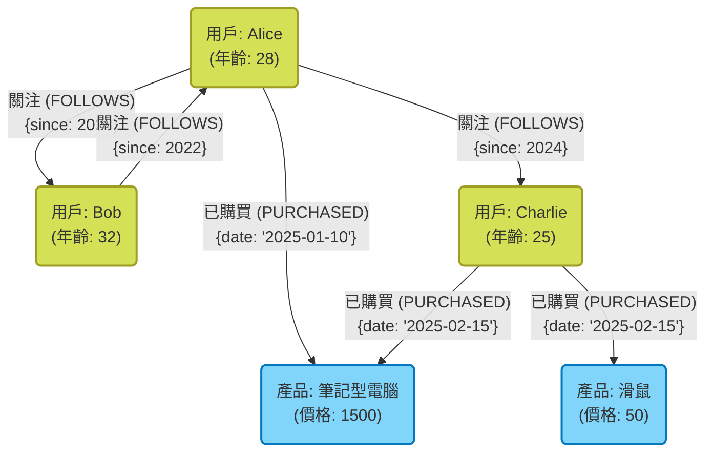
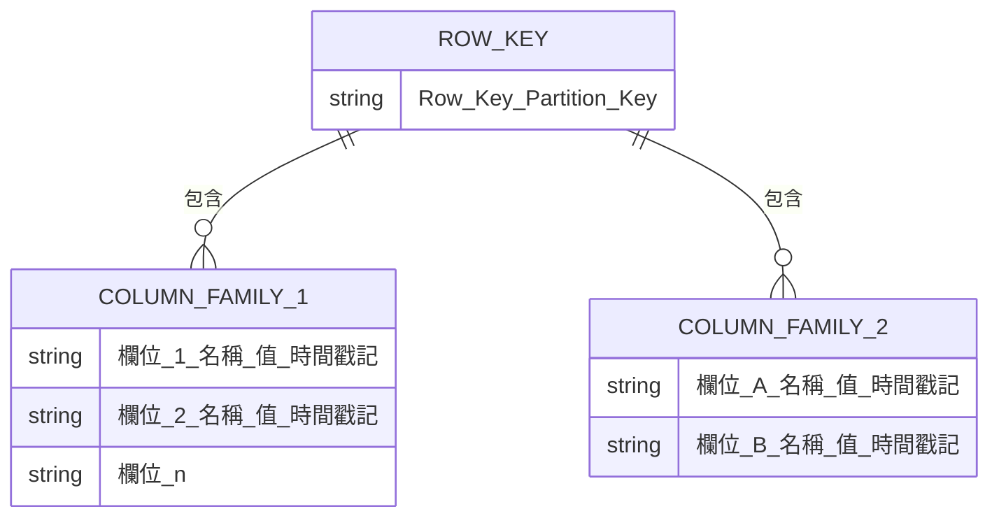

在現代的系統開發中，作為資料儲存與管理手段的資料庫選型具有極為重要的意義。過去曾是關聯式資料庫 ([RDBMS](https://kenji.blog/zh-tw/p/rdbms-transaction-acid-isolation-level-lock/)) 一家獨大的時代，但現在隨著資料的多樣化以及資料量的大規模化， **NoSQL** (Not Only SQL) 資料庫開始扮演著重要的角色。

NoSQL 資料庫並非單一技術，而是針對特定使用情境進行最佳化的各種資料模型的總稱。本文在釐清 RDBMS 與 NoSQL 決定性差異的基礎上，將針對四種具代表性的 NoSQL 資料模型—— **鍵值型 (KVS)** 、 **文件導向型** 、 **圖形型** 以及 **寬行型** 各自的特性、優缺點及適合的使用情境，進行詳細且全面的解說。

---

## 1. 什麼是 NoSQL？深入理解與 RDBMS 的差異

為了能適當地選擇 NoSQL，首先必須明確理解它與傳統關聯式資料庫 (RDBMS) 的差異。RDBMS（如 MySQL、PostgreSQL、Oracle 等）長年以來一直擔綱企業級系統的核心。其優勢在於能嚴格保證資料的一致性 ([ACID](https://kenji.blog/zh-tw/p/rdbms-transaction-acid-isolation-level-lock/) 特性)，並支援複雜的資料表連接 (JOIN) 及透過 SQL 進行彈性的查詢。

然而，隨著網路服務規模的擴大與非結構化資料的激增，RDBMS 架構難以應對的問題逐漸浮出水面。因此 NoSQL 應運而生。NoSQL 與 RDBMS 的主要差異如下：

### 無結構描述 (Schemaless) 與資料結構的彈性

RDBMS 必須事先定義嚴格的結構描述（資料表的欄位名稱與資料型態）。一旦定義了結構描述，修改它的成本就會很高，有時會損害開發的敏捷性。
另一方面，許多 NoSQL 資料庫採用了 **無結構描述 (Schemaless)** 或彈性結構的方法。不需要事先完全定義資料的結構，可以配合應用程式的需求變更動態改變資料的形式。這種特性與敏捷開發及微服務架構非常契合。

### 水平擴展性 (Scale-out)

要提升 RDBMS 的效能，基本的方法是增強伺服器 CPU 或記憶體的 **垂直擴展 (Scale-up)** 。但是單一伺服器的效能存在物理極限，且價格非常昂貴。雖然部分 RDBMS 提供了叢集功能，但跨節點的資料一致性維持與分散式處理仍存在技術門檻。

NoSQL 在設計初期就以 **水平擴展 (Scale-out)** 為前提，透過並列多台廉價的伺服器（節點）來提升處理能力與儲存容量。系統會自動將資料分散至多個節點 (Sharding)，當資料量或流量增加時，只需單純地增加節點，就能提升整體系統的吞吐量。

### CAP 定理與一致性模型

在分散式系統中，無法同時完全滿足資料的一致性 ( **C**onsistency )、可用性 ( **A**vailability ) 以及分區容錯性 ( **P**artition Tolerance ) 這三者，這項 **CAP 定理** 是 NoSQL 設計中非常重要的概念。

RDBMS 一般重視「 **CA** （一致性與可用性）」（在沒有網路分區的前提下），但大多數的 NoSQL 資料庫則會選擇「 **CP** （一致性與分區容錯性）」或「 **AP** （可用性與分區容錯性）」其中一種的權衡。特別是在大規模的分散式環境中，有不少系統會稍微犧牲嚴格的一致性，優先確保系統能持續回應（可用性），並採用只要最終資料能一致即可的 **最終一致性 (Eventual [Consistency](https://kenji.blog/zh-tw/p/cap-theorem-distributed-systems-tradeoff/))** 做法。

---

## 2. 鍵值型 (Key-Value Store: KVS)

鍵值型 (KVS) 是 NoSQL 資料庫中最簡單且最快速的資料模型。顧名思義，它僅透過唯一的「鍵 (Key)」與其對應的「值 (Value)」的配對來管理資料。

### 資料模型與特徵

KVS 擁有與關聯陣列或字典 (Dictionary) 相同的結構。值 (Value) 的內容在資料庫端通常僅被視為單純的位元組陣列或字串（有少數例外），基本上無法解析內部結構來發送查詢。對資料的存取僅限於「指定鍵來取得、更新、刪除值」這類單純的操作。

這種極端的簡單性造就了 KVS 最大的武器—— **壓倒性的效能** 。由於不需要解析複雜的查詢或處理 JOIN，因此能以毫秒到微秒等級的超低延遲進行資料讀寫。此外，由於資料是獨立的，因此分散到多個節點 (Sharding) 也極為容易。

### 代表性的 KVS 資料庫

- **Redis** : 在記憶體上運作的記憶體內 KVS 的代表。不只支援單純字串，還支援列表、集合、哈希等多種資料結構，並具備發布訂閱 ([Pub/Sub](https://kenji.blog/zh-tw/p/event-driven-architecture-message-queue-kafka-rabbitmq/)) 功能的高階 KVS。
- **Memcached** : 極為簡單且快速的分散式記憶體快取系統。
- **Amazon DynamoDB** : 全託管且具備高擴展性的 KVS（同時也具備寬行與文件的特性）。

### 優點與缺點

**優點:**
- **超快的處理速度** : 由於結構單純，磁碟 I/O 與記憶體操作的額外負擔能降到最低。
- **高擴展性** : 容易基於鍵將資料分散，因此可實現近乎無限的水平擴展。

**缺點:**
- **無法進行複雜查詢** : 不適合基於值內容的搜尋（例：「尋找年齡 20 歲以上的用戶」）或資料的聚合運算。
- **難以表現資料間的關聯性** : 因為沒有建立關聯的功能，應用程式端必須自行管理關聯性。

### 使用情境

KVS 最適合能透過鍵唯一取得值，並且要求高速性的場景。

- **會話 (Session) 管理** : 儲存 Web 應用程式的用戶會話資訊。鍵為會話 ID，值為會話資料。
- **快取層** : 暫存對 RDBMS 等的查詢結果，或是計算成本較高的處理結果，以提升回應速度。
- **即時排行榜** : （特別是使用 Redis 的有序集合功能）即時聚合並顯示遊戲的排名等。
- **用戶設定與個人檔案** : 以用戶 ID 作為鍵，將個別設定項目（如 JSON）作為值來儲存。

### Redis 程式碼範例

以下展示使用 Redis 進行基本鍵值操作的範例 (CLI 指令)。

```text
# 單純的字串 SET 與 GET
> SET user:1001:name "Taro Yamada"
OK
> GET user:1001:name
"Taro Yamada"

# 具備有效期限 (TTL) 的 SET，可用於會話等 (3600 秒 = 1 小時)
> SETEX session:abcdef123456 3600 "session_data_json_here"
OK

# 使用哈希 (Hash) 型態來管理用戶資訊
> HSET user:1002 name "Hanako" age 28 city "Tokyo"
(integer) 3
> HGET user:1002 age
"28"
> HGETALL user:1002
1) "name"
2) "Hanako"
3) "age"
4) "28"
5) "city"
6) "Tokyo"
```

---

## 3. 文件導向型資料庫

文件導向型資料庫是在保有 KVS 彈性的同時，提供更複雜資料結構與高階查詢能力的資料模型。

### 資料模型與特徵

它將資料以「文件 (Document)」的單位來儲存。文件的實體主要是以 **JSON (JavaScript Object Notation)** 、BSON (Binary JSON) 或 XML 格式來表現的階層式資料結構。

與 KVS 不同，文件資料庫能夠理解值（文件）的內部結構。因此，可以針對文件內嵌套 (Nested) 的欄位建立索引，或是指定條件進行搜尋與聚合運算。
此外，相較於將相關資料分散到不同資料表（正規化）的 [RDBMS](https://kenji.blog/zh-tw/p/rdbms-transaction-acid-isolation-level-lock/)，文件資料庫更傾向將相關資料彙整到單一文件中（非正規化・嵌入）的設計。如此一來，就能透過一次查詢取得所有需要的資料。

### 代表性的文件型資料庫

- **MongoDB** : 文件導向資料庫的事實標準 (De facto standard)。具備強大的查詢語言與彈性的索引，且擴展性也很高。
- **Firestore / Firebase Realtime Database** : Google Cloud 提供的、在即時同步方面表現優異的文件型資料庫。
- **Couchbase** : 兼具 KVS 的高速性與文件資料庫查詢能力的分散式資料庫。
- **Amazon DocumentDB** : 兼容 MongoDB 的全託管服務。

### 優點與缺點

**優點:**
- **無結構描述的彈性** : 每份文件可以擁有不同的結構，很容易直接儲存應用程式的物件。
- **強大的查詢功能** : 可對內部欄位進行搜尋、聚合與排序。
- **開發效率高** : 不需要 ORM 複雜的對應，與基於 JSON 的 API 契合度非常高。

**缺點:**
- **複雜交易 ([Transaction](https://kenji.blog/zh-tw/p/rdbms-transaction-acid-isolation-level-lock/)) 的限制** : 跨多份文件的更新操作，比起 RDBMS 會有較大的額外負擔（雖然近年如 MongoDB 等已支援多文件交易，但不建議過度使用）。
- **資料大小易膨脹** : 由於無結構描述導致欄位名稱重複儲存，以及非正規化造成的資料重複，常會使得資料變得龐大。

### 使用情境

文件導向型適合資料結構頻繁改變，或是希望能將複雜資料結構直接儲存起來的情況。

- **內容管理系統 (CMS)** : 彈性管理文章、作者、標籤、留言等結構不同的內容。
- **商品型錄與庫存管理** : 非常適合如家電、服飾、食品等，根據商品分類需要的屬性（規格資訊）有很大差異的資料模型。
- **用戶個人檔案與設定** : 將每位用戶不同的任意設定項目或屬性資訊作為單一文件來管理。
- **日誌與事件資料的儲存** : 將應用程式產生的多樣化格式日誌資料，直接以 JSON 儲存，以便事後搜尋與分析。

### MongoDB 程式碼範例

以下展示在 MongoDB 中插入文件與查詢的範例 (mongosh 或 Node.js 驅動風格)。

```javascript
// 插入文件（將相關資料如聯絡方式和興趣以陣列或巢狀物件的形式嵌入）
db.users.insertOne({
  user_id: "u123",
  name: "Kenji",
  age: 30,
  contact: {
    email: "kenji@example.com",
    phone: "090-1234-5678"
  },
  interests: ["NoSQL", "Cloud", "Photography"],
  status: "active"
});

// 查詢範例 1: 搜尋 status 為 "active" 且 age 大於等於 25 的用戶
db.users.find({
  status: "active",
  age: { $gte: 25 }
});

// 查詢範例 2: 搜尋 interests 陣列中包含 "NoSQL" 的用戶
db.users.find({
  interests: "NoSQL"
});

// 在巢狀欄位中進行搜尋（使用點記法）
db.users.find({
  "contact.email": "kenji@example.com"
});
```

---

## 4. 圖形資料庫

圖形資料庫比起資料本身，更重視「 **資料與資料之間的關係性（連結）** 」，是一種為此而設計的特化型資料庫。[RDBMS](https://kenji.blog/zh-tw/p/rdbms-transaction-acid-isolation-level-lock/) 的「關聯式 (Relational)」其實在處理資料表之間的關係性時成本很高，而圖形資料庫則是名副其實地將關係性作為第一級物件來處理。

### 資料模型與特徵

圖形資料庫採用了基於數學「圖論 ([Graph](https://kenji.blog/zh-tw/p/tree-graph-data-structures-search-dfs-bfs-dijkstra/) Theory)」的資料模型。構成資料的主要元素有以下三個：

1. **節點 (Node / Vertex)** : 資料的實體（例：人、公司、商品等）。相當於 RDBMS 的列 (Row)。
2. **邊 (Edge / Relationship)** : 節點之間的關係性（例：是朋友、已購買、隸屬於等）。邊可以帶有方向性。
3. **屬性 (Property)** : 賦予節點或邊的鍵值形式屬性資訊（例：人的「姓名」、關係的「開始日期」等）。

在 RDBMS 中要追蹤複雜的關係性需要大量的 JOIN，一旦階層變深，效能就會急遽惡化。然而，在圖形資料庫中，從節點追蹤邊的操作 (Traversal) 是在指標移動的層級極速進行的，因此能夠瞬間探索數萬、數百萬的關係性。

### 透過 Mermaid 圖解圖形模型

以下是將 SNS 中用戶間的關係性，或是商品購買歷史模型化的圖形資料庫概念圖。



### 代表性的圖形資料庫

- **Neo4j** : 全球使用最廣泛的圖形資料庫。採用了獨有且強大的查詢語言 Cypher。
- **Amazon Neptune** : AWS 提供的全託管圖形資料庫。支援 Property [Graph](https://kenji.blog/zh-tw/p/tree-graph-data-structures-search-dfs-bfs-dijkstra/) (Gremlin) 與 RDF (SPARQL)。
- **ArangoDB** : 支援圖形、文件與 KVS 的多模型資料庫。

### 優點與缺點

**優點:**
- **極速的深層階層關係探索** : 能夠以毫秒級處理如「朋友的朋友的朋友所買的商品」這類複雜關係的查詢。
- **直觀的資料塑模 (Data Modeling)** : 可以直接將白板上畫出的概念圖實作為資料庫的結構描述。

**缺點:**
- **不適合單一實體的全表掃描** : 單純的聚合處理（例：「算出所有用戶的平均年齡」），通常是 [RDBMS](https://kenji.blog/zh-tw/p/rdbms-transaction-acid-isolation-level-lock/) 或文件型會比較快。
- **分散式處理的難度** : 圖形是高度耦合的資料，如果將資料分割 (Sharding) 到多個節點上，容易因為跨節點的遍歷 (Traversal) 導致效能下降。

### 使用情境

圖形資料庫對於資料間的連結本身就具有價值，且需要深入探索與分析其關係性的系統來說是不可或缺的。

- **SNS (社群網路)** : 朋友關係、追蹤/粉絲關係的管理。
- **推薦引擎** : 即時推薦「與你購買傾向相似的用戶所買的商品」。
- **欺詐偵測 (Fraud Detection)** : 透過圖形視覺化可疑 IP 位址、信用卡、帳號間的相關性，藉以找出詐騙集團。
- **網路與 IT 基礎設施管理** : 管理伺服器與路由器的依賴關係，在發生障礙時能瞬間鎖定影響範圍。

### Neo4j 程式碼範例 (Cypher 查詢)

這是在 Neo4j 中插入資料並搜尋關係性的 Cypher 查詢語言範例。Cypher 的特徵在於能像 ASCII Art 那樣表現關係性。

```cypher
// 建立節點與關係
CREATE (alice:User {name: 'Alice', age: 28})
CREATE (bob:User {name: 'Bob', age: 32})
CREATE (laptop:Product {name: 'Laptop', price: 1500})
// 建立邊
CREATE (alice)-[:FOLLOWS {since: 2023}]->(bob)
CREATE (alice)-[:PURCHASED {date: '2025-01-10'}]->(laptop);

// 查詢範例 1: 搜尋 Alice 正在關注的用戶
MATCH (u:User {name: 'Alice'})-[:FOLLOWS]->(follower)
RETURN follower.name;

// 查詢範例 2: 推薦系統（尋找 Alice 關注的人所購買的產品）
MATCH (alice:User {name: 'Alice'})-[:FOLLOWS]->(friend)-[:PURCHASED]->(product)
// 也可以新增排除自己已經購買之產品等條件
RETURN product.name, count(product) AS purchaseCount
ORDER BY purchaseCount DESC;
```

---

## 5. 寬行型 (列導向儲存)

寬行型資料庫 (Wide Column Store 或 Column Family Store) 是專精於將大量資料分散到多個節點，並高速進行寫入與讀取的資料模型。它是受到 Google 的 Bigtable 論文影響而誕生的。

### 資料模型與特徵

它在結構上與 [RDBMS](https://kenji.blog/zh-tw/p/rdbms-transaction-acid-isolation-level-lock/) 由行 (Row) 與列 (Column) 構成的資料表很類似，但內部的資料存放方式有著巨大的差異。寬行儲存的資料結構主要由以下元素構成：

1. **Row Key（行鍵）** : 唯一識別一行的鍵。資料會基於這個鍵分散配置到各個節點。
2. **Column Family（欄位族）** : 相關欄位（列）的群組。類似 RDBMS 的資料表，但每一行可以擁有不同的欄位。
3. **Column（欄位）** : 「欄位名稱 (Key)」、「值 (Value)」、「時間戳記」的組合。

最大的特徵在於 **每一行的欄位數量或種類都可以不同（無結構描述）** ，以及 **能擁有高達數百萬個欄位的龐大（寬）行** 。
此外，它採用了 LSM 樹 (Log-Structured Merge-tree) 等架構，對磁碟的寫入 (Write) 處理是以極速且循序 (Sequential) 的方式進行，因此在需要不斷記錄大量資料的用途上，能發揮壓倒性的優勢。

### 透過 Mermaid 圖解寬行模型

以下是記錄感測器資料 (IoT) 時，寬行儲存邏輯資料結構的示意圖。每一行都能儲存任意數量的欄位。



### 代表性的寬行型資料庫

- **Apache Cassandra** : 由 Facebook 開發，具備高可用性與擴展性，並採用無主節點 (Masterless) 的分散式架構。
- **Apache HBase** : 作為 Hadoop 生態系的一環來運作，建構在 HDFS 之上的巨大寬行儲存。
- **ScyllaDB** : 兼容 Cassandra，但以 C++ 重新編寫，實現了數量級的吞吐量提升。
- **Google Cloud Bigtable** : 作為寬行儲存鼻祖的全託管服務。

### 優點與缺點

**優點:**
- **寫入吞吐量驚人地高** : 可以在由數千到數萬台伺服器組成的叢集中，每秒進行數百萬筆的寫入。
- **沒有單點故障 (SPOF)** : 在 Cassandra 等無主節點架構中，任何節點當機都不會影響整個系統的持續運作。
- **地理上的分散（多資料中心）** : 擅長跨越多個資料中心進行即時的資料複製 (Replication)。

**缺點:**
- **無法進行彈性查詢** : 因為資料是基於 Row Key (及叢集鍵) 來實體配置的，所以基本上無法（或會極度緩慢）使用鍵以外的欄位來搜尋或 JOIN。必須配合存取模式來設計資料表，採用「查詢驅動塑模 (Query-driven Modeling)」。
- **學習成本** : 必須從 [RDBMS](https://kenji.blog/zh-tw/p/rdbms-transaction-acid-isolation-level-lock/) 那種正規化的塑模思考模式轉換過來，資料塑模的難度較高。

### 使用情境

最適合以基於特定鍵大量寫入資料，以及精確讀取為主的大型超大規模系統。

- **IoT 的感測器資料 / 時間序列資料** : 將數百萬台設備每秒傳送過來的測量資料，以設備 ID (Row Key) 與時間 (欄位名稱) 持續記錄。
- **大規模的日誌收集與分析** : 網站的點擊流 (Clickstream) 或系統存取日誌等，僅限附加 (Append-Only) 型態的資料儲存。
- **訊息傳遞的歷史記錄管理** : 聊天應用程式（如 Discord 等）的大規模訊息歷史儲存。
- **個人化/推薦用的特徵量儲存 (Feature Store)** : 高速讀取用戶過去的活動，並傳遞給機器學習模型。

---

## 6. 多模型 (Multi-model) 資料庫的選擇

近年來，在單一資料庫引擎中整合提供多種 NoSQL 模型或 RDBMS 功能的 **多模型資料庫** 也備受矚目。

例如，PostgreSQL 透過強大的 JSONB 類型支援，擁有了作為文件型資料庫的功能。此外，像 Azure Cosmos DB 或 ArangoDB 這種單一後端就能透明處理 KVS、文件、圖形的產品也已問世。藉此，可以在控制專案內運用多種資料庫系統之維運成本（多語言持久化帶來的複雜性）的同時，實現符合需求的彈性資料存取。

---

## 7. 結論：基於使用情境的最佳選擇

如前所述，NoSQL 中不存在「銀彈」。配合專案需求，選擇合適的資料模型才是成功的關鍵。最後整理了一份簡潔的選擇指南。

1. **需要如會話管理或快取這類超高速的單純讀寫嗎？**
   👉 選擇 **鍵值型 (Redis, Memcached)** 。
2. **資料結構頻繁變化，想要直接儲存並搜尋複雜的 JSON 資料嗎？**
   👉 選擇 **文件導向型 (MongoDB, Firestore)** 。
3. **想要瞬間探索並分析如「朋友的朋友」或「推薦路徑」等資料間的複雜關係性嗎？**
   👉 選擇 **圖形型 (Neo4j)** 。
4. **想要寫入每秒數萬筆等級的大量日誌或 IoT 資料，並能無限擴展嗎？**
   👉 選擇 **寬行型 (Cassandra, Bigtable)** 。
5. **資料的嚴格一致性、複雜交易、多樣的聚合運算 (JOIN) 是必須的嗎？**
   👉 不要勉強使用 NoSQL，老實地選擇 **RDBMS (PostgreSQL, MySQL)** 。

在近代的大規模架構中，將所有資料儲存在單一資料庫中不再是主流，針對每個微服務採用最適合資料庫的 **多語言持久化 (Polyglot Persistence)** 才是常見的做法。
只要深入理解各資料模型的優缺點，以及與 RDBMS 的根本差異，就能實現將系統效能、擴展性及可用性發揮到極致的最佳資料庫設計。
