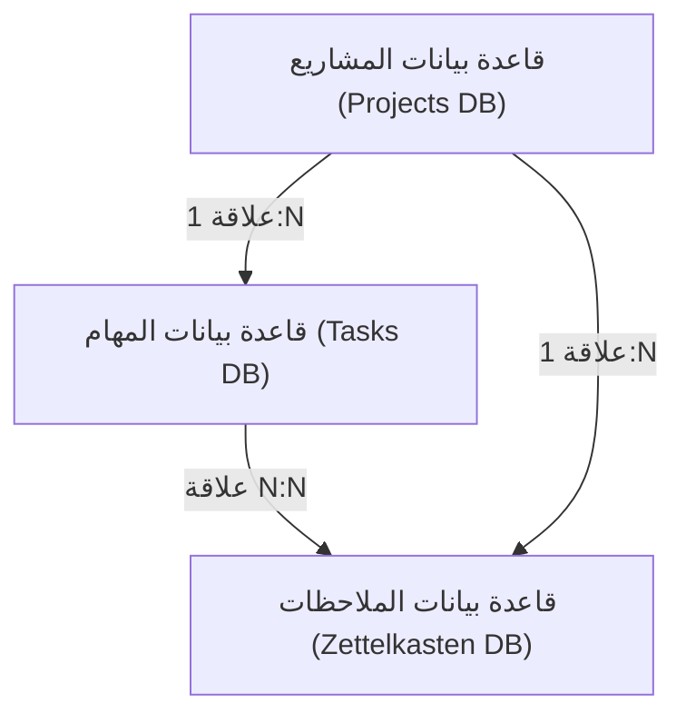
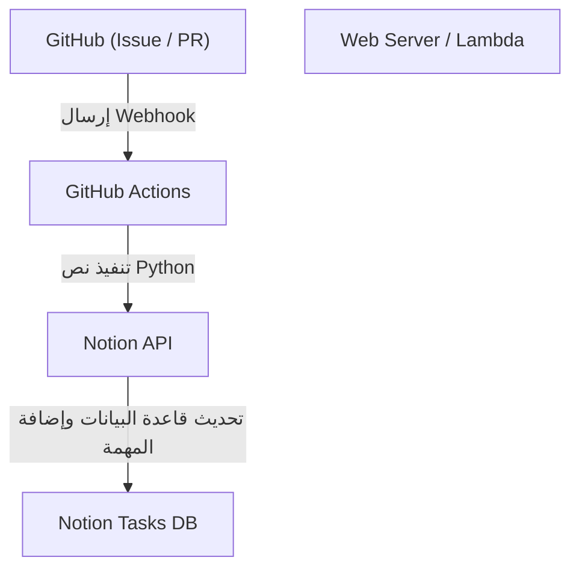

# تقنيات إدارة المهام للتطوير الشخصي وكتابة المدونات باستخدام Notion

عند الاستمرار في التطوير الشخصي وكتابة المدونات، تعتبر إدارة المهام، والحفاظ على التحفيز، وكيفية تخزين الأفكار اليومية واستخدامها من الموضوعات المهمة للغاية. كلما كبر المشروع، زادت المهام التي يجب القيام بها، وغالبًا ما تحتار من أين تبدأ. بالإضافة إلى ذلك، تصبح مسألة أين وكيف تحفظ المعلومات التي تظهر بشكل يومي، مثل أفكار المدونة والمذكرات التقنية، تحديًا.

كأداة يمكنها حل هذه الاحتياجات المتنوعة في منصة واحدة، تعتبر **Notion** هي الأقوى حاليًا. في هذه المقالة، لن نترك Notion تنتهي كمجرد مفكرة أو أداة لإدارة المهام، بل سنشرح "تقنيات إدارة المهام القصوى" التي تدمج بسلاسة بين التطوير الشخصي وكتابة المدونات، وتتضمن الأتمتة والإدارة المتقدمة للتقدم، من منظور تقني وتفصيلي للغاية.

---

## 1. التوافق بين طريقة PARA و Notion

أولاً، سنتحدث عن الأساسيات المتعلقة بكيفية تنظيم المعلومات. في أدوات عالية المرونة مثل Notion، تميل الصفحات وقواعد البيانات إلى التكاثر بشكل فوضوي، وغالبًا ما تقع في حالة "لا أعرف أين يوجد أي شيء". لمنع ذلك، سنقدم **طريقة PARA** التي اقترحها Tiago Forte.

طريقة PARA هي تقنية لتصنيف المعلومات إلى الفئات الأربع التالية:

1. **Projects (المشاريع)**: مجموعة من المهام ذات أهداف ومواعيد نهائية واضحة (مثل: "إصدار تطبيق ويب جديد"، "تجديد تصميم المدونة").
2. **Areas (المجالات)**: مجالات المسؤولية التي تحتاج إلى صيانة وإدارة على المدى الطويل (مثل: "الصحة"، "إدارة المدونة (بشكل مستمر)"، "الشؤون المالية").
3. **Resources (الموارد)**: الموضوعات ذات الاهتمام، أو المعلومات التي قد تكون مفيدة في المستقبل (مثل: "مقتطفات أكواد Python"، "موارد مرجعية لتصميم واجهة المستخدم (UI)").
4. **Archives (الأرشيف)**: المشاريع المكتملة، أو المعلومات التي ليست نشطة حاليًا ولكن ترغب في الاحتفاظ بها.

لتحقيق ذلك في Notion، نبدأ بتقسيم تسلسل الشريط الجانبي الأيسر بدقة إلى هذه الفئات الأربع. على وجه الخصوص، من خلال فصل "Projects" و "Areas/Resources"، لا تختلط المهام التي يجب التركيز عليها الآن (Projects) مع المدخلات اللازمة لها (Resources)، مما يتيح لك الحفاظ على تفكير واضح.

---

## 2. تصميم قاعدة البيانات: البنية العلائقية لـ Projects و Tasks

تكمن القوة الحقيقية لـ Notion في قواعد البيانات العلائقية. في إدارة المهام، ما يجب تجنبه أكثر من غيره هو إدارة جميع المهام في قائمة واحدة مسطحة. من خلال تقسيم المهام حسب المشروع وربطها، يصبح من الممكن فهم الصورة الكبيرة والتفاصيل في نفس الوقت.

هنا، سنقوم بإنشاء قاعدة بيانات "Projects (المشاريع)" وقاعدة بيانات "Tasks (المهام)"، ونربطهما بخصائص العلاقة (Relation properties).

### مخطط العلاقات لقاعدة البيانات

يوضح مخطط Mermaid التالي العلاقات بين قواعد بيانات Projects و Tasks و Notes (Zettelkasten) التي سيتم مناقشتها لاحقًا.



### خصائص قاعدة بيانات المشاريع (Projects)
- `Project Name` (العنوان)
- `Status` (تحديد: "Not Started", "In Progress", "Completed")
- `Deadline` (تاريخ)
- `Tasks` (علاقة: مرتبطة بقاعدة بيانات المهام)
- `Progress` (تجميع ومعادلة: مشروح لاحقًا)

### خصائص قاعدة بيانات المهام (Tasks)
- `Task Name` (العنوان)
- `Status` (الحالة: "To Do", "In Progress", "Done")
- `Priority` (تحديد: "High", "Medium", "Low")
- `Project` (علاقة: مرتبطة بقاعدة بيانات المشاريع)
- `Due Date` (تاريخ)
- `Story Points` (رقم: لتقدير حجم المهمة)

من خلال فصل قواعد البيانات بهذه الطريقة، عند فتح صفحة المشروع، يمكنك إنشاء عروض (Views) متقدمة مثل تصفية وعرض المهام التي تنتمي إلى ذلك المشروع فقط (الاستفادة من قواعد البيانات المرتبطة).

---

## 3. تصور التقدم باستخدام Rollup و Formula

لفهم تقدم المشروع بشكل حدسي، سنقوم بإنشاء شريط تقدم (Progress bar) باستخدام ميزة Formula (المعادلات) في Notion. مع هذا، يمكنك أن ترى في لمحة "ما مدى تقدم هذا المشروع الآن".

### تجميع البيانات باستخدام Rollup
أولاً، في قاعدة بيانات المشاريع، قم بإنشاء خاصيتي Rollup التاليتين من علاقة المهام.
1. `Total Tasks` (Rollup): احصل على "عدد (Count all)" المهام من علاقة المهام.
2. `Completed Tasks` (Rollup): احصل على عدد المهام التي حالتها "Done" من علاقة المهام (* أو عد المهام المكتملة باستخدام معادلة).

### حساب شريط التقدم باستخدام Formula
بعد ذلك، قم بإنشاء خاصية Formula وأدخل الصيغة الحسابية التالية.

```javascript
// صيغة حساب شريط التقدم
round(prop("Completed Tasks") / prop("Total Tasks") * 100)
```
في الإصدار الأحدث من Notion Formula 2.0، بناءً على هذا، أصبح من الممكن تعيين شريط تقدم مرئي (على شكل حلقة أو شريط) مباشرة على واجهة المستخدم (UI). إذا كنت تفضل طريقة الكتابة القديمة أو عرض شريط التقدم بالنصوص، يمكنك أيضًا استخدام التفريع الشرطي كما يلي.

```javascript
// شريط تقدم يعتمد على النصوص (مثال)
let(
    percent, round(prop("Completed Tasks") / prop("Total Tasks") * 100),
    style(percent + "% ", "b") + 
    slice("▓▓▓▓▓▓▓▓▓▓", 0, floor(percent / 10)) + 
    slice("░░░░░░░░░░", 0, 10 - floor(percent / 10))
)
```

### النهج الرياضي للسرعة (Velocity) والتنبؤ بالاكتمال

في التطوير الشخصي، ترتبط معرفة الوتيرة التي يمكنك بها إنجاز المهام (السرعة) ارتباطًا مباشرًا بالإدارة الدقيقة للجدول الزمني.
إذا كان إجمالي نقاط القصة التي يمكن إنجازها في أسبوع واحد هو السرعة $V$، فيتم التعبير عنها بالمعادلة التالية.

$$ V = \frac{\sum_{i=1}^{n} SP_i}{T} $$

هنا، $SP_i$ هي نقاط القصة للمهمة المكتملة $i$، و $T$ هي فترة القياس (على سبيل المثال، عدد الأسابيع في دورة التطوير أو السبرينت).

إذا كان إجمالي نقاط القصة المتبقية للمشروع الحالي هو $W$، فيمكن حساب الوقت المتوقع $E$ حتى اكتمال المشروع على النحو التالي:

$$ E = \frac{W}{V} $$

يعد إجراء هذا الحساب بالكامل داخل Notion معقدًا بعض الشيء، ولكن من الفعال للغاية وضع كتلة معادلة رياضية (Math block) في مهام المراجعة الأسبوعية وتسجيلها كمؤشر للتقييم الذاتي.

---

## 4. ممارسة لوحة Kanban وعرض الجدول الزمني (Timeline View)

من المهم أيضًا "العرض" (View) لإدارة المهام. في Notion، يمكنك عرض (View) نفس قاعدة البيانات بتنسيقات مختلفة.

### لوحة كانبان (Board View)
اجعل العرض الافتراضي لقاعدة بيانات "المهام" عبارة عن لوحة Kanban يتم تجميعها حسب الحالة (To Do / In Progress / Done). هذا يسمح لك بنقل المهام بشكل حدسي عن طريق السحب والإفلات، والتحقق بصريًا مما إذا كانت الاختناقات الحالية متراكمة في عمود "قيد التقدم".

### الجدول الزمني (Timeline View)
بالنسبة لـ "المشاريع" أو "المهام" ذات الحجم الأكبر، يكون عرض Timeline (الجدول الزمني) فعالًا. باستخدام هذا، يمكنك تصور من متى إلى متى سيتم تنفيذ كل مهمة مثل مخطط جانت (Gantt chart)، مما يسهل فهم إرهاق المهام المتوازية (Parallel tasks) والتبعيات (لا يمكن المضي قدمًا في المهمة التالية حتى تنتهي مهمة معينة).

---

## 5. تكوين شبكة من المعرفة عبر Zettelkasten وقاعدة بيانات الملاحظات (Notes)

في كتابة المدونات، "البدء في كتابة مقال من صفحة فارغة" هو الأكثر إيلامًا وسببًا لتوقف القلم. لذلك، سنقوم بدمج مفهوم "**Zettelkasten (صندوق البطاقات)**" الذي ابتكره عالم الاجتماع الألماني نيكلاس لومان في Notion.

القواعد الأساسية لـ Zettelkasten هي "كتابة فكرة واحدة فقط في ملاحظة واحدة (طبيعة ذرية)" و "ربط الملاحظات ببعضها البعض لإنشاء شبكة".

### تصميم قاعدة بيانات الملاحظات (Notes)
- `Note Title` (العنوان)
- `Tags` (تحديد متعدد)
- `Related Notes` (علاقة: مرتبطة بقاعدة بيانات Notes نفسها)
- `Tasks` (علاقة: مرتبطة بمهام كتابة المدونة)

### سير عمل كتابة المدونة
1. قم بتجميع المعرفة المكتسبة من التطوير اليومي والأفكار التي تتبادر إلى الذهن بسرعة على شكل "Notes" مجزأة.
2. إذا كان هناك موضوع مشترك بين تلك الملاحظات، فاستخدم خاصية `Related Notes` لربطها (ربط ثنائي الاتجاه).
3. عند البدء في مهمة (Tasks) كتابة مدونة، قم باستدعاء قاعدة البيانات المرتبطة داخل صفحة تلك المهمة وقم بترتيب الـ Notes ذات الصلة.
4. فقط من خلال ربط أجزاء الملاحظات، يكتمل الهيكل (المخطط التفصيلي) للمدونة.

نتيجة لذلك، تتحول كتابة المدونة من "إبداع من الصفر" إلى "عملية تحرير للمعرفة المتراكمة"، وتتحسن سرعة الكتابة بشكل كبير.

---

## 6. الأتمتة القصوى باستخدام Notion API و Python

من هنا تبدأ أبرز ميزات هذه المقالة، وهو قسم الأتمتة التقنية. يعد الإدخال اليدوي للمهام وتغيير حالتها مضيعة للوقت في التطوير الشخصي. سنستخدم Notion API لإنشاء نظام يزامن بين مشاكل (Issues) في GitHub ومهام Notion، ويعكس حالة نشر المدونة على Notion.

### نظرة عامة على البنية (Architecture)



### الإنشاء التلقائي لمهام Notion من GitHub Issues

إليك مثال لتطبيق نص Python يقوم تلقائيًا بإضافة عنصر إلى قاعدة بيانات مهام Notion عند إنشاء Issue في GitHub.

مسبقًا، تحتاج إلى إنشاء تكامل (Integration) في Notion والحصول على `NOTION_API_KEY` و `DATABASE_ID`.

```python
import os
import requests
import json

# الحصول على الرمز المميز ومعرف قاعدة البيانات من متغيرات البيئة
NOTION_API_KEY = os.environ.get("NOTION_API_KEY")
DATABASE_ID = os.environ.get("DATABASE_ID")

def create_notion_task(issue_title, issue_url):
    url = "https://api.notion.com/v1/pages"
    
    headers = {
        "Authorization": f"Bearer {NOTION_API_KEY}",
        "Content-Type": "application/json",
        "Notion-Version": "2022-06-28"
    }
    
    data = {
        "parent": { "database_id": DATABASE_ID },
        "properties": {
            "Task Name": {
                "title": [
                    {
                        "text": {
                            "content": issue_title
                        }
                    }
                ]
            },
            "Status": {
                "status": {
                    "name": "To Do"
                }
            },
            "URL": {
                "url": issue_url
            }
        }
    }
    
    response = requests.post(url, headers=headers, data=json.dumps(data))
    
    if response.status_code == 200:
        print("Task created successfully in Notion!")
    else:
        print(f"Failed to create task: {response.text}")

# بافتراض استقبال المعلمات من GitHub Actions أو ما شابه
if __name__ == "__main__":
    # مثال: python sync.py "إصلاح خطأ: انهيار شاشة تسجيل الدخول" "https://github.com/user/repo/issues/1"
    import sys
    if len(sys.argv) >= 3:
        create_notion_task(sys.argv[1], sys.argv[2])
```

من خلال دمج هذا النص البرمجي في سير عمل GitHub Actions (`.github/workflows/issue_to_notion.yml`)، سيتم إنشاء مهمة تلقائيًا في Notion في كل مرة يتم فيها فتح Issue في المستودع. يتحرر المطورون من عناء التنقل ذهابًا وإيابًا بين GitHub و Notion.

### التحديث التلقائي لحالة نشر المدونة باستخدام cURL

إذا كنت تنشر مدونتك على خدمات استضافة مثل Vercel أو Netlify، يمكنك تلقي Webhook لاكتمال النشر وتغيير حالة مهمة Notion (على سبيل المثال: "كتابة ونشر المقال أ") تلقائيًا إلى "Done".

مثال على أمر cURL لتحديث خصائص صفحة معينة (مهمة) كالتالي:

```bash
curl -X PATCH 'https://api.notion.com/v1/pages/PAGE_ID' \
  -H 'Authorization: Bearer '"$NOTION_API_KEY"'' \
  -H "Content-Type: application/json" \
  -H "Notion-Version: 2022-06-28" \
  --data '{
    "properties": {
      "Status": {
        "status": {
          "name": "Done"
        }
      }
    }
  }'
```

من خلال دمج استدعاء API هذا في الخطوة الأخيرة من مسار CI/CD، يتم تحقيق أتمتة كاملة حيث "دفع الكود ← نشر تلقائي ← تكتمل مهمة Notion تلقائيًا".

---

## 7. أفضل ممارسات التشغيل ونصائح للاستمرار

بغض النظر عن مدى تقدم النظام أو الأداة التي تنشئها، فإن الأمر يفقد معناه إذا أرهق الشخص الذي يقوم بتشغيلها. أخيرًا، سأقدم بعض النصائح للاستمرار في نظام Notion هذا دون التسبب في تعطله.

1. **حافظ على البساطة**: لا تقم بإنشاء الكثير من الخصائص المثالية أو العلاقات المعقدة منذ البداية. حاول بناء "Notion رشيق" حيث تضيف الخصائص عندما تصبح ضرورية.
2. **الالتزام بالمراجعة الأسبوعية (Weekly Review)**: حدد وقتًا، مثل مساء كل يوم أحد، لمراجعة Notion بالكامل. حافظ على نظافة النظام من خلال تنظيم المهام المكتملة، وإعادة جدولة المهام المتأخرة، ووضع علامات (Tags) على الملاحظات غير المصنفة.
3. **الاستفادة من صندوق الوارد (Inbox)**: يعد فرز الأفكار والمهام التي تطرأ على بالك في قاعدة البيانات المناسبة في كل مرة أمرًا شاقًا. يُعد إنشاء قاعدة بيانات "Inbox" لرمي كل شيء فيها أولاً، ثم فرزها لاحقًا (أثناء المراجعات الأسبوعية، وما إلى ذلك) إلى المشاريع أو الملاحظات عملية خالية من الإجهاد.

## 8. الخاتمة

إدارة المهام باستخدام Notion تتجاوز بكثير مجرد قائمة مهام (To-Do). من خلال الجمع بين تنظيم المعلومات بطريقة PARA، وربط المعرفة بشبكات عبر Zettelkasten، والهندسة التقنية باستخدام Notion API، يمكنك بناء "عقل ثانٍ (Second Brain)" يعزز التطوير الشخصي وكتابة المدونات بشكل كبير.

قد يستغرق الإعداد الأولي بعض الوقت، ولكن بمجرد أن يبدأ النظام في العمل، سينخفض العبء المعرفي لإدارة المهام بشكل كبير، وستتمكن من التركيز بالكامل على الأشياء المهمة حقًا: "كتابة التعليمات البرمجية" و"كتابة النصوص". يرجى استخدام هذه المقالة كمرجع لإنشاء مساحة عمل Notion المثلى الخاصة بك.
