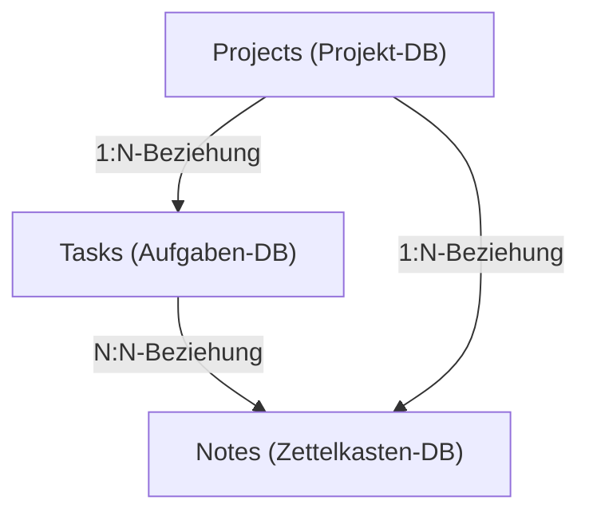
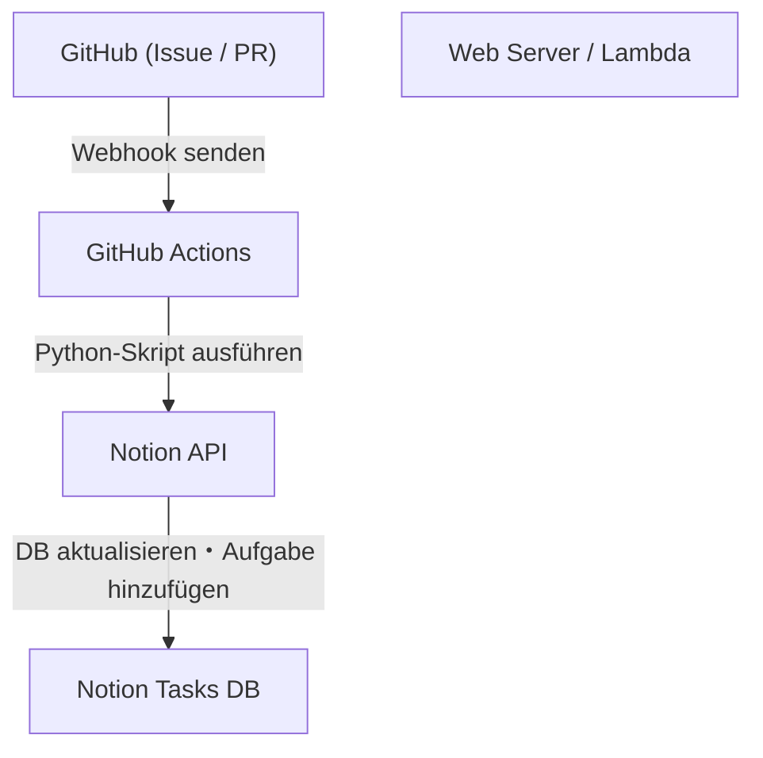

# Aufgabenverwaltung für persönliche Projekte und Bloggen mit Notion

Um persönliche Entwicklung und das Schreiben eines Blogs aufrechtzuerhalten, sind Aufgabenverwaltung, Motivation und das Sammeln täglicher Ideen zur späteren Nutzung sehr wichtige Themen. Je größer ein Projekt wird, desto mehr Aufgaben gibt es, und man fragt sich oft, womit man anfangen soll. Darüber hinaus ist es eine Herausforderung, wo und wie man die täglich anfallenden Informationen wie Blog-Ideen oder technische Notizen speichert.

Als Tool, das diese vielfältigen Bedürfnisse auf einer einzigen Plattform lösen kann, ist **Notion** derzeit das mächtigste. In diesem Artikel erklären wir eine „ultimative Aufgabenverwaltungsmethode“, die Notion nicht nur als Notizblock oder To-Do-Liste nutzt, sondern persönliche Entwicklung und Blog-Schreiben nahtlos integriert und Automatisierung sowie fortgeschrittenes Fortschrittstracking beinhaltet, aus einer sehr detaillierten und technischen Perspektive.

---

## 1. Die Affinität zwischen der PARA-Methode und Notion

Zunächst sprechen wir über die Grundlage: Wie man Informationen organisiert. In einem hochgradig flexiblen Tool wie Notion wuchern Seiten und Datenbanken leicht unkontrolliert, was zu einem Zustand führt, in dem man „nicht weiß, wo was ist“. Um dies zu verhindern, führen wir die **PARA-Methode** ein, die von Tiago Forte entwickelt wurde.

Die PARA-Methode ist ein System, das Informationen in die folgenden vier Kategorien einteilt:

1. **Projects (Projekte)**: Eine Sammlung von Aufgaben mit einem klaren Ziel und einer Deadline (z. B. „Release einer neuen Web-App“, „Blog-Design-Erneuerung“).
2. **Areas (Bereiche)**: Verantwortungsbereiche, die langfristig gepflegt und verwaltet werden müssen (z. B. „Gesundheit“, „Blogbetrieb (fortlaufend)“, „Finanzen“).
3. **Resources (Ressourcen)**: Interessante Themen oder Informationen, die in Zukunft nützlich sein könnten (z. B. „Python-Code-Snippets“, „UI-Design-Referenzmaterialien“).
4. **Archives (Archive)**: Abgeschlossene Projekte oder Informationen, die derzeit nicht aktiv sind, aber aufbewahrt werden sollen.

Um dies in Notion umzusetzen, beginnen Sie damit, die Hierarchie der linken Seitenleiste streng in diese vier Kategorien zu unterteilen. Insbesondere durch die Trennung von „Projects“ und „Areas/Resources“ können Sie eine klare Trennung zwischen den Aufgaben, auf die Sie sich jetzt konzentrieren sollten (Projects), und den dafür benötigten Inputs (Resources) beibehalten, was klares Denken fördert.

---

## 2. Datenbankdesign: Relationale Struktur von Projects und Tasks

Die wahre Stärke von Notion liegt in seinen relationalen Datenbanken. Was bei der Aufgabenverwaltung am meisten vermieden werden sollte, ist die Verwaltung aller Aufgaben in einer einzigen, flachen Liste. Indem man Aufgaben nach Projekten aufteilt und sie miteinander verknüpft, kann man das Gesamtbild und die Details gleichzeitig erfassen.

Hier erstellen wir eine „Projects (Projekte)“-Datenbank und eine „Tasks (Aufgaben)“-Datenbank und verbinden sie mit einer Relation-Eigenschaft.

### Datenbank-Beziehungsdiagramm

Das folgende Mermaid-Diagramm zeigt die Beziehungen zwischen den Datenbanken Projects, Tasks und Notes (Zettelkasten), die später beschrieben wird.



### Eigenschaften der Projects-Datenbank
- `Project Name` (Title)
- `Status` (Select: "Not Started", "In Progress", "Completed")
- `Deadline` (Date)
- `Tasks` (Relation: Verknüpfung mit der Tasks-Datenbank)
- `Progress` (Rollup & Formula: siehe unten)

### Eigenschaften der Tasks-Datenbank
- `Task Name` (Title)
- `Status` (Status: "To Do", "In Progress", "Done")
- `Priority` (Select: "High", "Medium", "Low")
- `Project` (Relation: Verknüpfung mit der Projects-Datenbank)
- `Due Date` (Date)
- `Story Points` (Number: Schätzung des Aufwands der Aufgabe)

Durch die Aufteilung der Datenbanken auf diese Weise wird es möglich, fortschrittliche Ansichten zu erstellen, wie z. B. das Filtern und Anzeigen nur der Aufgaben, die zu einem Projekt gehören (Verwendung verknüpfter Datenbanken), wenn man die Projektseite öffnet.

---

## 3. Visualisierung des Fortschritts mit Rollup und Formula

Um den Fortschritt des Projekts intuitiv zu erfassen, verwenden wir die Formula (Formel)-Funktion von Notion, um einen Fortschrittsbalken zu erstellen. So kann man auf einen Blick sehen, „wie weit dieses Projekt fortgeschritten ist“.

### Datenaggregation mit Rollup
Erstellen Sie zunächst in der Projects-Datenbank die folgenden zwei Rollup-Eigenschaften aus der Tasks-Relation.
1. `Total Tasks` (Rollup): Ruft die „Anzahl (Count all)“ der Aufgaben aus der Tasks-Relation ab.
2. `Completed Tasks` (Rollup): Ruft die Anzahl der Aufgaben ab, deren Status „Done“ ist (oder verwenden Sie eine Funktion, um abgeschlossene Aufgaben zu zählen).

### Berechnung des Fortschrittsbalkens mit Formula
Als Nächstes erstellen Sie eine Formula-Eigenschaft und geben die folgende Formel ein.

```javascript
// Berechnungsformel für den Fortschrittsbalken
round(prop("Completed Tasks") / prop("Total Tasks") * 100)
```
In der neuesten Formula 2.0 von Notion können Sie darauf basierend nun direkt in der Benutzeroberfläche visuelle Fortschrittsbalken (Ring oder Balken) einstellen. Wenn Sie jedoch die alte Schreibweise oder die textbasierte Darstellung des Fortschrittsbalkens bevorzugen, können Sie auch bedingte Verzweigungen wie die folgenden verwenden.

```javascript
// Textbasierter Fortschrittsbalken (Beispiel)
let(
    percent, round(prop("Completed Tasks") / prop("Total Tasks") * 100),
    style(percent + "% ", "b") + 
    slice("▓▓▓▓▓▓▓▓▓▓", 0, floor(percent / 10)) + 
    slice("░░░░░░░░░░", 0, 10 - floor(percent / 10))
)
```

### Ein mathematischer Ansatz für Velocity (Entwicklungsgeschwindigkeit) und Abschlussprognose

In der persönlichen Entwicklung ist das Wissen darüber, in welchem Tempo man Aufgaben erledigen kann (Velocity), direkt mit einer genauen Zeitplanung verbunden.
Wenn die Summe der Story Points, die in einer Woche erledigt werden können, als Velocity $V$ bezeichnet wird, wird dies durch die folgende Formel ausgedrückt:

$$ V = \frac{\sum_{i=1}^{n} SP_i}{T} $$

Hierbei ist $SP_i$ die Story Points der abgeschlossenen Aufgabe $i$ und $T$ ist der Messzeitraum (z. B. die Anzahl der Wochen in einem Sprint).

Wenn die gesamten verbleibenden Story Points des aktuellen Projekts $W$ sind, kann die geschätzte Zeit bis zum Abschluss des Projekts $E$ wie folgt berechnet werden:

$$ E = \frac{W}{V} $$

Es ist etwas komplex, diese Berechnung vollständig innerhalb von Notion durchzuführen, aber es ist sehr effektiv, einen Berechnungsblock (Math block) für Aufgaben wie das wöchentliche Review (Weekly Review) zu platzieren und ihn als Indikator für die Selbstbewertung aufzuzeichnen.

---

## 4. Kanban-Boards und die Timeline-Ansicht in der Praxis

Die „Ansicht (View)“ zur Verwaltung von Aufgaben ist ebenfalls wichtig. In Notion kann dieselbe Datenbank in verschiedenen Formaten (Ansichten) angezeigt werden.

### Kanban-Board (Board View)
Die Standardansicht der „Tasks“-Datenbank ist ein Kanban-Board, das nach Status gruppiert ist (To Do / In Progress / Done). Dadurch kann man Aufgaben intuitiv per Drag & Drop verschieben und visuell prüfen, ob sich aktuelle Engpässe in der Spalte „In Progress“ stauen.

### Zeitleiste (Timeline View)
Für „Projects“ und größere „Tasks“ ist die Timeline-Ansicht effektiv. Dadurch wird wie bei einem Gantt-Diagramm visualisiert, was wann gemacht wird, was es einfacher macht, Unmöglichkeiten bei parallelen Aufgaben (Parallel Tasks) und Abhängigkeiten (eine Aufgabe muss beendet sein, bevor die nächste gestartet werden kann) zu erkennen.

---

## 5. Wissensvernetzung mit Zettelkasten und Notes-Datenbank

Beim Bloggen ist das „Beginnen eines Artikels auf einem leeren Blatt Papier“ oft der schmerzhafteste Teil und der Grund für Schreibblockaden. Daher führen wir das Konzept des „**Zettelkasten**“ in Notion ein, das von dem deutschen Soziologen Niklas Luhmann entwickelt wurde.

Die Grundregeln des Zettelkastens sind „Schreibe nur eine Idee pro Notiz (atomare Natur)“ und „Verknüpfe Notizen miteinander, um ein Netzwerk zu bilden“.

### Notes-Datenbankdesign
- `Note Title` (Title)
- `Tags` (Multi-select)
- `Related Notes` (Relation: Verknüpfung mit der Notes-Datenbank selbst)
- `Tasks` (Relation: Verknüpfung mit Aufgaben zum Schreiben von Blogs)

### Workflow für das Schreiben von Blogs
1. Sammeln Sie kontinuierlich Erkenntnisse und Ideen, die Sie in Ihrer täglichen Entwicklung gewonnen haben, als fragmentarische „Notes“.
2. Wenn es gemeinsame Themen zwischen diesen Notizen gibt, verwenden Sie die Eigenschaft `Related Notes`, um sie zu verknüpfen (bidirektionale Links).
3. Wenn Sie mit der Aufgabe des Schreibens eines Blogs (Tasks) beginnen, rufen Sie die verknüpfte Datenbank auf der Aufgabenseite auf und ordnen die relevanten Notes an.
4. Durch das bloße Zusammenfügen der Notizfragmente wird das Grundgerüst (Outline) des Blogs fertiggestellt.

Dadurch wird das Schreiben von Blogs nicht mehr zu einer „Schöpfung aus dem Nichts“, sondern zu einem „Bearbeitungsprozess von gesammeltem Wissen“, was die Schreibgeschwindigkeit drastisch verbessert.

---

## 6. Ultimative Automatisierung mit der Notion API und Python

Hier beginnt der größte technische Höhepunkt dieses Artikels: der Automatisierungsabschnitt. Die manuelle Eingabe von Aufgaben und Statusänderungen ist Zeitverschwendung bei der persönlichen Entwicklung. Mithilfe der Notion API bauen wir ein System, das GitHub-Issues mit Notion-Aufgaben synchronisiert und den Blog-Deployment-Status in Notion widerspiegelt.

### Architekturübersicht



### Automatische Erstellung von Notion-Aufgaben aus GitHub-Issues

Hier ist ein Implementierungsbeispiel eines Python-Skripts, das automatisch ein Element zur Tasks-Datenbank in Notion hinzufügt, wenn ein Issue in GitHub erstellt wird.

Im Vorfeld müssen Sie eine Notion-Integration erstellen und den `NOTION_API_KEY` sowie die `DATABASE_ID` abrufen.

```python
import os
import requests
import json

# Token und Datenbank-ID aus Umgebungsvariablen abrufen
NOTION_API_KEY = os.environ.get("NOTION_API_KEY")
DATABASE_ID = os.environ.get("DATABASE_ID")

def create_notion_task(issue_title, issue_url):
    url = "https://api.notion.com/v1/pages"
    
    headers = {
        "Authorization": f"Bearer {NOTION_API_KEY}",
        "Content-Type": "application/json",
        "Notion-Version": "2022-06-28"
    }
    
    data = {
        "parent": { "database_id": DATABASE_ID },
        "properties": {
            "Task Name": {
                "title": [
                    {
                        "text": {
                            "content": issue_title
                        }
                    }
                ]
            },
            "Status": {
                "status": {
                    "name": "To Do"
                }
            },
            "URL": {
                "url": issue_url
            }
        }
    }
    
    response = requests.post(url, headers=headers, data=json.dumps(data))
    
    if response.status_code == 200:
        print("Task created successfully in Notion!")
    else:
        print(f"Failed to create task: {response.text}")

# Es wird davon ausgegangen, dass dies als Argument z.B. von GitHub Actions übergeben wird
if __name__ == "__main__":
    # Beispiel: python sync.py "Bugfix: Login-Screen ist kaputt" "https://github.com/user/repo/issues/1"
    import sys
    if len(sys.argv) >= 3:
        create_notion_task(sys.argv[1], sys.argv[2])
```

Indem Sie dieses Skript in den GitHub Actions Workflow (`.github/workflows/issue_to_notion.yml`) einbinden, werden Aufgaben in Notion automatisch generiert, wann immer ein Issue im Repository erstellt wird. Entwickler werden von dem Aufwand befreit, zwischen GitHub und Notion hin und her zu wechseln.

### Automatische Aktualisierung des Blog-Publishing-Status mit cURL

Wenn Sie Ihren Blog bei einem Hosting-Dienst wie Vercel oder Netlify bereitstellen, können Sie einen Webhook nach Abschluss des Deployments empfangen und den Status der Notion-Aufgabe (z. B. „Artikel A schreiben und veröffentlichen“) automatisch auf „Done“ ändern.

Ein Beispiel für einen cURL-Befehl zur Aktualisierung der Eigenschaften einer bestimmten Seite (Aufgabe) lautet wie folgt:

```bash
curl -X PATCH 'https://api.notion.com/v1/pages/PAGE_ID' \
  -H 'Authorization: Bearer '"$NOTION_API_KEY"'' \
  -H "Content-Type: application/json" \
  -H "Notion-Version: 2022-06-28" \
  --data '{
    "properties": {
      "Status": {
        "status": {
          "name": "Done"
        }
      }
    }
  }'
```

Indem Sie diesen API-Aufruf in den letzten Schritt der CI/CD-Pipeline einbinden, vervollständigen Sie eine Vollautomatisierung: „Code pushen → automatisch bereitgestellt werden → Notion-Aufgabe automatisch abgeschlossen“.

---

## 7. Best Practices für den Betrieb und Tipps für die Kontinuität

Egal wie fortschrittlich ein System oder Tool aufgebaut ist, wenn die Personen, die es betreiben, erschöpft sind, verfehlt es seinen Zweck. Zum Schluss stellen wir einige Tipps vor, wie Sie dieses Notion-System ohne Zusammenbruch aufrechterhalten können.

1. **Halten Sie es einfach**: Erstellen Sie nicht von Anfang an zu viele perfekte Eigenschaften oder komplexe Beziehungen. Bemühen Sie sich um einen „agilen Notion-Aufbau“, bei dem Sie Eigenschaften hinzufügen, wenn sie benötigt werden.
2. **Gründliches wöchentliches Review (Weekly Review)**: Legen Sie eine Zeit fest, z. B. jeden Sonntagabend, um das gesamte Notion zu überprüfen. Halten Sie das System sauber, indem Sie erledigte Aufgaben organisieren, abgelaufene Aufgaben neu planen und nicht kategorisierten Notes Tags hinzufügen.
3. **Nutzen Sie die Inbox**: Es ist mühsam, jede Idee oder Aufgabe, die einem einfällt, sofort in die richtige Datenbank zu sortieren. Ein stressfreier Ansatz ist es, zuerst eine „Inbox“-Datenbank zu erstellen, in die Sie alles hineinwerfen, und sie später (während eines wöchentlichen Reviews) in Projects oder Notes zu sortieren.

## 8. Fazit

Die Aufgabenverwaltung mit Notion geht weit über eine einfache To-Do-Liste hinaus. Durch die Kombination von Informationsorganisation durch die PARA-Methode, Wissensvernetzung durch den Zettelkasten und Engineering mit der Notion API können Sie ein „Zweites Gehirn (Second Brain)“ aufbauen, das die persönliche Entwicklung und das Schreiben von Blogs stark fördert.

Die Ersteinrichtung dauert einige Zeit, aber sobald das System läuft, sinkt die kognitive Belastung der Aufgabenverwaltung drastisch, und Sie können sich voll und ganz auf das konzentrieren, was wirklich wichtig ist: „Code schreiben“ und „Texte verfassen“. Bitte nutzen Sie diesen Artikel als Referenz, um Ihren eigenen ultimativen Notion-Workspace zu erstellen.
