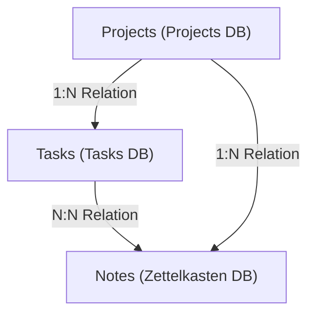
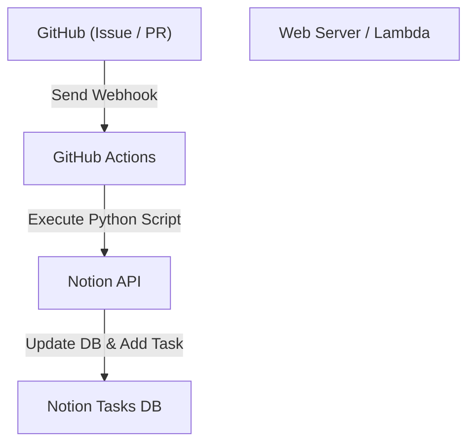

# Task Management Techniques for Personal Development and Blogging using Notion

When consistently working on personal development and blogging, managing tasks, maintaining motivation, and efficiently storing and utilizing daily ideas are crucial themes. As projects grow larger, the number of tasks increases, often leaving you wondering what to tackle first. Furthermore, deciding where and how to store daily information, such as blog post ideas and technical notes, becomes a challenge.

Currently, **Notion** is the most powerful tool capable of solving these diverse needs on a single platform. In this article, rather than letting Notion remain just a memo pad or basic task management tool, we will explain the "Ultimate Task Management Technique" from a highly detailed and technical perspective. This technique seamlessly integrates personal development and blogging, incorporating automation and advanced progress management.

---

## 1. Affinity between the PARA Method and Notion

First, let's talk about the foundational aspect of how to organize information. With highly flexible tools like Notion, pages and databases can easily multiply uncontrollably, leading to a state where "you don't know where anything is." To prevent this, we will introduce the **PARA Method** advocated by Tiago Forte.

The PARA Method is a technique that categorizes information into the following four categories:

1. **Projects**: Collections of tasks with clear goals and deadlines (e.g., "Release a new Web app," "Blog design renewal").
2. **Areas**: Areas of responsibility that need to be maintained and managed over the long term (e.g., "Health," "Blog management (ongoing)," "Finances").
3. **Resources**: Topics of interest or information that might be useful in the future (e.g., "Python code snippets," "UI design reference materials").
4. **Archives**: Completed projects or information that is not currently active but you want to save.

To realize this on Notion, start by strictly dividing the left sidebar hierarchy into these four categories. In particular, by separating "Projects" and "Areas/Resources", the tasks you should focus on now (Projects) and the inputs for them (Resources) won't mix, allowing you to maintain clear thinking.

---

## 2. Database Design: Relational Structure of Projects and Tasks

Notion's true power lies in its relational databases. The most important thing to avoid in task management is managing all tasks in a single flat list. By dividing tasks per project and linking them, you can grasp both the big picture and the details simultaneously.

Here, we will create a "Projects" database and a "Tasks" database, and connect them using a relation property.

### Database Correlation Diagram

The following Mermaid diagram shows the relationships between the Projects, Tasks, and Notes (Zettelkasten) databases, which will be discussed later.



### Projects Database Properties
- `Project Name` (Title)
- `Status` (Select: "Not Started", "In Progress", "Completed")
- `Deadline` (Date)
- `Tasks` (Relation: Linked with Tasks database)
- `Progress` (Rollup & Formula: Described below)

### Tasks Database Properties
- `Task Name` (Title)
- `Status` (Status: "To Do", "In Progress", "Done")
- `Priority` (Select: "High", "Medium", "Low")
- `Project` (Relation: Linked with Projects database)
- `Due Date` (Date)
- `Story Points` (Number: Estimate task scale)

By separating databases this way, you can create advanced views, such as filtering and displaying only the tasks belonging to a specific project when opening its project page (utilizing linked databases).

---

## 3. Visualizing Progress using Rollup and Formula

To intuitively grasp project progress, we will create a progress bar using Notion's Formula feature. This allows you to see at a glance "how far along this project is currently."

### Data Aggregation via Rollup
First, in the Projects database, create the following two Rollup properties from the Tasks database:
1. `Total Tasks` (Rollup): Retrieve the "count all" of tasks from the Tasks relation.
2. `Completed Tasks` (Rollup): Retrieve the count of tasks with the status "Done" from the Tasks relation (or use a formula to count completed tasks).

### Calculating the Progress Bar via Formula
Next, create a Formula property and enter the following calculation formula:

```javascript
// Progress bar calculation formula
round(prop("Completed Tasks") / prop("Total Tasks") * 100)
```
In Notion's latest Formula 2.0, you can now configure a visual progress bar (ring or bar shape) directly on the UI based on this. If you insist on older syntax or a text-based progress bar display, you can use conditional branching like the following:

```javascript
// Text-based progress bar (Example)
let(
    percent, round(prop("Completed Tasks") / prop("Total Tasks") * 100),
    style(percent + "% ", "b") + 
    slice("▓▓▓▓▓▓▓▓▓▓", 0, floor(percent / 10)) + 
    slice("░░░░░░░░░░", 0, 10 - floor(percent / 10))
)
```

### Mathematical Approach to Velocity (Development Speed) and Completion Prediction

In personal development, knowing the pace at which you can consume tasks (velocity) directly leads to highly accurate schedule management.
If the total story points you can consume in a week is velocity $V$, it can be expressed by the following formula:

$$ V = \frac{\sum_{i=1}^{n} SP_i}{T} $$

Here, $SP_i$ is the story points of completed task $i$, and $T$ is the measurement period (for example, the number of weeks in a sprint).

If the remaining total story points of the current project are $W$, the predicted time $E$ until project completion can be calculated as follows:

$$ E = \frac{W}{V} $$

Doing this calculation entirely within Notion is a bit complex, but it is highly effective to place a Math block for calculations within weekly review tasks and record it as an indicator for self-evaluation.

---

## 4. Practicing Kanban Boards and Timeline Views

The "view" for managing tasks is also important. In Notion, you can display the same database in different formats (views).

### Kanban Board (Board View)
Set the default view of the "Tasks" database to a Kanban board grouped by Status (To Do / In Progress / Done). This allows you to move tasks intuitively via drag-and-drop and visually check if current bottlenecks are piling up in the "In Progress" column.

### Timeline View
For "Projects" or large-scale "Tasks", the Timeline view is effective. Like a Gantt chart, this visualizes what tasks will be performed from when to when, making it easier to grasp the strain of parallel tasks and dependencies (the next task cannot proceed unless a certain task is finished).

---

## 5. Networking Knowledge with Zettelkasten and the Notes Database

In blogging, "starting to write an article from a blank slate" is the most painful part and the main reason writer's block occurs. Therefore, we will incorporate into Notion the concept of "**Zettelkasten (Card Box Method)**" devised by the German sociologist Niklas Luhmann.

The basic rules of Zettelkasten are "write only one idea per note (Atomic property)" and "link notes together to create a network."

### Notes Database Design
- `Note Title` (Title)
- `Tags` (Multi-select)
- `Related Notes` (Relation: Linked with the Notes database itself)
- `Tasks` (Relation: Linked with blogging tasks)

### Blogging Workflow
1. Rapidly accumulate knowledge gained from daily development and ideas you come up with as fragmented "Notes."
2. If there are common themes among these notes, link them (bidirectional links) using the `Related Notes` property.
3. When you actually start the blog writing task (Tasks), invoke a linked database within that task page and line up the related Notes.
4. By simply connecting the fragments of notes, the skeleton (outline) of the blog is complete.

Because of this, blogging transforms from "creation from zero" into "editing stocked knowledge," dramatically improving writing speed.

---

## 6. Ultimate Automation using Notion API and Python

From here is the technical automation section, the biggest highlight of this article. Manual task entry and status changes are a waste of time in personal development. We will build a system that utilizes the Notion API to synchronize GitHub Issues with Notion tasks and reflect blog deployment status in Notion.

### Architecture Overview



### Automatically Creating Notion Tasks from GitHub Issues

This is an implementation example of a Python script that automatically adds items to a Notion Tasks database when an Issue is created on GitHub.

Beforehand, you need to create a Notion integration and obtain a `NOTION_API_KEY` and `DATABASE_ID`.

```python
import os
import requests
import json

# Retrieve the token and database ID from environment variables
NOTION_API_KEY = os.environ.get("NOTION_API_KEY")
DATABASE_ID = os.environ.get("DATABASE_ID")

def create_notion_task(issue_title, issue_url):
    url = "https://api.notion.com/v1/pages"
    
    headers = {
        "Authorization": f"Bearer {NOTION_API_KEY}",
        "Content-Type": "application/json",
        "Notion-Version": "2022-06-28"
    }
    
    data = {
        "parent": { "database_id": DATABASE_ID },
        "properties": {
            "Task Name": {
                "title": [
                    {
                        "text": {
                            "content": issue_title
                        }
                    }
                ]
            },
            "Status": {
                "status": {
                    "name": "To Do"
                }
            },
            "URL": {
                "url": issue_url
            }
        }
    }
    
    response = requests.post(url, headers=headers, data=json.dumps(data))
    
    if response.status_code == 200:
        print("Task created successfully in Notion!")
    else:
        print(f"Failed to create task: {response.text}")

# Assumed to receive arguments from GitHub Actions, etc.
if __name__ == "__main__":
    # Example: python sync.py "Bug fix: Login screen is broken" "https://github.com/user/repo/issues/1"
    import sys
    if len(sys.argv) >= 3:
        create_notion_task(sys.argv[1], sys.argv[2])
```

By incorporating this script into a GitHub Actions workflow (`.github/workflows/issue_to_notion.yml`), tasks will be automatically generated in Notion every time an Issue is created in the repository. Developers are freed from the hassle of going back and forth between GitHub and Notion.

### Automatically Updating Blog Publishing Status using cURL

If you deploy your blog to hosting services like Vercel or Netlify, you can receive a deployment completion Webhook and automatically change the status of a Notion task (e.g., "Writing and publishing Article A") to "Done".

Here is an example of a cURL command that updates the properties of a specific page (task).

```bash
curl -X PATCH 'https://api.notion.com/v1/pages/PAGE_ID' \
  -H 'Authorization: Bearer '"$NOTION_API_KEY"'' \
  -H "Content-Type: application/json" \
  -H "Notion-Version: 2022-06-28" \
  --data '{
    "properties": {
      "Status": {
        "status": {
          "name": "Done"
        }
      }
    }
  }'
```

By integrating this API call into the final step of your CI/CD pipeline, you complete full automation: "Push code -> Automatically deployed -> Notion task automatically completed".

---

## 7. Operational Best Practices and Tips for Continuation

No matter how sophisticated a system or tool you build, it defeats the purpose if the person operating it becomes exhausted. Finally, we introduce a few tips to keep this Notion system running without breaking down.

1. **Keep it simple**: Do not create overly complex properties or perfect relations from the start. Strive for "agile Notion building" where you add properties only when needed.
2. **Thorough Weekly Reviews**: Set aside time, such as every Sunday night, to review Notion as a whole. Keep the system clean by organizing completed tasks, rescheduling expired tasks, and tagging uncategorized Notes.
3. **Utilize an Inbox**: Sorting ideas and tasks you come up with into appropriate databases each time is tedious. A stress-free operation is to create an "Inbox" database where you dump everything first, and sort them into Projects or Notes later (such as during a weekly review).

## 8. Conclusion

Task management using Notion goes far beyond a mere To-Do list. By combining information organization through the PARA Method, knowledge networking through Zettelkasten, and engineering through the Notion API, you can build a "Second Brain" that powerfully boosts personal development and blogging.

While the initial setup takes some time, once the system starts running, the cognitive load required for task management will drop dramatically, allowing you to fully focus on what is truly important: "writing code" and "writing text." We hope you refer to this article to build your own ultimate Notion workspace.
