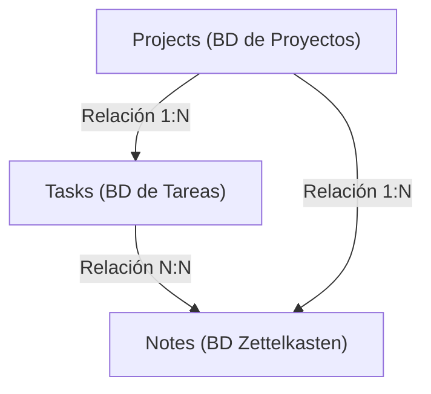
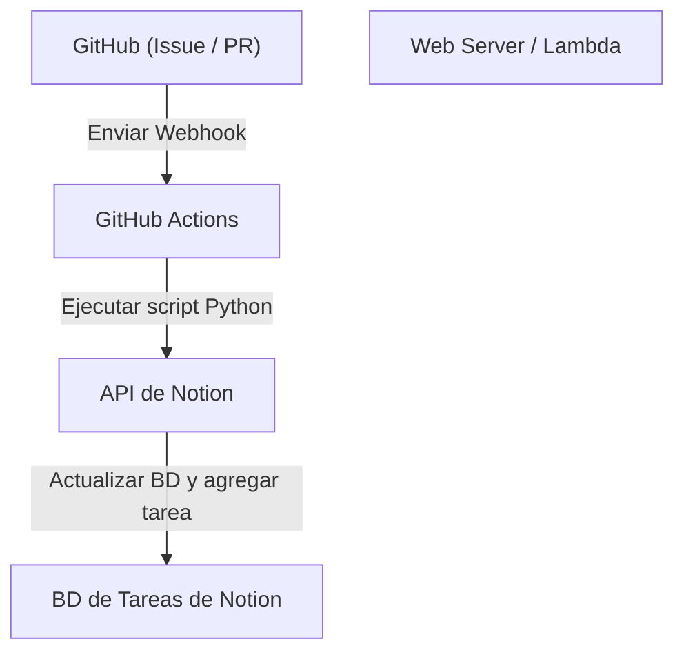

# Gestión de tareas con Notion para el desarrollo personal y la escritura de blogs

Mantener la gestión de tareas, la motivación y cómo almacenar y utilizar ideas diarias es un tema sumamente importante para continuar con el desarrollo personal y la escritura de blogs. Cuanto más grande sea el proyecto, más tareas habrá que hacer y, a menudo, dudarás sobre qué trabajo abordar primero. Además, dónde y cómo guardar información generada diariamente, como ideas para blogs o notas técnicas, también se convierte en un desafío.

Como herramienta que puede resolver estas diversas necesidades en una sola plataforma, **Notion** es actualmente la más poderosa. En este artículo, no dejaremos a Notion como un simple bloc de notas o una herramienta de gestión de tareas. Explicaremos, desde una perspectiva técnica y muy detallada, la "técnica definitiva de gestión de tareas" que integra a la perfección el desarrollo personal y la escritura de blogs, incorporando la automatización y la gestión avanzada del progreso.

---

## 1. La afinidad entre el método PARA y Notion

Primero, hablemos sobre la base de cómo organizar la información. En herramientas altamente flexibles como Notion, las páginas y bases de datos tienden a multiplicarse caóticamente, cayendo fácilmente en un estado de "no saber dónde está cada cosa". Para evitar esto, introduciremos el **método PARA** propuesto por Tiago Forte.

El método PARA es una técnica para clasificar la información en las siguientes 4 categorías:

1. **Projects (Proyectos)**: Un conjunto de tareas con objetivos claros y plazos (ej., "Lanzamiento de una nueva aplicación web", "Renovación del diseño del blog").
2. **Areas (Áreas)**: Áreas de responsabilidad que necesitan ser mantenidas y gestionadas a largo plazo (ej., "Salud", "Gestión del blog (continua)", "Finanzas").
3. **Resources (Recursos)**: Temas de interés o información que puede ser útil en el futuro (ej., "Fragmentos de código en Python", "Materiales de referencia para diseño de UI").
4. **Archives (Archivos)**: Proyectos completados o información que actualmente no está activa pero que deseas conservar.

Para lograr esto en Notion, comenzaremos dividiendo estrictamente la jerarquía de la barra lateral izquierda en estos cuatro. En particular, separar "Projects" de "Areas/Resources" evitará que se mezclen las tareas en las que debes concentrarte ahora (Projects) y las aportaciones (Inputs) necesarias para ellas (Resources), manteniendo así el pensamiento claro.

---

## 2. Diseño de bases de datos: Estructura relacional de Projects y Tasks

El verdadero poder de Notion radica en sus bases de datos relacionales. Lo que más se debe evitar en la gestión de tareas es gestionar todas las tareas en una sola lista plana. Al dividir las tareas por proyecto y vincularlas, podrás comprender simultáneamente la imagen general y los detalles.

Aquí crearemos una base de datos de "Projects" (Proyectos) y una base de datos de "Tasks" (Tareas), y las conectaremos usando una propiedad de relación.

### Diagrama de relación de bases de datos

El siguiente diagrama Mermaid muestra la relación entre las bases de datos Projects, Tasks y Notes (Zettelkasten), que se explicará más adelante.



### Propiedades de la base de datos Projects
- `Project Name` (Title)
- `Status` (Select: "Not Started", "In Progress", "Completed")
- `Deadline` (Date)
- `Tasks` (Relation: Vinculado a la base de datos Tasks)
- `Progress` (Rollup & Formula: Explicado más adelante)

### Propiedades de la base de datos Tasks
- `Task Name` (Title)
- `Status` (Status: "To Do", "In Progress", "Done")
- `Priority` (Select: "High", "Medium", "Low")
- `Project` (Relation: Vinculado a la base de datos Projects)
- `Due Date` (Date)
- `Story Points` (Number: Para estimar el tamaño de la tarea)

Al separar las bases de datos de esta manera, se hace posible crear vistas avanzadas, como filtrar y mostrar solo las tareas que pertenecen a ese proyecto cuando abres la pantalla del proyecto (utilizando bases de datos vinculadas).

---

## 3. Visualización del progreso utilizando Rollup y Formula

Para comprender intuitivamente el progreso del proyecto, crearemos una barra de progreso utilizando la función Formula de Notion. Con esto, podrás ver de un vistazo "cuánto ha avanzado este proyecto".

### Agregación de datos mediante Rollup
Primero, en la base de datos Projects, crea las siguientes dos propiedades Rollup desde la relación Tasks:
1. `Total Tasks` (Rollup): Desde la relación Tasks, obtén el "número (Count all)" de tareas.
2. `Completed Tasks` (Rollup): Desde la relación Tasks, obtén el número de tareas cuyo estado es "Done" (*o cuenta las tareas completadas usando una función*).

### Cálculo de la barra de progreso mediante Formula
A continuación, crea una propiedad Formula e ingresa la siguiente fórmula:

```javascript
// Fórmula de cálculo para la barra de progreso
round(prop("Completed Tasks") / prop("Total Tasks") * 100)
```
En el último Formula 2.0 de Notion, ahora puedes configurar directamente una barra de progreso visual (en forma de anillo o barra) en la interfaz de usuario basándote en esto. Si prefieres la notación antigua o la visualización de una barra de progreso basada en texto, también puedes usar condiciones como la siguiente:

```javascript
// Barra de progreso basada en texto (Ejemplo)
let(
    percent, round(prop("Completed Tasks") / prop("Total Tasks") * 100),
    style(percent + "% ", "b") + 
    slice("▓▓▓▓▓▓▓▓▓▓", 0, floor(percent / 10)) + 
    slice("░░░░░░░░░░", 0, 10 - floor(percent / 10))
)
```

### Enfoque matemático para la velocidad de desarrollo y estimación de finalización

En el desarrollo personal, conocer el ritmo al que puedes digerir tareas (velocidad) está directamente relacionado con una gestión precisa del cronograma.
Si el total de puntos de historia que se pueden digerir en una semana es la velocidad $V$, se puede expresar con la siguiente fórmula.

$$ V = \frac{\sum_{i=1}^{n} SP_i}{T} $$

Aquí, $SP_i$ representa los puntos de historia de la tarea completada $i$, y $T$ es el período de medición (por ejemplo, el número de semanas en un sprint).

Si el total de puntos de historia restantes del proyecto actual es $W$, el tiempo estimado hasta la finalización del proyecto $E$ se puede calcular de la siguiente manera:

$$ E = \frac{W}{V} $$

Hacer estos cálculos completamente dentro de Notion es un poco complejo, pero es muy efectivo colocar bloques de matemáticas (Math block) en tareas de revisión semanal para registrarlos como un indicador de autoevaluación.

---

## 4. Práctica de tableros Kanban y vistas de línea de tiempo

Las "vistas" para gestionar tareas también son importantes. En Notion, puedes mostrar la misma base de datos en diferentes formatos (vistas).

### Tablero Kanban (Board View)
La vista predeterminada para la base de datos "Tasks" será un tablero Kanban que agrupa por Estado (To Do / In Progress / Done). Esto te permite mover tareas intuitivamente arrastrando y soltando, y comprobar visualmente si los cuellos de botella actuales se están acumulando en la columna "En curso" (In Progress).

### Línea de tiempo (Timeline View)
Para los "Projects" y "Tasks" de mayor escala, la vista Timeline es muy útil. Al igual que un diagrama de Gantt, esto visualiza desde cuándo hasta cuándo se realizará cada trabajo, lo que facilita la identificación de cargas de trabajo irrazonables debido a tareas paralelas o dependencias (la siguiente no puede avanzar hasta que cierta tarea esté terminada).

---

## 5. Zettelkasten y la creación de redes de conocimiento a través de la base de datos Notes

En la redacción de blogs, "empezar a escribir un artículo desde una página en blanco" es lo más doloroso y la causa principal del bloqueo del escritor. Por ello, introducimos en Notion el concepto de "**Zettelkasten (Método de caja de notas o fichas)**" inventado por el sociólogo alemán Niklas Luhmann.

La regla básica de Zettelkasten es "escribir solo una idea por nota (naturaleza Atómica)" y "vincular las notas entre sí para crear una red".

### Diseño de la base de datos Notes
- `Note Title` (Title)
- `Tags` (Multi-select)
- `Related Notes` (Relation: Vinculado a la base de datos Notes misma)
- `Tasks` (Relation: Vinculado a tareas de escritura del blog)

### Flujo de trabajo para la escritura de blogs
1. Acumula los conocimientos adquiridos a través del desarrollo diario o las ideas que surjan como fragmentos en "Notes".
2. Si hay un tema común entre esas notas, usa la propiedad `Related Notes` para vincularlas (enlaces bidireccionales).
3. Cuando vayas a trabajar en una tarea de escritura de blog (Tasks), abre una vista de la base de datos vinculada en esa página de la tarea y alinea las Notes relacionadas.
4. Simplemente conectando los fragmentos de notas, el esquema (outline) del blog estará completo.

Con esto, la redacción de blogs deja de ser "una creación desde cero" para convertirse en "un trabajo de edición de conocimientos almacenados", mejorando drásticamente la velocidad de escritura.

---

## 6. La automatización definitiva utilizando la API de Notion y Python

A partir de aquí, llega el mayor punto destacado de este artículo: la sección técnica de automatización. El ingreso manual de tareas y los cambios de estado son una pérdida de tiempo en el desarrollo personal. Aprovechando la API de Notion, crearemos un sistema que sincronice las Issues de GitHub con las tareas de Notion, o que refleje el estado de despliegue del blog en Notion.

### Resumen de la arquitectura



### Creación automática de tareas en Notion desde GitHub Issues

Este es un ejemplo de implementación de un script en Python que añade automáticamente un elemento a la base de datos Tasks de Notion cuando se crea un Issue en GitHub.

De antemano, debes crear una integración en Notion y obtener tu `NOTION_API_KEY` y `DATABASE_ID`.

```python
import os
import requests
import json

# Obtener el token y el ID de la base de datos desde las variables de entorno
NOTION_API_KEY = os.environ.get("NOTION_API_KEY")
DATABASE_ID = os.environ.get("DATABASE_ID")

def create_notion_task(issue_title, issue_url):
    url = "https://api.notion.com/v1/pages"
    
    headers = {
        "Authorization": f"Bearer {NOTION_API_KEY}",
        "Content-Type": "application/json",
        "Notion-Version": "2022-06-28"
    }
    
    data = {
        "parent": { "database_id": DATABASE_ID },
        "properties": {
            "Task Name": {
                "title": [
                    {
                        "text": {
                            "content": issue_title
                        }
                    }
                ]
            },
            "Status": {
                "status": {
                    "name": "To Do"
                }
            },
            "URL": {
                "url": issue_url
            }
        }
    }
    
    response = requests.post(url, headers=headers, data=json.dumps(data))
    
    if response.status_code == 200:
        print("Task created successfully in Notion!")
    else:
        print(f"Failed to create task: {response.text}")

# Asumiendo que se recibe como argumento desde GitHub Actions, etc.
if __name__ == "__main__":
    # Ejemplo: python sync.py "Corrección de error: La pantalla de inicio de sesión se rompe" "https://github.com/user/repo/issues/1"
    import sys
    if len(sys.argv) >= 3:
        create_notion_task(sys.argv[1], sys.argv[2])
```

Al incorporar este script al flujo de trabajo de GitHub Actions (`.github/workflows/issue_to_notion.yml`), se generarán tareas automáticamente en Notion cada vez que se cree un Issue en el repositorio. Los desarrolladores se liberan de la molestia de tener que ir y venir entre GitHub y Notion.

### Actualización automática del estado de publicación del blog usando cURL

Si tu blog está desplegado en un servicio de alojamiento como Vercel o Netlify, es posible recibir el Webhook de finalización de despliegue y cambiar automáticamente a "Done" el estado de una tarea en Notion (ej: "Escritura y publicación del artículo A").

Un ejemplo de comando cURL para actualizar las propiedades de una página (tarea) específica es el siguiente:

```bash
curl -X PATCH 'https://api.notion.com/v1/pages/PAGE_ID' \
  -H 'Authorization: Bearer '"$NOTION_API_KEY"'' \
  -H "Content-Type: application/json" \
  -H "Notion-Version: 2022-06-28" \
  --data '{
    "properties": {
      "Status": {
        "status": {
          "name": "Done"
        }
      }
    }
  }'
```

Al integrar esta llamada a la API en el paso final de tu pipeline CI/CD, completas una automatización total donde: "Empujar el código → Despliegue automático → La tarea en Notion se completa automáticamente".

---

## 7. Mejores prácticas operativas y consejos para la continuidad

No importa cuán avanzado sea el sistema o la herramienta que crees; todo el propósito se frustra si las personas que lo operan se agotan. Por último, presentaré algunos consejos para mantener este sistema de Notion sin que colapse.

1. **Mantén la simplicidad**: No crees propiedades perfectas ni relaciones complejas desde el principio. Procura construir un "Notion ágil" en el que vayas añadiendo propiedades solo en el momento en que se necesiten.
2. **Revisión Semanal (Weekly Review) exhaustiva**: Establece un tiempo específico, como el domingo por la noche cada semana, para revisar Notion en su totalidad. Organiza las tareas completadas, reprograma tareas vencidas, etiqueta notas (Notes) sin clasificar, etc., para mantener el sistema limpio.
3. **Uso del Inbox**: Es una molestia clasificar cada idea o tarea en la base de datos adecuada en cuanto te surgen. Es más libre de estrés crear primero una base de datos "Inbox" para tirar todo allí y, más tarde (por ejemplo, durante la revisión semanal), clasificarlos en Projects o Notes.

## 8. Conclusión

La gestión de tareas con Notion va mucho más allá de ser una simple lista de cosas por hacer (To-Do). Al combinar la organización de la información del método PARA, la red de conocimientos a través de Zettelkasten, y la ingeniería mediante la API de Notion, puedes construir un "Segundo Cerebro (Second Brain)" que impulsará poderosamente tu desarrollo personal y la escritura de blogs.

La configuración inicial toma algo de tiempo, pero una vez que el sistema empiece a funcionar, la carga cognitiva requerida para gestionar tareas se reducirá drásticamente, permitiéndote concentrarte completamente en lo que realmente importa: "escribir código" y "escribir texto". Esperamos que este artículo te sirva de referencia para crear tu propio espacio de trabajo definitivo en Notion.
