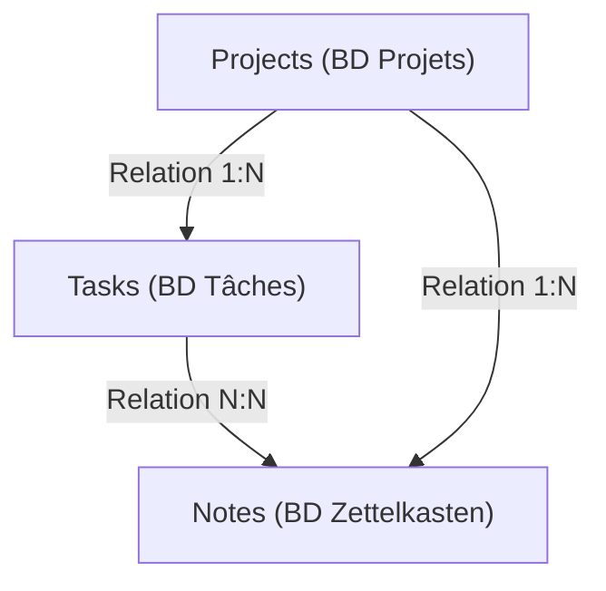
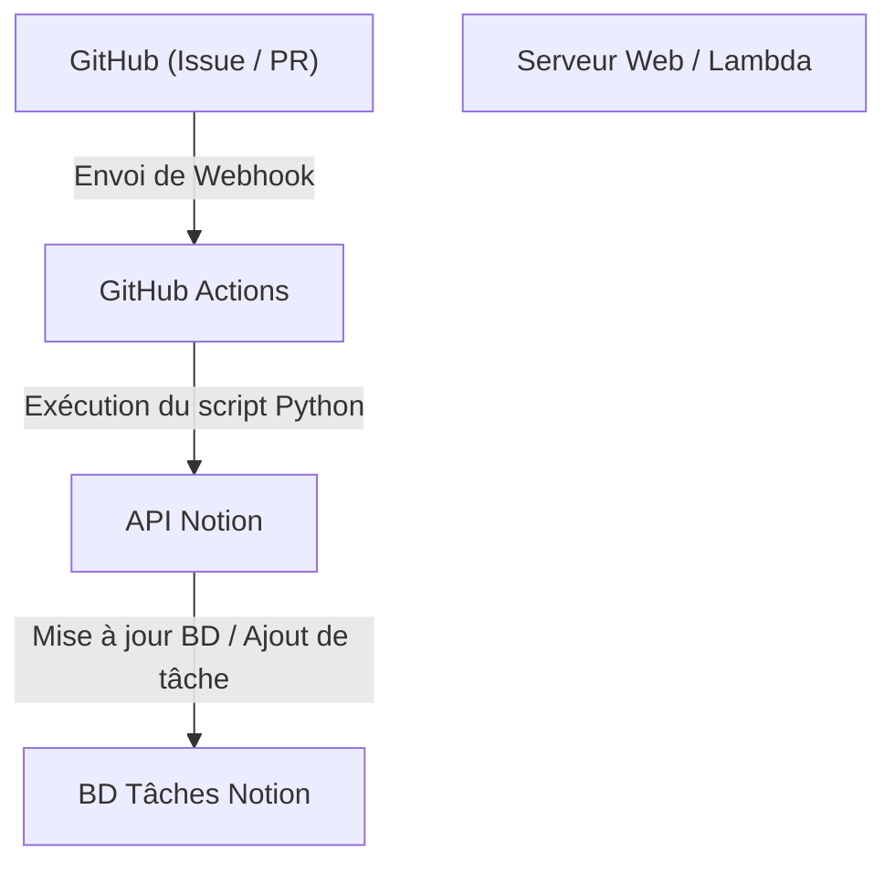

# La gestion des tâches avec Notion pour le développement personnel et l'écriture de blog

Pour continuer le développement personnel et l'écriture de blog, la gestion des tâches, le maintien de la motivation et la manière dont on stocke et utilise les idées quotidiennes sont des thèmes extrêmement importants. Plus un projet devient important, plus le nombre de tâches à accomplir augmente, et on se demande souvent par quoi commencer. De plus, où et comment stocker les informations qui surviennent quotidiennement, comme les idées d'articles de blog ou les notes techniques, devient également un défi.

En tant qu'outil capable de répondre à ces divers besoins sur une seule plateforme, **Notion** est actuellement le plus puissant. Dans cet article, nous ne nous limiterons pas à utiliser Notion comme un simple bloc-notes ou outil de gestion de tâches. Nous expliquerons, d'un point de vue très détaillé et technique, "la méthode ultime de gestion des tâches", qui intègre de manière transparente le développement personnel et l'écriture de blog, et intègre l'automatisation et une gestion avancée de la progression.

---

## 1. L'affinité entre la méthode PARA et Notion

Tout d'abord, parlons de la base, à savoir comment organiser les informations. Avec des outils très flexibles comme Notion, les pages et les bases de données ont tendance à se multiplier de manière désordonnée, et on se retrouve souvent dans une situation où l'on "ne sait plus où se trouve quoi". Pour éviter cela, nous introduisons la **méthode PARA** proposée par Tiago Forte.

La méthode PARA est une technique de classification des informations en quatre catégories :

1. **Projects (Projets)** : Un ensemble de tâches avec des objectifs clairs et des échéances (ex : "Lancement d'une nouvelle application web", "Refonte du design du blog").
2. **Areas (Domaines)** : Domaines de responsabilité qui doivent être maintenus et gérés à long terme (ex : "Santé", "Gestion du blog (continu)", "Finances").
3. **Resources (Ressources)** : Sujets d'intérêt ou informations qui pourraient être utiles à l'avenir (ex : "Extraits de code Python", "Documents de référence sur le design d'interface utilisateur").
4. **Archives (Archives)** : Projets terminés ou informations qui ne sont plus actives mais que l'on souhaite conserver.

Pour mettre cela en œuvre sur Notion, il faut commencer par diviser strictement la hiérarchie de la barre latérale gauche en ces quatre catégories. En séparant en particulier les "Projects" et les "Areas/Resources", les tâches sur lesquelles on doit se concentrer maintenant (Projects) et les contributions nécessaires à celles-ci (Resources) ne se mélangent pas, ce qui permet de garder les idées claires.

---

## 2. Conception de la base de données : Structure relationnelle des projets et des tâches

La véritable puissance de Notion réside dans ses bases de données relationnelles. Ce qu'il faut absolument éviter dans la gestion des tâches, c'est de gérer toutes les tâches dans une seule liste plate. En divisant les tâches par projet et en les liant, il devient possible d'avoir une vue d'ensemble et des détails simultanément.

Ici, nous allons créer une base de données "Projects (Projets)" et une base de données "Tasks (Tâches)", et les lier avec une propriété de relation.

### Diagramme de corrélation des bases de données

Le diagramme Mermaid suivant montre les relations entre les bases de données Projects, Tasks et Notes (Zettelkasten), qui sera décrit plus tard.



### Propriétés de la base de données Projects
- `Project Name` (Title)
- `Status` (Select: "Not Started", "In Progress", "Completed")
- `Deadline` (Date)
- `Tasks` (Relation : Lien avec la base de données Tasks)
- `Progress` (Rollup & Formula : Voir ci-dessous)

### Propriétés de la base de données Tasks
- `Task Name` (Title)
- `Status` (Status: "To Do", "In Progress", "Done")
- `Priority` (Select: "High", "Medium", "Low")
- `Project` (Relation : Lien avec la base de données Projects)
- `Due Date` (Date)
- `Story Points` (Number : Estimer la taille de la tâche)

En séparant les bases de données de cette manière, il est possible de créer des vues avancées, comme l'affichage des tâches appartenant à un projet spécifique en les filtrant lors de l'ouverture de l'écran du projet (utilisation des bases de données liées).

---

## 3. Visualisation de la progression à l'aide de Rollup et Formula

Pour comprendre intuitivement la progression du projet, nous créons une barre de progression en utilisant la fonction Formula (formule) de Notion. Cela permet de voir en un coup d'œil "où en est le projet actuel".

### Agrégation de données avec Rollup
Tout d'abord, dans la base de données Projects, créez les deux propriétés Rollup suivantes à partir de la relation Tasks :
1. `Total Tasks` (Rollup) : Obtenir le "nombre (Count all)" de tâches à partir de la relation Tasks.
2. `Completed Tasks` (Rollup) : Obtenir le nombre de tâches dont le statut est "Done" à partir de la relation Tasks (ou utiliser une fonction pour compter les tâches terminées).

### Calcul de la barre de progression avec Formula
Ensuite, créez une propriété Formula et entrez la formule de calcul suivante :

```javascript
// Formule de calcul de la barre de progression
round(prop("Completed Tasks") / prop("Total Tasks") * 100)
```
Avec la dernière version de Formula 2.0 de Notion, il est désormais possible de configurer directement sur l'interface utilisateur une barre de progression visuelle (en forme d'anneau ou de barre) basée sur cette formule. Si vous préférez l'ancienne méthode d'écriture ou l'affichage de la barre de progression sous forme de texte, vous pouvez utiliser des branchements conditionnels comme suit :

```javascript
// Barre de progression basée sur du texte (Exemple)
let(
    percent, round(prop("Completed Tasks") / prop("Total Tasks") * 100),
    style(percent + "% ", "b") + 
    slice("▓▓▓▓▓▓▓▓▓▓", 0, floor(percent / 10)) + 
    slice("░░░░░░░░░░", 0, 10 - floor(percent / 10))
)
```

### Vélocité (vitesse de développement) et approche mathématique de l'estimation d'achèvement

Dans le développement personnel, connaître le rythme auquel vous pouvez accomplir vos tâches (vélocité) est directement lié à une gestion de calendrier précise.
Si la somme des story points que vous pouvez accomplir en une semaine est la vélocité $V$, elle s'exprime par la formule suivante :

$$ V = \frac{\sum_{i=1}^{n} SP_i}{T} $$

Ici, $SP_i$ est le story point de la tâche terminée $i$, et $T$ est la période de mesure (par exemple, le nombre de semaines du sprint).

Si la somme des story points restants pour le projet actuel est $W$, la durée estimée $E$ jusqu'à l'achèvement du projet peut être calculée comme suit :

$$ E = \frac{W}{V} $$

Réaliser complètement ce calcul dans Notion est un peu complexe, mais il est très efficace de placer un bloc de calcul (Math block) dans des tâches telles que la revue hebdomadaire et de l'enregistrer comme indicateur d'auto-évaluation.

---

## 4. Mise en pratique du tableau Kanban et de la vue chronologique (Timeline)

La "vue" permettant de gérer les tâches est également importante. Dans Notion, vous pouvez afficher la même base de données dans différents formats (vues).

### Tableau Kanban (Board View)
La vue par défaut de la base de données "Tasks" doit être un tableau Kanban regroupé par Status (To Do / In Progress / Done). Cela permet de déplacer intuitivement les tâches par glisser-déposer, et de vérifier visuellement si les goulots d'étranglement actuels ne s'accumulent pas dans la colonne "En cours".

### Chronologie (Timeline View)
Pour les "Projects" ou les "Tasks" à plus grande échelle, la vue Timeline est très utile. Elle permet de visualiser ce qui sera fait et de quand à quand, comme un diagramme de Gantt, ce qui facilite la compréhension de l'impossibilité des tâches parallèles et des dépendances (une tâche ne peut pas avancer si une autre n'est pas terminée).

---

## 5. Zettelkasten et la base de données Notes pour le réseau de connaissances

Lors de la rédaction d'un blog, "commencer à écrire un article à partir d'une page blanche" est la chose la plus douloureuse et la cause de blocage. Par conséquent, nous intégrons le concept de "**Zettelkasten (méthode de la boîte à fiches)**" inventé par le sociologue allemand Niklas Luhmann dans Notion.

Les règles de base de Zettelkasten sont "d'écrire une seule idée par note (nature atomique)" et de "créer un réseau en liant les notes entre elles".

### Conception de la base de données Notes
- `Note Title` (Title)
- `Tags` (Multi-select)
- `Related Notes` (Relation : Lien avec la base de données Notes elle-même)
- `Tasks` (Relation : Lien avec la tâche de rédaction de blog)

### Flux de travail pour l'écriture de blog
1. Accumulez continuellement les connaissances acquises lors du développement quotidien et les idées qui vous viennent à l'esprit sous forme de "Notes" fragmentées.
2. S'il existe des thèmes communs entre ces notes, utilisez la propriété `Related Notes` pour les lier (liens bidirectionnels).
3. Lorsque vous commencez la tâche d'écrire un blog (Tasks), appelez la base de données liée dans la page de cette tâche et alignez les Notes associées.
4. L'architecture (le plan) du blog est complétée simplement en reliant les fragments de notes.

Grâce à cela, l'écriture de blog passe de "création à partir de zéro" à un "travail d'édition de connaissances stockées", ce qui améliore considérablement la vitesse d'écriture.

---

## 6. L'automatisation ultime avec l'API Notion et Python

C'est ici que commence la section d'automatisation technique, qui est le point culminant de cet article. La saisie manuelle des tâches et le changement de statut sont une perte de temps dans le développement personnel. Nous allons construire un système qui utilise l'API Notion pour synchroniser les problèmes (Issues) GitHub avec les tâches Notion, et refléter le statut de déploiement du blog dans Notion.

### Aperçu de l'architecture



### Création automatique de tâches Notion à partir des GitHub Issues

Voici un exemple d'implémentation d'un script Python qui ajoute automatiquement un élément à la base de données Tasks de Notion lorsqu'un problème (Issue) est créé sur GitHub.

Au préalable, vous devez créer une intégration Notion et obtenir `NOTION_API_KEY` et `DATABASE_ID`.

```python
import os
import requests
import json

# Obtenir le jeton et l'ID de la base de données à partir des variables d'environnement
NOTION_API_KEY = os.environ.get("NOTION_API_KEY")
DATABASE_ID = os.environ.get("DATABASE_ID")

def create_notion_task(issue_title, issue_url):
    url = "https://api.notion.com/v1/pages"
    
    headers = {
        "Authorization": f"Bearer {NOTION_API_KEY}",
        "Content-Type": "application/json",
        "Notion-Version": "2022-06-28"
    }
    
    data = {
        "parent": { "database_id": DATABASE_ID },
        "properties": {
            "Task Name": {
                "title": [
                    {
                        "text": {
                            "content": issue_title
                        }
                    }
                ]
            },
            "Status": {
                "status": {
                    "name": "To Do"
                }
            },
            "URL": {
                "url": issue_url
            }
        }
    }
    
    response = requests.post(url, headers=headers, data=json.dumps(data))
    
    if response.status_code == 200:
        print("Task created successfully in Notion!")
    else:
        print(f"Failed to create task: {response.text}")

# Supposé être reçu comme argument de GitHub Actions, etc.
if __name__ == "__main__":
    # Exemple : python sync.py "Correction de bug : L'écran de connexion est cassé" "https://github.com/user/repo/issues/1"
    import sys
    if len(sys.argv) >= 3:
        create_notion_task(sys.argv[1], sys.argv[2])
```

En intégrant ce script dans un workflow GitHub Actions (`.github/workflows/issue_to_notion.yml`), une tâche sera automatiquement générée dans Notion chaque fois qu'un problème (Issue) est soulevé dans le référentiel. Les développeurs sont libérés des allers-retours entre GitHub et Notion.

### Mise à jour automatique du statut de publication du blog à l'aide de cURL

Si vous déployez votre blog sur un service d'hébergement comme Vercel ou Netlify, il est possible de recevoir un Webhook de fin de déploiement et de changer automatiquement le statut d'une tâche Notion (par exemple : "Rédaction et publication de l'article A") en "Done".

Voici un exemple de commande cURL pour mettre à jour les propriétés d'une page spécifique (tâche).

```bash
curl -X PATCH 'https://api.notion.com/v1/pages/PAGE_ID' \
  -H 'Authorization: Bearer '"$NOTION_API_KEY"'' \
  -H "Content-Type: application/json" \
  -H "Notion-Version: 2022-06-28" \
  --data '{
    "properties": {
      "Status": {
        "status": {
          "name": "Done"
        }
      }
    }
  }'
```

En intégrant cet appel API à la dernière étape de votre pipeline CI/CD, vous obtenez une automatisation complète : "Pousser le code → Déploiement automatique → La tâche Notion est automatiquement terminée".

---

## 7. Meilleures pratiques opérationnelles et conseils pour la continuité

Peu importe à quel point vous créez des systèmes et des outils avancés, cela n'a aucun sens si les personnes qui les exploitent s'épuisent. Enfin, voici quelques conseils pour continuer à utiliser ce système Notion sans le laisser s'effondrer.

1. **Garder les choses simples** : Ne créez pas dès le départ des propriétés parfaites ou des relations trop complexes. Gardez à l'esprit une "construction Notion agile", en ajoutant des propriétés au fur et à mesure que vous en avez besoin.
2. **Exécution rigoureuse de la revue hebdomadaire (Weekly Review)** : Prévoyez un moment précis, comme chaque dimanche soir, pour revoir l'ensemble de votre Notion. Gardez le système propre en organisant les tâches accomplies, en reprogrammant les tâches expirées et en ajoutant des balises aux Notes non classées.
3. **Utilisation de l'Inbox** : Il est fastidieux de répartir chaque idée ou tâche qui vous vient à l'esprit dans la base de données appropriée à chaque fois. Il est beaucoup plus serein de créer d'abord une base de données "Inbox" où vous jetez tout, puis de les répartir dans Projects ou Notes plus tard (par exemple lors de la revue hebdomadaire).

## 8. Conclusion

La gestion des tâches avec Notion va bien au-delà de la simple liste To-Do. En combinant l'organisation des informations par la méthode PARA, la mise en réseau des connaissances par Zettelkasten et l'ingénierie par l'API Notion, vous pouvez construire un "deuxième cerveau (Second Brain)" qui stimule considérablement votre développement personnel et l'écriture de blog.

La configuration initiale prend un peu de temps, mais une fois que le système commence à fonctionner, la charge cognitive liée à la gestion des tâches diminue de manière spectaculaire, vous permettant de vous concentrer pleinement sur les choses vraiment importantes : "écrire du code" et "écrire des textes". N'hésitez pas à utiliser cet article comme référence pour créer votre propre espace de travail Notion ultime.
