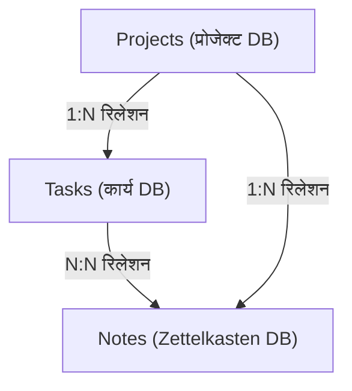
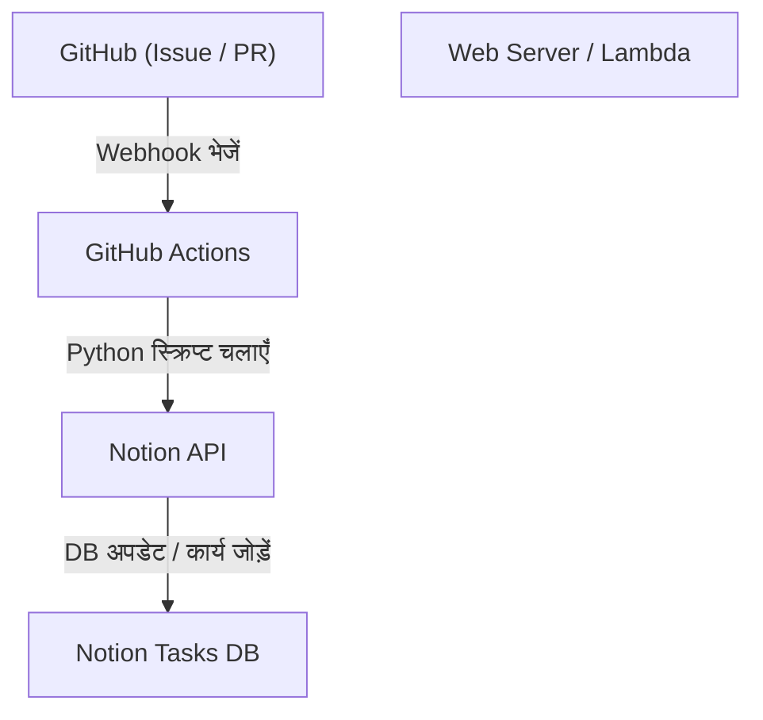

# नोशन का उपयोग करके व्यक्तिगत विकास और ब्लॉग लेखन के लिए कार्य प्रबंधन तकनीकें

व्यक्तिगत विकास और ब्लॉग लेखन को जारी रखने के लिए, कार्य प्रबंधन, प्रेरणा बनाए रखना, और दैनिक विचारों को संग्रहीत और उपयोग करना बहुत महत्वपूर्ण विषय हैं। जैसे-जैसे प्रोजेक्ट बड़ा होता जाता है, करने वाले कार्यों की संख्या बढ़ती जाती है, और अक्सर यह उलझन होती है कि किस काम से शुरुआत की जाए। इसके अलावा, रोज़मर्रा की जानकारी, जैसे ब्लॉग के विषय या तकनीकी नोट्स, को कहाँ और कैसे सहेजा जाए, यह भी एक चुनौती बन जाती है।

इन विविध आवश्यकताओं को एक ही प्लेटफॉर्म पर हल करने में सक्षम टूल के रूप में, वर्तमान में **Notion** सबसे शक्तिशाली है। इस लेख में, हम Notion को सिर्फ एक नोटपैड या कार्य प्रबंधन टूल तक सीमित नहीं रखेंगे, बल्कि एक "अंतिम कार्य प्रबंधन तकनीक" की व्याख्या करेंगे जो व्यक्तिगत विकास और ब्लॉग लेखन को समेकित रूप से जोड़ती है, और स्वचालन और उन्नत प्रगति प्रबंधन को एक बहुत विस्तृत और तकनीकी दृष्टिकोण से शामिल करती है।

---

## 1. PARA पद्धति और Notion की अनुकूलता

सबसे पहले, हम जानकारी को व्यवस्थित करने के मूलभूत भाग के बारे में बात करेंगे। Notion जैसे उच्च स्वतंत्रता वाले टूल्स में, पेज और डेटाबेस अव्यवस्थित रूप से बढ़ जाते हैं, और "क्या कहाँ है, कुछ पता नहीं चलता" जैसी स्थिति में पड़ना आसान होता है। इसे रोकने के लिए, हम Tiago Forte द्वारा प्रस्तावित **PARA पद्धति** पेश करेंगे।

PARA पद्धति जानकारी को निम्नलिखित 4 श्रेणियों में वर्गीकृत करने की एक तकनीक है।

1. **Projects (प्रोजेक्ट)**: स्पष्ट लक्ष्यों और समय-सीमा वाले कार्यों का संग्रह (उदाहरण: "नए वेब ऐप का रिलीज़", "ब्लॉग का डिज़ाइन रिन्यूअल")।
2. **Areas (क्षेत्र)**: जिम्मेदारी के क्षेत्र जिन्हें लंबे समय तक बनाए रखने और प्रबंधित करने की आवश्यकता होती है (उदाहरण: "स्वास्थ्य", "ब्लॉग संचालन (निरंतर)", "वित्त")।
3. **Resources (संसाधन)**: रुचि के विषय और ऐसी जानकारी जो भविष्य में उपयोगी हो सकती है (उदाहरण: "पायथन कोड स्निपेट्स", "यूआई डिज़ाइन संदर्भ सामग्री")।
4. **Archives (संग्रह)**: पूर्ण हो चुके प्रोजेक्ट या ऐसी जानकारी जो वर्तमान में सक्रिय नहीं है लेकिन जिसे सहेजा जाना चाहिए।

Notion पर इसे लागू करने के लिए, बाईं ओर के साइडबार पदानुक्रम को इन 4 श्रेणियों में सख्ती से विभाजित करके शुरुआत करें। विशेष रूप से "Projects" और "Areas/Resources" को अलग करके, आप उन कार्यों (Projects) पर ध्यान केंद्रित कर सकते हैं जिन पर अभी ध्यान देने की आवश्यकता है और उनके लिए इनपुट (Resources) को मिलाए बिना स्पष्ट सोच बनाए रख सकते हैं।

---

## 2. डेटाबेस डिज़ाइन: Projects और Tasks की रिलेशनल संरचना

Notion की असली ताकत रिलेशनल डेटाबेस में निहित है। कार्य प्रबंधन में सबसे ज्यादा बचने वाली बात यह है कि सभी कार्यों को एक ही फ्लैट सूची में प्रबंधित किया जाए। कार्यों को प्रोजेक्ट के आधार पर विभाजित करके और उन्हें जोड़कर, आप समग्र चित्र और विवरण दोनों को एक साथ समझ सकते हैं।

यहां, हम "Projects (प्रोजेक्ट)" डेटाबेस और "Tasks (कार्य)" डेटाबेस बनाएंगे, और उन्हें रिलेशन प्रॉपर्टी के साथ जोड़ेंगे।

### डेटाबेस का सहसंबंध आरेख

निम्नलिखित Mermaid आरेख Projects, Tasks, और बाद में चर्चा किए जाने वाले Notes (Zettelkasten) डेटाबेस के बीच संबंधों को दर्शाता है।



### Projects डेटाबेस की प्रॉपर्टीज़
- `Project Name` (Title)
- `Status` (Select: "Not Started", "In Progress", "Completed")
- `Deadline` (Date)
- `Tasks` (Relation: Tasks डेटाबेस के साथ लिंक)
- `Progress` (Rollup & Formula: बाद में वर्णित)

### Tasks डेटाबेस की प्रॉपर्टीज़
- `Task Name` (Title)
- `Status` (Status: "To Do", "In Progress", "Done")
- `Priority` (Select: "High", "Medium", "Low")
- `Project` (Relation: Projects डेटाबेस के साथ लिंक)
- `Due Date` (Date)
- `Story Points` (Number: कार्य के पैमाने का अनुमान लगाना)

इस प्रकार डेटाबेस को अलग करके, जब आप प्रोजेक्ट स्क्रीन खोलते हैं, तो आप केवल उस प्रोजेक्ट से संबंधित कार्यों को फ़िल्टर और प्रदर्शित करने (लिंक किए गए डेटाबेस का उपयोग करके) जैसे उन्नत दृश्य बना सकते हैं।

---

## 3. Rollup और Formula का उपयोग करके प्रगति का दृश्यीकरण

प्रोजेक्ट की प्रगति को सहजता से समझने के लिए, Notion की Formula (फ़ंक्शन) सुविधा का उपयोग करके एक प्रोग्रेस बार बनाएं। इससे, "यह प्रोजेक्ट अभी कितना आगे बढ़ चुका है" एक नज़र में समझा जा सकता है।

### Rollup द्वारा डेटा एकत्रीकरण
सबसे पहले, Projects डेटाबेस में, Tasks डेटाबेस से निम्नलिखित 2 Rollup प्रॉपर्टीज़ बनाएं।
1. `Total Tasks` (Rollup): Tasks रिलेशन से कार्यों की "संख्या (Count all)" प्राप्त करें।
2. `Completed Tasks` (Rollup): Tasks रिलेशन से, "Done" स्थिति वाले कार्यों की संख्या प्राप्त करें (*या पूर्ण कार्यों की गणना के लिए फ़ंक्शन का उपयोग करें)।

### Formula द्वारा प्रोग्रेस बार की गणना
अगला, एक Formula प्रॉपर्टी बनाएं और निम्नलिखित गणना सूत्र दर्ज करें।

```javascript
// प्रोग्रेस बार गणना सूत्र
round(prop("Completed Tasks") / prop("Total Tasks") * 100)
```
Notion के नवीनतम Formula 2.0 में, आप इसके आधार पर सीधे UI पर एक दृश्यमान प्रोग्रेस बार (रिंग या बार के आकार में) सेट कर सकते हैं। यदि आप पुरानी लेखन पद्धति या टेक्स्ट-आधारित प्रोग्रेस बार प्रदर्शन को प्राथमिकता देते हैं, तो निम्नलिखित जैसी सशर्त शाखाओं का भी उपयोग किया जा सकता है।

```javascript
// टेक्स्ट-आधारित प्रोग्रेस बार (उदाहरण)
let(
    percent, round(prop("Completed Tasks") / prop("Total Tasks") * 100),
    style(percent + "% ", "b") + 
    slice("▓▓▓▓▓▓▓▓▓▓", 0, floor(percent / 10)) + 
    slice("░░░░░░░░░░", 0, 10 - floor(percent / 10))
)
```

### वेलोसिटी (विकास गति) और पूर्णता पूर्वानुमान के लिए गणितीय दृष्टिकोण

व्यक्तिगत विकास में, यह जानना कि आप किस गति से कार्यों को पूरा कर सकते हैं (वेलोसिटी), अत्यधिक सटीक शेड्यूल प्रबंधन से सीधे जुड़ा हुआ है।
यदि एक सप्ताह में पूरे किए जा सकने वाले स्टोरी पॉइंट्स के योग को वेलोसिटी $V$ माना जाए, तो इसे निम्नलिखित सूत्र द्वारा दर्शाया जा सकता है।

$$ V = \frac{\sum_{i=1}^{n} SP_i}{T} $$

यहाँ, $SP_i$ पूर्ण किए गए कार्य $i$ का स्टोरी पॉइंट है, और $T$ माप अवधि (उदाहरण के लिए, स्प्रिंट में सप्ताहों की संख्या) है।

यदि वर्तमान प्रोजेक्ट के शेष कुल स्टोरी पॉइंट्स $W$ हैं, तो प्रोजेक्ट पूरा होने तक की अनुमानित अवधि $E$ की गणना इस प्रकार की जा सकती है।

$$ E = \frac{W}{V} $$

इस गणना को पूरी तरह से Notion के भीतर करना थोड़ा जटिल है, लेकिन साप्ताहिक समीक्षा कार्यों में गणना के लिए एक ब्लॉक (Math block) रखना और इसे स्व-मूल्यांकन संकेतक के रूप में रिकॉर्ड करना बहुत प्रभावी है।

---

## 4. कानबन बोर्ड और टाइमलाइन व्यू का अभ्यास

कार्यों को प्रबंधित करने के लिए "दृश्य (Views)" भी महत्वपूर्ण हैं। Notion में, आप एक ही डेटाबेस को विभिन्न प्रारूपों (Views) में प्रदर्शित कर सकते हैं।

### कानबन बोर्ड (Board View)
"Tasks" डेटाबेस का डिफ़ॉल्ट व्यू कानबन बोर्ड होगा जो स्थिति (To Do / In Progress / Done) के अनुसार समूहीकृत होगा। इससे आप ड्रैग-एंड-ड्रॉप के साथ कार्यों को सहजता से ले जा सकते हैं, और दृश्य रूप से जांच सकते हैं कि वर्तमान बाधाएं "In Progress (प्रगति पर)" कॉलम में जमा तो नहीं हो रही हैं।

### टाइमलाइन (Timeline View)
"Projects" और बड़े पैमाने के "Tasks" के लिए, टाइमलाइन व्यू प्रभावी है। यह गैंट चार्ट की तरह विज़ुअलाइज़ करता है कि कौन सा काम कब से कब तक किया जाएगा, जिससे यह समझना आसान हो जाता है कि क्या कार्यों के समानांतर निष्पादन (समानांतर कार्य) में कोई कठिनाई है, या यदि कोई निर्भरता है (अगले कार्य पर तब तक आगे नहीं बढ़ सकते जब तक कि कोई निश्चित कार्य पूरा न हो जाए)।

---

## 5. Zettelkasten और Notes डेटाबेस के माध्यम से ज्ञान की नेटवर्किंग

ब्लॉग लिखते समय, "खाली पन्ने से लेख लिखना शुरू करना" सबसे दर्दनाक होता है और लेखनी रुकने का कारण बनता है। इसलिए, हम जर्मन समाजशास्त्री निकलास लुहमान द्वारा विकसित "**Zettelkasten (स्लिप-बॉक्स विधि)**" की अवधारणा को Notion में शामिल करेंगे।

Zettelkasten का मूल नियम है "एक नोट में केवल एक विचार लिखना (परमाणु प्रकृति)" और "नेटवर्क बनाने के लिए नोट्स को एक-दूसरे से जोड़ना"।

### Notes डेटाबेस का डिज़ाइन
- `Note Title` (Title)
- `Tags` (Multi-select)
- `Related Notes` (Relation: Notes डेटाबेस के साथ स्वयं को लिंक करें)
- `Tasks` (Relation: ब्लॉग लेखन कार्यों के साथ लिंक)

### ब्लॉग लेखन वर्कफ़्लो
1. दैनिक विकास से प्राप्त ज्ञान और विचारों को खंडित "Notes" के रूप में तेजी से संचित करें।
2. यदि उन नोट्स के बीच कोई सामान्य विषय है, तो `Related Notes` प्रॉपर्टी का उपयोग करके उन्हें (द्विदिश लिंक) लिंक करें।
3. जब आप ब्लॉग लिखने के कार्य (Tasks) पर काम करना शुरू करते हैं, तो उस कार्य पृष्ठ में लिंक किए गए डेटाबेस को कॉल करें और संबंधित Notes को व्यवस्थित करें।
4. नोट्स के टुकड़ों को एक साथ जोड़कर, ब्लॉग का ढांचा (रूपरेखा) पूरा हो जाता है।

नतीजतन, ब्लॉग लेखन "शून्य से निर्माण" के बजाय "संग्रहीत ज्ञान के संपादन कार्य" में बदल जाता है, जिससे लेखन की गति में नाटकीय रूप से सुधार होता है।

---

## 6. Notion API और Python का उपयोग करके अंतिम स्वचालन

यहाँ से तकनीकी स्वचालन अनुभाग शुरू होता है जो इस लेख का सबसे बड़ा आकर्षण है। व्यक्तिगत विकास में कार्यों का मैन्युअल इनपुट या स्थिति बदलना समय की बर्बादी है। हम एक सिस्टम बनाएंगे जो Notion API का लाभ उठाता है ताकि GitHub Issues को Notion कार्यों के साथ सिंक्रनाइज़ किया जा सके, या Notion में ब्लॉग परिनियोजन (डिप्लॉयमेंट) स्थिति को दर्शाया जा सके।

### आर्किटेक्चर का अवलोकन



### GitHub Issues से स्वचालित रूप से Notion कार्य बनाना

यहाँ एक Python स्क्रिप्ट का कार्यान्वयन उदाहरण दिया गया है जो GitHub में Issue बनाए जाने पर स्वचालित रूप से Notion के Tasks डेटाबेस में एक आइटम जोड़ता है।

पहले से, आपको Notion इंटीग्रेशन बनाना होगा और `NOTION_API_KEY` तथा `DATABASE_ID` प्राप्त करना होगा।

```python
import os
import requests
import json

# पर्यावरण चर से टोकन और डेटाबेस आईडी प्राप्त करें
NOTION_API_KEY = os.environ.get("NOTION_API_KEY")
DATABASE_ID = os.environ.get("DATABASE_ID")

def create_notion_task(issue_title, issue_url):
    url = "https://api.notion.com/v1/pages"
    
    headers = {
        "Authorization": f"Bearer {NOTION_API_KEY}",
        "Content-Type": "application/json",
        "Notion-Version": "2022-06-28"
    }
    
    data = {
        "parent": { "database_id": DATABASE_ID },
        "properties": {
            "Task Name": {
                "title": [
                    {
                        "text": {
                            "content": issue_title
                        }
                    }
                ]
            },
            "Status": {
                "status": {
                    "name": "To Do"
                }
            },
            "URL": {
                "url": issue_url
            }
        }
    }
    
    response = requests.post(url, headers=headers, data=json.dumps(data))
    
    if response.status_code == 200:
        print("Task created successfully in Notion!")
    else:
        print(f"Failed to create task: {response.text}")

# GitHub Actions आदि से तर्क के रूप में प्राप्त होने की उम्मीद
if __name__ == "__main__":
    # उदाहरण: python sync.py "बग फिक्स: लॉगिन स्क्रीन टूट गई है" "https://github.com/user/repo/issues/1"
    import sys
    if len(sys.argv) >= 3:
        create_notion_task(sys.argv[1], sys.argv[2])
```

इस स्क्रिप्ट को GitHub Actions वर्कफ़्लो (`.github/workflows/issue_to_notion.yml`) में शामिल करके, रिपॉजिटरी में Issue बनाए जाने पर Notion में एक कार्य स्वचालित रूप से उत्पन्न हो जाएगा। डेवलपर्स को GitHub और Notion के बीच आगे-पीछे जाने की परेशानी से मुक्ति मिल जाएगी।

### cURL का उपयोग करके ब्लॉग प्रकाशन स्थिति का स्वचालित अद्यतन

यदि आप अपने ब्लॉग को Vercel या Netlify जैसी होस्टिंग सेवाओं पर डिप्लॉय करते हैं, तो आप डिप्लॉयमेंट पूर्ण होने का वेबहुक प्राप्त कर सकते हैं और स्वचालित रूप से Notion कार्य की स्थिति (उदाहरण: "लेख A लिखना और प्रकाशित करना") को "Done" में बदल सकते हैं।

किसी विशिष्ट पृष्ठ (कार्य) की प्रॉपर्टीज़ को अपडेट करने वाले cURL कमांड का एक उदाहरण नीचे दिया गया है।

```bash
curl -X PATCH 'https://api.notion.com/v1/pages/PAGE_ID' \
  -H 'Authorization: Bearer '"$NOTION_API_KEY"'' \
  -H "Content-Type: application/json" \
  -H "Notion-Version: 2022-06-28" \
  --data '{
    "properties": {
      "Status": {
        "status": {
          "name": "Done"
        }
      }
    }
  }'
```

इस API कॉल को CI/CD पाइपलाइन के अंतिम चरण में एकीकृत करके, "कोड पुश करें → स्वचालित रूप से डिप्लॉय होता है → Notion में कार्य स्वचालित रूप से पूर्ण हो जाता है" का पूर्ण स्वचालन पूरा हो जाएगा।

---

## 7. परिचालन संबंधी सर्वोत्तम प्रथाएं और निरंतरता के लिए सुझाव

आप चाहे कितने भी उन्नत सिस्टम या टूल्स बना लें, अगर उसे संचालित करने वाला व्यक्ति थक जाता है, तो यह लक्ष्य को ही विफल कर देता है। अंत में, इस Notion सिस्टम को टूटने से बचाने और इसे जारी रखने के लिए कुछ सुझाव दिए गए हैं।

1. **सरलता बनाए रखें**: शुरुआत से ही अत्यधिक परफेक्ट प्रॉपर्टीज़ या जटिल रिलेशंस न बनाएं। "एजाइल Notion निर्माण" का लक्ष्य रखें, जहाँ आप आवश्यकता पड़ने पर ही प्रॉपर्टीज़ जोड़ते हैं।
2. **साप्ताहिक समीक्षा (Weekly Review) का कड़ाई से पालन**: हर रविवार रात की तरह, पूरे Notion की समीक्षा करने के लिए एक समय निर्धारित करें। पूर्ण किए गए कार्यों को व्यवस्थित करें, समय सीमा पार कर चुके कार्यों को फिर से शेड्यूल करें, और अवर्गीकृत Notes को टैग करें ताकि सिस्टम साफ रहे।
3. **Inbox का उपयोग**: हर नए विचार या कार्य को तुरंत उपयुक्त डेटाबेस में सॉर्ट करना परेशानी भरा हो सकता है। एक "Inbox" डेटाबेस बनाना सबसे अच्छा है जहां आप पहले सब कुछ डाल देते हैं, और बाद में (जैसे साप्ताहिक समीक्षा के दौरान) उन्हें Projects या Notes में सॉर्ट करने का संचालन तनाव-मुक्त होता है।

## 8. निष्कर्ष

Notion का उपयोग करके कार्य प्रबंधन केवल एक टू-डू सूची से कहीं अधिक है। PARA पद्धति के माध्यम से सूचना संगठन, Zettelkasten के माध्यम से ज्ञान की नेटवर्किंग, और Notion API के माध्यम से इंजीनियरिंग के संयोजन से, आप एक "दूसरा मस्तिष्क (Second Brain)" बना सकते हैं जो व्यक्तिगत विकास और ब्लॉग लेखन को मजबूती से बढ़ावा देता है।

प्रारंभिक सेटअप में कुछ समय लगता है, लेकिन एक बार जब सिस्टम काम करना शुरू कर देता है, तो कार्य प्रबंधन पर संज्ञानात्मक भार नाटकीय रूप से कम हो जाता है, और आप अपना पूरा ध्यान वास्तव में महत्वपूर्ण चीजों, जैसे "कोड लिखना" और "लेख लिखना" पर केंद्रित कर सकते हैं। कृपया इस लेख को एक संदर्भ के रूप में उपयोग करें और अपना स्वयं का सबसे शक्तिशाली Notion वर्कस्पेस बनाने का प्रयास करें।
