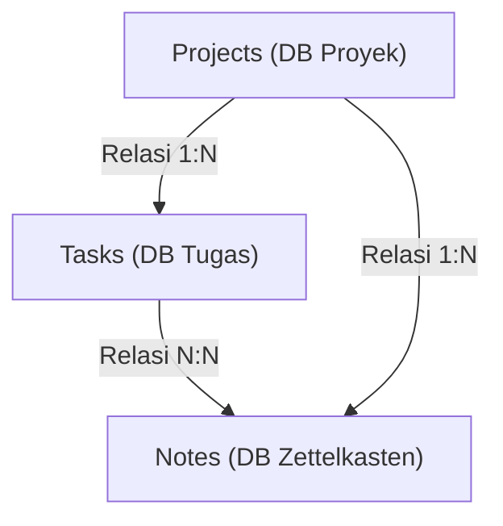
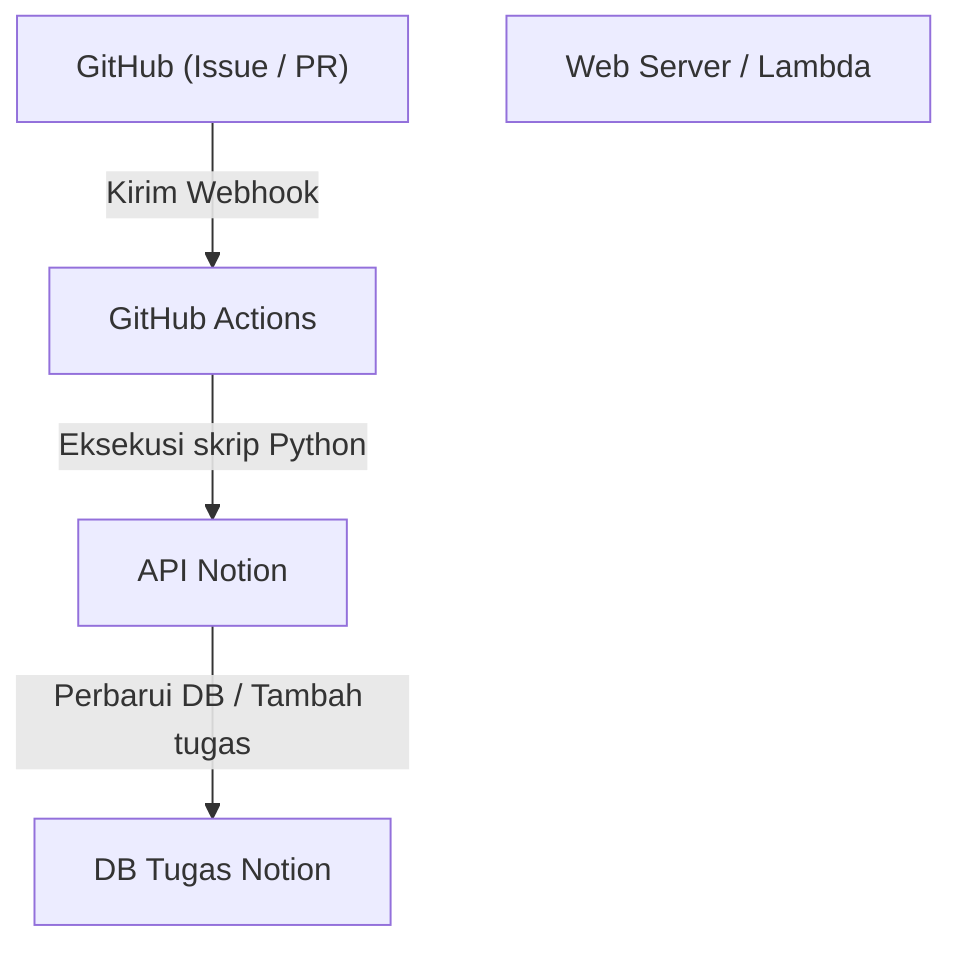

# Manajemen Tugas untuk Pengembangan Personal dan Penulisan Blog Menggunakan Notion

Dalam melanjutkan pengembangan personal dan penulisan blog, manajemen tugas, mempertahankan motivasi, dan bagaimana menyimpan serta memanfaatkan ide-ide harian adalah tema yang sangat penting. Semakin besar sebuah proyek, semakin banyak tugas yang harus diselesaikan, dan seringkali kita bingung harus mulai dari mana. Selain itu, masalah juga muncul tentang di mana dan bagaimana menyimpan informasi yang muncul sehari-hari, seperti ide blog atau catatan teknis.

Sebagai alat yang dapat menyelesaikan berbagai kebutuhan ini dalam satu platform, yang paling kuat saat ini adalah **Notion**. Dalam artikel ini, kita tidak hanya akan menjadikan Notion sebagai sekadar buku catatan atau alat manajemen tugas, tetapi akan mengintegrasikan pengembangan personal dan penulisan blog secara mulus, serta membahas "teknik manajemen tugas pamungkas" yang menggabungkan otomatisasi dan manajemen kemajuan tingkat lanjut, dari sudut pandang yang sangat detail dan teknis.

---

## 1. Afinitas antara Metode PARA dan Notion

Pertama-tama, mari kita bahas tentang dasar bagaimana mengatur informasi. Pada alat dengan tingkat kebebasan yang tinggi seperti Notion, halaman dan basis data (database) cenderung bertambah secara tidak teratur, yang seringkali menyebabkan keadaan "tidak tahu di mana letak suatu hal". Untuk mencegah hal ini, kita akan memperkenalkan **metode PARA** yang diusulkan oleh Tiago Forte.

Metode PARA adalah pendekatan yang mengklasifikasikan informasi ke dalam 4 kategori berikut:

1. **Projects (Proyek)**: Kumpulan tugas yang memiliki tujuan dan batas waktu yang jelas (contoh: "Rilis aplikasi web baru", "Pembaruan desain blog").
2. **Areas (Area)**: Area tanggung jawab yang perlu dipertahankan dan dikelola dalam jangka panjang (contoh: "Kesehatan", "Operasional blog (berkelanjutan)", "Keuangan").
3. **Resources (Sumber Daya)**: Topik yang diminati atau informasi yang mungkin berguna di masa depan (contoh: "Cuplikan kode Python", "Bahan referensi desain UI").
4. **Archives (Arsip)**: Proyek yang telah selesai, atau informasi yang saat ini tidak aktif tetapi ingin disimpan.

Untuk mewujudkan hal ini di Notion, mulailah dengan membagi hierarki di bilah sisi kiri secara ketat ke dalam 4 kategori ini. Khususnya, dengan memisahkan "Projects" dan "Areas/Resources", tugas yang harus Anda fokuskan sekarang (Projects) tidak akan bercampur dengan masukan untuk hal tersebut (Resources), sehingga dapat mempertahankan pemikiran yang jernih.

---

## 2. Desain Basis Data: Struktur Relasional Projects dan Tasks

Kekuatan sejati Notion terletak pada basis data relasional. Dalam manajemen tugas, hal yang paling harus dihindari adalah mengelola semua tugas dalam satu daftar datar. Dengan membagi tugas berdasarkan proyek dan menghubungkannya, Anda akan dapat memahami gambaran keseluruhan dan detailnya secara bersamaan.

Di sini, kita akan membuat basis data "Projects (Proyek)" dan basis data "Tasks (Tugas)", lalu menghubungkannya menggunakan properti relasi.

### Diagram Korelasi Basis Data

Diagram Mermaid di bawah ini menunjukkan relasi antara basis data Projects, Tasks, dan Notes (Zettelkasten) yang akan dibahas nanti.



### Properti Basis Data Projects
- `Project Name` (Title)
- `Status` (Select: "Not Started", "In Progress", "Completed")
- `Deadline` (Date)
- `Tasks` (Relation: Terhubung dengan basis data Tasks)
- `Progress` (Rollup & Formula: Dibahas di bawah)

### Properti Basis Data Tasks
- `Task Name` (Title)
- `Status` (Status: "To Do", "In Progress", "Done")
- `Priority` (Select: "High", "Medium", "Low")
- `Project` (Relation: Terhubung dengan basis data Projects)
- `Due Date` (Date)
- `Story Points` (Number: Memperkirakan skala tugas)

Dengan membagi basis data seperti ini, ketika Anda membuka layar proyek, dimungkinkan untuk membuat tampilan tingkat lanjut seperti memfilter dan hanya menampilkan tugas yang termasuk dalam proyek tersebut (pemanfaatan basis data yang tertaut).

---

## 3. Visualisasi Kemajuan Memanfaatkan Rollup dan Formula

Untuk memahami kemajuan proyek secara intuitif, kita akan membuat bilah kemajuan (progress bar) menggunakan fungsi Formula di Notion. Hal ini memungkinkan Anda untuk mengetahui secara sekilas "seberapa jauh proyek ini telah berjalan".

### Agregasi Data melalui Rollup
Pertama, di basis data Projects, buat dua properti Rollup berikut dari relasi Tasks.
1. `Total Tasks` (Rollup): Dapatkan "jumlah keseluruhan (Count all)" tugas dari relasi Tasks.
2. `Completed Tasks` (Rollup): Dapatkan jumlah tugas yang statusnya "Done" dari relasi Tasks (※ atau gunakan fungsi untuk menghitung tugas yang selesai).

### Perhitungan Bilah Kemajuan melalui Formula
Selanjutnya, buat properti Formula dan masukkan rumus perhitungan berikut.

```javascript
// Rumus perhitungan untuk bilah kemajuan
round(prop("Completed Tasks") / prop("Total Tasks") * 100)
```
Pada Formula 2.0 terbaru dari Notion, berdasarkan hal ini, Anda sekarang dapat mengatur bilah kemajuan visual (berbentuk cincin atau bilah) secara langsung di UI. Jika Anda ingin bersikeras menggunakan metode penulisan lama atau menampilkan bilah kemajuan berbasis teks, Anda juga dapat menggunakan percabangan kondisional seperti di bawah ini.

```javascript
// Bilah kemajuan berbasis teks (Contoh)
let(
    percent, round(prop("Completed Tasks") / prop("Total Tasks") * 100),
    style(percent + "% ", "b") + 
    slice("▓▓▓▓▓▓▓▓▓▓", 0, floor(percent / 10)) + 
    slice("░░░░░░░░░░", 0, 10 - floor(percent / 10))
)
```

### Pendekatan Matematis untuk Kecepatan (Velocity) dan Prediksi Penyelesaian

Dalam pengembangan personal, mengetahui kecepatan Anda dalam menyelesaikan tugas (Velocity) akan berhubungan langsung dengan manajemen jadwal yang sangat akurat.
Jika total poin cerita (story points) yang dapat diselesaikan dalam 1 minggu dianggap sebagai Velocity $V$, maka hal ini dapat dinyatakan dengan persamaan berikut.

$$ V = \frac{\sum_{i=1}^{n} SP_i}{T} $$

Di mana, $SP_i$ adalah poin cerita dari tugas $i$ yang diselesaikan, dan $T$ adalah periode pengukuran (misalnya, jumlah minggu sprint).

Jika total sisa poin cerita dari proyek saat ini adalah $W$, maka prediksi waktu penyelesaian proyek $E$ dapat dihitung sebagai berikut.

$$ E = \frac{W}{V} $$

Meskipun melakukan perhitungan ini sepenuhnya di dalam Notion sedikit rumit, sangat efektif untuk menempatkan blok perhitungan (Math block) di tugas ulasan mingguan dan mencatatnya sebagai indikator evaluasi diri.

---

## 4. Praktik Papan Kanban dan Tampilan Garis Waktu (Timeline)

"Tampilan" untuk mengelola tugas juga penting. Di Notion, Anda dapat menampilkan (tampilan) basis data yang sama dalam format yang berbeda.

### Papan Kanban (Board View)
Tampilan default untuk basis data "Tasks" akan menjadi papan Kanban yang mengelompokkan Status (To Do / In Progress / Done). Hal ini memungkinkan Anda untuk memindahkan tugas secara intuitif dengan metode seret & lepas (drag & drop), serta memeriksa secara visual apakah ada hambatan saat ini yang menumpuk di kolom "In Progress".

### Garis Waktu (Timeline View)
Untuk "Projects" atau "Tasks" dengan skala yang lebih besar, tampilan Timeline akan sangat efektif. Dengan cara ini, jadwal dari kapan hingga kapan suatu pekerjaan akan dilakukan divisualisasikan seperti bagan Gantt (Gantt chart), sehingga lebih mudah untuk memahami hal-hal yang tidak masuk akal dalam pengerjaan tugas secara paralel (parallel tasks) dan dependensi (tugas berikutnya tidak dapat dilanjutkan kecuali tugas sebelumnya selesai).

---

## 5. Membuat Jaringan Pengetahuan dengan Zettelkasten dan Basis Data Notes

Dalam penulisan blog, "mulai menulis artikel dari kertas kosong" adalah hal yang paling menyiksa dan menjadi penyebab macetnya tulisan. Oleh karena itu, kita akan memperkenalkan konsep "**Zettelkasten (metode kotak kartu)**" yang diciptakan oleh sosiolog Jerman Niklas Luhmann ke dalam Notion.

Aturan dasar Zettelkasten adalah "hanya menulis satu ide dalam satu catatan (sifat Atomic)" dan "menautkan catatan satu sama lain untuk membuat jaringan".

### Desain Basis Data Notes
- `Note Title` (Title)
- `Tags` (Multi-select)
- `Related Notes` (Relation: Terhubung dengan basis data Notes itu sendiri)
- `Tasks` (Relation: Terhubung dengan tugas penulisan blog)

### Alur Kerja Penulisan Blog
1. Kumpulkan pengetahuan yang diperoleh dari pengembangan sehari-hari atau ide-ide yang muncul sebagai "Notes" yang terpisah secara terus-menerus.
2. Jika ada tema yang sama di antara catatan-catatan tersebut, tautkan (tautan dua arah) menggunakan properti `Related Notes`.
3. Ketika Anda mulai mengerjakan tugas menulis blog (Tasks), panggil basis data yang tertaut di dalam halaman tugas tersebut, dan sejajarkan Notes yang relevan.
4. Hanya dengan menggabungkan potongan-potongan catatan, kerangka (outline) blog akan selesai.

Dengan melakukan ini, penulisan blog berubah dari "kreasi dari nol" menjadi "pekerjaan mengedit pengetahuan yang telah dikumpulkan", dan kecepatan menulis Anda akan meningkat drastis.

---

## 6. Otomatisasi Pamungkas Menggunakan API Notion dan Python

Mulai dari sini adalah sorotan terbesar dari artikel ini, yaitu bagian otomatisasi teknis. Memasukkan tugas dan mengubah status secara manual adalah buang-buang waktu dalam pengembangan personal. Dengan memanfaatkan API Notion, kita akan membangun sistem yang menyinkronkan Issue GitHub dan tugas Notion, serta mencerminkan status penerapan (deploy) blog ke Notion.

### Gambaran Umum Arsitektur



### Membuat Tugas Notion Secara Otomatis dari GitHub Issues

Berikut adalah contoh implementasi skrip Python yang secara otomatis menambahkan item ke basis data Tasks di Notion setiap kali Issue dibuat di GitHub.

Sebelumnya, Anda perlu membuat integrasi Notion dan mendapatkan `NOTION_API_KEY` serta `DATABASE_ID`.

```python
import os
import requests
import json

# Dapatkan token dan ID basis data dari variabel lingkungan
NOTION_API_KEY = os.environ.get("NOTION_API_KEY")
DATABASE_ID = os.environ.get("DATABASE_ID")

def create_notion_task(issue_title, issue_url):
    url = "https://api.notion.com/v1/pages"
    
    headers = {
        "Authorization": f"Bearer {NOTION_API_KEY}",
        "Content-Type": "application/json",
        "Notion-Version": "2022-06-28"
    }
    
    data = {
        "parent": { "database_id": DATABASE_ID },
        "properties": {
            "Task Name": {
                "title": [
                    {
                        "text": {
                            "content": issue_title
                        }
                    }
                ]
            },
            "Status": {
                "status": {
                    "name": "To Do"
                }
            },
            "URL": {
                "url": issue_url
            }
        }
    }
    
    response = requests.post(url, headers=headers, data=json.dumps(data))
    
    if response.status_code == 200:
        print("Task created successfully in Notion!")
    else:
        print(f"Failed to create task: {response.text}")

# Diasumsikan menerima argumen dari GitHub Actions dll.
if __name__ == "__main__":
    # Contoh: python sync.py "Perbaikan bug: Layar login rusak" "https://github.com/user/repo/issues/1"
    import sys
    if len(sys.argv) >= 3:
        create_notion_task(sys.argv[1], sys.argv[2])
```

Dengan memasukkan skrip ini ke dalam alur kerja GitHub Actions (`.github/workflows/issue_to_notion.yml`), tugas akan dibuat secara otomatis di Notion setiap kali ada Issue di repositori. Pengembang akan terbebas dari kerumitan bolak-balik antara GitHub dan Notion.

### Pembaruan Otomatis Status Publikasi Blog Menggunakan cURL

Jika Anda men-deploy blog Anda di layanan hosting seperti Vercel atau Netlify, dimungkinkan untuk menerima Webhook penyelesaian penerapan (deploy) dan secara otomatis mengubah status tugas Notion (contoh: "Penulisan dan publikasi artikel A") menjadi "Done".

Contoh perintah cURL untuk memperbarui properti halaman (tugas) tertentu adalah sebagai berikut.

```bash
curl -X PATCH 'https://api.notion.com/v1/pages/PAGE_ID' \
  -H 'Authorization: Bearer '"$NOTION_API_KEY"'' \
  -H "Content-Type: application/json" \
  -H "Notion-Version: 2022-06-28" \
  --data '{
    "properties": {
      "Status": {
        "status": {
          "name": "Done"
        }
      }
    }
  }'
```

Dengan mengintegrasikan panggilan API ini ke dalam langkah terakhir saluran (pipeline) CI/CD, Anda dapat menyelesaikan otomatisasi penuh: "Push kode → Di-deploy secara otomatis → Tugas Notion secara otomatis selesai".

---

## 7. Praktik Terbaik Operasional dan Tips Konsistensi

Tidak peduli seberapa canggih sistem atau alat yang Anda bangun, jika orang yang mengoperasikannya kelelahan, maka itu akan menjadi sia-sia. Terakhir, saya akan memperkenalkan beberapa tips untuk mempertahankan sistem Notion ini agar tidak hancur.

1. **Jaga tetap sederhana**: Jangan membuat terlalu banyak properti sempurna atau relasi rumit sejak awal. Pertahankan "pengembangan Notion yang agile" dengan menambahkan properti saat dibutuhkan.
2. **Disiplin dalam Ulasan Mingguan (Weekly Review)**: Tentukan waktu, misalnya setiap Minggu malam, untuk meninjau keseluruhan Notion. Jaga sistem tetap bersih dengan mengatur tugas yang telah selesai, menjadwalkan ulang tugas yang melewati batas waktu, dan memberi tag pada Notes yang belum diklasifikasikan.
3. **Pemanfaatan Inbox**: Sangat merepotkan untuk menyortir setiap ide atau tugas yang muncul ke dalam basis data yang sesuai satu per satu. Pengoperasian yang paling bebas stres adalah membuat basis data "Inbox" tempat membuang semuanya terlebih dahulu, kemudian mendistribusikannya ke Projects atau Notes nanti (seperti saat ulasan mingguan).

## 8. Kesimpulan

Manajemen tugas menggunakan Notion jauh melampaui daftar To-Do belaka. Dengan menggabungkan penataan informasi melalui metode PARA, pembuatan jaringan pengetahuan melalui Zettelkasten, dan rekayasa melalui API Notion, Anda dapat membangun "Otak Kedua (Second Brain)" yang sangat mendorong pengembangan personal dan penulisan blog Anda.

Meskipun pengaturan awal membutuhkan beberapa waktu, setelah sistem mulai berjalan, beban kognitif yang diperlukan untuk manajemen tugas akan menurun drastis, dan Anda dapat sepenuhnya fokus pada hal yang benar-benar penting: "menulis kode" dan "menulis teks". Pastikan untuk menjadikan artikel ini sebagai referensi, dan cobalah untuk membangun ruang kerja Notion terkuat versi Anda sendiri.
