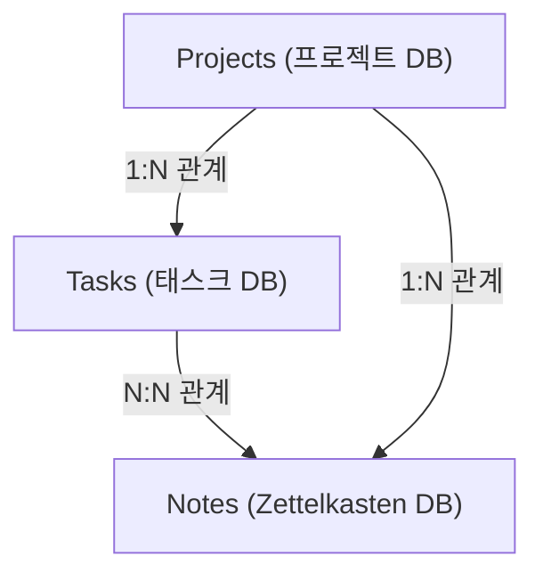
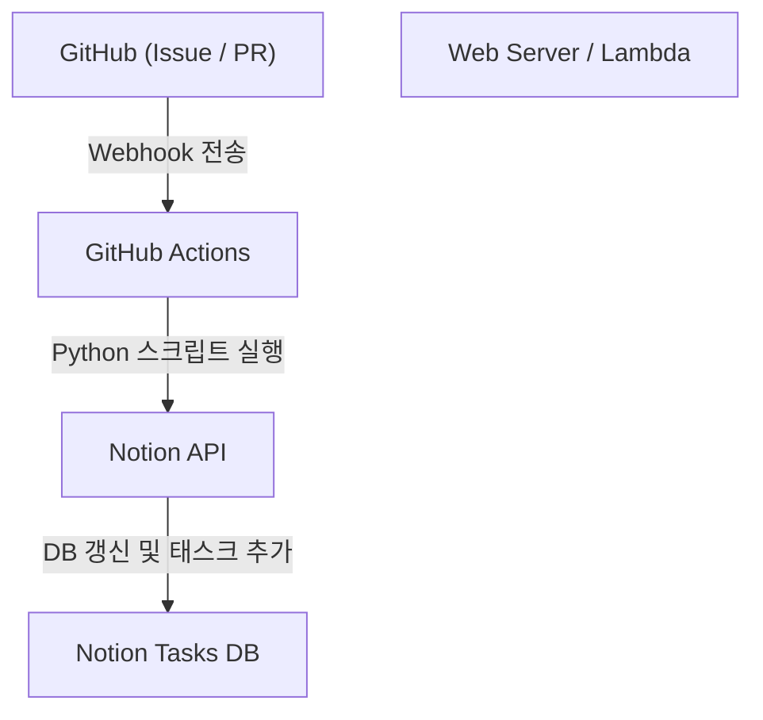

# Notion을 활용한 개인 개발 및 블로그 집필 태스크 관리술

개인 개발이나 블로그 집필을 지속해 나가는 데 있어, 태스크 관리와 동기 부여 유지, 그리고 일상의 아이디어를 어떻게 축적하고 활용할 것인가는 매우 중요한 주제입니다. 프로젝트가 커지면 커질수록 해야 할 일은 늘어나고, 어떤 작업부터 손을 대야 할지 망설이게 되는 경우가 많습니다. 더욱이 블로그 소재나 기술적인 메모 등 일상적으로 발생하는 정보를 어디에, 어떻게 저장할 것인지도 과제가 됩니다.

이러한 다양한 니즈를 하나의 플랫폼에서 해결할 수 있는 도구로서 현재 가장 강력한 것이 **Notion**입니다. 본 기사에서는 Notion을 단순한 메모장이나 태스크 관리 도구로 끝내지 않고, 개인 개발과 블로그 집필을 원활하게 통합하며, 자동화 및 고도화된 진척 관리를 도입한 '궁극의 태스크 관리술'을 매우 상세하고 기술적인 관점에서 해설합니다.

---

## 1. PARA 메서드와 Notion의 친화성

먼저 정보를 어떻게 정리할 것인가 하는 토대 부분부터 이야기하겠습니다. Notion과 같이 자유도가 높은 도구에서는 페이지나 데이터베이스가 무질서하게 증식해 버려 '어디에 무엇이 있는지 모르는' 상태에 빠지기 쉽습니다. 이를 방지하기 위해 Tiago Forte 씨가 제창하는 **PARA 메서드**를 도입합니다.

PARA 메서드는 정보를 다음 4가지 카테고리로 분류하는 기법입니다.

1. **Projects (프로젝트)**: 명확한 목표와 기한을 가진 태스크의 집합 (예: "새로운 웹 앱 릴리스", "블로그 디자인 리뉴얼").
2. **Areas (영역)**: 장기적으로 유지 및 관리해야 하는 책임 영역 (예: "건강", "블로그 운영(지속적)", "재무").
3. **Resources (리소스)**: 관심 있는 주제나 장래에 도움이 될지도 모르는 정보 (예: "Python 코드 스니펫", "UI 디자인 참고 자료").
4. **Archives (아카이브)**: 완료된 프로젝트나 현재는 활성화되어 있지 않지만 저장해 두고 싶은 정보.

Notion에서 이를 실현하기 위해서는 왼쪽 사이드바의 계층을 이 4가지로 엄격하게 나누는 것부터 시작합니다. 특히 'Projects'와 'Areas/Resources'를 분리함으로써, 지금 집중해야 할 태스크(Projects)와 이를 위한 인풋(Resources)이 섞이지 않고 명확한 사고를 유지할 수 있습니다.

---

## 2. 데이터베이스 설계: Projects와 Tasks의 관계형 구조

Notion의 진정한 힘은 관계형 데이터베이스에 있습니다. 태스크 관리에서 가장 피해야 할 것은 모든 태스크를 플랫한 하나의 리스트로 관리해 버리는 것입니다. 프로젝트별로 태스크를 분할하고 이들을 연관시킴으로써, 전체적인 흐름과 세부 사항을 동시에 파악할 수 있게 됩니다.

여기에서는 'Projects(프로젝트)' 데이터베이스와 'Tasks(태스크)' 데이터베이스를 생성하고, 이들을 관계형 속성(Relation)으로 연결합니다.

### 데이터베이스의 상관도

다음의 Mermaid 다이어그램은 Projects, Tasks, 그리고 후술할 Notes(Zettelkasten) 데이터베이스 간의 관계를 보여줍니다.



### Projects 데이터베이스의 속성
- `Project Name` (Title)
- `Status` (Select: "Not Started", "In Progress", "Completed")
- `Deadline` (Date)
- `Tasks` (Relation: Tasks 데이터베이스와 연결)
- `Progress` (Rollup & Formula: 후술)

### Tasks 데이터베이스의 속성
- `Task Name` (Title)
- `Status` (Status: "To Do", "In Progress", "Done")
- `Priority` (Select: "High", "Medium", "Low")
- `Project` (Relation: Projects 데이터베이스와 연결)
- `Due Date` (Date)
- `Story Points` (Number: 태스크의 규모를 추정)

이처럼 데이터베이스를 분리함으로써, 프로젝트 화면을 열었을 때 해당 프로젝트에 속하는 태스크만 필터링하여 표시하는(링크된 데이터베이스 활용) 등 고도화된 뷰(View)를 작성할 수 있게 됩니다.

---

## 3. Rollup과 Formula를 활용한 진척 상황의 시각화

프로젝트의 진척을 직관적으로 파악하기 위해 Notion의 Formula(수식) 기능을 사용하여 프로그레스 바(진행률 표시줄)를 작성합니다. 이를 통해 '지금 이 프로젝트는 어느 정도 진행되었는가'를 한눈에 알 수 있게 됩니다.

### Rollup을 통한 데이터 집계
먼저 Projects 데이터베이스에서, Tasks 데이터베이스로부터 다음 2가지 Rollup 속성을 생성합니다.
1. `Total Tasks` (Rollup): Tasks 관계형에서 태스크의 '수(Count all)'를 가져옴.
2. `Completed Tasks` (Rollup): Tasks 관계형에서 상태(Status)가 "Done"으로 되어 있는 태스크의 수를 가져옴 (※또는 함수를 사용하여 완료 태스크를 카운트).

### Formula에 의한 프로그레스 바 계산
다음으로 Formula 속성을 생성하고, 이하의 계산식을 입력합니다.

```javascript
// 프로그레스 바 계산식
round(prop("Completed Tasks") / prop("Total Tasks") * 100)
```
Notion의 최신 Formula 2.0에서는 이를 바탕으로 시각적인 프로그레스 바(링 모양이나 바 모양)를 UI 상에서 직접 설정할 수 있게 되었습니다. 만약 구형 작성 방법이나 텍스트 형태의 프로그레스 바 표시를 고집한다면, 다음과 같은 조건 분기를 사용하는 것도 가능합니다.

```javascript
// 텍스트 기반의 프로그레스 바 (예)
let(
    percent, round(prop("Completed Tasks") / prop("Total Tasks") * 100),
    style(percent + "% ", "b") + 
    slice("▓▓▓▓▓▓▓▓▓▓", 0, floor(percent / 10)) + 
    slice("░░░░░░░░░░", 0, 10 - floor(percent / 10))
)
```

### 벨로시티(개발 속도)와 완료 예측의 수리적 접근

개인 개발에 있어서, 자신이 어느 정도의 페이스로 태스크를 소화할 수 있는지(벨로시티)를 아는 것은 정밀도 높은 일정 관리에 직결됩니다.
1주일에 소화할 수 있는 스토리 포인트의 합계를 벨로시티 $V$ 라고 하면, 다음과 같은 식으로 표현됩니다.

$$ V = \frac{\sum_{i=1}^{n} SP_i}{T} $$

여기서 $SP_i$ 는 완료한 태스크 $i$ 의 스토리 포인트, $T$ 는 측정 기간(예를 들어 스프린트의 주 수)입니다.

만약 현재 프로젝트의 남은 전체 스토리 포인트가 $W$ 라면, 프로젝트 완료까지의 예측 기간 $E$ 는 다음과 같이 계산할 수 있습니다.

$$ E = \frac{W}{V} $$

이 계산을 Notion 내에서 완벽하게 수행하는 것은 조금 복잡하지만, 주간 리뷰(Weekly Review) 태스크 등에서 계산용 블록(Math block)을 두고 자기 평가의 지표로서 기록해 나가는 것이 매우 효과적입니다.

---

## 4. Kanban 보드와 타임라인 뷰의 실천

태스크를 관리하기 위한 '뷰(View)'도 중요합니다. Notion에서는 같은 데이터베이스를 다양한 형식으로 표시(뷰)할 수 있습니다.

### Kanban 보드 (Board View)
'Tasks' 데이터베이스의 기본 뷰는 Status(To Do / In Progress / Done)를 그룹화한 칸반(Kanban) 보드로 설정합니다. 이를 통해 태스크를 드래그 앤 드롭으로 직관적으로 움직일 수 있으며, 현재의 병목 현상이 '진행 중' 열에 쌓여 있지 않은지를 시각적으로 체크할 수 있습니다.

### 타임라인 (Timeline View)
'Projects'나 스케일이 조금 큰 'Tasks'에 대해서는 타임라인(Timeline) 뷰가 유용합니다. 이를 통해 간트 차트(Gantt chart)처럼 언제부터 언제까지 어떤 작업을 할 것인지가 시각화되며, 태스크의 병행 작업(병렬 태스크)에 무리가 없는지, 의존 관계(어떤 태스크가 끝나지 않으면 다음으로 진행할 수 없음)를 파악하기 쉬워집니다.

---

## 5. Zettelkasten과 Notes 데이터베이스를 통한 지식의 네트워크화

블로그 집필에 있어서, '백지 상태에서 기사를 쓰기 시작하는 것'은 가장 고통스러우며 펜이 멈추는 원인입니다. 그래서 독일의 사회학자 니클라스 루만(Niklas Luhmann)이 고안한 '**Zettelkasten(제텔카스텐, 카드박스법)**' 개념을 Notion에 도입합니다.

Zettelkasten의 기본 규칙은 '하나의 노트에는 하나의 아이디어만 적는다(Atomic한 성질)'는 것과 '노트끼리 링크를 연결하여 네트워크를 만든다'는 것입니다.

### Notes 데이터베이스 설계
- `Note Title` (Title)
- `Tags` (Multi-select)
- `Related Notes` (Relation: Notes 데이터베이스 자신과 연결)
- `Tasks` (Relation: 블로그 집필 태스크와 연결)

### 블로그 집필의 워크플로우
1. 일상적인 개발에서 얻은 지식이나, 떠오른 아이디어를 단편적인 'Notes'로서 계속해서 축적합니다.
2. 그 노트들 간에 공통된 테마가 있다면, `Related Notes` 속성을 사용하여 링크(양방향 링크)시킵니다.
3. 막상 블로그를 쓰는 태스크(Tasks)에 착수할 때, 해당 태스크 페이지 내에서 링크된 데이터베이스를 불러와 관련 Notes를 나열합니다.
4. 노트의 단편들을 이어 붙이는 것만으로 블로그의 뼈대(아웃라인)가 완성됩니다.

이를 통해 블로그 집필은 '무(無)에서의 창조'가 아니라 '축적한 지식의 편집 작업'으로 변화하며, 극적으로 집필 속도가 향상됩니다.

---

## 6. Notion API와 Python을 사용한 궁극의 자동화

여기서부터가 본 기사의 최대 하이라이트인 기술적인 자동화 섹션입니다. 수동으로 태스크를 입력하거나 상태를 변경하는 것은 개인 개발에 있어서 시간 낭비입니다. Notion API를 활용하여, GitHub의 Issue와 Notion의 태스크를 동기화하거나 블로그의 배포(Deploy) 상황을 Notion에 반영하는 시스템을 구축합니다.

### 아키텍처 개요



### GitHub Issues에서 Notion 태스크 자동 생성하기

GitHub에서 Issue가 생성되었을 때 자동으로 Notion의 Tasks 데이터베이스에 항목을 추가하는 Python 스크립트의 구현 예시입니다.

사전에 Notion의 인테그레이션(Integration)을 생성하고, `NOTION_API_KEY`와 `DATABASE_ID`를 얻어 두어야 합니다.

```python
import os
import requests
import json

# 환경 변수에서 토큰과 데이터베이스 ID를 가져옴
NOTION_API_KEY = os.environ.get("NOTION_API_KEY")
DATABASE_ID = os.environ.get("DATABASE_ID")

def create_notion_task(issue_title, issue_url):
    url = "https://api.notion.com/v1/pages"
    
    headers = {
        "Authorization": f"Bearer {NOTION_API_KEY}",
        "Content-Type": "application/json",
        "Notion-Version": "2022-06-28"
    }
    
    data = {
        "parent": { "database_id": DATABASE_ID },
        "properties": {
            "Task Name": {
                "title": [
                    {
                        "text": {
                            "content": issue_title
                        }
                    }
                ]
            },
            "Status": {
                "status": {
                    "name": "To Do"
                }
            },
            "URL": {
                "url": issue_url
            }
        }
    }
    
    response = requests.post(url, headers=headers, data=json.dumps(data))
    
    if response.status_code == 200:
        print("Task created successfully in Notion!")
    else:
        print(f"Failed to create task: {response.text}")

# GitHub Actions 등에서 인수로 받을 것을 가정
if __name__ == "__main__":
    # 예: python sync.py "버그 수정: 로그인 화면이 깨짐" "https://github.com/user/repo/issues/1"
    import sys
    if len(sys.argv) >= 3:
        create_notion_task(sys.argv[1], sys.argv[2])
```

이 스크립트를 GitHub Actions의 워크플로우(`.github/workflows/issue_to_notion.yml`)에 포함시킴으로써, 리포지토리에 Issue가 등록될 때마다 Notion에 태스크가 자동 생성되게 됩니다. 개발자는 GitHub와 Notion을 오가는 수고에서 해방됩니다.

### cURL을 이용한 블로그 공개 상태의 자동 갱신

블로그를 Vercel이나 Netlify 등 호스팅 서비스에 배포하고 있는 경우, 배포 완료 Webhook을 수신하여 Notion의 태스크(예: '기사 A 집필 및 공개')의 상태를 자동으로 "Done"으로 변경하는 것이 가능합니다.

특정 페이지(태스크)의 속성을 갱신하는 cURL 명령어의 예는 다음과 같습니다.

```bash
curl -X PATCH 'https://api.notion.com/v1/pages/PAGE_ID' \
  -H 'Authorization: Bearer '"$NOTION_API_KEY"'' \
  -H "Content-Type: application/json" \
  -H "Notion-Version: 2022-06-28" \
  --data '{
    "properties": {
      "Status": {
        "status": {
          "name": "Done"
        }
      }
    }
  }'
```

이 API 호출을 CI/CD 파이프라인의 마지막 단계에 조립해 넣으면, '코드를 푸시한다 → 자동 배포된다 → Notion 태스크가 자동으로 완료(Done)된다'는 풀 오토메이션이 완성됩니다.

---

## 7. 운용상의 베스트 프랙티스와 지속의 비결

시스템이나 도구를 아무리 고도화하여 구축하더라도, 그것을 운용하는 사람이 지쳐 버리면 주객전도가 됩니다. 마지막으로 이 Notion 시스템을 파탄 내지 않고 지속하기 위한 비결을 몇 가지 소개합니다.

1. **단순함을 유지할 것**: 처음부터 완벽한 속성이나 복잡한 관계형을 너무 많이 만들지 마세요. 필요해진 시점에 속성을 추가하는 '애자일(Agile)한 Notion 구축'을 명심합시다.
2. **주간 리뷰(Weekly Review)의 철저화**: 매주 일요일 밤 등 시간을 정해 Notion 전체를 재검토합니다. 완료된 태스크의 정리, 기한이 지난 태스크의 재스케줄링, 미분류 Notes의 태그 지정 등을 수행하여 시스템을 깔끔하게 유지합니다.
3. **Inbox의 활용**: 떠오른 아이디어나 태스크를 일일이 적절한 데이터베이스에 분류하는 것은 번거로운 일입니다. 우선은 모든 것을 집어넣는 'Inbox' 데이터베이스를 만들고, 나중에(주간 리뷰 등에서) Projects나 Notes로 분류하는 방식이 스트레스가 없습니다.

## 8. 정리

Notion을 활용한 태스크 관리는 단순한 To-Do 리스트의 영역을 훨씬 넘어서고 있습니다. PARA 메서드에 의한 정보 정리, Zettelkasten에 의한 지식의 네트워크화, 그리고 Notion API를 통한 엔지니어링을 결합함으로써 개인 개발과 블로그 집필을 강력하게 부스트하는 '제2의 뇌(Second Brain)'를 구축할 수 있습니다.

초기 설정에는 다소 시간이 걸리지만, 한 번 시스템이 돌아가기 시작하면 태스크 관리에 드는 인지 부하는 극적으로 낮아지고 정말로 중요한 '코드를 작성하는 것'과 '글을 쓰는 것'에 온전히 집중할 수 있게 됩니다. 부디 본 기사를 참고하여 여러분만의 최강의 Notion 워크스페이스를 만들어 보시기 바랍니다.
