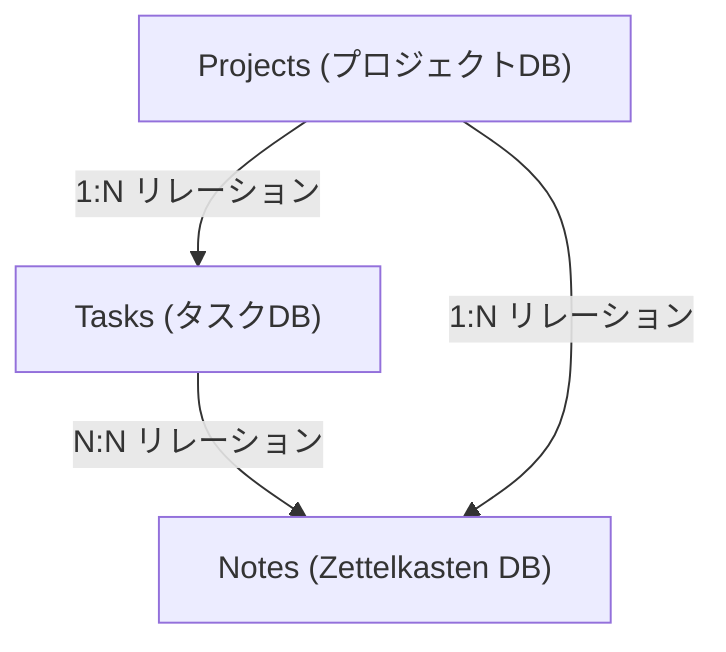
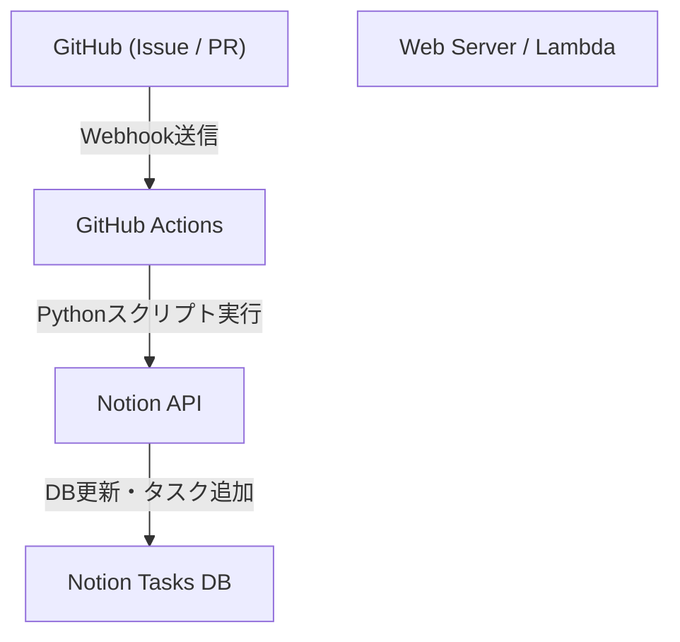

# Notionを使った個人開発・ブログ執筆のタスク管理術

個人開発やブログ執筆を継続していく上で、タスク管理やモチベーションの維持、そして日々のアイデアをいかにストックして活用するかは、非常に重要なテーマです。プロジェクトが大きくなればなるほど、やるべきタスクは増え、どの作業から手をつけるべきか迷ってしまうことが多々あります。さらに、ブログのネタや技術的なメモなど、日常的に発生する情報をどこに、どのように保存するかも課題となります。

このような多様なニーズを1つのプラットフォームで解決できるツールとして、現在最も強力なのが**Notion**です。本記事では、Notionを単なるメモ帳やタスク管理ツールとして終わらせず、個人開発とブログ執筆をシームレスに統合し、自動化や高度な進捗管理を取り入れた「究極のタスク管理術」を、非常に詳細かつ技術的な視点から解説します。

---

## 1. PARAメソッドとNotionの親和性

まずは、情報をどのように整理するかという土台の部分からお話しします。Notionのような自由度の高いツールでは、ページやデータベースが無秩序に増殖してしまい、「どこに何があるか分からない」状態に陥りがちです。これを防ぐために、Tiago Forte氏が提唱する**PARAメソッド**を導入します。

PARAメソッドは、情報を以下の4つのカテゴリに分類する手法です。

1. **Projects（プロジェクト）**: 明確な目標と期限を持つタスクの集合（例：「新しいWebアプリのリリース」「ブログのデザインリニューアル」）。
2. **Areas（領域）**: 長期的に維持・管理する必要がある責任領域（例：「健康」「ブログ運営（継続的）」「財務」）。
3. **Resources（リソース）**: 興味のあるトピックや、将来役立つかもしれない情報（例：「Pythonのコードスニペット」「UIデザインの参考資料」）。
4. **Archives（アーカイブ）**: 完了したプロジェクトや、現在はアクティブではないが保存しておきたい情報。

Notion上でこれを実現するためには、左側のサイドバーの階層をこの4つに厳格に分けることから始めます。特に「Projects」と「Areas/Resources」を分離することで、今集中すべきタスク（Projects）と、そのためのインプット（Resources）が混ざらず、クリアな思考を保つことができます。

---

## 2. データベース設計：ProjectsとTasksのリレーショナル構造

Notionの真の力は、リレーショナルデータベースにあります。タスク管理において最も避けるべきは、すべてのタスクをフラットな1つのリストで管理してしまうことです。プロジェクトごとにタスクを分割し、それらを関連付けることで、全体像と詳細を同時に把握できるようになります。

ここでは、「Projects（プロジェクト）」データベースと「Tasks（タスク）」データベースを作成し、それらをリレーションプロパティで結びつけます。

### データベースの相関図

以下のMermaid図は、Projects、Tasks、そして後述するNotes（Zettelkasten）のデータベース間のリレーションを示しています。



### Projectsデータベースのプロパティ
- `Project Name` (Title)
- `Status` (Select: "Not Started", "In Progress", "Completed")
- `Deadline` (Date)
- `Tasks` (Relation: Tasksデータベースと紐付け)
- `Progress` (Rollup & Formula: 後述)

### Tasksデータベースのプロパティ
- `Task Name` (Title)
- `Status` (Status: "To Do", "In Progress", "Done")
- `Priority` (Select: "High", "Medium", "Low")
- `Project` (Relation: Projectsデータベースと紐付け)
- `Due Date` (Date)
- `Story Points` (Number: タスクの規模を見積もる)

このようにデータベースを分けることで、プロジェクト画面を開いたときに、そのプロジェクトに属するタスクだけをフィルタリングして表示する（リンクされたデータベースの活用）といった高度なビューが作成可能になります。

---

## 3. RollupとFormulaを活用した進捗の可視化

プロジェクトの進捗を直感的に把握するために、NotionのFormula（関数）機能を使ってプログレスバーを作成します。これにより、「今このプロジェクトはどれくらい進んでいるのか」が一目でわかるようになります。

### Rollupによるデータ集計
まず、Projectsデータベースにて、Tasksデータベースから以下の2つのRollupプロパティを作成します。
1. `Total Tasks` (Rollup): Tasksリレーションから、タスクの「数（Count all）」を取得。
2. `Completed Tasks` (Rollup): Tasksリレーションから、ステータスが"Done"になっているタスクの数を取得（※あるいは関数を使って完了タスクをカウント）。

### Formulaによるプログレスバーの計算
次に、Formulaプロパティを作成し、以下の計算式を入力します。

```javascript
// プログレスバーの計算式
round(prop("Completed Tasks") / prop("Total Tasks") * 100)
```
Notionの最新のFormula 2.0では、これをもとに視覚的なプログレスバー（リング状やバー状）をUI上で直接設定できるようになりました。もし古い記述方法やテキストでのプログレスバー表示にこだわる場合は、以下のような条件分岐を用いることも可能です。

```javascript
// テキストベースのプログレスバー（例）
let(
    percent, round(prop("Completed Tasks") / prop("Total Tasks") * 100),
    style(percent + "% ", "b") + 
    slice("▓▓▓▓▓▓▓▓▓▓", 0, floor(percent / 10)) + 
    slice("░░░░░░░░░░", 0, 10 - floor(percent / 10))
)
```

### ベロシティ（開発速度）と完了予測の数理的アプローチ

個人開発において、自分がどれくらいのペースでタスクを消化できるか（ベロシティ）を知ることは、精度の高いスケジュール管理に直結します。
1週間に消化できるストーリーポイントの合計をベロシティ $V$ とすると、以下の式で表されます。

$$ V = \frac{\sum_{i=1}^{n} SP_i}{T} $$

ここで、$SP_i$ は完了したタスク $i$ のストーリーポイント、$T$ は計測期間（例えばスプリントの週数）です。

もし現在のプロジェクトの残りの合計ストーリーポイントが $W$ であるならば、プロジェクト完了までの予測期間 $E$ は次のように計算できます。

$$ E = \frac{W}{V} $$

この計算をNotion内で完全に行うのは少し複雑ですが、週次レビューのタスクなどで計算用のブロック（Math block）を置き、自己評価の指標として記録していくのが非常に効果的です。

---

## 4. Kanbanボードとタイムラインビューの実践

タスクを管理するための「ビュー」も重要です。Notionでは同じデータベースを異なる形式で表示（ビュー）できます。

### Kanbanボード（Board View）
「Tasks」データベースのデフォルトビューは、Status（To Do / In Progress / Done）をグループ化したKanbanボードにします。これにより、タスクをドラッグ＆ドロップで直感的に動かすことができ、現在のボトルネックが「進行中」の列に溜まっていないかを視覚的にチェックできます。

### タイムライン（Timeline View）
「Projects」や、スケールが大きめの「Tasks」については、Timelineビューが有効です。これにより、ガントチャートのようにいつからいつまでどの作業を行うのかが可視化され、タスクの並行作業（パラレルタスク）の無理や、依存関係（あるタスクが終わらないと次が進められない）を把握しやすくなります。

---

## 5. ZettelkastenとNotesデータベースによる知識のネットワーク化

ブログの執筆において、「白紙の状態から記事を書き始める」ことは最も苦痛であり、筆が止まる原因です。そこで、ドイツの社会学者ニクラス・ルーマンが編み出した「**Zettelkasten（ツェッテルカステン、カードボックス法）**」の概念をNotionに取り入れます。

Zettelkastenの基本ルールは、「1つのノートには1つのアイデアだけを書く（Atomicな性質）」ことと、「ノート同士をリンクさせてネットワークを作る」ことです。

### Notesデータベースの設計
- `Note Title` (Title)
- `Tags` (Multi-select)
- `Related Notes` (Relation: Notesデータベース自身と紐付け)
- `Tasks` (Relation: ブログ執筆のタスクと紐付け)

### ブログ執筆のワークフロー
1. 日々の開発で得た知見や、思いついたアイデアを、断片的な「Notes」としてどんどん蓄積します。
2. それらのノート間で共通するテーマがあれば、`Related Notes`プロパティを使ってリンク（双方向リンク）させます。
3. いざブログを書くタスク（Tasks）に着手する際、そのタスクページの中でリンクされたデータベースを呼び出し、関連するNotesを並べます。
4. ノートの断片をつなぎ合わせるだけで、ブログの骨組み（アウトライン）が完成します。

これにより、ブログ執筆は「ゼロからの創造」ではなく「ストックした知識の編集作業」へと変化し、劇的に執筆スピードが向上します。

---

## 6. Notion APIとPythonを使った究極の自動化

ここからが本記事の最大のハイライトである技術的な自動化セクションです。手動でのタスク入力やステータス変更は、個人開発においては時間の無駄です。Notion APIを活用し、GitHubのIssueとNotionのタスクを同期したり、ブログのデプロイ状況をNotionに反映させたりするシステムを構築します。

### アーキテクチャの概要



### GitHub IssuesからNotionタスクを自動作成する

GitHubでIssueが作成された際に、自動的にNotionのTasksデータベースにアイテムを追加するPythonスクリプトの実装例です。

事前に、Notionのインテグレーションを作成し、`NOTION_API_KEY`と`DATABASE_ID`を取得しておく必要があります。

```python
import os
import requests
import json

# 環境変数からトークンとデータベースIDを取得
NOTION_API_KEY = os.environ.get("NOTION_API_KEY")
DATABASE_ID = os.environ.get("DATABASE_ID")

def create_notion_task(issue_title, issue_url):
    url = "https://api.notion.com/v1/pages"
    
    headers = {
        "Authorization": f"Bearer {NOTION_API_KEY}",
        "Content-Type": "application/json",
        "Notion-Version": "2022-06-28"
    }
    
    data = {
        "parent": { "database_id": DATABASE_ID },
        "properties": {
            "Task Name": {
                "title": [
                    {
                        "text": {
                            "content": issue_title
                        }
                    }
                ]
            },
            "Status": {
                "status": {
                    "name": "To Do"
                }
            },
            "URL": {
                "url": issue_url
            }
        }
    }
    
    response = requests.post(url, headers=headers, data=json.dumps(data))
    
    if response.status_code == 200:
        print("Task created successfully in Notion!")
    else:
        print(f"Failed to create task: {response.text}")

# GitHub Actionsなどから引数として受け取ることを想定
if __name__ == "__main__":
    # 例: python sync.py "バグ修正: ログイン画面が崩れる" "https://github.com/user/repo/issues/1"
    import sys
    if len(sys.argv) >= 3:
        create_notion_task(sys.argv[1], sys.argv[2])
```

このスクリプトをGitHub Actionsのワークフロー（`.github/workflows/issue_to_notion.yml`）に組み込むことで、リポジトリにIssueが立つたびにNotionにタスクが自動生成されるようになります。開発者はGitHubとNotionを往復する手間から解放されます。

### cURLを用いたブログ公開ステータスの自動更新

ブログをVercelやNetlifyなどのホスティングサービスにデプロイしている場合、デプロイ完了のWebhookを受け取り、Notionのタスク（例：「記事Aの執筆と公開」）のステータスを自動で"Done"に変更することが可能です。

特定のページ（タスク）のプロパティを更新するcURLコマンドの例は以下の通りです。

```bash
curl -X PATCH 'https://api.notion.com/v1/pages/PAGE_ID' \
  -H 'Authorization: Bearer '"$NOTION_API_KEY"'' \
  -H "Content-Type: application/json" \
  -H "Notion-Version: 2022-06-28" \
  --data '{
    "properties": {
      "Status": {
        "status": {
          "name": "Done"
        }
      }
    }
  }'
```

このAPIコールをCI/CDパイプラインの最終ステップに組み込むことで、「コードをプッシュする → 自動デプロイされる → Notionのタスクが自動的に完了になる」というフルオートメーションが完成します。

---

## 7. 運用上のベストプラクティスと継続のコツ

システムやツールをどれだけ高度に作り込んでも、それを運用する人間が疲弊してしまっては本末転倒です。最後に、このNotionシステムを破綻させずに継続するためのコツをいくつか紹介します。

1. **シンプルさを保つ**: 最初から完璧なプロパティや複雑なリレーションを作りすぎないこと。必要になったタイミングでプロパティを追加する「アジャイルなNotion構築」を心がけましょう。
2. **週次レビュー（Weekly Review）の徹底**: 毎週日曜日の夜など、時間を決めてNotion全体を見直します。完了したタスクの整理、期限切れタスクの再スケジューリング、未分類のNotesのタグ付けなどを行い、システムをクリーンに保ちます。
3. **Inboxの活用**: 思いついたアイデアやタスクをいちいち適切なデータベースに振り分けるのは手間です。まずはすべてを放り込む「Inbox」データベースを作り、後から（週次レビューなどで）ProjectsやNotesに振り分ける運用がストレスフリーです。

## 8. まとめ

Notionを使ったタスク管理は、単なるTo-Doリストの域をはるかに超えています。PARAメソッドによる情報整理、Zettelkastenによる知識のネットワーク化、そしてNotion APIによるエンジニアリングを組み合わせることで、個人開発とブログ執筆を強力にブーストする「第2の脳（Second Brain）」を構築することができます。

初期設定には多少の時間がかかりますが、一度システムが回り始めれば、タスク管理にかかる認知負荷は劇的に下がり、本当に重要な「コードを書くこと」と「文章を綴ること」に全集中できるようになります。ぜひ本記事を参考に、あなた自身の最強のNotionワークスペースを作り上げてみてください。
