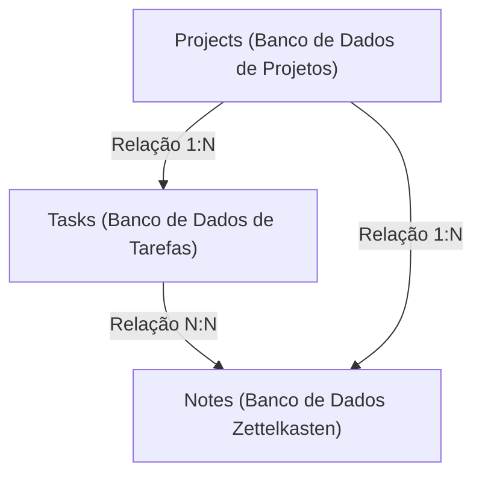
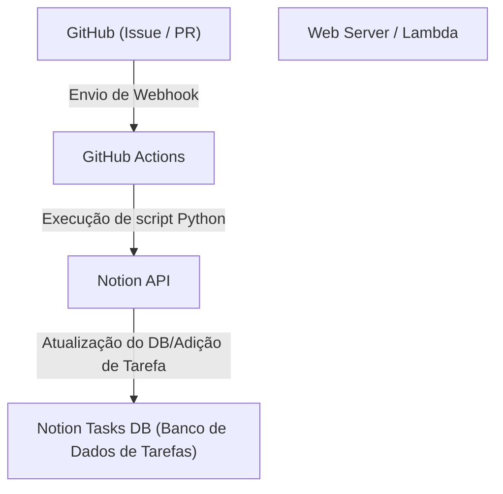

# Gestão de Tarefas para Desenvolvimento Pessoal e Escrita de Blog usando o Notion

Ao continuar com o desenvolvimento pessoal e a escrita de blogs, a gestão de tarefas, a manutenção da motivação e a forma de armazenar e utilizar as ideias do dia a dia são temas extremamente importantes. À medida que um projeto cresce, o número de tarefas a realizar aumenta e muitas vezes hesitamos sobre por onde começar. Além disso, onde e como guardar as informações geradas diariamente, como tópicos para o blog ou notas técnicas, também se torna um desafio.

Como uma ferramenta capaz de resolver essas diversas necessidades em uma única plataforma, a mais poderosa atualmente é o **Notion**. Neste artigo, explicaremos de uma perspectiva técnica e muito detalhada a "técnica definitiva de gestão de tarefas" que vai além do uso do Notion como um simples bloco de notas ou ferramenta de tarefas, integrando perfeitamente o desenvolvimento pessoal e a escrita de blogs, e incorporando automação e gestão avançada de progresso.

---

## 1. A afinidade entre o método PARA e o Notion

Primeiro, falaremos sobre a base de como organizar as informações. Em uma ferramenta altamente flexível como o Notion, as páginas e os bancos de dados tendem a se multiplicar de forma caótica, caindo facilmente em um estado de "não saber onde as coisas estão". Para evitar isso, introduzimos o **método PARA**, proposto por Tiago Forte.

O método PARA é uma abordagem que classifica as informações nas 4 categorias a seguir:

1. **Projects (Projetos)**: Um conjunto de tarefas com objetivos claros e prazos (ex: "Lançamento de um novo aplicativo web", "Renovação do design do blog").
2. **Areas (Áreas)**: Áreas de responsabilidade que precisam ser mantidas e gerenciadas a longo prazo (ex: "Saúde", "Gestão do blog (contínuo)", "Finanças").
3. **Resources (Recursos)**: Tópicos de interesse ou informações que podem ser úteis no futuro (ex: "Snippets de código Python", "Materiais de referência de design de interface de usuário").
4. **Archives (Arquivos)**: Projetos concluídos ou informações que não estão ativas no momento, mas que você deseja guardar.

Para implementar isso no Notion, comece separando rigorosamente a hierarquia da barra lateral esquerda nessas 4 categorias. Especialmente separando "Projects" de "Areas/Resources", você pode manter o pensamento claro sem misturar as tarefas nas quais deve se concentrar agora (Projects) com as entradas necessárias para elas (Resources).

---

## 2. Design do Banco de Dados: Estrutura Relacional de Projects e Tasks

O verdadeiro poder do Notion reside nos seus bancos de dados relacionais. O que mais se deve evitar na gestão de tarefas é gerenciar todas as tarefas em uma única lista plana. Ao dividir as tarefas por projeto e vinculá-las, você pode compreender a visão geral e os detalhes simultaneamente.

Aqui, criaremos o banco de dados "Projects (Projetos)" e o banco de dados "Tasks (Tarefas)", interligando-os com uma propriedade de Relation (relação).

### Diagrama de correlação do banco de dados

O diagrama Mermaid a seguir mostra a relação entre os bancos de dados Projects, Tasks e Notes (Zettelkasten), que será discutido posteriormente.



### Propriedades do banco de dados Projects
- `Project Name` (Title)
- `Status` (Select: "Not Started", "In Progress", "Completed")
- `Deadline` (Date)
- `Tasks` (Relation: Vinculado ao banco de dados Tasks)
- `Progress` (Rollup & Formula: Descrito posteriormente)

### Propriedades do banco de dados Tasks
- `Task Name` (Title)
- `Status` (Status: "To Do", "In Progress", "Done")
- `Priority` (Select: "High", "Medium", "Low")
- `Project` (Relation: Vinculado ao banco de dados Projects)
- `Due Date` (Date)
- `Story Points` (Number: Para estimar o tamanho da tarefa)

Ao dividir o banco de dados desta forma, torna-se possível criar visualizações (views) avançadas, como filtrar e exibir apenas as tarefas que pertencem a esse projeto quando a página do projeto é aberta (usando Linked Databases).

---

## 3. Visualização do Progresso usando Rollup e Formula

Para compreender intuitivamente o progresso de um projeto, criaremos uma barra de progresso usando a funcionalidade Formula (fórmula) do Notion. Isso permite ver de relance "o quanto este projeto avançou agora".

### Agregação de dados com Rollup
Primeiro, no banco de dados Projects, crie as duas seguintes propriedades de Rollup a partir do banco de dados Tasks:
1. `Total Tasks` (Rollup): Obtém o "número (Count all)" de tarefas a partir da relação Tasks.
2. `Completed Tasks` (Rollup): Obtém o número de tarefas cujo status é "Done" a partir da relação Tasks (ou use uma fórmula para contar as tarefas concluídas).

### Cálculo da barra de progresso com Formula
Em seguida, crie uma propriedade Formula e insira a seguinte fórmula de cálculo.

```javascript
// Fórmula de cálculo da barra de progresso
round(prop("Completed Tasks") / prop("Total Tasks") * 100)
```
No mais recente Formula 2.0 do Notion, com base nisso, agora é possível definir diretamente uma barra de progresso visual (em forma de anel ou barra) na própria interface do usuário. Se você for detalhista sobre métodos de escrita mais antigos ou a exibição de barras de progresso em texto, você também pode usar a ramificação condicional a seguir.

```javascript
// Barra de progresso baseada em texto (exemplo)
let(
    percent, round(prop("Completed Tasks") / prop("Total Tasks") * 100),
    style(percent + "% ", "b") + 
    slice("▓▓▓▓▓▓▓▓▓▓", 0, floor(percent / 10)) + 
    slice("░░░░░░░░░░", 0, 10 - floor(percent / 10))
)
```

### Abordagem Matemática para Velocity (Velocidade de Desenvolvimento) e Previsão de Conclusão

No desenvolvimento pessoal, saber em que ritmo você consegue realizar as tarefas (Velocity) está diretamente ligado a um gerenciamento de cronograma de alta precisão.
Se o total de Story Points que podem ser concluídos em uma semana for a velocidade $V$, ela é representada pela seguinte fórmula.

$$ V = \frac{\sum_{i=1}^{n} SP_i}{T} $$

Aqui, $SP_i$ são os pontos de história da tarefa concluída $i$, e $T$ é o período de medição (por exemplo, o número de semanas no sprint).

Se o total de pontos de história restantes do projeto atual for $W$, então o tempo estimado $E$ até a conclusão do projeto pode ser calculado da seguinte forma.

$$ E = \frac{W}{V} $$

Fazer esse cálculo inteiramente dentro do Notion é um pouco complicado, mas é muito eficaz colocar um bloco de matemática (Math block) nas tarefas da revisão semanal (Weekly Review) para registrá-lo como um indicador de autoavaliação.

---

## 4. Prática de Quadro Kanban e Visualização de Timeline

As "visualizações (views)" para o gerenciamento de tarefas também são importantes. No Notion, o mesmo banco de dados pode ser exibido em formatos diferentes (views).

### Quadro Kanban (Board View)
A visualização padrão para o banco de dados "Tasks" será um quadro Kanban agrupado por Status (To Do / In Progress / Done). Isso permite mover tarefas intuitivamente arrastando e soltando, e verificar visualmente se os gargalos atuais não estão se acumulando na coluna "In Progress".

### Linha do Tempo (Timeline View)
Para "Projects" ou "Tasks" de maior escala, a visualização Timeline é eficaz. Isso visualiza o que será feito e de quando a quando, como um gráfico de Gantt, facilitando a compreensão de tarefas forçadas em paralelo (tarefas simultâneas) e dependências (a próxima etapa não pode prosseguir a menos que uma determinada tarefa seja concluída).

---

## 5. Criação de Redes de Conhecimento com Zettelkasten e Banco de Dados Notes

Na escrita de blogs, "começar a escrever um artigo a partir de uma página em branco" é a parte mais dolorosa e a causa do bloqueio de escrita. Portanto, incorporamos ao Notion o conceito de "**Zettelkasten (método da caixa de notas)**", criado pelo sociólogo alemão Niklas Luhmann.

A regra básica do Zettelkasten é "escrever apenas uma ideia em uma nota (natureza Atômica)" e "criar uma rede vinculando as notas umas às outras".

### Design do banco de dados Notes
- `Note Title` (Title)
- `Tags` (Multi-select)
- `Related Notes` (Relation: Vinculado ao próprio banco de dados Notes)
- `Tasks` (Relation: Vinculado a tarefas de escrita de blog)

### Fluxo de trabalho de escrita do blog
1. Acumule rapidamente os conhecimentos adquiridos no desenvolvimento diário e as ideias que surgem como "Notes" fragmentadas.
2. Se houver um tema comum entre essas notas, vincule-as (links bidirecionais) usando a propriedade `Related Notes`.
3. Ao começar a trabalhar na tarefa de escrever o blog (Tasks), chame o banco de dados vinculado dentro da página da tarefa e organize as notas (Notes) relacionadas.
4. Apenas conectando os fragmentos de notas, a estrutura (esboço) do blog é concluída.

Com isso, a escrita do blog deixa de ser uma "criação a partir do zero" e passa a ser um "trabalho de edição de conhecimento armazenado", aumentando drasticamente a velocidade da escrita.

---

## 6. Automação Suprema usando Notion API e Python

A partir daqui, é a seção de automação técnica, que é o maior destaque deste artigo. A entrada manual de tarefas e alterações de status são um desperdício de tempo no desenvolvimento pessoal. Usando a Notion API, construiremos um sistema que sincroniza as Issues do GitHub com as tarefas do Notion e reflete o status de implantação do blog no Notion.

### Visão Geral da Arquitetura



### Criando automaticamente tarefas no Notion a partir das Issues do GitHub

Aqui está um exemplo de implementação de um script Python que adiciona automaticamente um item ao banco de dados Tasks do Notion quando uma Issue é criada no GitHub.

É necessário criar uma integração no Notion com antecedência e obter a `NOTION_API_KEY` e o `DATABASE_ID`.

```python
import os
import requests
import json

# Obter token e ID do banco de dados a partir das variáveis de ambiente
NOTION_API_KEY = os.environ.get("NOTION_API_KEY")
DATABASE_ID = os.environ.get("DATABASE_ID")

def create_notion_task(issue_title, issue_url):
    url = "https://api.notion.com/v1/pages"
    
    headers = {
        "Authorization": f"Bearer {NOTION_API_KEY}",
        "Content-Type": "application/json",
        "Notion-Version": "2022-06-28"
    }
    
    data = {
        "parent": { "database_id": DATABASE_ID },
        "properties": {
            "Task Name": {
                "title": [
                    {
                        "text": {
                            "content": issue_title
                        }
                    }
                ]
            },
            "Status": {
                "status": {
                    "name": "To Do"
                }
            },
            "URL": {
                "url": issue_url
            }
        }
    }
    
    response = requests.post(url, headers=headers, data=json.dumps(data))
    
    if response.status_code == 200:
        print("Task created successfully in Notion!")
    else:
        print(f"Failed to create task: {response.text}")

# Assume-se que será recebido como argumento do GitHub Actions, etc.
if __name__ == "__main__":
    # Exemplo: python sync.py "Correção de bug: Tela de login quebrando" "https://github.com/user/repo/issues/1"
    import sys
    if len(sys.argv) >= 3:
        create_notion_task(sys.argv[1], sys.argv[2])
```

Ao incorporar este script ao fluxo de trabalho do GitHub Actions (`.github/workflows/issue_to_notion.yml`), uma tarefa será gerada automaticamente no Notion toda vez que uma Issue for criada no repositório. O desenvolvedor fica livre do incômodo de ir e voltar entre o GitHub e o Notion.

### Atualização automática do status de publicação do blog usando cURL

Se você está implantando seu blog em um serviço de hospedagem como Vercel ou Netlify, pode receber um Webhook de conclusão de implantação e alterar automaticamente o status da tarefa no Notion (ex: "Escrever e publicar o Artigo A") para "Done".

Aqui está um exemplo de comando cURL para atualizar as propriedades de uma página (tarefa) específica.

```bash
curl -X PATCH 'https://api.notion.com/v1/pages/PAGE_ID' \
  -H 'Authorization: Bearer '"$NOTION_API_KEY"'' \
  -H "Content-Type: application/json" \
  -H "Notion-Version: 2022-06-28" \
  --data '{
    "properties": {
      "Status": {
        "status": {
          "name": "Done"
        }
      }
    }
  }'
```

Ao integrar esta chamada de API à etapa final do pipeline de CI/CD, a automação completa de "enviar código → implantar automaticamente → a tarefa do Notion é concluída automaticamente" será alcançada.

---

## 7. Melhores Práticas de Operação e Dicas de Continuidade

Não importa quão avançado seja o sistema ou a ferramenta que você crie, seria colocar a carroça na frente dos bois se a pessoa que os opera ficar exausta. Por fim, aqui estão algumas dicas para manter este sistema do Notion funcionando sem falhas.

1. **Mantenha-o simples**: Não crie propriedades perfeitas ou relações complexas desde o início. Mantenha em mente uma "construção ágil do Notion", adicionando propriedades quando necessário.
2. **Implementação rigorosa da Revisão Semanal (Weekly Review)**: Defina um horário, como nas noites de domingo, para revisar todo o Notion. Mantenha o sistema limpo organizando as tarefas concluídas, reprogramando as tarefas atrasadas e marcando as Notas (Notes) não classificadas.
3. **Utilização da Caixa de Entrada (Inbox)**: É um aborrecimento classificar todas as ideias e tarefas em bancos de dados apropriados o tempo todo. Primeiro, crie um banco de dados "Inbox" para jogar tudo lá dentro, e classificá-lo posteriormente (como durante a revisão semanal) em Projects ou Notes, o que proporciona uma operação livre de estresse.

## 8. Conclusão

O gerenciamento de tarefas com o Notion vai muito além de uma simples lista de afazeres. Ao combinar a organização de informações através do método PARA, a criação de redes de conhecimento com o Zettelkasten e a engenharia com a Notion API, você pode construir um "Segundo Cérebro (Second Brain)" que impulsionará fortemente o seu desenvolvimento pessoal e a escrita de blogs.

Embora a configuração inicial leve algum tempo, uma vez que o sistema começa a funcionar, a carga cognitiva envolvida no gerenciamento de tarefas cai drasticamente, permitindo que você concentre toda a sua atenção no que realmente importa: "escrever código" e "escrever textos". Não deixe de usar este artigo como referência para construir o seu próprio e definitivo espaço de trabalho no Notion.
