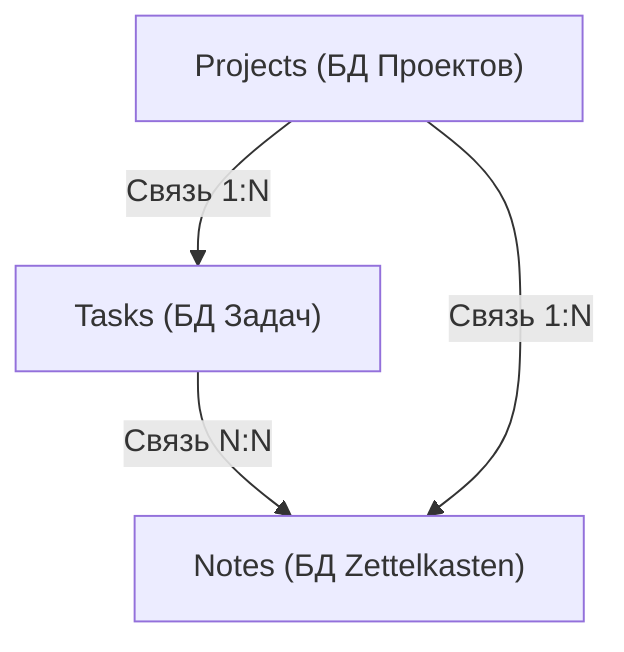
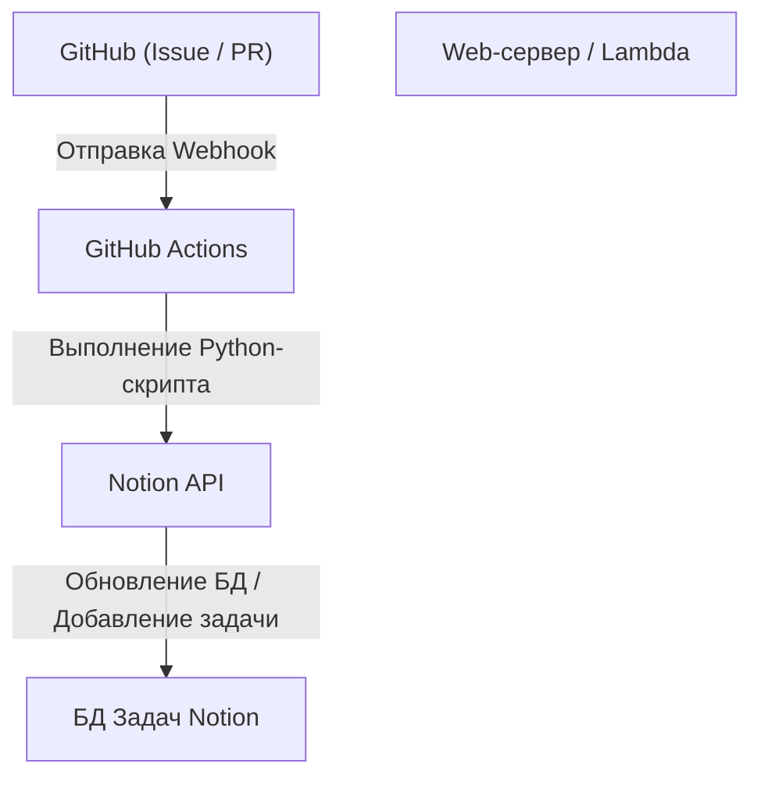

# Управление задачами в Notion для индивидуальной разработки и ведения блога

Для продолжения индивидуальной разработки и ведения блога управление задачами, поддержание мотивации и способы накопления и использования повседневных идей являются очень важными темами. Чем крупнее становится проект, тем больше задач нужно выполнить, и часто бывает трудно решить, с чего начать. Кроме того, возникает проблема, где и как сохранять повседневно возникающую информацию, такую как идеи для блога и технические заметки.

В настоящее время **Notion** является самым мощным инструментом, способным удовлетворить такие разнообразные потребности на одной платформе. В этой статье мы не будем рассматривать Notion просто как блокнот или инструмент для управления задачами. Мы рассмотрим «идеальный метод управления задачами», который бесшовно интегрирует индивидуальную разработку и ведение блога, а также включает в себя автоматизацию и продвинутое управление прогрессом, с очень подробной и технической точки зрения.

---

## 1. Совместимость метода PARA и Notion

Сначала поговорим об основах — как организовать информацию. В инструментах с высокой степенью свободы, таких как Notion, страницы и базы данных часто разрастаются беспорядочно, что приводит к состоянию «непонятно, где что находится». Чтобы предотвратить это, мы внедрим **метод PARA**, предложенный Тьяго Форте.

Метод PARA — это подход, при котором информация классифицируется на следующие 4 категории:

1. **Projects (Проекты)**: Набор задач с четкой целью и сроком (например: «релиз нового веб-приложения», «обновление дизайна блога»).
2. **Areas (Области)**: Сферы ответственности, которые необходимо поддерживать и управлять ими в долгосрочной перспективе (например: «здоровье», «ведение блога (постоянное)», «финансы»).
3. **Resources (Ресурсы)**: Интересующие темы и информация, которая может быть полезна в будущем (например: «сниппеты кода Python», «справочные материалы по UI дизайну»).
4. **Archives (Архивы)**: Завершенные проекты и информация, которая в данный момент неактивна, но которую вы хотите сохранить.

Чтобы реализовать это в Notion, мы начнем со строгого разделения иерархии левой боковой панели на эти 4 раздела. В частности, отделение "Projects" от "Areas/Resources" позволяет не смешивать задачи, на которых нужно сосредоточиться сейчас (Projects), и входящую информацию для них (Resources), что помогает сохранить ясность мышления.

---

## 2. Проектирование баз данных: реляционная структура Projects и Tasks

Истинная сила Notion кроется в реляционных базах данных. То, чего следует больше всего избегать при управлении задачами — это управление всеми задачами в одном плоском списке. Разделяя задачи по проектам и связывая их, вы сможете одновременно видеть общую картину и детали.

Здесь мы создадим базу данных «Projects (Проекты)» и базу данных «Tasks (Задачи)» и свяжем их с помощью свойства Relation (связь).

### Схема связей баз данных

Следующая диаграмма Mermaid показывает связи между базами данных Projects, Tasks и Notes (Zettelkasten), о которой будет рассказано позже.



### Свойства базы данных Projects
- `Project Name` (Title)
- `Status` (Select: "Not Started", "In Progress", "Completed")
- `Deadline` (Date)
- `Tasks` (Relation: Связь с базой данных Tasks)
- `Progress` (Rollup & Formula: описано ниже)

### Свойства базы данных Tasks
- `Task Name` (Title)
- `Status` (Status: "To Do", "In Progress", "Done")
- `Priority` (Select: "High", "Medium", "Low")
- `Project` (Relation: Связь с базой данных Projects)
- `Due Date` (Date)
- `Story Points` (Number: Оценка масштаба задачи)

Разделив базы данных таким образом, можно создавать продвинутые представления, такие как фильтрация и отображение только тех задач, которые относятся к проекту, при открытии страницы проекта (использование связанных баз данных).

---

## 3. Визуализация прогресса с помощью Rollup и Formula

Чтобы интуитивно понимать прогресс проекта, мы создадим индикатор выполнения (progress bar) с помощью функции Formula в Notion. Это позволит с первого взгляда понять: «Насколько продвинулся этот проект сейчас?».

### Агрегация данных с помощью Rollup
Во-первых, в базе данных Projects создайте следующие 2 свойства Rollup из базы данных Tasks:
1. `Total Tasks` (Rollup): Получение «Количества (Count all)» задач из связи Tasks.
2. `Completed Tasks` (Rollup): Получение количества задач со статусом "Done" из связи Tasks (или подсчет завершенных задач с помощью функции).

### Расчет индикатора выполнения с помощью Formula
Затем создайте свойство Formula и введите следующую формулу:

```javascript
// Формула для индикатора выполнения
round(prop("Completed Tasks") / prop("Total Tasks") * 100)
```
В новейшей версии Formula 2.0 в Notion появилась возможность настраивать визуальный индикатор выполнения (в виде кольца или полосы) непосредственно в пользовательском интерфейсе на основе этого значения. Если вы предпочитаете старый метод записи или отображение индикатора выполнения в виде текста, также можно использовать условные ветвления, подобные следующему:

```javascript
// Текстовый индикатор выполнения (пример)
let(
    percent, round(prop("Completed Tasks") / prop("Total Tasks") * 100),
    style(percent + "% ", "b") + 
    slice("▓▓▓▓▓▓▓▓▓▓", 0, floor(percent / 10)) + 
    slice("░░░░░░░░░░", 0, 10 - floor(percent / 10))
)
```

### Математический подход к скорости разработки (Velocity) и прогнозированию завершения

В индивидуальной разработке знание того, в каком темпе вы можете выполнять задачи (скорость, или velocity), напрямую связано с высокоточным управлением расписанием.
Если предположить, что общая сумма Story Points, которую вы можете выполнить за одну неделю, является вашей скоростью $V$, это выражается следующей формулой:

$$ V = \frac{\sum_{i=1}^{n} SP_i}{T} $$

Где $SP_i$ — это Story Points завершенной задачи $i$, а $T$ — период измерения (например, количество недель в спринте).

Если общая сумма оставшихся Story Points текущего проекта равна $W$, то прогнозируемое время $E$ до завершения проекта можно рассчитать следующим образом:

$$ E = \frac{W}{V} $$

Полностью выполнить этот расчет внутри Notion немного сложно, но очень эффективно разместить блок для вычислений (Math block) в задаче еженедельного обзора (Weekly Review) и фиксировать это как показатель для самооценки.

---

## 4. Практика применения Канбан-доски и представления Timeline

«Представления (Views)» для управления задачами также важны. В Notion вы можете отображать одну и ту же базу данных в разных форматах.

### Канбан-доска (Board View)
В качестве представления по умолчанию для базы данных "Tasks" установите Канбан-доску, сгруппированную по статусам (To Do / In Progress / Done). Это позволяет интуитивно перемещать задачи с помощью перетаскивания (drag-and-drop) и визуально проверять, не скопились ли текущие узкие места в столбце «В процессе (In Progress)».

### Таймлайн (Timeline View)
Для «Projects» или крупномасштабных «Tasks» эффективно представление Timeline. Оно визуализирует, какая работа и в какие сроки будет выполняться, подобно диаграмме Ганта, что облегчает понимание того, не перегружены ли вы параллельными задачами, и отслеживание зависимостей (когда следующую задачу нельзя начать, пока не будет завершена предыдущая).

---

## 5. Zettelkasten и сетевая организация знаний с помощью базы данных Notes

При написании блога «начинать писать статью с чистого листа» — это самое мучительное занятие и причина творческого ступора. Поэтому мы внедрим в Notion концепцию **Zettelkasten** (метод ящика с карточками), разработанную немецким социологом Никласом Луманом.

Основные правила Zettelkasten: «В одной заметке записывается только одна идея (атомарное свойство)» и «Создание сети путем связывания заметок между собой».

### Проектирование базы данных Notes
- `Note Title` (Title)
- `Tags` (Multi-select)
- `Related Notes` (Relation: Связь с самой базой данных Notes)
- `Tasks` (Relation: Связь с задачей написания блога)

### Рабочий процесс написания блога
1. Постоянно накапливайте знания, полученные в ходе ежедневной разработки, и приходящие в голову идеи в виде фрагментарных «Notes».
2. Если между этими заметками есть общая тема, свяжите их (двунаправленная связь) с помощью свойства `Related Notes`.
3. Приступая к задаче (Tasks) по написанию блога, вызовите связанную базу данных на странице этой задачи и расположите в ней связанные Notes (заметки).
4. Просто соединив фрагменты заметок, вы получите готовый каркас (структуру) блога.

В результате написание блога превращается из «созидания с нуля» в «редактирование накопленных знаний», что кардинально повышает скорость письма.

---

## 6. Идеальная автоматизация с использованием Notion API и Python

Начинается самый главный момент этой статьи — раздел технической автоматизации. Ручной ввод задач и изменение статуса в индивидуальной разработке — пустая трата времени. Используя Notion API, мы создадим систему, которая синхронизирует Issues на GitHub с задачами в Notion и отражает статус деплоя блога в Notion.

### Обзор архитектуры



### Автоматическое создание задач в Notion из GitHub Issues

Вот пример реализации Python-скрипта, который автоматически добавляет элемент в базу данных Tasks в Notion при создании Issue на GitHub.

Предварительно необходимо создать интеграцию в Notion и получить `NOTION_API_KEY` и `DATABASE_ID`.

```python
import os
import requests
import json

# Получение токена и ID базы данных из переменных окружения
NOTION_API_KEY = os.environ.get("NOTION_API_KEY")
DATABASE_ID = os.environ.get("DATABASE_ID")

def create_notion_task(issue_title, issue_url):
    url = "https://api.notion.com/v1/pages"
    
    headers = {
        "Authorization": f"Bearer {NOTION_API_KEY}",
        "Content-Type": "application/json",
        "Notion-Version": "2022-06-28"
    }
    
    data = {
        "parent": { "database_id": DATABASE_ID },
        "properties": {
            "Task Name": {
                "title": [
                    {
                        "text": {
                            "content": issue_title
                        }
                    }
                ]
            },
            "Status": {
                "status": {
                    "name": "To Do"
                }
            },
            "URL": {
                "url": issue_url
            }
        }
    }
    
    response = requests.post(url, headers=headers, data=json.dumps(data))
    
    if response.status_code == 200:
        print("Task created successfully in Notion!")
    else:
        print(f"Failed to create task: {response.text}")

# Предполагается получение в качестве аргументов из GitHub Actions и т.д.
if __name__ == "__main__":
    # Пример: python sync.py "Исправление ошибки: неверное отображение экрана входа" "https://github.com/user/repo/issues/1"
    import sys
    if len(sys.argv) >= 3:
        create_notion_task(sys.argv[1], sys.argv[2])
```

Встроив этот скрипт в рабочий процесс (workflow) GitHub Actions (`.github/workflows/issue_to_notion.yml`), каждый раз, когда в репозитории создается Issue, задача будет автоматически генерироваться в Notion. Разработчик освобождается от необходимости переключаться между GitHub и Notion.

### Автоматическое обновление статуса публикации блога с помощью cURL

Если вы деплоите свой блог на хостинговом сервисе, таком как Vercel или Netlify, можно получать Webhook о завершении деплоя и автоматически менять статус задачи в Notion (например: «Написание и публикация статьи А») на "Done".

Ниже приведен пример команды cURL для обновления свойств конкретной страницы (задачи).

```bash
curl -X PATCH 'https://api.notion.com/v1/pages/PAGE_ID' \
  -H 'Authorization: Bearer '"$NOTION_API_KEY"'' \
  -H "Content-Type: application/json" \
  -H "Notion-Version: 2022-06-28" \
  --data '{
    "properties": {
      "Status": {
        "status": {
          "name": "Done"
        }
      }
    }
  }'
```

Встроив этот вызов API в качестве последнего шага конвейера CI/CD, вы завершаете полную автоматизацию: «пуш кода → автоматический деплой → автоматическое завершение задачи в Notion».

---

## 7. Лучшие практики эксплуатации и советы по поддержанию процесса

Независимо от того, насколько сложной вы делаете систему или инструмент, если человек, управляющий ими, выгорает — все это теряет смысл. Наконец, мы представим несколько советов, как поддерживать эту систему Notion и не дать ей разрушиться.

1. **Сохраняйте простоту**: Не создавайте с самого начала идеальные свойства и слишком сложные связи. Старайтесь использовать подход «гибкой (agile) настройки Notion», добавляя свойства по мере их необходимости.
2. **Тщательное проведение еженедельных обзоров (Weekly Review)**: Выделите время, например, вечер каждого воскресенья, для пересмотра всего Notion. Организуйте завершенные задачи, перепланируйте просроченные задачи, добавьте теги к неклассифицированным Notes и т.д., чтобы поддерживать систему в чистоте.
3. **Использование Inbox (Входящие)**: Раскладывать каждую пришедшую в голову идею или задачу по соответствующим базам данных утомительно. Сначала создайте базу данных «Inbox», куда будете сбрасывать всё подряд, а позже (во время еженедельного обзора) распределяйте их по Projects или Notes — такой подход не вызывает стресса.

## 8. Заключение

Управление задачами с помощью Notion выходит далеко за рамки простых списков To-Do. Комбинируя организацию информации с помощью метода PARA, сетевую организацию знаний с помощью Zettelkasten и инженерию с использованием Notion API, вы можете создать «Второй мозг (Second Brain)», который мощно ускорит вашу индивидуальную разработку и написание блога.

Первоначальная настройка занимает некоторое время, но как только система заработает, когнитивная нагрузка на управление задачами резко снизится, и вы сможете полностью сосредоточиться на действительно важных вещах: «написании кода» и «написании текстов». Обязательно используйте эту статью в качестве справочника и попробуйте создать свое собственное, самое мощное рабочее пространство в Notion.
