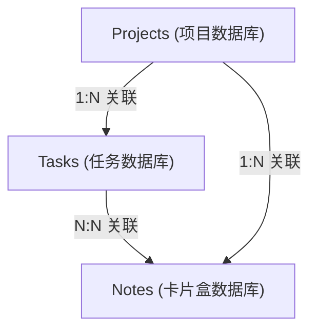
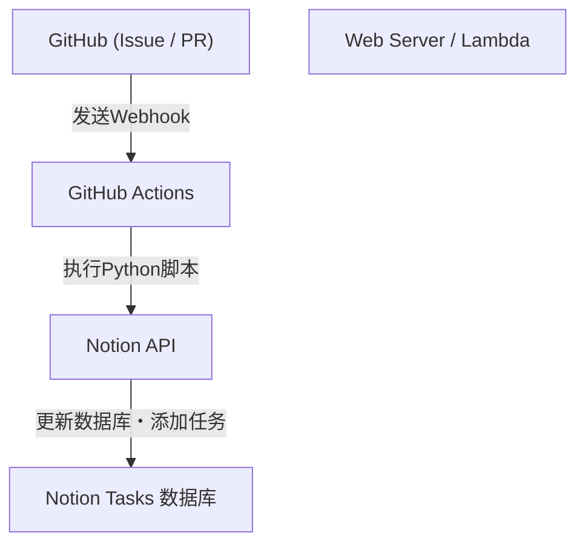

# 使用Notion进行个人开发与博客写作的任务管理技巧

在持续进行个人开发和博客写作的过程中，任务管理、保持动力以及如何存储和利用日常灵感是非常重要的主题。随着项目变得越来越大，需要完成的任务也会增多，人们往往会为了“该从哪项工作开始着手”而感到迷茫。此外，博客的素材和技术笔记等日常产生的信息，应该存放在哪里以及如何保存也是一个课题。

作为能够在一个平台解决这些多样化需求的工具，目前最强大的是**Notion**。本文将不再仅仅把Notion作为一个记事本或任务管理工具，而是从非常详细且技术性的视角，讲解如何将个人开发和博客写作无缝整合，并引入自动化和高级进度管理，打造“终极任务管理技巧”。

---

## 1. PARA方法与Notion的契合度

首先从如何整理信息这一基础部分开始讲起。在像Notion这样自由度很高的工具中，页面和数据库很容易无序地增殖，从而陷入“不知道哪里有什么”的状态。为了防止这种情况，我们引入由Tiago Forte提出的**PARA方法**。

PARA方法是一种将信息分为以下4个类别的方法。

1. **Projects（项目）**: 具有明确目标和期限的任务集合（例：“发布新的Web应用”、“博客设计改版”）。
2. **Areas（领域）**: 需要长期维持和管理的责任领域（例：“健康”、“博客运营（持续性）”、“财务”）。
3. **Resources（资源）**: 感兴趣的话题或将来可能派上用场的信息（例：“Python代码片段”、“UI设计参考资料”）。
4. **Archives（归档）**: 已完成的项目，或当前不活跃但想要保存的信息。

为了在Notion上实现这一点，首先要将左侧侧边栏的层级严格划分为这4个部分。特别是将“Projects”与“Areas/Resources”分离开来，可以让当前需要集中精力的任务（Projects）与为此所需的输入（Resources）互不干扰，保持清晰的思路。

---

## 2. 数据库设计：Projects与Tasks的关系结构

Notion真正的威力在于关系型数据库。在任务管理中最应该避免的是将所有任务都在一个扁平的列表中进行管理。通过按项目拆分任务并将其关联起来，就可以同时把握整体概貌与细节。

这里，我们将创建“Projects（项目）”数据库和“Tasks（任务）”数据库，并通过Relation（关联）属性将它们连接起来。

### 数据库关系图

以下Mermaid图展示了Projects、Tasks以及后文将提到的Notes（卡片盒/Zettelkasten）数据库之间的关联关系。



### Projects数据库的属性
- `Project Name` (Title)
- `Status` (Select: "Not Started", "In Progress", "Completed")
- `Deadline` (Date)
- `Tasks` (Relation: 与Tasks数据库关联)
- `Progress` (Rollup & Formula: 后述)

### Tasks数据库的属性
- `Task Name` (Title)
- `Status` (Status: "To Do", "In Progress", "Done")
- `Priority` (Select: "High", "Medium", "Low")
- `Project` (Relation: 与Projects数据库关联)
- `Due Date` (Date)
- `Story Points` (Number: 预估任务规模)

通过像这样分离数据库，当打开项目页面时，就可以只过滤显示属于该项目的任务（利用Linked Database），从而创建出高级的视图。

---

## 3. 利用Rollup和Formula实现进度可视化

为了直观地掌握项目进度，我们将使用Notion的Formula（函数）功能来创建进度条。这样一来，“现在这个项目进展了多少”就能一目了然了。

### 通过Rollup汇总数据
首先，在Projects数据库中，从Tasks数据库创建以下2个Rollup属性。
1. `Total Tasks` (Rollup): 从Tasks关联中，获取任务的“数量（Count all）”。
2. `Completed Tasks` (Rollup): 从Tasks关联中，获取状态为"Done"的任务数量（※或者使用函数来统计已完成任务）。

### 通过Formula计算进度条
接着，创建Formula属性，并输入以下计算公式。

```javascript
// 进度条的计算公式
round(prop("Completed Tasks") / prop("Total Tasks") * 100)
```
在Notion最新的Formula 2.0中，已经可以直接基于此在UI上设置视觉化的进度条（环状或条状）。如果仍然执着于旧的编写方式或文本形式的进度条显示，也可以使用如下的条件分支。

```javascript
// 基于文本的进度条（示例）
let(
    percent, round(prop("Completed Tasks") / prop("Total Tasks") * 100),
    style(percent + "% ", "b") + 
    slice("▓▓▓▓▓▓▓▓▓▓", 0, floor(percent / 10)) + 
    slice("░░░░░░░░░░", 0, 10 - floor(percent / 10))
)
```

### 速度（开发速度）与完成预测的数学方法

在个人开发中，了解自己能以多快的节奏消化任务（速度），直接关系到高精度的日程管理。
假设1周内能消化的故事点（Story Points）总和为速度 $V$，则可以用以下公式表示。

$$ V = \frac{\sum_{i=1}^{n} SP_i}{T} $$

其中，$SP_i$ 是已完成的任务 $i$ 的故事点，$T$ 是测量周期（例如冲刺的周数）。

如果当前项目的剩余总故事点为 $W$，那么项目完成的预测时间 $E$ 可以如下计算。

$$ E = \frac{W}{V} $$

在Notion内部完全进行这个计算稍微有些复杂，但在每周回顾等地方放置计算用的区块（Math block），并将其作为自我评估的指标记录下来，是非常有效的。

---

## 4. Kanban看板与时间线视图的实践

管理任务的“视图（View）”也很重要。在Notion中，同一个数据库可以用不同的形式显示（视图）。

### Kanban看板（Board View）
将“Tasks”数据库的默认视图设置为按Status（To Do / In Progress / Done）分组的看板（Kanban）。这样一来，就能通过拖拽直观地移动任务，也可以视觉化地检查当前的瓶颈是否堆积在“进行中（In Progress）”这一列。

### 时间线（Timeline View）
对于“Projects”或规模较大的“Tasks”，Timeline视图很有效。它可以像甘特图一样，将何时到何时进行哪项工作可视化，让人更容易把握任务并行（并发任务）的压力，以及依赖关系（某项任务不结束下一项就无法推进）。

---

## 5. 通过Zettelkasten和Notes数据库实现知识网络化

在撰写博客时，“从白纸状态开始写文章”是最痛苦的，这也是导致停笔的原因。因此，我们将德国社会学家尼克拉斯·卢曼（Niklas Luhmann）创立的“**Zettelkasten（卡片盒笔记法）**”概念引入Notion。

Zettelkasten的基本规则是：“1个笔记里只写1个想法（原子化特性）”以及“将笔记相互链接，形成网络”。

### Notes数据库的设计
- `Note Title` (Title)
- `Tags` (Multi-select)
- `Related Notes` (Relation: 与Notes数据库自身关联)
- `Tasks` (Relation: 与博客写作的任务关联)

### 博客写作的工作流
1. 将在日常开发中获得的见解或想到的点子，作为片段化的“Notes”不断积累起来。
2. 如果这些笔记之间有共同的主题，就使用`Related Notes`属性将它们链接起来（双向链接）。
3. 当真正着手撰写博客的任务（Tasks）时，在该任务页面中调用关联的数据库，将相关的Notes排列出来。
4. 仅仅将笔记的片段拼接在一起，博客的骨架（大纲）就完成了。

这样一来，博客写作就从“从零开始的创造”变成了“已储存知识的编辑工作”，撰写速度将得到戏剧性的提升。

---

## 6. 使用Notion API和Python实现的终极自动化

接下来是本文最大亮点的技术自动化部分。在个人开发中，手动输入任务或修改状态是浪费时间的。我们将利用Notion API，构建一个将GitHub的Issue与Notion的任务同步、或将博客的部署状态反映到Notion中的系统。

### 架构概述



### 从GitHub Issues自动创建Notion任务

这是当在GitHub上创建Issue时，自动在Notion的Tasks数据库中添加条目的Python脚本实现示例。

需要事先创建Notion的集成（Integration），并获取`NOTION_API_KEY`和`DATABASE_ID`。

```python
import os
import requests
import json

# 从环境变量中获取令牌和数据库ID
NOTION_API_KEY = os.environ.get("NOTION_API_KEY")
DATABASE_ID = os.environ.get("DATABASE_ID")

def create_notion_task(issue_title, issue_url):
    url = "https://api.notion.com/v1/pages"
    
    headers = {
        "Authorization": f"Bearer {NOTION_API_KEY}",
        "Content-Type": "application/json",
        "Notion-Version": "2022-06-28"
    }
    
    data = {
        "parent": { "database_id": DATABASE_ID },
        "properties": {
            "Task Name": {
                "title": [
                    {
                        "text": {
                            "content": issue_title
                        }
                    }
                ]
            },
            "Status": {
                "status": {
                    "name": "To Do"
                }
            },
            "URL": {
                "url": issue_url
            }
        }
    }
    
    response = requests.post(url, headers=headers, data=json.dumps(data))
    
    if response.status_code == 200:
        print("Task created successfully in Notion!")
    else:
        print(f"Failed to create task: {response.text}")

# 假设从 GitHub Actions 等作为参数接收
if __name__ == "__main__":
    # 示例: python sync.py "Bug修复: 登录页面布局崩溃" "https://github.com/user/repo/issues/1"
    import sys
    if len(sys.argv) >= 3:
        create_notion_task(sys.argv[1], sys.argv[2])
```

通过将这个脚本整合到GitHub Actions的工作流（`.github/workflows/issue_to_notion.yml`）中，每次在代码库中创建Issue时，都会在Notion中自动生成任务。开发者将从在GitHub和Notion之间来回奔波的繁琐中解放出来。

### 使用cURL自动更新博客发布状态

如果将博客部署到Vercel或Netlify等托管服务，可以接收部署完成的Webhook，并自动将Notion中任务（例如：“撰写并发布文章A”）的状态修改为"Done"。

更新特定页面（任务）属性的cURL命令示例如下。

```bash
curl -X PATCH 'https://api.notion.com/v1/pages/PAGE_ID' \
  -H 'Authorization: Bearer '"$NOTION_API_KEY"'' \
  -H "Content-Type: application/json" \
  -H "Notion-Version: 2022-06-28" \
  --data '{
    "properties": {
      "Status": {
        "status": {
          "name": "Done"
        }
      }
    }
  }'
```

通过将此API调用集成到CI/CD流水线的最后一步，就完成了“推送代码 → 自动部署 → Notion任务自动标记为已完成”的全自动化流程。

---

## 7. 运营上的最佳实践与持续的诀窍

无论系统或工具构建得多么高级，如果负责运营的人因此而疲惫不堪，那就是本末倒置。最后，介绍几个维持这套Notion系统不崩溃并持续运行的诀窍。

1. **保持简单**: 一开始不要创建过于完美的属性或过于复杂的关系。要秉持在需要的时候才添加属性的“敏捷Notion构建”理念。
2. **彻底执行每周回顾（Weekly Review）**: 比如在每周日晚上等固定时间，重新审视整个Notion。整理已完成的任务、重新安排超期的任务、给未分类的Notes打标签等，保持系统的整洁。
3. **善用收件箱（Inbox）**: 将想到的点子或任务一一分类到合适的数据库中是很费事的。首先建立一个将所有东西都丢进去的“Inbox”数据库，然后再（在每周回顾等时候）将它们分配到Projects或Notes中，这样的操作是没有压力的。

## 8. 总结

使用Notion进行任务管理，已经远远超越了单纯的To-Do列表的范畴。通过将基于PARA方法的信息整理、基于Zettelkasten的知识网络化、以及基于Notion API的工程自动化结合起来，可以构建一个强力加速个人开发和博客写作的“第二大脑（Second Brain）”。

虽然初始设置需要花费一些时间，但系统一旦开始运转，任务管理的认知负荷就会大幅降低，从而让你能够将全部精力集中在真正重要的“写代码”和“写文章”上。请务必参考本文，打造出属于你自己的最强Notion工作空间。
