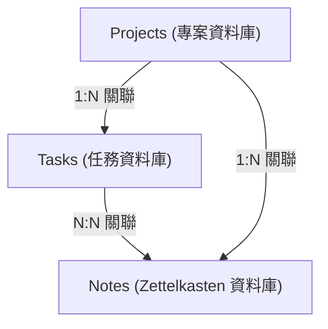
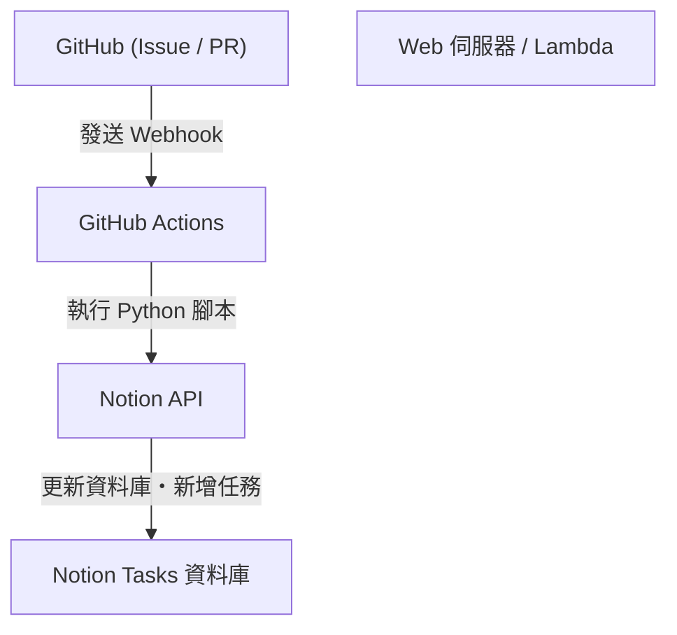

# 使用 Notion 進行個人開發與部落格寫作的任務管理術

在持續進行個人開發與撰寫部落格的過程中，任務管理、保持動力以及如何儲存與活用日常想法，是非常重要的課題。隨著專案規模擴大，必須處理的任務也會增加，我們經常會猶豫該從哪項工作著手。此外，部落格的靈感或技術筆記等日常產生的資訊該存放在哪裡、如何保存，也是一大挑戰。

能將這些多樣化需求在單一平台上解決的工具，目前最強大的莫過於 **Notion**。本文不會只將 Notion 視為單純的筆記本或任務管理工具，而是會從非常詳細且技術性的角度，解說如何將個人開發與部落格寫作無縫整合，並導入自動化與進階進度管理的「終極任務管理術」。

---

## 1. PARA 方法與 Notion 的契合度

首先，我們從如何整理資訊這個基礎部分開始談起。在 Notion 這種自由度極高的工具中，頁面與資料庫很容易無序地增生，陷入「不知道什麼東西在哪裡」的狀態。為了防止這種情況，我們將導入由 Tiago Forte 提出的 **PARA 方法**。

PARA 方法是將資訊分類為以下四個類別的手法：

1. **Projects（專案）**: 具有明確目標與期限的任務集合（例如：「發布新的 Web 應用程式」、「部落格設計翻新」）。
2. **Areas（領域）**: 需要長期維持與管理的責任領域（例如：「健康」、「部落格營運（持續性）」、「財務」）。
3. **Resources（資源）**: 感興趣的主題，或是未來可能有用的資訊（例如：「Python 程式碼片段」、「UI 設計參考資料」）。
4. **Archives（檔案庫）**: 已完成的專案，或是目前不活躍但希望能保存下來的資訊。

為了在 Notion 上實現這一點，首先要嚴格將左側側邊欄的階層劃分為這四個部分。特別是將「Projects」與「Areas/Resources」分開，可以讓現在應該專注的任務（Projects）與為此準備的輸入（Resources）不被混淆，保持清晰的思考。

---

## 2. 資料庫設計：Projects 與 Tasks 的關聯結構

Notion 真正的力量在於關聯式資料庫。在任務管理中，最該避免的就是將所有任務用單一的扁平列表來管理。將任務依專案進行分割，並將它們關聯起來，就能夠同時掌握全貌與細節。

在這裡，我們將建立「Projects（專案）」資料庫與「Tasks（任務）」資料庫，並使用關聯（Relation）屬性將它們連結起來。

### 資料庫關聯圖

以下 Mermaid 圖展示了 Projects、Tasks 以及後述的 Notes（Zettelkasten）資料庫之間的關聯。



### Projects 資料庫的屬性
- `Project Name` (Title)
- `Status` (Select: "Not Started", "In Progress", "Completed")
- `Deadline` (Date)
- `Tasks` (Relation: 與 Tasks 資料庫連結)
- `Progress` (Rollup & Formula: 後述)

### Tasks 資料庫的屬性
- `Task Name` (Title)
- `Status` (Status: "To Do", "In Progress", "Done")
- `Priority` (Select: "High", "Medium", "Low")
- `Project` (Relation: 與 Projects 資料庫連結)
- `Due Date` (Date)
- `Story Points` (Number: 估算任務規模)

透過像這樣區分資料庫，打開專案頁面時，就可以建立只過濾並顯示屬於該專案任務的進階視圖（利用連結的資料庫）。

---

## 3. 活用 Rollup 與 Formula 視覺化進度

為了直觀地掌握專案進度，我們將使用 Notion 的 Formula（公式）功能來建立進度條。這樣一來，就能對「目前這個專案進展到什麼程度」一目瞭然。

### 透過 Rollup 彙總資料
首先，在 Projects 資料庫中，從 Tasks 資料庫建立以下兩個 Rollup 屬性：
1. `Total Tasks` (Rollup): 從 Tasks 關聯中取得任務的「總數（Count all）」。
2. `Completed Tasks` (Rollup): 從 Tasks 關聯中取得狀態為 "Done" 的任務數量（※或者使用公式來計算已完成任務）。

### 透過 Formula 計算進度條
接著，建立 Formula 屬性，並輸入以下計算公式：

```javascript
// 進度條的計算公式
round(prop("Completed Tasks") / prop("Total Tasks") * 100)
```
在 Notion 最新的 Formula 2.0 中，現在已經可以直接在 UI 上根據這個數值設定視覺化的進度條（環狀或條狀）。如果您偏好舊的撰寫方式或文字形式的進度條顯示，也可以使用如下的條件分支：

```javascript
// 文字型進度條（範例）
let(
    percent, round(prop("Completed Tasks") / prop("Total Tasks") * 100),
    style(percent + "% ", "b") + 
    slice("▓▓▓▓▓▓▓▓▓▓", 0, floor(percent / 10)) + 
    slice("░░░░░░░░░░", 0, 10 - floor(percent / 10))
)
```

### 開發速度（Velocity）與完成預測的數學方法

在個人開發中，了解自己能以多快的節奏消耗任務（Velocity），直接關係到高精度的時程管理。
若將一週內能消耗的 Story Points 總和設為開發速度 $V$，則可用以下公式表示：

$$ V = \frac{\sum_{i=1}^{n} SP_i}{T} $$

這裡的 $SP_i$ 是已完成任務 $i$ 的 Story Points，$T$ 是測量期間（例如衝刺的週數）。

如果目前專案剩餘的總 Story Points 為 $W$，那麼到專案完成為止的預測時間 $E$ 可以用以下方式計算：

$$ E = \frac{W}{V} $$

要完全在 Notion 內進行這個計算雖然有點複雜，但如果在每週回顧的任務中放置用於計算的區塊（Math block），並將其記錄為自我評估的指標，將會非常有效。

---

## 4. 看板與時間軸視圖的實踐

用於管理任務的「視圖（View）」也很重要。在 Notion 中，可以將同一個資料庫以不同的格式顯示。

### 看板（Board View）
「Tasks」資料庫的預設視圖，我們將它設定為按狀態（To Do / In Progress / Done）分組的看板。這樣就能夠透過拖放直觀地移動任務，並視覺化地檢查目前的瓶頸是否堆積在「進行中」的欄位裡。

### 時間軸（Timeline View）
對於「Projects」或規模較大的「Tasks」，時間軸視圖非常有效。它能像甘特圖一樣，將何時開始到何時結束進行哪項作業視覺化，更容易掌握任務平行作業的極限，以及依賴關係（某個任務不結束就無法進行下一個）。

---

## 5. 透過 Zettelkasten 與 Notes 資料庫將知識網路化

在撰寫部落格時，「從白紙狀態開始寫文章」是最痛苦的，也是停筆的主因。因此，我們將德國社會學家尼克拉斯·盧曼（Niklas Luhmann）所構思的「**Zettelkasten（卡片盒筆記法）**」概念引入 Notion。

Zettelkasten 的基本規則是「1 則筆記只寫 1 個想法（原子化特性）」以及「將筆記互相連結以形成網路」。

### Notes 資料庫的設計
- `Note Title` (Title)
- `Tags` (Multi-select)
- `Related Notes` (Relation: 與 Notes 資料庫自身連結)
- `Tasks` (Relation: 與部落格寫作的任務連結)

### 部落格寫作的工作流程
1. 將日常開發獲得的知識或想到的靈感，作為片段的「Notes」不斷累積。
2. 如果這些筆記之間有共同的主題，就使用 `Related Notes` 屬性將它們連結起來（雙向連結）。
3. 當真正要著手部落格寫作任務（Tasks）時，在該任務頁面中呼叫連結的資料庫，將相關的 Notes 排列出來。
4. 只要將筆記的片段連接起來，部落格的骨架（大綱）就完成了。

透過這種方式，撰寫部落格不再是「從零開始的創造」，而是變成「整理已儲存知識的編輯作業」，能大幅提升寫作速度。

---

## 6. 使用 Notion API 與 Python 的終極自動化

接下來是本文最大的亮點，也就是技術性的自動化章節。在個人開發中，手動輸入任務或變更狀態非常浪費時間。我們將活用 Notion API，建構一個能將 GitHub Issue 與 Notion 任務同步，或是將部落格部署狀態反映到 Notion 上的系統。

### 架構概要



### 從 GitHub Issues 自動建立 Notion 任務

這是一個 Python 腳本的實作範例，當在 GitHub 上建立 Issue 時，會自動將項目新增至 Notion 的 Tasks 資料庫。

事先需要建立 Notion 整合（Integration），並取得 `NOTION_API_KEY` 與 `DATABASE_ID`。

```python
import os
import requests
import json

# 從環境變數取得 Token 與資料庫 ID
NOTION_API_KEY = os.environ.get("NOTION_API_KEY")
DATABASE_ID = os.environ.get("DATABASE_ID")

def create_notion_task(issue_title, issue_url):
    url = "https://api.notion.com/v1/pages"
    
    headers = {
        "Authorization": f"Bearer {NOTION_API_KEY}",
        "Content-Type": "application/json",
        "Notion-Version": "2022-06-28"
    }
    
    data = {
        "parent": { "database_id": DATABASE_ID },
        "properties": {
            "Task Name": {
                "title": [
                    {
                        "text": {
                            "content": issue_title
                        }
                    }
                ]
            },
            "Status": {
                "status": {
                    "name": "To Do"
                }
            },
            "URL": {
                "url": issue_url
            }
        }
    }
    
    response = requests.post(url, headers=headers, data=json.dumps(data))
    
    if response.status_code == 200:
        print("Task created successfully in Notion!")
    else:
        print(f"Failed to create task: {response.text}")

# 假設從 GitHub Actions 等地方作為參數接收
if __name__ == "__main__":
    # 範例: python sync.py "修復 Bug: 登入畫面跑版" "https://github.com/user/repo/issues/1"
    import sys
    if len(sys.argv) >= 3:
        create_notion_task(sys.argv[1], sys.argv[2])
```

只要將這個腳本整合進 GitHub Actions 的工作流程（`.github/workflows/issue_to_notion.yml`）中，每次在儲存庫建立 Issue 時，Notion 就會自動產生任務。開發者就能從在 GitHub 與 Notion 之間來回奔波的麻煩中解放出來。

### 使用 cURL 自動更新部落格發布狀態

如果部落格是部署在 Vercel 或 Netlify 等主機服務上，可以接收部署完成的 Webhook，並自動將 Notion 任務（例如：「撰寫與發布文章 A」）的狀態變更為 "Done"。

更新特定頁面（任務）屬性的 cURL 指令範例如下：

```bash
curl -X PATCH 'https://api.notion.com/v1/pages/PAGE_ID' \
  -H 'Authorization: Bearer '"$NOTION_API_KEY"'' \
  -H "Content-Type: application/json" \
  -H "Notion-Version: 2022-06-28" \
  --data '{
    "properties": {
      "Status": {
        "status": {
          "name": "Done"
        }
      }
    }
  }'
```

將這個 API 呼叫整合進 CI/CD 管線的最後一個步驟，就能完成「推送程式碼 → 自動部署 → Notion 任務自動完成」的全自動化。

---

## 7. 營運上的最佳實踐與持續的訣竅

無論將系統或工具打造得多麼高級，如果讓負責營運的人感到疲憊，那就本末倒置了。最後，我們將介紹幾個讓這個 Notion 系統能不致崩潰並持續運作的訣竅。

1. **保持簡單**: 不要一開始就建立過於完美的屬性或複雜的關聯。在需要的時機才新增屬性，保持「敏捷的 Notion 建構」心態。
2. **徹底執行每週回顧（Weekly Review）**: 固定時間（例如每週日晚上）重新檢視整個 Notion。整理已完成的任務、重新排程過期的任務、為未分類的 Notes 加上標籤等，保持系統的乾淨。
3. **善用 Inbox**: 將想到的點子或任務逐一分配到合適的資料庫是一件麻煩事。首先建立一個能把所有東西都丟進去的「Inbox」資料庫，之後（例如在每週回顧時）再分配到 Projects 或 Notes，這種運作方式會更沒有壓力。

## 8. 總結

使用 Notion 進行的任務管理，已經遠遠超越了單純的待辦清單範疇。結合以 PARA 方法進行資訊整理、Zettelkasten 將知識網路化，以及透過 Notion API 進行工程自動化，就能建構出一個強力推動個人開發與部落格寫作的「第二大腦（Second Brain）」。

雖然初始設定會花一些時間，但只要系統開始運作，管理任務的認知負擔將會急劇下降，讓您能全神貫注在真正重要的「寫程式」與「寫文章」上。請務必參考本文，試著打造出屬於您自己最強的 Notion 工作區吧。
