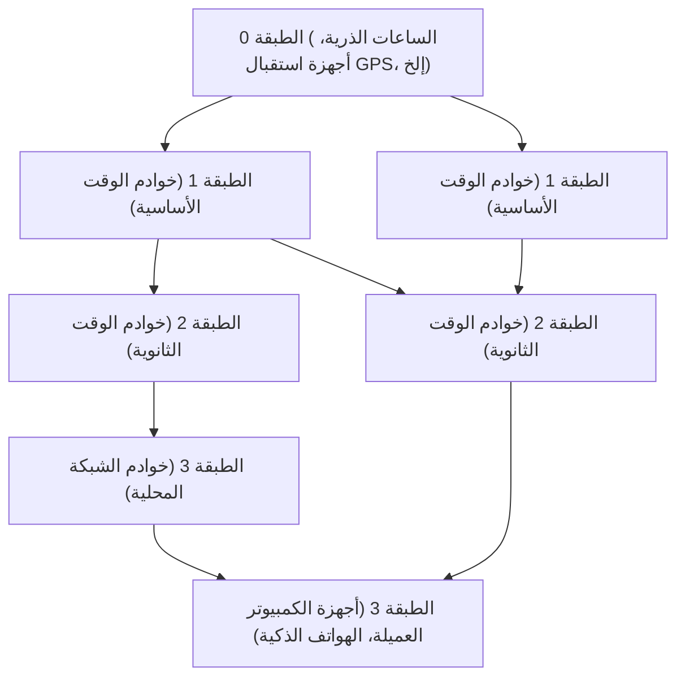

في المجتمع الرقمي الحديث، أصبح "الوقت الدقيق" أمراً مسلماً به كالهواء. عندما تفتح هاتفك الذكي، يتم عرض الوقت بدقة بالثواني دائماً، وتبدأ الاجتماعات عبر الإنترنت في الوقت المحدد، ويتم تسجيل المعاملات المالية بدقة تصل إلى أجزاء من الألف من الثانية (مللي ثانية). ولكن، كيف تشارك أجهزة الكمبيوتر التي لا حصر لها والتي تعمل بشكل مستقل على الإنترنت الوقت بهذه الدقة العالية؟

وراء ذلك، تعمل تقنية قديمة ولكنها متطورة للغاية تُعرف باسم **NTP (بروتوكول وقت الشبكة)**. في هذا المقال، سنتعمق في الشرح من منظور التكنولوجيا والهندسة، بدءاً من آلية مزامنة الوقت في البنية التحتية لتكنولوجيا المعلومات وصولاً إلى مزامنة الوقت المستقبلية التي تجلبها أحدث "الساعات الشبكية البصرية".

## لماذا تحتاج أجهزة الكمبيوتر إلى مزامنة الوقت؟

تحتوي أجهزة الكمبيوتر الشخصية والخوادم التي نستخدمها على ساعة صغيرة مدمجة في اللوحة الأم تسمى RTC (ساعة الوقت الفعلي). يتم تشغيلها بواسطة بطارية خلوية صغيرة وتستمر في حساب الوقت حتى عند إيقاف تشغيل الكمبيوتر. ومع ذلك، فإن هذه الساعة التي تستخدم مذبذب الكوارتز تكون عرضة للتغيرات في درجات الحرارة والتدهور بمرور الوقت، وليس من النادر أن يحدث انحراف (Drift) بمقدار بضع ثوانٍ إلى عشرات الثواني يومياً.

ماذا سيحدث إذا كانت أوقات الخوادم في جميع أنحاء العالم مختلفة؟

- **عدم اتساق السجلات**: عند حدوث فشل في النظام، حتى لو قمنا بمقارنة سجلات خوادم متعددة، فمن المستحيل تحديد السبب إذا كانت الأوقات غير متزامنة.
- **الثغرات الأمنية**: تذاكر المصادقة (مثل مصادقة Kerberos) والشهادات صارمة فيما يتعلق بتواريخ انتهاء الصلاحية. إذا كان الوقت غير دقيق، فقد لا يتمكن حتى المستخدمون الشرعيون من تسجيل الدخول، أو قد يكون هناك خطر السماح بالوصول غير المصرح به.
- **تناقض قاعدة البيانات**: في قواعد البيانات الموزعة، يتم تحديث البيانات عبر عقد (Nodes) متعددة. إذا كانت الطوابع الزمنية غير صحيحة، فسيحدث "فقدان البيانات" حيث تتجاوز البيانات القديمة البيانات الجديدة.

وهكذا، فإن "مشاركة الوقت الدقيق" في البنية التحتية لتكنولوجيا المعلومات هي عنصر حيوي يمكن اعتباره بمثابة الدم في النظام.

## آلية عمل بروتوكول وقت الشبكة (NTP)

يعد NTP أحد أقدم البروتوكولات في تاريخ الإنترنت، وقد صممه البروفيسور ديفيد إل ميلز في جامعة ديلاوير في عام 1985. يستخدم منفذ UDP رقم 123 ويمتلك آلية لحساب تأخير الشبكة ومزامنة الوقت الدقيق.

### ضمان الدقة من خلال الهيكل الهرمي (Stratum)

تمتلك شبكات NTP هيكلاً هرمياً يُعرف باسم "Stratum" (الطبقة).

- **الطبقة 0 (Stratum 0)**: المصدر الأكثر دقة للوقت. يشمل هذا الساعات الذرية للسيزيوم أو الروبيديوم، أو الأجهزة التي تستقبل إشارات الوقت من أقمار GPS الصناعية. لا تتصل هذه الأجهزة مباشرة بالشبكة.
- **الطبقة 1 (Stratum 1)**: الخوادم المتصلة مباشرة بأجهزة الطبقة 0 عبر كابلات مخصصة. تتميز بدقة عالية جداً (بمستوى الميكروثانية).
- **الطبقة 2 (Stratum 2)**: الخوادم التي تحصل على الوقت من خوادم الطبقة 1 عبر الشبكة. تندرج معظم خوادم NTP العامة على الإنترنت ضمن هذه الفئة. تحصل على الوقت من عدة خوادم في الطبقة 1 وتتصل ببعضها البعض لزيادة الدقة.
- **الطبقة 3 وما بعدها (Stratum 3 and beyond)**: الخوادم ذات المستوى الأدنى، والأجهزة الطرفية مثل أجهزة الكمبيوتر الشخصية والهواتف الذكية. يتم تعريف طبقات Stratum حتى 15، ويمثل الرقم 16 "عدم القدرة على المزامنة".

### سحر تصحيح تأخير الشبكة

أروع ما في NTP هو أنه يمتلك خوارزمية لحساب "التأخير" (Delay) عندما تنتقل الحزم عبر الشبكة ذهاباً وإياباً، بالإضافة إلى "عدم التماثل" (Dispersion) في وقت الذهاب والعودة، ومن ثم يقوم بتصحيح ساعة العميل بناءً على ذلك.

عندما يستعلم العميل من الخادم عن الوقت، فإنه يسجل الطوابع الزمنية الأربعة التالية:

1. الوقت الذي أرسل فيه العميل الطلب
2. الوقت الذي تلقى فيه الخادم الطلب
3. الوقت الذي أرسل فيه الخادم الرد
4. الوقت الذي تلقى فيه العميل الرد

من خلال هذه الفروق الزمنية، يقوم NTP رياضياً باشتقاق تأخير إرسال الشبكة (الوقت المستغرق في الذهاب والإياب مطروحاً منه وقت معالجة الخادم) وفرق الوقت (الإزاحة - Offset) بين ساعتي العميل والخادم. يتيح هذا الحساب مزامنة الوقت بدقة تصل إلى مللي ثانية (جزء من الألف من الثانية)، حتى عبر الإنترنت حيث يمكن أن يكون هناك تأخير في الاتصال يتراوح من بضعة إلى عشرات المللي ثانية.

## نحو مزامنة أعلى دقة: PTP والساعات الشبكية البصرية

يمتلك NTP دقة أكثر من كافية للاستخدامات العامة، ولكن في مجالات التكنولوجيا المتقدمة الحديثة، أصبح هناك طلب على مستويات أعلى من الدقة.

على سبيل المثال، في التزامن بين المحطات الأساسية لشبكات الهاتف المحمول 5G، أو في الأنظمة المالية التي تجري التداول عالي التردد (HFT)، تكون الدقة بمستوى الميكروثانية (جزء من المليون من الثانية) إلى النانوثانية (جزء من المليار من الثانية) مطلوبة. في هذا المجال، يتم استخدام بروتوكول يسمى **PTP (بروتوكول الوقت الدقيق: IEEE 1588)** بدلاً من NTP. يقوم PTP بوضع الطوابع الزمنية على مستوى الأجهزة، مما يحقق مزامنة بدقة النانوثانية في بيئات الشبكة الصارمة للغاية.

### "الساعة الشبكية البصرية" - ساعة المستقبل المطلقة

علاوة على ذلك، فإن ما يجذب الانتباه حالياً في طليعة العلوم والتكنولوجيا هو "**الساعة الشبكية البصرية**".

حالياً، يُعرّف النظام الدولي للوحدات (SI) الثانية الواحدة بأنها "المدة التي تعادل 9,192,631,770 دورة من الإشعاع المقابل للانتقال بين مستويين فائقين في الحالة الأرضية لذرة السيزيوم-133". تتمتع ساعات السيزيوم الذرية بدقة مذهلة بحيث لا تنحرف سوى بمقدار ثانية واحدة كل عشرات الملايين من السنين، إلا أن الساعات الشبكية البصرية تتجاوز ذلك بكثير.

ابتكر البروفيسور هيديتوشي كاتوري وفريقه من جامعة طوكيو الساعة الشبكية البصرية، والتي تقوم باحتجاز ذرات مثل السترونتيوم في "كرتون بيض ضوئي (شبكة بصرية)" تم إنشاؤه بواسطة ضوء الليزر، وتقيس اهتزازات عشرات الآلاف من الذرات في وقت واحد لزيادة الدقة بشكل كبير. وقد وصلت دقتها إلى مستوى يفوق الخيال، حيث يقال إنها "لن تنحرف بمقدار ثانية واحدة حتى بعد انقضاء عمر الكون (حوالي 13.8 مليار سنة)".

### المستقبل الذي تتقاطع فيه البنية التحتية لتكنولوجيا المعلومات مع الساعات الشبكية البصرية

إذن، كيف ترتبط هذه الساعة المطلقة بالبنية التحتية لتكنولوجيا المعلومات؟

بمجرد وضع الساعات الشبكية البصرية حيز الاستخدام العملي، وإنشاء تقنيات توزيع وقت عالي الدقة عبر تصغير حجمها وشبكات الألياف الضوئية، فإن أساس البنية التحتية للاتصالات سيتطور بشكل جذري.

1. **مزامنة الشبكة فائقة الدقة**: إذا تمت مزامنة الإنترنت بالكامل بمستوى النانوثانية أو البيكوثانية، فإن مفهوم الحوسبة الموزعة بحد ذاته سيتغير. ستصبح البروتوكولات المعقدة التي تأخذ التأخير في الاعتبار غير ضرورية، وسيصبح من الممكن للخوادم في جميع أنحاء العالم أن تعمل في تزامن تام كما لو كانت جهاز كمبيوتر عملاق واحد.
2. **تطبيقات تكنولوجيا المعلومات للجيوديسيا النسبية**: وفقاً للنظرية النسبية العامة لأينشتاين، فإن الوقت يمر بشكل أبطأ في الأماكن التي تكون فيها الجاذبية أقوى (على ارتفاعات منخفضة). بفضل دقة الساعات الشبكية البصرية، من الممكن اكتشاف تأخير الوقت الناتج عن فرق في الارتفاع لا يتجاوز سنتيمتراً واحداً. وهذا يفتح المجال أمام الساعات المثبتة في كل مركز بيانات أو عقدة شبكة للعمل كشبكة استشعار ضخمة تكتشف ارتفاعاتها الخاصة وتحركات القشرة الأرضية.
3. **أساس تقنية التشفير الجديدة**: في الاتصالات الكمية وأنظمة التشفير من الجيل التالي، تعتبر مزامنة الوقت الدقيقة للغاية أساساً للأمن. إن البنية التحتية القادرة على ضمان "التزامن" المطلق سترتقي بالأمن السيبراني إلى بُعد جديد تماماً.

## خاتمة

تدعم تقنية NTP القديمة النظام البيئي الضخم للإنترنت اليوم، وتوحد "نبض" أجهزة الكمبيوتر حول العالم. إن الوقت الدقيق الذي نتمتع به دون وعي يبدأ من الساعات الذرية في الطبقة 0، ويمر عبر شبكات متعددة وسحر الخوارزميات، ليصل في النهاية إلى هواتفنا الذكية.

والآن، توشك الإنجازات في العلوم الأساسية والمتمثلة في الساعات الشبكية البصرية على الاندماج مع تكنولوجيا الاتصالات والبنية التحتية لتكنولوجيا المعلومات. إن تطور تكنولوجيا قياس الوقت يرتبط مباشرة بتطور الحوسبة. عندما نفكر في الكيفية التي تقوم بها أجهزة الكمبيوتر حول العالم بمزامنة ساعاتها، ندرك العمق الهائل للتكنولوجيا التي بنتها البشرية.
