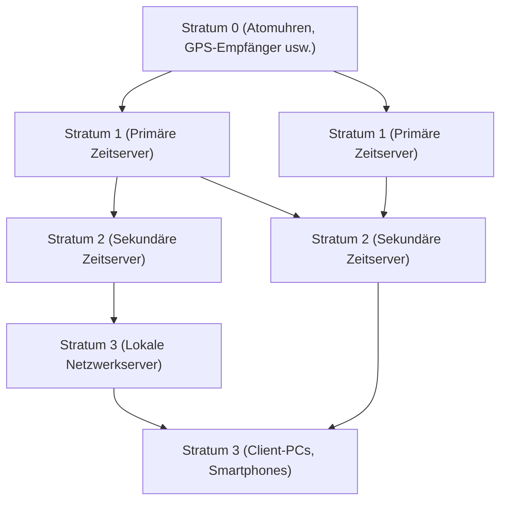

In der modernen digitalen Gesellschaft ist "genaue Zeit" so selbstverständlich wie die Luft zum Atmen geworden. Wenn Sie Ihr Smartphone öffnen, wird immer die genaue Zeit auf die Sekunde genau angezeigt, Online-Meetings beginnen pünktlich, und Finanztransaktionen werden mit Millisekunden-Genauigkeit aufgezeichnet. Aber wie teilen unzählige Computer, die autonom im Internet arbeiten, die Zeit so genau?

Dahinter arbeitet **NTP (Network Time Protocol)**, eine Technologie, die es schon lange gibt, aber extrem ausgefeilt ist. In diesem Artikel werden wir aus der Perspektive von Technologie und Engineering tief in die Mechanismen der Zeitsynchronisation in der IT-Infrastruktur bis hin zur zukünftigen Zeitsynchronisation durch die neuesten "optischen Gitteruhren" eintauchen.

## Warum benötigen Computer Zeitsynchronisation?

Die PCs und Server, die wir verwenden, haben eine kleine eingebaute Uhr namens RTC (Real-Time Clock) auf dem Motherboard. Diese wird von einer Knopfzelle betrieben und tickt weiter, auch wenn der Computer ausgeschaltet ist. Diese Uhr, die einen Quarzoszillator verwendet, ist jedoch anfällig für Temperaturänderungen und Alterung, und es ist nicht ungewöhnlich, dass eine Abweichung (Drift) von einigen Sekunden bis zu mehreren ten Sekunden pro Tag auftritt.

Was würde passieren, wenn die Server auf der ganzen Welt unterschiedliche Zeiten hätten?

- **Inkonsistente Protokolle**: Wenn ein Systemfehler auftritt, ist es unmöglich, die Ursache zu untersuchen, wenn die Protokolle mehrerer Server verglichen werden, aber die Zeiten nicht übereinstimmen.
- **Sicherheitsschwachstellen**: Authentifizierungstickets (wie Kerberos) und Zertifikate haben strikte Ablaufdaten. Wenn die Zeit nicht stimmt, können sich selbst legitime Benutzer möglicherweise nicht anmelden, oder es besteht die Gefahr eines unbefugten Zugriffs.
- **Datenbank-Inkonsistenzen**: In verteilten Datenbanken werden Daten über mehrere Knoten hinweg aktualisiert. Wenn die Zeitstempel falsch sind, kann es zu einem "Datenverlust" kommen, bei dem neue Daten mit alten Daten überschrieben werden.

Auf diese Weise ist das "Teilen genauer Zeit" ein so wichtiges Element in der IT-Infrastruktur, dass man es als das Blut des Systems bezeichnen könnte.

## Die Funktionsweise von NTP (Network Time Protocol)

NTP ist eines der sehr alten Protokolle in der Geschichte des Internets, das 1985 von Professor David L. Mills an der University of Delaware entwickelt wurde. Es verwendet UDP-Port 123 und verfügt über einen Mechanismus, um Netzwerkverzögerungen zu berechnen und die genaue Zeit zu synchronisieren.

### Sicherstellung der Genauigkeit durch Hierarchiestruktur (Stratum)

Das NTP-Netzwerk hat eine hierarchische Struktur namens "Stratum".

- **Stratum 0**: Die genaueste Zeitquelle. Dazu gehören Hardware wie Cäsium- und Rubidium-Atomuhren oder Empfänger für Zeitsignale von GPS-Satelliten. Diese sind nicht direkt mit dem Netzwerk verbunden.
- **Stratum 1**: Server, die über dedizierte Kabel direkt mit Stratum-0-Geräten verbunden sind. Sie verfügen über eine sehr hohe Genauigkeit (im Mikrosekundenbereich).
- **Stratum 2**: Server, die die Zeit über das Netzwerk von Stratum-1-Servern beziehen. Die meisten öffentlichen NTP-Server im Internet fallen in diese Kategorie. Sie beziehen die Zeit von mehreren Stratum-1-Servern und verbinden sich als Peers untereinander, um die Genauigkeit zu verbessern.
- **Stratum 3 und darunter**: Server der unteren Ebenen und Endgeräte wie unsere PCs und Smartphones. Stratum ist bis zu maximal 15 definiert, wobei 16 "nicht synchronisiert" bedeutet.

### Die Magie der Kompensation von Netzwerkverzögerungen

Das Großartigste an NTP ist, dass es einen Algorithmus hat, der die "Verzögerung (Delay)" und die "Asymmetrie (Dispersion)" der Zeit für Hin- und Rückweg berechnet, wenn ein Paket das Netzwerk durchläuft, und die Uhr des Clients entsprechend anpasst.

Wenn ein Client den Server nach der Zeit fragt, zeichnet er die folgenden vier Zeitstempel auf:

1. Die Zeit, zu der der Client die Anfrage gesendet hat
2. Die Zeit, zu der der Server die Anfrage empfangen hat
3. Die Zeit, zu der der Server die Antwort gesendet hat
4. Die Zeit, zu der der Client die Antwort empfangen hat

Aus diesen Zeitunterschieden leitet NTP mathematisch die Übertragungsverzögerung des Netzwerks (Round-Trip-Zeit abzüglich der Verarbeitungszeit des Servers) und den Zeitunterschied (Offset) zwischen der Client- und der Server-Uhr ab. Durch diese Berechnung kann die Zeit auch über das Internet, wo Kommunikationsverzögerungen von einigen Millisekunden bis zu mehreren zehn Millisekunden auftreten, mit einer Genauigkeit im Millisekundenbereich (1/1000 Sekunde) synchronisiert werden.

## Auf dem Weg zu hochpräziser Synchronisation: PTP und optische Gitteruhren

NTP bietet mehr als genug Genauigkeit für allgemeine Zwecke, aber in modernen Spitzentechnologiebereichen wird noch höhere Genauigkeit gefordert.

Zum Beispiel erfordert die Synchronisation zwischen Basisstationen von 5G-Mobilfunknetzen und Finanzsystemen, die Hochfrequenzhandel (HFT) betreiben, Genauigkeiten von Mikrosekunden (ein Millionstel einer Sekunde) bis hin zu Nanosekunden (ein Milliardstel einer Sekunde). In diesem Bereich wird ein Protokoll namens **PTP (Precision Time Protocol: IEEE 1588)** anstelle von NTP verwendet. PTP führt Zeitstempelung auf Hardwareebene durch und erreicht eine Synchronisation mit Nanosekundengenauigkeit in extrem strengen Netzwerkumgebungen.

### Die ultimative Uhr der nächsten Generation: Die "optische Gitteruhr"

Darüber hinaus erregen derzeit an vorderster Front von Wissenschaft und Technologie "optische Gitteruhren" viel Aufmerksamkeit.

Derzeit ist eine Sekunde im Internationalen Einheitensystem (SI) definiert als "die Dauer von 9.192.631.770 Perioden der Strahlung, die dem Übergang zwischen den beiden Hyperfeinstrukturniveaus des Grundzustands von Atomen des Nuklids Cäsium-133 entspricht". Während Cäsium-Atomuhren eine erstaunliche Genauigkeit von nur einer Sekunde Abweichung in zig Millionen Jahren aufweisen, übertreffen optische Gitteruhren diese sogar noch.

Die von Professor Hidetoshi Katori und seinem Team an der Universität Tokio erfundene optische Gitteruhr fängt Atome wie Strontium in einem aus Laserlicht erzeugten "optischen Eierkarton (optisches Gitter)" ein und misst die Schwingungen von Zehntausenden von Atomen auf einmal, wodurch die Genauigkeit drastisch erhöht wird. Ihre Genauigkeit hat ein unvorstellbares Niveau erreicht, bei dem sie "selbst nach Ablauf des Alters des Universums (etwa 13,8 Milliarden Jahre) nicht um eine einzige Sekunde abweicht".

### Die Zukunft, in der IT-Infrastruktur und optische Gitteruhren aufeinandertreffen

Wie wird diese ultimative Uhr also in die IT-Infrastruktur integriert?

Sobald optische Gitteruhren praktikabel, miniaturisiert und hochpräzise Zeitverteilungstechnologien über Glasfasernetzwerke etabliert sind, wird sich die Grundlage der Kommunikationsinfrastruktur dramatisch weiterentwickeln.

1. **Ultrahochpräzise Netzwerksynchronisation**: Wenn das gesamte Internet im Bereich von Nanosekunden und Pikosekunden synchronisiert ist, wird sich das Konzept des verteilten Rechnens selbst verändern. Komplexe Protokolle, die Verzögerungen berücksichtigen, werden unnötig, und Server auf der ganzen Welt können als ein einziger riesiger Computer in perfekter Synchronisation arbeiten.
2. **IT-Anwendung der relativistischen Geodäsie**: Nach Einsteins Allgemeiner Relativitätstheorie vergeht die Zeit an Orten mit stärkerer Schwerkraft (geringere Höhe) langsamer. Mit der Genauigkeit optischer Gitteruhren kann eine Zeitverzögerung aufgrund eines Höhenunterschieds von nur 1 cm erfasst werden. Dadurch können in jedem Rechenzentrum und Netzwerkknoten installierte Uhren als riesiges Sensornetzwerk fungieren, um ihre eigene Höhe und Krustenbewegungen zu erfassen.
3. **Grundlage für neue kryptografische Technologien**: In der Quantenkommunikation und bei Kryptografiesystemen der nächsten Generation ist eine extrem genaue Zeitsynchronisation der Kern der Sicherheit. Eine Infrastruktur, die absolute "Gleichzeitigkeit" garantieren kann, wird die Cybersicherheit auf ein völlig neues Niveau heben.

## Fazit

Die uralte Technologie namens NTP unterstützt das heutige riesige Ökosystem des Internets und hält den "Herzschlag" der Computer auf der ganzen Welt im Einklang. Die genaue Zeit, die wir unbewusst genießen, beginnt bei den Atomuhren von Stratum 0, durchläuft die Magie zahlreicher Netzwerke und Algorithmen und wird an unsere Smartphones geliefert.

Und nun steht der Durchbruch in der Grundlagenforschung der optischen Gitteruhren kurz davor, mit der Kommunikationstechnologie und der IT-Infrastruktur zu verschmelzen. Die Entwicklung der Zeitmesstechnik ist direkt mit der Entwicklung der Datenverarbeitung verbunden. Wenn wir über die Mechanismen nachdenken, wie Computer auf der ganzen Welt ihre Uhren abgleichen, erkennen wir die unglaubliche Tiefe der Technologie, die die Menschheit aufgebaut hat.
