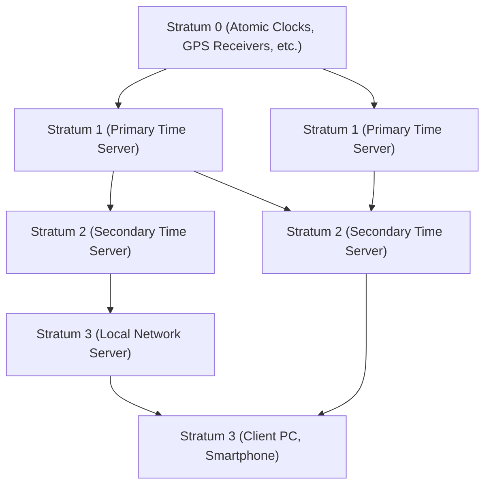

In modern digital society, "accurate time" has become as commonplace as the air we breathe. Whenever we open our smartphones, the exact time is always displayed down to the second, online meetings start at the scheduled time, and financial transactions are recorded with millisecond precision. But how do countless computers running autonomously on the internet manage to share time so accurately?

Behind this is a highly refined, albeit old, technology called **NTP (Network Time Protocol)**. In this article, we will take a deep dive from a technology and engineering perspective, exploring the mechanisms of time synchronization in IT infrastructure and how the latest "optical lattice clocks" will shape the future of time synchronization.

## Why Do Computers Need Time Synchronization?

The PCs and servers we use have a small clock built into the motherboard called an RTC (Real-Time Clock). Powered by a coin cell battery or similar, it keeps time even when the computer is turned off. However, these clocks, which use crystal oscillators, are susceptible to temperature changes and aging degradation, and it is not uncommon for them to drift by a few to tens of seconds per day.

What would happen if server times around the world were completely unaligned?

- **Log inconsistencies**: When a system failure occurs, cross-referencing logs from multiple servers makes finding the root cause impossible if their times are out of sync.
- **Security vulnerabilities**: Authentication tickets (such as Kerberos authentication) and certificates have strict expiration dates. Time drift can prevent legitimate users from logging in or risk allowing unauthorized access.
- **Database contradictions**: In distributed databases, data is updated across multiple nodes. If timestamps are incorrect, "data loss" occurs where new data is overwritten by old data.

In this way, "sharing accurate time" is a crucial element in IT infrastructure, almost like the lifeblood of a system.

## How NTP (Network Time Protocol) Works

NTP, designed by Professor David L. Mills of the University of Delaware in 1985, is one of the very old protocols in internet history. Using UDP port 123, it incorporates a mechanism to calculate network delays and accurately synchronize time.

### Ensuring Accuracy through a Hierarchical Structure (Stratum)

The NTP network has a hierarchical structure called "Stratum".

- **Stratum 0**: The most accurate time sources. This includes hardware such as cesium atomic clocks, rubidium atomic clocks, or devices receiving time signals from GPS satellites. These are not directly connected to the network.
- **Stratum 1**: Servers directly connected to Stratum 0 devices via dedicated cables. They boast very high precision (microsecond level).
- **Stratum 2**: Servers that obtain time from Stratum 1 servers via the network. Most public NTP servers on the internet fall into this category. They retrieve time from multiple Stratum 1 servers and peer with each other to improve accuracy.
- **Stratum 3 and below**: Lower-tier servers and end devices like our PCs and smartphones. Stratum is defined up to a maximum of 15, with 16 meaning "unsynchronized".

### The Magic of Network Delay Compensation

The most brilliant aspect of NTP is its algorithm that calculates the "Delay" as packets travel back and forth across the network and the "Dispersion" (asymmetry) of the round-trip times, to correct the client's clock.

When a client queries a server for the time, it records the following four timestamps:

1. The time the client sent the request
2. The time the server received the request
3. The time the server sent the response
4. The time the client received the response

From these time differences, NTP mathematically derives the network transmission delay (round-trip time minus the server's processing time) and the clock drift (offset) between the client and server. Through this calculation, it can synchronize time with millisecond (1/1000th of a second) precision, even over the internet where communication experiences delays of several to tens of milliseconds.

## Towards Higher Precision Synchronization: PTP and Optical Lattice Clocks

While NTP has more than enough precision for general use, modern cutting-edge technology fields are demanding even higher precision.

For example, synchronization between 5G mobile network base stations and financial systems conducting High-Frequency Trading (HFT) require precision at the microsecond (one millionth of a second) or nanosecond (one billionth of a second) level. In this domain, a protocol called **PTP (Precision Time Protocol: IEEE 1588)** is used instead of NTP. PTP applies timestamps at the hardware level, achieving nanosecond-precision synchronization under extremely strict network environments.

### The Ultimate Next-Generation Clock: The "Optical Lattice Clock"

Furthermore, what is currently drawing attention at the forefront of science and technology is the "**Optical Lattice Clock**".

Currently, one second in the International System of Units (SI) is defined as "the duration of 9,192,631,770 periods of the radiation corresponding to the transition between the two hyperfine levels of the ground state of the cesium 133 atom." The cesium atomic clock boasts an astonishing precision, losing only one second every tens of millions of years, but the optical lattice clock surpasses even that.

Invented by Professor Hidetoshi Katori and his team at the University of Tokyo, the optical lattice clock confines atoms like strontium in an "egg carton of light" (optical lattice) created by laser light, and simultaneously measures the vibrations of tens of thousands of atoms, dramatically increasing precision. Its precision has reached a level beyond imagination: "it will not drift by even one second over the age of the universe (about 13.8 billion years)."

### The Future Where IT Infrastructure and Optical Lattice Clocks Intersect

So, how will this ultimate clock relate to IT infrastructure?

Once optical lattice clocks are commercialized, miniaturized, and highly precise time distribution technologies via fiber-optic networks are established, the foundation of communication infrastructure will evolve dramatically.

1. **Ultra-High Precision Network Synchronization**: If the entire internet is synchronized at the nanosecond or picosecond level, the very concept of distributed computing will change. Complex protocols that account for delays will become unnecessary, and servers worldwide will be able to operate perfectly synchronized, as if they were a single giant computer.
2. **IT Application of Relativistic Geodesy**: According to Einstein's theory of general relativity, time passes slower where gravity is stronger (at lower elevations). With the precision of an optical lattice clock, time delays caused by an elevation difference of just 1 cm can be detected. This means clocks installed at data centers or network nodes could function as a massive sensor network, detecting their own elevations and crustal movements.
3. **Foundation for New Cryptographic Technologies**: In quantum communication and next-generation cryptographic systems, extremely precise time synchronization forms the core of security. An infrastructure capable of guaranteeing absolute "simultaneity" will elevate cybersecurity to an entirely new dimension.

## Conclusion

The venerable technology known as NTP supports the massive ecosystem of today's internet, synchronizing the "heartbeats" of computers all over the world into one. The accurate time we enjoy without a second thought originates from Stratum 0 atomic clocks, passes through the magic of layers of networks and algorithms, and is delivered to the smartphones in our hands.

And now, a breakthrough in fundamental science—the optical lattice clock—is on the verge of converging with communication technology and IT infrastructure. The evolution of timekeeping technology directly translates to the evolution of computing. When we ponder the mechanism of how computers around the world align their clocks, we are made to realize the fathomless depth of the technology humanity has built.
